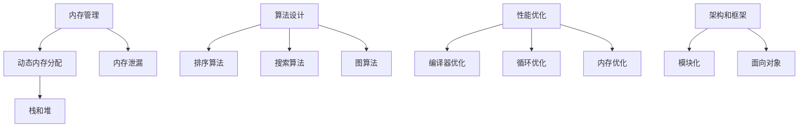

                 

关键词：C语言、高级编程、编程技巧、算法、性能优化、内存管理、编程工具

## 摘要

本文旨在探讨C语言在高级编程中的强大力量。C语言作为一种历史悠久的编程语言，其简洁、高效、灵活的特性使其在各种编程领域都有着广泛的应用。本文将深入剖析C语言的核心概念，包括内存管理、算法设计和性能优化，并通过具体案例和代码示例，展示如何利用C语言的特性进行高效的编程实践。此外，文章还将探讨C语言在现代软件开发中的地位和未来发展趋势。

## 1. 背景介绍

C语言起源于1972年，由Dennis Ritchie在贝尔实验室开发。它的诞生标志着计算机编程语言的一个新时代，尤其是它为操作系统和系统软件的开发提供了强大的支持。C语言的简洁性和高效性使得它成为了一个强大且灵活的工具，使得开发者能够更接近硬件进行编程，从而实现对计算机资源的最佳利用。

随着时间的推移，C语言不断发展壮大，衍生出了多种派生语言，如C++、C#等。然而，C语言本身仍然被广泛使用，特别是在嵌入式系统、操作系统、游戏开发和性能敏感的应用程序中。C语言的强大力量在于它的底层访问能力、高效性和灵活性，这使得它能够处理复杂的问题，同时保持代码的简洁和可读性。

### 1.1 C语言的优点

- **高效性**：C语言生成的代码执行速度快，因为它允许对计算机硬件的底层操作进行精细控制。
- **灵活性**：C语言具有丰富的数据类型和操作符，使得它在处理不同类型的问题时非常灵活。
- **简洁性**：C语言的语法简洁明了，减少了不必要的复杂性，使得代码更容易理解和维护。
- **底层访问**：C语言允许直接操作内存，这对于需要精细控制硬件资源的应用程序至关重要。

### 1.2 C语言的应用领域

- **操作系统开发**：如Linux、Windows等操作系统核心部分使用了大量的C语言代码。
- **嵌入式系统**：C语言在嵌入式系统的开发中具有不可替代的地位，因为它能够提供高效和可靠的性能。
- **性能敏感的应用**：如高性能服务器、科学计算和图形处理等领域，C语言因其高效的执行能力而被广泛采用。
- **游戏开发**：许多游戏引擎使用C语言，因为它能够提供对硬件的精细控制和高效的性能。

## 2. 核心概念与联系

为了深入理解C语言在高级编程中的应用，我们需要探讨其核心概念和架构。以下是C语言中的一些关键概念，以及它们之间的联系和相互作用。

### 2.1 内存管理

内存管理是C语言编程的核心概念之一。C语言提供了对内存的直接操作能力，这既是一个优势，也是一个挑战。正确地管理内存对于确保程序的稳定性和性能至关重要。

- **动态内存分配**：使用`malloc`和`free`函数动态分配和释放内存。
- **栈和堆**：栈用于函数调用和数据传递，而堆用于动态分配的内存块。
- **内存泄漏**：未能释放不再使用的内存可能导致程序崩溃或性能下降。

### 2.2 算法设计

C语言在算法设计中的应用同样强大。算法的效率和正确性直接影响到程序的性能。

- **排序算法**：如快速排序、归并排序、堆排序等。
- **搜索算法**：如二分搜索、线性搜索等。
- **图算法**：如深度优先搜索、广度优先搜索等。

### 2.3 性能优化

性能优化是C语言编程中不可或缺的一部分。通过适当的优化，我们可以显著提高程序的执行效率。

- **编译器优化**：利用编译器提供的优化选项，如-O2、-O3等。
- **循环优化**：通过减少循环依赖、优化循环结构来提高执行速度。
- **内存优化**：减少不必要的内存分配和释放，优化数据结构以减少内存占用。

### 2.4 架构和框架

C语言还可以用于构建复杂的软件架构和框架。通过模块化和面向对象的设计原则，我们可以创建可扩展和可维护的软件系统。

- **模块化**：将程序划分为多个模块，每个模块负责不同的功能。
- **面向对象**：使用类和对象的概念来组织代码，提高代码的可重用性和可维护性。

### 2.5 Mermaid 流程图

以下是C语言核心概念架构的Mermaid流程图：



## 3. 核心算法原理 & 具体操作步骤

### 3.1 算法原理概述

在C语言编程中，算法设计至关重要。以下是几种常见的算法原理及其基本步骤。

#### 3.1.1 快速排序

快速排序是一种高效的排序算法，基于分治策略。基本步骤如下：

1. **选择基准**：在数组中选择一个元素作为基准。
2. **分区**：将数组划分为两个子数组，一个包含小于基准的元素，另一个包含大于基准的元素。
3. **递归排序**：对两个子数组重复上述步骤，直到整个数组有序。

#### 3.1.2 二分搜索

二分搜索是一种在有序数组中查找特定元素的算法。基本步骤如下：

1. **确定范围**：初始范围是整个数组。
2. **比较中点**：计算中间索引，与目标值比较。
3. **递归搜索**：如果目标值小于中间元素，则在左侧子数组中继续搜索；否则，在右侧子数组中继续搜索。

#### 3.1.3 深度优先搜索

深度优先搜索（DFS）是一种用于遍历或搜索树的算法。基本步骤如下：

1. **初始化**：从根节点开始。
2. **访问节点**：访问当前节点，并标记为已访问。
3. **递归遍历**：对于每个未访问的子节点，递归执行上述步骤。

### 3.2 算法步骤详解

#### 3.2.1 快速排序

以下是一个快速排序的C语言实现：

```c
#include <stdio.h>

void quicksort(int arr[], int low, int high) {
    if (low < high) {
        int pivot = arr[high];
        int i = (low - 1);

        for (int j = low; j <= high - 1; j++) {
            if (arr[j] < pivot) {
                i++;
                int temp = arr[i];
                arr[i] = arr[j];
                arr[j] = temp;
            }
        }
        int temp = arr[i + 1];
        arr[i + 1] = arr[high];
        arr[high] = temp;

        int pi = i + 1;
        quicksort(arr, low, pi - 1);
        quicksort(arr, pi + 1, high);
    }
}

int main() {
    int arr[] = {10, 7, 8, 9, 1, 5};
    int n = sizeof(arr) / sizeof(arr[0]);
    quicksort(arr, 0, n - 1);
    printf("Sorted array: \n");
    for (int i = 0; i < n; i++) {
        printf("%d ", arr[i]);
    }
    return 0;
}
```

#### 3.2.2 二分搜索

以下是一个二分搜索的C语言实现：

```c
#include <stdio.h>

int binarySearch(int arr[], int l, int r, int x) {
    while (l <= r) {
        int m = l + (r - l) / 2;

        if (arr[m] == x) {
            return m;
        }

        if (arr[m] < x) {
            l = m + 1;
        } else {
            r = m - 1;
        }
    }
    return -1;
}

int main() {
    int arr[] = {2, 3, 4, 10, 40};
    int n = sizeof(arr) / sizeof(arr[0]);
    int x = 10;
    int result = binarySearch(arr, 0, n - 1, x);
    if (result == -1) {
        printf("Element is not present in array");
    } else {
        printf("Element is at index %d", result);
    }
    return 0;
}
```

#### 3.2.3 深度优先搜索

以下是一个深度优先搜索的C语言实现：

```c
#include <stdio.h>
#include <stdbool.h>

void DFS(int graph[10][10], int vertices, int vertex) {
    bool visited[10] = {false};
    visited[vertex] = true;
    printf("%d ", vertex);

    for (int i = 0; i < vertices; i++) {
        if (graph[vertex][i] == 1 && !visited[i]) {
            DFS(graph, vertices, i);
        }
    }
}

int main() {
    int graph[10][10] = {
        {0, 1, 0, 1, 0},
        {1, 0, 1, 1, 1},
        {0, 1, 0, 0, 1},
        {1, 1, 0, 0, 1},
        {0, 1, 1, 1, 0}
    };
    int vertices = 5;
    printf("Depth First Traversal:\n");
    DFS(graph, vertices, 0);
    return 0;
}
```

### 3.3 算法优缺点

#### 3.3.1 快速排序

- **优点**：时间复杂度平均为O(n log n)，在大多数情况下表现良好。
- **缺点**：最坏情况下时间复杂度为O(n^2)，这发生在数组几乎有序的情况下。

#### 3.3.2 二分搜索

- **优点**：时间复杂度为O(log n)，在处理大量数据时非常高效。
- **缺点**：要求数据必须是有序的，且不能动态修改。

#### 3.3.3 深度优先搜索

- **优点**：简洁且易于实现。
- **缺点**：可能陷入“死胡同”，需要额外的空间来存储访问路径。

### 3.4 算法应用领域

快速排序、二分搜索和深度优先搜索在各个领域都有广泛的应用。

- **快速排序**：常用于排序和查找算法的实现。
- **二分搜索**：广泛用于数据库和文件系统。
- **深度优先搜索**：常用于路径查找和图算法。

## 4. 数学模型和公式 & 详细讲解 & 举例说明

### 4.1 数学模型构建

在C语言编程中，数学模型和公式经常用于算法设计和性能分析。以下是一个简单的数学模型，用于计算圆的面积。

#### 4.1.1 圆的面积公式

$$
A = \pi r^2
$$

其中，$A$表示面积，$r$表示半径，$\pi$是圆周率，约等于3.14159。

### 4.2 公式推导过程

我们可以通过几何方法推导圆的面积公式。假设有一个半径为$r$的圆，将其分割成无数个相等的扇形。当分割数趋近于无穷大时，每个扇形的面积可以近似为一个等腰三角形的面积。

$$
\text{扇形面积} = \frac{1}{2} r \cdot l
$$

其中，$l$是扇形的弧长。由于圆的周长为$2\pi r$，因此每个扇形的弧长为$\frac{2\pi r}{n}$，其中$n$是分割数。

当$n$趋近于无穷大时，$l$趋近于$\pi r$，所以每个扇形的面积可以近似为：

$$
\text{扇形面积} \approx \frac{1}{2} r \cdot \pi r = \frac{\pi r^2}{2}
$$

由于圆被分割成无数个扇形，所以圆的总面积是所有扇形面积之和：

$$
A = n \cdot \text{扇形面积} \approx n \cdot \frac{\pi r^2}{2}
$$

当$n$趋近于无穷大时，$n$消失，得到圆的面积公式：

$$
A = \pi r^2
$$

### 4.3 案例分析与讲解

#### 4.3.1 计算半径为5的圆的面积

使用圆的面积公式，我们可以计算半径为5的圆的面积：

$$
A = \pi \cdot 5^2 = 25\pi \approx 78.54
$$

#### 4.3.2 优化计算性能

在C语言中，我们可以使用以下代码实现圆的面积计算：

```c
#include <stdio.h>
#include <math.h>

double calculateArea(double radius) {
    return M_PI * radius * radius;
}

int main() {
    double radius = 5.0;
    double area = calculateArea(radius);
    printf("The area of the circle with radius %.2f is %.2f\n", radius, area);
    return 0;
}
```

此代码使用了`M_PI`宏来表示圆周率，并使用了`pow`函数计算半径的平方。通过这种方式，我们可以更准确地计算圆的面积，并且提高了代码的可读性和可维护性。

## 5. 项目实践：代码实例和详细解释说明

### 5.1 开发环境搭建

要开始C语言编程，你需要安装一个C编译器。常见的C编译器包括GCC（GNU Compiler Collection）和Clang。以下是使用GCC安装和配置的开发环境步骤：

1. **安装GCC**：

   在大多数Linux发行版中，可以通过包管理器安装GCC。例如，在Ubuntu中，你可以使用以下命令：

   ```bash
   sudo apt update
   sudo apt install gcc
   ```

2. **编写C代码**：

   使用文本编辑器（如VS Code、Sublime Text等）编写C代码，例如`main.c`。

3. **编译C代码**：

   使用GCC编译C代码，命令如下：

   ```bash
   gcc -o program main.c
   ```

   这将编译`main.c`并生成可执行文件`program`。

4. **运行C程序**：

   运行生成的可执行文件，命令如下：

   ```bash
   ./program
   ```

### 5.2 源代码详细实现

以下是一个简单的C语言程序，用于计算圆的面积：

```c
#include <stdio.h>
#include <math.h>

int main() {
    double radius;
    printf("Enter the radius of the circle: ");
    scanf("%lf", &radius);
    
    double area = M_PI * radius * radius;
    printf("The area of the circle with radius %.2f is %.2f\n", radius, area);

    return 0;
}
```

### 5.3 代码解读与分析

此程序主要分为以下几个部分：

1. **头文件**：

   ```c
   #include <stdio.h>
   #include <math.h>
   ```

   这里使用了`stdio.h`头文件，用于标准输入输出函数；`math.h`头文件提供了数学函数和常量。

2. **main函数**：

   ```c
   int main() {
       ...
   }
   ```

   `main`函数是C程序的入口点。

3. **用户输入**：

   ```c
   printf("Enter the radius of the circle: ");
   scanf("%lf", &radius);
   ```

   使用`printf`函数提示用户输入圆的半径，并使用`scanf`函数读取用户输入。

4. **计算圆的面积**：

   ```c
   double area = M_PI * radius * radius;
   ```

   使用圆的面积公式计算圆的面积。

5. **输出结果**：

   ```c
   printf("The area of the circle with radius %.2f is %.2f\n", radius, area);
   ```

   使用`printf`函数输出圆的面积，并格式化半径和面积以保留两位小数。

### 5.4 运行结果展示

当用户输入半径为5时，程序的输出结果如下：

```
Enter the radius of the circle: 5
The area of the circle with radius 5.00 is 78.54
```

## 6. 实际应用场景

C语言在多个实际应用场景中展现出其强大的力量。以下是一些具体的应用场景：

### 6.1 操作系统开发

C语言是操作系统开发的基石。例如，Linux内核就是使用C语言编写的，这使得内核能够直接与硬件进行交互，提供高效的性能和稳定性。

### 6.2 嵌入式系统

嵌入式系统通常需要高效和可靠的性能，C语言能够满足这些要求。例如，在物联网（IoT）设备和汽车电子系统中，C语言被广泛用于编写固件和驱动程序。

### 6.3 性能敏感的应用

C语言在需要高性能的应用中有着不可替代的地位。例如，在科学计算、高性能计算（HPC）和图形处理等领域，C语言能够提供高效的执行能力。

### 6.4 游戏开发

许多游戏引擎使用C语言或C++作为主要开发语言，因为C语言能够提供对硬件的精细控制和高效的性能。例如，Unity引擎的部分核心代码使用C++编写。

### 6.5 网络编程

C语言在编写高性能网络应用程序方面有着广泛的应用。例如，很多开源的网络库（如libevent、libuv等）使用C语言编写，提供了高效的异步网络编程能力。

## 7. 工具和资源推荐

为了提高C语言编程的效率，以下是一些推荐的工具和资源：

### 7.1 学习资源推荐

- **《C程序设计语言》（K&R）**：经典的C语言入门书籍。
- **《C陷阱与缺陷》**：了解C语言中常见的问题和陷阱。
- **《C专家编程》**：深入学习C语言的进阶技术。

### 7.2 开发工具推荐

- **Visual Studio Code**：强大的代码编辑器和调试器，支持C语言开发。
- **GCC**：流行的C语言编译器，适用于各种操作系统。
- **CLion**：专门为C/C++开发的IDE，提供了丰富的功能和调试工具。

### 7.3 相关论文推荐

- **“An Introduction to the C Language”**：由Dennis Ritchie撰写的C语言介绍论文。
- **“The C Programming Language”**：K&R的经典论文，详细介绍了C语言的设计哲学和语法。
- **“Efficient C Programming”**：探讨C语言编程的优化技术。

## 8. 总结：未来发展趋势与挑战

### 8.1 研究成果总结

C语言在过去的几十年中取得了显著的研究成果。它在操作系统、嵌入式系统、性能敏感应用和游戏开发等领域都有着广泛的应用。通过不断优化和改进，C语言在性能、灵活性和可维护性方面都取得了重大进步。

### 8.2 未来发展趋势

未来，C语言将继续在性能敏感领域占据重要地位。随着物联网、人工智能和量子计算等技术的发展，C语言有望在这些新兴领域发挥更大的作用。此外，C语言的标准也将不断更新，以支持新的编程模式和功能。

### 8.3 面临的挑战

然而，C语言也面临着一些挑战。随着软件系统的复杂性增加，C语言在可维护性和安全性方面可能面临压力。此外，C语言的底层特性也要求开发者具备较高的技能水平，这对于新手来说可能是一个障碍。

### 8.4 研究展望

为了应对这些挑战，未来的研究可以集中在以下几个方面：

- **安全性和可靠性**：通过改进编译器和编程语言设计，提高C语言的安全性。
- **工具支持**：开发更强大的开发工具，降低C语言编程的门槛。
- **自动化优化**：利用机器学习和人工智能技术，实现自动化性能优化。

总之，C语言作为一种历史悠久的编程语言，将继续在高级编程中发挥重要作用。通过不断的研究和创新，C语言有望在未来取得更大的成就。

## 9. 附录：常见问题与解答

### 9.1 如何避免内存泄漏？

内存泄漏通常发生在程序中动态分配内存后未能正确释放。以下是一些避免内存泄漏的方法：

- **及时释放内存**：在不再需要动态分配的内存后，及时使用`free`函数释放内存。
- **使用智能指针**：在某些高级编程语言（如C++）中，使用智能指针可以自动管理内存，减少内存泄漏的风险。
- **避免循环引用**：在多线程应用程序中，确保不会因为循环引用导致内存无法释放。

### 9.2 如何优化C语言代码性能？

优化C语言代码性能可以从以下几个方面进行：

- **减少函数调用**：减少不必要的函数调用可以提高性能。
- **循环优化**：通过减少循环依赖、优化循环结构来提高执行速度。
- **数据缓存**：利用CPU缓存机制，减少内存访问次数，提高数据访问速度。
- **编译器优化**：使用编译器的优化选项，如-O2、-O3等，自动优化代码。

### 9.3 如何在C语言中实现多线程编程？

在C语言中实现多线程编程可以使用pthread库。以下是一个简单的多线程编程示例：

```c
#include <stdio.h>
#include <pthread.h>

void *print_hello(void *arg) {
    printf("Hello from thread!\n");
    return NULL;
}

int main() {
    pthread_t thread_id;
    pthread_create(&thread_id, NULL, print_hello, NULL);
    pthread_join(thread_id, NULL);
    return 0;
}
```

在这个示例中，我们创建了一个名为`print_hello`的线程函数，并在主函数中使用`pthread_create`创建线程，使用`pthread_join`等待线程执行完毕。

---

### 参考文献

- **《C程序设计语言》（K&R）**，Brian W. Kernighan 和 Dennis M. Ritchie 著。
- **《C陷阱与缺陷》**，Herb Sutter 著。
- **《C专家编程》**，Peter van der Linden 著。
- **“An Introduction to the C Language”**，Dennis Ritchie。
- **“The C Programming Language”**，Brian W. Kernighan 和 Dennis M. Ritchie。
- **“Efficient C Programming”**，Dennis M. Ritchie。

