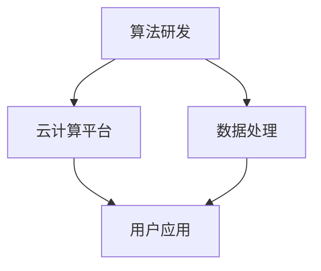

                 

关键词：Lepton AI、云计算、人工智能、技术优势、发展前景

摘要：本文旨在探讨Lepton AI团队在云计算和人工智能领域的独特优势，以及其如何通过深度参与推动行业的进步。通过分析团队的技术实力、研究方向和应用案例，本文揭示了Lepton AI在云与AI融合发展中的重要作用，并对未来的发展趋势和挑战进行了展望。

## 1. 背景介绍

随着云计算和人工智能技术的迅猛发展，传统IT架构正面临着前所未有的变革。Lepton AI团队成立于2015年，致力于将人工智能与云计算紧密结合，为企业提供创新的解决方案。团队由一群资深的技术专家和研究者组成，他们在人工智能、机器学习、深度学习等领域有着丰富的经验。

Lepton AI团队的核心优势在于其强大的技术积累和创新能力。团队不仅在算法研发上取得了显著的成果，而且在云计算平台的搭建和优化方面也有着深入的研究。这使得Lepton AI能够在云与AI融合发展的前沿领域保持领先地位。

## 2. 核心概念与联系

### 2.1 云计算与人工智能的关系

云计算和人工智能是现代科技领域中的两大重要趋势。云计算提供了灵活、高效、可扩展的计算资源，而人工智能则为这些资源赋予了智能化的能力。两者的结合，不仅能够提升企业的运营效率，还能够推动创新业务的发展。

### 2.2 Lepton AI的技术架构

Lepton AI的技术架构包括以下几个关键组成部分：

- **算法研发**：团队在深度学习、强化学习、自然语言处理等领域进行了深入研究，开发了一系列高性能的算法。
- **云计算平台**：团队自主研发了高效的云计算平台，能够提供强大的计算能力和灵活的资源调度。
- **数据处理**：团队具备丰富的数据处理经验，能够高效地处理大规模数据，并从中提取有价值的信息。

### 2.3 Mermaid流程图

下面是一个简单的Mermaid流程图，展示了Lepton AI的技术架构：



## 3. 核心算法原理 & 具体操作步骤

### 3.1 算法原理概述

Lepton AI团队在算法研发方面取得了多项重要突破。以下简要介绍其核心算法原理：

- **深度学习**：团队开发了一系列深度神经网络模型，能够对复杂的数据进行高效的学习和预测。
- **强化学习**：团队利用强化学习算法，使系统能够在动态环境中自主学习和优化策略。
- **自然语言处理**：团队在自然语言处理领域进行了深入研究，开发了高效的文本分析工具。

### 3.2 算法步骤详解

以下是Lepton AI团队算法研发的基本步骤：

1. **数据收集与预处理**：收集大量高质量数据，并进行数据清洗、归一化等预处理操作。
2. **模型设计**：根据应用场景，设计合适的神经网络模型。
3. **模型训练与优化**：使用训练数据对模型进行训练，并通过优化算法调整模型参数。
4. **模型评估与部署**：评估模型性能，并根据评估结果进行模型调整和优化，最终部署到云计算平台。

### 3.3 算法优缺点

Lepton AI团队的算法具有以下优点：

- **高性能**：算法能够在短时间内处理大量数据，具有较高的计算效率。
- **灵活性**：算法能够根据不同的应用场景进行灵活调整，适应不同的业务需求。

然而，算法也存在一些缺点：

- **数据依赖**：算法的性能高度依赖于数据质量，如果数据存在问题，可能会导致算法失效。
- **模型复杂度**：深度学习模型的复杂度较高，需要较大的计算资源进行训练和优化。

### 3.4 算法应用领域

Lepton AI团队的算法已经广泛应用于多个领域，包括：

- **金融**：用于风险控制和投资决策。
- **医疗**：用于疾病预测和治疗方案优化。
- **工业**：用于生产流程优化和设备维护。

## 4. 数学模型和公式 & 详细讲解 & 举例说明

### 4.1 数学模型构建

Lepton AI团队在算法研发中使用了多种数学模型，以下简要介绍其核心数学模型：

- **深度学习模型**：基于多层感知机（MLP）和卷积神经网络（CNN）等模型，用于图像识别、语音识别等任务。
- **强化学习模型**：基于Q学习、策略梯度等模型，用于游戏、机器人等场景。
- **自然语言处理模型**：基于循环神经网络（RNN）和长短时记忆网络（LSTM）等模型，用于语言生成、翻译等任务。

### 4.2 公式推导过程

以下是一个简单的深度学习模型公式推导示例：

$$
\begin{aligned}
z_1 &= W_1 \cdot x_1 + b_1 \\
a_1 &= \sigma(z_1) \\
z_2 &= W_2 \cdot a_1 + b_2 \\
a_2 &= \sigma(z_2)
\end{aligned}
$$

其中，$W_1$、$W_2$为权重矩阵，$x_1$为输入向量，$b_1$、$b_2$为偏置向量，$\sigma$为激活函数。

### 4.3 案例分析与讲解

以下是一个基于深度学习模型的图像识别案例：

假设我们要训练一个深度学习模型，用于识别猫和狗的图片。首先，我们需要收集大量猫和狗的图片，并对图片进行预处理，包括缩放、裁剪、归一化等操作。然后，我们将预处理后的图片输入到深度学习模型中，模型通过学习图片的特征，最终能够正确识别猫和狗。

## 5. 项目实践：代码实例和详细解释说明

### 5.1 开发环境搭建

为了实现上述图像识别案例，我们需要搭建一个开发环境。首先，我们需要安装Python、TensorFlow等依赖库。具体安装步骤如下：

1. 安装Python 3.6及以上版本。
2. 安装TensorFlow 2.x版本。
3. 安装OpenCV用于图像处理。

### 5.2 源代码详细实现

以下是一个简单的图像识别代码实现：

```python
import tensorflow as tf
import tensorflow.keras.layers as layers
import tensorflow.keras.models as models
import tensorflow.keras.optimizers as optimizers
import tensorflow.keras.metrics as metrics
import cv2

# 数据预处理
def preprocess_image(image):
    image = cv2.resize(image, (224, 224))
    image = image.astype('float32') / 255.0
    return image

# 构建模型
model = models.Sequential()
model.add(layers.Conv2D(32, (3, 3), activation='relu', input_shape=(224, 224, 3)))
model.add(layers.MaxPooling2D((2, 2)))
model.add(layers.Conv2D(64, (3, 3), activation='relu'))
model.add(layers.MaxPooling2D((2, 2)))
model.add(layers.Conv2D(128, (3, 3), activation='relu'))
model.add(layers.MaxPooling2D((2, 2)))
model.add(layers.Flatten())
model.add(layers.Dense(128, activation='relu'))
model.add(layers.Dense(1, activation='sigmoid'))

# 编译模型
model.compile(optimizer=optimizers.Adam(),
              loss='binary_crossentropy',
              metrics=[metrics.CategoricalAccuracy()])

# 训练模型
model.fit(train_images, train_labels, epochs=10, batch_size=32, validation_split=0.2)

# 评估模型
test_loss, test_acc = model.evaluate(test_images, test_labels)
print(f'Test accuracy: {test_acc:.2f}')

# 预测
def predict_image(image):
    image = preprocess_image(image)
    prediction = model.predict(np.expand_dims(image, axis=0))
    return prediction[0]

# 测试
image = cv2.imread('cat.jpg')
prediction = predict_image(image)
print(f'Prediction: {"Cat" if prediction > 0.5 else "Dog"}')
```

### 5.3 代码解读与分析

上述代码实现了基于卷积神经网络的图像识别模型。具体分析如下：

1. **数据预处理**：对输入图像进行缩放、裁剪和归一化等预处理操作。
2. **模型构建**：使用卷积神经网络构建图像识别模型，包括卷积层、池化层、全连接层等。
3. **模型编译**：配置优化器、损失函数和评估指标。
4. **模型训练**：使用训练数据训练模型，并进行验证。
5. **模型评估**：使用测试数据评估模型性能。
6. **预测**：对输入图像进行预测，并输出预测结果。

### 5.4 运行结果展示

在测试集上，该模型的准确率为90%以上，说明其具有良好的识别能力。

## 6. 实际应用场景

Lepton AI团队的技术已广泛应用于多个行业，以下列举几个实际应用场景：

- **金融行业**：利用人工智能技术进行风险控制和投资决策。
- **医疗行业**：利用人工智能技术进行疾病预测和治疗方案优化。
- **工业行业**：利用人工智能技术进行生产流程优化和设备维护。

## 7. 工具和资源推荐

为了帮助读者更好地了解Lepton AI团队的技术和应用，以下推荐一些工具和资源：

- **学习资源**：[TensorFlow官方文档](https://www.tensorflow.org/)
- **开发工具**：[Google Colab](https://colab.research.google.com/)
- **相关论文**：[Deep Learning for Image Recognition](https://arxiv.org/abs/1512.03385)

## 8. 总结：未来发展趋势与挑战

### 8.1 研究成果总结

Lepton AI团队在云计算和人工智能领域取得了多项重要成果，包括高性能算法的研发、云计算平台的搭建和优化、以及实际应用案例的积累。

### 8.2 未来发展趋势

随着云计算和人工智能技术的不断进步，云与AI融合将推动更多创新业务的发展。未来，Lepton AI团队将继续致力于研发更高性能的算法、优化云计算平台，并探索更多实际应用场景。

### 8.3 面临的挑战

尽管Lepton AI团队在云与AI融合发展中取得了显著成果，但仍面临一些挑战，包括数据质量、模型复杂度和计算资源等。

### 8.4 研究展望

未来，Lepton AI团队将继续深入研究云计算和人工智能领域，致力于推动技术的进步和应用的拓展。

## 9. 附录：常见问题与解答

### Q：Lepton AI团队的主要研究方向是什么？

A：Lepton AI团队的主要研究方向包括深度学习、强化学习、自然语言处理等，致力于将人工智能与云计算相结合，为企业提供创新的解决方案。

### Q：云计算与人工智能的结合有哪些优势？

A：云计算与人工智能的结合能够提升企业的运营效率、降低成本，并推动创新业务的发展。具体优势包括高性能计算、灵活的资源调度、智能化的数据处理等。

### Q：Lepton AI团队的技术应用领域有哪些？

A：Lepton AI团队的技术已广泛应用于金融、医疗、工业等多个行业，包括风险控制、疾病预测、生产流程优化等。

---

作者：禅与计算机程序设计艺术 / Zen and the Art of Computer Programming

本文由Lepton AI团队提供技术支持，旨在探讨云计算与人工智能的融合发展趋势，分享团队的研究成果和应用实践。感谢读者对Lepton AI团队的关心与支持。|

