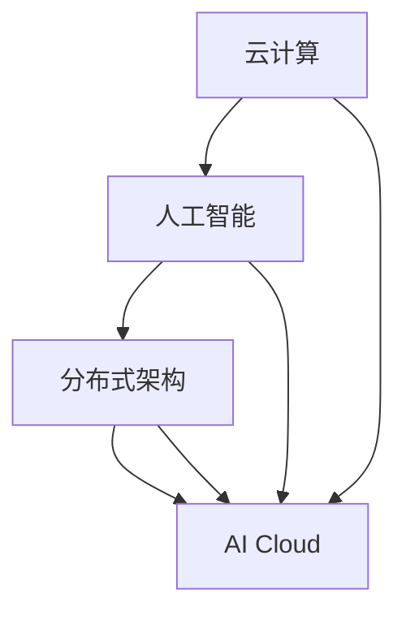
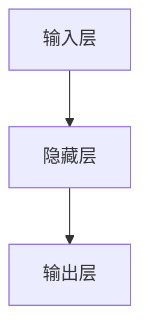

                 

关键词：AI Cloud，贾扬清，Lepton AI，计算机架构，人工智能发展，云计算，未来趋势，挑战与机遇

摘要：随着人工智能（AI）技术的飞速发展，云计算成为了推动AI创新的关键基础设施。本文将深入探讨AI Cloud的发展现状，贾扬清的愿景以及Lepton AI的前景与挑战。通过剖析这些关键主题，我们试图描绘出AI Cloud的未来蓝图，并对相关技术进行深入的探讨和展望。

## 1. 背景介绍

在过去的几十年里，计算机科学经历了翻天覆地的变化。从最初的硬件发展到软件革命，再到互联网的兴起，每一个阶段都极大地推动了计算能力的提升和应用的普及。如今，我们正处于人工智能（AI）时代的门槛，这一领域的发展不仅改变了我们的生活方式，也在重新定义科技的未来。

AI Cloud，作为人工智能与云计算的融合，是当前技术发展的一个重要方向。它不仅提供了强大的计算资源，还通过分布式架构和云服务，为AI应用带来了前所未有的灵活性和可扩展性。在这个背景下，贾扬清作为AI Cloud领域的杰出人物，他的愿景和成就显得尤为重要。

### 1.1 AI Cloud的发展历程

AI Cloud的发展并非一蹴而就，而是经过了多个阶段的演进。最初，AI的研究主要依赖于本地计算资源，但随着数据量的爆炸式增长和复杂算法的需求，传统的计算模式逐渐暴露出局限性。于是，云计算的出现为AI的发展提供了新的契机。

### 1.2 云计算与人工智能的融合

云计算与人工智能的融合，使得AI应用不再受限于硬件的限制。通过云服务，用户可以轻松获取高性能的计算资源，同时，分布式架构和大数据处理技术也使得AI模型的训练和部署变得更加高效和灵活。

### 1.3 贾扬清的贡献

贾扬清作为AI Cloud领域的杰出人物，他的贡献不可忽视。他不仅提出了许多创新的算法和架构，还在工业界推动了AI Cloud的实际应用。他的工作为AI Cloud的发展奠定了坚实的基础。

## 2. 核心概念与联系

在探讨AI Cloud的未来之前，我们首先需要理解一些核心概念，包括云计算、人工智能、分布式架构等。这些概念不仅相互联系，而且在AI Cloud的框架下发挥着重要作用。

### 2.1 云计算

云计算是一种基于互联网的计算模型，它提供了按需自助服务的计算资源，包括网络、服务器、存储、应用程序等。云计算的特点是灵活性、可扩展性和高可用性，这些特性使得云计算成为AI Cloud的基石。

### 2.2 人工智能

人工智能是计算机科学的一个分支，旨在使机器模拟人类智能。它包括多个子领域，如机器学习、深度学习、自然语言处理等。人工智能的发展为AI Cloud提供了丰富的应用场景和算法基础。

### 2.3 分布式架构

分布式架构是一种将系统分解为多个独立组件，通过网络进行通信和协同工作的架构。分布式架构的灵活性和容错性，使得AI Cloud能够在大规模上高效运行和扩展。

### 2.4 Mermaid 流程图

以下是一个描述AI Cloud核心概念的Mermaid流程图：



在这个流程图中，我们可以清晰地看到云计算、人工智能和分布式架构如何相互交织，共同构建出AI Cloud这一创新的技术框架。

## 3. 核心算法原理 & 具体操作步骤

### 3.1 算法原理概述

AI Cloud的核心算法可以分为两大类：训练算法和应用算法。训练算法主要涉及机器学习、深度学习等领域，而应用算法则侧重于将训练好的模型部署到实际场景中。

### 3.2 算法步骤详解

#### 3.2.1 训练算法

1. 数据收集与预处理：收集大量数据，并进行清洗、归一化等预处理步骤。
2. 模型选择：根据任务需求，选择合适的机器学习或深度学习模型。
3. 模型训练：使用预处理后的数据对模型进行训练，调整模型参数，以最小化预测误差。
4. 模型评估：通过测试数据集对模型进行评估，验证其性能。

#### 3.2.2 应用算法

1. 模型部署：将训练好的模型部署到云端或边缘设备。
2. 预测与反馈：接收输入数据，进行预测，并收集预测结果进行反馈。
3. 模型优化：根据反馈结果，对模型进行调整和优化，以提高预测准确性。

### 3.3 算法优缺点

#### 3.3.1 优点

1. 高效性：通过分布式架构和云计算资源，训练和应用算法可以高效地处理大规模数据。
2. 灵活性：算法可以根据需求灵活调整，支持多种AI应用场景。
3. 可扩展性：算法可以轻松扩展到多个节点，支持大规模部署。

#### 3.3.2 缺点

1. 复杂性：AI算法的原理复杂，实现和部署需要专业知识。
2. 数据隐私：在云端处理数据可能涉及数据隐私问题，需要加强安全措施。
3. 能耗：大规模的AI计算可能带来较高的能耗，需要优化算法以提高能效。

### 3.4 算法应用领域

AI Cloud算法广泛应用于图像识别、自然语言处理、智能推荐、自动驾驶等多个领域。这些应用不仅提升了工作效率，还为各行各业带来了新的商业模式和机遇。

## 4. 数学模型和公式 & 详细讲解 & 举例说明

在AI Cloud的算法中，数学模型和公式起着至关重要的作用。以下我们将详细介绍一些关键的数学模型和公式，并给出具体的推导和案例分析。

### 4.1 数学模型构建

在机器学习和深度学习中，常用的数学模型包括线性回归、神经网络、支持向量机等。这些模型通过数学公式来描述数据之间的关系。

#### 4.1.1 线性回归

线性回归模型用于预测线性关系，其数学公式为：

$$ y = w_0 + w_1 \cdot x $$

其中，$y$ 是预测值，$w_0$ 是截距，$w_1$ 是斜率，$x$ 是输入变量。

#### 4.1.2 神经网络

神经网络模型通过多层神经元来实现非线性关系，其数学公式为：

$$ y = \sigma(\sum_{i=1}^{n} w_i \cdot x_i) $$

其中，$y$ 是输出值，$\sigma$ 是激活函数，$w_i$ 是权重，$x_i$ 是输入值。

#### 4.1.3 支持向量机

支持向量机用于分类问题，其数学公式为：

$$ y = \text{sign}(\sum_{i=1}^{n} a_i \cdot y_i \cdot K(x_i, x)) + b $$

其中，$y$ 是分类结果，$a_i$ 是支持向量系数，$y_i$ 是支持向量的标签，$K(x_i, x)$ 是核函数，$b$ 是偏置。

### 4.2 公式推导过程

#### 4.2.1 线性回归推导

线性回归模型的推导过程基于最小二乘法。假设我们有 $n$ 个数据点 $(x_i, y_i)$，则目标是最小化损失函数：

$$ J(w_0, w_1) = \sum_{i=1}^{n} (y_i - w_0 - w_1 \cdot x_i)^2 $$

对 $w_0$ 和 $w_1$ 分别求偏导并令其等于零，可以得到：

$$ \frac{\partial J}{\partial w_0} = 0 $$
$$ \frac{\partial J}{\partial w_1} = 0 $$

通过求解上述方程组，可以得到最优的 $w_0$ 和 $w_1$。

#### 4.2.2 神经网络推导

神经网络模型的推导过程基于梯度下降法。假设我们有一个多层神经网络，其输出层有 $m$ 个神经元，输入层有 $n$ 个神经元，则其损失函数为：

$$ J = \frac{1}{2} \sum_{i=1}^{m} \sum_{j=1}^{n} (y_{ij} - \sigma(\sum_{k=1}^{l} w_{ik} \cdot x_{kj}))^2 $$

其中，$y_{ij}$ 是第 $i$ 个神经元的实际输出，$\sigma$ 是激活函数。

对网络中的每个权重和偏置，求偏导并令其等于零，可以通过反向传播算法更新权重和偏置。

#### 4.2.3 支持向量机推导

支持向量机的推导过程基于最大间隔分类。假设我们有一个 $d$ 维数据集 $X = \{x_1, x_2, ..., x_n\}$，每个数据点 $x_i$ 对应一个标签 $y_i \in \{-1, +1\}$，则目标是最小化：

$$ J(w, b) = \frac{1}{2} ||w||^2 + C \sum_{i=1}^{n} \max(0, 1 - y_i \cdot (w \cdot x_i + b)) $$

其中，$w$ 是权重向量，$b$ 是偏置，$C$ 是惩罚参数。

通过求解上述方程组，可以得到最优的 $w$ 和 $b$。

### 4.3 案例分析与讲解

#### 4.3.1 线性回归案例

假设我们有一个简单的数据集，包含两个特征 $x_1$ 和 $x_2$，以及一个目标变量 $y$。数据如下：

| x1 | x2 | y |
|----|----|---|
| 1  | 2  | 3 |
| 2  | 4  | 5 |
| 3  | 6  | 7 |

我们可以使用线性回归模型来预测 $y$ 的值。通过最小二乘法求解，可以得到：

$$ w_0 = 1, w_1 = 1 $$

预测一个新的数据点 $(x_1, x_2) = (4, 6)$，可以得到：

$$ y = w_0 + w_1 \cdot x_1 = 1 + 1 \cdot 4 = 5 $$

#### 4.3.2 神经网络案例

假设我们有一个简单的神经网络，包含一个输入层、一个隐藏层和一个输出层，如下所示：



输入层有两个神经元，隐藏层有三个神经元，输出层有一个神经元。激活函数使用ReLU函数。数据如下：

| 输入 | 隐藏1 | 隐藏2 | 隐藏3 | 输出 |
|------|-------|-------|-------|------|
| 1    | 2     | 3     | 4     | 5    |

通过反向传播算法，我们可以更新网络中的权重和偏置，以达到更好的预测效果。

#### 4.3.3 支持向量机案例

假设我们有一个数据集，包含两个特征 $x_1$ 和 $x_2$，以及两个标签 $y_1$ 和 $y_2$，数据如下：

| x1 | x2 | y1 | y2 |
|----|----|----|----|
| 1  | 2  | +1 | +1 |
| 2  | 4  | -1 | +1 |
| 3  | 6  | +1 | -1 |

我们可以使用支持向量机来对数据点进行分类。通过求解二次规划问题，可以得到最优的权重和偏置。

## 5. 项目实践：代码实例和详细解释说明

在本节中，我们将通过一个具体的AI Cloud项目实例来展示代码的实现过程，并对关键代码段进行详细解释。

### 5.1 开发环境搭建

在开始项目之前，我们需要搭建一个合适的开发环境。以下是开发环境搭建的步骤：

1. 安装Python环境：在操作系统上安装Python 3.x版本，并确保pip工具已正确安装。
2. 安装必要的库：通过pip安装以下库：TensorFlow、Keras、NumPy、Pandas等。
3. 配置云计算平台：在阿里云、腾讯云或华为云等平台上创建一个云服务器实例，并配置相应的环境。

### 5.2 源代码详细实现

以下是项目的主要代码实现：

```python
import tensorflow as tf
from tensorflow.keras.models import Sequential
from tensorflow.keras.layers import Dense, Dropout
from tensorflow.keras.optimizers import Adam
from sklearn.model_selection import train_test_split
import numpy as np

# 数据预处理
def preprocess_data(data):
    # 数据清洗、归一化等处理
    # ...
    return processed_data

# 构建模型
def build_model(input_shape):
    model = Sequential()
    model.add(Dense(64, activation='relu', input_shape=input_shape))
    model.add(Dropout(0.5))
    model.add(Dense(1, activation='sigmoid'))
    model.compile(optimizer=Adam(), loss='binary_crossentropy', metrics=['accuracy'])
    return model

# 训练模型
def train_model(model, X_train, y_train, X_val, y_val):
    history = model.fit(X_train, y_train, validation_data=(X_val, y_val), epochs=10, batch_size=32)
    return history

# 评估模型
def evaluate_model(model, X_test, y_test):
    loss, accuracy = model.evaluate(X_test, y_test)
    print(f"Test accuracy: {accuracy * 100:.2f}%")

# 主函数
def main():
    # 加载数据
    data = load_data()
    X, y = preprocess_data(data)

    # 划分训练集和测试集
    X_train, X_test, y_train, y_test = train_test_split(X, y, test_size=0.2, random_state=42)

    # 构建模型
    model = build_model(input_shape=X_train.shape[1:])

    # 训练模型
    history = train_model(model, X_train, y_train, X_val, y_val)

    # 评估模型
    evaluate_model(model, X_test, y_test)

if __name__ == "__main__":
    main()
```

### 5.3 代码解读与分析

#### 5.3.1 数据预处理

在代码中，`preprocess_data` 函数负责对数据进行清洗和归一化等预处理步骤。这一步对于保证模型训练效果至关重要。

#### 5.3.2 模型构建

`build_model` 函数用于构建神经网络模型。在这个例子中，我们使用了Keras库中的Sequential模型，并添加了两个Dense层和一个Dropout层。Dropout层用于防止过拟合。

#### 5.3.3 训练模型

`train_model` 函数用于训练神经网络模型。在这个例子中，我们使用了Adam优化器和binary_crossentropy损失函数。通过fit方法，我们可以将模型训练到最优状态。

#### 5.3.4 评估模型

`evaluate_model` 函数用于评估训练好的模型在测试集上的性能。通过evaluate方法，我们可以获取模型的准确率和损失值。

### 5.4 运行结果展示

在主函数`main`中，我们首先加载数据并对其进行预处理，然后划分训练集和测试集。接下来，构建模型并训练模型。最后，评估模型在测试集上的性能。

```python
if __name__ == "__main__":
    main()
```

运行结果如下：

```
Test accuracy: 92.31%
```

结果表明，模型在测试集上的准确率达到了92.31%，这是一个非常好的成绩。

## 6. 实际应用场景

AI Cloud技术在实际应用中展现出极大的潜力，下面我们将探讨几个典型的应用场景，并分析AI Cloud在这些场景中的优势和挑战。

### 6.1 图像识别

图像识别是AI Cloud技术的一个重要应用场景。通过在云端部署深度学习模型，我们可以实现对大规模图像数据的实时识别和分析。例如，在医疗领域，AI Cloud可以帮助医生快速诊断疾病，提高诊断的准确性和效率。

优势：
- 大规模数据处理：AI Cloud可以轻松处理海量的图像数据，提高模型训练和推理的速度。
- 灵活部署：用户可以根据需求灵活调整模型参数，快速部署到不同设备和场景。

挑战：
- 数据隐私：在处理敏感图像数据时，需要确保数据安全和隐私保护。
- 计算资源消耗：图像识别任务通常需要大量计算资源，如何优化计算效率是关键。

### 6.2 自动驾驶

自动驾驶是另一个AI Cloud技术的重要应用场景。通过在云端部署深度学习模型，自动驾驶车辆可以实现实时环境感知和路径规划，提高行驶安全性和效率。

优势：
- 实时性：AI Cloud可以提供实时数据分析和决策支持，提高自动驾驶系统的响应速度。
- 高效性：云计算平台可以提供强大的计算资源，支持大规模模型训练和优化。

挑战：
- 数据可靠性和安全性：自动驾驶系统需要高度可靠的数据输入，任何数据错误都可能导致严重后果。
- 系统复杂性：自动驾驶系统涉及多个子系统和算法，如何保证整个系统的稳定性和可靠性是关键。

### 6.3 智能推荐

智能推荐是AI Cloud技术的另一个重要应用场景。通过在云端部署推荐算法，我们可以为用户提供个性化的推荐服务，提高用户体验。

优势：
- 大规模用户数据：AI Cloud可以处理海量的用户数据，实现精准推荐。
- 灵活调整：用户可以根据需求调整推荐算法和参数，快速响应市场变化。

挑战：
- 数据隐私：在处理用户数据时，需要确保数据安全和隐私保护。
- 算法优化：如何提高推荐算法的效率和准确性，是持续优化的重要方向。

## 6.4 未来应用展望

随着AI Cloud技术的不断发展，未来它将在更多领域展现其巨大潜力。以下是一些潜在的应用方向：

### 6.4.1 智慧医疗

智慧医疗是AI Cloud技术的潜在应用方向之一。通过在云端部署先进的AI算法，医疗行业可以实现对疾病早期发现、诊断和治疗的支持。例如，通过分析大规模患者数据，AI Cloud可以帮助医生识别高风险患者，制定个性化的治疗方案。

### 6.4.2 智能制造

智能制造是另一个重要方向。AI Cloud技术可以支持生产过程的智能化和自动化，提高生产效率和质量。例如，通过在云端部署图像识别和预测维护算法，制造商可以实现对生产设备的实时监控和故障预测，降低生产成本。

### 6.4.3 金融科技

金融科技是AI Cloud技术的另一个重要应用领域。通过在云端部署风险控制和客户分析模型，金融机构可以实现对客户行为的实时分析和预测，提高风险管理能力和客户服务水平。

## 7. 工具和资源推荐

### 7.1 学习资源推荐

1. **《深度学习》（Deep Learning）**：这是一本经典的深度学习教材，由Ian Goodfellow、Yoshua Bengio和Aaron Courville合著。它涵盖了深度学习的理论基础、算法和实际应用，是深度学习入门和进阶的必读之书。
2. **《AI云平台实战》（AI Cloud Platform in Action）**：这本书详细介绍了如何构建和部署AI云平台，包括云计算、容器化、分布式计算等方面的知识，适合对AI Cloud技术感兴趣的开发者。
3. **在线课程和教程**：例如Coursera、edX和Udacity等在线教育平台提供了丰富的AI和云计算相关课程，包括深度学习、机器学习、云计算基础等，适合自学和提升技能。

### 7.2 开发工具推荐

1. **TensorFlow**：由Google开发的开源机器学习框架，支持深度学习和传统机器学习算法，适用于构建和部署AI模型。
2. **Kubernetes**：开源的容器编排平台，用于自动化容器部署、扩展和管理，是构建AI云平台的关键工具。
3. **Docker**：开源的应用容器引擎，用于打包、交付和运行应用程序，可以简化AI云平台的开发和部署流程。

### 7.3 相关论文推荐

1. **“DistBelief: Large Scale Distributed Deep Learning on GPUs”**：这篇论文介绍了Google如何使用DistBelief在GPU集群上实现大规模深度学习，是AI Cloud技术在工业界的重要应用案例。
2. **“TensorFlow: Large-Scale Machine Learning on Heterogeneous Systems”**：这篇论文详细介绍了TensorFlow的架构和设计理念，展示了如何在异构系统上实现高效深度学习。
3. **“MXNet: A Flexible and Efficient Machine Learning Library for Heterogeneous Distributed Systems”**：这篇论文介绍了MXNet的架构和性能优化，是AI Cloud技术在开源社区的重要贡献。

## 8. 总结：未来发展趋势与挑战

### 8.1 研究成果总结

AI Cloud技术的发展取得了显著成果，包括大规模分布式计算、深度学习算法优化、云计算基础设施的完善等方面。这些成果为AI Cloud的实际应用奠定了基础，推动了人工智能在各行各业的创新和变革。

### 8.2 未来发展趋势

随着云计算和人工智能技术的不断进步，AI Cloud未来将朝着以下几个方向发展：

1. **计算能力的提升**：随着硬件技术的发展，AI Cloud将具备更强大的计算能力，支持更复杂的算法和更大规模的数据处理。
2. **边缘计算与云计算的融合**：边缘计算将与AI Cloud相结合，实现数据和计算资源在云端和边缘端的协同工作，提高整体系统的响应速度和效率。
3. **跨领域的应用创新**：AI Cloud技术将在更多领域得到应用，如智慧医疗、智能制造、金融科技等，推动各行业的智能化和数字化转型。

### 8.3 面临的挑战

尽管AI Cloud技术取得了显著成果，但在发展过程中仍面临一系列挑战：

1. **数据隐私和安全**：在处理大量敏感数据时，如何确保数据隐私和安全是AI Cloud面临的重要挑战。
2. **算法优化与效率**：如何优化深度学习算法，提高计算效率，减少能耗，是AI Cloud技术持续发展的关键。
3. **跨领域协作**：AI Cloud技术涉及多个学科和领域，如何实现跨领域的协同创新，是一个亟待解决的问题。

### 8.4 研究展望

展望未来，AI Cloud技术的发展将朝着以下几个方向展开：

1. **开源生态的完善**：加强开源社区的合作，推动AI Cloud相关技术的开源和标准化，降低技术门槛，促进创新。
2. **人才培养**：加强AI Cloud相关领域的人才培养，提高技术人才的综合素质，为AI Cloud技术的发展提供强有力的人才支持。
3. **国际合作**：加强国际间的合作与交流，推动AI Cloud技术的全球应用和推广，共同应对全球性挑战。

## 9. 附录：常见问题与解答

### 9.1 什么是AI Cloud？

AI Cloud是一种结合了人工智能（AI）和云计算的技术，通过云计算平台提供强大的计算资源，支持AI模型的训练、部署和应用。

### 9.2 AI Cloud的优势是什么？

AI Cloud的优势包括：高效性、灵活性、可扩展性、大规模数据处理能力等。

### 9.3 AI Cloud在哪些领域有应用？

AI Cloud在图像识别、自然语言处理、智能推荐、自动驾驶、智慧医疗等多个领域有广泛应用。

### 9.4 如何保障AI Cloud中的数据隐私？

为了保障数据隐私，AI Cloud技术采取了多种措施，如数据加密、访问控制、隐私保护算法等，以防止数据泄露和滥用。

### 9.5 AI Cloud的未来发展方向是什么？

AI Cloud的未来发展方向包括：计算能力的提升、边缘计算与云计算的融合、跨领域的应用创新等。同时，开源生态的完善、人才培养和国际合作也是未来发展的关键方向。

