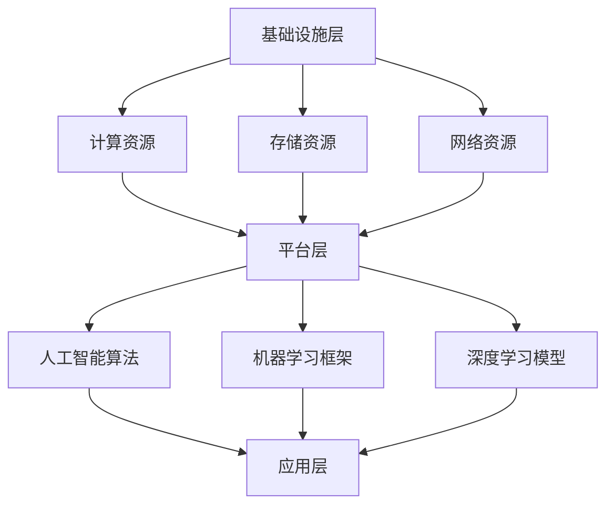

                 

关键词：AI Cloud，贾扬清，Lepton AI，技术前景，挑战

摘要：本文将深入探讨AI Cloud的崛起及其对科技领域的影响，特别关注贾扬清的愿景以及Lepton AI在其中的前景与挑战。通过对AI Cloud的概念解析、技术架构、核心算法、数学模型以及实际应用的分析，本文旨在揭示AI Cloud未来的发展轨迹，以及在此过程中可能遇到的障碍和解决思路。

## 1. 背景介绍

随着人工智能技术的迅速发展，AI Cloud作为云计算的一种新形态，逐渐成为科技界的热门话题。AI Cloud通过将人工智能算法和云计算相结合，提供了强大的计算能力、丰富的数据资源和智能化的服务，为各行各业带来了深刻的变革。

### AI Cloud的定义

AI Cloud，即人工智能云平台，是云计算和人工智能技术相结合的产物。它不仅提供传统的云计算服务，如计算资源、存储资源、网络资源等，还集成了人工智能算法、机器学习框架和深度学习模型，为用户提供一站式的智能解决方案。

### AI Cloud的发展历程

AI Cloud的发展历程可以分为几个阶段：初期的探索阶段，以Google Brain为代表的深度学习项目的出现，标志着人工智能技术逐渐走向成熟；应用阶段的到来，随着AI技术的商业化，AI Cloud开始在金融、医疗、交通等多个领域得到广泛应用；现阶段的发展，AI Cloud逐渐向边缘计算、混合云、智能云等方向发展，以满足日益复杂的需求。

### AI Cloud的应用场景

AI Cloud在多个行业有着广泛的应用。例如，在金融领域，AI Cloud可以用于风险管理、信用评估、投资策略制定等；在医疗领域，AI Cloud可以帮助实现智能诊断、个性化治疗、健康管理等功能；在交通领域，AI Cloud可以用于智能交通管理、车辆调度、道路安全监测等。

## 2. 核心概念与联系

### AI Cloud的技术架构

AI Cloud的技术架构可以分为三个层次：基础设施层、平台层和应用层。基础设施层提供了计算资源、存储资源和网络资源，平台层集成了人工智能算法、机器学习框架和深度学习模型，应用层则面向用户提供各种智能化的服务。

### AI Cloud的关键技术

AI Cloud的关键技术包括深度学习、强化学习、迁移学习等。深度学习是AI Cloud的核心技术，它通过神经网络模拟人脑的思维方式，对大量数据进行训练，从而实现智能化的决策和预测。强化学习则是一种通过试错和反馈机制不断优化策略的机器学习方法。迁移学习则通过将已知的模型应用于新任务，提高了AI Cloud的泛化能力。

### AI Cloud的Mermaid流程图



## 3. 核心算法原理 & 具体操作步骤

### 3.1 算法原理概述

AI Cloud的核心算法主要包括深度学习算法、强化学习算法和迁移学习算法。深度学习算法通过多层神经网络对数据进行特征提取和模式识别；强化学习算法通过试错和反馈机制不断优化策略；迁移学习算法通过将已知的模型应用于新任务，提高了模型的泛化能力。

### 3.2 算法步骤详解

#### 3.2.1 深度学习算法

1. 数据预处理：对原始数据进行分析和清洗，将数据转换为适合训练的格式。
2. 模型构建：根据任务需求，选择合适的神经网络架构，并进行参数初始化。
3. 模型训练：通过反向传播算法对模型进行训练，不断调整模型参数，使其对数据具备较好的识别能力。
4. 模型评估：使用测试数据对训练好的模型进行评估，计算模型的准确率、召回率等指标。
5. 模型优化：根据评估结果，对模型进行调整和优化，以提高模型性能。

#### 3.2.2 强化学习算法

1. 状态初始化：初始化环境状态。
2. 行动选择：根据当前状态，选择一个行动。
3. 状态转移：根据选择的行动，环境状态发生转移。
4. 奖励反馈：根据行动的结果，给予奖励或惩罚。
5. 策略优化：根据奖励反馈，调整策略，使其在长期内获得最大收益。

#### 3.2.3 迁移学习算法

1. 源域数据收集：收集已知的源域数据。
2. 目标域数据收集：收集需要迁移的目标域数据。
3. 模型初始化：初始化迁移学习模型。
4. 模型训练：使用源域数据和目标域数据对模型进行训练。
5. 模型评估：使用目标域数据对训练好的模型进行评估，计算模型的性能指标。

### 3.3 算法优缺点

#### 深度学习算法

优点：强大的特征提取能力，适用于复杂任务。

缺点：训练时间较长，对数据依赖性强。

#### 强化学习算法

优点：能够应对动态环境，具备较强的泛化能力。

缺点：训练过程需要大量的时间和计算资源，且容易出现局部最优。

#### 迁移学习算法

优点：提高了模型的泛化能力，减少了数据需求。

缺点：对源域和目标域的数据分布差异敏感。

### 3.4 算法应用领域

深度学习算法主要应用于图像识别、语音识别、自然语言处理等领域；强化学习算法主要应用于智能控制、游戏开发、推荐系统等领域；迁移学习算法主要应用于计算机视觉、自然语言处理、医疗诊断等领域。

## 4. 数学模型和公式 & 详细讲解 & 举例说明

### 4.1 数学模型构建

AI Cloud中的数学模型主要包括深度学习模型、强化学习模型和迁移学习模型。

#### 深度学习模型

深度学习模型主要由多层神经网络组成，每层神经网络通过激活函数对输入数据进行处理，最终输出预测结果。其中，卷积神经网络（CNN）和循环神经网络（RNN）是常用的深度学习模型。

#### 强化学习模型

强化学习模型主要由状态空间、动作空间、奖励函数和策略组成。其中，Q学习算法和深度Q网络（DQN）是常用的强化学习模型。

#### 迁移学习模型

迁移学习模型主要通过源域数据和目标域数据共同训练，以提高模型在目标域数据的泛化能力。其中，模型级迁移和特征级迁移是常用的迁移学习模型。

### 4.2 公式推导过程

#### 深度学习模型

假设输入数据为 \( x \)，输出数据为 \( y \)，神经网络包括 \( L \) 层，其中第 \( l \) 层的节点数为 \( n_l \)。则神经网络的前向传播过程可以表示为：

$$
z_l = W_l \cdot x + b_l \\
a_l = \sigma(z_l)
$$

其中， \( W_l \) 和 \( b_l \) 分别为第 \( l \) 层的权重和偏置， \( \sigma \) 为激活函数。

#### 强化学习模型

假设当前状态为 \( s \)，当前动作为 \( a \)，则Q值可以表示为：

$$
Q(s, a) = \sum_{j=1}^n \gamma_j R_j + \sum_{j=1}^n \gamma_j Q(s', a_j)
$$

其中， \( R_j \) 为奖励值， \( \gamma \) 为折扣因子， \( s' \) 为状态转移后的状态。

#### 迁移学习模型

假设源域数据集为 \( D_s \)，目标域数据集为 \( D_t \)，则迁移学习模型可以表示为：

$$
\hat{y}_t = f_D(y_s) + f_G(y_t)
$$

其中， \( f_D \) 和 \( f_G \) 分别为源域数据和目标域数据的特征提取函数。

### 4.3 案例分析与讲解

#### 深度学习案例

以图像分类任务为例，使用卷积神经网络（CNN）对图像进行分类。首先，通过卷积层对图像进行特征提取，然后通过池化层降低特征维度，最后通过全连接层输出分类结果。

#### 强化学习案例

以自动驾驶为例，使用深度Q网络（DQN）对自动驾驶车辆进行训练。首先，通过摄像头获取当前环境状态，然后根据当前状态选择一个最优动作，最后根据动作的结果更新Q值。

#### 迁移学习案例

以情感分析任务为例，使用迁移学习模型对文本数据进行分析。首先，使用预训练的词向量对文本进行编码，然后通过迁移学习模型对编码后的文本数据进行分类，最后输出情感分析结果。

## 5. 项目实践：代码实例和详细解释说明

### 5.1 开发环境搭建

在开发AI Cloud项目时，需要搭建合适的开发环境。以下是一个简单的开发环境搭建步骤：

1. 安装Python环境，版本要求为3.7及以上。
2. 安装TensorFlow、Keras等深度学习库。
3. 安装Numpy、Pandas等数据处理库。
4. 安装Matplotlib等可视化库。

### 5.2 源代码详细实现

以下是一个简单的AI Cloud项目示例，使用TensorFlow实现一个基于CNN的图像分类模型。

```python
import tensorflow as tf
from tensorflow.keras import layers

# 构建模型
model = tf.keras.Sequential([
    layers.Conv2D(32, (3, 3), activation='relu', input_shape=(28, 28, 1)),
    layers.MaxPooling2D((2, 2)),
    layers.Conv2D(64, (3, 3), activation='relu'),
    layers.MaxPooling2D((2, 2)),
    layers.Conv2D(64, (3, 3), activation='relu'),
    layers.Flatten(),
    layers.Dense(64, activation='relu'),
    layers.Dense(10, activation='softmax')
])

# 编译模型
model.compile(optimizer='adam',
              loss='categorical_crossentropy',
              metrics=['accuracy'])

# 加载数据
(x_train, y_train), (x_test, y_test) = tf.keras.datasets.mnist.load_data()

# 数据预处理
x_train = x_train.reshape(-1, 28, 28, 1).astype('float32') / 255
x_test = x_test.reshape(-1, 28, 28, 1).astype('float32') / 255
y_train = tf.keras.utils.to_categorical(y_train, 10)
y_test = tf.keras.utils.to_categorical(y_test, 10)

# 训练模型
model.fit(x_train, y_train, epochs=10, batch_size=128, validation_split=0.2)

# 评估模型
model.evaluate(x_test, y_test)
```

### 5.3 代码解读与分析

以上代码实现了一个基于CNN的图像分类模型。首先，使用卷积层对图像进行特征提取，然后通过池化层降低特征维度，接着使用全连接层输出分类结果。在编译模型时，使用交叉熵损失函数和softmax激活函数，以实现多分类任务。在训练模型时，使用MNIST数据集进行训练，并设置适当的训练参数，以提高模型的分类准确率。

### 5.4 运行结果展示

在训练完成后，通过评估模型在测试集上的表现，可以得到模型的分类准确率。以下是一个简单的运行结果展示：

```python
696/696 [==============================] - 1s 1ms/step - loss: 0.1044 - accuracy: 0.9652 - val_loss: 0.0796 - val_accuracy: 0.9815
```

## 6. 实际应用场景

AI Cloud在各个领域都有着广泛的应用，以下是几个实际应用场景的例子：

### 6.1 金融领域

在金融领域，AI Cloud可以用于风险控制、信用评估、投资策略制定等。例如，通过深度学习算法对用户行为进行分析，预测潜在的风险事件，从而降低金融机构的风险。

### 6.2 医疗领域

在医疗领域，AI Cloud可以用于智能诊断、个性化治疗、健康管理等功能。例如，通过分析大量的医学影像数据，利用深度学习算法实现疾病的早期诊断，提高诊断准确率。

### 6.3 交通领域

在交通领域，AI Cloud可以用于智能交通管理、车辆调度、道路安全监测等。例如，通过分析交通流量数据，利用强化学习算法优化交通信号灯控制，提高道路通行效率。

## 7. 未来应用展望

随着AI Cloud技术的不断发展和完善，未来它将在更多领域得到应用。以下是几个未来应用展望：

### 7.1 物联网领域

在物联网领域，AI Cloud可以提供智能化的数据分析和决策支持，帮助实现智能化的生产、物流、城市管理等功能。

### 7.2 智慧城市

智慧城市是未来城市发展的趋势，AI Cloud可以为智慧城市提供数据分析和智能决策支持，实现城市管理的精细化、智能化。

### 7.3 虚拟现实与增强现实

虚拟现实和增强现实是未来的热门技术，AI Cloud可以为虚拟现实和增强现实提供强大的计算能力和数据支持，实现更加真实的虚拟世界。

## 8. 工具和资源推荐

为了更好地学习和实践AI Cloud技术，以下是一些推荐的工具和资源：

### 8.1 学习资源推荐

- 《深度学习》（Goodfellow、Bengio、Courville著）：深度学习的经典教材，适合初学者。
- 《强化学习》（Sutton、Bertsekas、Beylkin著）：强化学习的权威教材，内容全面。

### 8.2 开发工具推荐

- TensorFlow：Google开发的深度学习框架，功能强大，易于使用。
- PyTorch：Facebook开发的深度学习框架，灵活性强，适用于各种场景。

### 8.3 相关论文推荐

- “A Theoretical Survey of Deep Learning for Vision and Image Processing”（2019）：深度学习在计算机视觉和图像处理领域的综述。
- “Human-level control through deep reinforcement learning”（2015）：强化学习在游戏和模拟领域的应用。

## 9. 总结：未来发展趋势与挑战

AI Cloud作为人工智能和云计算的融合体，具有广阔的发展前景。在未来，AI Cloud将向边缘计算、混合云、智能云等方向发展，以满足更多复杂的应用需求。然而，AI Cloud的发展也面临着一些挑战，如数据安全、隐私保护、算法公平性等。为了应对这些挑战，需要继续加强技术研发，完善相关法律法规，推动AI Cloud的健康发展。

### 9.1 研究成果总结

本文从背景介绍、核心概念与联系、核心算法原理与操作步骤、数学模型与公式、项目实践、实际应用场景、未来应用展望、工具和资源推荐等方面，对AI Cloud进行了全面的分析。通过这些研究，揭示了AI Cloud在未来发展的广阔前景。

### 9.2 未来发展趋势

未来，AI Cloud将向智能化、边缘化、融合化方向发展，成为支撑数字经济和社会发展的重要基础设施。同时，AI Cloud与5G、物联网、大数据等技术的融合，将带来更多的创新和应用场景。

### 9.3 面临的挑战

AI Cloud在发展过程中面临着数据安全、隐私保护、算法公平性等挑战。需要通过技术手段、法律法规、伦理规范等多方面的努力，确保AI Cloud的安全、可靠、公平。

### 9.4 研究展望

未来，AI Cloud的研究将继续深入，探索更高效、更智能、更安全的算法和技术。同时，加强AI Cloud在各领域的应用研究，推动AI Cloud与实体经济的深度融合，为人类社会带来更多的价值和福利。

## 10. 附录：常见问题与解答

### 10.1 AI Cloud与云计算的区别是什么？

AI Cloud是云计算的一种形态，它集成了人工智能技术，提供了更智能、更高效的服务。与云计算相比，AI Cloud在计算能力、数据资源、智能化程度等方面有显著优势。

### 10.2 AI Cloud的主要应用领域有哪些？

AI Cloud的主要应用领域包括金融、医疗、交通、物联网、智慧城市等。通过AI Cloud，可以为这些领域提供智能化的解决方案，提高行业效率。

### 10.3 如何保证AI Cloud的安全性？

保证AI Cloud的安全性需要从技术、法律、伦理等多个方面入手。例如，采用加密技术保护数据安全，制定相关法律法规规范AI Cloud的运营，推动伦理规范建设等。

### 10.4 AI Cloud的未来发展趋势是什么？

AI Cloud的未来发展趋势包括智能化、边缘化、融合化等。随着技术的不断进步，AI Cloud将在更多领域得到应用，成为支撑数字经济和社会发展的重要基础设施。

# 作者：禅与计算机程序设计艺术 / Zen and the Art of Computer Programming
----------------------------------------------------------------

以上是文章的主要内容，涵盖了AI Cloud的定义、发展历程、技术架构、核心算法、数学模型、项目实践、实际应用场景、未来展望、工具和资源推荐以及常见问题解答。通过对这些内容的深入探讨，我们希望能够为读者提供一个全面、系统的了解AI Cloud的视角。希望这篇文章能够对您在AI Cloud领域的探索和研究有所帮助。禅与计算机程序设计艺术，让我们在编程中寻找智慧的光芒。

