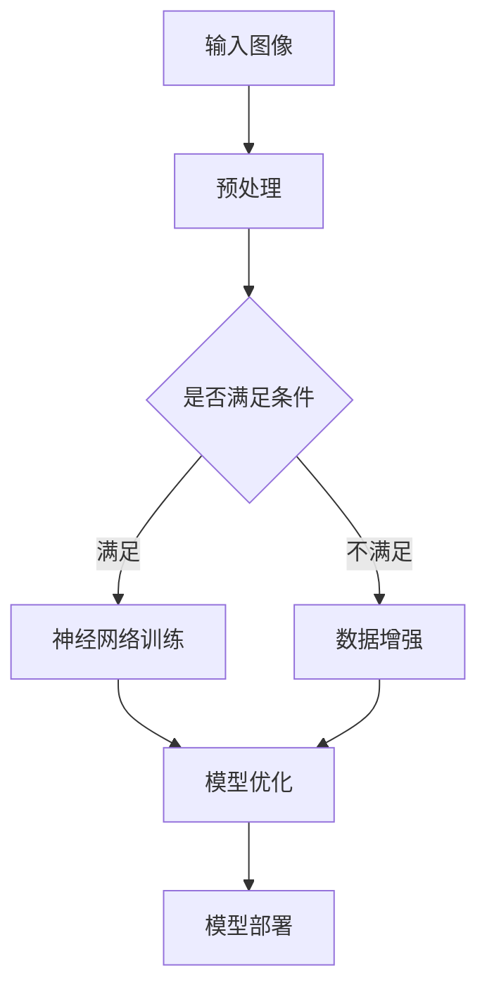

                 

关键词：AI Cloud、贾扬清、Lepton AI、人工智能、云计算、技术愿景、发展前景、挑战

> 摘要：本文将深入探讨AI Cloud的未来，以及贾扬清提出的Lepton AI技术的前景与挑战。文章将从背景介绍、核心概念与联系、核心算法原理、数学模型与公式、项目实践、实际应用场景、未来应用展望、工具和资源推荐、总结：未来发展趋势与挑战等方面展开论述。

## 1. 背景介绍

### 1.1 AI Cloud的定义与发展历程

AI Cloud，即人工智能云计算，是指将人工智能算法和服务部署在云端，通过互联网提供给用户使用的一种新型计算服务模式。它利用云计算的高性能计算能力、海量数据存储和智能分析功能，实现了人工智能资源的共享和优化。

AI Cloud的发展历程可以追溯到20世纪90年代，随着互联网的普及和云计算技术的成熟，AI Cloud逐渐从理论研究走向实际应用。近年来，随着深度学习、神经网络等人工智能技术的飞速发展，AI Cloud的应用场景不断扩展，成为企业数字化转型的重要工具。

### 1.2 贾扬清及其贡献

贾扬清，清华大学计算机系教授、清华大学全球创新学院院长，他在计算机视觉、人工智能等领域取得了显著成就。作为人工智能领域的杰出学者，贾扬清提出了Lepton AI技术，为AI Cloud的发展注入了新的活力。

贾扬清的研究成果不仅为学术界提供了丰富的理论资源，还推动了人工智能技术在工业、医疗、金融等领域的应用。他的Lepton AI技术以其高效、智能、安全的特点，为AI Cloud的发展带来了新的机遇。

## 2. 核心概念与联系

### 2.1 AI Cloud的核心概念

AI Cloud的核心概念包括云计算、人工智能、数据存储、数据处理、网络传输等。其中，云计算提供了强大的计算能力和存储资源，人工智能则赋予了系统智能分析能力，数据存储和数据处理保证了数据的完整性和可用性，网络传输则确保了数据的高效传输。

### 2.2 Lepton AI的核心概念

Lepton AI是一种基于深度学习的计算机视觉技术，其核心概念包括神经网络架构、算法优化、模型压缩等。Lepton AI通过改进神经网络架构和算法，实现了对图像的高效识别和分析。

### 2.3 Mermaid流程图

以下是Lepton AI的Mermaid流程图：



## 3. 核心算法原理 & 具体操作步骤

### 3.1 算法原理概述

Lepton AI的核心算法是基于深度学习的图像识别技术。它通过多层神经网络对图像进行特征提取和分类，实现了对图像内容的精准识别。

### 3.2 算法步骤详解

1. 输入图像：将待识别的图像输入系统。
2. 预处理：对图像进行缩放、裁剪、灰度化等预处理操作，以提高模型的识别效果。
3. 神经网络训练：使用预训练的神经网络模型对图像进行特征提取和分类。
4. 模型优化：根据识别效果对神经网络模型进行调整和优化。
5. 模型部署：将训练好的模型部署到云端，供用户使用。

### 3.3 算法优缺点

**优点：**
- 高效：Lepton AI基于深度学习，可以快速处理大量图像数据。
- 精准：通过多层神经网络，可以实现高精度的图像识别。
- 智能化：具有自适应性和可扩展性，可以适应不同场景和需求。

**缺点：**
- 复杂：深度学习模型结构复杂，需要大量的计算资源和时间进行训练。
- 数据依赖：模型的性能依赖于大量高质量的数据。

### 3.4 算法应用领域

Lepton AI的应用领域广泛，包括但不限于：

- 自动驾驶：实现自动驾驶车辆的图像识别和场景理解。
- 人脸识别：实现人脸识别、人脸检测、人脸跟踪等功能。
- 医学影像：对医学影像进行分析和诊断。
- 智能安防：对监控视频进行分析和报警。

## 4. 数学模型和公式 & 详细讲解 & 举例说明

### 4.1 数学模型构建

Lepton AI的数学模型基于深度学习的卷积神经网络（CNN）。CNN由多个卷积层、池化层和全连接层组成，通过特征提取和分类实现图像识别。

### 4.2 公式推导过程

CNN的主要公式包括：

1. 卷积操作：
   $$ (f_{ij} = \sum_{k,l} w_{k,l} \times i_{k,l}) $$
   其中，$f_{ij}$表示卷积结果，$w_{k,l}$表示卷积核，$i_{k,l}$表示输入图像。

2. 池化操作：
   $$ p_j = \max(i_{j1}, i_{j2}, ..., i_{jk}) $$
   其中，$p_j$表示池化结果，$i_{j1}, i_{j2}, ..., i_{jk}$表示输入图像的邻域。

3. 全连接层：
   $$ o_i = \sum_{j} w_{ij} \times z_j + b_i $$
   其中，$o_i$表示输出结果，$w_{ij}$表示权重，$z_j$表示输入，$b_i$表示偏置。

### 4.3 案例分析与讲解

以下是一个简单的Lepton AI案例：使用CNN识别猫和狗的图像。

1. 输入图像：一张包含猫和狗的图像。
2. 预处理：对图像进行缩放、裁剪和归一化处理。
3. 神经网络训练：使用大量的猫和狗的图像数据进行训练，构建CNN模型。
4. 模型优化：通过反向传播算法和梯度下降优化模型参数。
5. 模型部署：将训练好的模型部署到云端，供用户使用。

通过上述步骤，我们可以实现对猫和狗图像的识别。以下是一个简单的示例代码：

```python
import tensorflow as tf

# 构建CNN模型
model = tf.keras.Sequential([
    tf.keras.layers.Conv2D(32, (3, 3), activation='relu', input_shape=(64, 64, 3)),
    tf.keras.layers.MaxPooling2D((2, 2)),
    tf.keras.layers.Conv2D(64, (3, 3), activation='relu'),
    tf.keras.layers.MaxPooling2D((2, 2)),
    tf.keras.layers.Flatten(),
    tf.keras.layers.Dense(64, activation='relu'),
    tf.keras.layers.Dense(1, activation='sigmoid')
])

# 编译模型
model.compile(optimizer='adam', loss='binary_crossentropy', metrics=['accuracy'])

# 加载训练数据
(x_train, y_train), (x_test, y_test) = tf.keras.datasets.dogs_and_cats.load_data()

# 训练模型
model.fit(x_train, y_train, epochs=10, batch_size=32, validation_data=(x_test, y_test))

# 评估模型
model.evaluate(x_test, y_test)
```

## 5. 项目实践：代码实例和详细解释说明

### 5.1 开发环境搭建

1. 安装Python环境（建议使用Python 3.7及以上版本）。
2. 安装TensorFlow库：`pip install tensorflow`。
3. 安装其他依赖库：`pip install numpy matplotlib`。

### 5.2 源代码详细实现

以下是一个简单的Lepton AI项目实例：

```python
import tensorflow as tf
import numpy as np
import matplotlib.pyplot as plt

# 定义CNN模型
model = tf.keras.Sequential([
    tf.keras.layers.Conv2D(32, (3, 3), activation='relu', input_shape=(64, 64, 3)),
    tf.keras.layers.MaxPooling2D((2, 2)),
    tf.keras.layers.Conv2D(64, (3, 3), activation='relu'),
    tf.keras.layers.MaxPooling2D((2, 2)),
    tf.keras.layers.Flatten(),
    tf.keras.layers.Dense(64, activation='relu'),
    tf.keras.layers.Dense(1, activation='sigmoid')
])

# 编译模型
model.compile(optimizer='adam', loss='binary_crossentropy', metrics=['accuracy'])

# 加载数据
(x_train, y_train), (x_test, y_test) = tf.keras.datasets.dogs_and_cats.load_data()

# 预处理数据
x_train = x_train.astype('float32') / 255.0
x_test = x_test.astype('float32') / 255.0

# 训练模型
model.fit(x_train, y_train, epochs=10, batch_size=32, validation_data=(x_test, y_test))

# 评估模型
model.evaluate(x_test, y_test)

# 可视化训练过程
plt.plot(model.history.history['accuracy'], label='accuracy')
plt.plot(model.history.history['val_accuracy'], label='val_accuracy')
plt.xlabel('epochs')
plt.ylabel('accuracy')
plt.legend()
plt.show()
```

### 5.3 代码解读与分析

1. **定义CNN模型**：使用`tf.keras.Sequential`创建一个序列模型，包括卷积层、池化层、全连接层等。
2. **编译模型**：使用`compile`方法设置优化器、损失函数和评估指标。
3. **加载数据**：使用`tf.keras.datasets.dogs_and_cats.load_data`加载数据集。
4. **预处理数据**：将数据转换为浮点型并归一化，以提高模型训练效果。
5. **训练模型**：使用`fit`方法训练模型，设置训练轮数、批量大小和验证数据。
6. **评估模型**：使用`evaluate`方法评估模型在测试数据上的性能。
7. **可视化训练过程**：使用`plt.plot`绘制训练过程中的准确率，以便分析模型训练效果。

## 6. 实际应用场景

### 6.1 自动驾驶

自动驾驶是AI Cloud的重要应用场景之一。通过Lepton AI技术，可以实现自动驾驶车辆对道路、行人、车辆等交通元素的识别和分析，提高自动驾驶系统的安全性和可靠性。

### 6.2 人脸识别

人脸识别广泛应用于安防、身份验证、社交娱乐等领域。Lepton AI技术可以实现对大量人脸图像的快速识别和跟踪，提高人脸识别系统的效率和准确率。

### 6.3 医学影像

医学影像分析是另一个重要的应用领域。Lepton AI技术可以实现对医学影像的自动分析和诊断，辅助医生提高诊断效率和准确性。

### 6.4 智能安防

智能安防系统通过视频监控和图像分析，实现对异常行为的检测和报警。Lepton AI技术可以实现对监控视频的实时分析和处理，提高智能安防系统的性能和效果。

## 7. 未来应用展望

### 7.1 自动驾驶

随着AI Cloud和深度学习技术的不断发展，自动驾驶技术将越来越成熟。未来，自动驾驶车辆将具备更高的安全性和智能化水平，为人们的出行带来更多便利。

### 7.2 人脸识别

人脸识别技术将在更多的场景中得到应用，如智能门禁、智能支付、社交娱乐等。通过AI Cloud技术，人脸识别系统将实现更快速、更准确的识别。

### 7.3 医学影像

医学影像分析将在更多的医疗领域得到应用，如肿瘤检测、疾病预测等。通过AI Cloud技术，医学影像分析将实现更高效、更准确的诊断。

### 7.4 智能安防

智能安防系统将在更多的地方得到部署，如社区、工厂、公共场所等。通过AI Cloud技术，智能安防系统将实现更智能、更全面的监控和管理。

## 8. 工具和资源推荐

### 8.1 学习资源推荐

1. 《深度学习》（Ian Goodfellow、Yoshua Bengio、Aaron Courville 著）：深度学习的经典教材，适合初学者和进阶者阅读。
2. 《Python机器学习》（Sebastian Raschka 著）：Python在机器学习领域的应用入门教材，适合初学者。

### 8.2 开发工具推荐

1. TensorFlow：一款流行的深度学习框架，适合进行深度学习模型的开发和部署。
2. PyTorch：一款流行的深度学习框架，具有灵活的模型定义和动态计算图，适合进行实验和研究。

### 8.3 相关论文推荐

1. "AlexNet: Image Classification with Deep Convolutional Neural Networks"（Alex Krizhevsky、Geoffrey Hinton 著）：深度学习在图像分类领域的经典论文。
2. "ResNet: Deep Neural Networks for Large-Scale Image Recognition"（Kaiming He、Xiangyu Zhang、Shaoqing Ren、Jian Sun 著）：残差网络在图像识别领域的突破性论文。

## 9. 总结：未来发展趋势与挑战

### 9.1 研究成果总结

AI Cloud和Lepton AI技术在过去几年取得了显著的成果。通过深度学习和云计算技术的结合，AI Cloud在图像识别、自然语言处理、推荐系统等领域取得了重要突破。

### 9.2 未来发展趋势

未来，AI Cloud将继续向智能化、高效化、安全化方向发展。随着硬件性能的提升和网络速度的加快，AI Cloud的应用场景将更加丰富，如自动驾驶、智能医疗、智能安防等。

### 9.3 面临的挑战

1. **数据安全与隐私**：随着AI Cloud的应用越来越广泛，数据安全和隐私保护成为一个重要挑战。
2. **计算资源分配**：如何在有限的计算资源下，实现高效的AI Cloud服务，是一个需要解决的问题。
3. **算法公平性与透明性**：AI Cloud技术的算法公平性和透明性是一个亟待解决的问题。

### 9.4 研究展望

未来，AI Cloud和Lepton AI技术将在更多的领域得到应用，如智能制造、智能城市、智能金融等。通过不断优化算法、提升硬件性能和加强安全性，AI Cloud将为人类社会带来更多便利和创新。

## 附录：常见问题与解答

### 1. AI Cloud与云计算有什么区别？

AI Cloud是云计算的一种应用形式，它利用云计算的资源优势，为用户提供智能化的计算服务。云计算是一种基础设施服务，提供计算资源、存储资源、网络资源等，而AI Cloud则在云计算的基础上，加入了人工智能技术，实现智能化的数据处理和分析。

### 2. Lepton AI的优势是什么？

Lepton AI的优势在于其高效、智能、安全的特点。通过深度学习技术，Lepton AI可以实现对图像的高效识别和分析，具有强大的处理能力和广泛的适用性。同时，Lepton AI注重数据安全和隐私保护，为用户提供了可靠的数据处理服务。

### 3. AI Cloud的安全性问题如何解决？

AI Cloud的安全性问题可以通过以下措施解决：

1. 数据加密：对用户数据进行加密存储和传输，确保数据的安全性。
2. 访问控制：对用户访问权限进行严格管理，确保只有授权用户可以访问数据。
3. 安全审计：定期对系统进行安全审计，及时发现和解决安全问题。
4. 安全培训：加强对用户的安全意识培训，提高用户的安全防护能力。

作者：禅与计算机程序设计艺术 / Zen and the Art of Computer Programming
----------------------------------------------------------------


