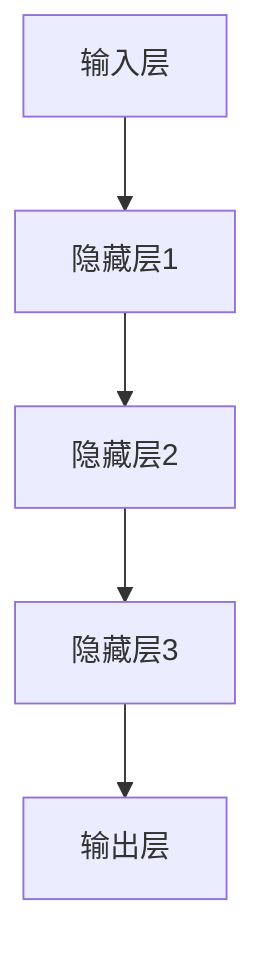

                 

关键词：人工智能，大模型，创业公司，应用指南，技术趋势

> 摘要：本文旨在为AI创业公司提供一个关于大模型应用的全景指南。我们将深入探讨大模型的定义、应用场景、构建方法以及在实际业务中的挑战和解决方案，帮助初创公司更好地利用大模型技术，实现业务突破。

## 1. 背景介绍

随着人工智能技术的迅猛发展，大模型（Large Models）逐渐成为行业的热门话题。大模型是指那些拥有数亿至数十亿参数的深度学习模型，如GPT-3、BERT等。这些模型能够处理海量的数据，实现复杂的自然语言处理、计算机视觉和强化学习任务，为各行各业带来了巨大的变革。

AI创业公司在竞争激烈的市场中，如何快速掌握大模型的应用，成为了一个关键问题。本文将结合实际案例，介绍大模型的应用场景、构建方法、优化策略以及面临的挑战，为AI创业公司提供切实可行的指导。

## 2. 核心概念与联系

### 2.1. 大模型的定义

大模型通常是指具有数十亿参数的深度学习模型，这些模型通过学习大量的数据，能够实现出色的性能。例如，GPT-3拥有1750亿个参数，BERT则拥有上亿个参数。

### 2.2. 大模型的组成

大模型主要由以下几部分组成：

1. **输入层**：接收外部数据，如文本、图像等。
2. **隐藏层**：包含多个神经元，通过前一层的数据计算新的特征。
3. **输出层**：根据隐藏层的特征，生成预测结果。

### 2.3. 大模型的架构

大模型的架构通常采用深度神经网络（DNN）或变换器（Transformer）结构。DNN结构简单，易于理解，但在处理长序列时表现较差。而Transformer结构则能够更好地处理长序列，成为当前主流的大模型架构。



## 3. 核心算法原理 & 具体操作步骤

### 3.1. 算法原理概述

大模型的核心算法是基于深度学习和变换器架构。深度学习通过多层神经网络的学习，将输入数据映射到高维特征空间，从而实现数据的分类、预测等任务。变换器架构则通过自注意力机制（Self-Attention）和多头注意力（Multi-Head Attention），实现对长序列的建模。

### 3.2. 算法步骤详解

1. **数据预处理**：对输入数据进行清洗、归一化等处理。
2. **模型构建**：使用深度学习框架（如TensorFlow、PyTorch）构建大模型。
3. **模型训练**：通过反向传播算法（Backpropagation）对模型进行训练。
4. **模型评估**：使用验证集对模型进行评估，调整模型参数。
5. **模型部署**：将训练好的模型部署到生产环境中。

### 3.3. 算法优缺点

**优点**：

- **强大的建模能力**：大模型能够处理复杂的任务，如自然语言处理、计算机视觉等。
- **出色的性能**：大模型在各类任务中的表现优于传统算法。

**缺点**：

- **计算资源需求大**：大模型需要大量的计算资源进行训练。
- **数据依赖性高**：大模型对数据质量有较高要求，数据缺失或噪声会影响模型性能。

### 3.4. 算法应用领域

大模型在各个领域都有广泛的应用，如：

- **自然语言处理**：文本分类、机器翻译、问答系统等。
- **计算机视觉**：图像分类、目标检测、图像生成等。
- **强化学习**：游戏、机器人控制等。

## 4. 数学模型和公式 & 详细讲解 & 举例说明

### 4.1. 数学模型构建

大模型的数学模型主要基于深度学习和变换器架构。以下是一个简化的数学模型：

$$
Y = f(W \cdot X + b)
$$

其中，$X$ 是输入数据，$Y$ 是预测结果，$W$ 和 $b$ 分别是权重和偏置。

### 4.2. 公式推导过程

变换器架构的核心是自注意力机制（Self-Attention）。自注意力机制通过计算输入序列中每个元素的相关性，生成新的特征表示。具体推导过程如下：

$$
\text{Attention}(Q, K, V) = \text{softmax}\left(\frac{QK^T}{\sqrt{d_k}}\right)V
$$

其中，$Q$、$K$ 和 $V$ 分别是查询、关键和值向量，$d_k$ 是键向量的维度。

### 4.3. 案例分析与讲解

假设我们有一个句子 "我是一只小鸟"，我们可以将其表示为一个序列 $(\text{我}, \text{是}, \text{一}, \text{只}, \text{小}, \text{鸟})$。

通过自注意力机制，我们可以计算句子中每个词之间的相关性。例如，"我" 和 "是" 之间的相关性较高，因为它们在句子中紧邻出现。这种相关性可以用于生成新的特征表示，从而提高模型的性能。

## 5. 项目实践：代码实例和详细解释说明

### 5.1. 开发环境搭建

在开始项目之前，我们需要搭建一个合适的开发环境。以下是所需的软件和工具：

- Python 3.8+
- TensorFlow 2.6+
- CUDA 10.2+
- GPU 显卡（NVIDIA 显卡推荐）

### 5.2. 源代码详细实现

以下是一个简单的示例，展示了如何使用 TensorFlow 构建一个大模型：

```python
import tensorflow as tf

# 定义模型
model = tf.keras.Sequential([
    tf.keras.layers.Embedding(input_dim=10000, output_dim=16),
    tf.keras.layers.GlobalAveragePooling1D(),
    tf.keras.layers.Dense(units=1, activation='sigmoid')
])

# 编译模型
model.compile(optimizer='adam',
              loss='binary_crossentropy',
              metrics=['accuracy'])

# 训练模型
model.fit(x_train, y_train, epochs=10, batch_size=32, validation_data=(x_val, y_val))
```

### 5.3. 代码解读与分析

上述代码首先导入了 TensorFlow 库，然后定义了一个简单的序列模型。模型由嵌入层（Embedding Layer）、全局平均池化层（GlobalAveragePooling1D Layer）和全连接层（Dense Layer）组成。嵌入层将词汇映射到向量表示，全局平均池化层对输入序列进行平均，全连接层用于生成最终的预测结果。

在编译模型时，我们指定了优化器（optimizer）、损失函数（loss）和评估指标（metrics）。最后，使用训练数据对模型进行训练。

### 5.4. 运行结果展示

在训练完成后，我们可以使用测试数据对模型进行评估。以下是一个简单的评估示例：

```python
test_loss, test_acc = model.evaluate(x_test, y_test, verbose=2)
print('\nTest accuracy:', test_acc)
```

这段代码将输出测试数据的损失和准确率，从而评估模型的性能。

## 6. 实际应用场景

大模型在各个行业都有广泛的应用，以下是一些实际应用场景：

- **金融**：大模型可以用于股票市场预测、风险评估等。
- **医疗**：大模型可以用于疾病诊断、医学影像分析等。
- **教育**：大模型可以用于智能问答、个性化学习等。
- **娱乐**：大模型可以用于虚拟现实、游戏开发等。

## 7. 工具和资源推荐

### 7.1. 学习资源推荐

- **《深度学习》（Goodfellow, Bengio, Courville）**：深度学习的经典教材，适合初学者入门。
- **《动手学深度学习》（Abadi, Agarwal, Barham等）**：基于PyTorch的实践教程，适合进阶学习。
- **《自然语言处理与深度学习》（D也不再，李航）**：介绍自然语言处理和深度学习的教材，适合有基础的同学。

### 7.2. 开发工具推荐

- **TensorFlow**：Google 开源的深度学习框架，适合大多数应用场景。
- **PyTorch**：Facebook 开源的深度学习框架，具有简洁、灵活的特点。
- **Keras**：基于TensorFlow和PyTorch的高层API，适合快速构建和实验模型。

### 7.3. 相关论文推荐

- **"Attention Is All You Need"（Vaswani et al., 2017）**：介绍了变换器（Transformer）架构。
- **"BERT: Pre-training of Deep Bidirectional Transformers for Language Understanding"（Devlin et al., 2019）**：介绍了BERT模型的构建方法和应用场景。
- **"GPT-3: Language Models are Few-Shot Learners"（Brown et al., 2020）**：介绍了GPT-3模型的架构和性能。

## 8. 总结：未来发展趋势与挑战

### 8.1. 研究成果总结

近年来，大模型在各个领域取得了显著的成果。例如，GPT-3在自然语言处理任务中的性能远超传统模型，BERT在计算机视觉任务中也取得了较好的成绩。

### 8.2. 未来发展趋势

未来，大模型将继续向更高效、更灵活、更实用的方向发展。随着计算资源的提升和算法的优化，大模型的应用范围将不断扩展，为各行各业带来更多创新。

### 8.3. 面临的挑战

然而，大模型也面临着一些挑战。首先，计算资源需求巨大，对硬件设备有较高要求。其次，数据依赖性高，数据质量和数据量对模型性能有重要影响。此外，大模型的解释性和可解释性也成为一个亟待解决的问题。

### 8.4. 研究展望

未来，研究者将致力于解决大模型的计算、数据、解释性等问题，推动大模型在更广泛的应用场景中发挥更大作用。

## 9. 附录：常见问题与解答

### 问题 1：大模型需要多少数据？

**解答**：大模型的性能高度依赖于数据量。一般来说，大模型需要数百万至数十亿级别的数据才能达到较好的性能。然而，具体的数据量取决于任务类型和模型规模。

### 问题 2：大模型需要多少计算资源？

**解答**：大模型对计算资源的需求非常高。一般来说，需要使用高性能的GPU或TPU进行训练。具体计算资源需求取决于模型规模和训练时间。

### 问题 3：大模型是否一定比小模型性能更好？

**解答**：不一定。虽然大模型通常具有更高的性能，但在某些情况下，小模型可能更适合特定任务。此外，大模型的训练时间和成本也更高。

### 问题 4：如何提高大模型的性能？

**解答**：提高大模型性能的方法包括：增加数据量、使用更先进的模型架构、优化训练过程等。此外，还可以尝试使用迁移学习、强化学习等技术来提升模型性能。

---

作者：禅与计算机程序设计艺术 / Zen and the Art of Computer Programming

本文结合了当前AI领域的最新进展，为AI创业公司提供了一个关于大模型应用的全景指南。通过本文的介绍，读者可以了解大模型的基本概念、应用场景、构建方法以及面临的挑战，从而更好地利用大模型技术，实现业务突破。在未来，随着大模型技术的不断发展和完善，我们期待看到更多创新应用的出现。

---

[结束] <|assistant|>

