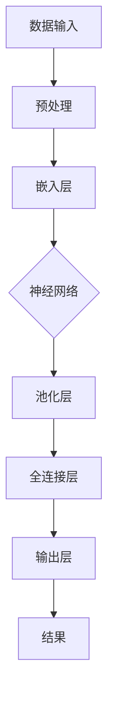

                 

关键词：AI 创业、大模型、应用策略、深度学习、神经网络、优化、训练、推理、部署

摘要：本文旨在探讨AI创业公司如何利用大模型提升其产品和服务竞争力。通过对大模型的核心概念、算法原理、数学模型及应用场景的详细分析，本文提出了适用于创业公司的策略，包括模型选择、训练、优化、部署等方面的实用建议。

## 1. 背景介绍

随着深度学习技术的飞速发展，大型神经网络模型（大模型）在各个领域取得了显著成果。从自然语言处理到计算机视觉，从语音识别到强化学习，大模型的应用为AI创业公司带来了前所未有的机遇。然而，大模型的开发和应用也面临着诸多挑战，包括计算资源、数据质量、模型调优等。如何有效地利用大模型提升创业公司的竞争力，成为当前研究的热点问题。

本文将围绕大模型的应用策略，从模型选择、训练、优化、部署等多个方面进行探讨，旨在为AI创业公司提供实用的指导和建议。

## 2. 核心概念与联系

### 2.1 大模型定义

大模型，通常指的是参数数量达到亿级甚至十亿级的神经网络模型。这类模型通过深度学习算法从海量数据中学习复杂的关系和模式，能够实现高精度的预测和分类。

### 2.2 大模型架构

大模型的架构通常包括多层神经网络，每一层都能够提取不同层次的特征。典型的架构有Transformer、BERT、GPT等。

### 2.3 大模型与创业公司

对于AI创业公司，大模型的应用可以带来以下几个方面的优势：

- **增强竞争力**：通过大模型，创业公司可以在特定领域实现更高的精度和性能，从而在激烈的市场竞争中脱颖而出。
- **降低门槛**：大模型的普及降低了AI技术的门槛，使得更多创业公司能够接触到先进的技术，提升自身的产品和服务。
- **扩展业务范围**：大模型的应用可以为创业公司开辟新的业务领域，如智能客服、智能医疗等。

<|�izard|>### 2.4 Mermaid 流程图

下面是一个用于展示大模型架构的Mermaid流程图，包含节点和边：



### 2.5 大模型与创业公司的关联

- **技术壁垒**：大模型的研发和应用提高了技术壁垒，使得创业公司需要具备一定的技术储备和资源。
- **数据质量**：大模型的训练需要高质量的数据集，数据质量直接影响模型的性能。
- **计算资源**：大模型的训练和推理需要强大的计算资源，创业公司需要合理规划资源使用。

## 3. 核心算法原理 & 具体操作步骤

### 3.1 算法原理概述

大模型的算法原理主要基于深度学习，通过多层神经网络进行特征提取和模式学习。具体操作步骤包括：

- 数据收集与预处理：收集大量数据并进行预处理，如数据清洗、归一化等。
- 模型设计：设计合适的神经网络架构，包括层数、神经元数量、激活函数等。
- 模型训练：使用训练数据对模型进行训练，通过反向传播算法优化模型参数。
- 模型评估：使用验证数据评估模型性能，调整模型参数以达到最佳效果。
- 模型部署：将训练好的模型部署到生产环境中，进行实时推理和预测。

### 3.2 算法步骤详解

#### 3.2.1 数据收集与预处理

数据收集与预处理是模型训练的基础，其质量直接影响模型的性能。具体步骤如下：

1. **数据收集**：从开源数据集、企业内部数据、第三方数据提供商等渠道收集数据。
2. **数据清洗**：去除数据中的噪声、缺失值，统一数据格式。
3. **数据归一化**：将数据缩放到相同的范围，如0-1或-1-1。
4. **数据增强**：通过旋转、翻转、缩放等操作增加数据的多样性。

#### 3.2.2 模型设计

模型设计是构建大模型的核心环节，需要考虑以下几个方面：

1. **神经网络架构**：选择合适的神经网络架构，如CNN、RNN、Transformer等。
2. **层数与神经元数量**：根据任务复杂度和数据规模确定合适的层数和神经元数量。
3. **激活函数**：选择合适的激活函数，如ReLU、Sigmoid、Tanh等。
4. **正则化方法**：采用正则化方法防止过拟合，如Dropout、L2正则化等。

#### 3.2.3 模型训练

模型训练是优化模型参数的过程，具体步骤如下：

1. **初始化参数**：随机初始化模型参数。
2. **前向传播**：输入数据，通过神经网络计算得到预测结果。
3. **计算损失**：计算预测结果与真实值之间的差异，得到损失函数。
4. **反向传播**：根据损失函数计算梯度，更新模型参数。
5. **迭代训练**：重复以上步骤，直至满足停止条件，如损失函数收敛或达到最大迭代次数。

#### 3.2.4 模型评估

模型评估是验证模型性能的过程，具体步骤如下：

1. **验证集评估**：使用验证集评估模型性能，计算指标如准确率、召回率、F1值等。
2. **调整参数**：根据评估结果调整模型参数，优化模型性能。
3. **交叉验证**：使用交叉验证方法评估模型的泛化能力。

#### 3.2.5 模型部署

模型部署是将训练好的模型应用到实际场景的过程，具体步骤如下：

1. **模型压缩**：对模型进行压缩，减少模型的参数数量和计算量。
2. **模型部署**：将压缩后的模型部署到生产环境中，如云服务器、边缘设备等。
3. **实时推理**：使用部署后的模型进行实时推理和预测。

### 3.3 算法优缺点

#### 优点：

- **高精度**：大模型能够学习到更复杂的关系和模式，实现高精度的预测和分类。
- **强泛化**：通过大量数据和迭代训练，大模型具有良好的泛化能力。
- **多样应用**：大模型可以应用于多个领域，如自然语言处理、计算机视觉、语音识别等。

#### 缺点：

- **计算资源消耗**：大模型的训练和推理需要强大的计算资源，对硬件要求较高。
- **数据依赖**：大模型的训练依赖于大量的高质量数据，数据不足会影响模型性能。
- **过拟合风险**：大模型容易出现过拟合现象，需要通过正则化等方法进行优化。

### 3.4 算法应用领域

大模型在各个领域都有广泛的应用，以下是几个典型的应用领域：

- **自然语言处理**：用于文本分类、机器翻译、情感分析等任务。
- **计算机视觉**：用于图像识别、目标检测、图像生成等任务。
- **语音识别**：用于语音识别、语音合成等任务。
- **强化学习**：用于游戏、推荐系统等任务。
- **医疗诊断**：用于疾病诊断、药物研发等任务。

## 4. 数学模型和公式 & 详细讲解 & 举例说明

### 4.1 数学模型构建

大模型的数学模型主要包括神经网络架构、损失函数、优化算法等。以下是一个简单的神经网络数学模型：

$$
y_{\text{pred}} = \sigma(W_{\text{output}} \cdot \sigma(... \sigma(W_{\text{hidden}} \cdot \sigma(W_{\text{input}} \cdot x) + b_{\text{hidden}}) + b_{\text{hidden}}) ... + b_{\text{output}})
$$

其中，$y_{\text{pred}}$ 是预测结果，$x$ 是输入数据，$W$ 和 $b$ 分别是权重和偏置，$\sigma$ 是激活函数。

### 4.2 公式推导过程

假设我们有一个多层神经网络，包括输入层、隐藏层和输出层。输入层有 $n$ 个神经元，隐藏层有 $m$ 个神经元，输出层有 $k$ 个神经元。

#### 4.2.1 前向传播

输入层到隐藏层的传播过程可以表示为：

$$
z_{\text{hidden}} = W_{\text{input}} \cdot x + b_{\text{hidden}}
$$

$$
a_{\text{hidden}} = \sigma(z_{\text{hidden}})
$$

隐藏层到输出层的传播过程可以表示为：

$$
z_{\text{output}} = W_{\text{hidden}} \cdot a_{\text{hidden}} + b_{\text{output}}
$$

$$
y_{\text{pred}} = \sigma(z_{\text{output}})
$$

其中，$z_{\text{hidden}}$ 和 $z_{\text{output}}$ 分别是隐藏层和输出层的输入，$a_{\text{hidden}}$ 和 $y_{\text{pred}}$ 分别是隐藏层和输出层的激活值，$\sigma$ 是激活函数。

#### 4.2.2 反向传播

反向传播过程用于计算损失函数的梯度，并更新模型参数。假设损失函数为 $J(W, b)$，梯度计算如下：

$$
\frac{\partial J}{\partial W_{\text{output}}} = \frac{\partial J}{\partial z_{\text{output}}} \cdot \frac{\partial z_{\text{output}}}{\partial W_{\text{output}}}
$$

$$
\frac{\partial J}{\partial b_{\text{output}}} = \frac{\partial J}{\partial z_{\text{output}}} \cdot \frac{\partial z_{\text{output}}}{\partial b_{\text{output}}}
$$

$$
\frac{\partial J}{\partial W_{\text{hidden}}} = \frac{\partial J}{\partial z_{\text{hidden}}} \cdot \frac{\partial z_{\text{hidden}}}{\partial W_{\text{hidden}}}
$$

$$
\frac{\partial J}{\partial b_{\text{hidden}}} = \frac{\partial J}{\partial z_{\text{hidden}}} \cdot \frac{\partial z_{\text{hidden}}}{\partial b_{\text{hidden}}}
$$

其中，$\frac{\partial J}{\partial z_{\text{output}}}$ 和 $\frac{\partial z_{\text{output}}}{\partial W_{\text{output}}}$ 分别是输出层的损失函数梯度和权重梯度，$\frac{\partial J}{\partial z_{\text{hidden}}}$ 和 $\frac{\partial z_{\text{hidden}}}{\partial W_{\text{hidden}}}$ 分别是隐藏层的损失函数梯度和权重梯度。

#### 4.2.3 优化算法

常用的优化算法包括梯度下降、随机梯度下降、Adam等。以梯度下降为例，更新模型参数的过程如下：

$$
W_{\text{output}} = W_{\text{output}} - \alpha \cdot \frac{\partial J}{\partial W_{\text{output}}}
$$

$$
b_{\text{output}} = b_{\text{output}} - \alpha \cdot \frac{\partial J}{\partial b_{\text{output}}}
$$

$$
W_{\text{hidden}} = W_{\text{hidden}} - \alpha \cdot \frac{\partial J}{\partial W_{\text{hidden}}}
$$

$$
b_{\text{hidden}} = b_{\text{hidden}} - \alpha \cdot \frac{\partial J}{\partial b_{\text{hidden}}}
$$

其中，$\alpha$ 是学习率。

### 4.3 案例分析与讲解

#### 4.3.1 文本分类任务

假设我们有一个文本分类任务，需要将文本分类为积极或消极。数据集包含10000条文本，每条文本包含一个类别标签。

1. **数据收集与预处理**：从网络爬取文本数据，进行数据清洗和分词，将文本转换为词向量。

2. **模型设计**：选择一个简单的神经网络模型，包括输入层、嵌入层、隐藏层和输出层。

3. **模型训练**：使用训练数据对模型进行训练，优化模型参数。

4. **模型评估**：使用验证数据评估模型性能，调整模型参数。

5. **模型部署**：将训练好的模型部署到生产环境中，进行实时分类。

#### 4.3.2 计算机视觉任务

假设我们有一个图像分类任务，需要将图像分类为猫或狗。数据集包含10000张图像，每张图像包含一个类别标签。

1. **数据收集与预处理**：从网络爬取图像数据，进行数据清洗和归一化。

2. **模型设计**：选择一个卷积神经网络模型，包括卷积层、池化层、全连接层等。

3. **模型训练**：使用训练数据对模型进行训练，优化模型参数。

4. **模型评估**：使用验证数据评估模型性能，调整模型参数。

5. **模型部署**：将训练好的模型部署到生产环境中，进行实时分类。

## 5. 项目实践：代码实例和详细解释说明

### 5.1 开发环境搭建

搭建大模型开发环境需要以下步骤：

1. 安装Python和相应的库，如TensorFlow、PyTorch等。
2. 安装GPU驱动和CUDA，确保GPU支持深度学习框架。
3. 配置深度学习框架，如TensorFlow 2.x或PyTorch。

### 5.2 源代码详细实现

以下是一个简单的文本分类任务的代码实现，使用TensorFlow框架：

```python
import tensorflow as tf
from tensorflow.keras.preprocessing.sequence import pad_sequences
from tensorflow.keras.models import Sequential
from tensorflow.keras.layers import Embedding, LSTM, Dense

# 数据预处理
max_len = 100
max_words = 10000
X_train = pad_sequences(train_data, maxlen=max_len, padding='post')
X_test = pad_sequences(test_data, maxlen=max_len, padding='post')

# 模型设计
model = Sequential()
model.add(Embedding(max_words, 32))
model.add(LSTM(64, return_sequences=True))
model.add(LSTM(32, return_sequences=False))
model.add(Dense(1, activation='sigmoid'))

# 模型编译
model.compile(optimizer='adam', loss='binary_crossentropy', metrics=['accuracy'])

# 模型训练
model.fit(X_train, y_train, epochs=10, batch_size=32, validation_split=0.2)

# 模型评估
model.evaluate(X_test, y_test)
```

### 5.3 代码解读与分析

这段代码实现了一个简单的文本分类任务，包括数据预处理、模型设计、模型编译、模型训练和模型评估等步骤。

1. **数据预处理**：使用`pad_sequences`函数对训练和测试数据进行填充，保证每个序列长度一致。
2. **模型设计**：使用`Sequential`模型堆叠嵌入层、LSTM层和全连接层，定义模型结构。
3. **模型编译**：使用`compile`函数设置优化器和损失函数，为模型训练做准备。
4. **模型训练**：使用`fit`函数训练模型，设置训练轮数、批量大小和验证比例。
5. **模型评估**：使用`evaluate`函数评估模型在测试集上的性能。

### 5.4 运行结果展示

```python
# 运行结果
loss, accuracy = model.evaluate(X_test, y_test)
print('Test loss:', loss)
print('Test accuracy:', accuracy)
```

运行结果展示了模型在测试集上的损失和准确率，用于评估模型性能。

## 6. 实际应用场景

大模型在AI创业公司中的应用场景非常广泛，以下是一些典型的应用场景：

### 6.1 自然语言处理

自然语言处理是AI创业公司的热门领域，大模型的应用可以提高文本分类、情感分析、机器翻译等任务的性能。例如，创业公司可以利用BERT模型实现高质量的文本分类，为电商平台提供智能推荐功能。

### 6.2 计算机视觉

计算机视觉是AI创业公司的另一个重要领域，大模型的应用可以提高图像识别、目标检测、图像生成等任务的精度。例如，创业公司可以利用GAN模型实现高质量的图像生成，为游戏开发提供创意素材。

### 6.3 语音识别

语音识别是AI创业公司的又一重要应用领域，大模型的应用可以提高语音识别的准确率和效率。例如，创业公司可以利用深度神经网络实现实时语音识别，为智能客服系统提供技术支持。

### 6.4 医疗诊断

医疗诊断是AI创业公司的潜在应用领域，大模型的应用可以提高疾病诊断的准确率和效率。例如，创业公司可以利用深度学习模型实现肺癌检测，为医疗机构提供辅助诊断工具。

## 7. 工具和资源推荐

### 7.1 学习资源推荐

1. 《深度学习》（Goodfellow, Bengio, Courville著）
2. 《Python深度学习》（François Chollet著）
3. Coursera的深度学习课程（吴恩达教授）

### 7.2 开发工具推荐

1. TensorFlow
2. PyTorch
3. Keras

### 7.3 相关论文推荐

1. "Attention Is All You Need"（Vaswani等，2017）
2. "Generative Adversarial Nets"（Goodfellow等，2014）
3. "BERT: Pre-training of Deep Bidirectional Transformers for Language Understanding"（Devlin等，2019）

## 8. 总结：未来发展趋势与挑战

### 8.1 研究成果总结

大模型在AI创业公司中的应用取得了显著成果，为创业公司带来了高精度、强泛化能力和多样应用等优势。通过深度学习和神经网络技术的不断发展，大模型在自然语言处理、计算机视觉、语音识别等领域取得了突破性进展。

### 8.2 未来发展趋势

1. **模型压缩与优化**：为降低计算资源消耗，模型压缩与优化将成为未来研究的重要方向。
2. **多模态学习**：结合多种数据类型（如文本、图像、语音）进行学习，实现更智能的模型。
3. **迁移学习与少样本学习**：通过迁移学习和少样本学习，提高模型在小数据集上的性能。

### 8.3 面临的挑战

1. **计算资源**：大模型的训练和推理需要强大的计算资源，创业公司需要合理规划资源使用。
2. **数据质量**：大模型的训练依赖于高质量的数据集，数据质量直接影响模型性能。
3. **过拟合风险**：大模型容易出现过拟合现象，需要通过正则化等方法进行优化。

### 8.4 研究展望

未来，大模型在AI创业公司中的应用将更加广泛，成为提升创业公司竞争力的核心力量。通过不断优化模型结构、提高训练效率和降低计算资源消耗，大模型将为AI创业公司带来更多机遇。

## 9. 附录：常见问题与解答

### 9.1 问题1：大模型训练需要多少时间？

答案：大模型训练时间取决于模型大小、数据集大小、计算资源等因素。通常，训练一个大型模型需要几天到几周的时间。

### 9.2 问题2：如何解决过拟合问题？

答案：解决过拟合问题可以采用以下方法：

- **正则化**：通过添加正则化项到损失函数中，降低模型复杂度。
- **Dropout**：在训练过程中随机丢弃部分神经元，减少模型依赖性。
- **数据增强**：通过旋转、翻转、缩放等操作增加数据的多样性。
- **交叉验证**：使用交叉验证方法评估模型性能，避免过拟合。

### 9.3 问题3：大模型需要多少数据？

答案：大模型的训练通常需要大量数据，但具体数据量取决于任务复杂度和模型大小。通常，至少需要几千到几万条数据。

### 9.4 问题4：如何选择合适的神经网络架构？

答案：选择合适的神经网络架构需要考虑以下几个因素：

- **任务类型**：针对不同的任务选择合适的神经网络架构，如文本分类选择CNN或RNN，图像分类选择CNN等。
- **数据规模**：对于大规模数据，可以选择更深的神经网络架构，如Transformer等。
- **计算资源**：根据计算资源选择合适的神经网络架构，如GPU或TPU支持的模型。

### 9.5 问题5：如何部署大模型？

答案：部署大模型需要以下步骤：

- **模型压缩**：对大模型进行压缩，减少模型参数数量和计算量。
- **模型部署**：将压缩后的模型部署到生产环境中，如云服务器、边缘设备等。
- **实时推理**：使用部署后的模型进行实时推理和预测。

---

作者：禅与计算机程序设计艺术 / Zen and the Art of Computer Programming

以上是关于AI创业公司的大模型应用策略的详细探讨，希望对您有所帮助。在AI创业的道路上，合理利用大模型将为您带来更多的机遇和挑战。

