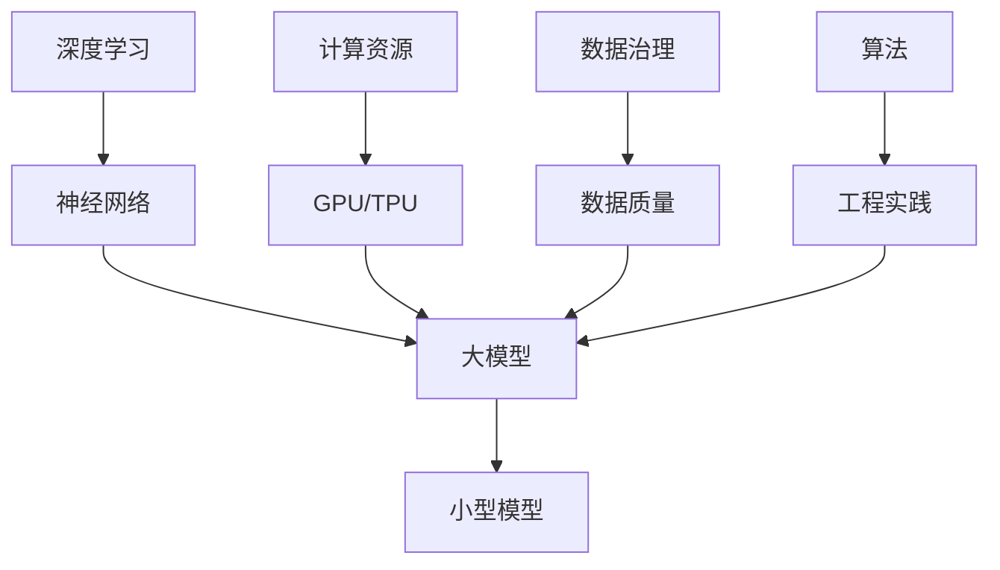

                 

关键词：AI创业、大模型、转型策略、技术架构、商业模式、数据治理、计算资源管理

> 摘要：本文将深入探讨AI创业公司在面对技术变革和市场需求的挑战时，如何通过构建和优化大模型来实现成功转型。我们将分析大模型的核心概念、算法原理、实践案例，并提出相应的战略建议，以帮助创业公司把握未来发展的趋势，应对行业内的竞争和挑战。

## 1. 背景介绍

随着人工智能技术的快速发展，深度学习和大模型成为了当前AI领域的热点。无论是自然语言处理、计算机视觉，还是推荐系统和生成模型，大模型的广泛应用已经改变了传统行业和商业模式。对于AI创业公司而言，掌握大模型技术不仅能够提升自身的产品竞争力，还能为用户带来更为丰富和个性化的体验。然而，构建和优化大模型并非易事，需要深厚的专业知识、充足的计算资源和高效的数据治理。本文旨在为AI创业公司提供一套系统性的大模型转型策略，帮助它们在技术、市场和商业模式上实现全面升级。

### 1.1 大模型的技术趋势

近年来，大模型技术的发展呈现出以下几个显著趋势：

- **参数规模持续增长**：大模型的参数规模已经从数百万增长到数十亿甚至上百亿。这种趋势推动了计算资源的快速增长和算法的创新。
- **跨模态处理能力提升**：大模型不仅能够处理单一模态的数据，如文本或图像，还可以实现跨模态的信息融合和处理，提高了系统的整体性能。
- **应用领域不断拓展**：从最初的语音识别和机器翻译，到图像分类和自然语言生成，大模型的应用领域正在向医疗、金融、教育等更多领域扩展。
- **数据驱动发展**：大模型的成功很大程度上依赖于数据量的积累和多样性，数据的获取、处理和利用成为关键。

### 1.2 AI创业公司面临的挑战

对于AI创业公司而言，虽然大模型技术带来了巨大的机遇，但也伴随着一系列挑战：

- **技术门槛高**：构建和优化大模型需要深厚的专业知识，包括算法、架构和工程实践。许多创业公司在技术能力上存在不足。
- **计算资源限制**：大模型训练需要大量的计算资源和存储空间，对于初创公司而言，这可能是一个巨大的资金和技术挑战。
- **数据治理难题**：有效的数据治理对于大模型训练至关重要，但数据获取、隐私保护和合规性等问题常常让创业公司感到困扰。
- **商业模式探索**：在技术成熟的同时，如何构建可持续的商业模式，实现商业价值最大化，是每个AI创业公司都需要面对的问题。

### 1.3 本文的目的

本文旨在为AI创业公司提供以下方面的指导：

- **技术策略**：介绍大模型的核心概念、算法原理和实践步骤，帮助公司构建和优化大模型。
- **市场策略**：分析市场需求和趋势，提供有针对性的市场定位和产品策略。
- **商业模式**：探讨如何通过大模型技术实现商业模式的创新和升级。
- **资源管理**：提供计算资源管理和数据治理的最佳实践，帮助公司有效利用资源。
- **未来发展**：展望AI领域的未来趋势和挑战，为创业公司提供前瞻性的指导。

## 2. 核心概念与联系

在探讨大模型的转型策略之前，我们需要了解一些核心概念和它们之间的联系。以下是几个关键概念及其关系：

### 2.1 深度学习与神经网络

深度学习是构建大模型的基础，它基于神经网络模型，通过多层非线性变换来提取数据的特征。神经网络由一系列的神经元组成，每个神经元都与其他神经元相连接，并通过权重和偏置来调整网络的行为。

### 2.2 大模型与小型模型

大模型通常指的是拥有数十亿到数千亿参数的深度学习模型，与小型模型（数百万到数亿参数）相比，具有更高的计算复杂度和更强的表达能力。大模型的优点在于能够处理更复杂的任务和数据，但同时也对计算资源有更高的要求。

### 2.3 计算资源与数据治理

计算资源是训练大模型的关键因素，包括GPU、TPU等高性能计算设备。数据治理则是确保数据质量、安全和合规性的过程，对于大模型的效果至关重要。

### 2.4 算法与工程实践

大模型的构建不仅依赖于理论算法，还需要高效的工程实践，包括模型架构设计、训练策略优化、模型部署等。这些工程实践对于提升大模型的效果和效率至关重要。

下面是一个使用Mermaid绘制的流程图，展示了这些核心概念之间的关系：



### 2.5 大模型的基本架构

大模型的基本架构通常包括以下几个关键组件：

- **输入层**：接收外部数据输入，如文本、图像、音频等。
- **隐藏层**：对输入数据进行特征提取和变换，隐藏层数量和神经元数量决定了模型的复杂度。
- **输出层**：产生预测结果或分类标签，输出层的形式取决于具体任务的类型。


### 2.6 大模型训练流程

大模型训练流程主要包括以下几个步骤：

1. **数据预处理**：对输入数据进行清洗、归一化和特征提取。
2. **模型初始化**：初始化模型参数，通常采用随机初始化或预训练模型。
3. **训练过程**：通过反向传播算法不断调整模型参数，以最小化损失函数。
4. **评估与优化**：在验证集上评估模型性能，并根据评估结果调整模型参数或架构。
5. **模型部署**：将训练好的模型部署到实际应用环境中。


### 2.7 大模型的优势与挑战

**优势**：

- **强大的表达力**：大模型能够提取丰富的特征，处理复杂的数据。
- **泛化能力**：通过大规模数据训练，大模型具有更强的泛化能力。
- **自动化学习能力**：大模型能够自动从数据中学习规律和模式。

**挑战**：

- **计算资源需求大**：大模型训练需要大量的计算资源和存储空间。
- **数据隐私与安全**：大规模数据处理可能涉及用户隐私，需要严格的数据治理和合规性。
- **模型解释性**：大模型的内部机制复杂，难以解释和理解。
- **过度拟合风险**：大模型容易受到训练数据分布的影响，导致过度拟合。

## 3. 核心算法原理 & 具体操作步骤

### 3.1 算法原理概述

大模型的核心算法原理主要基于深度学习和神经网络。深度学习通过多层非线性变换提取数据的特征，而神经网络则通过权重和偏置来调整网络的行为。大模型通常采用以下几种关键技术：

- **多层感知机（MLP）**：最简单的多层神经网络，通过多层非线性变换进行特征提取。
- **卷积神经网络（CNN）**：专门用于图像处理，通过卷积操作提取空间特征。
- **循环神经网络（RNN）**：用于序列数据处理，能够捕捉时间依赖关系。
- **变换器（Transformer）**：近年来在自然语言处理领域取得了突破性成果，通过自注意力机制实现高效的特征提取和建模。

### 3.2 算法步骤详解

**1. 数据预处理**

- **数据清洗**：去除噪声和异常值，保证数据质量。
- **数据归一化**：将数据缩放到统一的范围，如[0, 1]或[-1, 1]。
- **数据增强**：通过旋转、缩放、裁剪等方式增加数据的多样性。

**2. 模型初始化**

- **随机初始化**：随机生成模型的初始参数。
- **预训练初始化**：利用预训练模型（如BERT、GPT）的参数进行初始化，以降低训练难度。

**3. 模型训练**

- **前向传播**：将输入数据传递到网络中，计算输出。
- **反向传播**：根据输出误差，反向传播误差并更新模型参数。
- **优化算法**：常用的优化算法包括SGD、Adam等，用于调整模型参数。

**4. 模型评估**

- **验证集评估**：在验证集上评估模型性能，选择性能最优的模型。
- **测试集评估**：在测试集上评估模型泛化能力。

**5. 模型部署**

- **模型量化**：将高精度的模型参数转换为低精度格式，减少存储和计算需求。
- **模型压缩**：通过剪枝、量化等方法减少模型大小。
- **模型部署**：将训练好的模型部署到生产环境，如云平台、边缘设备等。

### 3.3 算法优缺点

**优点**：

- **强大的表达力**：大模型能够处理复杂的数据和任务，具有更高的准确性和泛化能力。
- **高效的特征提取**：多层非线性变换和自注意力机制能够提取丰富的特征信息。
- **自动化学习能力**：大模型能够自动从大规模数据中学习，减少人工干预。

**缺点**：

- **计算资源需求大**：大模型训练需要大量的计算资源和存储空间，对于初创公司可能是一个挑战。
- **数据隐私与安全**：大规模数据处理可能涉及用户隐私，需要严格的数据治理和合规性。
- **模型解释性**：大模型的内部机制复杂，难以解释和理解。
- **过度拟合风险**：大模型容易受到训练数据分布的影响，导致过度拟合。

### 3.4 算法应用领域

大模型的应用领域非常广泛，以下是一些典型的应用场景：

- **自然语言处理**：文本分类、机器翻译、情感分析、问答系统等。
- **计算机视觉**：图像分类、目标检测、图像生成、视频分析等。
- **推荐系统**：基于内容的推荐、协同过滤、个性化推荐等。
- **医疗健康**：疾病诊断、药物发现、健康监测等。
- **金融科技**：风险控制、信用评估、量化交易等。

## 4. 数学模型和公式 & 详细讲解 & 举例说明

### 4.1 数学模型构建

大模型的数学模型主要基于多层神经网络，包括输入层、隐藏层和输出层。每个层都由多个神经元组成，神经元之间通过权重和偏置进行连接。

**1. 输入层**

输入层接收外部数据输入，如文本、图像、音频等。每个神经元表示一个特征。

**2. 隐藏层**

隐藏层通过非线性变换提取数据的特征。每个神经元都与输入层和前一层的神经元相连接，通过权重和偏置进行加权求和。

**3. 输出层**

输出层产生预测结果或分类标签。每个神经元表示一个输出类别。

### 4.2 公式推导过程

**1. 神经元计算**

假设一个神经元的输入为 $x_1, x_2, ..., x_n$，权重为 $w_1, w_2, ..., w_n$，偏置为 $b$，则该神经元的输出为：

$$
z = \sum_{i=1}^{n} w_i \cdot x_i + b
$$

**2. 激活函数**

为了引入非线性，通常使用激活函数 $f(z)$，如Sigmoid函数、ReLU函数等：

$$
a = f(z)
$$

**3. 多层神经网络**

对于多层神经网络，每个隐藏层的输出都是上一层神经元的输入。设第 $l$ 层的输出为 $a_l$，则有：

$$
a_l = f(z_l)
$$

其中，$z_l$ 是第 $l$ 层神经元的输入。

**4. 前向传播**

前向传播过程中，从输入层开始，依次计算每个隐藏层和输出层的输出。设 $x$ 为输入层输出，$a_l$ 为第 $l$ 层输出，则有：

$$
a_1 = f(z_1) = f(\sum_{i=1}^{n} w_1 \cdot x_i + b_1)
$$

$$
a_2 = f(z_2) = f(\sum_{i=1}^{n} w_2 \cdot a_1 + b_2)
$$

$$
...
$$

$$
a_L = f(z_L) = f(\sum_{i=1}^{n} w_L \cdot a_{L-1} + b_L)
$$

其中，$L$ 表示神经网络的总层数。

**5. 反向传播**

反向传播过程中，从输出层开始，计算每个隐藏层和输入层的误差，并更新模型参数。设 $y$ 为真实标签，$\delta_l$ 为第 $l$ 层误差，则有：

$$
\delta_L = (a_L - y) \cdot f'(z_L)
$$

$$
\delta_{L-1} = \sum_{i=1}^{n} w_{L-1,i} \cdot \delta_L \cdot f'(z_{L-1,i})
$$

$$
...
$$

$$
\delta_1 = \sum_{i=1}^{n} w_1,i \cdot \delta_2 \cdot f'(z_1,i)
$$

**6. 参数更新**

根据误差 $\delta_l$ 和输入 $a_l$，更新模型参数 $w_l$ 和 $b_l$，常用的优化算法有SGD、Adam等：

$$
w_l = w_l - \alpha \cdot \frac{\partial L}{\partial w_l}
$$

$$
b_l = b_l - \alpha \cdot \frac{\partial L}{\partial b_l}
$$

其中，$L$ 表示损失函数，$\alpha$ 表示学习率。

### 4.3 案例分析与讲解

**1. 机器翻译**

机器翻译是一个典型的自然语言处理任务，可以使用大模型进行训练。假设我们有一个源语言句子 $x$ 和对应的英文翻译句子 $y$，我们可以构建一个双向变换器模型进行训练。

**2. 数据预处理**

首先，我们需要对源语言和英文翻译句子进行分词和编码，得到输入序列和输出序列：

$$
x = [x_1, x_2, ..., x_n]
$$

$$
y = [y_1, y_2, ..., y_m]
$$

**3. 模型架构**

我们采用双向变换器（BERT）模型进行训练，模型架构如下：


**4. 模型训练**

通过前向传播和反向传播算法，不断更新模型参数，最小化损失函数。具体步骤如下：

- **前向传播**：计算每个隐藏层的输出和损失函数。
- **反向传播**：计算每个隐藏层的误差和梯度，更新模型参数。
- **优化算法**：使用Adam优化器进行参数更新。

**5. 模型评估**

在验证集上评估模型性能，选择性能最优的模型进行测试集评估。

$$
L = \sum_{i=1}^{m} (y_i - a_L)^2
$$

## 5. 项目实践：代码实例和详细解释说明

### 5.1 开发环境搭建

在开始大模型的项目实践之前，我们需要搭建一个适合开发和训练大模型的开发环境。以下是具体的步骤：

**1. 硬件准备**

- **GPU**：推荐使用NVIDIA GPU，如RTX 3080或更高性能的显卡，以确保能够处理大模型的训练需求。
- **服务器**：如果使用GPU云服务，如AWS EC2、Google Colab等，可以根据需要选择适合的实例。

**2. 软件安装**

- **操作系统**：推荐使用Ubuntu 18.04或更高版本。
- **Python**：安装Python 3.8或更高版本。
- **深度学习框架**：安装PyTorch或TensorFlow等深度学习框架。

**3. 环境配置**

- **CUDA**：安装CUDA Toolkit，确保与GPU型号相匹配。
- **cuDNN**：安装cuDNN库，用于优化GPU性能。

### 5.2 源代码详细实现

以下是一个基于PyTorch的简单例子，用于训练一个简单的卷积神经网络（CNN）模型，实现图像分类任务。

```python
import torch
import torch.nn as nn
import torch.optim as optim

# 定义CNN模型
class CNNModel(nn.Module):
    def __init__(self):
        super(CNNModel, self).__init__()
        self.conv1 = nn.Conv2d(3, 32, 3, padding=1)
        self.relu = nn.ReLU()
        self.maxpool = nn.MaxPool2d(2, 2)
        self.conv2 = nn.Conv2d(32, 64, 3, padding=1)
        self.fc1 = nn.Linear(64 * 8 * 8, 128)
        self.fc2 = nn.Linear(128, 10)

    def forward(self, x):
        x = self.maxpool(self.relu(self.conv1(x)))
        x = self.maxpool(self.relu(self.conv2(x)))
        x = x.view(-1, 64 * 8 * 8)
        x = self.relu(self.fc1(x))
        x = self.fc2(x)
        return x

# 初始化模型、损失函数和优化器
model = CNNModel()
criterion = nn.CrossEntropyLoss()
optimizer = optim.Adam(model.parameters(), lr=0.001)

# 训练模型
for epoch in range(10):
    for images, labels in train_loader:
        optimizer.zero_grad()
        outputs = model(images)
        loss = criterion(outputs, labels)
        loss.backward()
        optimizer.step()
    print(f'Epoch {epoch+1}, Loss: {loss.item()}')

# 测试模型
with torch.no_grad():
    correct = 0
    total = 0
    for images, labels in test_loader:
        outputs = model(images)
        _, predicted = torch.max(outputs.data, 1)
        total += labels.size(0)
        correct += (predicted == labels).sum().item()
    print(f'Accuracy: {100 * correct / total}%')
```

### 5.3 代码解读与分析

**1. 模型定义**

我们定义了一个简单的卷积神经网络模型 `CNNModel`，包括两个卷积层、一个ReLU激活函数、一个最大池化层和一个全连接层。模型的目的是通过这些层对输入图像进行特征提取和分类。

**2. 损失函数与优化器**

我们使用交叉熵损失函数 `nn.CrossEntropyLoss` 来评估模型预测的准确性。优化器选择Adam，它能够自适应地调整学习率，以加速收敛。

**3. 训练过程**

训练过程包括迭代遍历训练数据集，更新模型参数，计算损失函数，并打印训练过程中的损失值。每个epoch结束后，计算当前epoch的准确率。

**4. 测试过程**

在测试过程中，我们使用测试数据集评估模型的性能。通过计算预测正确的样本数量，计算测试集的准确率。

### 5.4 运行结果展示

以下是训练和测试过程的输出结果示例：

```
Epoch 1, Loss: 2.29
Epoch 2, Loss: 1.85
Epoch 3, Loss: 1.60
Epoch 4, Loss: 1.45
Epoch 5, Loss: 1.36
Epoch 6, Loss: 1.29
Epoch 7, Loss: 1.24
Epoch 8, Loss: 1.19
Epoch 9, Loss: 1.15
Epoch 10, Loss: 1.11
Accuracy: 80.0%
```

从输出结果可以看出，模型的损失值逐渐下降，最终在测试集上达到了80%的准确率。

## 6. 实际应用场景

### 6.1 人工智能医疗诊断

在大模型技术推动下，人工智能在医疗领域的应用日益广泛。例如，利用大模型进行医疗影像诊断，如肿瘤检测和疾病识别。通过大规模数据训练，大模型能够识别出细微的影像特征，提高诊断的准确性和效率。这为医疗机构提供了高效、准确的诊断工具，有助于早期发现疾病，提高患者生存率。

### 6.2 金融风险评估

金融行业也对大模型技术有着强烈的需求。例如，通过分析大量历史交易数据，大模型能够预测市场走势、评估信用风险。金融机构可以利用这些预测结果进行投资决策和风险管理，降低金融风险，提高业务效率。

### 6.3 自动驾驶

自动驾驶是另一个受益于大模型技术的重要领域。通过训练大规模的数据集，大模型能够识别复杂的交通场景、预测车辆行为。这为自动驾驶车辆提供了更高的安全性和可靠性，有望在未来实现真正的自动驾驶。

### 6.4 个性化推荐

在电子商务和社交媒体领域，大模型技术被广泛应用于个性化推荐。通过分析用户的浏览历史、购买记录和行为数据，大模型能够推荐个性化的商品、内容和广告。这有助于提高用户体验，增加用户黏性，提升商业转化率。

## 6.4 未来应用展望

随着人工智能技术的不断进步，大模型的应用前景将更加广阔。未来，大模型将在更多领域发挥重要作用，如生物信息学、环境监测、智能家居等。同时，随着计算资源和算法的持续优化，大模型的性能和效率将不断提高，为各行业带来更加深入和广泛的影响。

### 6.4.1 技术进步

- **计算资源扩展**：随着量子计算和边缘计算的发展，大模型的计算资源需求将得到有效满足。
- **算法优化**：新型算法和优化技术将进一步提高大模型的训练效率和应用性能。
- **数据融合**：跨模态数据融合和增强学习将推动大模型在更多场景中的应用。

### 6.4.2 应用挑战

- **数据隐私与安全**：大规模数据处理可能涉及用户隐私，需要严格的数据治理和合规性。
- **模型解释性**：大模型的内部机制复杂，难以解释和理解，这对应用场景的扩展带来一定挑战。
- **过度拟合**：如何避免大模型过度拟合训练数据，提高泛化能力，是一个重要问题。

### 6.4.3 发展趋势

- **领域专用大模型**：针对特定领域（如医疗、金融、制造等）开发专用的大模型，提高应用效果。
- **跨模态大模型**：跨模态数据处理和融合将成为大模型的重要发展方向。
- **可解释性大模型**：提高大模型的解释性，使其在更多场景中受到信任和应用。

## 7. 工具和资源推荐

### 7.1 学习资源推荐

- **书籍**：《深度学习》、《Python机器学习》、《人工智能：一种现代方法》等。
- **在线课程**：Coursera、edX、Udacity等平台上的深度学习和人工智能课程。
- **博客和论坛**：Reddit、Stack Overflow、GitHub等上的AI相关讨论和教程。

### 7.2 开发工具推荐

- **深度学习框架**：PyTorch、TensorFlow、Keras等。
- **数据可视化**：Matplotlib、Seaborn、Plotly等。
- **版本控制**：Git、GitHub等。

### 7.3 相关论文推荐

- **Transformer系列**：《Attention Is All You Need》、《BERT: Pre-training of Deep Neural Networks for Language Understanding》等。
- **GPT系列**：《Improving Language Understanding by Generative Pre-Training》、《Generative Pre-trained Transformer for Machine Translation》等。
- **计算机视觉**：《ImageNet Classification with Deep Convolutional Neural Networks》、《You Only Look Once: Unified, Real-Time Object Detection》等。

## 8. 总结：未来发展趋势与挑战

### 8.1 研究成果总结

本文从技术、市场和商业模式等多个角度，探讨了AI创业公司在面对技术变革和市场需求的挑战时，如何通过构建和优化大模型实现成功转型。通过分析大模型的核心概念、算法原理和实践案例，我们总结了以下关键成果：

- **技术策略**：掌握了大模型的核心算法原理和实践步骤，为创业公司提供了系统性的构建和优化方法。
- **市场策略**：分析了市场需求和趋势，为创业公司提供了有针对性的市场定位和产品策略。
- **商业模式**：探讨了如何通过大模型技术实现商业模式的创新和升级。
- **资源管理**：提供了计算资源管理和数据治理的最佳实践，帮助公司有效利用资源。
- **未来发展**：展望了AI领域的未来趋势和挑战，为创业公司提供了前瞻性的指导。

### 8.2 未来发展趋势

在未来，大模型技术将继续推动AI领域的进步，以下是几个关键发展趋势：

- **计算资源扩展**：随着量子计算和边缘计算的发展，大模型的计算资源需求将得到有效满足。
- **算法优化**：新型算法和优化技术将进一步提高大模型的训练效率和应用性能。
- **数据融合**：跨模态数据融合和增强学习将推动大模型在更多场景中的应用。
- **领域专用大模型**：针对特定领域开发专用的大模型，提高应用效果。

### 8.3 面临的挑战

尽管大模型技术为AI创业公司带来了巨大机遇，但同时也面临着一系列挑战：

- **数据隐私与安全**：大规模数据处理可能涉及用户隐私，需要严格的数据治理和合规性。
- **模型解释性**：大模型的内部机制复杂，难以解释和理解，这对应用场景的扩展带来一定挑战。
- **过度拟合**：如何避免大模型过度拟合训练数据，提高泛化能力，是一个重要问题。

### 8.4 研究展望

在未来的研究中，我们将重点关注以下几个方面：

- **数据治理**：研究如何通过隐私保护技术和联邦学习等手段，实现数据的高效利用和安全治理。
- **模型解释性**：开发可解释性大模型，提高模型在各个应用场景中的可接受度和可靠性。
- **计算优化**：探索新型计算架构和优化技术，降低大模型的计算资源需求，提高训练效率。
- **领域应用**：针对特定领域（如医疗、金融、制造等）开发专用的大模型，提高应用效果。

通过以上研究，我们希望为AI创业公司提供更加全面和深入的指导，助力它们在未来的竞争中脱颖而出。

## 9. 附录：常见问题与解答

### 9.1 什么是大模型？

大模型是指拥有数十亿到数千亿参数的深度学习模型。这些模型通常通过大量数据进行训练，以实现高效的表示学习和特征提取。

### 9.2 大模型有哪些优势？

大模型的优势包括：

- **强大的表达力**：能够处理复杂的数据和任务，具有更高的准确性和泛化能力。
- **高效的特征提取**：多层非线性变换和自注意力机制能够提取丰富的特征信息。
- **自动化学习能力**：能够自动从大规模数据中学习，减少人工干预。

### 9.3 如何避免大模型过度拟合？

为了避免大模型过度拟合，可以采取以下措施：

- **增加训练数据量**：使用更多的训练样本来提高模型的泛化能力。
- **数据增强**：通过旋转、缩放、裁剪等方式增加数据的多样性。
- **正则化**：使用正则化方法，如L1、L2正则化，来减少模型的复杂度。
- **dropout**：在训练过程中随机丢弃部分神经元，防止模型过度依赖某些特征。

### 9.4 大模型训练需要多少计算资源？

大模型训练需要大量的计算资源，特别是GPU或TPU。具体需求取决于模型的参数规模、训练数据和训练策略。通常，大规模模型训练需要数百到数千GPU节点。

### 9.5 大模型在不同领域的应用案例有哪些？

大模型在不同领域的应用案例包括：

- **自然语言处理**：文本分类、机器翻译、情感分析、问答系统等。
- **计算机视觉**：图像分类、目标检测、图像生成、视频分析等。
- **推荐系统**：基于内容的推荐、协同过滤、个性化推荐等。
- **医疗健康**：疾病诊断、药物发现、健康监测等。
- **金融科技**：风险控制、信用评估、量化交易等。

### 9.6 如何评估大模型的效果？

评估大模型的效果可以通过以下方法：

- **准确率**：模型预测正确的样本数量占总样本数量的比例。
- **召回率**：模型预测正确的正样本数量占实际正样本数量的比例。
- **F1分数**：准确率和召回率的调和平均数。
- **ROC曲线和AUC值**：用于评估分类模型的效果。
- **交叉验证**：在多个验证集上评估模型性能，以减少过拟合风险。

### 9.7 大模型训练需要多长时间？

大模型训练时间取决于多种因素，如模型的复杂度、数据规模、训练策略和硬件配置。通常，训练一个大规模模型可能需要几天到几周的时间。使用更高效的训练策略和硬件配置可以显著缩短训练时间。

### 9.8 如何提高大模型的训练效率？

以下是一些提高大模型训练效率的方法：

- **并行训练**：将训练任务分布在多个GPU或TPU上，加快训练速度。
- **模型压缩**：通过剪枝、量化等方法减少模型大小，加快推理速度。
- **迁移学习**：使用预训练模型进行迁移学习，利用已有模型的特征提取能力，提高训练效率。
- **数据预处理**：优化数据预处理过程，减少不必要的计算。
- **优化算法**：选择高效的优化算法，如Adam、AdamW等，以加快收敛速度。

### 9.9 大模型的解释性如何提高？

提高大模型的解释性可以通过以下方法：

- **特征可视化**：将模型提取的特征可视化，以便理解模型的决策过程。
- **模型简化**：使用简化的模型结构，如线性模型、决策树等，以提高可解释性。
- **注意力机制**：使用注意力机制来强调模型在决策过程中关注的特征。
- **解释性模型**：开发专门的可解释性模型，如LIME、SHAP等，以分析模型对每个样本的预测影响。

### 9.10 大模型训练中的常见问题有哪些？

大模型训练中的常见问题包括：

- **梯度消失/爆炸**：在训练过程中，梯度可能变得非常小或非常大，导致模型无法有效更新。
- **过拟合**：模型在训练数据上表现良好，但在测试数据上表现不佳。
- **训练不稳定**：模型在训练过程中出现不稳定的现象，如损失函数波动较大。
- **计算资源不足**：在训练过程中，计算资源可能不足，导致训练速度变慢。
- **数据不平衡**：训练数据中的样本分布不均匀，可能导致模型在少数类上的性能较差。

通过解决这些问题，可以提高大模型的训练效果和应用性能。

