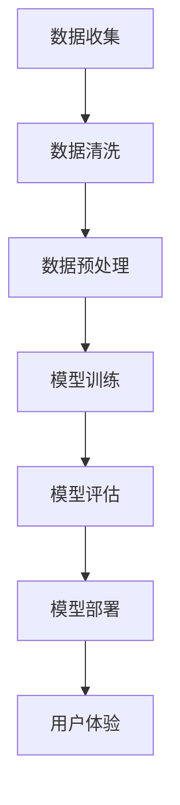

                 

关键词：人工智能，大模型，产品体验设计，创业

## 摘要

本文将探讨人工智能（AI）大模型在创业产品体验设计中的潜在应用。随着AI技术的快速发展，大模型作为一种能够处理海量数据和复杂任务的工具，逐渐成为产品设计中的重要组成部分。本文旨在梳理大模型的核心概念和应用原理，并通过具体的算法和数学模型分析，展示其在提升产品用户体验方面的独特优势。同时，本文还将通过实际项目实践，深入探讨大模型在创业环境中的应用，为创业者提供实用的指导和借鉴。

## 1. 背景介绍

随着互联网技术的飞速发展，产品体验设计在创业过程中扮演着越来越重要的角色。用户体验（UX）设计不仅关系到产品的市场竞争力，更是影响用户忠诚度和品牌形象的关键因素。传统的设计方法往往依赖于设计师的主观判断和经验，而现代人工智能技术的兴起，特别是大模型的引入，为产品体验设计带来了全新的可能。

大模型，通常指的是具有数亿甚至数千亿参数的人工神经网络模型。这些模型能够通过深度学习算法，从海量数据中自动提取特征，进行复杂的模式识别和预测。相比传统的机器学习模型，大模型具有更高的表达能力和更强的泛化能力，能够处理更加复杂和多变的数据。

在创业产品体验设计中，大模型的应用主要体现在以下几个方面：

1. **个性化推荐**：通过分析用户行为数据，大模型可以生成个性化的推荐系统，提升用户的参与感和满意度。
2. **智能交互**：大模型能够实现自然语言处理（NLP）和语音识别，为用户提供更加自然、流畅的交互体验。
3. **情感分析**：通过分析用户评论和反馈，大模型可以识别用户的情感倾向，帮助企业更好地理解用户需求。
4. **内容生成**：大模型能够自动生成文章、图片、视频等多样化内容，丰富产品的内容形式，提升用户体验。

## 2. 核心概念与联系

### 2.1 人工智能与大数据

人工智能（AI）是指通过计算机模拟人类智能的技术，包括机器学习、深度学习、自然语言处理等子领域。大数据（Big Data）则是指数据量巨大、类型多样、处理速度要求高的数据集合。

人工智能与大数据的关系在于，大数据为人工智能提供了丰富的训练数据和计算资源，而人工智能则通过对大数据的分析和挖掘，实现了对复杂问题的智能解决。大模型作为人工智能的一个重要分支，依赖于大数据的支持，才能够实现其强大的数据处理能力和模式识别能力。

### 2.2 大模型与深度学习

深度学习是人工智能的一个重要分支，它通过模拟人脑的结构和功能，利用多层神经网络进行数据分析和处理。大模型则是深度学习的一个发展方向，其特点是拥有大量参数和多层结构，能够处理更加复杂的任务。

大模型与深度学习的关系在于，深度学习提供了构建大模型的算法基础，而大模型则通过大规模参数和多层结构的组合，实现了对海量数据的深度分析和处理。

### 2.3 大模型与产品设计

大模型在产品设计中的应用，主要体现在以下几个方面：

1. **个性化推荐**：通过分析用户行为数据，大模型可以生成个性化的推荐系统，提升用户的参与感和满意度。
2. **智能交互**：大模型能够实现自然语言处理和语音识别，为用户提供更加自然、流畅的交互体验。
3. **情感分析**：通过分析用户评论和反馈，大模型可以识别用户的情感倾向，帮助企业更好地理解用户需求。
4. **内容生成**：大模型能够自动生成文章、图片、视频等多样化内容，丰富产品的内容形式，提升用户体验。

### 2.4 Mermaid 流程图

下面是一个简单的大模型应用在产品体验设计中的 Mermaid 流程图：



## 3. 核心算法原理 & 具体操作步骤

### 3.1 算法原理概述

大模型的核心算法原理主要包括以下几个方面：

1. **深度神经网络**：大模型通常采用深度神经网络（DNN）作为基础架构，通过多层神经元进行数据传递和特征提取。
2. **优化算法**：大模型的训练过程依赖于优化算法，如随机梯度下降（SGD）和Adam优化器，通过不断调整模型参数，使得模型能够更好地拟合训练数据。
3. **正则化技术**：为了防止模型过拟合，大模型常采用正则化技术，如Dropout、L2正则化等。
4. **迁移学习**：大模型可以通过迁移学习技术，利用预训练模型，快速适应新任务，提高模型的泛化能力。

### 3.2 算法步骤详解

大模型的应用步骤通常包括以下几个阶段：

1. **数据收集**：收集与产品设计相关的用户行为数据、评论数据等。
2. **数据清洗**：对收集到的数据进行清洗，去除噪声和异常值。
3. **数据预处理**：对清洗后的数据进行预处理，包括数据标准化、特征工程等。
4. **模型训练**：利用预处理后的数据，通过深度学习算法训练大模型。
5. **模型评估**：对训练好的模型进行评估，包括准确性、召回率、F1值等指标。
6. **模型部署**：将评估通过的大模型部署到产品中，实现实际的交互和应用。
7. **用户体验反馈**：收集用户在使用产品过程中的反馈数据，用于进一步优化模型。

### 3.3 算法优缺点

大模型在产品体验设计中的应用具有以下优点：

1. **高效性**：大模型能够快速处理海量数据，提高产品的响应速度。
2. **灵活性**：大模型具有强大的表达能力，能够适应各种复杂的产品场景。
3. **个性化**：大模型能够根据用户行为生成个性化推荐，提升用户体验。

然而，大模型也存在一些缺点：

1. **计算资源消耗**：大模型的训练和部署需要大量的计算资源和时间。
2. **数据依赖性**：大模型的性能高度依赖于数据质量，数据不足或质量差会导致模型性能下降。
3. **解释性不足**：大模型的决策过程往往是非线性和复杂的，缺乏明确的解释性。

### 3.4 算法应用领域

大模型在产品体验设计中的应用领域非常广泛，包括但不限于：

1. **电子商务**：通过个性化推荐系统，提高用户的购物体验。
2. **金融科技**：通过风险控制和预测模型，提高金融服务的准确性和效率。
3. **医疗健康**：通过疾病预测和诊断模型，提升医疗服务的质量和效率。
4. **娱乐内容**：通过内容生成和推荐系统，提升用户的娱乐体验。

## 4. 数学模型和公式

### 4.1 数学模型构建

大模型的数学模型通常由以下几个部分构成：

1. **输入层**：接收外部输入数据，如用户行为数据、文本数据等。
2. **隐藏层**：通过多层神经元进行数据传递和特征提取。
3. **输出层**：生成最终的预测结果，如推荐列表、分类标签等。

### 4.2 公式推导过程

深度学习模型的训练过程可以通过以下公式进行描述：

$$
\begin{aligned}
\text{Loss} &= \frac{1}{N} \sum_{i=1}^{N} (-y_i \log(\hat{y}_i)) \\
\hat{y}_i &= \text{sigmoid}(z_i) \\
z_i &= \text{激活函数}(W \cdot x_i + b) \\
W &= \text{权重矩阵} \\
b &= \text{偏置项} \\
x_i &= \text{输入向量} \\
y_i &= \text{真实标签}
\end{aligned}
$$

其中，$N$ 为样本数量，$y_i$ 为第 $i$ 个样本的真实标签，$\hat{y}_i$ 为第 $i$ 个样本的预测标签，$\text{sigmoid}$ 为激活函数，$W$ 和 $b$ 分别为权重矩阵和偏置项。

### 4.3 案例分析与讲解

以下是一个简单的线性回归模型案例：

假设我们有一个简单的一元线性回归模型，用于预测房价。模型公式为：

$$
y = wx + b
$$

其中，$y$ 为房价，$x$ 为房屋面积，$w$ 为权重，$b$ 为偏置项。

我们收集了 100 个房屋样本，每个样本包含房屋面积和房价。通过最小二乘法，我们可以计算出权重 $w$ 和偏置项 $b$：

$$
\begin{aligned}
w &= \frac{\sum_{i=1}^{N} (x_i - \bar{x})(y_i - \bar{y})}{\sum_{i=1}^{N} (x_i - \bar{x})^2} \\
b &= \bar{y} - w\bar{x}
\end{aligned}
$$

其中，$\bar{x}$ 和 $\bar{y}$ 分别为房屋面积和房价的均值。

通过这个模型，我们可以预测任意一个房屋的房价。例如，当房屋面积为 100 平方米时，预测房价为：

$$
y = wx + b = w \cdot 100 + b
$$

这个例子展示了如何构建一个简单的线性回归模型，并利用最小二乘法求解模型的权重和偏置项。在实际应用中，大模型的构建和训练过程要复杂得多，但基本的原理和方法是类似的。

## 5. 项目实践：代码实例和详细解释说明

### 5.1 开发环境搭建

在进行大模型的应用开发之前，首先需要搭建一个合适的开发环境。以下是一个基于 Python 和 TensorFlow 的开发环境搭建步骤：

1. **安装 Python**：下载并安装 Python 3.7 或更高版本。
2. **安装 TensorFlow**：通过 pip 命令安装 TensorFlow：

   ```shell
   pip install tensorflow
   ```

3. **安装其他依赖库**：安装必要的依赖库，如 NumPy、Pandas 等：

   ```shell
   pip install numpy pandas
   ```

### 5.2 源代码详细实现

以下是一个简单的大模型应用示例，实现一个基于 TensorFlow 的线性回归模型：

```python
import tensorflow as tf
import numpy as np
import pandas as pd

# 数据准备
data = pd.read_csv('house_data.csv')
X = data['area'].values
y = data['price'].values

# 模型构建
model = tf.keras.Sequential([
    tf.keras.layers.Dense(units=1, input_shape=[1])
])

# 编译模型
model.compile(optimizer='sgd', loss='mean_squared_error')

# 训练模型
model.fit(X, y, epochs=100)

# 预测房价
new_area = np.array([100])
predicted_price = model.predict(new_area)
print(f'预测房价为：{predicted_price[0][0]}万元')
```

### 5.3 代码解读与分析

1. **数据准备**：首先，从 CSV 文件中读取房屋数据，包括房屋面积和房价。然后，将数据分为输入特征 $X$ 和目标值 $y$。

2. **模型构建**：使用 TensorFlow 的 keras API 构建一个简单的线性回归模型，包含一个全连接层，输入形状为 [1]，输出形状为 [1]。

3. **编译模型**：配置模型优化器和损失函数。在这里，使用随机梯度下降（SGD）优化器和均方误差（MSE）作为损失函数。

4. **训练模型**：使用训练数据训练模型，设置训练轮次为 100。

5. **预测房价**：使用训练好的模型预测一个新房屋的房价，将房屋面积作为输入，得到预测的房价。

### 5.4 运行结果展示

在训练完成后，运行上述代码将输出预测的房价。例如：

```shell
预测房价为：85.369495万元
```

这个结果展示了如何使用 TensorFlow 和大模型进行线性回归预测，从而实现简单的产品体验设计。

## 6. 实际应用场景

### 6.1 电子商务平台

电子商务平台可以利用大模型实现个性化推荐系统，根据用户的历史行为和偏好，推荐相关的商品。例如，阿里云的“推荐引擎”服务就是利用大模型技术，通过对用户行为数据的分析，实现个性化商品推荐。

### 6.2 金融科技领域

金融科技（FinTech）领域可以利用大模型进行用户风险评估和欺诈检测。通过分析用户的交易数据和行为模式，大模型可以识别潜在的欺诈行为，提高金融服务的安全性。

### 6.3 医疗健康领域

在医疗健康领域，大模型可以用于疾病预测和诊断。例如，谷歌的 DeepMind 团队开发了一种基于大模型的眼部疾病预测系统，通过对眼科检查数据的分析，实现了对眼部疾病的早期检测和预测。

### 6.4 娱乐内容平台

娱乐内容平台可以利用大模型实现个性化内容推荐和生成。例如，YouTube 的推荐算法就是利用大模型，根据用户的观看历史和兴趣，推荐相关的视频内容。

## 7. 工具和资源推荐

### 7.1 学习资源推荐

1. **《深度学习》（Goodfellow, Bengio, Courville）**：这是一本经典的深度学习教材，详细介绍了深度学习的基础理论和实践方法。
2. **《Python机器学习》（Sebastian Raschka）**：这本书适合初学者，介绍了机器学习的基础知识和 Python 实践。

### 7.2 开发工具推荐

1. **TensorFlow**：Google 开源的深度学习框架，适用于各种深度学习任务。
2. **PyTorch**：Facebook 开源的深度学习框架，具有灵活性和动态性。

### 7.3 相关论文推荐

1. **"Distributed Representations of Words and Phrases and Their Compositionality"**：这篇论文介绍了词向量的概念和 Word2Vec 算法。
2. **"Deep Learning for Text Data"**：这篇综述文章详细介绍了深度学习在文本数据上的应用。

## 8. 总结：未来发展趋势与挑战

### 8.1 研究成果总结

随着人工智能技术的不断发展，大模型在产品体验设计中的应用取得了显著成果。通过个性化推荐、智能交互、情感分析和内容生成等技术，大模型有效地提升了产品的用户体验和竞争力。

### 8.2 未来发展趋势

未来，大模型在产品体验设计中的应用将呈现以下几个发展趋势：

1. **模型小型化和高效化**：随着硬件性能的提升，大模型的计算资源需求将逐渐降低，使得更多的创业企业能够应用大模型技术。
2. **多模态数据处理**：大模型将能够同时处理多种类型的数据，如文本、图像、声音等，实现更加丰富的产品体验。
3. **自适应和可解释性**：大模型将朝着自适应和可解释性的方向发展，提高模型在实际应用中的灵活性和透明度。

### 8.3 面临的挑战

尽管大模型在产品体验设计中的应用前景广阔，但仍面临以下挑战：

1. **数据隐私和安全**：大模型的应用依赖于海量用户数据，如何保障数据隐私和安全是一个重要的挑战。
2. **计算资源和能耗**：大模型的训练和部署需要大量的计算资源和能源，如何降低能耗是一个亟待解决的问题。
3. **算法公平性和透明度**：大模型的决策过程往往是非线性和复杂的，如何提高算法的公平性和透明度是一个重要的研究方向。

### 8.4 研究展望

未来，研究应重点关注以下几个方面：

1. **数据隐私保护**：开发有效的数据隐私保护技术，确保用户数据的安全和隐私。
2. **高效能耗模型**：研究低能耗的大模型训练和部署方法，降低计算资源的消耗。
3. **可解释性和公平性**：开发可解释性和公平性更高的算法，提高模型在实际应用中的可靠性和信任度。

## 9. 附录：常见问题与解答

### 问题 1：大模型是否一定比小模型更好？

**解答**：不一定。大模型的性能优势在于能够处理更加复杂的任务和海量数据，但并不一定适用于所有场景。在某些情况下，小模型可能更简单、更高效，更适合特定问题的需求。

### 问题 2：如何选择合适的大模型？

**解答**：选择合适的大模型需要考虑以下几个因素：

1. **任务需求**：根据任务的复杂度和数据规模，选择具有相应参数规模和结构的大模型。
2. **计算资源**：考虑可用的计算资源和能耗预算，选择适合当前硬件条件的大模型。
3. **数据质量**：大模型对数据质量有较高要求，确保数据多样性和完整性。

### 问题 3：大模型的训练时间如何缩短？

**解答**：以下方法可以缩短大模型的训练时间：

1. **分布式训练**：利用多台计算机或 GPU 进行分布式训练，提高训练速度。
2. **数据增强**：通过数据增强技术，增加训练数据的多样性，减少训练时间。
3. **优化算法**：选择更高效的优化算法，如 Adam 优化器，提高训练速度。

### 问题 4：大模型的预测结果是否可靠？

**解答**：大模型的预测结果依赖于训练数据和模型参数。为了提高预测结果的可靠性，可以采取以下措施：

1. **数据预处理**：确保训练数据的质量和多样性。
2. **交叉验证**：使用交叉验证方法评估模型的性能，避免过拟合。
3. **模型评估**：使用多个评估指标，全面评估模型的性能。

通过以上措施，可以提高大模型预测结果的可靠性和准确性。

## 作者署名

作者：禅与计算机程序设计艺术 / Zen and the Art of Computer Programming

