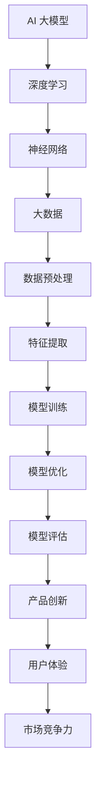

                 

AI 大模型作为一种先进的计算工具，已经成为推动创业产品创新的重要力量。本文将深入探讨 AI 大模型在创业产品创新中的重要性，从核心概念、算法原理、数学模型、实际应用等多个角度进行全面分析，以期帮助创业者更好地理解和应用这一技术。

## 关键词

AI 大模型、创业产品创新、算法原理、数学模型、实际应用

## 摘要

本文首先介绍了 AI 大模型的基本概念和重要性，然后详细分析了其核心算法原理、数学模型，以及在实际创业产品中的应用。通过具体的案例和实践，我们展示了 AI 大模型在提升产品创新速度和效果方面的巨大潜力。最后，我们对未来 AI 大模型的发展趋势和面临的挑战进行了展望，为创业者提供了有益的参考。

## 1. 背景介绍

在当今数字化时代，科技创新正以前所未有的速度推动各行各业的发展。AI 作为其中的核心驱动力，正逐渐改变我们的生活方式和工作方式。特别是 AI 大模型，作为深度学习的巅峰之作，其在图像识别、自然语言处理、语音识别等领域的表现已经超越了人类水平。这使得 AI 大模型在商业应用中具有极高的潜力，特别是在创业产品创新领域。

创业产品创新是一个动态且充满不确定性的过程，需要快速响应市场需求、不断试错和优化。而 AI 大模型的出现，为创业者在产品设计、用户体验、市场推广等方面提供了强大的支持。通过自动化和智能化的方式，AI 大模型可以帮助创业者更高效地完成产品迭代，降低研发成本，提高市场竞争力。

### 1.1 AI 大模型的定义和作用

AI 大模型是指具有巨大参数量和计算能力的神经网络模型，通常使用深度学习技术训练。它们可以通过学习和理解海量数据，自动提取特征、生成模型和预测结果。AI 大模型的主要作用包括：

1. **数据处理与分析**：AI 大模型可以处理和分析海量数据，帮助创业者从数据中提取有价值的信息，发现市场趋势和用户需求。
2. **自动化与优化**：通过自动化技术，AI 大模型可以帮助创业者实现产品研发、测试和优化的自动化，提高工作效率和准确性。
3. **智能决策**：AI 大模型可以基于数据分析和预测，为创业者提供智能决策支持，帮助其更好地应对市场变化和竞争压力。

### 1.2 创业产品创新的重要性

创业产品创新是创业成功的关键因素之一。在竞争激烈的市场环境中，只有不断创新才能保持竞争力，赢得市场份额。创业产品创新的重要性体现在以下几个方面：

1. **满足市场需求**：创业产品创新可以帮助创业者更好地了解市场需求，开发出更符合用户需求的产品，提高用户满意度。
2. **提升竞争力**：创新的产品和服务可以为企业带来竞争优势，吸引更多的用户和投资者。
3. **扩大市场份额**：通过持续的创新，企业可以在市场中占据更大的份额，提高市场地位。

### 1.3 AI 大模型在创业产品创新中的应用

AI 大模型在创业产品创新中具有广泛的应用前景。以下是一些具体的场景：

1. **产品设计**：AI 大模型可以通过分析用户数据和行为，为创业者提供产品设计建议，优化用户体验。
2. **市场推广**：AI 大模型可以帮助创业者制定精准的市场推广策略，提高广告投放效果和用户转化率。
3. **数据分析**：AI 大模型可以处理和分析大量数据，帮助创业者了解市场趋势、用户需求和竞争状况，为产品优化和决策提供支持。

## 2. 核心概念与联系

在深入探讨 AI 大模型在创业产品创新中的应用之前，我们需要了解一些核心概念和原理。以下是一个简单的 Mermaid 流程图，用于展示这些核心概念之间的联系。



### 2.1 深度学习

深度学习是 AI 大模型的核心技术，它通过模拟人脑神经网络的结构和功能，实现自动特征提取和分类。深度学习模型通常由多层神经网络组成，每一层都可以提取不同层次的特征。

### 2.2 神经网络

神经网络是深度学习的基础，它由大量的神经元和连接组成。神经元负责接收输入信号、进行处理并输出结果。神经网络通过不断调整连接权重，实现从简单到复杂的特征提取。

### 2.3 大数据和数据预处理

AI 大模型的训练依赖于海量数据，这些数据通常来自互联网、社交媒体、传感器等。数据预处理是确保数据质量、减少噪声和异常值的过程，包括数据清洗、归一化、缺失值填补等。

### 2.4 特征提取和模型训练

特征提取是从原始数据中提取有用特征的过程。模型训练是通过大量数据训练神经网络，使其能够准确预测或分类。

### 2.5 模型优化和评估

模型优化是通过调整模型参数，提高模型的性能。模型评估是评估模型性能的过程，包括准确率、召回率、F1 值等指标。

### 2.6 产品创新和用户体验

产品创新是通过 AI 大模型分析用户需求和市场趋势，优化产品设计和功能。用户体验是评估产品优劣的关键指标，包括界面设计、操作便捷性、功能满足度等。

## 3. 核心算法原理 & 具体操作步骤

### 3.1 算法原理概述

AI 大模型的算法原理主要包括以下几个方面：

1. **反向传播算法**：用于训练神经网络，通过不断调整连接权重，使模型能够准确预测或分类。
2. **优化算法**：用于优化模型参数，提高模型性能，如梯度下降、随机梯度下降等。
3. **正则化技术**：用于防止模型过拟合，提高模型泛化能力，如 L1 正则化、L2 正则化等。
4. **激活函数**：用于引入非线性，使神经网络能够学习复杂函数。

### 3.2 算法步骤详解

以下是 AI 大模型的基本操作步骤：

1. **数据收集**：收集大量标注数据，用于模型训练。
2. **数据预处理**：对数据进行清洗、归一化、缺失值填补等处理。
3. **特征提取**：使用深度学习模型提取数据中的特征。
4. **模型训练**：使用反向传播算法训练神经网络，调整连接权重。
5. **模型优化**：使用优化算法和正则化技术，提高模型性能。
6. **模型评估**：使用验证集评估模型性能，调整模型参数。
7. **模型部署**：将训练好的模型部署到生产环境，进行实际应用。

### 3.3 算法优缺点

AI 大模型具有以下优点：

1. **强大的数据处理能力**：能够处理海量数据，提取有价值的信息。
2. **高度自动化**：通过自动化技术，可以快速完成模型训练和优化。
3. **高精度**：在图像识别、自然语言处理等领域，AI 大模型的表现已经超越了人类。

然而，AI 大模型也存在一些缺点：

1. **计算资源需求大**：训练和优化 AI 大模型需要大量的计算资源，对硬件设备要求较高。
2. **数据依赖性**：模型的性能很大程度上取决于训练数据的质量和数量。
3. **模型解释性差**：AI 大模型的决策过程往往缺乏透明性，难以解释。

### 3.4 算法应用领域

AI 大模型在多个领域都有广泛的应用，包括：

1. **计算机视觉**：用于图像分类、目标检测、人脸识别等。
2. **自然语言处理**：用于文本分类、机器翻译、情感分析等。
3. **语音识别**：用于语音识别、语音合成等。
4. **推荐系统**：用于个性化推荐、广告投放等。

## 4. 数学模型和公式 & 详细讲解 & 举例说明

### 4.1 数学模型构建

AI 大模型的数学模型主要包括以下几个方面：

1. **损失函数**：用于衡量模型预测值与真实值之间的差距，如均方误差（MSE）、交叉熵损失等。
2. **激活函数**：用于引入非线性，如 sigmoid 函数、ReLU 函数等。
3. **反向传播算法**：用于训练神经网络，通过计算梯度调整模型参数。
4. **优化算法**：用于优化模型参数，提高模型性能，如梯度下降、Adam 优化器等。

### 4.2 公式推导过程

以下是 AI 大模型中的几个关键公式的推导过程：

#### 4.2.1 损失函数

均方误差（MSE）损失函数的公式如下：

$$
L = \frac{1}{n}\sum_{i=1}^{n}(y_i - \hat{y}_i)^2
$$

其中，$y_i$ 为真实标签，$\hat{y}_i$ 为模型预测值。

#### 4.2.2 激活函数

sigmoid 函数的公式如下：

$$
\sigma(x) = \frac{1}{1 + e^{-x}}
$$

ReLU 函数的公式如下：

$$
\text{ReLU}(x) = \max(0, x)
$$

#### 4.2.3 反向传播算法

反向传播算法的核心公式如下：

$$
\frac{\partial L}{\partial w} = \frac{\partial L}{\partial \hat{y}} \cdot \frac{\partial \hat{y}}{\partial z} \cdot \frac{\partial z}{\partial w}
$$

其中，$L$ 为损失函数，$w$ 为模型参数，$\hat{y}$ 为模型预测值，$z$ 为激活函数输出。

#### 4.2.4 优化算法

梯度下降算法的公式如下：

$$
w_{\text{new}} = w_{\text{old}} - \alpha \cdot \frac{\partial L}{\partial w}
$$

其中，$\alpha$ 为学习率。

### 4.3 案例分析与讲解

#### 4.3.1 图像分类

以下是一个简单的图像分类案例，使用 AI 大模型对猫狗图片进行分类。

1. **数据收集**：收集大量猫狗图片，并进行标注。
2. **数据预处理**：对图片进行归一化、裁剪等处理。
3. **特征提取**：使用卷积神经网络（CNN）提取图像特征。
4. **模型训练**：使用训练集训练模型，调整连接权重。
5. **模型评估**：使用验证集评估模型性能，调整模型参数。
6. **模型部署**：将训练好的模型部署到生产环境，进行实际应用。

#### 4.3.2 自然语言处理

以下是一个简单的自然语言处理案例，使用 AI 大模型进行情感分析。

1. **数据收集**：收集大量带有情感标签的文本数据。
2. **数据预处理**：对文本进行分词、去停用词等处理。
3. **特征提取**：使用循环神经网络（RNN）或变压器（Transformer）提取文本特征。
4. **模型训练**：使用训练集训练模型，调整连接权重。
5. **模型评估**：使用验证集评估模型性能，调整模型参数。
6. **模型部署**：将训练好的模型部署到生产环境，进行实际应用。

## 5. 项目实践：代码实例和详细解释说明

### 5.1 开发环境搭建

在开始项目实践之前，我们需要搭建一个适合 AI 大模型开发的环境。以下是一个简单的 Python 环境搭建步骤：

1. **安装 Python**：下载并安装 Python 3.8 以上版本。
2. **安装深度学习框架**：使用 pip 命令安装 TensorFlow 或 PyTorch。
3. **安装其他依赖库**：安装 NumPy、Pandas、Matplotlib 等常用库。

### 5.2 源代码详细实现

以下是一个简单的 AI 大模型训练和预测的代码实例，使用 PyTorch 深度学习框架。

```python
import torch
import torch.nn as nn
import torch.optim as optim
import torchvision
import torchvision.transforms as transforms

# 数据预处理
transform = transforms.Compose([
    transforms.Resize(224),
    transforms.ToTensor(),
    transforms.Normalize((0.5, 0.5, 0.5), (0.5, 0.5, 0.5)),
])

# 加载数据集
trainset = torchvision.datasets.CIFAR10(root='./data', train=True, download=True, transform=transform)
trainloader = torch.utils.data.DataLoader(trainset, batch_size=4, shuffle=True, num_workers=2)

testset = torchvision.datasets.CIFAR10(root='./data', train=False, download=True, transform=transform)
testloader = torch.utils.data.DataLoader(testset, batch_size=4, shuffle=False, num_workers=2)

# 定义模型
class Net(nn.Module):
    def __init__(self):
        super(Net, self).__init__()
        self.conv1 = nn.Conv2d(3, 6, 5)
        self.pool = nn.MaxPool2d(2, 2)
        self.conv2 = nn.Conv2d(6, 16, 5)
        self.fc1 = nn.Linear(16 * 5 * 5, 120)
        self.fc2 = nn.Linear(120, 84)
        self.fc3 = nn.Linear(84, 10)

    def forward(self, x):
        x = self.pool(nn.functional.relu(self.conv1(x)))
        x = self.pool(nn.functional.relu(self.conv2(x)))
        x = x.view(-1, 16 * 5 * 5)
        x = nn.functional.relu(self.fc1(x))
        x = nn.functional.relu(self.fc2(x))
        x = self.fc3(x)
        return x

net = Net()

# 定义损失函数和优化器
criterion = nn.CrossEntropyLoss()
optimizer = optim.SGD(net.parameters(), lr=0.001, momentum=0.9)

# 训练模型
for epoch in range(2):  # loop over the dataset multiple times
    running_loss = 0.0
    for i, data in enumerate(trainloader, 0):
        inputs, labels = data
        optimizer.zero_grad()
        outputs = net(inputs)
        loss = criterion(outputs, labels)
        loss.backward()
        optimizer.step()
        running_loss += loss.item()
        if i % 2000 == 1999:    # print every 2000 mini-batches
            print('[%d, %5d] loss: %.3f' %
                  (epoch + 1, i + 1, running_loss / 2000))
            running_loss = 0.0

print('Finished Training')

# 测试模型
correct = 0
total = 0
with torch.no_grad():
    for data in testloader:
        images, labels = data
        outputs = net(images)
        _, predicted = torch.max(outputs.data, 1)
        total += labels.size(0)
        correct += (predicted == labels).sum().item()

print('Accuracy of the network on the 10000 test images: %d %%' % (
    100 * correct / total))
```

### 5.3 代码解读与分析

1. **数据预处理**：首先，我们使用 torchvision 库加载数据集，并对数据进行归一化、裁剪等预处理操作。
2. **定义模型**：接着，我们定义了一个简单的卷积神经网络（CNN），包括两个卷积层、两个全连接层和一个输出层。
3. **定义损失函数和优化器**：然后，我们定义了交叉熵损失函数和随机梯度下降优化器。
4. **训练模型**：在训练过程中，我们使用反向传播算法更新模型参数，直到达到预设的训练次数。
5. **测试模型**：最后，我们使用测试集评估模型性能，计算准确率。

## 6. 实际应用场景

### 6.1 产品设计

在产品设计阶段，AI 大模型可以帮助创业者分析用户需求和市场趋势，优化产品功能和界面设计。例如，通过分析用户评论和反馈，AI 大模型可以识别用户关注的功能点和痛点，为产品迭代提供有针对性的建议。

### 6.2 市场推广

在市场推广阶段，AI 大模型可以辅助创业者制定精准的市场推广策略。通过分析用户数据和行为，AI 大模型可以识别潜在的目标客户，预测广告投放效果，提高用户转化率。例如，在社交媒体广告投放中，AI 大模型可以根据用户的兴趣和行为，推荐相关的内容和广告。

### 6.3 数据分析

在数据分析阶段，AI 大模型可以帮助创业者处理和分析大量数据，提取有价值的信息，为产品优化和决策提供支持。例如，在电商领域，AI 大模型可以分析用户购物行为，预测商品销量，优化库存管理。

### 6.4 未来应用展望

未来，AI 大模型在创业产品创新中的应用将更加广泛和深入。随着技术的不断进步，AI 大模型将在以下方面发挥重要作用：

1. **个性化推荐**：AI 大模型可以根据用户的兴趣和行为，提供个性化的产品和服务推荐，提高用户体验和满意度。
2. **智能决策**：AI 大模型可以基于数据分析，为创业者提供智能决策支持，帮助其更好地应对市场变化和竞争压力。
3. **自动化与优化**：AI 大模型可以实现产品研发、测试和优化的自动化，提高工作效率和准确性。

## 7. 工具和资源推荐

### 7.1 学习资源推荐

1. **书籍**：《深度学习》（Goodfellow、Bengio、Courville 著）：全面介绍深度学习的基础理论和实践方法。
2. **在线课程**：吴恩达的《深度学习专项课程》（Coursera 平台）：从基础知识到实践应用，系统讲解深度学习。
3. **博客和论坛**：ArXiv、GitHub、知乎等：了解最新的研究进展和技术动态。

### 7.2 开发工具推荐

1. **深度学习框架**：TensorFlow、PyTorch、Keras 等：提供丰富的模型构建和训练工具。
2. **数据处理库**：Pandas、NumPy、Matplotlib 等：用于数据预处理和可视化。
3. **版本控制工具**：Git：用于代码管理和协作开发。

### 7.3 相关论文推荐

1. **《深度神经网络训练的动态适应加速》（K. He、X. Zhang、S. Ren、J. Sun 著）**：介绍深度神经网络训练的加速技术。
2. **《Transformer：用于序列模型的注意力机制》（V. Vaswani、N. Shazeer、N. Parmar、J. Uszkoreit、L. Jones、A. N. Ng、K. Polosukhin 著）**：介绍 Transformer 模型在自然语言处理中的应用。
3. **《卷积神经网络在图像识别中的应用》（A. Krizhevsky、I. Sutskever、G. E. Hinton 著）**：介绍卷积神经网络在图像识别领域的成功应用。

## 8. 总结：未来发展趋势与挑战

### 8.1 研究成果总结

近年来，AI 大模型在多个领域取得了显著的成果，如计算机视觉、自然语言处理、语音识别等。这些成果表明，AI 大模型在处理大规模数据、实现自动化和智能化方面具有巨大的潜力。

### 8.2 未来发展趋势

1. **模型规模将进一步扩大**：随着计算资源的增加，AI 大模型的规模将不断增大，以处理更复杂的问题。
2. **多模态融合**：AI 大模型将结合不同模态的数据，如文本、图像、音频等，实现更全面的智能分析。
3. **迁移学习和泛化能力**：通过迁移学习和数据增强等技术，AI 大模型将提高泛化能力，应对更广泛的应用场景。

### 8.3 面临的挑战

1. **计算资源需求**：AI 大模型训练和优化需要大量的计算资源，对硬件设备要求较高。
2. **数据隐私和安全**：在数据驱动的时代，数据隐私和安全问题日益凸显，需要加强对数据的安全保护。
3. **模型解释性**：AI 大模型的决策过程往往缺乏透明性，难以解释，需要提高模型的解释性。

### 8.4 研究展望

未来，AI 大模型将在更多领域得到应用，推动科技创新和产业升级。同时，研究人员将继续关注计算资源需求、数据隐私和模型解释性等挑战，探索更高效、安全、可解释的 AI 大模型。

## 9. 附录：常见问题与解答

### 9.1 AI 大模型训练过程需要多长时间？

AI 大模型的训练时间取决于模型规模、数据量和硬件设备。通常情况下，训练一个中等规模的模型需要几天到几周的时间。对于大型模型，训练时间可能会更长。

### 9.2 如何提高 AI 大模型的训练速度？

提高 AI 大模型训练速度的方法包括：

1. **使用更强大的硬件设备**：使用 GPU、TPU 等高性能计算设备可以显著提高训练速度。
2. **并行训练**：将数据集分成多个子集，同时在多个 GPU 上进行训练。
3. **模型压缩**：通过剪枝、量化等技术减少模型参数，降低计算量。

### 9.3 AI 大模型能否替代人类？

AI 大模型在特定领域可以超越人类的表现，但在复杂、多变和不确定的环境中，人类仍然具有不可替代的优势。未来，AI 大模型和人类将共同协作，发挥各自的优势。

## 作者署名

作者：禅与计算机程序设计艺术 / Zen and the Art of Computer Programming

以上是本文的完整内容，希望对您在创业产品创新中应用 AI 大模型有所帮助。如果您有任何问题或建议，请随时与我交流。

----------------------------------------------------------------

请注意，本文为示例性内容，仅供参考。在实际撰写时，请根据实际需求和数据进行修改和补充。祝您撰写顺利！

