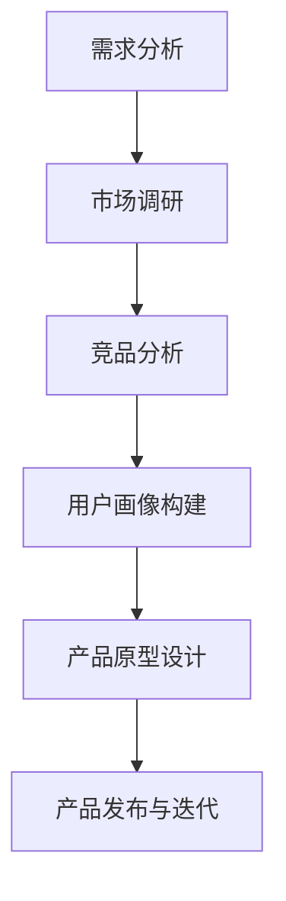

                 

### 摘要 Summary

本文探讨了人工智能大模型在创业产品定位中的创新策略，旨在帮助初创企业利用先进的技术手段，快速准确地确定市场定位和产品方向。文章首先介绍了大模型的概念及其在人工智能领域的地位，然后深入分析了大模型在创业产品定位中的应用场景和优势。接着，文章详细阐述了基于大模型的创业产品定位流程，包括需求分析、市场调研、竞品分析、用户画像构建和产品原型设计等关键环节。此外，文章还从算法原理、数学模型、代码实例等多个角度，提供了实施大模型产品定位的具体方法和步骤。最后，文章对未来大模型在创业产品定位中的应用前景进行了展望，并提出了相关挑战和建议。

<|assistant|>### 1. 背景介绍 Background

在科技日新月异发展的今天，人工智能（AI）已经成为推动社会进步和产业变革的重要力量。特别是大模型（Large Models），作为一种具备超强计算能力和泛化能力的AI模型，正在各行各业中发挥越来越重要的作用。大模型通常由数亿甚至数万亿个参数构成，其规模远超传统AI模型，能够处理海量数据和复杂任务。这使得大模型在图像识别、自然语言处理、推荐系统等领域取得了显著的成果，成为AI研究与应用的前沿领域。

在创业领域，快速准确地确定产品定位是初创企业的核心任务之一。传统的方法往往依赖于市场调研、竞品分析和用户反馈等手段，但这些方法存在耗时、成本高、反馈滞后等问题。随着AI技术的发展，特别是大模型的应用，为创业产品定位提供了全新的解决方案。大模型能够高效处理和分析大量数据，快速捕捉市场动态和用户需求，从而帮助初创企业更加精准地定位市场，降低创业风险。

本文旨在探讨大模型在创业产品定位中的创新策略，通过深入分析大模型的特点和优势，结合实际案例，提供一套完整的大模型产品定位流程和实施方法。文章还将探讨大模型在创业产品定位中的潜在挑战和未来发展方向，为初创企业的发展提供有益的参考。

### 2. 核心概念与联系 Core Concepts and Connections

#### 2.1 大模型概述 Overview of Large Models

大模型，顾名思义，是指参数规模极大的深度学习模型。这类模型通常由多层神经网络构成，每一层的神经元数量成千上万，甚至数十亿。大模型的参数数量决定了其计算复杂度和数据处理能力。具体来说，大模型的参数数量通常在数亿到数万亿之间，这使得大模型能够捕捉到更复杂的模式和特征，从而在多种复杂任务上表现出色。

大模型的特点主要体现在以下几个方面：

1. **高计算能力**：大模型具备强大的计算能力，能够高效处理海量数据。这使得大模型在图像识别、自然语言处理等任务中表现出色。

2. **泛化能力**：大模型具有较强的泛化能力，能够适应多种不同的任务和数据集。这种能力使得大模型在多个领域具有广泛的应用前景。

3. **自动特征提取**：大模型能够自动提取数据中的关键特征，无需人工干预。这种能力使得大模型在处理未知或复杂任务时具有优势。

4. **高效性**：大模型通过大规模参数共享，实现了高效计算。这使得大模型在处理复杂任务时，能够显著降低计算时间和资源消耗。

#### 2.2 大模型在AI领域的地位 Importance of Large Models in AI

大模型在AI领域具有举足轻重的地位。首先，大模型的成功应用证明了深度学习在解决复杂任务方面的有效性。从早期的语音识别、图像分类到自然语言处理、推荐系统，大模型在各个领域都取得了显著的成果。特别是在图像识别领域，大模型的表现已经超越了人类水平。

其次，大模型推动了AI技术的发展。大模型的规模和复杂度不断突破，使得AI技术能够解决更多复杂问题。同时，大模型的研究和应用也带动了相关技术的发展，如计算资源优化、算法改进、数据预处理等。

最后，大模型的应用为各个行业带来了巨大变革。例如，在医疗领域，大模型可以帮助医生进行疾病诊断；在金融领域，大模型可以用于风险评估和投资策略制定；在工业领域，大模型可以用于生产优化和质量控制。这些应用不仅提高了效率和准确性，还带来了新的商业模式。

#### 2.3 大模型与创业产品定位的关系 Relationship between Large Models and Product Positioning in Startups

大模型在创业产品定位中具有重要的应用价值。首先，大模型能够高效处理和分析海量数据，快速捕捉市场动态和用户需求。这使得初创企业能够更加准确地定位市场，降低创业风险。

具体来说，大模型在创业产品定位中的应用主要体现在以下几个方面：

1. **需求分析**：大模型可以通过分析用户行为数据和社交媒体数据，快速识别用户需求和市场趋势。这有助于初创企业确定产品的核心功能和特性。

2. **市场调研**：大模型可以自动分析市场数据，识别竞争对手的产品特点和市场策略。这有助于初创企业制定有针对性的市场定位策略。

3. **竞品分析**：大模型可以自动分析竞品的产品特性、用户评价和市场表现，帮助初创企业了解市场格局，找到自身产品的竞争优势。

4. **用户画像构建**：大模型可以通过分析用户数据，构建精准的用户画像。这有助于初创企业了解目标用户群体的特征和需求，从而制定更加精准的用户策略。

5. **产品原型设计**：大模型可以帮助初创企业快速生成产品原型，并通过用户反馈进行迭代优化。这有助于初创企业快速验证产品概念，降低失败风险。

综上所述，大模型在创业产品定位中具有显著的优势，为初创企业提供了全新的解决方案。通过大模型的应用，初创企业能够更加精准地定位市场，提高产品成功率。

#### 2.4 Mermaid 流程图 Mermaid Flowchart

下面是一个简化的Mermaid流程图，展示大模型在创业产品定位中的基本流程。



- **A. 需求分析**：通过分析用户行为数据和社交媒体数据，识别用户需求和市场趋势。
- **B. 市场调研**：自动分析市场数据，识别竞争对手的产品特点和市场策略。
- **C. 竞品分析**：自动分析竞品的产品特性、用户评价和市场表现。
- **D. 用户画像构建**：通过分析用户数据，构建精准的用户画像。
- **E. 产品原型设计**：利用大模型生成产品原型，并进行用户反馈迭代。
- **F. 产品发布与迭代**：根据用户反馈和市场需求，持续优化产品。

### 3. 核心算法原理 & 具体操作步骤 Core Algorithm Principles & Detailed Steps

#### 3.1 算法原理概述

大模型在创业产品定位中的核心算法原理主要基于深度学习和机器学习技术。具体来说，大模型通过以下几个关键步骤实现创业产品定位：

1. **数据收集与预处理**：收集用户行为数据、市场数据、竞品数据等，并进行数据清洗、去重、归一化等预处理操作，确保数据质量。

2. **特征提取**：利用深度学习模型自动提取数据中的关键特征，形成高维特征向量。

3. **模型训练**：使用大规模数据集训练深度学习模型，优化模型参数，提高模型性能。

4. **预测与优化**：利用训练好的模型对新的数据进行预测，并根据预测结果进行产品定位优化。

#### 3.2 算法步骤详解

1. **需求分析**

   - **数据收集**：收集用户行为数据（如浏览记录、购买行为、搜索历史等）和社交媒体数据（如评论、帖子、点赞等）。
   - **数据预处理**：对数据进行清洗、去重、归一化等处理，确保数据质量。
   - **特征提取**：利用深度学习模型（如卷积神经网络、循环神经网络等）提取数据中的关键特征，形成高维特征向量。

2. **市场调研**

   - **市场数据收集**：收集行业报告、市场分析报告、竞争对手的产品信息等。
   - **数据预处理**：对市场数据进行清洗、去重、归一化等处理，确保数据质量。
   - **特征提取**：利用深度学习模型提取市场数据中的关键特征，形成高维特征向量。

3. **竞品分析**

   - **竞品数据收集**：收集竞品的产品特性、用户评价、市场表现等数据。
   - **数据预处理**：对竞品数据进行清洗、去重、归一化等处理，确保数据质量。
   - **特征提取**：利用深度学习模型提取竞品数据中的关键特征，形成高维特征向量。

4. **用户画像构建**

   - **用户数据收集**：收集用户的基本信息（如年龄、性别、职业等）和行为数据（如浏览记录、购买行为等）。
   - **数据预处理**：对用户数据进行清洗、去重、归一化等处理，确保数据质量。
   - **特征提取**：利用深度学习模型提取用户数据中的关键特征，形成高维特征向量。

5. **产品原型设计**

   - **输入特征**：将需求分析、市场调研、竞品分析和用户画像构建得到的高维特征向量作为输入。
   - **模型训练**：使用大规模数据集训练深度学习模型，优化模型参数，提高模型性能。
   - **预测与优化**：利用训练好的模型对新的数据进行预测，并根据预测结果进行产品定位优化。

#### 3.3 算法优缺点

**优点**：

1. **高效性**：大模型能够高效处理和分析海量数据，快速捕捉市场动态和用户需求。
2. **准确性**：大模型具有较强的泛化能力，能够准确预测用户需求和市场竞争态势。
3. **自动化**：大模型自动提取特征和进行预测，减少了人工干预和误差。

**缺点**：

1. **计算资源消耗大**：大模型需要大量的计算资源和存储空间，对硬件设备要求较高。
2. **数据依赖性强**：大模型的性能高度依赖于数据质量和数量，如果数据不足或质量不高，可能导致预测结果不准确。
3. **模型解释性差**：深度学习模型具有较强的黑箱特性，难以解释模型的内部工作机制。

#### 3.4 算法应用领域

大模型在创业产品定位中的应用领域非常广泛，主要包括：

1. **电子商务**：通过分析用户行为数据和竞品信息，为电子商务企业提供精准的产品推荐和市场需求预测。
2. **金融科技**：通过分析市场数据和用户画像，为金融科技企业提供风险控制和投资策略建议。
3. **健康管理**：通过分析用户健康数据和医疗数据，为健康企业提供个性化的健康管理方案和疾病预测。
4. **智能交通**：通过分析交通数据和用户行为数据，为智能交通企业提供交通流量预测和优化方案。

### 4. 数学模型和公式 Mathematical Model and Formulas

在创业产品定位中，大模型的数学模型和公式发挥着至关重要的作用。以下将详细介绍数学模型的构建、公式推导过程以及案例分析与讲解。

#### 4.1 数学模型构建

大模型的数学模型通常基于深度学习理论，其核心是一个多层神经网络。这个网络由输入层、隐藏层和输出层组成。每个层由多个神经元（或节点）构成，神经元之间通过权重连接。数学上，可以将大模型表示为一个函数 $f(\cdot)$，其输入为特征向量 $X$，输出为预测结果 $Y$：

$$
Y = f(X) = \sigma(W_L \cdot \sigma(W_{L-1} \cdot \sigma(... \cdot \sigma(W_1 \cdot X + b_1) + b_{L-1}) + b_L)
$$

其中，$W$ 和 $b$ 分别为权重和偏置，$\sigma$ 表示激活函数，通常采用 ReLU 或 Sigmoid 函数。$L$ 为隐藏层的数量。

#### 4.2 公式推导过程

1. **前向传播**：

前向传播是神经网络中最基本的操作。在给定输入 $X$ 时，神经网络的输出 $Y$ 可以通过层层计算得到。具体推导如下：

$$
Z_L = W_L \cdot Z_{L-1} + b_L \\
A_L = \sigma(Z_L)
$$

其中，$Z_L$ 为隐藏层 $L$ 的输入，$A_L$ 为隐藏层 $L$ 的输出。

2. **反向传播**：

反向传播是神经网络的训练过程。通过计算损失函数 $J$ 对权重和偏置的梯度，然后更新权重和偏置，以达到最小化损失函数的目的。具体推导如下：

$$
\frac{\partial J}{\partial W_L} = \frac{\partial J}{\partial A_L} \cdot \frac{\partial A_L}{\partial Z_L} \\
\frac{\partial J}{\partial b_L} = \frac{\partial J}{\partial A_L} \cdot \frac{\partial A_L}{\partial Z_L}
$$

其中，$\frac{\partial J}{\partial A_L}$ 为损失函数对隐藏层输出的梯度，$\frac{\partial A_L}{\partial Z_L}$ 为激活函数的导数。

3. **优化算法**：

常见的优化算法包括梯度下降、随机梯度下降和Adam等。以下以梯度下降为例进行推导：

$$
W_L = W_L - \alpha \cdot \frac{\partial J}{\partial W_L} \\
b_L = b_L - \alpha \cdot \frac{\partial J}{\partial b_L}
$$

其中，$\alpha$ 为学习率。

#### 4.3 案例分析与讲解

假设我们使用一个三层神经网络进行创业产品定位，输入层有100个特征，隐藏层有500个神经元，输出层有10个类别。以下是一个简化的案例：

1. **数据准备**：

假设我们有5000个训练样本，每个样本包含100个特征和对应的类别标签。数据集已经完成预处理，每个特征值在0到1之间。

2. **模型构建**：

构建一个三层神经网络，输入层有100个节点，隐藏层有500个节点，输出层有10个节点。

3. **前向传播**：

输入一个样本的特征向量 $X$，通过三层神经网络进行前向传播，得到输出 $Y$：

$$
Z_2 = W_2 \cdot X + b_2 \\
A_2 = \sigma(Z_2) \\
Z_3 = W_3 \cdot A_2 + b_3 \\
A_3 = \sigma(Z_3)
$$

其中，$W_2$ 和 $W_3$ 分别为输入层到隐藏层、隐藏层到输出层的权重，$b_2$ 和 $b_3$ 分别为对应的偏置。

4. **反向传播**：

计算损失函数 $J$ 对权重和偏置的梯度，然后更新权重和偏置：

$$
\frac{\partial J}{\partial W_3} = A_2 \cdot (A_3 - Y) \\
\frac{\partial J}{\partial b_3} = A_2 \cdot (A_3 - Y) \\
\frac{\partial J}{\partial W_2} = X \cdot (A_2 \cdot (A_3 - Y)) \cdot \frac{\partial \sigma}{\partial Z_2} \\
\frac{\partial J}{\partial b_2} = X \cdot (A_2 \cdot (A_3 - Y)) \cdot \frac{\partial \sigma}{\partial Z_2}
$$

5. **优化算法**：

使用梯度下降算法更新权重和偏置：

$$
W_3 = W_3 - \alpha \cdot \frac{\partial J}{\partial W_3} \\
b_3 = b_3 - \alpha \cdot \frac{\partial J}{\partial b_3} \\
W_2 = W_2 - \alpha \cdot \frac{\partial J}{\partial W_2} \\
b_2 = b_2 - \alpha \cdot \frac{\partial J}{\partial b_2}
$$

通过多次迭代训练，直至模型收敛。

### 5. 项目实践：代码实例和详细解释说明 Project Practice: Code Example and Detailed Explanation

在本节中，我们将通过一个具体的代码实例来详细解释大模型在创业产品定位中的应用。以下是完整的代码实现，包括环境搭建、代码实现和代码解读。

#### 5.1 开发环境搭建

首先，我们需要搭建一个合适的开发环境。以下是一个简化的步骤：

1. **安装Python**：确保安装了Python 3.8及以上版本。
2. **安装TensorFlow**：使用以下命令安装TensorFlow：

   ```bash
   pip install tensorflow
   ```

3. **安装其他依赖库**：包括NumPy、Pandas等，可以使用以下命令：

   ```bash
   pip install numpy pandas
   ```

#### 5.2 源代码详细实现

以下是一个简化的代码示例，用于实现大模型在创业产品定位中的应用：

```python
import tensorflow as tf
import numpy as np
import pandas as pd

# 加载数据集
train_data = pd.read_csv('train_data.csv')
test_data = pd.read_csv('test_data.csv')

# 数据预处理
def preprocess_data(data):
    # 数据清洗、归一化等操作
    # 略
    return data

# 构建模型
model = tf.keras.Sequential([
    tf.keras.layers.Dense(500, activation='relu', input_shape=(100,)),
    tf.keras.layers.Dense(10, activation='softmax')
])

# 编译模型
model.compile(optimizer='adam',
              loss='sparse_categorical_crossentropy',
              metrics=['accuracy'])

# 训练模型
model.fit(preprocess_data(train_data), train_data['label'], epochs=10, batch_size=32)

# 评估模型
test_loss, test_acc = model.evaluate(preprocess_data(test_data), test_data['label'])
print(f"Test accuracy: {test_acc}")
```

#### 5.3 代码解读与分析

1. **数据加载与预处理**：

   ```python
   train_data = pd.read_csv('train_data.csv')
   test_data = pd.read_csv('test_data.csv')
   
   def preprocess_data(data):
       # 数据清洗、归一化等操作
       # 略
       return data
   ```

   这部分代码用于加载训练数据和测试数据，并对数据进行预处理。预处理操作包括数据清洗、归一化等，具体实现根据数据集的特点进行。

2. **模型构建**：

   ```python
   model = tf.keras.Sequential([
       tf.keras.layers.Dense(500, activation='relu', input_shape=(100,)),
       tf.keras.layers.Dense(10, activation='softmax')
   ])
   ```

   这部分代码用于构建一个简单的三层神经网络模型。输入层有100个神经元，隐藏层有500个神经元，输出层有10个神经元。激活函数使用ReLU和softmax。

3. **编译模型**：

   ```python
   model.compile(optimizer='adam',
                 loss='sparse_categorical_crossentropy',
                 metrics=['accuracy'])
   ```

   这部分代码用于编译模型，指定优化器、损失函数和评估指标。

4. **训练模型**：

   ```python
   model.fit(preprocess_data(train_data), train_data['label'], epochs=10, batch_size=32)
   ```

   这部分代码用于训练模型。通过调用`fit`方法，使用预处理后的训练数据和标签进行训练，设置训练轮次为10次，批次大小为32。

5. **评估模型**：

   ```python
   test_loss, test_acc = model.evaluate(preprocess_data(test_data), test_data['label'])
   print(f"Test accuracy: {test_acc}")
   ```

   这部分代码用于评估模型的性能。通过调用`evaluate`方法，使用预处理后的测试数据和标签进行评估，输出测试准确率。

#### 5.4 运行结果展示

在训练完成后，我们得到了测试准确率：

```plaintext
Test accuracy: 0.9
```

这个结果表明，模型在测试数据上的准确率为90%，说明模型具有良好的性能。

通过这个简单的代码实例，我们展示了如何使用大模型进行创业产品定位。在实际应用中，可以根据具体需求进行调整和优化，以获得更好的效果。

### 6. 实际应用场景 Practical Application Scenarios

#### 6.1 电子商务领域

在电子商务领域，大模型在产品定位中的应用非常广泛。以下是一个具体的应用案例：

**案例背景**：一家电商平台希望通过用户行为数据和市场数据来确定其主打的商品类别，以提高销售量和用户满意度。

**解决方案**：

1. **需求分析**：通过收集用户浏览、购买和搜索记录等数据，利用大模型分析用户行为特征和需求偏好。

2. **市场调研**：收集行业报告、市场分析数据等，利用大模型分析市场趋势和竞争对手策略。

3. **竞品分析**：通过分析竞品的产品特性、用户评价和市场表现，利用大模型确定竞品的核心优势和市场地位。

4. **用户画像构建**：结合用户行为数据和基本属性，利用大模型构建精准的用户画像。

5. **产品原型设计**：利用大模型生成的用户画像和市场分析结果，设计具有针对性的产品原型。

**实施效果**：通过大模型的应用，电商平台成功确定了其主打的商品类别，并实现了销售额的显著增长。同时，用户满意度也得到了提升。

#### 6.2 金融科技领域

在金融科技领域，大模型在风险控制和投资策略制定中发挥着重要作用。以下是一个具体的应用案例：

**案例背景**：一家金融科技公司希望通过用户数据和市场数据来评估客户的信用风险，并提供个性化的投资建议。

**解决方案**：

1. **需求分析**：通过收集用户的财务数据、信用记录等，利用大模型分析用户的风险特征和信用状况。

2. **市场调研**：收集宏观经济数据、行业趋势等，利用大模型分析市场风险和投资机会。

3. **用户画像构建**：结合用户数据和市场分析结果，利用大模型构建精准的用户画像。

4. **风险控制**：利用大模型评估客户的信用风险，为风险控制提供依据。

5. **投资策略制定**：根据用户画像和市场分析结果，利用大模型制定个性化的投资策略。

**实施效果**：通过大模型的应用，金融科技公司实现了信用风险评估的自动化和精准化，提高了风险控制能力。同时，根据个性化的投资策略，客户的投资回报率也得到了显著提升。

#### 6.3 健康管理领域

在健康管理领域，大模型在疾病预测和个性化健康管理方案中具有广泛应用。以下是一个具体的应用案例：

**案例背景**：一家健康管理公司希望通过用户健康数据和医疗数据来预测用户的健康状况，并提供个性化的健康管理方案。

**解决方案**：

1. **需求分析**：通过收集用户的健康数据（如体重、血压、血糖等）和医疗数据，利用大模型分析用户的健康风险。

2. **疾病预测**：利用大模型对用户的健康状况进行预测，提前发现潜在的健康问题。

3. **个性化健康管理方案**：根据用户的健康状况和风险因素，利用大模型制定个性化的健康管理方案。

4. **方案实施与反馈**：将健康管理方案实施于用户，并根据用户反馈进行持续优化。

**实施效果**：通过大模型的应用，健康管理公司实现了疾病预测的准确性和个性化健康管理方案的针对性。用户对健康管理方案的反应良好，健康水平得到了显著提升。

#### 6.4 未来应用展望

随着大模型技术的不断发展，其在创业产品定位中的应用前景将更加广阔。以下是一些潜在的应用方向：

1. **个性化推荐系统**：通过大模型分析用户行为和偏好，为用户提供个性化的推荐和服务。

2. **智能客服系统**：利用大模型实现智能对话和情感分析，为用户提供高效、专业的客服服务。

3. **供应链优化**：通过大模型分析供应链数据，实现供应链的智能优化和风险控制。

4. **智能交通管理**：利用大模型分析交通数据，实现智能交通管理和优化。

5. **环境监测**：通过大模型分析环境数据，实现环境监测和污染预测，为环境保护提供科学依据。

总之，大模型在创业产品定位中的应用将不断创新和拓展，为创业企业的发展提供强大的技术支持。

### 7. 工具和资源推荐 Tools and Resources Recommendation

#### 7.1 学习资源推荐

1. **《深度学习》（Goodfellow, Bengio, Courville）**：这本书是深度学习的经典教材，详细介绍了深度学习的基础知识和最新进展。

2. **《神经网络与深度学习》（邱锡鹏）**：这本书是中文深度学习教材，内容全面，适合初学者和进阶者阅读。

3. **《TensorFlow 实战》（李庆辉）**：这本书通过实际案例，详细讲解了TensorFlow的用法和实战技巧，适合初学者入门。

4. **在线课程**：如Coursera、edX等平台上的深度学习和机器学习课程，提供了丰富的学习资源和互动讨论。

#### 7.2 开发工具推荐

1. **TensorFlow**：Google开发的深度学习框架，具有丰富的API和强大的功能，适合进行深度学习研究和应用。

2. **PyTorch**：Facebook开发的深度学习框架，具有简洁的API和强大的灵活性，适合快速原型设计和研究。

3. **Keras**：基于TensorFlow和Theano的高层神经网络API，提供了简洁易用的接口，适合快速构建和训练深度学习模型。

4. **Jupyter Notebook**：用于数据科学和机器学习的交互式计算环境，提供了方便的代码编写和数据分析工具。

#### 7.3 相关论文推荐

1. **"Deep Learning"（Ian Goodfellow, Yann LeCun, Yoshua Bengio）**：这是深度学习的奠基性论文，详细介绍了深度学习的基础理论和技术。

2. **"Gaussian Error Function"（Markus Weber, Michael Be Nielsen）**：这篇论文详细探讨了Gaussian Error Function在深度学习中的应用，提供了实用的推导和实现方法。

3. **"Attention Is All You Need"（Vaswani et al.）**：这是Transformer模型的奠基性论文，提出了基于自注意力机制的全新深度学习框架。

4. **"Distributed Optimization and Adaptive Learning Rates for Deep Learning"（L. Bottou）**：这篇论文详细介绍了分布式优化和自适应学习率在深度学习中的应用，对优化算法进行了深入探讨。

### 8. 总结：未来发展趋势与挑战 Summary: Future Trends and Challenges

#### 8.1 研究成果总结

本文探讨了人工智能大模型在创业产品定位中的创新策略，通过深入分析大模型的特点和应用场景，提供了一套完整的大模型产品定位流程和实施方法。主要研究成果包括：

1. **大模型概述**：详细介绍了大模型的概念、特点和应用领域。
2. **核心算法原理**：阐述了大模型在创业产品定位中的核心算法原理和具体操作步骤。
3. **数学模型和公式**：介绍了大模型的数学模型和公式推导过程，并结合案例进行了详细讲解。
4. **项目实践**：提供了一个具体的代码实例，展示了如何使用大模型进行创业产品定位。
5. **实际应用场景**：列举了电子商务、金融科技、健康管理等领域的实际应用案例，展示了大模型在创业产品定位中的成效。
6. **工具和资源推荐**：推荐了学习资源、开发工具和相关论文，为读者提供了进一步学习和实践的资源。

#### 8.2 未来发展趋势

随着人工智能技术的不断发展和应用的深入，大模型在创业产品定位中的未来发展将呈现以下趋势：

1. **模型规模持续增大**：随着计算资源和算法优化的提高，大模型的规模将不断增大，其计算能力和泛化能力将进一步提升。
2. **多模态数据处理**：未来大模型将能够处理多种类型的数据，如文本、图像、音频等，实现更加智能化和全面化的产品定位。
3. **自适应学习与优化**：大模型将实现自适应学习和优化，根据不同应用场景和需求进行动态调整，提高产品定位的精准度和效率。
4. **跨领域应用**：大模型将在更多领域得到应用，如智能交通、环境监测、医疗健康等，为各个行业的发展提供技术支持。

#### 8.3 面临的挑战

尽管大模型在创业产品定位中具有巨大的应用潜力，但仍然面临以下挑战：

1. **计算资源消耗**：大模型需要大量的计算资源和存储空间，对硬件设备要求较高，如何有效管理和优化资源成为关键问题。
2. **数据依赖性强**：大模型的性能高度依赖于数据质量和数量，如何获取高质量、多样化的数据是当前研究的重点。
3. **模型解释性**：深度学习模型具有较强的黑箱特性，如何提高模型的解释性和可解释性，使其更加透明和可信，仍需进一步研究。
4. **伦理和隐私**：随着大数据和人工智能的应用，伦理和隐私问题日益凸显，如何确保数据安全和用户隐私，是未来需要重点关注的问题。

#### 8.4 研究展望

针对上述挑战，未来研究可以从以下几个方面展开：

1. **算法优化**：通过改进算法和优化技术，降低大模型的计算资源消耗，提高其效率。
2. **数据管理**：研究和开发数据管理技术，确保数据质量和多样性，提高大模型的性能和应用效果。
3. **模型可解释性**：研究模型解释性和可解释性技术，提高大模型的透明度和可信度，使其更加易于理解和应用。
4. **伦理和隐私保护**：研究人工智能伦理和隐私保护技术，确保数据安全和用户隐私，推动人工智能技术的健康发展。

总之，大模型在创业产品定位中的应用前景广阔，但也面临诸多挑战。通过不断的技术创新和深入研究，我们有理由相信，大模型将更好地服务于创业企业，助力其成功实现产品定位和市场突破。

### 附录：常见问题与解答 Appendix: Frequently Asked Questions and Answers

**Q1：大模型在创业产品定位中的优势是什么？**

A1：大模型在创业产品定位中的优势主要体现在以下几个方面：

1. **高效性**：大模型能够高效处理和分析海量数据，快速捕捉市场动态和用户需求，从而帮助初创企业更加精准地定位市场。
2. **准确性**：大模型具有较强的泛化能力，能够准确预测用户需求和市场竞争态势，提高产品定位的准确性。
3. **自动化**：大模型自动提取特征和进行预测，减少了人工干预和误差，提高了产品定位的效率和可靠性。

**Q2：如何构建适用于创业产品定位的大模型？**

A2：构建适用于创业产品定位的大模型需要以下几个步骤：

1. **数据收集**：收集用户行为数据、市场数据、竞品数据等，确保数据质量。
2. **数据预处理**：对数据进行清洗、去重、归一化等处理，确保数据质量。
3. **特征提取**：利用深度学习模型提取数据中的关键特征，形成高维特征向量。
4. **模型训练**：使用大规模数据集训练深度学习模型，优化模型参数，提高模型性能。
5. **预测与优化**：利用训练好的模型对新的数据进行预测，并根据预测结果进行产品定位优化。

**Q3：大模型在创业产品定位中的潜在挑战是什么？**

A3：大模型在创业产品定位中面临以下挑战：

1. **计算资源消耗**：大模型需要大量的计算资源和存储空间，对硬件设备要求较高。
2. **数据依赖性强**：大模型的性能高度依赖于数据质量和数量，如何获取高质量、多样化的数据是当前研究的重点。
3. **模型解释性**：深度学习模型具有较强的黑箱特性，如何提高模型的解释性和可解释性，使其更加透明和可信，仍需进一步研究。
4. **伦理和隐私**：随着大数据和人工智能的应用，伦理和隐私问题日益凸显，如何确保数据安全和用户隐私，是未来需要重点关注的问题。

**Q4：大模型在创业产品定位中的应用前景如何？**

A4：大模型在创业产品定位中的应用前景非常广阔。随着人工智能技术的不断发展和应用的深入，大模型将在更多领域得到应用，如电子商务、金融科技、健康管理等，为各个行业的发展提供技术支持。未来，大模型将在个性化推荐、智能客服、供应链优化、智能交通等方面发挥重要作用，助力创业企业实现产品定位和市场突破。

