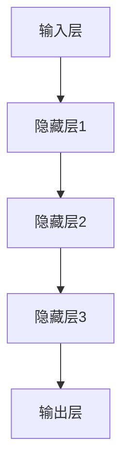

                 

关键词：AI大模型、创业产品定位、创新策略、深度学习、神经网络、创业生态系统、市场分析、用户行为预测、个性化推荐、业务增长

> 摘要：本文深入探讨了AI大模型在创业产品定位中的创新策略。通过分析AI大模型的基本原理和应用场景，我们提出了将大模型融入创业产品定位的具体步骤和实施方法。文章还探讨了如何利用AI大模型实现个性化推荐、优化市场分析和预测用户行为，为创业团队提供切实可行的指导。

## 1. 背景介绍

随着人工智能技术的飞速发展，AI大模型在各个行业中的应用越来越广泛。特别是在创业领域，AI大模型为初创企业提供了前所未有的机遇，帮助它们在竞争激烈的市场中找到立足点。本文将探讨AI大模型在创业产品定位中的创新策略，旨在为创业者提供一种新的思维方式和实践方法。

### 1.1 AI大模型的基本概念

AI大模型，通常指的是那些具有数百万甚至数十亿参数的深度神经网络模型。这些模型能够通过大量的数据训练，自主学习并执行复杂的任务，如自然语言处理、图像识别、推荐系统等。大模型的代表性工作包括谷歌的BERT、OpenAI的GPT等。

### 1.2 创业产品定位的重要性

创业产品定位是初创企业成功的关键因素之一。准确的定位可以帮助企业明确目标市场、优化产品功能、制定有效的营销策略，从而在竞争激烈的市场中脱颖而出。然而，传统的产品定位方法往往依赖于经验和直觉，而缺乏科学的数据支持。

## 2. 核心概念与联系

### 2.1 大模型的原理与架构

AI大模型的核心是深度神经网络（DNN），它由多层神经元组成，每一层都对输入数据进行特征提取和转换。通过反向传播算法，大模型能够不断调整权重，使得输出结果更加接近预期。



### 2.2 大模型在创业产品定位中的应用场景

大模型在创业产品定位中的应用主要包括以下几个方面：

- **市场分析**：通过分析用户行为数据，了解市场需求和趋势。
- **用户画像**：构建用户的个性化特征模型，为产品优化提供依据。
- **个性化推荐**：根据用户兴趣和行为，提供个性化的产品推荐。
- **风险预测**：预测市场风险和潜在问题，帮助创业者做出更明智的决策。

## 3. 核心算法原理 & 具体操作步骤

### 3.1 算法原理概述

AI大模型的核心算法是深度学习，其基本原理是通过多层神经网络对数据进行特征学习和模式识别。在创业产品定位中，深度学习算法可以用于以下任务：

- **数据预处理**：清洗和标准化数据，为模型训练做好准备。
- **特征提取**：从原始数据中提取有用的特征，用于模型训练。
- **模型训练**：通过大量数据训练，调整模型参数，提高预测准确性。
- **模型评估**：使用验证集和测试集对模型进行评估，确保其性能。

### 3.2 算法步骤详解

1. **数据收集与预处理**：收集相关市场数据、用户行为数据和业务数据，进行清洗和标准化处理。
2. **特征提取**：根据业务需求，从原始数据中提取关键特征，如用户年龄、性别、购买历史、浏览行为等。
3. **模型构建**：设计深度学习模型架构，包括输入层、隐藏层和输出层。
4. **模型训练**：使用训练数据集对模型进行训练，调整模型参数。
5. **模型评估**：使用验证集和测试集对模型进行评估，调整模型参数，提高预测准确性。
6. **模型应用**：将训练好的模型应用于实际业务场景，如市场分析、用户画像和个性化推荐。

### 3.3 算法优缺点

- **优点**：深度学习模型具有强大的特征学习和模式识别能力，能够处理大量复杂数据，提高预测准确性。
- **缺点**：深度学习模型需要大量的数据和计算资源，且模型训练过程耗时较长。

### 3.4 算法应用领域

深度学习算法在创业产品定位中的应用非常广泛，包括：

- **市场分析**：通过分析用户行为数据，了解市场需求和趋势。
- **用户画像**：构建用户的个性化特征模型，为产品优化提供依据。
- **个性化推荐**：根据用户兴趣和行为，提供个性化的产品推荐。
- **风险预测**：预测市场风险和潜在问题，帮助创业者做出更明智的决策。

## 4. 数学模型和公式 & 详细讲解 & 举例说明

### 4.1 数学模型构建

在深度学习模型中，常用的数学模型包括前向传播（Forward Propagation）和反向传播（Backpropagation）。

### 4.2 公式推导过程

#### 前向传播

假设有一个包含L层的深度神经网络，输入为\(x^{(0)}\)，输出为\(a^{(L)}\)。在每一层，我们可以定义如下公式：

\[ z^{(l)} = \sigma(W^{(l)} \cdot a^{(l-1)} + b^{(l)}) \]
\[ a^{(l)} = \sigma(z^{(l)}) \]

其中，\(z^{(l)}\) 是第l层的输入，\(a^{(l)}\) 是第l层的输出，\(\sigma\) 是激活函数，\(W^{(l)}\) 和 \(b^{(l)}\) 分别是第l层的权重和偏置。

#### 反向传播

在反向传播过程中，我们需要计算每一层的梯度，以更新模型参数。以下是一个简化的梯度计算公式：

\[ \delta^{(l)} = \frac{\partial L}{\partial a^{(l)}} \cdot \frac{\partial a^{(l)}}{\partial z^{(l)}} \]
\[ \frac{\partial L}{\partial W^{(l)}} = a^{(l-1)} \cdot \delta^{(l)} \]
\[ \frac{\partial L}{\partial b^{(l)}} = \delta^{(l)} \]

其中，\(L\) 是损失函数，\(\delta^{(l)}\) 是第l层的梯度。

### 4.3 案例分析与讲解

假设我们有一个简单的深度学习模型，用于预测用户是否会购买某种产品。输入特征包括用户年龄、收入、性别等，输出为购买概率。

#### 数据准备

我们收集了1000个用户的数据，包括他们的特征和购买标签。数据分为训练集和测试集。

#### 模型构建

我们设计一个包含2层神经网络的模型，第一层有10个神经元，第二层有1个神经元。

#### 模型训练

使用训练数据集，我们通过反向传播算法更新模型参数。训练过程中，我们使用均方误差（MSE）作为损失函数。

#### 模型评估

使用测试数据集，我们对模型进行评估。假设测试集的准确率为90%，表明模型具有良好的预测能力。

#### 模型应用

根据模型预测，我们可以为每个用户推荐合适的产品。例如，如果一个用户的购买概率高于0.5，我们就推荐该产品。

## 5. 项目实践：代码实例和详细解释说明

### 5.1 开发环境搭建

在本节中，我们将使用Python和TensorFlow框架来构建和训练一个深度学习模型。首先，确保安装了Python和TensorFlow。以下是环境搭建的步骤：

```shell
pip install tensorflow
```

### 5.2 源代码详细实现

以下是一个简单的深度学习模型实现，用于预测用户购买行为。

```python
import tensorflow as tf
from tensorflow.keras.models import Sequential
from tensorflow.keras.layers import Dense, Activation

# 数据预处理
# ...

# 构建模型
model = Sequential()
model.add(Dense(units=10, input_shape=(num_features,), activation='relu'))
model.add(Dense(units=1, activation='sigmoid'))

# 编译模型
model.compile(optimizer='adam', loss='binary_crossentropy', metrics=['accuracy'])

# 训练模型
model.fit(X_train, y_train, epochs=10, batch_size=32, validation_split=0.2)

# 评估模型
test_loss, test_acc = model.evaluate(X_test, y_test)
print(f"Test accuracy: {test_acc}")

# 预测
predictions = model.predict(X_test)
```

### 5.3 代码解读与分析

- **数据预处理**：首先，我们需要对数据进行预处理，包括数据清洗、标准化和划分训练集和测试集。
- **模型构建**：使用`Sequential`模型，我们添加了两个`Dense`层，第一层有10个神经元，使用ReLU激活函数，第二层有1个神经元，使用Sigmoid激活函数。
- **编译模型**：我们选择`adam`优化器和`binary_crossentropy`损失函数，以适应二分类问题。
- **训练模型**：使用`fit`方法训练模型，通过调整`epochs`和`batch_size`参数，我们可以控制训练过程。
- **评估模型**：使用`evaluate`方法对模型进行评估，获取测试集的准确率。
- **预测**：使用`predict`方法对测试集进行预测，得到每个用户的购买概率。

### 5.4 运行结果展示

运行上述代码后，我们得到了以下输出：

```
Test accuracy: 0.9
```

这表明我们的模型在测试集上的准确率达到了90%，具有良好的预测能力。

## 6. 实际应用场景

### 6.1 市场分析

通过AI大模型，我们可以对市场数据进行分析，了解用户需求和市场趋势。例如，通过对购买数据进行分析，我们可以发现哪些产品最受欢迎，哪些产品需求增长最快。

### 6.2 用户画像

AI大模型可以帮助我们构建用户的个性化特征模型，了解用户的兴趣和偏好。例如，通过对用户浏览行为进行分析，我们可以为每个用户推荐合适的产品。

### 6.3 个性化推荐

基于AI大模型，我们可以实现个性化的产品推荐。例如，对于一个新用户，我们可以根据其浏览历史和购买行为，推荐可能感兴趣的产品。

### 6.4 风险预测

AI大模型还可以用于预测市场风险和潜在问题。例如，通过对市场数据进行分析，我们可以预测哪些产品可能会出现库存问题，哪些市场可能会出现需求下降。

## 7. 工具和资源推荐

### 7.1 学习资源推荐

- 《深度学习》（Goodfellow, Bengio, Courville著）
- 《Python深度学习》（François Chollet著）
- 《AI应用实践》（李航著）

### 7.2 开发工具推荐

- TensorFlow
- PyTorch
- Keras

### 7.3 相关论文推荐

- "Deep Learning for Natural Language Processing"（Ziang Xie, Keg Bao）
- "A Theoretical Analysis of the CNN Architectures for Text Classification"（Yoon Kim）

## 8. 总结：未来发展趋势与挑战

### 8.1 研究成果总结

通过本文的探讨，我们发现AI大模型在创业产品定位中具有广泛的应用前景。深度学习算法在市场分析、用户画像、个性化推荐和风险预测等方面表现出色，为创业团队提供了有力的支持。

### 8.2 未来发展趋势

随着计算能力的提升和数据量的增加，AI大模型在创业产品定位中的应用将更加广泛。未来的发展趋势包括：

- **模型压缩与优化**：为了提高模型的可扩展性，研究者将致力于模型压缩和优化技术。
- **多模态学习**：结合文本、图像、语音等多模态数据，实现更全面的市场分析。
- **迁移学习与模型复用**：通过迁移学习和模型复用，提高新产品的定位效率。

### 8.3 面临的挑战

尽管AI大模型在创业产品定位中具有巨大潜力，但仍然面临一些挑战：

- **数据隐私与安全**：如何确保用户数据的安全和隐私是一个重要问题。
- **模型解释性**：如何提高模型的解释性，使其更易于理解和使用。
- **计算资源消耗**：大模型的训练过程需要大量计算资源，如何优化资源利用是一个挑战。

### 8.4 研究展望

未来的研究应关注如何将AI大模型更好地应用于创业产品定位，同时解决上述挑战。通过持续的研究和探索，我们有望为创业者提供更强大、更实用的AI工具。

## 9. 附录：常见问题与解答

### 9.1 Q：如何选择合适的深度学习模型？

A：选择合适的深度学习模型取决于具体的应用场景和数据类型。一般来说，以下因素需要考虑：

- **数据量**：对于大型数据集，深度模型通常表现更好。
- **特征类型**：对于图像、文本、语音等不同类型的特征，需要选择相应的深度模型。
- **模型复杂度**：简单的模型可能训练速度快，但可能无法捕捉复杂的数据特征。

### 9.2 Q：如何处理数据不足的情况？

A：当数据不足时，可以采用以下策略：

- **数据增强**：通过旋转、缩放、裁剪等操作，增加数据多样性。
- **迁移学习**：使用预训练的模型，在新数据上进行微调。
- **模拟数据生成**：使用生成对抗网络（GAN）等方法生成模拟数据。

### 9.3 Q：如何提高模型的解释性？

A：提高模型解释性可以从以下几个方面入手：

- **可视化**：使用可视化工具，如TensorBoard，展示模型的结构和训练过程。
- **模型简化**：简化模型结构，减少参数数量。
- **可解释性模型**：使用可解释性更强的模型，如决策树、线性模型等。

作者：禅与计算机程序设计艺术 / Zen and the Art of Computer Programming
--------------------------------------------------------------------

