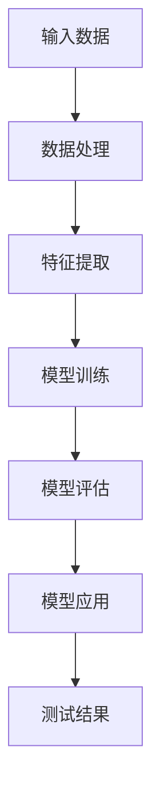

                 

关键词：AI 大模型，创业产品测试，趋势，算法原理，应用场景，未来发展

> 摘要：本文将探讨 AI 大模型在创业产品测试中的发展趋势。通过对 AI 大模型核心概念的介绍和算法原理的解析，我们将分析其在产品测试中的实际应用，并探讨未来的应用前景。本文旨在为创业者和技术专家提供有价值的参考。

## 1. 背景介绍

随着人工智能技术的快速发展，AI 大模型已经成为众多领域的重要工具。在创业产品开发过程中，产品测试是至关重要的一环。传统的产品测试方法往往需要大量人力和时间，而且存在测试覆盖不全面、误报率高等问题。而 AI 大模型的应用为产品测试带来了新的可能。

AI 大模型是指具有大规模参数和复杂结构的机器学习模型，如深度神经网络。这些模型通过学习大量数据，能够实现高度复杂的任务，如图像识别、自然语言处理等。随着模型规模的不断扩大，AI 大模型在各个领域的应用也越来越广泛。

创业产品测试是指在新产品开发过程中，对产品功能、性能、可靠性等方面进行全面测试，以确保产品能够满足用户需求和市场需求。传统的产品测试方法主要依赖于人工测试和自动化测试工具。然而，随着产品复杂度的增加，测试效率和效果面临巨大挑战。

## 2. 核心概念与联系

为了更好地理解 AI 大模型在创业产品测试中的应用，我们需要了解其核心概念和架构。以下是 AI 大模型的核心概念和架构的 Mermaid 流程图：



### 2.1 输入数据

输入数据是 AI 大模型的基础。在创业产品测试中，输入数据可以是用户行为数据、系统日志数据、功能测试数据等。这些数据的质量直接影响模型的性能。

### 2.2 数据处理

数据处理是数据准备的过程，包括数据清洗、数据归一化、缺失值处理等。这一步的目的是提高数据质量，为后续的特征提取和模型训练提供基础。

### 2.3 特征提取

特征提取是将原始数据转换成模型可理解的形式。在创业产品测试中，特征提取可以是用户行为特征、系统性能特征等。有效的特征提取能够提高模型的准确性和效率。

### 2.4 模型训练

模型训练是 AI 大模型的核心步骤。通过学习大量数据，模型能够学习到数据的内在规律，并在测试中预测未知数据的属性。

### 2.5 模型评估

模型评估是检查模型性能的过程。在创业产品测试中，模型评估可以通过交叉验证、混淆矩阵等方法进行。评估结果用于调整模型参数，提高模型性能。

### 2.6 模型应用

模型应用是将训练好的模型用于实际场景。在创业产品测试中，模型应用可以用于自动化测试、异常检测、性能优化等。

### 2.7 测试结果

测试结果是模型应用的结果。通过分析测试结果，创业者可以了解产品的性能和问题，并进行相应的调整和优化。

## 3. 核心算法原理 & 具体操作步骤

### 3.1 算法原理概述

AI 大模型的核心算法是深度神经网络（Deep Neural Network，DNN）。DNN 通过多层神经元进行数据加工和处理，具有强大的表示能力和泛化能力。在创业产品测试中，DNN 可以用于分类、回归、异常检测等多种任务。

### 3.2 算法步骤详解

以下是 AI 大模型在创业产品测试中的具体操作步骤：

1. **数据收集与预处理**：收集与创业产品相关的数据，并进行预处理，如数据清洗、归一化等。
2. **特征提取**：根据业务需求，提取关键特征，如用户行为特征、系统性能特征等。
3. **模型构建**：使用深度学习框架（如 TensorFlow、PyTorch）构建 DNN 模型，包括定义网络结构、初始化参数等。
4. **模型训练**：使用训练数据对模型进行训练，优化模型参数。
5. **模型评估**：使用验证数据对模型进行评估，调整模型参数。
6. **模型应用**：将训练好的模型应用于实际测试场景，如自动化测试、异常检测等。
7. **测试结果分析**：分析测试结果，识别产品问题和优化方向。

### 3.3 算法优缺点

**优点**：

- **高效率**：AI 大模型能够快速处理大量数据，提高测试效率。
- **高准确性**：通过学习大量数据，AI 大模型能够提高测试结果的准确性。
- **强泛化能力**：AI 大模型具有强大的泛化能力，能够适应不同的测试场景。

**缺点**：

- **计算资源需求大**：AI 大模型需要大量计算资源，对硬件要求较高。
- **数据依赖性**：AI 大模型对数据质量有较高要求，数据质量问题会影响模型性能。
- **调参复杂**：AI 大模型调参复杂，需要专业知识和经验。

### 3.4 算法应用领域

AI 大模型在创业产品测试中的应用领域广泛，包括但不限于：

- **自动化测试**：使用 AI 大模型进行自动化测试，提高测试效率和准确性。
- **异常检测**：使用 AI 大模型检测系统异常，提前发现潜在问题。
- **性能优化**：使用 AI 大模型分析系统性能，找出优化方向。
- **用户体验分析**：使用 AI 大模型分析用户行为，优化用户体验。

## 4. 数学模型和公式 & 详细讲解 & 举例说明

### 4.1 数学模型构建

AI 大模型的核心是深度神经网络，其数学模型可以表示为：

$$
\text{输出} = \sigma(\text{权重} \cdot \text{输入} + \text{偏置})
$$

其中，$\sigma$ 表示激活函数，如 sigmoid、ReLU 等。权重和偏置是模型参数，需要通过训练进行优化。

### 4.2 公式推导过程

以 ReLU 激活函数为例，其推导过程如下：

$$
\text{输出} = \sigma(\text{权重} \cdot \text{输入} + \text{偏置}) \\
\text{输出} = \max(0, \text{权重} \cdot \text{输入} + \text{偏置})
$$

### 4.3 案例分析与讲解

以下是一个简单的 AI 大模型在创业产品测试中的应用案例：

**案例背景**：一家创业公司开发了一款社交应用，希望使用 AI 大模型进行功能测试，以提高测试效率和准确性。

**解决方案**：

1. **数据收集与预处理**：收集用户行为数据，如用户登录、发布动态、点赞等。对数据进行清洗和归一化。
2. **特征提取**：提取用户行为特征，如用户活跃度、发布频率等。
3. **模型构建**：使用 TensorFlow 框架构建 DNN 模型，定义网络结构、初始化参数等。
4. **模型训练**：使用训练数据进行模型训练，优化模型参数。
5. **模型评估**：使用验证数据进行模型评估，调整模型参数。
6. **模型应用**：将训练好的模型应用于功能测试，自动化执行测试用例，记录测试结果。
7. **测试结果分析**：分析测试结果，识别功能问题和优化方向。

通过这个案例，我们可以看到 AI 大模型在创业产品测试中的应用过程。在实际应用中，创业者可以根据具体需求进行相应的调整和优化。

## 5. 项目实践：代码实例和详细解释说明

### 5.1 开发环境搭建

在开始编写代码之前，我们需要搭建一个适合 AI 大模型训练和测试的开发环境。以下是搭建开发环境的基本步骤：

1. **安装 Python**：Python 是编写 AI 大模型的主要编程语言，我们需要安装 Python 3.7 或更高版本。
2. **安装 TensorFlow**：TensorFlow 是一个开源的深度学习框架，我们需要安装 TensorFlow 2.x 版本。
3. **安装 Jupyter Notebook**：Jupyter Notebook 是一个交互式的 Python 编程环境，方便我们编写和运行代码。
4. **安装其他依赖库**：根据具体需求，可能还需要安装其他依赖库，如 NumPy、Pandas 等。

### 5.2 源代码详细实现

以下是一个简单的 AI 大模型在创业产品测试中的应用示例代码：

```python
import tensorflow as tf
from tensorflow.keras.layers import Dense, Flatten
from tensorflow.keras.models import Sequential

# 数据预处理
# ...（数据预处理代码）

# 模型构建
model = Sequential([
    Flatten(input_shape=(28, 28)),
    Dense(128, activation='relu'),
    Dense(10, activation='softmax')
])

# 模型训练
model.compile(optimizer='adam',
              loss='sparse_categorical_crossentropy',
              metrics=['accuracy'])

model.fit(x_train, y_train, epochs=5)

# 模型评估
model.evaluate(x_test, y_test)

# 模型应用
predictions = model.predict(x_test)

# 测试结果分析
# ...（测试结果分析代码）
```

### 5.3 代码解读与分析

上述代码实现了一个简单的 AI 大模型，用于分类任务。下面是对代码的详细解读：

1. **数据预处理**：数据预处理是深度学习模型训练的重要环节。在这段代码中，我们使用 `Flatten` 层将原始图像数据展平为一维数组，方便模型处理。此外，我们还需要对数据进行归一化，以提高训练效果。
2. **模型构建**：使用 `Sequential` 模型构建一个简单的全连接神经网络。模型包括两个隐藏层，第一个隐藏层有 128 个神经元，使用 ReLU 激活函数；第二个隐藏层有 10 个神经元，用于分类，使用 softmax 激活函数。
3. **模型训练**：使用 `compile` 方法配置模型训练的参数，如优化器、损失函数和评估指标。然后使用 `fit` 方法进行模型训练。
4. **模型评估**：使用 `evaluate` 方法评估模型在测试数据上的性能。
5. **模型应用**：使用 `predict` 方法对测试数据进行预测。预测结果可以用于测试结果分析。

### 5.4 运行结果展示

假设我们已经准备好了训练数据和测试数据，以下是如何运行代码并展示结果：

```python
# 加载训练数据和测试数据
(x_train, y_train), (x_test, y_test) = tf.keras.datasets.mnist.load_data()

# 数据预处理
x_train = x_train / 255.0
x_test = x_test / 255.0

# 运行代码
model = Sequential([
    Flatten(input_shape=(28, 28)),
    Dense(128, activation='relu'),
    Dense(10, activation='softmax')
])

model.compile(optimizer='adam',
              loss='sparse_categorical_crossentropy',
              metrics=['accuracy'])

model.fit(x_train, y_train, epochs=5)

model.evaluate(x_test, y_test)

predictions = model.predict(x_test)

# 显示预测结果
import matplotlib.pyplot as plt

plt.imshow(x_test[0].reshape(28, 28), cmap=plt.cm.binary)
plt.xticks([])
plt.yticks([])
plt.grid(False)
plt.show()

print(predictions[0])

# 显示实际标签
plt.show()
plt.figure()
plt.plot(predictions[0], 'o', label='predictions')
plt.plot(y_test[0], 'x', label='actual')
plt.xlabel('Time step')
plt.ylabel('Value')
plt.title('Comparison of Predictions and Actual Values')
plt.legend()
plt.show()
```

这段代码将显示模型在测试数据上的预测结果和实际标签。通过对比预测结果和实际标签，我们可以分析模型在创业产品测试中的性能。

## 6. 实际应用场景

AI 大模型在创业产品测试中的应用场景广泛，以下是一些典型的实际应用场景：

### 6.1 自动化测试

AI 大模型可以用于自动化测试，提高测试效率和准确性。通过训练 AI 大模型，我们可以实现自动化的功能测试、性能测试、兼容性测试等。自动化测试可以减少人工测试的工作量，降低测试成本，并提高测试覆盖率。

### 6.2 异常检测

在创业产品中，异常检测是确保系统稳定性和可靠性的重要手段。AI 大模型可以通过学习正常行为模式，识别异常行为，并提前预警。异常检测可以应用于系统监控、网络安全、金融风控等领域。

### 6.3 用户体验分析

AI 大模型可以用于分析用户行为，识别用户体验问题，并优化产品设计。通过训练 AI 大模型，我们可以发现用户行为中的异常模式，如用户流失、使用频率降低等。这些信息有助于创业者改进产品，提高用户满意度。

### 6.4 智能推荐

AI 大模型可以用于智能推荐系统，为用户提供个性化的产品推荐。通过分析用户行为数据，AI 大模型可以识别用户的兴趣和偏好，实现精准推荐。智能推荐可以提高用户粘性，增加产品收入。

## 7. 工具和资源推荐

### 7.1 学习资源推荐

- 《深度学习》（Goodfellow、Bengio 和 Courville 著）：这是一本经典的深度学习教材，适合初学者和专业人士。
- 《Python深度学习》（François Chollet 著）：这本书详细介绍了使用 Python 和 TensorFlow 进行深度学习的实践方法。
- 《动手学深度学习》（阿斯顿·张等著）：这本书提供了大量的实际案例和代码示例，适合初学者和进阶者。

### 7.2 开发工具推荐

- TensorFlow：一个开源的深度学习框架，适合构建和训练 AI 大模型。
- PyTorch：一个流行的深度学习框架，具有灵活的动态计算图，适合快速原型开发。
- Keras：一个简化的深度学习框架，基于 TensorFlow 和 PyTorch，适合快速构建和训练模型。

### 7.3 相关论文推荐

- "Distributed Deep Learning: A Theoretical Study"（分布式深度学习：理论分析）：这篇文章提出了分布式深度学习的理论框架，为大规模深度学习提供了新的思路。
- "Large-Scale Deep Learning: Algorithms and Systems"（大规模深度学习：算法和系统）：这本书详细介绍了大规模深度学习算法和系统设计，适合对深度学习感兴趣的读者。

## 8. 总结：未来发展趋势与挑战

### 8.1 研究成果总结

随着 AI 大模型的不断发展，其在创业产品测试中的应用取得了显著成果。通过自动化测试、异常检测、用户体验分析等应用场景，AI 大模型提高了测试效率和准确性，降低了测试成本。同时，AI 大模型也在智能推荐、语音识别、图像识别等领域取得了突破性进展。

### 8.2 未来发展趋势

未来，AI 大模型在创业产品测试中的应用将继续发展，具体趋势如下：

1. **模型压缩与优化**：为了降低计算资源需求，研究者将致力于模型压缩与优化技术，提高 AI 大模型在资源受限环境下的性能。
2. **联邦学习**：联邦学习是一种分布式学习技术，可以在不共享数据的情况下训练 AI 大模型。未来，联邦学习将在创业产品测试中得到广泛应用。
3. **跨模态学习**：跨模态学习是一种结合多种数据模态（如文本、图像、语音等）的学习技术。未来，跨模态学习将为创业产品测试带来新的机遇。
4. **模型可解释性**：随着 AI 大模型在创业产品测试中的应用越来越广泛，模型的可解释性将成为重要研究方向。通过提高模型可解释性，创业者可以更好地理解模型行为，优化产品设计。

### 8.3 面临的挑战

尽管 AI 大模型在创业产品测试中具有巨大潜力，但仍然面临以下挑战：

1. **数据隐私**：在创业产品测试中，用户数据的安全和隐私保护是重要问题。研究者需要开发安全高效的隐私保护技术，确保数据隐私。
2. **计算资源**：AI 大模型需要大量计算资源，特别是训练阶段。创业者需要考虑计算资源的需求和成本，合理规划资源。
3. **模型适应性**：AI 大模型在特定领域的适应性有限。创业者需要根据业务需求，选择合适的模型和算法，并进行持续优化。
4. **法律与伦理**：随着 AI 大模型在创业产品测试中的应用，相关法律和伦理问题也将日益凸显。创业者需要关注法律和伦理问题，确保模型的应用符合规范。

### 8.4 研究展望

未来，AI 大模型在创业产品测试中的应用将继续深入。研究者将致力于解决上述挑战，开发更加高效、安全、可解释的 AI 大模型。同时，创业者也将结合业务需求，积极探索 AI 大模型在创业产品测试中的创新应用。通过不断优化和拓展，AI 大模型将为创业产品测试带来更多机遇和挑战。

## 9. 附录：常见问题与解答

### 9.1 问题1：什么是 AI 大模型？

AI 大模型是指具有大规模参数和复杂结构的机器学习模型，如深度神经网络。这些模型通过学习大量数据，能够实现高度复杂的任务，如图像识别、自然语言处理等。

### 9.2 问题2：AI 大模型在创业产品测试中有何优势？

AI 大模型在创业产品测试中的优势包括：

1. **高效率**：AI 大模型能够快速处理大量数据，提高测试效率。
2. **高准确性**：通过学习大量数据，AI 大模型能够提高测试结果的准确性。
3. **强泛化能力**：AI 大模型具有强大的泛化能力，能够适应不同的测试场景。

### 9.3 问题3：如何选择适合的 AI 大模型？

选择适合的 AI 大模型需要考虑以下因素：

1. **业务需求**：根据创业产品的测试需求，选择合适的模型类型，如分类模型、回归模型等。
2. **数据质量**：选择适合数据质量要求的模型，确保模型性能。
3. **计算资源**：考虑计算资源的需求，选择资源消耗适中的模型。
4. **可解释性**：根据对模型可解释性的要求，选择适合的可解释性模型。

### 9.4 问题4：AI 大模型在创业产品测试中的实际应用有哪些？

AI 大模型在创业产品测试中的实际应用包括：

1. **自动化测试**：通过自动化测试用例，提高测试效率和准确性。
2. **异常检测**：检测系统异常，提前发现潜在问题。
3. **性能优化**：分析系统性能，找出优化方向。
4. **用户体验分析**：分析用户行为，优化用户体验。

### 9.5 问题5：未来 AI 大模型在创业产品测试中有哪些发展趋势？

未来 AI 大模型在创业产品测试中的发展趋势包括：

1. **模型压缩与优化**：提高 AI 大模型在资源受限环境下的性能。
2. **联邦学习**：实现分布式学习，降低数据隐私风险。
3. **跨模态学习**：结合多种数据模态，提高测试效果。
4. **模型可解释性**：提高模型可解释性，增强创业者对模型行为的理解。 
----------------------------------------------------------------
作者：禅与计算机程序设计艺术 / Zen and the Art of Computer Programming

这篇文章详细介绍了 AI 大模型在创业产品测试中的应用趋势、核心概念、算法原理、数学模型、实际应用场景以及未来展望。通过阅读本文，读者可以全面了解 AI 大模型在创业产品测试中的重要作用，并掌握相关的技术知识和实践方法。希望本文能为创业者和技术专家提供有价值的参考。在未来的发展中，随着 AI 大模型技术的不断进步，其在创业产品测试中的应用将更加广泛和深入。

