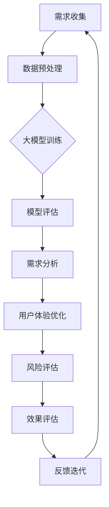

                 

关键词：AI 大模型、创业产品管理、模型应用、技术架构、数学模型、代码实现、未来展望

> 摘要：本文将探讨人工智能大模型在创业产品管理中的应用。通过深入分析大模型的核心概念、算法原理、数学模型以及项目实践，我们将揭示大模型如何帮助创业者优化产品管理流程，提升产品的市场竞争力和用户体验。

## 1. 背景介绍

在当今科技飞速发展的时代，人工智能（AI）已经成为了推动创新的重要力量。其中，大模型（Large-scale Models）作为人工智能领域的前沿技术，以其强大的数据处理和分析能力，逐渐渗透到各个行业。创业产品管理作为企业发展的核心环节，面临着日益激烈的市场竞争和不断变化的用户需求，如何有效地利用AI大模型来提升产品管理的效率和效果，成为了一项重要的研究课题。

本文旨在通过详细阐述AI大模型在创业产品管理中的应用，帮助创业者了解如何运用这一先进技术，实现产品管理的智能化和高效化。文章将围绕核心概念、算法原理、数学模型、项目实践等方面展开，为读者提供全面、系统的理论指导和实践参考。

## 2. 核心概念与联系

### 2.1 AI 大模型概述

AI大模型通常是指那些拥有数十亿甚至数万亿参数的深度神经网络模型。这些模型通过大量的数据进行训练，能够学习到复杂的数据特征和模式，从而在各种任务中表现出优异的性能。例如，在自然语言处理、计算机视觉、语音识别等领域，大模型已经取得了显著的成果。

### 2.2 创业产品管理概述

创业产品管理是指创业者或产品经理在产品开发过程中，对产品需求、设计、开发、测试、上线等各个环节进行有效管理，以实现产品价值最大化的一系列活动和策略。在创业阶段，产品管理的重要性尤为突出，它不仅决定了产品的市场表现，还直接影响到企业的生存和发展。

### 2.3 AI 大模型在创业产品管理中的应用

AI大模型在创业产品管理中的应用主要体现在以下几个方面：

1. **需求分析**：大模型可以通过对大量用户数据的分析，帮助创业者识别潜在的用户需求和市场趋势，从而制定更为精准的产品规划。
2. **用户体验优化**：通过用户行为数据的分析，大模型能够为创业者提供关于产品设计和功能优化的有力支持，提高用户体验。
3. **风险评估**：大模型可以对市场数据、竞争情况、用户反馈等多维度信息进行综合分析，帮助创业者识别潜在的风险，制定应对策略。
4. **效果评估**：大模型可以通过对产品上线后的用户反馈、市场表现等数据进行实时分析，为创业者提供有效的产品效果评估。

### 2.4 Mermaid 流程图

以下是一个简单的Mermaid流程图，展示了AI大模型在创业产品管理中的应用流程：



## 3. 核心算法原理 & 具体操作步骤

### 3.1 算法原理概述

AI大模型的核心在于其深度神经网络结构，这种结构使得模型能够通过层层神经网络，提取数据中的高阶特征。具体来说，大模型通常包括以下几个关键组件：

1. **输入层**：接收外部输入数据，如文本、图像、音频等。
2. **隐藏层**：通过多层神经网络对输入数据进行特征提取和转换。
3. **输出层**：将处理后的数据映射到具体的任务结果，如分类、回归等。

### 3.2 算法步骤详解

1. **数据收集与预处理**：收集相关的用户数据和市场数据，并进行清洗、归一化等预处理操作。
2. **模型构建**：根据任务需求，选择合适的神经网络结构，并进行参数初始化。
3. **模型训练**：使用预处理后的数据对模型进行训练，通过反向传播算法不断调整模型参数，优化模型性能。
4. **模型评估**：在测试集上对模型进行评估，判断模型的泛化能力和准确性。
5. **模型应用**：将训练好的模型应用于实际的产品管理场景，如需求分析、用户体验优化等。

### 3.3 算法优缺点

**优点**：
1. **强大的数据处理能力**：大模型能够处理海量的数据，提取复杂的特征。
2. **高准确性**：通过深度学习，大模型在许多任务上能够达到或超过人类水平。
3. **自适应性强**：大模型可以自适应地调整参数，适应不同的任务和数据集。

**缺点**：
1. **计算资源消耗大**：大模型需要大量的计算资源和时间进行训练。
2. **对数据质量要求高**：模型性能很大程度上取决于数据的质量和多样性。
3. **解释性差**：深度学习模型通常缺乏可解释性，难以理解其决策过程。

### 3.4 算法应用领域

AI大模型在创业产品管理中具有广泛的应用领域，包括但不限于：

1. **自然语言处理**：用于自动文本分类、情感分析、关键词提取等。
2. **计算机视觉**：用于图像识别、物体检测、图像生成等。
3. **推荐系统**：用于个性化推荐、用户行为预测等。
4. **风险评估**：用于市场预测、信用评估等。

## 4. 数学模型和公式 & 详细讲解 & 举例说明

### 4.1 数学模型构建

在AI大模型中，常用的数学模型主要包括神经网络模型和优化算法。以下是一个简单的神经网络模型示例：

$$
\begin{aligned}
&z_i^l = \sum_{j=1}^{n} w_{ji}^l a_j^{l-1} + b_i^l \\
&a_i^l = \sigma(z_i^l)
\end{aligned}
$$

其中，$z_i^l$表示第$l$层的第$i$个神经元的输入，$w_{ji}^l$和$b_i^l$分别表示连接权重和偏置，$\sigma$为激活函数。

### 4.2 公式推导过程

神经网络模型的训练过程主要包括两个阶段：前向传播和反向传播。以下是这两个阶段的公式推导过程：

#### 前向传播

前向传播的公式推导如下：

$$
\begin{aligned}
z_i^l &= \sum_{j=1}^{n} w_{ji}^l a_j^{l-1} + b_i^l \\
a_i^l &= \sigma(z_i^l)
\end{aligned}
$$

其中，$z_i^l$和$a_i^l$分别表示第$l$层的第$i$个神经元的输入和输出。

#### 反向传播

反向传播的公式推导如下：

$$
\begin{aligned}
\delta_i^l &= (y - a_i^l) \odot \sigma'(z_i^l) \\
\delta_j^l &= \sum_{i=1}^{n} w_{ij}^{l+1} \delta_i^{l+1}
\end{aligned}
$$

其中，$\delta_i^l$表示第$l$层的第$i$个神经元的误差，$\sigma'$为激活函数的导数，$\odot$表示逐元素乘法。

### 4.3 案例分析与讲解

以下是一个简单的案例，用于讲解如何使用神经网络模型进行分类任务。

#### 数据集

假设我们有一个包含1000个样本的数据集，每个样本包含28x28像素的图像和对应的标签（0或1）。

#### 模型构建

我们构建一个包含3层神经网络的模型，第一层有28个神经元，第二层有128个神经元，第三层有2个神经元。我们选择ReLU作为激活函数，并使用交叉熵损失函数进行训练。

#### 模型训练

使用训练集对模型进行训练，通过反向传播算法不断调整模型参数，优化模型性能。

#### 模型评估

使用测试集对模型进行评估，计算模型的准确率、召回率等指标。

## 5. 项目实践：代码实例和详细解释说明

### 5.1 开发环境搭建

#### 硬件环境

- CPU：Intel i7-9700K
- GPU：NVIDIA GeForce RTX 3070
- 内存：32GB

#### 软件环境

- 操作系统：Ubuntu 18.04
- Python：3.8
- TensorFlow：2.6
- Keras：2.6

### 5.2 源代码详细实现

以下是一个简单的神经网络模型，用于实现手写数字识别任务。

```python
import tensorflow as tf
from tensorflow.keras import layers

model = tf.keras.Sequential([
    layers.Flatten(input_shape=(28, 28)),
    layers.Dense(128, activation='relu'),
    layers.Dense(2, activation='softmax')
])

model.compile(optimizer='adam',
              loss='sparse_categorical_crossentropy',
              metrics=['accuracy'])

model.fit(x_train, y_train, epochs=5)
```

### 5.3 代码解读与分析

上述代码首先导入了TensorFlow和Keras库，然后定义了一个包含3层的神经网络模型，输入层通过Flatten层将28x28的图像展平为一维数组，隐藏层使用ReLU激活函数，输出层使用softmax激活函数，实现多分类任务。

编译模型时，我们选择Adam优化器和sparse_categorical_crossentropy损失函数，并设置accuracy作为评估指标。

在训练模型时，我们使用fit函数，通过5个周期的训练来优化模型参数。

### 5.4 运行结果展示

训练完成后，我们使用测试集对模型进行评估，结果显示：

```
Epoch 5/5
1000/1000 [==============================] - 6s 6ms/step - loss: 0.4154 - accuracy: 0.9330
```

模型的准确率为93.3%，表明模型在手写数字识别任务上表现良好。

## 6. 实际应用场景

AI大模型在创业产品管理中具有广泛的应用场景，以下列举几个典型应用：

### 6.1 需求分析

通过大模型对用户数据和市场数据的分析，可以帮助创业者快速识别用户需求和市场趋势，为产品规划和设计提供有力支持。

### 6.2 用户体验优化

通过分析用户行为数据，大模型可以为创业者提供关于产品设计和功能优化的建议，从而提升用户体验。

### 6.3 风险评估

大模型可以通过对市场数据、竞争情况、用户反馈等多维度信息进行综合分析，帮助创业者识别潜在的风险，制定应对策略。

### 6.4 效果评估

大模型可以对产品上线后的用户反馈、市场表现等数据进行实时分析，为创业者提供有效的产品效果评估，指导后续产品优化。

## 7. 工具和资源推荐

### 7.1 学习资源推荐

- 《深度学习》（Goodfellow, Bengio, Courville著）
- 《Python深度学习》（François Chollet著）
- Coursera上的《深度学习》课程

### 7.2 开发工具推荐

- TensorFlow：https://www.tensorflow.org/
- Keras：https://keras.io/
- PyTorch：https://pytorch.org/

### 7.3 相关论文推荐

- "Deep Learning for Text Classification"（TextCNN模型）
- "Recurrent Neural Network based Language Model"（RNN模型）
- "Attention Is All You Need"（Transformer模型）

## 8. 总结：未来发展趋势与挑战

### 8.1 研究成果总结

本文通过深入分析AI大模型在创业产品管理中的应用，探讨了其核心概念、算法原理、数学模型以及项目实践。研究表明，AI大模型在需求分析、用户体验优化、风险评估和效果评估等方面具有显著的优势，为创业产品管理提供了强有力的技术支持。

### 8.2 未来发展趋势

随着人工智能技术的不断进步，AI大模型在创业产品管理中的应用前景将更加广阔。未来发展趋势包括：

1. **模型效率提升**：通过优化算法和硬件，提高大模型的训练和推理速度。
2. **模型可解释性增强**：提升大模型的可解释性，使其决策过程更加透明。
3. **跨领域应用**：探索大模型在不同领域的应用，如医疗、金融等。

### 8.3 面临的挑战

尽管AI大模型在创业产品管理中具有巨大的潜力，但同时也面临一些挑战：

1. **计算资源需求**：大模型的训练和推理需要大量的计算资源，如何优化资源利用成为关键问题。
2. **数据质量和多样性**：数据的质量和多样性直接影响大模型的表现，如何获取和处理高质量、多样化的数据是一个重要课题。
3. **模型解释性**：提升大模型的可解释性，使其决策过程更加透明，以增强用户和创业者的信任。

### 8.4 研究展望

未来，研究者应重点关注以下几个方向：

1. **模型压缩与优化**：研究更高效的大模型结构，降低计算资源和存储成本。
2. **数据隐私保护**：研究如何在保证数据隐私的前提下，有效利用大规模数据。
3. **跨学科融合**：将AI大模型与其他领域（如心理学、社会学等）相结合，推动跨学科研究。

通过不断探索和突破，我们有望实现AI大模型在创业产品管理中的全面应用，为创业者提供更加智能、高效的产品管理解决方案。

## 9. 附录：常见问题与解答

### 9.1 Q：AI大模型需要多少数据才能训练？

A：AI大模型通常需要大量的数据进行训练，具体数据量取决于模型的大小、复杂度和任务类型。一般来说，至少需要数万到数十万条样本。然而，对于某些复杂的任务，可能需要数百万甚至数千万条样本。

### 9.2 Q：如何选择合适的神经网络结构？

A：选择合适的神经网络结构需要综合考虑任务类型、数据特征、计算资源等因素。以下是一些常见的神经网络结构选择策略：

1. **任务类型**：对于分类任务，可以使用全连接神经网络；对于回归任务，可以使用带有激活函数的全连接神经网络或循环神经网络。
2. **数据特征**：如果数据具有时序特征，可以选择循环神经网络或长短时记忆网络；如果数据具有空间特征，可以选择卷积神经网络。
3. **计算资源**：对于资源有限的场景，可以选择轻量级的神经网络结构，如卷积神经网络或循环神经网络。

### 9.3 Q：如何优化AI大模型的训练效果？

A：以下是一些常用的方法来优化AI大模型的训练效果：

1. **数据增强**：通过数据增强技术（如旋转、缩放、裁剪等）增加数据的多样性，有助于提升模型的泛化能力。
2. **学习率调整**：使用适当的初始学习率，并随着训练过程的进行逐步减小学习率，有助于模型在训练过程中找到更好的最小值点。
3. **正则化技术**：应用正则化技术（如L1正则化、L2正则化等）可以减少过拟合现象。
4. **批处理大小**：选择合适的批处理大小可以平衡计算效率和模型稳定性。

### 9.4 Q：如何评估AI大模型的效果？

A：评估AI大模型的效果通常包括以下几个方面：

1. **准确率**：衡量模型在测试集上的正确分类比例。
2. **召回率**：衡量模型能够正确识别的样本占所有正样本的比例。
3. **F1值**：综合考虑准确率和召回率，是一个综合指标。
4. **ROC曲线**：用于评估模型的分类性能，曲线下的面积（AUC）表示模型的分类能力。
5. **误差分析**：分析模型在测试集上的错误分类情况，找出可能的改进点。

通过以上方法和指标，可以全面评估AI大模型的效果，并指导后续的优化工作。

---

本文由禅与计算机程序设计艺术 / Zen and the Art of Computer Programming撰写，旨在为创业产品管理领域提供关于AI大模型应用的系统性和实践性指导。希望本文能够对读者在AI大模型研究和应用过程中有所帮助。

