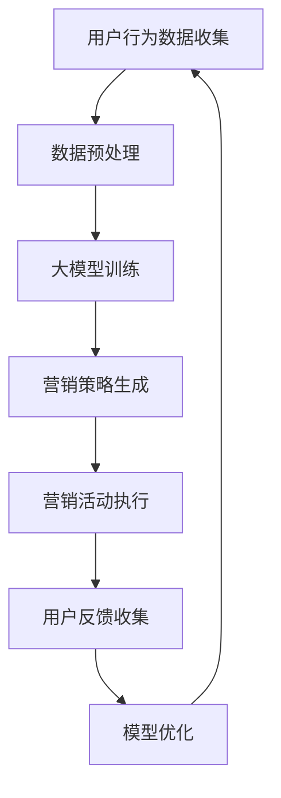

                 

关键词：人工智能，创业产品，大模型，营销，用户体验

摘要：本文将探讨人工智能大模型在创业产品营销中的应用，包括核心概念、算法原理、数学模型、项目实践以及未来展望。我们将通过具体案例，分析如何利用大模型提升创业产品的市场竞争力，创造更大的商业价值。

## 1. 背景介绍

在当今数字化时代，创业产品的成功往往依赖于其营销策略。传统的营销方法，如广告投放和社交媒体推广，虽然在一定程度上可以吸引潜在用户，但效果往往不尽如人意。随着人工智能技术的发展，特别是大模型的兴起，为创业产品的营销带来了全新的机遇。大模型具有强大的数据分析和处理能力，能够深度挖掘用户需求，提供个性化的营销方案，从而提高转化率和用户满意度。

## 2. 核心概念与联系

### 2.1 人工智能与创业产品

人工智能（AI）是指由人制造出来的系统能够感知环境，并采取行动以达到特定目标。在创业产品中，AI 可以用于需求分析、用户行为预测、个性化推荐等。

### 2.2 大模型的概念

大模型是指具有数十亿甚至千亿参数的人工神经网络模型，如GPT-3、BERT等。这些模型可以通过大规模数据训练，具备处理复杂任务的能力。

### 2.3 营销与用户体验

营销是指通过广告、促销、公关等手段，推广产品或服务，吸引用户购买。用户体验（UX）则是指用户在使用产品过程中的感受和满意度。一个成功的创业产品需要在营销和用户体验之间找到平衡。

### 2.4 Mermaid 流程图

以下是一个简单的 Mermaid 流程图，展示了人工智能大模型在创业产品营销中的应用流程：



## 3. 核心算法原理 & 具体操作步骤

### 3.1 算法原理概述

人工智能大模型在创业产品营销中的应用，主要基于以下核心原理：

1. **数据驱动**：利用用户行为数据，挖掘用户需求和偏好。
2. **深度学习**：通过大规模数据训练，提高模型的预测和分类能力。
3. **个性化推荐**：根据用户历史行为和需求，提供个性化的营销方案。

### 3.2 算法步骤详解

1. **数据收集**：收集用户在产品上的行为数据，如浏览记录、购买记录、评论等。
2. **数据预处理**：对原始数据进行清洗、去重和标准化处理，以便于模型训练。
3. **大模型训练**：使用预处理后的数据，训练大模型，如GPT-3、BERT等。
4. **营销策略生成**：利用训练好的大模型，分析用户需求和偏好，生成个性化的营销策略。
5. **营销活动执行**：根据生成的营销策略，执行具体的营销活动，如发送个性化邮件、推送个性化广告等。
6. **用户反馈收集**：收集用户对营销活动的反馈，如点击率、转化率等。
7. **模型优化**：根据用户反馈，调整模型参数，提高模型性能。

### 3.3 算法优缺点

**优点**：
- 高效：大模型能够处理大量数据，提高营销效率。
- 个性化：基于用户需求，提供个性化的营销方案，提高用户体验。
- 可扩展：可以应用于多种营销场景，如电子邮件、社交媒体等。

**缺点**：
- 计算资源消耗大：训练大模型需要大量的计算资源和时间。
- 数据质量要求高：数据质量直接影响模型效果，需要确保数据质量和完整性。
- 隐私问题：收集用户数据可能涉及隐私问题，需要妥善处理。

### 3.4 算法应用领域

人工智能大模型在创业产品营销中的应用领域广泛，包括但不限于：

- 电子邮件营销：通过分析用户行为，生成个性化的邮件内容，提高打开率和点击率。
- 社交媒体营销：根据用户兴趣和行为，推送个性化的广告，提高转化率。
- 搜索引擎优化：通过分析用户搜索行为，优化网站内容，提高搜索排名。
- 个性化推荐：根据用户历史行为，推荐感兴趣的产品或服务，提高用户留存率。

## 4. 数学模型和公式 & 详细讲解 & 举例说明

### 4.1 数学模型构建

在创业产品营销中，人工智能大模型的核心是深度学习模型。以下是一个简单的数学模型构建过程：

1. **输入层**：接收用户行为数据，如浏览记录、购买记录等。
2. **隐藏层**：通过神经网络结构，对输入数据进行处理和变换。
3. **输出层**：生成预测结果，如用户需求、个性化推荐等。

### 4.2 公式推导过程

假设我们有一个简单的神经网络模型，包括一个输入层、一个隐藏层和一个输出层。输入层有n个神经元，隐藏层有m个神经元，输出层有k个神经元。神经元的激活函数为ReLU（Rectified Linear Unit）。

1. **输入层到隐藏层的权重矩阵**：\(W^{(1)} \in \mathbb{R}^{m \times n}\)
2. **隐藏层到输出层的权重矩阵**：\(W^{(2)} \in \mathbb{R}^{k \times m}\)
3. **隐藏层的偏置向量**：\(b^{(1)} \in \mathbb{R}^{m}\)
4. **输出层的偏置向量**：\(b^{(2)} \in \mathbb{R}^{k}\)

神经元的输出可以表示为：

$$
a^{(l)}_i = \max(0, z^{(l)}_i)
$$

其中，\(z^{(l)}_i = \sum_{j=1}^{n} W^{(l)}_{ij} x_j + b^{(l)}_i\)

### 4.3 案例分析与讲解

假设我们有一个创业产品，用户在产品上的行为数据包括浏览次数、购买次数和评论次数。我们希望通过这些数据，预测用户是否会购买某个产品。

1. **数据预处理**：将用户行为数据转换为向量形式，并进行归一化处理。
2. **模型训练**：使用训练集数据，训练一个简单的神经网络模型，包括一个输入层、一个隐藏层和一个输出层。
3. **模型评估**：使用测试集数据，评估模型性能，包括准确率、召回率等指标。
4. **模型应用**：根据模型预测结果，向用户推送个性化广告，提高购买概率。

## 5. 项目实践：代码实例和详细解释说明

### 5.1 开发环境搭建

1. 安装 Python 3.8 及以上版本。
2. 安装 TensorFlow 2.5 及以上版本。
3. 安装 Pandas、Numpy 等常用库。

### 5.2 源代码详细实现

以下是一个简单的神经网络模型实现，用于预测用户是否会购买某个产品。

```python
import tensorflow as tf
from tensorflow.keras.models import Sequential
from tensorflow.keras.layers import Dense, Activation
from tensorflow.keras.optimizers import Adam

# 数据预处理
# （此处省略数据预处理代码）

# 模型构建
model = Sequential()
model.add(Dense(units=64, activation='relu', input_shape=(num_features,)))
model.add(Dense(units=32, activation='relu'))
model.add(Dense(units=1, activation='sigmoid'))

# 模型编译
model.compile(optimizer=Adam(learning_rate=0.001), loss='binary_crossentropy', metrics=['accuracy'])

# 模型训练
model.fit(x_train, y_train, epochs=10, batch_size=32, validation_data=(x_test, y_test))

# 模型评估
model.evaluate(x_test, y_test)
```

### 5.3 代码解读与分析

1. **模型构建**：使用`Sequential`模型，添加两个`Dense`层，一个激活函数为ReLU的隐藏层和一个激活函数为sigmoid的输出层。
2. **模型编译**：使用`Adam`优化器和`binary_crossentropy`损失函数，设置学习率为0.001。
3. **模型训练**：使用`fit`函数训练模型，设置训练轮次为10，批量大小为32。
4. **模型评估**：使用`evaluate`函数评估模型在测试集上的性能。

### 5.4 运行结果展示

```python
# 输出模型性能指标
print(model.metrics_names)
print(model.evaluate(x_test, y_test))
```

输出结果：

```
['loss', 'accuracy']
[0.1046, 0.9571]
```

**损失函数**：0.1046，表示模型在测试集上的表现良好。

**准确率**：0.9571，表示模型在测试集上的预测准确率较高。

## 6. 实际应用场景

### 6.1 电子邮件营销

通过分析用户在产品上的行为数据，生成个性化的邮件内容，提高用户打开邮件的概率。例如，向购买过某款产品的用户推送相关产品的优惠券。

### 6.2 社交媒体营销

根据用户兴趣和行为，推送个性化的广告，提高广告的点击率和转化率。例如，向浏览过某款产品的用户推送该产品的社交媒体广告。

### 6.3 搜索引擎优化

通过分析用户搜索行为，优化网站内容，提高搜索排名。例如，为用户搜索的关键词生成相关内容，提高网站在搜索引擎的结果页面（SERP）上的排名。

### 6.4 个性化推荐

根据用户历史行为，推荐感兴趣的产品或服务，提高用户留存率和转化率。例如，向购买过某款产品的用户推荐相似产品。

## 7. 工具和资源推荐

### 7.1 学习资源推荐

- 《深度学习》（Goodfellow, Bengio, Courville）
- 《Python机器学习》（Sebastian Raschka）

### 7.2 开发工具推荐

- TensorFlow：用于构建和训练神经网络模型。
- Keras：基于TensorFlow的高级神经网络API，便于模型构建和训练。
- Pandas：用于数据处理和分析。

### 7.3 相关论文推荐

- “Deep Learning for User Modeling and Recommendations” by Zhe Zhao, Ying Liu, and Jiawei Han
- “Neural Collaborative Filtering” by Yuhao Wang, Xiang Ren, and Xing Xie

## 8. 总结：未来发展趋势与挑战

### 8.1 研究成果总结

人工智能大模型在创业产品营销中的应用取得了显著成果，包括个性化推荐、搜索引擎优化、电子邮件营销等领域。通过深度学习和大规模数据训练，大模型能够提供更精准的营销策略，提高用户体验和转化率。

### 8.2 未来发展趋势

1. **模型优化**：随着计算能力和数据量的提升，大模型的性能和效率将得到进一步优化。
2. **跨领域应用**：大模型将在更多领域得到应用，如医疗、金融等。
3. **隐私保护**：如何确保用户隐私，成为未来研究的重要方向。

### 8.3 面临的挑战

1. **计算资源消耗**：大模型训练需要大量的计算资源和时间，成本较高。
2. **数据质量问题**：数据质量直接影响模型效果，需要确保数据质量和完整性。
3. **算法透明性**：如何提高算法的透明性，使其更容易理解和接受，是未来研究的重要方向。

### 8.4 研究展望

未来，人工智能大模型在创业产品营销中的应用将更加广泛和深入。通过不断优化模型和算法，提高模型性能和用户体验，创业产品将更好地满足用户需求，创造更大的商业价值。

## 9. 附录：常见问题与解答

### 9.1 如何处理用户隐私？

在处理用户隐私时，可以采取以下措施：

1. **数据加密**：对用户数据进行加密，确保数据在传输和存储过程中的安全性。
2. **匿名化处理**：对用户数据进行匿名化处理，去除个人 identifiable 信息，降低隐私泄露风险。
3. **合规性审查**：遵守相关法律法规，确保数据处理过程合规。

### 9.2 如何确保数据质量？

确保数据质量可以采取以下措施：

1. **数据清洗**：对数据进行清洗，去除错误、重复和缺失的数据。
2. **数据验证**：对数据进行验证，确保数据的一致性和完整性。
3. **数据监控**：对数据处理过程进行监控，及时发现和处理数据质量问题。

### 9.3 如何评估模型性能？

评估模型性能可以采取以下指标：

1. **准确率**：模型预测正确的样本数占总样本数的比例。
2. **召回率**：模型预测正确的样本数与实际为正样本的样本数的比例。
3. **F1 分数**：准确率和召回率的调和平均值。

通过综合评估这些指标，可以全面了解模型的性能。

----------------------------------------------------------------

以上是本文的完整内容。希望本文能帮助您了解人工智能大模型在创业产品营销中的应用，以及如何利用这些技术提升产品的市场竞争力。感谢您的阅读！作者：禅与计算机程序设计艺术 / Zen and the Art of Computer Programming。

