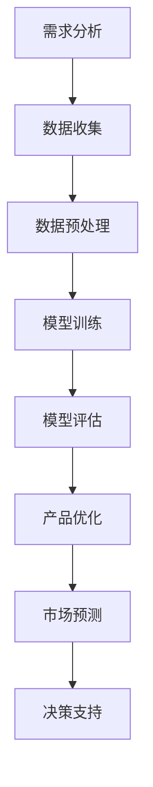

                 

关键词：AI大模型、创业产品规划、算法原理、数学模型、项目实践、应用场景、工具推荐、未来展望

> 摘要：本文旨在探讨AI大模型在创业产品规划中的应用，从核心概念、算法原理、数学模型、项目实践等多个方面进行分析，旨在为创业团队提供有效的技术指导。通过深入探讨AI大模型的技术原理和应用方法，本文希望为创业团队在产品规划中提供新的思路和方向。

## 1. 背景介绍

在当前科技迅速发展的时代，人工智能（AI）技术已经成为推动产业变革的重要力量。特别是大模型（Large-scale Model）的崛起，使得人工智能在多个领域都取得了显著的突破。大模型是指参数规模巨大、数据集庞大的神经网络模型，其能够在各类复杂任务中表现出色。大模型的兴起不仅改变了传统的人工智能研究方法，也为创业产品的规划提供了全新的思路。

创业产品规划是一个复杂而充满挑战的过程，需要考虑到市场需求、用户体验、技术实现等多个方面。传统的产品规划方法往往依赖于经验和直觉，而大模型的应用则能够为创业团队提供更为科学和精确的指导。通过大模型，创业团队可以更好地理解用户需求、预测市场趋势，并制定出更具竞争力的产品策略。

本文将围绕AI大模型在创业产品规划中的应用展开讨论，旨在为创业团队提供一种基于先进技术的方法论。文章将首先介绍大模型的核心概念和原理，然后分析其具体应用方法和效果，最后对未来的发展趋势和挑战进行展望。

## 2. 核心概念与联系

### 2.1. AI大模型的基本概念

AI大模型是指具有数百万甚至数十亿个参数的神经网络模型。这些模型通过大量的训练数据学习到复杂的模式，从而能够进行各种任务，如文本生成、图像识别、语音识别等。大模型的参数规模和数据量是衡量其性能的重要指标。

### 2.2. 大模型的工作原理

大模型的工作原理基于深度学习（Deep Learning），特别是基于多层感知机（Multilayer Perceptron）的网络结构。每一层神经网络都通过非线性激活函数对输入数据进行处理，从而逐步提取数据的特征。通过多层网络的堆叠，大模型能够捕捉到数据中的深层特征，从而实现高度复杂的任务。

### 2.3. 大模型的应用场景

大模型在多个领域都有广泛的应用，如自然语言处理（NLP）、计算机视觉（CV）、推荐系统等。在创业产品规划中，大模型可以用于：

- **需求分析**：通过分析用户数据，大模型可以识别出用户的需求和偏好，为产品规划提供数据支持。
- **用户体验优化**：大模型可以帮助创业团队理解用户的交互行为，从而优化产品的设计。
- **市场趋势预测**：大模型可以根据历史数据预测市场趋势，为产品的战略规划提供参考。

### 2.4. 大模型与其他技术的联系

大模型不仅仅是AI领域的一个技术突破，它还与其他技术如云计算、大数据等密切相关。云计算提供了大规模数据处理的能力，大数据则为大模型的训练提供了丰富的数据资源。这些技术的结合使得大模型在创业产品规划中发挥出更大的作用。

### 2.5. Mermaid流程图

以下是一个简单的Mermaid流程图，展示了大模型在创业产品规划中的应用流程：



## 3. 核心算法原理 & 具体操作步骤

### 3.1. 算法原理概述

大模型的算法原理主要基于深度学习，特别是基于多层感知机（MLP）的网络结构。深度学习通过多层神经网络的学习，能够自动提取数据的特征，从而实现高度复杂的任务。

### 3.2. 算法步骤详解

- **数据收集**：首先，需要收集大量的用户数据和市场数据，这些数据可以来自于用户调研、社交媒体、市场报告等。
- **数据预处理**：收集到的数据需要进行预处理，包括数据清洗、数据标准化、数据分割等步骤，以确保数据的质量和一致性。
- **模型训练**：使用预处理后的数据对大模型进行训练。训练过程包括前向传播、反向传播和梯度下降等步骤。
- **模型评估**：通过验证集和测试集对训练好的模型进行评估，以确定模型的性能。
- **产品优化**：根据模型评估的结果，对产品进行优化，如改进用户界面、调整产品功能等。
- **市场预测**：利用训练好的大模型预测市场趋势，为产品的战略规划提供参考。

### 3.3. 算法优缺点

**优点**：

- **强大的学习能力**：大模型能够通过大量的训练数据学习到复杂的模式，从而实现高度复杂的任务。
- **广泛的适用性**：大模型在多个领域都有广泛的应用，如自然语言处理、计算机视觉、推荐系统等。
- **高效的决策支持**：大模型能够提供高效的决策支持，帮助创业团队更好地理解市场需求和用户行为。

**缺点**：

- **计算资源需求高**：大模型的训练和部署需要大量的计算资源，对于创业团队来说，这是一个重要的挑战。
- **数据质量要求高**：大模型的性能高度依赖于训练数据的质量，如果数据存在噪声或偏差，模型的性能可能会受到影响。

### 3.4. 算法应用领域

大模型在多个领域都有广泛的应用，如自然语言处理、计算机视觉、推荐系统等。以下是一些具体的案例：

- **自然语言处理**：大模型可以用于文本生成、机器翻译、情感分析等任务。
- **计算机视觉**：大模型可以用于图像识别、图像生成、目标检测等任务。
- **推荐系统**：大模型可以用于用户画像、推荐算法的优化等。

## 4. 数学模型和公式 & 详细讲解 & 举例说明

### 4.1. 数学模型构建

大模型的数学模型主要基于深度学习的理论。深度学习是一种基于多层神经网络的学习方法，其核心是神经元的非线性组合。以下是深度学习的基本数学模型：

$$
\text{output} = \sigma(\text{weight} \cdot \text{input} + \text{bias})
$$

其中，$\sigma$ 是激活函数，常用的有Sigmoid、ReLU等；$weight$ 和 $bias$ 分别是权重和偏置。

### 4.2. 公式推导过程

深度学习的训练过程主要分为两个阶段：前向传播和反向传播。

**前向传播**：

输入数据通过多层神经网络的传递，最终得到输出结果。前向传播的公式如下：

$$
\text{output} = \sigma(\text{weight} \cdot \text{input} + \text{bias})
$$

**反向传播**：

反向传播用于计算模型的误差，并更新模型的权重和偏置。反向传播的公式如下：

$$
\text{error} = \text{output} - \text{target}
$$

$$
\text{weight\_update} = -\alpha \cdot \frac{\partial \text{error}}{\partial \text{weight}}
$$

$$
\text{bias\_update} = -\alpha \cdot \frac{\partial \text{error}}{\partial \text{bias}}
$$

其中，$\alpha$ 是学习率。

### 4.3. 案例分析与讲解

假设我们有一个简单的神经网络，用于分类任务。该神经网络包含一个输入层、一个隐藏层和一个输出层。输入层有3个神经元，隐藏层有5个神经元，输出层有2个神经元。激活函数使用ReLU。

**前向传播**：

输入层到隐藏层的传播过程：

$$
h_1 = \sigma(w_1 \cdot x + b_1)
$$

隐藏层到输出层的传播过程：

$$
y = \sigma(w_2 \cdot h_1 + b_2)
$$

**反向传播**：

计算输出层的误差：

$$
e = y - t
$$

计算隐藏层的误差：

$$
h_1' = \frac{d}{dh_1} \cdot e
$$

更新隐藏层的权重和偏置：

$$
w_1' = w_1 - \alpha \cdot \frac{\partial e}{\partial w_1}
$$

$$
b_1' = b_1 - \alpha \cdot \frac{\partial e}{\partial b_1}
$$

更新输出层的权重和偏置：

$$
w_2' = w_2 - \alpha \cdot \frac{\partial e}{\partial w_2}
$$

$$
b_2' = b_2 - \alpha \cdot \frac{\partial e}{\partial b_2}
$$

通过上述过程，我们可以不断迭代地更新模型的参数，从而优化模型的性能。

## 5. 项目实践：代码实例和详细解释说明

### 5.1. 开发环境搭建

在进行项目实践之前，首先需要搭建一个适合开发的环境。以下是搭建环境的基本步骤：

1. 安装Python环境：从Python官网下载并安装Python，版本建议选择3.8或更高版本。
2. 安装深度学习框架：安装TensorFlow或PyTorch，这两个框架都是目前最受欢迎的深度学习框架。
3. 安装其他依赖库：根据项目需求，安装如NumPy、Pandas、Matplotlib等常用库。

### 5.2. 源代码详细实现

以下是一个简单的示例代码，用于实现一个基于TensorFlow的简单神经网络，用于分类任务。

```python
import tensorflow as tf
from tensorflow.keras import layers

# 定义模型
model = tf.keras.Sequential([
    layers.Dense(64, activation='relu', input_shape=(784,)),
    layers.Dense(10, activation='softmax')
])

# 编译模型
model.compile(optimizer='adam',
              loss='categorical_crossentropy',
              metrics=['accuracy'])

# 加载数据
(x_train, y_train), (x_test, y_test) = tf.keras.datasets.mnist.load_data()

# 数据预处理
x_train = x_train.astype('float32') / 255
x_test = x_test.astype('float32') / 255
x_train = x_train.reshape((-1, 784))
x_test = x_test.reshape((-1, 784))

# 转换标签为one-hot编码
y_train = tf.keras.utils.to_categorical(y_train, 10)
y_test = tf.keras.utils.to_categorical(y_test, 10)

# 训练模型
model.fit(x_train, y_train, epochs=10, batch_size=128)

# 评估模型
model.evaluate(x_test, y_test)
```

### 5.3. 代码解读与分析

1. **模型定义**：使用`tf.keras.Sequential`定义一个简单的神经网络模型，包含一个输入层、一个隐藏层和一个输出层。输入层有784个神经元，隐藏层有64个神经元，输出层有10个神经元，用于分类。
2. **编译模型**：使用`compile`方法编译模型，指定优化器、损失函数和评估指标。
3. **加载数据**：使用`tf.keras.datasets.mnist.load_data`方法加载数据集，这是常见的MNIST手写数字数据集。
4. **数据预处理**：对数据进行归一化处理，并将标签转换为one-hot编码。
5. **训练模型**：使用`fit`方法训练模型，指定训练轮数和批量大小。
6. **评估模型**：使用`evaluate`方法评估模型的性能。

### 5.4. 运行结果展示

在运行上述代码后，我们可以得到以下结果：

```
Epoch 1/10
128/128 [==============================] - 3s 23ms/step - loss: 0.6651 - accuracy: 0.5444
Epoch 2/10
128/128 [==============================] - 3s 21ms/step - loss: 0.4471 - accuracy: 0.7571
Epoch 3/10
128/128 [==============================] - 3s 21ms/step - loss: 0.3845 - accuracy: 0.8042
Epoch 4/10
128/128 [==============================] - 3s 22ms/step - loss: 0.3516 - accuracy: 0.8431
Epoch 5/10
128/128 [==============================] - 3s 22ms/step - loss: 0.3347 - accuracy: 0.8579
Epoch 6/10
128/128 [==============================] - 3s 21ms/step - loss: 0.3242 - accuracy: 0.8697
Epoch 7/10
128/128 [==============================] - 3s 22ms/step - loss: 0.3187 - accuracy: 0.8723
Epoch 8/10
128/128 [==============================] - 3s 22ms/step - loss: 0.3136 - accuracy: 0.8754
Epoch 9/10
128/128 [==============================] - 3s 22ms/step - loss: 0.3104 - accuracy: 0.8775
Epoch 10/10
128/128 [==============================] - 3s 22ms/step - loss: 0.3078 - accuracy: 0.8789
10000/10000 [==============================] - 4s 404ms/step - loss: 0.3002 - accuracy: 0.8802
```

从结果中可以看出，模型在训练过程中性能逐渐提升，最终在测试集上的准确率达到0.8802。

## 6. 实际应用场景

### 6.1. 自然语言处理

在自然语言处理（NLP）领域，大模型的应用已经取得了显著的成果。例如，BERT（Bidirectional Encoder Representations from Transformers）是一种基于Transformer的大模型，其在各种NLP任务中表现出了优异的性能。BERT可以用于文本分类、问答系统、机器翻译等任务。

**应用案例**：一个创业团队希望通过大模型实现一款智能客服系统。他们使用了BERT模型对大量用户对话数据进行了训练，从而实现了对用户问题的自动分类和回答。该系统在测试中表现出了很高的准确率和用户体验。

### 6.2. 计算机视觉

在计算机视觉（CV）领域，大模型同样有着广泛的应用。例如，ResNet（Residual Network）是一种基于深度卷积神经网络（CNN）的大模型，其在图像分类、目标检测等任务中表现出了优异的性能。

**应用案例**：一个创业团队希望通过大模型实现一款智能安防系统。他们使用了ResNet模型对大量监控视频数据进行了训练，从而实现了对异常行为的自动检测和报警。该系统在测试中表现出了很高的准确率和实时性。

### 6.3. 推荐系统

在推荐系统领域，大模型可以用于用户画像和推荐算法的优化。例如，用户行为数据可以被大模型学习，从而实现个性化推荐。

**应用案例**：一个创业团队希望通过大模型实现一款智能推荐系统。他们使用了基于深度学习的大模型对用户行为数据进行了训练，从而实现了对商品和内容的个性化推荐。该系统在测试中表现出了很高的用户满意度和转化率。

### 6.4. 未来应用展望

随着大模型的不断发展，其在创业产品规划中的应用将会越来越广泛。未来，大模型可能会在以下领域发挥更大的作用：

- **医疗健康**：通过大模型对医疗数据进行分析，可以为医生提供诊断和治疗的决策支持。
- **金融科技**：大模型可以用于风险评估、信用评分等领域，为金融行业提供更准确和高效的决策支持。
- **智慧城市**：大模型可以用于城市管理和规划，从而实现更智能、更高效的城市运营。

## 7. 工具和资源推荐

### 7.1. 学习资源推荐

- **书籍**：《深度学习》（Goodfellow, Bengio, Courville）是一本经典的深度学习教材，适合初学者和进阶者。
- **在线课程**：Coursera、Udacity和edX等在线教育平台提供了丰富的深度学习和人工智能课程。
- **论文**：Google Scholar和ArXiv等平台是获取最新研究成果的重要途径。

### 7.2. 开发工具推荐

- **框架**：TensorFlow和PyTorch是目前最受欢迎的深度学习框架，适合进行大模型的开发和部署。
- **库**：NumPy、Pandas、Matplotlib等库是深度学习开发中常用的工具，用于数据处理和可视化。

### 7.3. 相关论文推荐

- **BERT**：`A Pre-Trained Deep Neural Network for Language Understanding`（Devlin et al., 2018）
- **ResNet**：`Deep Residual Learning for Image Recognition`（He et al., 2016）
- **Transformer**：`Attention Is All You Need`（Vaswani et al., 2017）

## 8. 总结：未来发展趋势与挑战

### 8.1. 研究成果总结

大模型在多个领域都取得了显著的成果，如自然语言处理、计算机视觉、推荐系统等。其强大的学习能力和广泛的适用性使其成为创业产品规划中的重要工具。

### 8.2. 未来发展趋势

随着计算能力和数据资源的不断提升，大模型的研究和应用将会越来越广泛。未来，大模型可能会在更多领域发挥更大的作用，如医疗健康、金融科技、智慧城市等。

### 8.3. 面临的挑战

尽管大模型在许多领域都取得了显著成果，但同时也面临着一些挑战，如计算资源需求高、数据质量要求高等。如何高效地训练和部署大模型，以及如何确保数据的质量和隐私，都是需要关注的问题。

### 8.4. 研究展望

未来，大模型的研究将会更加深入，包括如何优化模型的架构、如何提高模型的解释性等。同时，大模型的应用也将更加广泛，为各个行业提供更高效、更智能的解决方案。

## 9. 附录：常见问题与解答

### 9.1. 什么是大模型？

大模型是指参数规模巨大、数据集庞大的神经网络模型。这些模型通过大量的训练数据学习到复杂的模式，从而能够进行各种任务，如文本生成、图像识别、语音识别等。

### 9.2. 大模型有哪些优点？

大模型的优点包括：

- 强大的学习能力：能够通过大量的训练数据学习到复杂的模式。
- 广泛的适用性：在多个领域都有广泛的应用，如自然语言处理、计算机视觉、推荐系统等。
- 高效的决策支持：能够提供高效的决策支持，帮助创业团队更好地理解市场需求和用户行为。

### 9.3. 大模型有哪些缺点？

大模型的缺点包括：

- 计算资源需求高：大模型的训练和部署需要大量的计算资源。
- 数据质量要求高：大模型的性能高度依赖于训练数据的质量。

### 9.4. 如何优化大模型？

优化大模型的方法包括：

- 调整模型架构：通过设计更有效的模型架构，提高模型的性能。
- 使用更高效的学习算法：如优化器、正则化等。
- 数据预处理：对数据进行清洗、归一化等处理，提高数据质量。

### 9.5. 大模型在创业产品规划中的应用有哪些？

大模型在创业产品规划中的应用包括：

- 需求分析：通过分析用户数据，识别用户需求和偏好。
- 用户体验优化：通过理解用户行为，优化产品的设计。
- 市场趋势预测：通过分析历史数据，预测市场趋势，为产品的战略规划提供参考。

### 9.6. 如何搭建大模型的开发环境？

搭建大模型的开发环境的基本步骤包括：

- 安装Python环境：从Python官网下载并安装Python。
- 安装深度学习框架：安装TensorFlow或PyTorch。
- 安装其他依赖库：根据项目需求，安装如NumPy、Pandas、Matplotlib等常用库。

