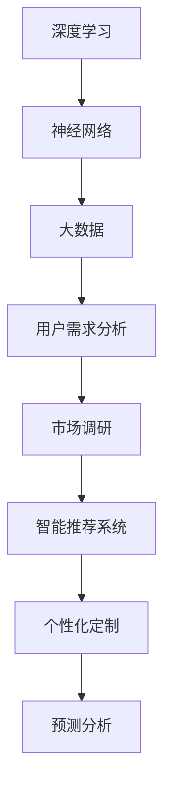

                 

关键词：AI 大模型，创业产品设计，趋势，技术，应用场景，未来展望

> 摘要：本文将深入探讨 AI 大模型在创业产品设计中的趋势。随着 AI 技术的迅速发展，大模型已经成为创业设计的重要工具。本文将分析大模型的核心概念、算法原理、数学模型以及实际应用，为创业者提供有价值的参考。

## 1. 背景介绍

### AI 大模型的发展

人工智能（AI）作为现代科技的前沿领域，近年来取得了巨大的进步。尤其是深度学习技术的突破，使得 AI 大模型成为可能。大模型，顾名思义，是指具有海量参数和复杂结构的 AI 模型。这些模型能够通过自主学习大量数据，实现对复杂任务的精准预测和决策。

### 创业产品设计的重要性

创业产品设计是创业过程中至关重要的一环。一个成功的创业产品不仅需要满足用户需求，还需要具备良好的用户体验和可持续的商业模式。随着市场环境的不断变化，创业者需要具备敏锐的市场洞察力和快速响应的能力。AI 大模型在这一过程中提供了强大的支持。

### AI 大模型在创业设计中的应用

AI 大模型在创业产品设计中的应用范围广泛。例如，通过自然语言处理技术，大模型可以帮助创业者进行市场调研和用户分析，从而制定更有针对性的产品策略。此外，大模型还可以用于智能推荐系统、个性化定制、预测分析等领域，为创业者提供创新的解决方案。

## 2. 核心概念与联系

### 核心概念

- **深度学习（Deep Learning）**：深度学习是一种基于多层神经网络的人工智能算法，它能够通过学习大量数据自动提取特征，并用于复杂任务。
- **神经网络（Neural Network）**：神经网络是深度学习的基础，由大量模拟神经元功能的节点组成，通过调整节点间的权重来实现数据的传递和处理。
- **大数据（Big Data）**：大数据是指无法用传统数据库工具进行有效处理的数据集合，通常具有海量、多样性和高速等特征。

### Mermaid 流程图



### 核心联系

AI 大模型在创业产品设计中的应用，实质上是将深度学习、神经网络和大数据等技术结合起来，实现对用户需求、市场趋势和商业策略的深入分析和预测。

## 3. 核心算法原理 & 具体操作步骤

### 3.1 算法原理概述

AI 大模型的算法原理主要基于深度学习和神经网络。通过训练大量数据，神经网络能够自动提取特征，并形成复杂的非线性映射。这种映射能力使得大模型能够应对各种复杂任务。

### 3.2 算法步骤详解

1. **数据收集与预处理**：收集相关数据，并进行清洗和预处理，以确保数据的质量和一致性。
2. **模型构建**：设计并构建神经网络结构，通常包括输入层、隐藏层和输出层。
3. **模型训练**：使用训练数据对模型进行训练，通过不断调整网络权重，使模型能够准确预测和决策。
4. **模型评估与优化**：使用验证数据对模型进行评估，并根据评估结果对模型进行优化。

### 3.3 算法优缺点

- **优点**：AI 大模型具有强大的学习能力和泛化能力，能够处理复杂的任务，提高决策的准确性。
- **缺点**：大模型训练过程复杂，需要大量的计算资源和时间；同时，模型的解释性较低，难以理解其内部工作机制。

### 3.4 算法应用领域

AI 大模型在创业设计中的应用领域广泛，包括但不限于以下方面：

- **市场调研**：通过分析用户行为数据，预测市场趋势和用户需求。
- **用户分析**：深入了解用户特征和行为，为产品设计和推广提供指导。
- **智能推荐系统**：根据用户偏好和历史行为，提供个性化的产品推荐。
- **预测分析**：预测未来的市场变化和用户行为，为创业策略提供支持。

## 4. 数学模型和公式

### 4.1 数学模型构建

AI 大模型的数学模型基于多层感知器（MLP）或卷积神经网络（CNN）等结构。以下是一个简化的多层感知器模型：

$$
Z = \sigma(W_2 \cdot \sigma(W_1 \cdot X))
$$

其中，$X$ 为输入数据，$W_1$ 和 $W_2$ 分别为输入层和隐藏层的权重矩阵，$\sigma$ 为激活函数，通常采用 sigmoid 或 ReLU 函数。

### 4.2 公式推导过程

多层感知器的公式推导基于链式法则。假设 $L$ 层神经网络的输出为 $Z_L$，则前向传播的推导过程如下：

$$
\frac{\partial Z_L}{\partial Z_{L-1}} = \frac{\partial \sigma(Z_{L-1})}{\partial Z_{L-1}} \cdot \frac{\partial W_{L-1} \cdot Z_{L-1}}{\partial Z_{L-1}}
$$

其中，$\sigma$ 为激活函数的导数。

### 4.3 案例分析与讲解

以下是一个简单的例子，假设我们使用多层感知器模型对房价进行预测。输入层为房屋面积、房龄和地理位置等特征，隐藏层为 10 个神经元，输出层为房价。

1. **数据收集与预处理**：收集大量房屋交易数据，并对数据进行清洗和标准化处理。
2. **模型构建**：设计一个具有 3 层的多层感知器模型，设置适当的神经元数量和激活函数。
3. **模型训练**：使用训练数据对模型进行训练，通过反向传播算法不断调整权重。
4. **模型评估**：使用验证数据对模型进行评估，计算预测误差，并进行模型优化。

通过这个案例，我们可以看到数学模型在 AI 大模型中的应用，以及如何通过公式推导和案例分析来理解模型的工作原理。

## 5. 项目实践：代码实例和详细解释说明

### 5.1 开发环境搭建

1. **Python**：安装 Python 3.7 及以上版本。
2. **TensorFlow**：安装 TensorFlow 2.5 及以上版本。
3. **数据集**：使用公开的房价数据集，例如 California House Prices Dataset。

### 5.2 源代码详细实现

以下是一个简单的房价预测模型的代码实现：

```python
import tensorflow as tf
import pandas as pd
from sklearn.model_selection import train_test_split

# 加载数据集
data = pd.read_csv('california_housing.csv')
X = data.drop('median_house_value', axis=1)
y = data['median_house_value']

# 数据预处理
X_train, X_test, y_train, y_test = train_test_split(X, y, test_size=0.2, random_state=42)

# 构建模型
model = tf.keras.Sequential([
    tf.keras.layers.Dense(10, activation='relu', input_shape=(X_train.shape[1],)),
    tf.keras.layers.Dense(1)
])

# 编译模型
model.compile(optimizer='adam', loss='mse')

# 训练模型
model.fit(X_train, y_train, epochs=10, batch_size=32, validation_split=0.1)

# 评估模型
loss = model.evaluate(X_test, y_test)
print(f'MSE: {loss}')
```

### 5.3 代码解读与分析

1. **数据加载与预处理**：使用 Pandas 读取数据集，并对数据进行分

