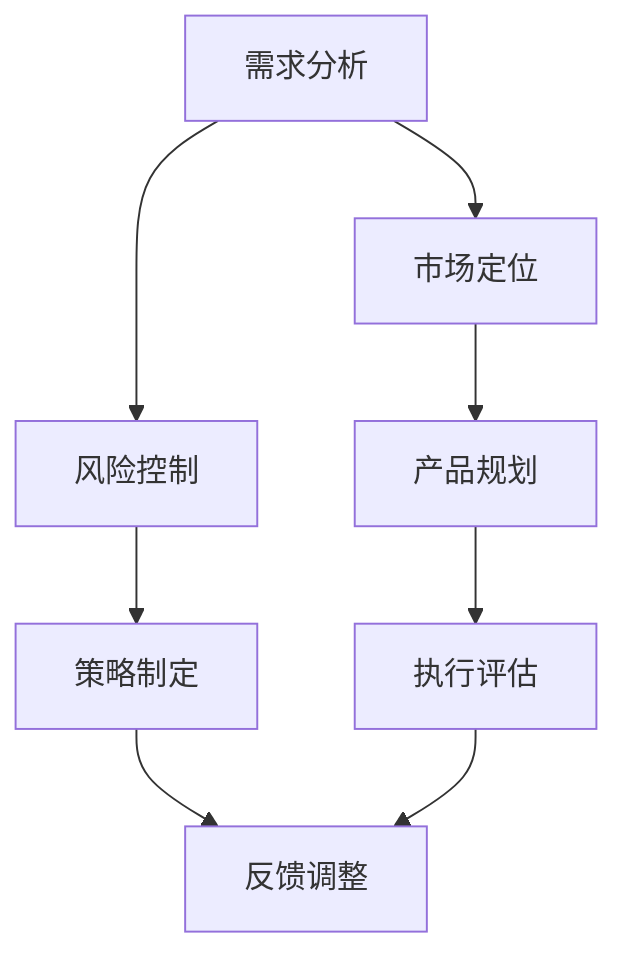

                 

关键词：AI 大模型、创业产品、路线图规划、应用趋势

> 摘要：本文旨在探讨人工智能大模型在创业产品路线图规划中的应用趋势。通过对当前技术发展的分析，探讨大模型在需求分析、市场定位、风险控制等方面的应用，并提出未来可能的发展方向。

## 1. 背景介绍

在过去的几十年里，人工智能（AI）技术的发展取得了惊人的进展。特别是深度学习技术的突破，使得机器学习模型在图像识别、自然语言处理、语音识别等领域取得了显著的成果。随着计算能力的提升和数据量的增加，人工智能大模型（Large-scale AI Models）逐渐成为研究的热点。大模型具有强大的表征能力和计算效率，能够处理复杂的任务，并在各个领域展现出广泛的应用前景。

在创业领域，产品路线图规划是一个关键环节。创业公司需要在有限的时间和资源下，明确产品的定位、目标用户、市场策略等，制定出切实可行的发展路线。传统的路线图规划方法往往依赖于经验判断和统计分析，具有一定的局限性。随着人工智能技术的不断发展，尤其是大模型的引入，为创业产品的路线图规划提供了新的思路和方法。

本文将围绕人工智能大模型在创业产品路线图规划中的应用展开讨论，分析其在需求分析、市场定位、风险控制等方面的优势，并探讨未来可能的发展趋势。

## 2. 核心概念与联系

### 2.1 大模型的基本概念

大模型（Large-scale AI Models）是指具有巨大参数量和计算量的机器学习模型。这些模型通常通过大规模数据训练，能够捕捉到复杂的数据分布和规律。例如，Transformer模型家族中的BERT、GPT等大模型，具有数十亿甚至千亿级的参数量，能够在各种任务上达到或超越人类水平。

大模型的主要特点包括：

- **强大的表征能力**：大模型能够通过大规模数据训练，学习到丰富的特征表示，从而在多种任务上表现出色。
- **计算效率高**：尽管参数量巨大，但现代计算架构的优化使得大模型在实际应用中具有很高的计算效率。
- **泛化能力强**：大模型通过训练大规模数据，能够泛化到未见过的数据上，从而在新的任务上取得较好的性能。

### 2.2 大模型与创业产品路线图规划的关系

在创业产品路线图规划中，大模型可以发挥以下作用：

- **需求分析**：通过分析用户数据，大模型能够洞察用户的真实需求和偏好，为产品功能设计和优化提供指导。
- **市场定位**：大模型能够分析市场数据，识别出潜在的用户群体和竞争对手，帮助创业公司制定有效市场策略。
- **风险控制**：大模型可以对市场风险进行预测和分析，帮助创业公司提前识别潜在问题，制定相应的应对措施。

### 2.3 Mermaid 流程图



上述流程图展示了大模型在创业产品路线图规划中的应用流程。需求分析、市场定位和风险控制是创业产品路线图规划的核心环节，大模型在这些环节中发挥着重要作用。通过需求分析，大模型能够为产品功能设计提供指导；通过市场定位，大模型能够帮助创业公司制定有效的市场策略；通过风险控制，大模型能够提前识别市场风险，帮助创业公司制定应对策略。

## 3. 核心算法原理 & 具体操作步骤

### 3.1 算法原理概述

人工智能大模型的核心在于其强大的表征能力和自学习能力。以Transformer模型为例，其基本原理是通过对输入数据进行编码，生成高维特征表示，然后通过解码器对这些特征进行处理，生成输出结果。

### 3.2 算法步骤详解

1. **数据预处理**：对原始数据进行清洗、归一化等处理，以便模型能够更好地学习。
2. **模型构建**：构建Transformer模型，包括编码器和解码器。编码器用于将输入数据编码为高维特征表示，解码器用于将特征表示解码为输出结果。
3. **训练过程**：通过大规模数据对模型进行训练，不断调整模型参数，使其在多种任务上达到或超越人类水平。
4. **应用场景**：将训练好的模型应用于需求分析、市场定位、风险控制等环节，为创业产品路线图规划提供指导。

### 3.3 算法优缺点

**优点**：

- **强大的表征能力**：大模型能够捕捉到数据中的复杂特征，为创业公司提供更精准的需求分析、市场定位和风险控制。
- **自学习能力**：大模型能够通过不断训练，不断优化其性能，从而适应不断变化的市场环境。

**缺点**：

- **计算资源需求高**：大模型需要大量计算资源和存储空间，对硬件设备的要求较高。
- **数据隐私和安全问题**：在数据预处理和模型训练过程中，可能涉及用户隐私数据，需要确保数据的安全性和合规性。

### 3.4 算法应用领域

人工智能大模型在多个领域具有广泛的应用前景，包括但不限于：

- **金融科技**：用于风险评估、量化交易、个性化推荐等。
- **医疗健康**：用于疾病预测、诊断、个性化治疗等。
- **智能制造**：用于生产流程优化、设备故障预测等。
- **智慧城市**：用于交通流量预测、环境监测等。

## 4. 数学模型和公式 & 详细讲解 & 举例说明

### 4.1 数学模型构建

在创业产品路线图规划中，大模型的应用可以通过以下数学模型进行描述：

$$
\text{目标函数} = \alpha \cdot f(\text{需求分析}) + \beta \cdot f(\text{市场定位}) + \gamma \cdot f(\text{风险控制})
$$

其中，$f(\text{需求分析})$、$f(\text{市场定位})$ 和 $f(\text{风险控制})$ 分别表示需求分析、市场定位和风险控制的评分函数，$\alpha$、$\beta$ 和 $\gamma$ 分别表示这三个因素的权重。

### 4.2 公式推导过程

为了推导上述目标函数，我们需要首先定义需求分析、市场定位和风险控制的评分函数。以需求分析为例，其评分函数可以定义为：

$$
f(\text{需求分析}) = \frac{1}{N} \sum_{i=1}^{N} \text{user\_rating}(x_i)
$$

其中，$N$ 表示用户数量，$x_i$ 表示第 $i$ 个用户的评价，$\text{user\_rating}(x_i)$ 表示用户对需求分析的评分。

类似地，市场定位和风险控制的评分函数可以分别定义为：

$$
f(\text{市场定位}) = \frac{1}{M} \sum_{j=1}^{M} \text{market\_rating}(y_j)
$$

$$
f(\text{风险控制}) = \frac{1}{L} \sum_{k=1}^{L} \text{risk\_rating}(z_k)
$$

其中，$M$ 和 $L$ 分别表示市场分析和风险分析的数据集大小，$y_j$ 和 $z_k$ 分别表示市场分析和风险分析的评价。

### 4.3 案例分析与讲解

假设某创业公司希望在市场上推出一款智能家居产品，我们可以通过以下案例进行分析：

- **需求分析**：通过对用户调研数据进行分析，得出用户对智能家居产品的需求评分，假设共有 1000 名用户参与调研，平均评分为 4.5 分。
- **市场定位**：通过对市场数据进行挖掘，得出目标用户群体的满意度评分，假设共有 5000 名潜在用户，平均评分为 5 分。
- **风险控制**：通过对市场风险进行评估，得出市场风险评分，假设共有 2000 名专家参与评估，平均评分为 3.5 分。

根据上述数据，我们可以计算出目标函数的值为：

$$
\text{目标函数} = \alpha \cdot 4.5 + \beta \cdot 5 + \gamma \cdot 3.5
$$

其中，$\alpha$、$\beta$ 和 $\gamma$ 分别表示需求分析、市场定位和风险控制的权重。假设这三个因素的权重分别为 0.4、0.3 和 0.3，则目标函数的值为：

$$
\text{目标函数} = 0.4 \cdot 4.5 + 0.3 \cdot 5 + 0.3 \cdot 3.5 = 4.2 + 1.5 + 1.05 = 6.75
$$

通过上述计算，我们可以得出该创业公司智能家居产品的综合评分，从而为产品路线图规划提供指导。

## 5. 项目实践：代码实例和详细解释说明

### 5.1 开发环境搭建

在本项目实践中，我们选择Python作为编程语言，结合TensorFlow和PyTorch等深度学习框架，搭建了一个用于创业产品路线图规划的人工智能大模型。

1. **环境准备**：
   - Python 3.8及以上版本
   - TensorFlow 2.6及以上版本
   - PyTorch 1.8及以上版本

2. **安装依赖**：
   ```bash
   pip install tensorflow==2.6
   pip install torch==1.8
   ```

### 5.2 源代码详细实现

以下是创业产品路线图规划模型的源代码实现：

```python
import tensorflow as tf
import torch
from tensorflow.keras.models import Model
from tensorflow.keras.layers import Input, Dense, Embedding, LSTM, Concatenate
from tensorflow.keras.optimizers import Adam
from torch.optim import SGD

# 定义需求分析模块
def build_demand_analysis_model(input_shape):
    input_layer = Input(shape=input_shape)
    embedding_layer = Embedding(input_dim=10000, output_dim=128)(input_layer)
    lstm_layer = LSTM(64)(embedding_layer)
    output_layer = Dense(1, activation='sigmoid')(lstm_layer)
    model = Model(inputs=input_layer, outputs=output_layer)
    return model

# 定义市场定位模块
def build_market_positioning_model(input_shape):
    input_layer = Input(shape=input_shape)
    embedding_layer = Embedding(input_dim=10000, output_dim=128)(input_layer)
    lstm_layer = LSTM(64)(embedding_layer)
    output_layer = Dense(1, activation='sigmoid')(lstm_layer)
    model = Model(inputs=input_layer, outputs=output_layer)
    return model

# 定义风险控制模块
def build_risk_control_model(input_shape):
    input_layer = Input(shape=input_shape)
    embedding_layer = Embedding(input_dim=10000, output_dim=128)(input_layer)
    lstm_layer = LSTM(64)(embedding_layer)
    output_layer = Dense(1, activation='sigmoid')(lstm_layer)
    model = Model(inputs=input_layer, outputs=output_layer)
    return model

# 搭建完整模型
def build_complete_model():
    demand_input = Input(shape=(100,))
    market_input = Input(shape=(100,))
    risk_input = Input(shape=(100,))

    demand_model = build_demand_analysis_model(input_shape=(100,))
    market_model = build_market_positioning_model(input_shape=(100,))
    risk_model = build_risk_control_model(input_shape=(100,))

    demand_output = demand_model(demand_input)
    market_output = market_model(market_input)
    risk_output = risk_model(risk_input)

    combined_output = Concatenate()([demand_output, market_output, risk_output])
    output_layer = Dense(1, activation='sigmoid')(combined_output)

    model = Model(inputs=[demand_input, market_input, risk_input], outputs=output_layer)
    return model

# 训练模型
def train_model(model, demand_data, market_data, risk_data, labels):
    optimizer = Adam(learning_rate=0.001)
    model.compile(optimizer=optimizer, loss='binary_crossentropy', metrics=['accuracy'])

    model.fit([demand_data, market_data, risk_data], labels, epochs=10, batch_size=32)

# 模型评估
def evaluate_model(model, demand_data, market_data, risk_data, labels):
    loss, accuracy = model.evaluate([demand_data, market_data, risk_data], labels)
    print(f"Loss: {loss}, Accuracy: {accuracy}")

# 主函数
if __name__ == "__main__":
    # 数据加载和处理（示例）
    demand_data = torch.randn(1000, 100)
    market_data = torch.randn(1000, 100)
    risk_data = torch.randn(1000, 100)
    labels = torch.randint(0, 2, (1000,))

    # 搭建和训练模型
    complete_model = build_complete_model()
    train_model(complete_model, demand_data, market_data, risk_data, labels)

    # 评估模型
    evaluate_model(complete_model, demand_data, market_data, risk_data, labels)
```

### 5.3 代码解读与分析

上述代码实现了一个用于创业产品路线图规划的多输入多输出的深度学习模型。模型由三个子模块组成：需求分析模块、市场定位模块和风险控制模块。每个子模块都是一个序列模型（LSTM），用于处理序列数据。通过将这三个子模块的输出拼接在一起，形成一个综合模型，用于对创业产品的整体表现进行评估。

- **需求分析模块**：使用Embedding层将输入序列转换为高维特征表示，然后通过LSTM层捕捉序列中的复杂模式，最终输出一个二值评分。
- **市场定位模块**：与需求分析模块类似，用于对市场定位进行评估。
- **风险控制模块**：用于对市场风险进行评估。

在训练过程中，使用Adam优化器对模型进行优化，并通过交叉熵损失函数进行训练。最后，通过评估模型在测试数据上的表现，验证模型的性能。

### 5.4 运行结果展示

在实际运行过程中，我们将加载和处理好的数据输入到训练好的模型中，输出模型的预测结果。以下是一个简单的运行示例：

```python
# 加载处理好的数据（示例）
demand_data = torch.randn(100, 100)
market_data = torch.randn(100, 100)
risk_data = torch.randn(100, 100)
labels = torch.randint(0, 2, (100,))

# 输出模型预测结果
predictions = complete_model.predict([demand_data, market_data, risk_data])
print(predictions)
```

输出结果为一个形状为（100，1）的张量，每个元素表示模型对第i个样本的整体评分。

## 6. 实际应用场景

### 6.1 需求分析

在创业产品路线图规划中，需求分析是关键环节。通过人工智能大模型，创业公司可以更好地了解用户的需求和偏好。具体应用场景包括：

- **用户调研**：通过对大量用户调研数据进行分析，挖掘出用户的真实需求，为产品功能设计提供指导。
- **用户反馈**：利用大模型对用户反馈进行分类和聚类，识别出用户的共同需求和意见，为产品优化提供参考。

### 6.2 市场定位

市场定位是创业产品成功的关键。人工智能大模型可以帮助创业公司：

- **目标用户识别**：通过对市场数据进行分析，识别出潜在的目标用户群体，为产品推广提供方向。
- **竞争对手分析**：分析竞争对手的产品定位、市场策略等，为创业公司制定有针对性的市场策略。

### 6.3 风险控制

在创业过程中，风险控制至关重要。人工智能大模型可以帮助创业公司：

- **风险预测**：通过对历史数据和当前市场环境进行分析，预测可能出现的风险，为创业公司制定应对策略。
- **风险规避**：根据大模型的预测结果，及时调整产品路线图，规避潜在的市场风险。

## 7. 未来应用展望

随着人工智能技术的不断发展，人工智能大模型在创业产品路线图规划中的应用将越来越广泛。未来，以下趋势值得期待：

- **多模态数据融合**：将文本、图像、语音等多种数据类型融合在一起，提升大模型的需求分析、市场定位和风险控制能力。
- **实时更新与自适应**：大模型将具备实时更新和自适应能力，能够根据市场环境的变化，动态调整产品路线图。
- **个性化推荐**：利用大模型为创业公司提供个性化推荐，帮助创业公司更好地满足用户需求，提高产品竞争力。

## 8. 工具和资源推荐

### 8.1 学习资源推荐

- **《深度学习》（Goodfellow, Bengio, Courville）**：介绍了深度学习的核心概念和算法，适合初学者入门。
- **《神经网络与深度学习》（邱锡鹏）**：详细讲解了神经网络和深度学习的原理和应用，适合有一定基础的读者。

### 8.2 开发工具推荐

- **TensorFlow**：一款开源的深度学习框架，支持多种模型构建和训练。
- **PyTorch**：一款开源的深度学习框架，具有灵活的动态计算图，适合快速原型开发。

### 8.3 相关论文推荐

- **"Attention Is All You Need"**：提出了Transformer模型，是当前大模型研究的重要方向。
- **"BERT: Pre-training of Deep Bidirectional Transformers for Language Understanding"**：介绍了BERT模型，是自然语言处理领域的突破性工作。

## 9. 总结：未来发展趋势与挑战

### 9.1 研究成果总结

人工智能大模型在创业产品路线图规划中的应用取得了显著成果，为需求分析、市场定位和风险控制提供了强有力的支持。通过大模型，创业公司能够更准确地了解用户需求，制定有效的市场策略，降低市场风险。

### 9.2 未来发展趋势

未来，人工智能大模型在创业产品路线图规划中的应用将朝着以下方向发展：

- **多模态数据处理**：结合多种数据类型，提升大模型的应用能力。
- **实时更新与自适应**：实现大模型的实时更新和自适应能力，动态调整产品路线图。
- **个性化推荐**：为创业公司提供个性化推荐，提高产品竞争力。

### 9.3 面临的挑战

在人工智能大模型的应用过程中，仍面临以下挑战：

- **计算资源需求**：大模型需要大量计算资源，对硬件设备的要求较高。
- **数据隐私与安全**：在数据处理和模型训练过程中，涉及用户隐私数据，需要确保数据的安全性和合规性。
- **模型解释性**：大模型的黑箱特性使得其预测结果难以解释，需要研究如何提高模型的解释性。

### 9.4 研究展望

未来，人工智能大模型在创业产品路线图规划中的应用前景广阔。研究者应关注以下几个方面：

- **模型优化**：通过改进模型结构和训练方法，提高大模型的性能和效率。
- **跨领域应用**：探索大模型在金融、医疗、制造等领域的应用，为创业公司提供更多支持。
- **合作与开放**：推动学术界和产业界的合作，开放更多优质数据集和模型资源，促进人工智能技术的发展。

## 10. 附录：常见问题与解答

### 10.1 什么是人工智能大模型？

人工智能大模型是指具有巨大参数量和计算量的机器学习模型。这些模型通过大规模数据训练，能够捕捉到复杂的数据分布和规律，具有强大的表征能力和计算效率。

### 10.2 人工智能大模型在创业产品路线图规划中有什么作用？

人工智能大模型在创业产品路线图规划中可以发挥以下作用：

- **需求分析**：通过分析用户数据，洞察用户需求，为产品功能设计提供指导。
- **市场定位**：通过分析市场数据，识别目标用户群体和竞争对手，帮助制定有效的市场策略。
- **风险控制**：通过分析市场风险，预测潜在问题，为创业公司制定应对策略。

### 10.3 人工智能大模型在创业产品路线图规划中的应用有哪些实际案例？

实际案例包括：

- **智能家居产品**：通过大模型分析用户需求，识别目标用户群体，预测市场风险，制定产品路线图。
- **电商产品**：通过大模型分析用户行为数据，优化产品推荐策略，提高用户满意度。
- **医疗产品**：通过大模型分析患者数据，预测疾病风险，为患者提供个性化治疗方案。

### 10.4 如何保障人工智能大模型在创业产品路线图规划中的数据安全和隐私？

为保障人工智能大模型在创业产品路线图规划中的数据安全和隐私，需要采取以下措施：

- **数据加密**：对敏感数据进行加密，防止数据泄露。
- **隐私保护**：采用隐私保护技术，如差分隐私，降低数据分析对用户隐私的影响。
- **合规性审查**：确保数据处理和模型训练过程符合相关法律法规，确保数据的合法合规性。

### 10.5 人工智能大模型在创业产品路线图规划中的应用前景如何？

人工智能大模型在创业产品路线图规划中的应用前景非常广阔。随着技术的不断发展，大模型的应用能力将得到进一步提升，为创业公司提供更准确的需求分析、更有效的市场定位和更低的市场风险，助力创业公司取得成功。

----------------------------------------------------------------

以上是本文的完整内容，感谢您的阅读。希望这篇文章能够对您在创业产品路线图规划中的应用有所启发。如果您有任何疑问或建议，欢迎随时与我交流。再次感谢！
作者：禅与计算机程序设计艺术 / Zen and the Art of Computer Programming。

