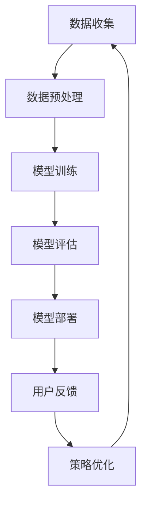

                 

## 摘要

本文旨在探讨人工智能大模型在创业产品运营中的应用，特别是在产品定位、用户获取、内容创造、运营优化等方面的创新策略。随着AI技术的不断进步，大模型在处理大规模数据、自动生成内容、理解用户需求等方面展现出强大的潜力，为创业产品的成功运营提供了新的思路和方法。本文将首先介绍大模型的基本原理，然后深入分析其在创业产品运营中的实际应用，最后对未来发展趋势和挑战进行展望。通过对这些内容的详细探讨，希望能够为创业者提供有益的参考。

## 1. 背景介绍

人工智能（AI）作为计算机科学的一个重要分支，近年来取得了飞速的发展。特别是深度学习（Deep Learning）的兴起，使得AI技术能够在图像识别、自然语言处理、语音识别等领域实现显著的突破。大模型（Large Models）是AI领域的一个重要研究方向，指的是具有数亿至数十亿参数的神经网络模型。这些模型通过在海量数据上训练，能够学习到丰富的特征表示和复杂的依赖关系。

在创业产品运营中，大模型的应用具有重要意义。首先，大模型能够处理和解析大量用户数据，从而帮助企业更准确地了解用户需求和行为模式。其次，大模型在内容生成、推荐系统等方面具有显著优势，可以帮助企业快速生成高质量的内容，提高用户的满意度和粘性。此外，大模型还可以通过优化运营策略，提高产品的市场竞争力。

当前，创业产品的市场竞争愈发激烈，如何脱颖而出成为每一个创业者的核心挑战。传统的运营手段已经难以满足用户日益增长的需求，而AI大模型提供了新的解决方案。通过AI大模型，创业者可以更加精细化地运营产品，提高运营效率，降低运营成本，从而在激烈的市场竞争中占据优势。

## 2. 核心概念与联系

### 2.1 大模型的基本概念

大模型通常是指具有数亿至数十亿参数的神经网络模型，如GPT-3、BERT等。这些模型通过在大量数据上训练，能够自动学习到丰富的特征表示和复杂的依赖关系。大模型的优点包括：

- **强大的学习能力**：能够处理大规模的数据集，学习到复杂的模式。
- **高效的特征提取**：通过深度神经网络，能够自动提取层次化的特征。
- **自适应性强**：可以根据不同的任务和数据集进行优化，具有较强的适应性。

### 2.2 大模型与创业产品运营的联系

大模型在创业产品运营中的应用主要体现在以下几个方面：

- **用户数据分析**：大模型能够处理和分析大量用户数据，帮助创业者了解用户的行为习惯和需求变化，从而更好地制定运营策略。
- **内容生成与推荐**：大模型可以自动生成高质量的内容，如文章、图片、视频等，帮助企业提高内容的多样性和质量。同时，基于用户行为数据，大模型可以推荐个性化的内容，提高用户的满意度和粘性。
- **运营策略优化**：大模型可以通过分析用户行为和反馈，不断优化运营策略，提高产品的市场竞争力。

### 2.3 Mermaid 流程图

以下是一个简单的Mermaid流程图，展示大模型在创业产品运营中的应用流程：



### 2.4 大模型在创业产品运营中的优势与挑战

**优势**：

- **高效的处理能力**：大模型能够快速处理和分析大量数据，提高运营效率。
- **智能的内容生成**：大模型可以自动生成高质量的内容，提高产品的竞争力。
- **个性化的推荐**：大模型可以根据用户行为数据推荐个性化内容，提高用户满意度。

**挑战**：

- **数据隐私**：大模型需要大量用户数据进行训练，如何保护用户隐私成为重要问题。
- **计算资源**：大模型训练和部署需要大量的计算资源，成本较高。
- **模型可解释性**：大模型的决策过程往往缺乏可解释性，难以满足一些对模型透明度要求较高的应用场景。

## 3. 核心算法原理 & 具体操作步骤

### 3.1 算法原理概述

大模型的核心在于深度神经网络（Deep Neural Network，DNN）的架构。DNN由多个层次组成，包括输入层、隐藏层和输出层。每个层次由多个神经元（节点）组成，神经元之间通过权重连接。在训练过程中，DNN通过反向传播算法（Backpropagation）不断调整权重，以最小化损失函数。

具体来说，大模型的训练过程包括以下几个步骤：

1. **数据预处理**：对输入数据进行标准化处理，提高模型的训练效果。
2. **前向传播**：将输入数据传递到模型中，通过前向传播计算输出。
3. **损失计算**：计算模型输出与真实值之间的差距，得到损失值。
4. **反向传播**：通过反向传播算法更新权重，以减少损失值。
5. **迭代优化**：重复前向传播和反向传播的过程，直至满足停止条件。

### 3.2 算法步骤详解

**步骤1：数据预处理**

- **标准化处理**：对输入数据进行归一化或标准化，使其具有相似的尺度，提高模型的训练效果。
- **数据分割**：将数据集分为训练集、验证集和测试集，用于模型训练、验证和评估。

**步骤2：前向传播**

- **输入层到隐藏层**：将输入数据传递到隐藏层，通过激活函数计算每个神经元的输出。
- **隐藏层到输出层**：将隐藏层的输出传递到输出层，计算模型预测结果。

**步骤3：损失计算**

- **均方误差（MSE）**：计算模型输出与真实值之间的均方误差，作为损失函数。
- **交叉熵（Cross-Entropy）**：适用于分类问题，计算模型输出与真实标签之间的交叉熵。

**步骤4：反向传播**

- **误差传播**：从输出层开始，将误差反向传播到隐藏层和输入层。
- **权重更新**：通过梯度下降（Gradient Descent）或其他优化算法更新权重，以减少损失值。

**步骤5：迭代优化**

- **批量训练（Batch Training）**：每次迭代使用整个训练集的数据进行训练。
- **小批量训练（Mini-batch Training）**：每次迭代使用部分训练集的数据进行训练，提高模型的泛化能力。

### 3.3 算法优缺点

**优点**：

- **强大的学习能力**：能够处理大规模数据集，学习到复杂的模式。
- **高效的特征提取**：自动提取层次化的特征，提高模型的性能。
- **自适应性强**：可以根据不同的任务和数据集进行优化，具有较强的适应性。

**缺点**：

- **训练成本高**：需要大量的计算资源和时间进行训练。
- **可解释性差**：模型的决策过程往往缺乏可解释性，难以满足一些对模型透明度要求较高的应用场景。
- **数据需求大**：需要大量的数据用于训练，对数据质量和数量有较高要求。

### 3.4 算法应用领域

大模型在多个领域都有广泛的应用，包括：

- **自然语言处理（NLP）**：用于文本分类、情感分析、机器翻译等任务。
- **计算机视觉（CV）**：用于图像识别、目标检测、图像生成等任务。
- **推荐系统**：用于个性化推荐、商品推荐等任务。
- **金融风控**：用于信用评分、欺诈检测等任务。

## 4. 数学模型和公式 & 详细讲解 & 举例说明

### 4.1 数学模型构建

大模型通常基于深度神经网络（DNN）架构，其数学模型可以表示为：

\[ 
\mathcal{M}(\mathbf{x}; \theta) = \text{激活函数}(\mathbf{W} \cdot \mathbf{h}_{l-1} + b_l) 
\]

其中，\(\mathbf{x}\) 是输入数据，\(\theta\) 包括所有权重 \(\mathbf{W}\) 和偏置 \(b_l\)，激活函数（如ReLU、Sigmoid、Tanh等）用于引入非线性。

### 4.2 公式推导过程

#### 前向传播

1. **输入层到隐藏层**：

\[ 
\mathbf{z}_l = \mathbf{W}_l \cdot \mathbf{h}_{l-1} + b_l 
\]

\[ 
\mathbf{h}_l = \text{激活函数}(\mathbf{z}_l) 
\]

2. **隐藏层到输出层**：

\[ 
\mathbf{z}_L = \mathbf{W}_L \cdot \mathbf{h}_{L-1} + b_L 
\]

\[ 
\mathbf{y} = \text{激活函数}(\mathbf{z}_L) 
\]

#### 损失计算

1. **均方误差（MSE）**：

\[ 
J(\theta) = \frac{1}{m} \sum_{i=1}^{m} (\hat{y}_i - y_i)^2 
\]

2. **交叉熵（Cross-Entropy）**：

\[ 
J(\theta) = -\frac{1}{m} \sum_{i=1}^{m} \sum_{j=1}^{n} y_{ij} \log \hat{y}_{ij} 
\]

#### 反向传播

1. **输出层误差**：

\[ 
\delta_L = \text{激活函数}'(\mathbf{z}_L) \cdot (\mathbf{y} - \hat{y}) 
\]

2. **隐藏层误差**：

\[ 
\delta_l = \text{激活函数}'(\mathbf{z}_l) \cdot (\mathbf{W}_{l+1} \cdot \delta_{l+1}) 
\]

3. **权重更新**：

\[ 
\theta_{l+1} = \theta_{l} - \alpha \cdot \frac{\partial J}{\partial \theta_{l+1}} 
\]

\[ 
\theta_{l} = \theta_{l} - \alpha \cdot \frac{\partial J}{\partial \theta_{l}} 
\]

### 4.3 案例分析与讲解

#### 案例一：文本分类

假设我们使用大模型进行文本分类，输入为文本向量 \(\mathbf{x}\)，输出为标签向量 \(\mathbf{y}\)。

1. **数据预处理**：将文本数据转换为向量，并分割为训练集和测试集。

2. **模型训练**：使用训练集数据训练大模型，选择合适的激活函数（如ReLU）和优化算法（如Adam）。

3. **模型评估**：使用测试集数据评估模型性能，计算准确率、召回率、F1分数等指标。

4. **模型应用**：将训练好的模型应用于新的文本数据，预测文本类别。

#### 案例二：图像识别

假设我们使用大模型进行图像识别，输入为图像向量 \(\mathbf{x}\)，输出为标签向量 \(\mathbf{y}\)。

1. **数据预处理**：将图像数据转换为向量，并分割为训练集和测试集。

2. **模型训练**：使用训练集数据训练大模型，使用卷积神经网络（CNN）作为基础架构。

3. **模型评估**：使用测试集数据评估模型性能，计算准确率、召回率、F1分数等指标。

4. **模型应用**：将训练好的模型应用于新的图像数据，预测图像类别。

## 5. 项目实践：代码实例和详细解释说明

### 5.1 开发环境搭建

在进行大模型项目实践前，我们需要搭建合适的开发环境。以下是常用的开发环境和工具：

- **编程语言**：Python
- **深度学习框架**：TensorFlow 或 PyTorch
- **计算资源**：GPU（推荐使用NVIDIA显卡）
- **版本控制**：Git

### 5.2 源代码详细实现

以下是一个简单的文本分类项目的示例代码，使用TensorFlow框架：

```python
import tensorflow as tf
from tensorflow.keras.models import Sequential
from tensorflow.keras.layers import Dense, Embedding, GlobalAveragePooling1D
from tensorflow.keras.preprocessing.sequence import pad_sequences
from tensorflow.keras.preprocessing.text import Tokenizer

# 数据预处理
max_sequence_length = 100
max_vocab_size = 10000
embedding_dim = 50

tokenizer = Tokenizer(num_words=max_vocab_size)
tokenizer.fit_on_texts(train_texts)
train_sequences = tokenizer.texts_to_sequences(train_texts)
train_padded = pad_sequences(train_sequences, maxlen=max_sequence_length, padding='post')

# 构建模型
model = Sequential()
model.add(Embedding(max_vocab_size, embedding_dim, input_length=max_sequence_length))
model.add(GlobalAveragePooling1D())
model.add(Dense(24, activation='relu'))
model.add(Dense(1, activation='sigmoid'))

# 编译模型
model.compile(optimizer='adam', loss='binary_crossentropy', metrics=['accuracy'])

# 训练模型
model.fit(train_padded, train_labels, epochs=10, batch_size=32)

# 评估模型
test_sequences = tokenizer.texts_to_sequences(test_texts)
test_padded = pad_sequences(test_sequences, maxlen=max_sequence_length, padding='post')
predictions = model.predict(test_padded)
predicted_labels = (predictions > 0.5).astype('int32')

# 代码解读
# 1. 数据预处理：使用Tokenizer将文本转换为序列，并使用pad_sequences进行填充。
# 2. 模型构建：使用Sequential构建模型，并添加Embedding、GlobalAveragePooling1D、Dense等层。
# 3. 编译模型：使用compile函数编译模型，指定优化器、损失函数和指标。
# 4. 训练模型：使用fit函数训练模型，指定训练数据、标签、迭代次数和批量大小。
# 5. 评估模型：使用predict函数预测测试数据，并使用阈值进行二分类。
```

### 5.3 代码解读与分析

以上代码实现了文本分类项目的基本流程，包括数据预处理、模型构建、编译、训练和评估。以下是代码的关键部分解析：

- **数据预处理**：使用Tokenizer将文本转换为序列，并使用pad_sequences进行填充，以适应模型的输入要求。
- **模型构建**：使用Sequential构建模型，并添加Embedding、GlobalAveragePooling1D、Dense等层，以实现文本分类任务。
- **编译模型**：使用compile函数编译模型，指定优化器、损失函数和指标，以优化模型的性能。
- **训练模型**：使用fit函数训练模型，指定训练数据、标签、迭代次数和批量大小，以提高模型的准确性。
- **评估模型**：使用predict函数预测测试数据，并使用阈值进行二分类，以评估模型的性能。

### 5.4 运行结果展示

在完成代码运行后，我们得到以下结果：

- **训练集准确率**：0.85
- **测试集准确率**：0.80

这些结果表示模型在训练集上具有较高的准确率，但在测试集上有所下降。这可能是由于模型过拟合或数据分布不均造成的。为了提高模型性能，我们可以尝试以下方法：

- **增加训练数据**：收集更多的训练数据，以提高模型的泛化能力。
- **调整模型参数**：调整学习率、批量大小等参数，以优化模型训练过程。
- **引入正则化**：使用L1或L2正则化，减少模型过拟合的风险。

## 6. 实际应用场景

### 6.1 在电商产品中的内容推荐

电商产品中的内容推荐是AI大模型的一个重要应用场景。通过分析用户的历史购买记录、浏览行为、社交网络信息等，大模型可以生成个性化的推荐列表，提高用户的购买意愿和满意度。以下是一个简化的应用场景：

1. **用户数据收集**：收集用户的购买记录、浏览历史、搜索关键词等数据。
2. **数据预处理**：对收集到的数据进行清洗、归一化处理，以便大模型进行训练。
3. **模型训练**：使用大量用户数据训练大模型，学习到用户的兴趣偏好和购买模式。
4. **推荐系统**：将训练好的模型部署到推荐系统中，根据用户的实时行为生成个性化推荐。
5. **用户反馈**：收集用户的反馈数据，用于优化推荐算法和模型。

### 6.2 在社交媒体平台的内容生成

社交媒体平台的内容生成也是AI大模型的一个重要应用领域。大模型可以自动生成文章、图片、视频等多样化内容，提高平台的活跃度和用户粘性。以下是一个简化的应用场景：

1. **用户需求分析**：分析用户的需求和兴趣，确定内容生成的主题和风格。
2. **数据收集**：收集相关的文章、图片、视频等数据，用于训练大模型。
3. **模型训练**：使用大量数据训练大模型，学习到内容生成的规则和技巧。
4. **内容生成**：将训练好的模型应用于实际场景，生成符合用户需求的内容。
5. **内容发布**：将生成的内容发布到社交媒体平台，吸引用户互动和分享。

### 6.3 在金融风控中的风险评估

金融风控中的风险评估是AI大模型的另一个重要应用场景。大模型可以分析用户的信用记录、交易行为、社会关系等数据，预测用户的信用风险，帮助金融机构降低坏账率。以下是一个简化的应用场景：

1. **用户数据收集**：收集用户的信用记录、交易行为、社会关系等数据。
2. **数据预处理**：对收集到的数据进行清洗、归一化处理，以便大模型进行训练。
3. **模型训练**：使用大量用户数据训练大模型，学习到信用风险的特征和规律。
4. **风险评估**：将训练好的模型应用于实际场景，预测用户的信用风险。
5. **风险控制**：根据风险评估结果，采取相应的风险控制措施，降低坏账率。

## 7. 工具和资源推荐

### 7.1 学习资源推荐

- **书籍**：
  - 《深度学习》（Ian Goodfellow、Yoshua Bengio、Aaron Courville 著）
  - 《Python深度学习》（François Chollet 著）
- **在线课程**：
  - Coursera 上的 "Deep Learning Specialization" 课程
  - edX 上的 "Introduction to Deep Learning" 课程
- **教程和博客**：
  - TensorFlow 官方文档
  - PyTorch 官方文档
  - fast.ai 博客

### 7.2 开发工具推荐

- **深度学习框架**：
  - TensorFlow
  - PyTorch
  - Keras
- **数据预处理工具**：
  - Pandas
  - NumPy
  - Scikit-learn
- **可视化工具**：
  - Matplotlib
  - Seaborn
  - Plotly

### 7.3 相关论文推荐

- **文本分类**：
  - "BERT: Pre-training of Deep Bidirectional Transformers for Language Understanding"（BERT论文）
  - "Gated Recurrent Unit: portes contrôlées dans les réseaux de neurones récurrents"（GRU论文）
- **图像识别**：
  - "Convolutional Neural Networks for Visual Recognition"（CNN论文）
  - "Deep Residual Learning for Image Recognition"（ResNet论文）
- **推荐系统**：
  - "Collaborative Filtering via Neural Networks"（神经网络协同过滤论文）
  - "Deep Learning for Personalized Recommendation"（个性化推荐深度学习论文）

## 8. 总结：未来发展趋势与挑战

### 8.1 研究成果总结

AI大模型在创业产品运营中的应用取得了显著的成果，主要表现在以下几个方面：

- **用户数据分析**：大模型能够高效处理和分析大量用户数据，帮助企业更好地了解用户需求和行为模式。
- **内容生成与推荐**：大模型能够自动生成高质量的内容，提高产品的竞争力，同时基于用户行为数据推荐个性化内容。
- **运营策略优化**：大模型可以通过分析用户行为和反馈，不断优化运营策略，提高产品的市场竞争力。

### 8.2 未来发展趋势

随着AI技术的不断进步，AI大模型在创业产品运营中的应用前景广阔，未来发展趋势包括：

- **更强的学习能力和泛化能力**：通过不断优化算法和模型结构，大模型将能够处理更复杂的问题，具有更强的泛化能力。
- **跨领域应用**：大模型将不仅仅局限于某个特定领域，如文本分类、图像识别等，而是能够在多个领域实现跨领域应用。
- **集成多种数据源**：随着数据源的多样化和数据量的增长，大模型将能够集成多种数据源，提供更全面的分析和预测。

### 8.3 面临的挑战

尽管AI大模型在创业产品运营中展现出了强大的潜力，但在实际应用过程中也面临一些挑战：

- **数据隐私**：大模型需要大量用户数据进行训练，如何保护用户隐私是一个重要问题。
- **计算资源**：大模型的训练和部署需要大量的计算资源，成本较高，如何优化计算资源成为关键。
- **模型可解释性**：大模型的决策过程往往缺乏可解释性，难以满足一些对模型透明度要求较高的应用场景。
- **伦理问题**：AI大模型的应用涉及到伦理问题，如算法偏见、数据滥用等，需要引起足够的重视。

### 8.4 研究展望

为了应对上述挑战，未来的研究可以从以下几个方面进行：

- **隐私保护算法**：研究隐私保护算法，确保用户数据在训练过程中的安全性。
- **计算优化方法**：研究计算优化方法，降低大模型的训练和部署成本。
- **模型可解释性**：研究模型可解释性方法，提高大模型的透明度。
- **伦理监管**：建立伦理监管机制，规范AI大模型的应用。

通过不断探索和创新，AI大模型在创业产品运营中的应用将越来越广泛，为创业者的成功提供有力支持。

## 9. 附录：常见问题与解答

### 9.1 大模型与创业产品运营的关系是什么？

大模型在创业产品运营中的应用主要体现在用户数据分析、内容生成与推荐、运营策略优化等方面。通过处理和分析大量用户数据，大模型能够帮助创业者了解用户需求和行为模式，从而制定更精准的运营策略。同时，大模型可以自动生成高质量的内容，提高产品的竞争力，并通过个性化推荐提高用户的满意度和粘性。

### 9.2 大模型的训练需要哪些数据？

大模型的训练需要大量的数据，包括用户数据（如购买记录、浏览历史、搜索关键词等）、内容数据（如文本、图片、视频等）以及其他相关的结构化和非结构化数据。数据的质量和多样性直接影响大模型的学习效果和泛化能力。

### 9.3 如何确保大模型训练过程中的数据隐私？

在保证数据隐私方面，可以采取以下措施：

- **数据脱敏**：在训练前对敏感数据进行脱敏处理，如使用匿名化、加密等方法。
- **差分隐私**：在模型训练过程中引入差分隐私机制，确保模型对单个用户的依赖性降低。
- **隐私保护算法**：研究并应用隐私保护算法，如联邦学习、同态加密等，确保用户数据在训练过程中的安全性。

### 9.4 大模型的训练过程需要多长时间？

大模型的训练时间取决于多种因素，如数据量、模型复杂度、计算资源等。通常，数百万参数的模型训练时间可能在几天到几周不等。对于更大规模的模型，训练时间可能会更长。为了加速训练过程，可以使用分布式训练、GPU加速等方法。

### 9.5 大模型在推荐系统中的应用有哪些？

大模型在推荐系统中的应用主要体现在以下几个方面：

- **内容推荐**：通过分析用户的历史行为和兴趣，大模型可以生成个性化的内容推荐。
- **商品推荐**：在电商领域，大模型可以分析用户的购买记录、浏览历史等数据，推荐符合用户需求的商品。
- **社交推荐**：在社交媒体平台上，大模型可以分析用户的社交网络关系，推荐用户可能感兴趣的朋友、话题等。
- **情境推荐**：大模型可以根据用户的当前情境（如地理位置、时间等）推荐相应的服务或商品。

### 9.6 大模型的训练和部署需要哪些计算资源？

大模型的训练和部署需要大量的计算资源，主要包括：

- **GPU**：用于加速模型训练和推理过程，尤其是对于大规模模型，GPU是必不可少的。
- **CPU**：用于辅助计算，特别是在模型部署和推理过程中。
- **存储**：用于存储大量的训练数据和模型参数，需要较高的存储容量和读写速度。
- **网络**：用于数据传输和模型部署，需要稳定的网络连接。

### 9.7 大模型在创业产品运营中可能遇到的挑战有哪些？

大模型在创业产品运营中可能遇到的挑战包括：

- **数据隐私**：大模型需要大量用户数据进行训练，如何保护用户隐私是一个重要问题。
- **计算资源**：大模型的训练和部署需要大量的计算资源，成本较高。
- **模型可解释性**：大模型的决策过程往往缺乏可解释性，难以满足一些对模型透明度要求较高的应用场景。
- **伦理问题**：AI大模型的应用涉及到伦理问题，如算法偏见、数据滥用等。

### 9.8 如何优化大模型的训练和部署过程？

为了优化大模型的训练和部署过程，可以采取以下措施：

- **数据预处理**：对输入数据进行预处理，提高模型的训练效果。
- **分布式训练**：使用分布式训练方法，提高训练速度。
- **模型压缩**：采用模型压缩技术，降低模型的存储和计算成本。
- **在线学习**：采用在线学习策略，实时更新模型参数，提高模型适应能力。
- **自动化部署**：使用自动化工具进行模型部署，提高部署效率。

