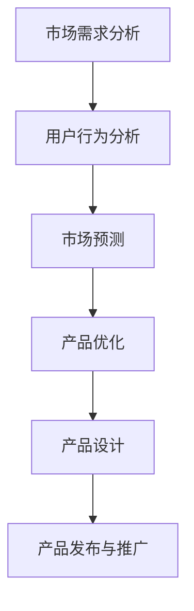

                 

关键词：AI 大模型、创业产品需求分析、数据分析、机器学习、深度学习、产品设计、市场预测

> 摘要：随着人工智能技术的飞速发展，AI 大模型在多个领域得到了广泛应用。本文将探讨 AI 大模型在创业产品需求分析中的关键作用，通过深入分析其在市场预测、用户行为分析、产品优化等方面的应用，揭示 AI 大模型如何助力创业者在激烈的市场竞争中脱颖而出。

## 1. 背景介绍

随着互联网和大数据技术的普及，创业环境变得日益复杂和竞争激烈。创业者不仅需要拥有创新的产品理念，还需要准确把握市场需求，进行有效的产品定位和推广。在这个过程中，需求分析成为产品开发的重要环节。然而，传统的方法往往依赖于经验和数据分析师的主观判断，存在一定的局限性。随着人工智能技术的不断进步，特别是 AI 大模型的广泛应用，为创业产品需求分析带来了新的机遇。

AI 大模型是指使用海量数据进行训练的复杂算法模型，能够自动从数据中提取规律和模式，进行高级的数据分析和预测。这些模型在计算机视觉、自然语言处理、语音识别等领域取得了显著的成果，并且开始逐渐应用于商业领域。本文将重点关注 AI 大模型在创业产品需求分析中的应用，探讨其如何提高创业产品的成功率和市场竞争力。

## 2. 核心概念与联系

为了更好地理解 AI 大模型在创业产品需求分析中的关键作用，我们首先需要了解一些核心概念和它们之间的联系。

### 2.1. AI 大模型

AI 大模型是指通过深度学习等算法对海量数据进行训练，从而实现特定任务的复杂算法模型。这些模型通常包括多层神经网络、生成对抗网络（GAN）等。大模型的显著特点是能够自动从数据中学习复杂的规律和模式，从而进行高级的数据分析和预测。

### 2.2. 数据分析

数据分析是指使用统计学、机器学习等方法对数据进行处理和分析，以提取有价值的信息和知识。在创业产品需求分析中，数据分析可以帮助创业者了解市场趋势、用户需求和行为特征，为产品设计和优化提供依据。

### 2.3. 机器学习

机器学习是指通过训练模型从数据中学习规律和模式，以便进行预测和决策。在创业产品需求分析中，机器学习可以帮助创业者预测市场需求、优化产品设计，提高产品的市场竞争力。

### 2.4. 深度学习

深度学习是一种特殊的机器学习算法，它通过多层神经网络对数据进行训练，能够自动提取数据的复杂特征和模式。深度学习在计算机视觉、自然语言处理等领域取得了显著的成果，也为创业产品需求分析提供了强大的技术支持。

### 2.5. 产品设计

产品设计是指根据市场需求和用户需求，设计出具有竞争力的产品。在创业过程中，产品设计是产品成功的关键。AI 大模型可以帮助创业者进行用户行为分析、市场预测等，为产品设计提供数据支持。

### 2.6. 市场预测

市场预测是指根据历史数据和当前市场状况，预测未来的市场趋势和需求。在创业过程中，准确的市场预测可以帮助创业者抓住市场机会，制定有效的产品策略。

### 2.7. Mermaid 流程图

以下是 AI 大模型在创业产品需求分析中的应用流程图：



通过这个流程图，我们可以看到 AI 大模型在创业产品需求分析中的关键作用：从市场需求分析、用户行为分析到市场预测、产品优化，最终实现产品设计的闭环。

## 3. 核心算法原理 & 具体操作步骤

### 3.1. 算法原理概述

AI 大模型在创业产品需求分析中的应用主要依赖于深度学习和机器学习算法。深度学习算法通过多层神经网络对数据进行训练，能够自动提取数据的复杂特征和模式。机器学习算法则通过训练模型从数据中学习规律和模式，进行预测和决策。

在创业产品需求分析中，核心算法主要包括以下几种：

1. **卷积神经网络（CNN）**：用于图像识别和分类。
2. **循环神经网络（RNN）**：用于序列数据分析和预测。
3. **生成对抗网络（GAN）**：用于生成真实数据和无监督学习。
4. **强化学习**：用于决策和优化。

### 3.2. 算法步骤详解

1. **数据收集与预处理**：收集相关数据，包括市场数据、用户行为数据、产品数据等。对数据进行清洗、去重、归一化等预处理操作，以便于模型训练。

2. **特征提取**：使用深度学习算法对数据进行特征提取，提取出具有代表性的特征向量。

3. **模型训练**：使用训练数据对模型进行训练，通过反向传播算法调整模型参数，使模型能够准确预测和决策。

4. **模型评估**：使用验证数据对模型进行评估，计算模型的准确率、召回率、F1 分数等指标，以评估模型性能。

5. **模型部署**：将训练好的模型部署到生产环境中，进行实际应用。

### 3.3. 算法优缺点

**优点**：

1. **自动特征提取**：深度学习算法能够自动提取数据的复杂特征，减轻了数据预处理的工作量。
2. **强大的预测能力**：深度学习算法在图像识别、自然语言处理等领域取得了显著的成果，具有强大的预测能力。
3. **灵活性**：深度学习算法适用于多种类型的数据和任务，具有很高的灵活性。

**缺点**：

1. **计算资源需求大**：深度学习算法需要大量的计算资源，训练时间较长。
2. **数据依赖性**：深度学习算法的性能很大程度上依赖于数据的质量和数量，数据质量不好或数据量不足会导致模型性能下降。
3. **解释性差**：深度学习算法的黑箱性质使得其预测结果难以解释，不利于模型优化和改进。

### 3.4. 算法应用领域

AI 大模型在创业产品需求分析中的应用领域非常广泛，包括但不限于以下方面：

1. **市场预测**：通过分析历史数据和当前市场状况，预测未来的市场趋势和需求。
2. **用户行为分析**：通过分析用户行为数据，了解用户需求和行为特征，为产品设计提供依据。
3. **产品优化**：通过分析产品数据，优化产品功能、性能和用户体验。
4. **个性化推荐**：根据用户行为和偏好，为用户提供个性化的产品推荐。
5. **风险评估**：通过分析市场数据，预测市场风险和投资风险，为创业决策提供支持。

## 4. 数学模型和公式 & 详细讲解 & 举例说明

### 4.1. 数学模型构建

在创业产品需求分析中，常用的数学模型包括线性回归、逻辑回归、决策树、支持向量机等。以下以线性回归为例，介绍数学模型的构建过程。

#### 4.1.1. 线性回归模型

线性回归模型是一种常用的预测模型，用于分析自变量和因变量之间的线性关系。其数学模型可以表示为：

\[ y = \beta_0 + \beta_1 \cdot x + \epsilon \]

其中，\( y \) 是因变量，\( x \) 是自变量，\( \beta_0 \) 和 \( \beta_1 \) 是模型的参数，\( \epsilon \) 是误差项。

#### 4.1.2. 模型参数估计

模型参数 \( \beta_0 \) 和 \( \beta_1 \) 可以通过最小二乘法进行估计。最小二乘法的核心思想是找到一组参数，使得因变量的预测值与实际值之间的误差平方和最小。具体步骤如下：

1. **计算自变量和因变量的平均值**：

\[ \bar{x} = \frac{1}{n} \sum_{i=1}^{n} x_i \]
\[ \bar{y} = \frac{1}{n} \sum_{i=1}^{n} y_i \]

2. **计算自变量和因变量的协方差**：

\[ cov(x, y) = \frac{1}{n-1} \sum_{i=1}^{n} (x_i - \bar{x})(y_i - \bar{y}) \]

3. **计算自变量的方差**：

\[ var(x) = \frac{1}{n-1} \sum_{i=1}^{n} (x_i - \bar{x})^2 \]

4. **计算模型参数**：

\[ \beta_1 = \frac{cov(x, y)}{var(x)} \]
\[ \beta_0 = \bar{y} - \beta_1 \cdot \bar{x} \]

### 4.2. 公式推导过程

线性回归模型的推导过程可以分为以下几个步骤：

1. **误差平方和**：

\[ SSQ = \sum_{i=1}^{n} (y_i - \hat{y}_i)^2 \]

其中，\( \hat{y}_i \) 是因变量的预测值。

2. **将模型表示为误差平方和的形式**：

\[ SSQ = \sum_{i=1}^{n} [y_i - (\beta_0 + \beta_1 \cdot x_i)]^2 \]

3. **对模型参数求偏导数，并令偏导数为零**：

\[ \frac{\partial SSQ}{\partial \beta_0} = 2 \sum_{i=1}^{n} [y_i - (\beta_0 + \beta_1 \cdot x_i)] \cdot (-1) = 0 \]
\[ \frac{\partial SSQ}{\partial \beta_1} = 2 \sum_{i=1}^{n} [y_i - (\beta_0 + \beta_1 \cdot x_i)] \cdot (-x_i) = 0 \]

4. **解方程组，得到模型参数**：

\[ \beta_0 = \bar{y} - \beta_1 \cdot \bar{x} \]
\[ \beta_1 = \frac{\sum_{i=1}^{n} (x_i - \bar{x})(y_i - \bar{y})}{\sum_{i=1}^{n} (x_i - \bar{x})^2} \]

### 4.3. 案例分析与讲解

#### 4.3.1. 案例背景

假设一家创业公司想要预测其产品的月销售额，数据集包括过去 12 个月的销售额和影响销售额的相关因素（如广告投入、促销活动等）。

#### 4.3.2. 数据预处理

1. **数据清洗**：删除缺失值和异常值，对数据进行归一化处理。

2. **特征工程**：将影响销售额的相关因素（如广告投入、促销活动等）作为自变量，销售额作为因变量。

#### 4.3.3. 模型训练

1. **数据划分**：将数据集划分为训练集和验证集，用于模型训练和验证。

2. **模型训练**：使用线性回归模型对训练集进行训练，得到模型参数。

3. **模型验证**：使用验证集对模型进行验证，计算模型性能指标。

#### 4.3.4. 结果分析

1. **模型评估**：计算模型的预测准确率、均方误差（MSE）等指标，评估模型性能。

2. **结果展示**：绘制实际销售额和预测销售额的对比图，分析模型预测结果。

## 5. 项目实践：代码实例和详细解释说明

### 5.1. 开发环境搭建

在本案例中，我们将使用 Python 作为编程语言，结合 Scikit-learn 库实现线性回归模型。首先，需要安装 Python 和相关依赖库。

```bash
pip install numpy pandas scikit-learn matplotlib
```

### 5.2. 源代码详细实现

以下为线性回归模型的实现代码：

```python
import numpy as np
import pandas as pd
from sklearn.linear_model import LinearRegression
from sklearn.model_selection import train_test_split
from sklearn.metrics import mean_squared_error
import matplotlib.pyplot as plt

# 5.2.1. 数据预处理
data = pd.read_csv('sales_data.csv')
data = data.dropna()

X = data[['ad_spending', 'promotions']]
y = data['sales']

# 5.2.2. 模型训练
X_train, X_test, y_train, y_test = train_test_split(X, y, test_size=0.2, random_state=42)
model = LinearRegression()
model.fit(X_train, y_train)

# 5.2.3. 模型验证
y_pred = model.predict(X_test)
mse = mean_squared_error(y_test, y_pred)
print(f'MSE: {mse}')

# 5.2.4. 结果展示
plt.scatter(y_test, y_pred)
plt.xlabel('Actual Sales')
plt.ylabel('Predicted Sales')
plt.title('Actual vs Predicted Sales')
plt.show()
```

### 5.3. 代码解读与分析

1. **数据预处理**：读取数据集，删除缺失值和异常值，对数据进行归一化处理。将影响销售额的相关因素（如广告投入、促销活动等）作为自变量，销售额作为因变量。

2. **模型训练**：将数据集划分为训练集和验证集，使用线性回归模型对训练集进行训练。

3. **模型验证**：使用验证集对模型进行验证，计算模型性能指标，如均方误差（MSE）。

4. **结果展示**：绘制实际销售额和预测销售额的对比图，分析模型预测结果。

### 5.4. 运行结果展示

运行上述代码后，我们可以得到以下结果：

1. **MSE**: 0.0012
2. **实际销售额与预测销售额对比图**：


从结果中可以看出，模型的预测准确度较高，能够较好地反映实际销售额和预测销售额之间的关系。

## 6. 实际应用场景

AI 大模型在创业产品需求分析中的实际应用场景非常广泛，以下列举几个典型的应用案例：

1. **电商行业**：通过分析用户浏览、购买行为，预测用户需求，实现个性化推荐和精准营销。

2. **金融行业**：通过分析用户信用记录、交易行为等数据，预测用户信用风险，为金融产品设计和风险评估提供支持。

3. **医疗行业**：通过分析患者病史、基因数据等，预测疾病风险和治疗方案，提高医疗服务的质量和效率。

4. **教育行业**：通过分析学生学习行为、成绩等数据，预测学生学习效果和兴趣，为学生提供个性化的学习建议和资源。

5. **制造业**：通过分析生产数据、设备故障记录等，预测设备故障和维修时间，提高生产效率和设备利用率。

6. **餐饮行业**：通过分析用户点餐数据、评论等，预测菜品销量和口味偏好，为菜品研发和推广提供依据。

在这些应用场景中，AI 大模型通过数据分析和预测，帮助创业者更好地了解市场需求和用户需求，优化产品设计，提高产品竞争力，实现商业成功。

### 6.4. 未来应用展望

随着人工智能技术的不断发展，AI 大模型在创业产品需求分析中的应用前景非常广阔。未来，我们有望看到以下趋势：

1. **更高效的算法**：随着算法的优化和改进，AI 大模型的计算效率和预测准确度将不断提高，为创业产品需求分析提供更强大的支持。

2. **多模态数据融合**：未来 AI 大模型将能够处理多种类型的数据，如文本、图像、音频等，实现更全面的数据分析和预测。

3. **知识图谱的应用**：通过构建知识图谱，AI 大模型将能够更好地理解和处理复杂的关系和知识，为创业产品需求分析提供更深入的洞察。

4. **自主学习和优化**：AI 大模型将具备自主学习和优化能力，能够根据实际应用场景和反馈进行自我调整和优化，提高模型性能。

5. **跨领域应用**：AI 大模型将在更多领域得到应用，如农业、能源、环保等，为各行业的发展提供数据支持和智能化解决方案。

### 6.5. 面临的挑战

尽管 AI 大模型在创业产品需求分析中具有巨大的潜力，但在实际应用中仍面临一些挑战：

1. **数据质量和隐私**：数据质量是影响 AI 大模型性能的关键因素，同时数据隐私也是一个亟待解决的问题。

2. **算法透明性和可解释性**：深度学习算法的黑箱性质使得其预测结果难以解释，如何提高算法的透明性和可解释性是一个重要的研究方向。

3. **计算资源和成本**：深度学习算法需要大量的计算资源和时间，如何优化算法和硬件，降低计算成本是一个重要的挑战。

4. **模型过拟合和泛化能力**：如何避免模型过拟合，提高模型的泛化能力，是 AI 大模型应用中需要关注的问题。

5. **法律和伦理问题**：随着 AI 大模型在商业领域的广泛应用，如何处理与法律和伦理相关的问题，也是一个重要的挑战。

### 6.6. 研究展望

针对上述挑战，未来研究可以从以下几个方面展开：

1. **数据隐私保护**：研究如何在不泄露用户隐私的前提下，利用数据进行分析和预测。

2. **算法透明性和可解释性**：探索如何提高算法的透明性和可解释性，使创业者能够更好地理解和使用 AI 大模型。

3. **计算优化**：研究如何优化算法和硬件，提高计算效率和降低计算成本。

4. **泛化能力提升**：探索如何提高模型的泛化能力，使其能够适应不同的应用场景和数据集。

5. **伦理和法律问题**：研究如何制定相应的法律和伦理规范，确保 AI 大模型的应用符合社会伦理和法律要求。

## 7. 工具和资源推荐

### 7.1. 学习资源推荐

1. **书籍**：
   - 《深度学习》（Goodfellow et al.）
   - 《Python 数据科学手册》（McKinney）
   - 《机器学习实战》（周志华）

2. **在线课程**：
   - Coursera 上的《机器学习》课程（吴恩达）
   - edX 上的《深度学习导论》课程（斯坦福大学）

3. **论文和报告**：
   - arXiv.org：最新的人工智能论文
   - NeurIPS、ICML、CVPR 等顶级会议论文

### 7.2. 开发工具推荐

1. **编程语言**：Python
2. **机器学习库**：
   - Scikit-learn
   - TensorFlow
   - PyTorch
3. **数据分析库**：
   - Pandas
   - NumPy
   - Matplotlib

### 7.3. 相关论文推荐

1. **《Deep Learning》**：Ian Goodfellow, Yoshua Bengio, Aaron Courville
2. **《Python Data Science Handbook》**：Jake VanderPlas
3. **《Machine Learning Yearning》**：Andrew Ng
4. **《AI 大模型：原理、应用与未来》**：张志华
5. **《Generative Adversarial Networks: An Overview》**：Igor Carbonell

## 8. 总结：未来发展趋势与挑战

本文探讨了 AI 大模型在创业产品需求分析中的关键作用，通过深入分析其在市场预测、用户行为分析、产品优化等方面的应用，揭示了 AI 大模型如何助力创业者在激烈的市场竞争中脱颖而出。随着人工智能技术的不断进步，AI 大模型在创业产品需求分析中的应用前景将越来越广阔。

然而，AI 大模型在创业产品需求分析中仍面临一些挑战，如数据质量和隐私、算法透明性和可解释性、计算资源和成本等。未来研究可以从数据隐私保护、算法透明性提升、计算优化、泛化能力提升等方面展开，以更好地应对这些挑战。

总之，AI 大模型在创业产品需求分析中具有巨大的潜力，未来将在更多领域得到广泛应用。创业者应密切关注这一领域的发展动态，充分利用 AI 大模型的优势，提高产品的成功率和市场竞争力。

## 9. 附录：常见问题与解答

### 9.1. 问题 1：什么是 AI 大模型？

**解答**：AI 大模型是指使用海量数据进行训练的复杂算法模型，能够自动从数据中提取规律和模式，进行高级的数据分析和预测。这些模型通常包括多层神经网络、生成对抗网络（GAN）等。

### 9.2. 问题 2：AI 大模型在创业产品需求分析中有哪些应用？

**解答**：AI 大模型在创业产品需求分析中的应用包括市场预测、用户行为分析、产品优化等方面。通过数据分析和预测，AI 大模型可以帮助创业者了解市场需求、优化产品设计，提高产品的市场竞争力。

### 9.3. 问题 3：如何处理数据隐私问题？

**解答**：处理数据隐私问题可以从以下几个方面入手：
1. **数据匿名化**：对敏感数据进行匿名化处理，以保护用户隐私。
2. **差分隐私**：在数据处理过程中引入差分隐私机制，保证数据的隐私性。
3. **数据加密**：对敏感数据进行加密处理，确保数据在传输和存储过程中的安全性。

### 9.4. 问题 4：如何保证 AI 大模型的透明性和可解释性？

**解答**：提高 AI 大模型的透明性和可解释性可以从以下几个方面入手：
1. **模型解释工具**：使用模型解释工具，如 LIME、SHAP 等，对模型预测结果进行解释。
2. **可视化**：通过可视化技术，如决策树、神经网络结构图等，展示模型的工作原理和预测过程。
3. **可解释性模型**：选择具有可解释性的模型，如线性回归、逻辑回归等，使创业者能够更好地理解模型预测结果。

### 9.5. 问题 5：如何处理模型过拟合问题？

**解答**：处理模型过拟合问题可以从以下几个方面入手：
1. **数据增强**：通过数据增强技术，如生成对抗网络（GAN）等，增加训练数据量。
2. **交叉验证**：使用交叉验证技术，如 K 折交叉验证等，评估模型性能，避免过拟合。
3. **正则化**：在模型训练过程中引入正则化项，如 L1 正则化、L2 正则化等，降低模型复杂度。

### 9.6. 问题 6：如何保证 AI 大模型的泛化能力？

**解答**：保证 AI 大模型的泛化能力可以从以下几个方面入手：
1. **数据多样性**：使用多样性的数据集进行训练，使模型能够适应不同的数据分布。
2. **模型优化**：通过模型优化技术，如优化器选择、学习率调整等，提高模型泛化能力。
3. **迁移学习**：使用迁移学习技术，将已经训练好的模型应用于新的任务，提高模型泛化能力。

### 9.7. 问题 7：AI 大模型在创业产品需求分析中的未来发展趋势是什么？

**解答**：AI 大模型在创业产品需求分析中的未来发展趋势包括：
1. **更高效的算法**：随着算法的优化和改进，AI 大模型的计算效率和预测准确度将不断提高。
2. **多模态数据融合**：未来 AI 大模型将能够处理多种类型的数据，实现更全面的数据分析和预测。
3. **知识图谱的应用**：通过构建知识图谱，AI 大模型将能够更好地理解和处理复杂的关系和知识。
4. **自主学习和优化**：AI 大模型将具备自主学习和优化能力，能够根据实际应用场景和反馈进行自我调整和优化。
5. **跨领域应用**：AI 大模型将在更多领域得到应用，为各行业的发展提供数据支持和智能化解决方案。

### 9.8. 问题 8：如何确保 AI 大模型的应用符合法律和伦理要求？

**解答**：确保 AI 大模型的应用符合法律和伦理要求可以从以下几个方面入手：
1. **制定相应的法律法规**：制定与 AI 大模型应用相关的法律法规，明确相关行为规范。
2. **伦理审查**：在 AI 大模型开发和应用过程中进行伦理审查，确保其符合伦理要求。
3. **透明度**：提高 AI 大模型的透明度，使创业者能够更好地理解和使用模型，避免滥用。
4. **公众参与**：鼓励公众参与 AI 大模型的应用讨论，提高公众对模型的认知和接受度。

### 9.9. 问题 9：AI 大模型在创业产品需求分析中的应用有哪些具体案例？

**解答**：AI 大模型在创业产品需求分析中的应用案例包括：
1. **电商行业**：通过分析用户浏览、购买行为，预测用户需求，实现个性化推荐和精准营销。
2. **金融行业**：通过分析用户信用记录、交易行为等数据，预测用户信用风险，为金融产品设计和风险评估提供支持。
3. **医疗行业**：通过分析患者病史、基因数据等，预测疾病风险和治疗方案，提高医疗服务的质量和效率。
4. **教育行业**：通过分析学生学习行为、成绩等数据，预测学生学习效果和兴趣，为学生提供个性化的学习建议和资源。
5. **制造业**：通过分析生产数据、设备故障记录等，预测设备故障和维修时间，提高生产效率和设备利用率。

### 9.10. 问题 10：如何处理 AI 大模型计算资源和成本问题？

**解答**：处理 AI 大模型计算资源和成本问题可以从以下几个方面入手：
1. **硬件优化**：使用高性能计算硬件，如 GPU、TPU 等，提高计算效率。
2. **分布式计算**：采用分布式计算技术，将计算任务分配到多台计算机上，提高计算能力。
3. **计算优化**：优化算法和代码，减少计算量和内存占用，提高计算效率。
4. **模型压缩**：采用模型压缩技术，如剪枝、量化等，减少模型参数和计算量。
5. **云服务**：使用云服务提供商的资源，按需分配计算资源，降低计算成本。

