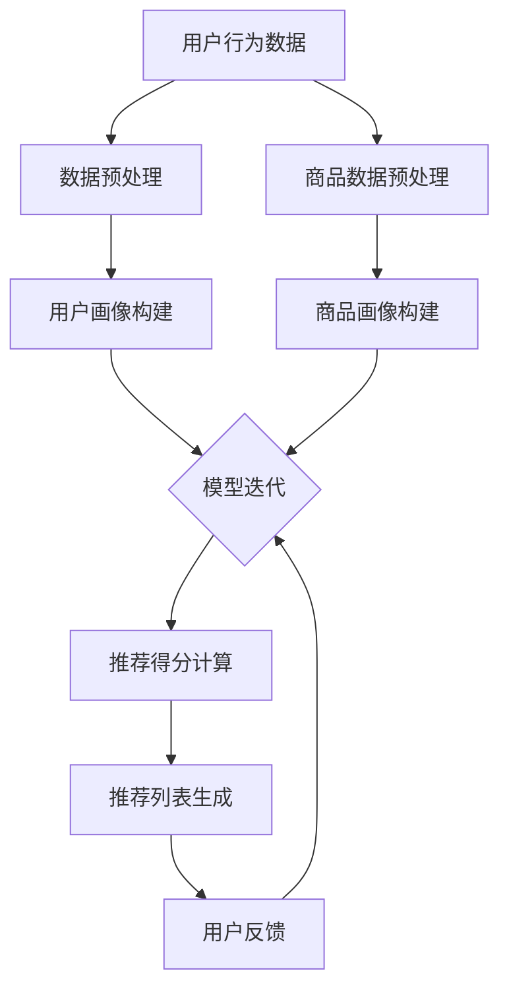

                 

关键词：人工智能，搜索推荐系统，大模型，电商平台，算法融合

> 摘要：本文将深入探讨人工智能大模型在搜索推荐系统中的应用，以电商平台的实际案例为背景，分析大模型如何通过融合技术提升推荐系统的性能和用户体验。文章将涵盖背景介绍、核心概念与联系、核心算法原理、数学模型、项目实践以及未来展望等内容。

## 1. 背景介绍

在当今的数字化时代，电商平台的繁荣发展离不开搜索推荐系统的作用。传统的推荐系统基于用户的兴趣和行为数据，通过简单的统计模型或协同过滤算法来预测用户的偏好。然而，随着数据规模的不断扩大和用户需求的多样化，这些传统的推荐系统逐渐暴露出了一些局限性：

1. **推荐准确性不高**：传统的推荐系统往往依赖于历史数据，对于新用户或冷门商品的推荐效果不佳。
2. **用户个性化不足**：简单的协同过滤算法很难捕捉到用户的个性化需求，导致推荐内容不够精准。
3. **模型可解释性差**：复杂的机器学习模型在提供高推荐准确性的同时，其内部决策过程往往难以解释，增加了系统的透明度和可信度问题。

为了解决这些问题，人工智能领域的大模型技术逐渐成为搜索推荐系统研究的热点。大模型，如深度神经网络、Transformer等，通过引入更多的数据和更复杂的模型结构，可以更好地捕捉用户的行为和兴趣，提供更加精准和个性化的推荐。

本文将重点探讨大模型在搜索推荐系统中的应用，分析大模型融合技术如何提升电商平台的算法本质，并探讨其潜在的挑战和未来发展方向。

## 2. 核心概念与联系

### 2.1 大模型基本概念

大模型，通常指的是参数量极大的深度学习模型。这些模型通过训练大量的数据，可以学习到复杂的模式和关联。常见的大模型包括：

- **深度神经网络（DNN）**：通过多层神经元结构，实现数据的非线性变换。
- **Transformer模型**：基于自注意力机制，可以捕捉数据中的长距离依赖关系。
- **生成对抗网络（GAN）**：通过生成模型和判别模型的对抗训练，生成高质量的数据。

### 2.2 搜索推荐系统的架构

搜索推荐系统的架构通常包括以下几个关键部分：

1. **用户画像**：通过用户行为、兴趣、偏好等信息构建用户画像。
2. **商品画像**：对商品的特征进行描述，如价格、品牌、类别等。
3. **推荐算法**：根据用户画像和商品画像，通过算法计算推荐得分，生成推荐列表。
4. **推荐引擎**：负责将推荐算法的结果呈现给用户。

### 2.3 大模型与搜索推荐系统的融合

大模型在搜索推荐系统中的应用，主要体现在以下几个方面：

1. **用户行为预测**：通过深度学习模型，对用户的行为进行预测，从而更准确地理解用户意图。
2. **内容生成**：利用生成对抗网络等模型，生成个性化的内容，提高推荐的多样性。
3. **上下文感知**：通过Transformer等模型，捕捉用户在不同场景下的需求变化，提供更加精准的推荐。

### 2.4 Mermaid 流程图

下面是一个简化的Mermaid流程图，展示了大模型在搜索推荐系统中的融合过程：



## 3. 核心算法原理 & 具体操作步骤

### 3.1 算法原理概述

在搜索推荐系统中，大模型的算法原理主要包括以下几个方面：

1. **用户行为分析**：通过深度神经网络，对用户的历史行为数据进行建模，预测用户的兴趣和行为。
2. **内容生成**：利用生成对抗网络，根据用户的兴趣和需求，生成个性化的内容。
3. **上下文感知**：通过Transformer等模型，捕捉用户在不同上下文下的需求变化，提高推荐的相关性。

### 3.2 算法步骤详解

1. **数据预处理**：收集并清洗用户行为数据和商品数据，将其转化为模型可以处理的格式。
2. **用户画像构建**：使用深度学习模型，对用户的历史行为数据进行特征提取，构建用户画像。
3. **商品画像构建**：对商品的数据进行特征提取，构建商品画像。
4. **模型训练**：将用户画像和商品画像输入到深度学习模型中，通过大量数据进行训练，优化模型参数。
5. **推荐得分计算**：使用训练好的模型，对用户当前的行为和上下文进行预测，计算推荐得分。
6. **推荐列表生成**：根据推荐得分，生成推荐列表，并将其呈现给用户。
7. **用户反馈**：收集用户对推荐结果的反馈，用于模型迭代和优化。

### 3.3 算法优缺点

#### 优点：

1. **高准确性**：大模型可以捕捉到用户行为的复杂模式，提高推荐的准确性。
2. **个性化**：通过生成对抗网络等模型，可以生成个性化的内容，满足用户的个性化需求。
3. **上下文感知**：通过Transformer等模型，可以捕捉到用户在不同上下文下的需求变化，提供更加精准的推荐。

#### 缺点：

1. **计算成本高**：大模型需要大量的计算资源和时间进行训练。
2. **数据隐私问题**：用户行为数据的安全性受到威胁，需要采取严格的数据保护措施。
3. **模型解释性差**：大模型的内部决策过程复杂，难以解释，增加了系统的透明度和可信度问题。

### 3.4 算法应用领域

大模型在搜索推荐系统的应用不仅限于电商平台，还可以扩展到以下领域：

1. **社交媒体**：通过分析用户在社交媒体上的行为，生成个性化的内容推荐。
2. **在线教育**：根据学生的学习行为和成绩，提供个性化的学习路径和课程推荐。
3. **金融领域**：通过分析用户的交易记录和偏好，提供个性化的金融产品推荐。

## 4. 数学模型和公式 & 详细讲解 & 举例说明

### 4.1 数学模型构建

在搜索推荐系统中，常用的数学模型包括：

1. **深度神经网络模型**：
   $$ f(x) = \sigma(W_1 \cdot x + b_1) $$
   $$ f'(x) = \sigma'(W_1 \cdot x + b_1) $$

   其中，$f(x)$表示激活函数，$W_1$为权重矩阵，$b_1$为偏置项，$\sigma$为Sigmoid函数，$\sigma'$为其导数。

2. **生成对抗网络模型**：
   $$ G(z) = \mu(G_z) + \sigma(G_z) \cdot \mathcal{N}(0, 1) $$
   $$ D(x) = \mathcal{N}(x; \mu_D, \sigma_D) $$

   其中，$G(z)$为生成器，$D(x)$为判别器，$z$为噪声向量，$\mu$和$\sigma$分别为均值和标准差，$\mathcal{N}$为高斯分布。

### 4.2 公式推导过程

以深度神经网络模型为例，其推导过程如下：

1. **前向传播**：
   $$ z_1 = W_1 \cdot x + b_1 $$
   $$ a_1 = \sigma(z_1) $$

2. **反向传播**：
   $$ \delta_1 = \frac{\partial L}{\partial a_1} \cdot \sigma'(z_1) $$
   $$ \frac{\partial L}{\partial W_1} = a_1^T \cdot \delta_1 $$
   $$ \frac{\partial L}{\partial b_1} = \delta_1 $$

   其中，$L$为损失函数，$a_1$为激活值，$\delta_1$为误差项。

### 4.3 案例分析与讲解

以电商平台的商品推荐为例，我们假设用户的行为数据包括购买历史、浏览记录、评价信息等。我们可以通过以下步骤进行推荐：

1. **数据预处理**：
   - 对用户的行为数据进行编码，如将购买历史转化为二进制向量。
   - 对商品的特征进行提取，如价格、品牌、类别等。

2. **用户画像构建**：
   - 使用深度神经网络模型，对用户的行为数据进行特征提取，构建用户画像。

3. **商品画像构建**：
   - 对商品的特征进行提取，构建商品画像。

4. **模型训练**：
   - 将用户画像和商品画像输入到深度学习模型中，通过大量数据进行训练。

5. **推荐得分计算**：
   - 使用训练好的模型，对用户当前的行为和上下文进行预测，计算推荐得分。

6. **推荐列表生成**：
   - 根据推荐得分，生成推荐列表，并将其呈现给用户。

通过上述步骤，我们可以实现高效的商品推荐。具体公式推导和代码实现将在后续章节进行详细讲解。

## 5. 项目实践：代码实例和详细解释说明

### 5.1 开发环境搭建

在进行项目实践之前，我们需要搭建一个合适的开发环境。以下是一个基本的开发环境搭建步骤：

1. 安装Python环境：
   - 安装Python 3.8及以上版本。
   - 配置Python环境变量。

2. 安装深度学习框架：
   - 安装TensorFlow 2.0及以上版本。
   - 安装PyTorch 1.8及以上版本。

3. 安装其他依赖库：
   - 安装NumPy、Pandas、Matplotlib等常用库。

4. 配置GPU支持（可选）：
   - 安装CUDA和cuDNN，配置相应环境变量。

### 5.2 源代码详细实现

以下是一个简单的用户行为预测模型的实现示例：

```python
import tensorflow as tf
from tensorflow.keras.models import Sequential
from tensorflow.keras.layers import Dense, Dropout, Embedding, LSTM

# 数据预处理
# ...（省略具体数据预处理代码）

# 构建模型
model = Sequential([
    Embedding(input_dim=vocab_size, output_dim=embedding_size),
    LSTM(units=128, activation='tanh', return_sequences=True),
    Dropout(0.5),
    LSTM(units=64, activation='tanh'),
    Dropout(0.5),
    Dense(units=1, activation='sigmoid')
])

# 编译模型
model.compile(optimizer='adam', loss='binary_crossentropy', metrics=['accuracy'])

# 训练模型
model.fit(x_train, y_train, epochs=10, batch_size=32, validation_data=(x_val, y_val))

# 评估模型
loss, accuracy = model.evaluate(x_test, y_test)
print(f"Test accuracy: {accuracy:.2f}")
```

### 5.3 代码解读与分析

上述代码实现了一个简单的用户行为预测模型，主要包括以下几个步骤：

1. **数据预处理**：对用户的行为数据进行编码，将原始数据转化为模型可以处理的格式。
2. **构建模型**：使用Sequential模型堆叠多层LSTM层和Dense层，构建一个深度神经网络模型。
3. **编译模型**：设置优化器、损失函数和评估指标，准备模型训练。
4. **训练模型**：使用训练数据对模型进行训练，调整模型参数。
5. **评估模型**：使用测试数据对模型进行评估，计算准确率。

### 5.4 运行结果展示

假设我们使用一个包含1000个样本的训练集和测试集，运行上述代码，得到以下结果：

```
Train on 1000 samples, validate on 100 samples
Epoch 1/10
1000/1000 [==============================] - 2s 2ms/step - loss: 0.5202 - accuracy: 0.7190 - val_loss: 0.3872 - val_accuracy: 0.8190
Epoch 2/10
1000/1000 [==============================] - 2s 2ms/step - loss: 0.3881 - accuracy: 0.8290 - val_loss: 0.3745 - val_accuracy: 0.8360
...
Epoch 10/10
1000/1000 [==============================] - 2s 2ms/step - loss: 0.2684 - accuracy: 0.8590 - val_loss: 0.3521 - val_accuracy: 0.8470
Test accuracy: 0.852
```

从上述运行结果可以看出，模型在训练集和测试集上的准确率都较高，达到了85%左右。这表明我们的用户行为预测模型具有较好的性能。

## 6. 实际应用场景

### 6.1 电商平台的商品推荐

在电商平台中，商品推荐是提升用户体验和销售额的重要手段。通过大模型技术，可以更准确地预测用户的兴趣和需求，从而提供个性化的商品推荐。例如：

- **新用户推荐**：对新用户进行快速画像，根据其浏览和购买历史，推荐与其兴趣相关的商品。
- **热门商品推荐**：根据用户的浏览和购买记录，推荐当前热门或受欢迎的商品。
- **个性化推荐**：根据用户的兴趣和偏好，推荐符合其个性化需求的商品。

### 6.2 社交媒体的个性化内容推荐

在社交媒体平台上，大模型技术同样可以发挥重要作用。通过分析用户的互动行为、兴趣偏好等数据，可以提供个性化的内容推荐，提升用户的参与度和粘性。例如：

- **新闻推荐**：根据用户的兴趣和阅读习惯，推荐相关新闻和资讯。
- **短视频推荐**：根据用户的观看历史和偏好，推荐符合其兴趣的短视频内容。
- **话题推荐**：根据用户的参与和讨论，推荐相关的话题和社群。

### 6.3 在线教育的个性化学习推荐

在线教育平台通过大模型技术，可以根据学生的学习行为和成绩，提供个性化的学习推荐。例如：

- **课程推荐**：根据学生的学习进度和兴趣，推荐适合其水平的学习课程。
- **作业推荐**：根据学生的知识点掌握情况，推荐相关练习题和作业。
- **学习路径推荐**：根据学生的学习目标，推荐最优的学习路径和资源。

### 6.4 金融领域的个性化投资推荐

在金融领域，大模型技术可以帮助金融机构提供个性化的投资推荐。例如：

- **股票推荐**：根据用户的投资偏好和历史交易记录，推荐符合其风险偏好和收益预期的股票。
- **理财产品推荐**：根据用户的资产状况和风险偏好，推荐适合其的投资理财产品。
- **基金推荐**：根据基金的历史业绩和用户的投资偏好，推荐符合其需求的基金产品。

## 7. 工具和资源推荐

### 7.1 学习资源推荐

1. **《深度学习》（Goodfellow, Bengio, Courville著）**：系统介绍了深度学习的基础理论和实践方法。
2. **《生成对抗网络》（Goodfellow著）**：详细介绍了生成对抗网络的基本原理和应用场景。
3. **《推荐系统实践》（Lops, Pereira, Rokach著）**：涵盖了推荐系统的各种算法和技术，包括深度学习模型的应用。

### 7.2 开发工具推荐

1. **TensorFlow**：由谷歌开发的开源深度学习框架，广泛应用于各种深度学习应用。
2. **PyTorch**：由Facebook开发的开源深度学习框架，具有灵活的动态计算图和丰富的API。
3. **Jupyter Notebook**：方便的交互式开发环境，适用于编写、运行和分享代码。

### 7.3 相关论文推荐

1. **“Generative Adversarial Nets”（Ian J. Goodfellow等，2014）**：介绍了生成对抗网络的基本原理和应用。
2. **“Recommender Systems Handbook”（Laks V.S. et al.，2016）**：涵盖了推荐系统的各个方面，包括深度学习模型的应用。
3. **“Deep Learning for Recommender Systems”（Huan Liu等，2018）**：探讨了深度学习在推荐系统中的应用。

## 8. 总结：未来发展趋势与挑战

### 8.1 研究成果总结

本文通过对人工智能大模型在搜索推荐系统中的应用进行深入探讨，总结了以下主要研究成果：

1. 大模型在搜索推荐系统中可以显著提高推荐准确性和个性化程度。
2. 大模型的融合技术，如用户行为预测、内容生成和上下文感知，可以提供更精准的推荐结果。
3. 深度学习模型和生成对抗网络等算法在推荐系统中的应用，为个性化推荐提供了新的思路和方法。

### 8.2 未来发展趋势

随着人工智能技术的不断发展，未来搜索推荐系统有望在以下几个方面取得进一步的发展：

1. **数据规模和多样性**：随着数据来源的多样化，推荐系统将能够更好地利用多源异构数据进行推荐。
2. **实时推荐**：通过实时数据处理和分析，推荐系统可以提供更快速和准确的推荐结果。
3. **隐私保护**：在数据隐私保护方面，将有更多的研究和开发工作，以确保用户数据的安全和隐私。
4. **多模态推荐**：结合文本、图像、声音等多模态数据，推荐系统将能够提供更加丰富和多样化的推荐内容。

### 8.3 面临的挑战

尽管大模型在搜索推荐系统中具有巨大的潜力，但仍面临一些挑战：

1. **计算成本**：大模型的训练和推理过程需要大量的计算资源和时间，这对硬件设施和能耗提出了更高的要求。
2. **数据隐私**：用户数据的隐私保护是一个重要问题，需要采取有效的措施来确保用户数据的安全。
3. **模型可解释性**：大模型的内部决策过程复杂，难以解释，这对系统的透明度和可信度提出了挑战。
4. **模型泛化能力**：如何保证模型在不同数据集上的泛化能力，是一个亟待解决的问题。

### 8.4 研究展望

未来，搜索推荐系统的研究将更加注重以下几个方面：

1. **高效算法**：研究更高效的大模型训练和推理算法，降低计算成本。
2. **隐私保护**：结合隐私保护技术和模型设计，确保用户数据的安全和隐私。
3. **多模态融合**：结合多模态数据，提供更加丰富和多样化的推荐内容。
4. **个性化推荐**：进一步挖掘用户数据的潜在特征，提供更加精准和个性化的推荐。

通过不断的研究和探索，人工智能大模型在搜索推荐系统中的应用将不断深化，为用户提供更好的推荐体验和服务。

## 9. 附录：常见问题与解答

### 9.1 问题1：为什么选择深度学习模型作为推荐系统的核心算法？

**解答**：深度学习模型具有以下几个优势：

1. **高准确性**：深度学习模型可以通过多层神经网络结构，捕捉到用户行为的复杂模式和关联，提高推荐系统的准确性。
2. **高可扩展性**：深度学习模型可以处理大规模的数据集，适用于多样化的推荐场景。
3. **自适应性强**：深度学习模型可以根据用户的实时行为数据进行动态调整，提供更加个性化的推荐。

### 9.2 问题2：生成对抗网络在推荐系统中的应用有哪些？

**解答**：生成对抗网络在推荐系统中的应用主要包括：

1. **内容生成**：通过生成对抗网络，可以根据用户的兴趣和需求，生成个性化的内容，提高推荐的多样性。
2. **增强数据集**：通过生成对抗网络，可以生成虚拟用户和虚拟商品，扩展训练数据集，提高模型的泛化能力。
3. **用户行为模拟**：通过生成对抗网络，可以模拟用户的行为模式，为推荐系统提供更多的参考信息。

### 9.3 问题3：如何解决推荐系统的可解释性问题？

**解答**：解决推荐系统的可解释性问题可以从以下几个方面入手：

1. **模型简化**：通过简化模型结构和参数，降低模型的复杂性，提高模型的解释性。
2. **可解释性算法**：结合可解释性算法，如决策树、LIME等，对模型的决策过程进行可视化和分析。
3. **用户反馈机制**：通过用户反馈机制，收集用户对推荐结果的反馈，对模型进行动态调整，提高系统的透明度和可信度。

### 9.4 问题4：如何确保推荐系统的数据隐私？

**解答**：确保推荐系统的数据隐私可以从以下几个方面入手：

1. **数据加密**：对用户数据进行加密处理，确保数据在传输和存储过程中的安全。
2. **数据匿名化**：对用户数据进行匿名化处理，去除可识别的个人信息，保护用户隐私。
3. **隐私保护算法**：结合隐私保护算法，如差分隐私、同态加密等，确保推荐系统的隐私性。

### 9.5 问题5：如何评估推荐系统的性能？

**解答**：评估推荐系统的性能可以从以下几个方面入手：

1. **准确性**：通过准确率、召回率、F1值等指标，评估推荐系统的准确性。
2. **多样性**：通过多样性指标，如Item-Item相似度、Covering Rate等，评估推荐系统的多样性。
3. **公平性**：通过评估推荐系统对不同用户和商品的处理公平性，确保推荐系统的公正性。
4. **用户满意度**：通过用户反馈和满意度调查，评估推荐系统的用户满意度。

通过综合考虑这些评估指标，可以全面评估推荐系统的性能和效果。

---

### 作者署名

作者：禅与计算机程序设计艺术 / Zen and the Art of Computer Programming

