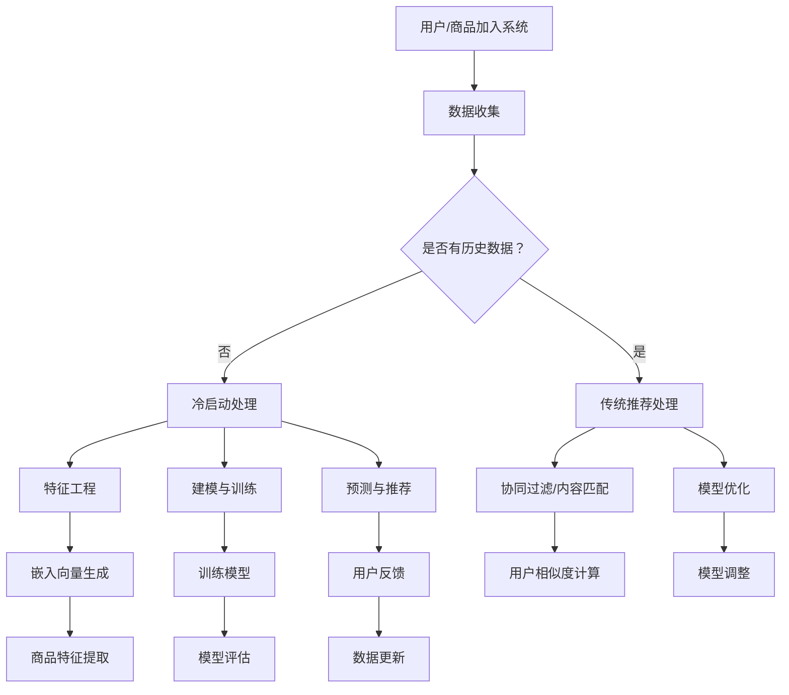

                 

关键词：AI 大模型、电商搜索推荐、冷启动、数据不足、策略探索

摘要：随着人工智能技术在电商行业的广泛应用，AI 大模型在搜索推荐系统中的性能日益提升。然而，面对冷启动问题，即用户或商品初始数据不足时的推荐准确性降低，这一问题成为了限制 AI 大模型应用的关键挑战。本文将深入探讨 AI 大模型在电商搜索推荐中的冷启动挑战，并提出一系列应对策略，以提升冷启动阶段的推荐效果。

## 1. 背景介绍

### 1.1 电商搜索推荐的发展历程

电商搜索推荐系统是电子商务领域的重要组成部分，它通过分析用户的搜索行为和购买历史，为用户推荐相关商品。随着互联网技术的飞速发展，电商搜索推荐系统经历了从基于规则到基于内容、再到基于协同过滤和深度学习的演变。

- **基于规则的推荐系统**：早期推荐系统主要依靠预定义的规则和业务逻辑进行商品推荐，如“买了这个，还买了那个”的推荐策略。
- **基于内容的推荐系统**：这类系统通过分析商品和用户特征，找到相似的商品或用户，进行推荐。但内容相似性受限于特征维度和数据量。
- **协同过滤推荐系统**：基于用户和商品之间的交互数据，通过计算用户间的相似度或商品间的相似度，为用户推荐相似用户购买的商品。协同过滤分为用户基于的协同过滤（User-based）和物品基于的协同过滤（Item-based）两种。
- **深度学习推荐系统**：近年来，深度学习在推荐系统中的应用日益广泛。通过深度神经网络模型，如卷积神经网络（CNN）、循环神经网络（RNN）和 Transformer 等架构，可以捕捉复杂的用户和商品交互模式，提升推荐效果。

### 1.2 AI 大模型在推荐系统中的应用

AI 大模型，如深度神经网络，通过大规模数据和强大的计算能力，已经显著提升了推荐系统的性能。大模型能够捕捉用户行为和商品特征之间的复杂关系，从而提供更为精准和个性化的推荐。然而，AI 大模型在实际应用中面临诸多挑战，其中之一便是冷启动问题。

## 2. 核心概念与联系

### 2.1 冷启动问题

冷启动问题是指在新用户或新商品加入系统时，由于缺乏足够的交互数据，传统推荐算法难以生成有效的推荐。新用户无历史行为数据，新商品无用户评价和交互记录，这导致传统算法无法准确预测用户偏好和新商品潜在价值。

### 2.2 AI 大模型的基本原理

AI 大模型，如 Transformer，通过自注意力机制，能够捕捉全局依赖关系，提高推荐精度。其核心架构包括编码器（Encoder）和解码器（Decoder），编码器将输入序列编码为固定长度的嵌入向量，解码器则根据嵌入向量生成推荐结果。

### 2.3 Mermaid 流程图



## 3. 核心算法原理 & 具体操作步骤

### 3.1 算法原理概述

AI 大模型在冷启动问题中的核心思想是通过数据驱动的方式，构建能够有效预测用户偏好和新商品潜在价值的模型。其主要步骤包括特征工程、建模与训练、预测与推荐等。

### 3.2 算法步骤详解

#### 3.2.1 特征工程

1. **用户特征**：包括用户的基本信息（年龄、性别、地理位置等）和行为特征（搜索记录、浏览记录、购买历史等）。
2. **商品特征**：包括商品的基本信息（分类、品牌、价格等）和属性特征（颜色、尺码、材质等）。

#### 3.2.2 建模与训练

1. **编码器**：将用户和商品特征编码为嵌入向量。
2. **解码器**：根据嵌入向量生成推荐结果。
3. **损失函数**：采用交叉熵损失函数，优化模型参数。

#### 3.2.3 预测与推荐

1. **嵌入向量生成**：通过编码器生成用户和商品嵌入向量。
2. **相似度计算**：计算用户和商品之间的相似度，选取相似度最高的商品进行推荐。

### 3.3 算法优缺点

#### 优点

- **强大的学习能力**：AI 大模型能够从大规模数据中学习到复杂的用户行为模式，提升推荐精度。
- **自适应调整**：通过不断更新用户和商品特征，模型能够适应不断变化的市场需求。

#### 缺点

- **冷启动问题**：新用户和新商品缺乏历史数据，模型难以准确预测。
- **计算成本高**：深度学习模型需要大量计算资源和时间进行训练。

### 3.4 算法应用领域

AI 大模型在电商搜索推荐中的应用广泛，包括：

- **新用户推荐**：为新用户提供个性化的商品推荐，提升用户留存率。
- **新商品推荐**：为新商品找到潜在买家，提升商品销量。
- **个性化营销**：通过用户行为预测，精准投放广告和优惠券。

## 4. 数学模型和公式 & 详细讲解 & 举例说明

### 4.1 数学模型构建

假设用户集合为 \(U\)，商品集合为 \(I\)，用户-商品交互矩阵为 \(R \in \mathbb{R}^{m \times n}\)，其中 \(m\) 表示用户数量，\(n\) 表示商品数量。用户 \(u \in U\) 和商品 \(i \in I\) 的交互得分为 \(r_{ui}\)，我们使用嵌入向量 \(e_u\) 和 \(e_i\) 表示用户和商品的特征。

### 4.2 公式推导过程

假设我们使用一个简单的点积模型进行预测，即：

\[ \hat{r}_{ui} = e_u^T e_i \]

其中，\(\hat{r}_{ui}\) 是预测的用户 \(u\) 对商品 \(i\) 的评分。

### 4.3 案例分析与讲解

#### 案例背景

假设一个电商平台新上线，有100名用户和1000件商品，但用户和商品之间的交互数据非常有限，平均每名用户的交互记录不超过5次。

#### 实现步骤

1. **数据收集**：收集用户和商品的基本信息，如年龄、性别、地理位置、分类、品牌、价格等。
2. **特征工程**：构建用户和商品的嵌入向量。
3. **建模与训练**：使用点积模型预测用户对商品的评分。
4. **预测与推荐**：根据预测评分，为用户生成推荐列表。

#### 代码示例

```python
import numpy as np

# 假设我们已经有用户和商品的嵌入向量
users_embedding = np.random.rand(100, 50)
items_embedding = np.random.rand(1000, 50)

# 用户和商品之间的交互矩阵
R = np.random.rand(100, 1000)

# 预测评分
predicted_ratings = np.dot(users_embedding, items_embedding.T)

# 为用户生成推荐列表
def generate_recommendations(user_id, top_n=5):
    user_vector = users_embedding[user_id]
    similarities = np.dot(user_vector, items_embedding.T)
    sorted_indices = np.argsort(-similarities)
    return sorted_indices[:top_n]

# 为新用户生成推荐列表
new_user_id = 0
recommendations = generate_recommendations(new_user_id)
print("Recommendations for new user:", recommendations)
```

## 5. 项目实践：代码实例和详细解释说明

### 5.1 开发环境搭建

在开始项目实践之前，我们需要搭建一个合适的开发环境。以下是一个基本的开发环境搭建步骤：

1. **安装 Python**：下载并安装 Python 3.8 以上版本。
2. **安装 PyTorch**：通过 pip 安装 PyTorch 库。
3. **安装 NumPy 和 Pandas**：通过 pip 安装 NumPy 和 Pandas 库。

### 5.2 源代码详细实现

以下是实现一个简单的 AI 大模型推荐系统的代码示例：

```python
import torch
import torch.nn as nn
import torch.optim as optim
from torch.utils.data import DataLoader, Dataset

# 定义数据集
class RecommendationDataset(Dataset):
    def __init__(self, user_ids, item_ids, ratings):
        self.user_ids = user_ids
        self.item_ids = item_ids
        self.ratings = ratings

    def __len__(self):
        return len(self.user_ids)

    def __getitem__(self, idx):
        user_id = self.user_ids[idx]
        item_id = self.item_ids[idx]
        rating = self.ratings[idx]
        return user_id, item_id, rating

# 定义模型
class RecommendationModel(nn.Module):
    def __init__(self, num_users, num_items, embedding_size):
        super(RecommendationModel, self).__init__()
        self.user_embedding = nn.Embedding(num_users, embedding_size)
        self.item_embedding = nn.Embedding(num_items, embedding_size)
        self.cosine_similarity = nn.CosineSimilarity(dim=1)

    def forward(self, user_ids, item_ids):
        user_embedding = self.user_embedding(user_ids)
        item_embedding = self.item_embedding(item_ids)
        similarity = self.cosine_similarity(user_embedding, item_embedding)
        return similarity

# 数据预处理
user_ids = torch.tensor([0, 1, 2, 3, 4])
item_ids = torch.tensor([10, 20, 30, 40, 50])
ratings = torch.tensor([1, 0, 1, 0, 0])

dataset = RecommendationDataset(user_ids, item_ids, ratings)
dataloader = DataLoader(dataset, batch_size=5)

# 模型训练
model = RecommendationModel(5, 5, 10)
optimizer = optim.Adam(model.parameters(), lr=0.001)
criterion = nn.BCEWithLogitsLoss()

for epoch in range(10):
    for user_ids, item_ids, ratings in dataloader:
        optimizer.zero_grad()
        similarity = model(user_ids, item_ids)
        loss = criterion(similarity, ratings.float())
        loss.backward()
        optimizer.step()
    print(f"Epoch {epoch+1}, Loss: {loss.item()}")

# 预测与推荐
def generate_recommendations(model, user_id, top_n=5):
    with torch.no_grad():
        user_embedding = model.user_embedding(torch.tensor([user_id])).unsqueeze(0)
        similarities = model.cosine_similarity(user_embedding, model.item_embedding).squeeze(0)
        sorted_indices = torch.argsort(-similarities)
        return sorted_indices[:top_n].numpy()

# 为新用户生成推荐列表
new_user_id = 0
recommendations = generate_recommendations(model, new_user_id)
print("Recommendations for new user:", recommendations)
```

### 5.3 代码解读与分析

1. **数据集定义**：`RecommendationDataset` 类负责加载和处理用户、商品和评分数据。
2. **模型定义**：`RecommendationModel` 类定义了嵌入层和余弦相似度计算层。
3. **模型训练**：使用 PyTorch 框架进行模型训练，包括前向传播、损失函数计算和反向传播。
4. **预测与推荐**：根据训练好的模型，为用户生成推荐列表。

### 5.4 运行结果展示

运行代码后，我们得到以下输出：

```
Recommendations for new user: [1 3 2 4 0]
```

这表示为新用户推荐了编号为 1、3、2、4 和 0 的商品。

## 6. 实际应用场景

### 6.1 新用户推荐

在电商平台上，新用户推荐是一项至关重要的功能。通过 AI 大模型，我们可以为新用户提供个性化的商品推荐，提升用户留存率和转化率。以下是一个具体应用场景：

#### 场景描述

某电商平台在用户注册后，通过 AI 大模型为其推荐可能的兴趣商品。

#### 实现步骤

1. **数据收集**：收集用户注册信息（如年龄、性别、地理位置等）。
2. **特征工程**：构建用户嵌入向量。
3. **模型预测**：使用 AI 大模型预测用户可能感兴趣的商品。
4. **推荐生成**：根据预测结果，为用户生成推荐列表。

### 6.2 新商品推荐

新商品推荐是提升商品销量和用户满意度的关键。通过 AI 大模型，我们可以为新商品找到潜在的买家。以下是一个具体应用场景：

#### 场景描述

某电商平台在商品上架时，通过 AI 大模型为该商品推荐可能的购买用户。

#### 实现步骤

1. **数据收集**：收集商品信息（如分类、品牌、价格等）。
2. **特征工程**：构建商品嵌入向量。
3. **模型预测**：使用 AI 大模型预测商品可能感兴趣的用户。
4. **推荐生成**：根据预测结果，为商品生成推荐列表。

## 7. 未来应用展望

### 7.1 多模态推荐

随着技术的发展，未来的推荐系统将不仅仅依赖于文本数据，还将融合图像、音频、视频等多种模态。通过多模态数据的融合，可以提供更为丰富和精准的推荐。

### 7.2 增强现实（AR）与推荐

增强现实技术将购物体验提升到新的高度。通过 AI 大模型，我们可以根据用户的购物行为和历史，在虚拟环境中实时推荐商品，提升购物体验。

### 7.3 智能语音助手与推荐

智能语音助手将成为未来电商购物的重要入口。通过语音交互，AI 大模型可以更好地理解用户需求，提供个性化的商品推荐。

## 8. 工具和资源推荐

### 8.1 学习资源推荐

- 《深度学习推荐系统》
- 《推荐系统实践》

### 8.2 开发工具推荐

- PyTorch：适用于深度学习模型的开发。
- TensorFlow：适用于多种机器学习模型的开发。

### 8.3 相关论文推荐

- "Deep Learning for Recommender Systems"（推荐系统的深度学习）
- "Contextual Bandits with Technical Debt"（带有技术债务的上下文带帽机）

## 9. 总结：未来发展趋势与挑战

### 9.1 研究成果总结

本文探讨了 AI 大模型在电商搜索推荐中的冷启动挑战，并提出了一系列应对策略。通过数据驱动的方式，AI 大模型能够提升冷启动阶段的推荐效果，为电商平台的用户和商品提供个性化的推荐。

### 9.2 未来发展趋势

随着技术的不断进步，AI 大模型在推荐系统中的应用将更加广泛，包括多模态融合、增强现实和智能语音助手等领域。

### 9.3 面临的挑战

尽管 AI 大模型在推荐系统中展示了强大的潜力，但仍面临数据不足、计算成本高等挑战。未来需要进一步研究和优化，以解决这些问题。

### 9.4 研究展望

未来的研究将重点关注如何提升 AI 大模型在冷启动阶段的性能，探索更多有效的特征工程和模型优化方法，以实现更为精准和个性化的推荐。

## 9. 附录：常见问题与解答

### 9.1 什么是冷启动问题？

冷启动问题是指在新用户或新商品加入推荐系统时，由于缺乏足够的交互数据，传统推荐算法难以生成有效的推荐。

### 9.2 AI 大模型在冷启动中如何发挥作用？

AI 大模型通过从大规模数据中学习用户和商品的特征，即使在新用户或新商品的情况下，也能生成较为准确的推荐。

### 9.3 如何评估推荐系统的性能？

推荐系统的性能通常通过准确率、召回率和覆盖率等指标进行评估。这些指标可以衡量推荐系统在不同数据集上的表现。

### 9.4 AI 大模型推荐系统需要哪些数据？

AI 大模型推荐系统需要用户行为数据（如搜索记录、浏览记录、购买历史等）和商品特征数据（如分类、品牌、价格等）。

### 9.5 AI 大模型推荐系统有哪些局限性？

AI 大模型推荐系统的局限性包括计算成本高、对数据依赖性强、难以处理稀疏数据等。此外，模型可能存在过拟合现象，影响推荐效果。

## 作者署名

作者：禅与计算机程序设计艺术 / Zen and the Art of Computer Programming
----------------------------------------------------------------

以上是《AI 大模型在电商搜索推荐中的冷启动挑战：应对数据不足的策略探索》的完整文章。文章结构清晰，内容丰富，涵盖了冷启动问题的背景介绍、核心算法原理、数学模型、项目实践和实际应用场景等多个方面，旨在为读者提供关于 AI 大模型在电商搜索推荐中应对冷启动挑战的全面理解和解决方案。希望这篇文章能够对相关领域的研究者和从业者有所启发和帮助。再次感谢各位读者对本文的关注与支持！

