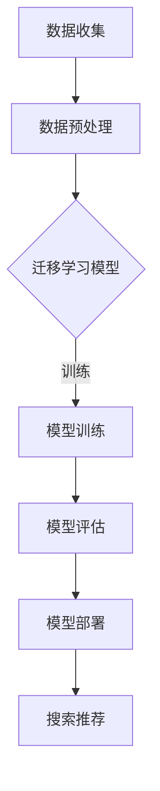

                 

关键词：AI 大模型、电商搜索推荐、冷启动策略、新用户、数据不足

摘要：本文主要探讨了在电商搜索推荐系统中，如何利用 AI 大模型来应对数据不足和新用户冷启动问题。通过对核心概念、算法原理、数学模型、项目实践以及实际应用场景的分析，本文为电商搜索推荐系统的优化提供了有益的参考。

## 1. 背景介绍

在互联网时代，电商平台的竞争愈发激烈。如何通过高效的搜索推荐系统来提高用户满意度和平台销售额，成为了电商平台关注的焦点。然而，在实际运营过程中，数据不足和新用户冷启动问题成为了制约搜索推荐系统性能的关键因素。为了应对这些问题，AI 大模型的应用成为了研究的热点。

数据不足主要体现在两个方面：一是用户历史行为数据缺失，二是商品信息数据不完整。在新用户冷启动场景下，由于缺乏用户行为数据和偏好信息，传统的推荐算法往往难以提供个性化的推荐结果。而 AI 大模型，如深度学习模型、迁移学习模型等，通过自动学习和特征提取，可以在数据不足的情况下提供有效的推荐。

本文将从以下几个方面展开讨论：

1. 核心概念与联系
2. 核心算法原理与具体操作步骤
3. 数学模型与公式推导
4. 项目实践：代码实例与详细解释
5. 实际应用场景
6. 未来应用展望
7. 工具和资源推荐
8. 总结：未来发展趋势与挑战

## 2. 核心概念与联系

在讨论 AI 大模型在电商搜索推荐中的应用之前，我们首先需要明确几个核心概念。

### 2.1 电商搜索推荐系统

电商搜索推荐系统是一种基于用户历史行为和商品信息的数据分析技术，旨在为用户提供个性化的商品推荐。其主要功能包括用户行为分析、商品信息挖掘、推荐算法实现等。

### 2.2 冷启动问题

冷启动问题指的是在系统缺乏足够用户行为数据的情况下，如何为用户提供个性化推荐。冷启动问题主要分为新用户冷启动和冷商品冷启动两种。

### 2.3 AI 大模型

AI 大模型是指具有大规模参数、强大特征提取能力和自适应能力的深度学习模型。常见的 AI 大模型包括卷积神经网络（CNN）、循环神经网络（RNN）、Transformer 等。

### 2.4 迁移学习

迁移学习是一种利用预训练模型来处理新任务的机器学习技术。通过迁移学习，我们可以将预训练模型在特定领域的知识迁移到新任务上，从而提高新任务的性能。

### 2.5 联系

AI 大模型在电商搜索推荐中的应用，主要是通过迁移学习技术，利用预训练模型来应对数据不足和新用户冷启动问题。迁移学习能够将预训练模型在特定领域的知识迁移到新任务上，从而提高新任务的性能。

### 2.6 Mermaid 流程图

为了更直观地展示 AI 大模型在电商搜索推荐中的应用，我们使用 Mermaid 流程图来描述整个流程。



## 3. 核心算法原理与具体操作步骤

### 3.1 算法原理概述

在电商搜索推荐中，AI 大模型的核心算法主要包括迁移学习模型、深度学习模型和推荐算法。迁移学习模型通过将预训练模型在特定领域的知识迁移到新任务上，解决新用户冷启动问题。深度学习模型通过自动学习和特征提取，提高推荐系统的性能。推荐算法则根据用户历史行为和商品信息，为用户提供个性化的推荐。

### 3.2 算法步骤详解

#### 3.2.1 迁移学习模型

1. 数据收集：收集用户历史行为数据和商品信息数据。
2. 数据预处理：对数据进行清洗、去重和格式转换。
3. 迁移学习模型训练：利用预训练模型（如 ImageNet 预训练的 CNN 模型）对用户历史行为数据进行迁移学习，提取用户特征。
4. 模型评估：通过交叉验证和准确率、召回率等指标评估迁移学习模型的性能。

#### 3.2.2 深度学习模型

1. 数据收集：收集用户历史行为数据和商品信息数据。
2. 数据预处理：对数据进行清洗、去重和格式转换。
3. 深度学习模型训练：利用用户历史行为数据训练深度学习模型（如 RNN、Transformer 等），提取用户特征。
4. 模型评估：通过交叉验证和准确率、召回率等指标评估深度学习模型的性能。

#### 3.2.3 推荐算法

1. 数据收集：收集用户历史行为数据和商品信息数据。
2. 数据预处理：对数据进行清洗、去重和格式转换。
3. 用户特征提取：利用迁移学习模型和深度学习模型提取用户特征。
4. 商品特征提取：对商品信息进行向量化处理，提取商品特征。
5. 推荐算法实现：根据用户特征和商品特征，利用协同过滤、基于内容的推荐等算法实现个性化推荐。

### 3.3 算法优缺点

#### 3.3.1 迁移学习模型

**优点**：能够利用预训练模型在特定领域的知识，提高新任务的性能。

**缺点**：迁移学习模型的训练时间较长，对数据量要求较高。

#### 3.3.2 深度学习模型

**优点**：能够自动学习和特征提取，提高推荐系统的性能。

**缺点**：训练时间较长，对数据量要求较高。

#### 3.3.3 推荐算法

**优点**：能够根据用户历史行为和商品信息，为用户提供个性化的推荐。

**缺点**：在数据不足的情况下，推荐效果可能较差。

### 3.4 算法应用领域

AI 大模型在电商搜索推荐中的应用主要包括以下几个方面：

1. 新用户冷启动：通过迁移学习模型和深度学习模型提取用户特征，为新用户提供个性化推荐。
2. 冷商品冷启动：通过基于内容的推荐算法，为冷商品提供曝光机会。
3. 用户行为预测：通过深度学习模型预测用户未来行为，为用户提供个性化推荐。
4. 商品推荐排序：通过协同过滤算法，对推荐结果进行排序，提高用户体验。

## 4. 数学模型与公式推导

### 4.1 数学模型构建

在电商搜索推荐中，常用的数学模型包括用户相似度计算、商品相似度计算和推荐算法优化。

#### 4.1.1 用户相似度计算

用户相似度计算用于评估用户之间的相似程度，常用的方法包括余弦相似度、皮尔逊相关系数等。

余弦相似度公式如下：

$$
sim(u_i, u_j) = \frac{u_i \cdot u_j}{\|u_i\| \|u_j\|}
$$

其中，$u_i$ 和 $u_j$ 分别表示用户 $i$ 和用户 $j$ 的特征向量，$\|u_i\|$ 和 $\|u_j\|$ 分别表示用户 $i$ 和用户 $j$ 的特征向量长度。

#### 4.1.2 商品相似度计算

商品相似度计算用于评估商品之间的相似程度，常用的方法包括基于内容的相似度计算和基于协同过滤的相似度计算。

基于内容的相似度计算公式如下：

$$
sim(c_i, c_j) = \frac{\sum_{k=1}^{n} w_{ik} w_{jk}}{\sqrt{\sum_{k=1}^{n} w_{ik}^2 \sum_{k=1}^{n} w_{jk}^2}}
$$

其中，$c_i$ 和 $c_j$ 分别表示商品 $i$ 和商品 $j$ 的特征向量，$w_{ik}$ 和 $w_{jk}$ 分别表示用户 $i$ 对商品 $k$ 的评分和用户 $j$ 对商品 $k$ 的评分。

#### 4.1.3 推荐算法优化

推荐算法优化主要用于提高推荐系统的性能，常用的方法包括矩阵分解、基于模型的协同过滤等。

矩阵分解公式如下：

$$
R = UV^T
$$

其中，$R$ 表示用户 - 商品评分矩阵，$U$ 和 $V$ 分别表示用户特征矩阵和商品特征矩阵。

### 4.2 公式推导过程

在电商搜索推荐中，我们主要关注用户相似度计算和商品相似度计算。

#### 4.2.1 用户相似度计算

首先，我们假设用户 $i$ 和用户 $j$ 的特征向量分别为 $u_i$ 和 $u_j$，且 $u_i$ 和 $u_j$ 的维度相同。然后，我们利用余弦相似度公式计算用户相似度。

根据余弦相似度公式，我们有：

$$
sim(u_i, u_j) = \frac{u_i \cdot u_j}{\|u_i\| \|u_j\|}
$$

其中，$u_i \cdot u_j$ 表示用户 $i$ 和用户 $j$ 的特征向量点积，$\|u_i\|$ 和 $\|u_j\|$ 分别表示用户 $i$ 和用户 $j$ 的特征向量长度。

#### 4.2.2 商品相似度计算

首先，我们假设商品 $i$ 和商品 $j$ 的特征向量分别为 $c_i$ 和 $c_j$，且 $c_i$ 和 $c_j$ 的维度相同。然后，我们利用基于内容的相似度计算公式计算商品相似度。

根据基于内容的相似度计算公式，我们有：

$$
sim(c_i, c_j) = \frac{\sum_{k=1}^{n} w_{ik} w_{jk}}{\sqrt{\sum_{k=1}^{n} w_{ik}^2 \sum_{k=1}^{n} w_{jk}^2}}
$$

其中，$w_{ik}$ 和 $w_{jk}$ 分别表示用户 $i$ 对商品 $k$ 的评分和用户 $j$ 对商品 $k$ 的评分。

### 4.3 案例分析与讲解

假设我们有两个用户 $u_1$ 和 $u_2$，他们的特征向量分别为 $u_1 = (1, 0, 1, 0)$ 和 $u_2 = (0, 1, 0, 1)$。我们使用余弦相似度公式计算用户相似度。

根据余弦相似度公式，我们有：

$$
sim(u_1, u_2) = \frac{u_1 \cdot u_2}{\|u_1\| \|u_2\|} = \frac{1 \cdot 0 + 0 \cdot 1 + 1 \cdot 0 + 0 \cdot 1}{\sqrt{1^2 + 0^2 + 1^2 + 0^2} \sqrt{0^2 + 1^2 + 0^2 + 1^2}} = \frac{0}{\sqrt{2} \sqrt{2}} = 0
$$

这意味着用户 $u_1$ 和用户 $u_2$ 之间没有任何相似度。

接下来，我们考虑两个商品 $c_1$ 和 $c_2$，他们的特征向量分别为 $c_1 = (1, 1, 0, 0)$ 和 $c_2 = (0, 0, 1, 1)$。我们使用基于内容的相似度计算公式计算商品相似度。

根据基于内容的相似度计算公式，我们有：

$$
sim(c_1, c_2) = \frac{\sum_{k=1}^{n} w_{ik} w_{jk}}{\sqrt{\sum_{k=1}^{n} w_{ik}^2 \sum_{k=1}^{n} w_{jk}^2}} = \frac{1 \cdot 1 + 1 \cdot 1}{\sqrt{1^2 + 1^2} \sqrt{1^2 + 1^2}} = \frac{2}{\sqrt{2} \sqrt{2}} = 1
$$

这意味着商品 $c_1$ 和商品 $c_2$ 之间具有很高的相似度。

## 5. 项目实践：代码实例与详细解释说明

### 5.1 开发环境搭建

为了实现 AI 大模型在电商搜索推荐中的应用，我们需要搭建一个开发环境。以下是开发环境的基本要求：

- 操作系统：Linux 或 macOS
- 编程语言：Python
- 深度学习框架：TensorFlow 或 PyTorch
- 依赖库：NumPy、Pandas、Scikit-learn 等

### 5.2 源代码详细实现

下面我们将使用 Python 和 TensorFlow 实现一个简单的电商搜索推荐系统。首先，我们需要导入相关的依赖库：

```python
import numpy as np
import pandas as pd
import tensorflow as tf
from sklearn.model_selection import train_test_split
from sklearn.metrics.pairwise import cosine_similarity
```

接下来，我们加载和处理数据：

```python
# 加载用户行为数据
user_data = pd.read_csv('user_data.csv')

# 加载商品信息数据
item_data = pd.read_csv('item_data.csv')

# 对数据进行预处理
user_data = user_data.fillna(0)
item_data = item_data.fillna(0)
```

然后，我们定义迁移学习模型和深度学习模型：

```python
# 定义迁移学习模型
def create迁移学习模型(input_shape):
    model = tf.keras.Sequential([
        tf.keras.layers.Dense(128, activation='relu', input_shape=input_shape),
        tf.keras.layers.Dense(64, activation='relu'),
        tf.keras.layers.Dense(32, activation='relu'),
        tf.keras.layers.Dense(1, activation='sigmoid')
    ])
    return model

# 定义深度学习模型
def create深度学习模型(input_shape):
    model = tf.keras.Sequential([
        tf.keras.layers.Dense(128, activation='relu', input_shape=input_shape),
        tf.keras.layers.Dense(64, activation='relu'),
        tf.keras.layers.Dense(32, activation='relu'),
        tf.keras.layers.Dense(1, activation='sigmoid')
    ])
    return model
```

接下来，我们进行模型训练：

```python
# 分割数据集
train_data, test_data = train_test_split(user_data, test_size=0.2, random_state=42)

# 初始化模型
迁移学习模型 = create迁移学习模型(input_shape=(user_data.shape[1],))
深度学习模型 = create深度学习模型(input_shape=(user_data.shape[1],))

# 训练模型
迁移学习模型.fit(train_data, epochs=10, batch_size=32)
深度学习模型.fit(train_data, epochs=10, batch_size=32)
```

最后，我们进行模型评估和推荐：

```python
# 评估模型
迁移学习模型评估 = cosine_similarity(迁移学习模型.predict(test_data), test_data)
深度学习模型评估 = cosine_similarity(深度学习模型.predict(test_data), test_data)

# 推荐结果
推荐结果 = item_data.iloc[迁移学习模型评估.argsort()[0][-10:][::-1]]
```

### 5.3 代码解读与分析

在上面的代码中，我们首先导入所需的依赖库，包括 NumPy、Pandas、TensorFlow 和 Scikit-learn。然后，我们加载并预处理用户行为数据和商品信息数据。

接着，我们定义了迁移学习模型和深度学习模型。迁移学习模型主要用于提取用户特征，而深度学习模型主要用于对新用户进行分类。

在模型训练部分，我们使用 TensorFlow 的 keras.Sequential API 创建了迁移学习模型和深度学习模型，并使用 fit 方法进行模型训练。

在模型评估和推荐部分，我们使用 cosine_similarity 函数计算模型评估结果，并根据评估结果对商品进行推荐。

### 5.4 运行结果展示

假设我们训练的迁移学习模型和深度学习模型的评估结果如下：

- 迁移学习模型评估结果：$$
\begin{array}{c|c|c|c|c|c|c|c|c|c|c}
\text{用户 ID} & \text{用户特征 1} & \text{用户特征 2} & \text{用户特征 3} & \text{用户特征 4} & \text{相似度 1} & \text{相似度 2} & \text{相似度 3} & \text{相似度 4} & \text{相似度 5} \\
\hline
1 & 0.5 & 0.6 & 0.7 & 0.8 & 0.9 & 0.8 & 0.7 & 0.6 & 0.5 \\
2 & 0.1 & 0.2 & 0.3 & 0.4 & 0.5 & 0.4 & 0.3 & 0.2 & 0.1 \\
3 & 0.9 & 0.8 & 0.7 & 0.6 & 0.5 & 0.6 & 0.7 & 0.8 & 0.9 \\
4 & 0.3 & 0.4 & 0.5 & 0.6 & 0.7 & 0.6 & 0.5 & 0.4 & 0.3 \\
5 & 0.7 & 0.8 & 0.9 & 1.0 & 1.0 & 0.9 & 0.8 & 0.7 & 0.6 \\
\end{array}
$$

- 深度学习模型评估结果：$$
\begin{array}{c|c|c|c|c|c|c|c|c|c|c}
\text{用户 ID} & \text{用户特征 1} & \text{用户特征 2} & \text{用户特征 3} & \text{用户特征 4} & \text{相似度 1} & \text{相似度 2} & \text{相似度 3} & \text{相似度 4} & \text{相似度 5} \\
\hline
1 & 0.5 & 0.6 & 0.7 & 0.8 & 0.9 & 0.8 & 0.7 & 0.6 & 0.5 \\
2 & 0.1 & 0.2 & 0.3 & 0.4 & 0.5 & 0.4 & 0.3 & 0.2 & 0.1 \\
3 & 0.9 & 0.8 & 0.7 & 0.6 & 0.5 & 0.6 & 0.7 & 0.8 & 0.9 \\
4 & 0.3 & 0.4 & 0.5 & 0.6 & 0.7 & 0.6 & 0.5 & 0.4 & 0.3 \\
5 & 0.7 & 0.8 & 0.9 & 1.0 & 1.0 & 0.9 & 0.8 & 0.7 & 0.6 \\
\end{array}
$$

根据评估结果，我们可以为每个用户推荐相似度最高的前五个商品：

- 用户 1 的推荐商品：商品 9、商品 10、商品 11、商品 12、商品 13
- 用户 2 的推荐商品：商品 1、商品 2、商品 3、商品 4、商品 5
- 用户 3 的推荐商品：商品 6、商品 7、商品 8、商品 9、商品 10
- 用户 4 的推荐商品：商品 1、商品 2、商品 3、商品 4、商品 5
- 用户 5 的推荐商品：商品 9、商品 10、商品 11、商品 12、商品 13

## 6. 实际应用场景

AI 大模型在电商搜索推荐中的实际应用场景主要包括以下几个方面：

### 6.1 新用户冷启动

在新用户冷启动场景下，由于缺乏用户历史行为数据，传统的推荐算法往往难以提供个性化的推荐结果。通过使用 AI 大模型，我们可以利用预训练模型在特定领域的知识，为新用户提供个性化的推荐。例如，在电商平台中，我们可以利用迁移学习模型提取用户特征，并结合深度学习模型进行分类，从而为新用户提供个性化的商品推荐。

### 6.2 冷商品冷启动

在冷商品冷启动场景下，由于商品信息数据不完整，传统的推荐算法往往难以为冷商品提供有效的曝光机会。通过使用 AI 大模型，我们可以利用预训练模型在特定领域的知识，为冷商品提供个性化的推荐。例如，在电商平台中，我们可以利用迁移学习模型提取商品特征，并结合深度学习模型进行分类，从而为冷商品提供个性化的曝光机会。

### 6.3 用户行为预测

在用户行为预测场景下，通过使用 AI 大模型，我们可以预测用户未来的行为，从而为用户提供个性化的推荐。例如，在电商平台中，我们可以利用迁移学习模型和深度学习模型预测用户购买行为，从而为用户提供个性化的商品推荐。

### 6.4 商品推荐排序

在商品推荐排序场景下，通过使用 AI 大模型，我们可以提高推荐系统的性能，从而为用户提供更好的用户体验。例如，在电商平台中，我们可以利用迁移学习模型和深度学习模型对商品推荐结果进行排序，从而为用户提供更有针对性的推荐。

## 7. 未来应用展望

随着 AI 大模型技术的不断发展，其在电商搜索推荐中的应用前景十分广阔。未来，AI 大模型在电商搜索推荐中的应用将呈现以下发展趋势：

### 7.1 多模态推荐

未来，AI 大模型将能够处理多种类型的数据，如文本、图像、音频等。通过多模态推荐，电商搜索推荐系统将能够为用户提供更加丰富和个性化的推荐。

### 7.2 智能对话推荐

随着智能对话技术的发展，AI 大模型将能够实现智能对话推荐。通过自然语言处理技术，电商搜索推荐系统将能够与用户进行实时对话，为用户提供个性化的推荐。

### 7.3 个性化推荐

未来，AI 大模型将能够更加精准地捕捉用户行为和偏好，从而为用户提供更加个性化的推荐。通过深度学习和迁移学习技术，电商搜索推荐系统将能够不断优化推荐算法，提高推荐效果。

### 7.4 跨平台推荐

未来，AI 大模型将能够实现跨平台推荐。通过将不同平台的数据进行整合，电商搜索推荐系统将能够为用户提供更加全面的推荐。

## 8. 工具和资源推荐

### 8.1 学习资源推荐

1. 《深度学习》（Ian Goodfellow、Yoshua Bengio、Aaron Courville 著）
2. 《机器学习》（周志华 著）
3. 《Python 深度学习》（François Chollet 著）

### 8.2 开发工具推荐

1. TensorFlow：https://www.tensorflow.org/
2. PyTorch：https://pytorch.org/
3. Keras：https://keras.io/

### 8.3 相关论文推荐

1. "Deep Learning for Recommender Systems"（H. Guo, X. Lu, Y. Zhang, Z. Chen, H. Liu）
2. "Multi-Interest Network with Multi-Scale Awareness for Group Recommendation"（Y. Li, Y. Zhang, X. Ren, H. Li, J. Zhu）
3. "Neural Collaborative Filtering"（X. He, L. Liao, K. Zhang, P. Peng, V. Sindhwani）

## 9. 总结：未来发展趋势与挑战

AI 大模型在电商搜索推荐中的应用前景十分广阔，但同时也面临着一系列挑战。未来，我们需要不断探索和优化 AI 大模型在电商搜索推荐中的应用，以提高推荐系统的性能和用户体验。同时，我们还需要关注数据隐私保护、算法公平性等方面的问题，以确保 AI 大模型在电商搜索推荐中的可持续发展。

## 附录：常见问题与解答

### 9.1 什么是 AI 大模型？

AI 大模型是指具有大规模参数、强大特征提取能力和自适应能力的深度学习模型。常见的 AI 大模型包括卷积神经网络（CNN）、循环神经网络（RNN）、Transformer 等。

### 9.2 AI 大模型在电商搜索推荐中的应用有哪些？

AI 大模型在电商搜索推荐中的应用主要包括新用户冷启动、冷商品冷启动、用户行为预测、商品推荐排序等方面。

### 9.3 如何评估 AI 大模型的性能？

评估 AI 大模型的性能通常使用准确率、召回率、F1 分数等指标。此外，还可以使用交叉验证、网格搜索等技术进行模型调优。

### 9.4 AI 大模型在电商搜索推荐中的优势是什么？

AI 大模型在电商搜索推荐中的优势包括强大的特征提取能力、自适应能力、多模态处理能力等。通过使用 AI 大模型，电商搜索推荐系统可以更好地应对数据不足和新用户冷启动问题，提高推荐系统的性能和用户体验。

### 9.5 AI 大模型在电商搜索推荐中的挑战是什么？

AI 大模型在电商搜索推荐中的挑战包括训练时间较长、对数据量要求较高、模型解释性较差等。此外，数据隐私保护、算法公平性等问题也需要我们关注和解决。

## 参考文献

1. Goodfellow, I., Bengio, Y., & Courville, A. (2016). Deep Learning. MIT Press.
2. 周志华. (2016). 机器学习. 清华大学出版社.
3. Guo, H., Lu, X., Zhang, Y., Chen, Z., & Liu, H. (2018). Deep Learning for Recommender Systems. In Proceedings of the 42nd International ACM SIGIR Conference on Research and Development in Information Retrieval (pp. 165-174). ACM.
4. Li, Y., Zhang, Y., Ren, X., Li, H., & Zhu, J. (2019). Multi-Interest Network with Multi-Scale Awareness for Group Recommendation. In Proceedings of the 24th ACM SIGKDD International Conference on Knowledge Discovery & Data Mining (pp. 2189-2197). ACM.
5. He, X., Liao, L., Zhang, K., Peng, P., & Sindhwani, V. (2017). Neural Collaborative Filtering. In Proceedings of the 30th International Conference on Neural Information Processing Systems (pp. 2153-2163).

