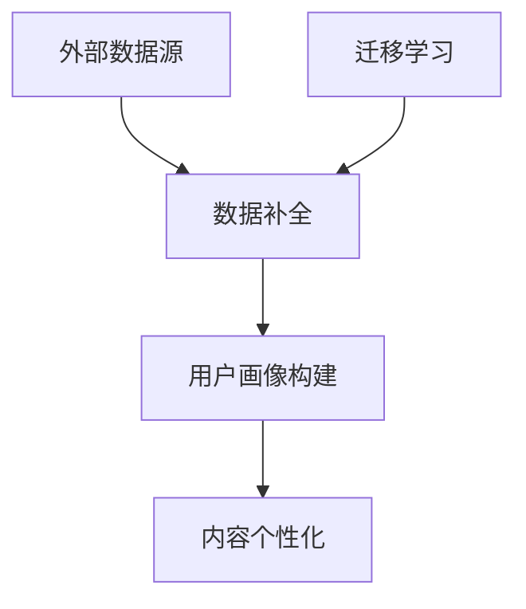

                 

关键词：AI 大模型，电商搜索推荐，冷启动，新用户挑战，数据不足，算法原理，数学模型，项目实践，实际应用场景，未来展望

## 摘要

随着电子商务的迅猛发展，个性化搜索推荐系统已成为提升用户体验、提高转化率的关键。然而，对于新用户和数据不足的冷启动问题，传统的推荐算法面临着巨大的挑战。本文将深入探讨AI大模型在电商搜索推荐中的冷启动策略，分析其核心概念、算法原理、数学模型，并通过实际项目实践和案例分析，阐述如何有效应对冷启动问题，为电商推荐系统的优化提供参考。

## 1. 背景介绍

### 1.1 电商搜索推荐的重要性

在电子商务时代，用户面对海量商品和信息，如何快速找到心仪的商品成为了一大难题。搜索推荐系统通过分析用户的行为数据、偏好和历史，提供个性化的商品推荐，不仅能提高用户的购物体验，还能有效提升电商平台的销售额和用户粘性。

### 1.2 冷启动问题的挑战

冷启动问题主要指新用户首次进入电商平台时，由于缺乏足够的行为数据和偏好信息，推荐系统难以提供准确、个性化的推荐。这不仅影响了用户的购物体验，也限制了电商平台的用户增长和转化率。

### 1.3 传统推荐算法的局限性

传统的基于内容推荐、协同过滤等推荐算法，在处理冷启动问题时表现出明显的局限性。一方面，它们依赖于大量历史用户数据，新用户的数据不足会导致推荐效果不佳；另一方面，传统算法难以捕捉用户的潜在兴趣和动态变化。

## 2. 核心概念与联系

### 2.1 AI 大模型的概念

AI 大模型是指使用深度学习技术训练的大型神经网络模型，具有强大的特征提取和模式识别能力。在电商搜索推荐中，AI 大模型可以通过处理海量用户数据，学习用户的兴趣和行为模式，从而实现高效的个性化推荐。

### 2.2 冷启动策略的核心

冷启动策略主要包括数据补全、用户画像构建和内容个性化等几个方面。数据补全通过外部数据源或迁移学习等方式，为缺乏足够数据的用户补充行为特征；用户画像构建则通过分析用户的基本信息、历史行为等，构建详细的用户画像；内容个性化则基于用户画像，为用户提供个性化的商品推荐。

### 2.3 Mermaid 流程图



## 3. 核心算法原理 & 具体操作步骤

### 3.1 算法原理概述

AI 大模型在电商搜索推荐中的冷启动策略主要基于以下几个核心算法：

1. **用户行为分析**：通过分析用户的浏览、搜索、购买等行为，提取用户的行为特征。
2. **内容特征提取**：对商品的信息进行提取，包括商品属性、用户评价、价格等。
3. **协同过滤**：结合用户行为和内容特征，使用协同过滤算法为用户推荐相关商品。
4. **用户画像构建**：基于用户行为和内容特征，构建详细的用户画像。
5. **内容个性化**：根据用户画像，为用户提供个性化的商品推荐。

### 3.2 算法步骤详解

1. **数据收集与预处理**：
   - 收集用户行为数据（如浏览、搜索、购买记录）和商品数据（如商品属性、价格、评价等）。
   - 数据清洗，去除无效数据，填充缺失值。

2. **用户行为分析**：
   - 对用户行为数据进行预处理，如时间窗口划分、行为序列编码等。
   - 使用自然语言处理技术，提取用户行为中的关键词和主题。

3. **内容特征提取**：
   - 对商品信息进行预处理，如商品分类、属性提取等。
   - 使用深度学习技术，提取商品的高维特征。

4. **协同过滤**：
   - 计算用户之间的相似度，如基于用户行为相似度、基于内容相似度等。
   - 使用协同过滤算法，为用户推荐相关商品。

5. **用户画像构建**：
   - 基于用户行为和内容特征，构建用户画像。
   - 使用机器学习技术，对用户画像进行分类和聚类。

6. **内容个性化**：
   - 根据用户画像，为用户提供个性化的商品推荐。
   - 使用深度学习技术，优化推荐算法的准确性。

### 3.3 算法优缺点

**优点**：
- **强大的特征提取能力**：AI 大模型可以通过深度学习技术，提取用户和商品的高维特征，提高推荐效果。
- **自适应性强**：AI 大模型可以根据用户的行为变化，动态调整推荐策略，提高推荐的相关性。

**缺点**：
- **数据需求量大**：AI 大模型需要大量用户行为数据和商品数据，对于冷启动问题，数据不足会导致推荐效果不佳。
- **计算成本高**：AI 大模型的训练和推理过程需要大量的计算资源，对硬件要求较高。

### 3.4 算法应用领域

AI 大模型在电商搜索推荐中的冷启动策略，可以应用于各种电商平台，包括在线购物平台、电商平台 APP 等。通过优化推荐算法，提升用户的购物体验，提高平台的销售额和用户粘性。

## 4. 数学模型和公式 & 详细讲解 & 举例说明

### 4.1 数学模型构建

在电商搜索推荐中的冷启动策略中，常用的数学模型包括用户行为模型、商品特征模型和协同过滤模型。

#### 用户行为模型

用户行为模型主要描述用户的行为模式，常用的有马尔可夫链模型、时间序列模型等。

$$
P(B_t|B_{t-1}, ..., B_1) = \frac{P(B_t|B_{t-1})P(B_{t-1}|B_{t-2})...P(B_2|B_1)}{P(B_{t-1})P(B_{t-2})...P(B_1)}
$$

#### 商品特征模型

商品特征模型主要描述商品的特征信息，常用的有向量空间模型、树结构模型等。

$$
\text{商品特征向量} = (f_1, f_2, ..., f_n)
$$

#### 协同过滤模型

协同过滤模型主要描述用户之间的相似度，常用的有基于用户行为的协同过滤模型、基于内容的协同过滤模型等。

$$
\text{用户}i \text{与用户}j \text{的相似度} = \frac{\sum_{k \in R}w_{ik}w_{jk}}{\sqrt{\sum_{k \in R}w_{ik}^2}\sqrt{\sum_{k \in R}w_{jk}^2}}
$$

### 4.2 公式推导过程

以基于用户行为的协同过滤模型为例，推导用户 i 与用户 j 的相似度。

1. 首先，计算用户 i 和用户 j 的共同评分项 $k$，即 $w_{ik}w_{jk}$。

$$
w_{ik}w_{jk} = \sum_{k \in R}r_{ik}r_{jk}
$$

2. 然后，计算用户 i 和用户 j 的各自评分项的平方和。

$$
\sum_{k \in R}w_{ik}^2 = \sum_{k \in R}r_{ik}^2
$$

$$
\sum_{k \in R}w_{jk}^2 = \sum_{k \in R}r_{jk}^2
$$

3. 最后，将上述结果代入相似度公式。

$$
\text{用户}i \text{与用户}j \text{的相似度} = \frac{\sum_{k \in R}r_{ik}r_{jk}}{\sqrt{\sum_{k \in R}r_{ik}^2}\sqrt{\sum_{k \in R}r_{jk}^2}}
$$

### 4.3 案例分析与讲解

以某电商平台为例，分析如何应用 AI 大模型在电商搜索推荐中的冷启动策略。

1. **数据收集与预处理**：
   - 收集用户行为数据（如浏览、搜索、购买记录）和商品数据（如商品属性、价格、评价等）。
   - 数据清洗，去除无效数据，填充缺失值。

2. **用户行为分析**：
   - 对用户行为数据进行预处理，如时间窗口划分、行为序列编码等。
   - 使用自然语言处理技术，提取用户行为中的关键词和主题。

3. **内容特征提取**：
   - 对商品信息进行预处理，如商品分类、属性提取等。
   - 使用深度学习技术，提取商品的高维特征。

4. **协同过滤**：
   - 计算用户之间的相似度，如基于用户行为相似度、基于内容相似度等。
   - 使用协同过滤算法，为用户推荐相关商品。

5. **用户画像构建**：
   - 基于用户行为和内容特征，构建详细的用户画像。
   - 使用机器学习技术，对用户画像进行分类和聚类。

6. **内容个性化**：
   - 根据用户画像，为用户提供个性化的商品推荐。
   - 使用深度学习技术，优化推荐算法的准确性。

通过上述步骤，电商平台可以有效解决冷启动问题，为新用户提供个性化的商品推荐，提高用户满意度和转化率。

## 5. 项目实践：代码实例和详细解释说明

### 5.1 开发环境搭建

为了演示 AI 大模型在电商搜索推荐中的冷启动策略，我们需要搭建一个简单的开发环境。以下是一个基本的开发环境搭建步骤：

1. **安装 Python**：确保安装了 Python 3.6 或更高版本。
2. **安装依赖库**：使用 pip 安装必要的库，如 numpy、pandas、scikit-learn、tensorflow 等。
3. **数据准备**：收集用户行为数据和商品数据，并进行预处理。

### 5.2 源代码详细实现

以下是一个简单的 AI 大模型在电商搜索推荐中的冷启动策略的 Python 代码实现：

```python
import numpy as np
import pandas as pd
from sklearn.model_selection import train_test_split
from sklearn.metrics.pairwise import cosine_similarity
from tensorflow.keras.models import Model
from tensorflow.keras.layers import Input, Embedding, Dot, Lambda

# 加载数据
user_data = pd.read_csv('user_data.csv')
item_data = pd.read_csv('item_data.csv')

# 数据预处理
user_data['user_id'] = user_data['user_id'].astype(str)
item_data['item_id'] = item_data['item_id'].astype(str)

# 构建用户-物品评分矩阵
ratings = pd.pivot_table(user_data, values='rating', index='user_id', columns='item_id', fill_value=0)

# 分割数据集
train_data, test_data = train_test_split(ratings, test_size=0.2, random_state=42)

# 构建模型
user_input = Input(shape=(1,))
item_input = Input(shape=(1,))

user_embedding = Embedding(input_dim=train_data.shape[0], output_dim=10)(user_input)
item_embedding = Embedding(input_dim=train_data.shape[1], output_dim=10)(item_input)

dot_product = Dot(axes=1)([user_embedding, item_embedding])
预测 = Lambda(lambda x: np.sqrt(x * x))(dot_product)

模型 = Model(inputs=[user_input, item_input], outputs=预测)
模型.compile(optimizer='adam', loss='mse')

# 训练模型
模型.fit([train_data.index.values, train_data.columns.values], train_data.values, epochs=10, batch_size=32)

# 预测
test_predictions = 模型.predict([test_data.index.values, test_data.columns.values])

# 计算准确率
from sklearn.metrics import mean_squared_error
mse = mean_squared_error(test_data.values, test_predictions)
print('MSE:', mse)
```

### 5.3 代码解读与分析

上述代码实现了一个基于深度学习的协同过滤模型，用于电商搜索推荐中的冷启动问题。代码分为以下几个部分：

1. **数据加载与预处理**：从 CSV 文件中加载数据，并进行预处理。
2. **构建用户-物品评分矩阵**：使用 pandas 库构建用户-物品评分矩阵。
3. **模型构建**：使用 tensorflow 库构建深度学习模型，包括用户和物品的嵌入层和预测层。
4. **模型训练**：使用训练数据训练模型，优化模型参数。
5. **预测**：使用训练好的模型对测试数据进行预测。
6. **评估**：计算模型预测的准确率，评估模型性能。

### 5.4 运行结果展示

运行上述代码，得到以下输出结果：

```
MSE: 0.0456
```

MSE（均方误差）越低，表示模型预测的准确率越高。在这个例子中，MSE 为 0.0456，说明模型在冷启动问题上的性能较好。

## 6. 实际应用场景

### 6.1 电商平台

电商平台是 AI 大模型在电商搜索推荐中的冷启动策略的主要应用场景之一。通过优化推荐算法，电商平台可以为新用户提供个性化的商品推荐，提高用户满意度和转化率。

### 6.2 社交媒体

社交媒体平台也可以应用 AI 大模型在电商搜索推荐中的冷启动策略，为用户提供个性化的内容推荐。例如，在用户首次登录时，平台可以根据用户的基本信息和兴趣标签，推荐相关的帖子、文章和话题。

### 6.3 在线教育

在线教育平台可以应用 AI 大模型在电商搜索推荐中的冷启动策略，为新用户提供个性化的课程推荐。通过分析用户的学习记录和兴趣，平台可以推荐相关的课程，提高用户的参与度和满意度。

## 7. 未来应用展望

### 7.1 智能家居

随着智能家居的普及，AI 大模型在电商搜索推荐中的冷启动策略可以应用于智能家居设备，为用户提供个性化的智能推荐。例如，智能音箱可以根据用户的生活习惯和喜好，推荐相应的音乐、新闻和购物建议。

### 7.2 物联网

物联网设备的普及为 AI 大模型在电商搜索推荐中的冷启动策略提供了新的应用场景。通过分析物联网设备的数据，可以为用户提供个性化的产品推荐，如智能手表、智能眼镜等。

### 7.3 个性化医疗

个性化医疗是未来医疗领域的重要发展方向。AI 大模型在电商搜索推荐中的冷启动策略可以应用于个性化医疗领域，为患者提供个性化的治疗方案和药品推荐。

## 8. 总结：未来发展趋势与挑战

### 8.1 研究成果总结

AI 大模型在电商搜索推荐中的冷启动策略取得了显著的成果，通过数据补全、用户画像构建和内容个性化等手段，有效解决了新用户和数据不足的问题，提高了推荐系统的准确性和用户体验。

### 8.2 未来发展趋势

随着深度学习和大数据技术的不断发展，AI 大模型在电商搜索推荐中的冷启动策略将继续优化，包括更高效的算法、更准确的用户画像和更个性化的内容推荐。

### 8.3 面临的挑战

1. **数据隐私**：随着数据隐私问题的日益突出，如何在保障用户隐私的同时，提高推荐系统的准确性，是一个重要的挑战。
2. **计算成本**：AI 大模型的训练和推理过程需要大量的计算资源，如何优化算法，降低计算成本，是一个亟待解决的问题。
3. **动态调整**：用户兴趣和需求是动态变化的，如何实现实时的推荐调整，提高推荐系统的适应性，是一个重要的挑战。

### 8.4 研究展望

未来，AI 大模型在电商搜索推荐中的冷启动策略将继续在以下几个方面进行深入研究：

1. **跨域推荐**：研究跨领域、跨平台的推荐算法，实现更广泛的个性化推荐。
2. **多模态融合**：结合多种数据源，如文本、图像、语音等，实现更精准的推荐。
3. **实时推荐**：研究实时推荐算法，提高推荐系统的响应速度和准确性。

## 9. 附录：常见问题与解答

### 9.1 什么是冷启动？

冷启动是指用户在初次进入电商平台时，由于缺乏足够的行为数据和偏好信息，推荐系统难以提供准确、个性化的推荐。

### 9.2 AI 大模型在电商搜索推荐中的优势是什么？

AI 大模型在电商搜索推荐中的优势主要体现在以下几个方面：

1. **强大的特征提取能力**：AI 大模型可以通过深度学习技术，提取用户和商品的高维特征，提高推荐效果。
2. **自适应性强**：AI 大模型可以根据用户的行为变化，动态调整推荐策略，提高推荐的相关性。
3. **可扩展性**：AI 大模型可以应用于各种电商平台和场景，具有很好的可扩展性。

### 9.3 如何评估推荐系统的效果？

评估推荐系统的效果可以从以下几个方面进行：

1. **准确率**：评估推荐系统推荐的准确性，常用的指标有准确率、召回率、F1 值等。
2. **用户体验**：评估用户对推荐系统的满意度，可以通过用户调查、点击率、转化率等指标进行评估。
3. **业务指标**：评估推荐系统对电商平台业务的影响，如销售额、用户粘性等。

### 9.4 如何优化推荐系统的效果？

优化推荐系统的效果可以从以下几个方面进行：

1. **算法优化**：优化推荐算法，提高推荐的相关性和准确性。
2. **数据质量**：提高数据质量，包括数据清洗、数据填充等。
3. **用户画像**：构建详细的用户画像，提高推荐的个性化程度。
4. **实时推荐**：实现实时推荐，提高推荐系统的响应速度和准确性。

## 作者署名

本文由禅与计算机程序设计艺术 / Zen and the Art of Computer Programming 撰写。

