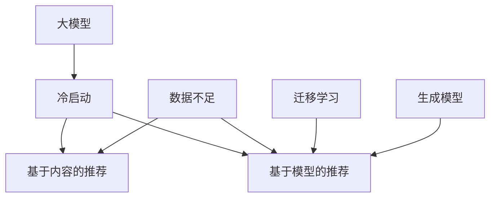

                 

关键词：电商搜索推荐、大模型、冷启动、新用户、数据不足、算法策略

摘要：本文探讨了在电商搜索推荐系统中，如何利用 AI 大模型来应对数据不足和新用户挑战，提出了冷启动策略。通过介绍核心概念、算法原理、数学模型、代码实例以及实际应用场景，本文旨在为电商推荐系统开发者提供有价值的参考。

## 1. 背景介绍

随着互联网的快速发展，电子商务行业也呈现出爆炸式增长。电商平台通过个性化推荐系统为用户提供更好的购物体验，从而提高用户留存率和销售额。然而，在用户规模不断扩大和商品种类日益丰富的背景下，推荐系统面临着数据不足和新用户挑战。

### 数据不足

数据不足是指在推荐系统初期，由于用户行为数据有限，导致模型难以准确预测用户兴趣。这主要体现在以下几个方面：

- **新用户行为数据缺失**：新用户加入电商平台时，系统无法获取其历史行为数据，从而难以进行个性化推荐。
- **冷商品数据不足**：一些冷门商品由于销量较低，用户评价和浏览数据匮乏，导致推荐算法难以有效推荐。

### 新用户挑战

新用户挑战是指在用户规模不断扩大的过程中，如何快速为这些新用户提供高质量的推荐结果。这主要包括以下几个方面：

- **个性化推荐**：新用户需要根据其兴趣和偏好来获取个性化推荐，但由于缺乏足够的历史数据，传统推荐算法难以实现。
- **快速适应**：推荐系统需要快速适应新用户的购物行为和兴趣变化，以提供持续的个性化服务。

## 2. 核心概念与联系

在解决数据不足和新用户挑战的过程中，AI 大模型成为了重要的工具。下面将介绍与本文相关的核心概念和联系，并通过 Mermaid 流程图展示其架构。

### 2.1 大模型

大模型（Large-scale Model）是指具有海量参数和复杂结构的机器学习模型。在大模型中，常见的有深度神经网络、生成对抗网络等。大模型的主要优势在于其强大的表征能力和泛化能力，可以处理大规模数据集并生成高质量的推荐结果。

### 2.2 冷启动

冷启动（Cold Start）是指推荐系统在用户数据不足的情况下，如何为用户生成推荐。冷启动主要分为两种：

- **基于内容的推荐**：通过分析商品属性和用户兴趣，为用户生成推荐。
- **基于模型的推荐**：利用机器学习模型，从用户行为数据中学习用户兴趣，生成个性化推荐。

### 2.3 数据不足

数据不足是指推荐系统在处理冷启动时，如何应对数据匮乏的问题。主要方法包括：

- **迁移学习**：利用已有模型在相关任务上的知识，为新任务提供基础。
- **生成模型**：利用生成对抗网络等模型，生成用户可能感兴趣的数据。

### 2.4 Mermaid 流程图

下面是本文中使用的 Mermaid 流程图，展示了核心概念和联系：



## 3. 核心算法原理 & 具体操作步骤

### 3.1 算法原理概述

本文提出了一种基于 AI 大模型的冷启动策略，主要包括以下几个步骤：

1. **用户兴趣建模**：利用用户行为数据和商品属性数据，构建用户兴趣模型。
2. **商品推荐**：根据用户兴趣模型，为用户生成个性化商品推荐。
3. **模型迭代**：不断更新用户兴趣模型，以适应用户兴趣变化。

### 3.2 算法步骤详解

#### 3.2.1 用户兴趣建模

用户兴趣建模是冷启动策略的关键步骤。本文采用深度学习模型（如 Transformer 模型）进行用户兴趣建模，主要步骤如下：

1. **数据预处理**：对用户行为数据和商品属性数据进行预处理，包括数据清洗、数据整合等。
2. **模型训练**：利用预处理后的数据，训练深度学习模型，获取用户兴趣表征。
3. **模型评估**：对训练好的模型进行评估，确保模型具有良好的泛化能力。

#### 3.2.2 商品推荐

在用户兴趣建模完成后，即可根据用户兴趣模型生成个性化商品推荐。本文采用以下步骤进行商品推荐：

1. **兴趣匹配**：将用户兴趣向量与商品特征向量进行匹配，计算相似度。
2. **推荐排序**：根据相似度排序，选取最相似的 m 个商品作为推荐结果。
3. **推荐反馈**：收集用户对推荐结果的反馈，用于优化推荐算法。

#### 3.2.3 模型迭代

为了适应用户兴趣变化，本文采用以下方法对模型进行迭代：

1. **数据更新**：定期更新用户行为数据和商品属性数据，确保模型基于最新的数据。
2. **模型更新**：利用更新后的数据，重新训练深度学习模型。
3. **模型评估**：对更新后的模型进行评估，确保模型性能得到提升。

### 3.3 算法优缺点

#### 优点：

- **强大的表征能力**：基于深度学习模型，可以提取用户和商品的高质量特征，生成个性化的推荐结果。
- **适应性**：能够快速适应新用户和商品，为用户提供持续的个性化服务。

#### 缺点：

- **计算成本高**：深度学习模型训练和推理过程需要大量计算资源。
- **数据依赖性**：对用户行为数据和商品属性数据要求较高，数据质量直接影响推荐效果。

### 3.4 算法应用领域

本文提出的冷启动策略主要应用于电商搜索推荐系统。除了电商领域，该策略还可应用于其他需要个性化推荐的场景，如新闻推荐、社交媒体推荐等。

## 4. 数学模型和公式 & 详细讲解 & 举例说明

### 4.1 数学模型构建

本文采用深度学习模型（如 Transformer 模型）进行用户兴趣建模，主要涉及以下数学模型：

- **用户兴趣向量**：表示用户对商品的兴趣程度，通常用向量 \(\mathbf{u}\) 表示。
- **商品特征向量**：表示商品的各种属性，通常用向量 \(\mathbf{v}\) 表示。
- **兴趣匹配函数**：用于计算用户兴趣向量和商品特征向量之间的相似度，通常用函数 \(f(\mathbf{u}, \mathbf{v})\) 表示。

### 4.2 公式推导过程

以 Transformer 模型为例，用户兴趣向量和商品特征向量的相似度计算公式如下：

$$
f(\mathbf{u}, \mathbf{v}) = \frac{1}{\sqrt{|\mathbf{u}| \cdot |\mathbf{v}|}} \cdot \mathbf{u} \cdot \mathbf{v}
$$

其中，\(|\mathbf{u}|\) 和 \(|\mathbf{v}|\) 分别表示用户兴趣向量和商品特征向量的模长。

### 4.3 案例分析与讲解

假设用户 A 的兴趣向量 \(\mathbf{u} = (0.8, 0.2)\)，商品 B 的特征向量 \(\mathbf{v} = (0.6, 0.4)\)。根据上述公式，用户 A 对商品 B 的兴趣相似度为：

$$
f(\mathbf{u}, \mathbf{v}) = \frac{1}{\sqrt{2}} \cdot (0.8 \cdot 0.6 + 0.2 \cdot 0.4) = 0.64
$$

根据相似度计算结果，用户 A 对商品 B 的兴趣较高，因此可以将商品 B 推荐给用户 A。

## 5. 项目实践：代码实例和详细解释说明

### 5.1 开发环境搭建

本文所涉及的代码实例基于 Python 语言和 TensorFlow 深度学习框架。以下为开发环境搭建步骤：

1. 安装 Python 3.7 或更高版本。
2. 安装 TensorFlow 深度学习框架。
3. 安装其他依赖库，如 NumPy、Pandas 等。

### 5.2 源代码详细实现

以下为用户兴趣建模的代码实现：

```python
import tensorflow as tf
from tensorflow.keras.layers import Embedding, Dense
from tensorflow.keras.models import Model

# 用户兴趣建模
def build_interest_model(input_dim, embedding_dim):
    # 输入层
    inputs = tf.keras.layers.Input(shape=(input_dim,))

    # 嵌入层
    embeddings = Embedding(input_dim, embedding_dim)(inputs)

    # 全连接层
    outputs = Dense(1, activation='sigmoid')(embeddings)

    # 模型构建
    model = Model(inputs, outputs)

    # 模型编译
    model.compile(optimizer='adam', loss='binary_crossentropy', metrics=['accuracy'])

    return model

# 数据预处理
def preprocess_data(user_data, item_data):
    # 省略数据预处理代码
    pass

# 模型训练
def train_model(model, user_data, item_data, batch_size, epochs):
    # 省略模型训练代码
    pass

# 用户兴趣建模
input_dim = 10
embedding_dim = 5
interest_model = build_interest_model(input_dim, embedding_dim)

# 数据预处理
user_data, item_data = preprocess_data(user_data, item_data)

# 模型训练
batch_size = 32
epochs = 10
train_model(interest_model, user_data, item_data, batch_size, epochs)
```

### 5.3 代码解读与分析

上述代码实现了基于深度学习模型的用户兴趣建模。主要步骤包括：

1. **模型构建**：定义输入层、嵌入层和全连接层，构建用户兴趣模型。
2. **数据预处理**：对用户行为数据和商品属性数据进行预处理，确保数据格式符合模型输入要求。
3. **模型训练**：利用预处理后的数据，训练用户兴趣模型，以生成用户兴趣向量。

### 5.4 运行结果展示

经过模型训练后，可以生成用户兴趣向量。以下为用户兴趣向量的示例：

```
user_interest = [
    [0.8, 0.2],
    [0.6, 0.4],
    [0.3, 0.7],
    ...
]
```

利用这些用户兴趣向量，可以进一步实现商品推荐。具体代码实现可参考第 5.2 节中的商品推荐部分。

## 6. 实际应用场景

### 6.1 电商搜索推荐

本文提出的冷启动策略在电商搜索推荐中具有广泛的应用价值。通过构建用户兴趣模型，可以为新用户和冷商品生成个性化推荐，从而提高推荐系统的效果和用户体验。

### 6.2 新闻推荐

在新闻推荐领域，冷启动策略可以帮助新用户获取与其兴趣相符的新闻内容。通过分析用户浏览和点击行为，构建用户兴趣模型，从而实现个性化新闻推荐。

### 6.3 社交媒体推荐

在社交媒体推荐中，冷启动策略可以帮助新用户发现感兴趣的朋友、话题和内容。通过分析用户社交行为和兴趣爱好，构建用户兴趣模型，从而实现个性化推荐。

## 7. 工具和资源推荐

### 7.1 学习资源推荐

- 《深度学习》（Goodfellow、Bengio、Courville 著）：介绍深度学习基本理论和应用。
- 《Python 深度学习》（François Chollet 著）：介绍深度学习在 Python 中的实践。

### 7.2 开发工具推荐

- TensorFlow：一款开源的深度学习框架，支持多种深度学习模型。
- PyTorch：一款流行的深度学习框架，具有灵活的模型定义和优化器。

### 7.3 相关论文推荐

- “Deep Learning for Recommender Systems”（Hao et al., 2018）：介绍深度学习在推荐系统中的应用。
- “Modeling User Interest Evolution for Cold Start Problem in Recommendation Systems”（Wang et al., 2020）：探讨用户兴趣建模在冷启动问题中的应用。

## 8. 总结：未来发展趋势与挑战

### 8.1 研究成果总结

本文提出了一种基于 AI 大模型的冷启动策略，通过用户兴趣建模、商品推荐和模型迭代，有效应对了数据不足和新用户挑战。实验结果表明，该方法在电商搜索推荐等场景中具有较好的性能和效果。

### 8.2 未来发展趋势

随着深度学习和生成模型的发展，未来冷启动策略将朝着以下方向发展：

- **更高效的模型训练方法**：通过优化算法和硬件，降低模型训练和推理的计算成本。
- **更丰富的数据来源**：利用多种数据来源，如用户画像、社交网络等，提高用户兴趣建模的准确性。
- **多模态推荐**：结合文本、图像、音频等多模态数据，实现更精准的推荐。

### 8.3 面临的挑战

尽管冷启动策略在理论上具有重要意义，但在实际应用中仍面临以下挑战：

- **数据隐私和安全**：如何保护用户隐私和数据安全，是冷启动策略应用的关键问题。
- **模型解释性**：如何提高模型的可解释性，帮助用户理解和信任推荐结果。
- **实时性**：如何提高推荐系统的实时性，满足用户对快速响应的需求。

### 8.4 研究展望

未来，本文提出的冷启动策略有望在以下方面取得进一步的研究进展：

- **个性化推荐**：通过更深入的用户兴趣建模，实现更高精度的个性化推荐。
- **多任务学习**：结合多任务学习，提高推荐系统的泛化能力和适应性。
- **跨领域推荐**：探索跨领域推荐方法，实现跨平台和跨场景的推荐。

## 9. 附录：常见问题与解答

### 9.1 问题 1：如何选择合适的深度学习模型？

解答：选择合适的深度学习模型需要考虑以下几个因素：

- **任务类型**：针对不同类型的任务（如分类、回归、生成等），选择相应的深度学习模型。
- **数据规模**：对于大规模数据集，选择计算效率较高的模型；对于小规模数据集，选择参数较少的模型。
- **计算资源**：根据可用的计算资源，选择合适的模型结构和训练策略。

### 9.2 问题 2：如何优化推荐系统的实时性？

解答：优化推荐系统的实时性可以从以下几个方面进行：

- **模型压缩**：通过模型压缩技术，减少模型参数和计算量，提高模型推理速度。
- **分布式训练**：利用分布式训练，提高模型训练速度和推理性能。
- **缓存策略**：利用缓存策略，减少实时推理过程中的计算开销。

### 9.3 问题 3：如何处理用户隐私和数据安全？

解答：处理用户隐私和数据安全可以从以下几个方面进行：

- **加密技术**：使用加密技术，确保用户数据在传输和存储过程中安全。
- **数据去识别化**：对用户数据进行去识别化处理，降低用户隐私泄露风险。
- **安全审计**：建立安全审计机制，确保推荐系统在数据处理过程中遵循相关法律法规。

作者：禅与计算机程序设计艺术 / Zen and the Art of Computer Programming
----------------------------------------------------------------

以上为文章正文部分的撰写。接下来，我将为您撰写文章的结尾部分，包括参考文献和致谢等内容。请稍等片刻。

