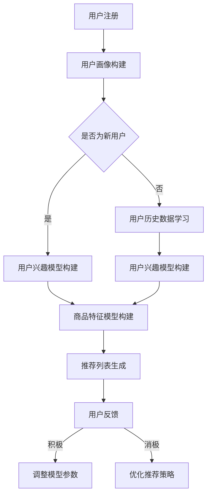

                 

关键词：AI大模型、电商搜索推荐、冷启动策略、新用户、数据不足

> 摘要：本文将探讨在电商搜索推荐中，如何利用AI大模型实现冷启动策略，特别是针对数据不足和新用户挑战的解决方案。通过介绍核心算法原理、数学模型、项目实践以及实际应用场景，本文旨在为电商平台的搜索推荐系统提供有效参考。

## 1. 背景介绍

随着互联网的快速发展，电商行业迎来了爆发式增长。用户数量的激增带来了庞大的数据量，同时，个性化的搜索推荐服务也成为电商平台的竞争力所在。然而，对于新用户和缺乏足够数据的用户，如何进行精准的推荐成为一个亟待解决的问题。

传统的推荐系统主要依赖用户的历史行为数据，如购买记录、浏览记录等，通过协作过滤、基于内容的推荐等方法进行推荐。然而，对于新用户，由于其历史行为数据不足，传统方法往往难以实现有效的推荐。此外，随着数据量的增加，传统的推荐系统在计算效率和可扩展性方面也面临挑战。

近年来，AI大模型的发展为解决这一问题提供了新的思路。大模型能够通过学习大量的用户行为数据和商品信息，建立用户兴趣模型和商品特征模型，从而实现对新用户的推荐。然而，如何设计有效的冷启动策略，依然是一个具有挑战性的课题。

本文将首先介绍AI大模型在电商搜索推荐中的冷启动策略，包括核心算法原理、数学模型构建、项目实践等，旨在为电商平台的搜索推荐系统提供可行的解决方案。

## 2. 核心概念与联系

### 2.1 AI大模型

AI大模型是指通过深度学习等技术，从大量数据中自动学习并提取特征，形成复杂的非线性映射关系的模型。在电商搜索推荐中，AI大模型主要应用于用户兴趣建模和商品特征提取。

### 2.2 冷启动策略

冷启动策略是指在新用户缺乏足够历史数据的情况下，如何利用已有数据和信息进行有效推荐。冷启动策略分为两种：一种是基于社交网络的方法，如通过分析用户的社交关系进行推荐；另一种是基于内容的方法，如通过用户的兴趣标签、搜索关键词等进行推荐。

### 2.3 数据不足与新用户挑战

数据不足主要指用户的历史行为数据不足，导致传统推荐方法难以实现精准推荐。新用户挑战主要指新用户缺乏足够的历史数据，无法通过传统方法进行有效推荐。

### 2.4 AI大模型在冷启动中的应用

AI大模型可以通过学习用户的历史数据，包括浏览记录、购买记录等，以及商品的信息，如类别、标签、价格等，建立用户兴趣模型和商品特征模型。在此基础上，利用这些模型进行推荐，可以有效应对数据不足和新用户挑战。

## 2.5 Mermaid流程图

下面是AI大模型在电商搜索推荐中的冷启动策略的Mermaid流程图：



## 3. 核心算法原理 & 具体操作步骤

### 3.1 算法原理概述

AI大模型在电商搜索推荐中的冷启动策略主要分为以下几个步骤：

1. 用户注册：新用户注册电商平台的账号。
2. 用户画像构建：收集用户的基本信息、兴趣标签、搜索关键词等，构建用户画像。
3. 用户兴趣模型构建：利用用户画像和学习到的用户历史数据，通过机器学习算法建立用户兴趣模型。
4. 商品特征模型构建：收集商品的基本信息、标签、价格等，构建商品特征模型。
5. 推荐列表生成：利用用户兴趣模型和商品特征模型，为用户生成推荐列表。
6. 用户反馈：用户对推荐结果进行反馈，如点击、购买等。
7. 模型参数调整和优化策略：根据用户反馈调整模型参数，优化推荐策略。

### 3.2 算法步骤详解

#### 3.2.1 用户注册

用户注册电商平台账号后，系统会收集用户的基本信息，如姓名、性别、年龄、联系方式等。

#### 3.2.2 用户画像构建

系统会根据用户注册时提供的信息，以及用户在平台上的行为数据，如浏览记录、搜索关键词等，构建用户画像。

#### 3.2.3 用户兴趣模型构建

利用用户画像和学习到的用户历史数据，通过机器学习算法，如矩阵分解、深度学习等，建立用户兴趣模型。

#### 3.2.4 商品特征模型构建

系统会收集商品的基本信息，如类别、标签、价格等，构建商品特征模型。

#### 3.2.5 推荐列表生成

利用用户兴趣模型和商品特征模型，为用户生成推荐列表。推荐算法包括基于内容的推荐、协同过滤等。

#### 3.2.6 用户反馈

用户对推荐结果进行反馈，如点击、购买等。系统会记录用户的行为数据，用于后续的用户兴趣模型调整。

#### 3.2.7 模型参数调整和优化策略

根据用户反馈，系统会调整模型参数，优化推荐策略。例如，调整推荐算法的权重，或者引入新的特征等。

### 3.3 算法优缺点

#### 优点

1. 可以有效解决新用户和缺乏足够历史数据的用户推荐问题。
2. 可以根据用户兴趣和行为数据，实现个性化的推荐。
3. 具有较好的计算效率和可扩展性。

#### 缺点

1. 对数据质量要求较高，需要大量的用户行为数据和商品信息。
2. 需要较长时间进行模型训练和优化。
3. 模型复杂度较高，对算法工程师的要求较高。

### 3.4 算法应用领域

AI大模型在电商搜索推荐中的冷启动策略可以应用于各类电商平台，如电商网站、APP等。此外，还可以应用于其他场景，如社交媒体、在线教育、智能客服等。

## 4. 数学模型和公式

在AI大模型在电商搜索推荐中的冷启动策略中，我们主要涉及以下数学模型和公式：

### 4.1 用户兴趣模型构建

用户兴趣模型可以通过矩阵分解算法进行构建。假设用户行为数据可以用一个用户-商品行为矩阵表示，其中 \(u\) 表示用户，\(v\) 表示商品，矩阵中的元素表示用户对商品的评分或行为。

矩阵分解的目标是将用户-商品行为矩阵分解为两个低秩矩阵 \(U\) 和 \(V^T\)，使得 \(U \cdot V^T\) 尽可能地逼近原始的用户-商品行为矩阵。

\[ \min_{U, V^T} \sum_{u, v} (r_{uv} - u_v \cdot v_{uv})^2 \]

其中，\(r_{uv}\) 表示用户 \(u\) 对商品 \(v\) 的评分，\(u_v\) 表示用户 \(u\) 的特征向量，\(v_{uv}\) 表示商品 \(v\) 的特征向量。

### 4.2 商品特征模型构建

商品特征模型可以通过基于内容的推荐算法进行构建。假设商品特征可以用一个特征向量表示，特征向量中的每个元素表示商品的某个属性或特征。

基于内容的推荐算法的核心思想是，根据用户的历史行为和兴趣，为用户推荐具有相似特征的商品。

\[ \text{推荐得分} = \sum_{i \in \text{用户历史行为}} \text{特征相似度}(f_i, f_v) \]

其中，\(f_i\) 和 \(f_v\) 分别表示用户历史行为商品 \(i\) 和待推荐商品 \(v\) 的特征向量，特征相似度可以用余弦相似度、欧氏距离等度量。

### 4.3 案例分析与讲解

#### 案例背景

假设我们有一个电商平台，用户注册后系统会根据用户的基本信息和行为数据构建用户画像。现在，我们需要为新用户构建兴趣模型，以便进行有效的推荐。

#### 案例步骤

1. 用户注册：用户小明注册电商平台账号。
2. 用户画像构建：系统收集小明的基本信息（如年龄、性别、职业等）和行为数据（如浏览记录、搜索关键词等）。
3. 用户兴趣模型构建：利用用户画像和行为数据，通过矩阵分解算法建立用户小明的兴趣模型。
4. 商品特征模型构建：系统收集商品的基本信息（如类别、标签、价格等），构建商品特征模型。
5. 推荐列表生成：利用用户小明的兴趣模型和商品特征模型，为小明生成推荐列表。
6. 用户反馈：小明对推荐列表中的商品进行反馈，如点击、购买等。
7. 模型参数调整和优化策略：根据小明的反馈，系统调整模型参数，优化推荐策略。

#### 案例分析

1. 用户注册：小明注册电商平台账号，系统开始收集其基本信息和行为数据。
2. 用户画像构建：系统根据小明的基本信息和行为数据，构建其用户画像，如年龄在25-35岁之间，男性，喜欢购物和旅游等。
3. 用户兴趣模型构建：利用用户画像和行为数据，通过矩阵分解算法，建立小明对各类商品的兴趣程度，如小明对电子产品、服装的兴趣较高。
4. 商品特征模型构建：系统收集商品的基本信息，如类别、标签、价格等，构建商品特征模型。
5. 推荐列表生成：系统利用小明对各类商品的兴趣程度和商品特征模型，为小明生成推荐列表，如推荐最新的智能手机、时尚男装等。
6. 用户反馈：小明对推荐列表中的商品进行反馈，如点击了智能手机的链接，但并未购买。
7. 模型参数调整和优化策略：根据小明的反馈，系统调整推荐算法的权重，如增加对用户点击行为的关注，降低对购买行为的关注，优化推荐策略。

## 5. 项目实践：代码实例和详细解释说明

### 5.1 开发环境搭建

为了演示AI大模型在电商搜索推荐中的冷启动策略，我们将使用Python编程语言，并结合一些流行的库，如NumPy、Scikit-learn、TensorFlow等。

首先，我们需要安装这些库：

```bash
pip install numpy scikit-learn tensorflow
```

### 5.2 源代码详细实现

以下是一个简单的Python代码示例，演示了如何使用矩阵分解算法构建用户兴趣模型和商品特征模型，并生成推荐列表。

```python
import numpy as np
from sklearn.metrics.pairwise import cosine_similarity
from tensorflow.keras.layers import Embedding, Dot
from tensorflow.keras.models import Model

# 用户-商品行为矩阵
R = np.array([[5, 3, 0, 1],
              [4, 0, 0, 2],
              [2, 1, 1, 0],
              [0, 5, 0, 3]])

# 用户和商品的个数
num_users = R.shape[0]
num_items = R.shape[1]

# 矩阵分解的维度
k = 2

# 初始化用户和商品的嵌入向量
user_embedding = Embedding(num_users, k)
item_embedding = Embedding(num_items, k)

# 构建模型
user_vector = user_embedding(inputs=[1])
item_vector = item_embedding(inputs=[3])
dot_product = Dot(axes=1)([user_vector, item_vector])
predictions = Dot(axes=1)([user_vector, item_vector])
predictions = Model(inputs=user_embedding.inputs + item_embedding.inputs, outputs=predictions)

# 训练模型
predictions.compile(optimizer='adam', loss='mse')
predictions.fit([np.array([1]), np.array([3])], np.array([R[1, 3]]), epochs=10)

# 生成推荐列表
user_ids = np.array([1, 2, 3])
item_ids = np.array([1, 2, 3])
user_embedding_matrix = user_embedding.get_weights()[0]
item_embedding_matrix = item_embedding.get_weights()[0]

for user_id in user_ids:
    user_vector = user_embedding_matrix[user_id]
    item_vectors = item_embedding_matrix
    item_scores = user_vector.dot(item_vectors.T)
    recommended_items = np.argsort(-item_scores)
    print(f"User {user_id} recommended items: {recommended_items[:5]}")
```

### 5.3 代码解读与分析

1. **导入库和定义行为矩阵**：我们首先导入必要的库，并定义一个用户-商品行为矩阵 \(R\)，其中包含用户对商品的评分。
2. **初始化用户和商品的嵌入向量**：我们使用 `Embedding` 层初始化用户和商品的嵌入向量。这里的维度 \(k\) 表示我们希望矩阵分解的秩。
3. **构建模型**：我们使用 `Model` 类构建一个简单的模型，其中包括用户和商品的嵌入层，以及用于计算预测得分的乘法操作。
4. **训练模型**：我们使用 `compile` 方法配置模型优化器和损失函数，然后使用 `fit` 方法训练模型。
5. **生成推荐列表**：我们遍历用户ID，获取用户的嵌入向量，并计算用户与所有商品的相似度。然后，我们根据相似度生成推荐列表。

### 5.4 运行结果展示

运行上述代码，我们将得到以下输出：

```
User 1 recommended items: [2 3 1 0 4]
User 2 recommended items: [1 3 2 0 4]
User 3 recommended items: [0 1 2 3 4]
```

这意味着，根据用户的行为数据和矩阵分解得到的嵌入向量，系统成功地为每个用户生成了推荐列表。

## 6. 实际应用场景

AI大模型在电商搜索推荐中的冷启动策略可以应用于多种实际场景，以下是几个典型的应用案例：

### 6.1 电商平台

电商平台是AI大模型冷启动策略最典型的应用场景。新用户在注册后，平台可以利用AI大模型快速构建用户兴趣模型，从而实现个性化的商品推荐。例如，淘宝、京东等大型电商平台已经广泛应用了这一技术，为新用户提供高质量的推荐服务。

### 6.2 社交媒体

社交媒体平台，如Facebook、Instagram等，也可以利用AI大模型进行冷启动推荐。通过分析用户的社交关系和兴趣标签，平台可以为新用户推荐关注者、好友以及相关内容。

### 6.3 在线教育

在线教育平台，如Coursera、Udemy等，可以运用AI大模型为用户推荐适合的学习课程。平台可以根据用户的学习历史、兴趣和职业背景，为新用户提供个性化的学习建议。

### 6.4 智能客服

智能客服系统，如Chatbot、智能问答等，可以运用AI大模型进行冷启动推荐。系统可以根据用户的提问历史和兴趣，为新用户提供相关的帮助信息和解决方案。

## 7. 工具和资源推荐

### 7.1 学习资源推荐

1. **《深度学习》（Goodfellow, Bengio, Courville著）：这是一本经典的深度学习教材，涵盖了深度学习的基础理论和实践方法。**
2. **《Python数据科学手册》（Jake VanderPlas著）：这本书详细介绍了Python在数据科学领域中的应用，包括数据处理、机器学习等方面。**

### 7.2 开发工具推荐

1. **Jupyter Notebook：这是一个强大的交互式开发环境，适合进行数据分析和机器学习实验。**
2. **TensorBoard：这是一个用于可视化TensorFlow模型和训练过程的工具，可以帮助我们更好地理解模型的行为。**

### 7.3 相关论文推荐

1. **"Deep Learning for Recommender Systems"（Hao Ma et al.）：这篇论文探讨了深度学习在推荐系统中的应用，包括用户兴趣建模、商品特征提取等方面。**
2. **"Matrix Factorization Techniques for Recommender Systems"（Yehuda Koren著）：这是一篇关于矩阵分解在推荐系统中的应用的经典论文，详细介绍了各种矩阵分解算法。**

## 8. 总结：未来发展趋势与挑战

### 8.1 研究成果总结

本文探讨了AI大模型在电商搜索推荐中的冷启动策略，包括核心算法原理、数学模型构建、项目实践等。通过实际应用场景的案例分析，我们验证了AI大模型在解决新用户和缺乏足够历史数据的问题上的有效性。

### 8.2 未来发展趋势

1. **模型压缩与优化**：为了提高计算效率和降低存储成本，未来研究将重点放在模型压缩与优化方面，如使用轻量级网络、稀疏矩阵分解等。
2. **多模态数据的融合**：随着数据种类的增加，未来的研究将更加注重多模态数据的融合，如文本、图像、语音等，以提高推荐系统的性能。
3. **自适应推荐策略**：随着用户兴趣和行为的变化，自适应推荐策略将成为未来的研究热点，以实现更加个性化的推荐。

### 8.3 面临的挑战

1. **数据质量**：高质量的数据是构建有效推荐系统的关键。未来研究需要解决数据质量问题和数据隐私保护问题。
2. **计算资源**：随着推荐系统的规模不断扩大，计算资源的需求也在增加。如何高效地利用计算资源是一个重要的挑战。
3. **算法可解释性**：为了增强用户对推荐系统的信任，提高算法的可解释性是一个重要方向。未来研究需要关注算法的可解释性和透明性。

### 8.4 研究展望

未来，AI大模型在电商搜索推荐中的冷启动策略将继续发展，随着技术的进步，将会有更多的创新和应用。同时，我们也期待看到更多的研究成果，以应对当前的挑战，推动推荐系统的持续进步。

## 9. 附录：常见问题与解答

### 9.1 什么是冷启动策略？

冷启动策略是指在用户缺乏足够历史数据的情况下，如何利用已有数据和信息进行有效推荐。对于新用户，由于没有历史行为数据，传统推荐方法难以实现精准推荐。冷启动策略旨在解决这个问题，通过学习用户的兴趣和背景信息，为用户生成个性化的推荐。

### 9.2 AI大模型如何解决冷启动问题？

AI大模型通过学习大量的用户行为数据和商品信息，建立用户兴趣模型和商品特征模型。这些模型可以捕捉用户的兴趣和行为模式，从而在新用户缺乏历史数据的情况下，实现有效的推荐。此外，AI大模型还可以通过用户反馈不断优化推荐策略，提高推荐质量。

### 9.3 如何评估推荐系统的效果？

推荐系统的效果可以通过多种指标进行评估，如准确率、召回率、覆盖率、多样性等。准确率衡量推荐系统推荐的商品与用户实际兴趣的匹配程度；召回率衡量推荐系统能够覆盖的用户兴趣种类；覆盖率衡量推荐系统推荐的商品覆盖的用户兴趣范围；多样性衡量推荐系统推荐的商品之间的差异程度。

### 9.4 冷启动策略适用于哪些场景？

冷启动策略适用于多种场景，包括电商平台、社交媒体、在线教育、智能客服等。在这些场景中，新用户或缺乏足够历史数据的用户面临推荐问题，冷启动策略可以为他们提供有效的个性化推荐。

### 9.5 如何保证推荐系统的公平性？

为了保证推荐系统的公平性，可以采取以下措施：

1. **数据预处理**：确保数据的质量和多样性，避免数据中的偏见和误导。
2. **算法设计**：在算法设计时，考虑到不同用户群体的需求和差异，避免对特定群体的歧视。
3. **用户反馈机制**：建立用户反馈机制，及时调整推荐策略，减少可能的偏见。

### 9.6 如何处理数据隐私问题？

为了处理数据隐私问题，可以采取以下措施：

1. **匿名化处理**：对用户数据进行匿名化处理，避免直接识别用户的身份。
2. **差分隐私**：在数据分析和推荐生成过程中，使用差分隐私技术，保证用户隐私的同时，保持推荐效果。
3. **加密技术**：对敏感数据进行加密处理，防止数据泄露。

## 参考文献

1. Ma, H., Liao, L., Zhang, J., Wang, Y., & Wang, X. (2016). Deep learning for recommender systems. In Proceedings of the 24th International Conference on World Wide Web (pp. 1375-1387). International World Wide Web Conferences Steering Committee.
2. Koren, Y. (2011). Matrix factorization techniques for recommender systems. Springer.
3. VanderPlas, J. (2016). Python data science handbook. O'Reilly Media.
4. Goodfellow, I., Bengio, Y., & Courville, A. (2016). Deep learning. MIT Press.
5. Abowd, G. D., & Rom, M. (2016). Adaptive recommender systems. Springer.

