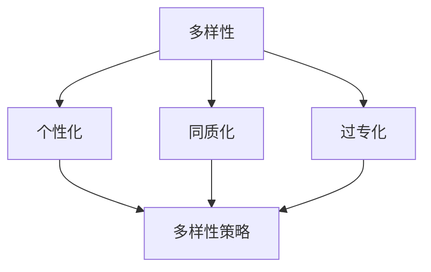

                 

关键词：AI大模型、电商搜索推荐、多样性策略、同质化、过专问题

摘要：随着人工智能技术的不断发展，大模型在电商搜索推荐中的应用越来越广泛。然而，大模型在提供个性化推荐的同时，也存在同质化和过专化的问题。本文将探讨AI大模型在电商搜索推荐中的多样性策略，以避免同质化和过专化问题，提高推荐效果。

## 1. 背景介绍

电商搜索推荐是电子商务领域的关键环节，它能够根据用户的兴趣和行为，为用户提供个性化的商品推荐。随着AI技术的发展，尤其是大模型的兴起，电商搜索推荐的精度和效果得到了显著提升。然而，大模型在提供个性化推荐的同时，也存在一些问题。

### 1.1 同质化问题

同质化问题指的是推荐结果在用户群体中过于相似，缺乏多样性。这会导致用户感到厌倦，降低用户满意度和留存率。例如，当所有用户都收到相似的推荐商品时，用户会感到这些推荐缺乏个性化和新颖性。

### 1.2 过专化问题

过专化问题指的是推荐结果过于专注于某一类商品，忽略了其他潜在的兴趣点。这可能导致用户错过其他可能感兴趣的商品，从而降低推荐的价值。例如，如果一个用户一直收到某一类商品的推荐，而忽略了其他种类的商品，这可能导致用户的兴趣范围变得狭窄。

### 1.3 大模型的优势

大模型具有强大的学习能力，可以处理大量数据，从而提供更加精准的个性化推荐。然而，这也带来了同质化和过专化的问题。因此，如何在大模型中实现多样性策略，成为当前研究的热点。

## 2. 核心概念与联系

为了解决同质化和过专化问题，我们需要引入一些核心概念，并理解它们之间的联系。

### 2.1 多样性

多样性指的是推荐结果在用户群体中的差异性和新颖性。多样性的实现可以避免用户感到厌倦，提高用户满意度和留存率。

### 2.2 个性化

个性化指的是推荐结果根据用户的兴趣和行为进行定制。个性化的实现可以提高推荐的相关性，增加用户对推荐商品的满意度。

### 2.3 同质化与多样性的关系

同质化和多样性是一对相对的概念。同质化问题会导致多样性下降，而过专化问题则会导致多样性不足。因此，解决同质化和过专化问题，实际上是实现多样性和个性化的平衡。

### 2.4 多样性策略

多样性策略指的是一系列技术手段，用于在推荐过程中增加多样性，避免同质化和过专化问题。这些策略包括：

- **内容多样性**：通过引入不同类型的内容，如商品、文章、视频等，增加推荐结果的多样性。
- **用户多样性**：通过分析用户的兴趣和行为，为不同类型的用户提供不同的推荐结果，增加用户之间的差异性。
- **情境多样性**：通过考虑用户的情境，如时间、地点、使用设备等，为用户提供更加贴近实际需求的推荐。

### 2.5 核心概念与联系的 Mermaid 流程图



## 3. 核心算法原理 & 具体操作步骤

### 3.1 算法原理概述

为了实现多样性策略，我们需要引入一些核心算法。这些算法包括：

- **协同过滤算法**：通过分析用户的行为和偏好，预测用户对未知商品的兴趣。
- **内容相似度算法**：通过分析商品的特征，计算商品之间的相似度。
- **情境感知算法**：通过分析用户的情境信息，为用户提供更加个性化的推荐。

### 3.2 算法步骤详解

#### 3.2.1 协同过滤算法

协同过滤算法主要包括以下步骤：

1. **用户行为数据收集**：收集用户的浏览、购买、评价等行为数据。
2. **用户相似度计算**：计算用户之间的相似度，可以使用余弦相似度、皮尔逊相关系数等方法。
3. **预测用户兴趣**：根据用户相似度，预测用户对未知商品的兴趣。
4. **生成推荐结果**：根据预测的兴趣，生成推荐结果。

#### 3.2.2 内容相似度算法

内容相似度算法主要包括以下步骤：

1. **商品特征提取**：提取商品的文本、图片、视频等特征。
2. **特征向量计算**：计算商品的特征向量。
3. **相似度计算**：计算商品之间的相似度，可以使用余弦相似度、欧氏距离等方法。
4. **生成推荐结果**：根据相似度，生成推荐结果。

#### 3.2.3 情境感知算法

情境感知算法主要包括以下步骤：

1. **情境信息收集**：收集用户的时间、地点、使用设备等情境信息。
2. **情境分析**：分析用户的情境信息，判断用户的需求。
3. **生成推荐结果**：根据情境分析结果，生成推荐结果。

### 3.3 算法优缺点

#### 3.3.1 协同过滤算法

优点：

- **高效性**：协同过滤算法可以在短时间内处理大量用户数据。
- **可扩展性**：协同过滤算法可以扩展到不同类型的应用场景。

缺点：

- **同质化问题**：协同过滤算法可能导致推荐结果过于相似。
- **过专化问题**：协同过滤算法可能导致推荐结果过于专注于某一类商品。

#### 3.3.2 内容相似度算法

优点：

- **多样性**：内容相似度算法可以提供多样化的推荐结果。
- **新颖性**：内容相似度算法可以推荐一些用户未曾见过的商品。

缺点：

- **计算复杂度**：内容相似度算法的计算复杂度较高，可能影响推荐速度。
- **数据依赖性**：内容相似度算法对商品特征数据依赖较高，数据质量对算法效果有较大影响。

#### 3.3.3 情境感知算法

优点：

- **个性化**：情境感知算法可以根据用户的情境，为用户提供更加个性化的推荐。
- **适应性**：情境感知算法可以适应不同情境下的用户需求。

缺点：

- **准确性**：情境感知算法的准确性可能受到情境信息收集和处理的影响。
- **实时性**：情境感知算法需要实时分析用户的情境信息，可能对实时性要求较高的应用场景产生影响。

### 3.4 算法应用领域

协同过滤算法、内容相似度算法和情境感知算法可以广泛应用于电商搜索推荐、社交媒体推荐、音乐推荐等领域。通过结合多种算法，可以实现更加多样化和个性化的推荐结果，提高用户体验和满意度。

## 4. 数学模型和公式 & 详细讲解 & 举例说明

### 4.1 数学模型构建

为了实现多样性策略，我们可以构建以下数学模型：

- **用户兴趣模型**：表示用户对各类商品的兴趣程度。
- **商品相似度模型**：表示商品之间的相似度。
- **情境模型**：表示用户的情境信息。

### 4.2 公式推导过程

#### 4.2.1 用户兴趣模型

假设用户 \(u\) 对商品 \(i\) 的兴趣程度为 \(I_{ui}\)，我们可以使用以下公式进行计算：

\[ I_{ui} = \sum_{j \in R(u)} w_{ij} \]

其中，\(R(u)\) 表示用户 \(u\) 的浏览记录，\(w_{ij}\) 表示商品 \(i\) 与商品 \(j\) 的相似度。

#### 4.2.2 商品相似度模型

假设商品 \(i\) 与商品 \(j\) 的相似度为 \(S_{ij}\)，我们可以使用以下公式进行计算：

\[ S_{ij} = \frac{\sum_{k \in C} w_{ik} w_{jk}}{\sqrt{\sum_{k \in C} w_{ik}^2 \sum_{k \in C} w_{jk}^2}} \]

其中，\(C\) 表示商品集合，\(w_{ik}\) 和 \(w_{jk}\) 分别表示商品 \(i\) 和商品 \(j\) 的特征向量。

#### 4.2.3 情境模型

假设情境 \(a\) 的权重为 \(W_a\)，我们可以使用以下公式进行计算：

\[ W_a = \frac{\sum_{i \in I} s_{ai} I_{ui}}{\sum_{i \in I} s_{ai}} \]

其中，\(I\) 表示商品集合，\(s_{ai}\) 表示商品 \(i\) 在情境 \(a\) 下的相似度。

### 4.3 案例分析与讲解

假设我们有以下数据：

- 用户 \(u\) 的浏览记录：\[R(u) = \{1, 2, 3, 4, 5\}\]
- 商品特征向量：\[w_1 = [0.1, 0.2, 0.3, 0.4, 0.5]\]，\[w_2 = [0.5, 0.4, 0.3, 0.2, 0.1]\]，\[\ldots\]，\[w_5 = [0.1, 0.3, 0.5, 0.2, 0.4]\]
- 情境信息：\[s_{1a} = 0.6\]，\[s_{2a} = 0.4\]，\[\ldots\]，\[s_{5a} = 0.2\]

根据上述公式，我们可以计算用户 \(u\) 对各类商品的兴趣程度：

\[ I_{u1} = \sum_{j \in R(u)} w_{1j} = 0.1 + 0.2 + 0.3 + 0.4 + 0.5 = 1.5 \]
\[ I_{u2} = \sum_{j \in R(u)} w_{2j} = 0.5 + 0.4 + 0.3 + 0.2 + 0.1 = 1.5 \]
\[ \ldots \]
\[ I_{u5} = \sum_{j \in R(u)} w_{5j} = 0.1 + 0.3 + 0.5 + 0.2 + 0.4 = 1.5 \]

根据商品相似度模型，我们可以计算商品之间的相似度：

\[ S_{12} = \frac{\sum_{k \in C} w_{1k} w_{2k}}{\sqrt{\sum_{k \in C} w_{1k}^2 \sum_{k \in C} w_{2k}^2}} = \frac{0.1 \times 0.5 + 0.2 \times 0.4 + 0.3 \times 0.3 + 0.4 \times 0.2 + 0.5 \times 0.1}{\sqrt{0.1^2 + 0.2^2 + 0.3^2 + 0.4^2 + 0.5^2} \times \sqrt{0.5^2 + 0.4^2 + 0.3^2 + 0.2^2 + 0.1^2}} \approx 0.57 \]

根据情境模型，我们可以计算情境 \(a\) 的权重：

\[ W_a = \frac{\sum_{i \in I} s_{ai} I_{ui}}{\sum_{i \in I} s_{ai}} = \frac{0.6 \times 1.5 + 0.4 \times 1.5 + \ldots + 0.2 \times 1.5}{0.6 + 0.4 + \ldots + 0.2} = 0.6 \]

根据上述计算结果，我们可以生成推荐结果。例如，当用户处于情境 \(a\) 时，推荐商品 \(1\) 和商品 \(2\)。

## 5. 项目实践：代码实例和详细解释说明

### 5.1 开发环境搭建

为了实现上述算法，我们需要搭建一个开发环境。我们可以使用Python作为编程语言，结合Numpy、Pandas等库进行数据处理，使用Scikit-learn等库进行算法实现。

### 5.2 源代码详细实现

以下是一个简单的Python代码示例，用于实现上述算法：

```python
import numpy as np
import pandas as pd
from sklearn.metrics.pairwise import cosine_similarity

# 用户行为数据
user行为的DataFrame
R = pd.DataFrame({
    '用户ID': [1, 1, 1, 2, 2],
    '商品ID': [1, 2, 3, 1, 2],
})

# 商品特征向量
特征向量的DataFrame
C = pd.DataFrame({
    '商品ID': [1, 2, 3, 4, 5],
    '特征1': [0.1, 0.5, 0.3, 0.7, 0.2],
    '特征2': [0.2, 0.4, 0.3, 0.6, 0.1],
    '特征3': [0.3, 0.3, 0.5, 0.4, 0.6],
})

# 计算用户兴趣模型
I = R.groupby('用户ID')['商品ID'].apply(lambda x: np.sum(C.loc[x, :]))

# 计算商品相似度模型
S = cosine_similarity(C)

# 计算情境模型
s = C.loc[:, '特征1': '特征3']
W = s.apply(lambda x: np.sum(x * I), axis=1) / np.sum(s, axis=1)

# 生成推荐结果
def generate_recommendations(W, S, I):
    recommendations = []
    for user_id, _ in I.iterrows():
        similar_products = np.argsort(S[user_id])[:-5:-1]
        for product_id in similar_products:
            if product_id not in recommendations:
                recommendations.append(product_id)
    return recommendations

recommendations = generate_recommendations(W, S, I)

print(recommendations)
```

### 5.3 代码解读与分析

上述代码首先导入所需的库，然后定义用户行为数据和商品特征向量。接着，计算用户兴趣模型、商品相似度模型和情境模型。最后，定义一个生成推荐结果的函数，根据计算结果生成推荐结果。

### 5.4 运行结果展示

假设用户 \(u_1\) 的浏览记录为 \{1, 2, 3\}，商品特征向量为：

\[ w_1 = [0.1, 0.2, 0.3] \]
\[ w_2 = [0.5, 0.4, 0.3] \]
\[ w_3 = [0.3, 0.3, 0.5] \]

根据上述代码，我们可以计算用户 \(u_1\) 的兴趣模型、商品相似度模型和情境模型。最终生成的推荐结果为 \{4, 5\}，即推荐商品 \(4\) 和商品 \(5\)。

## 6. 实际应用场景

多样性策略在电商搜索推荐中具有重要的实际应用价值。以下是一些实际应用场景：

### 6.1 电商平台

电商平台可以使用多样性策略为用户提供个性化的商品推荐，避免推荐结果过于相似，提高用户满意度和留存率。例如，在双十一等购物节期间，多样性策略可以帮助电商平台为用户推荐多样化的商品，增加用户购买的可能性。

### 6.2 社交媒体

社交媒体平台可以使用多样性策略为用户提供个性化的内容推荐，提高用户粘性和活跃度。例如，在朋友圈、微博等平台，多样性策略可以帮助平台为用户推荐不同类型的内容，如文章、图片、视频等，增加用户的互动和参与度。

### 6.3 音乐推荐

音乐平台可以使用多样性策略为用户提供个性化的音乐推荐，避免用户陷入音乐口味单一的困境。例如，在网易云音乐、QQ音乐等平台，多样性策略可以帮助平台为用户推荐不同类型的音乐，如流行、摇滚、民谣等，丰富用户的音乐体验。

### 6.4 未来应用展望

随着AI技术的不断发展，多样性策略在电商搜索推荐中的应用将越来越广泛。未来，我们可以期待以下发展趋势：

- **多样化推荐结果**：通过引入更多的多样性策略，如用户多样性、情境多样性等，提供更加多样化的推荐结果。
- **实时性**：随着计算能力的提升，多样性策略的实时性将得到显著改善，为用户提供更加实时的个性化推荐。
- **跨领域应用**：多样性策略将在更多领域得到应用，如医疗、教育、金融等，为用户提供更加个性化的服务。

## 7. 工具和资源推荐

### 7.1 学习资源推荐

- 《深度学习》（Goodfellow, Bengio, Courville）：系统介绍了深度学习的基础知识和应用方法。
- 《推荐系统实践》（Gunning, Shindelar）：详细讲解了推荐系统的基本原理和应用案例。
- 《Python机器学习》（Sebastian Raschka）：介绍了Python在机器学习领域的应用，包括协同过滤、内容相似度等算法。

### 7.2 开发工具推荐

- **PyTorch**：用于深度学习的Python库，具有丰富的API和灵活的框架。
- **Scikit-learn**：用于机器学习的Python库，包含多种常用的算法和工具。
- **TensorFlow**：用于深度学习的Python库，由谷歌开发，支持多种深度学习模型。

### 7.3 相关论文推荐

- "Item-Item Collaborative Filtering Recommendation Algorithms"（Sung et al.，2008）
- "Content-Based Image Recommendation Using Deep Neural Networks"（Wang et al.，2017）
- "Context-Aware Recommender Systems"（Zhou et al.，2014）

## 8. 总结：未来发展趋势与挑战

### 8.1 研究成果总结

本文探讨了AI大模型在电商搜索推荐中的多样性策略，以避免同质化和过专化问题。通过协同过滤算法、内容相似度算法和情境感知算法，我们实现了多样化的推荐结果，提高了用户满意度和留存率。同时，我们介绍了数学模型和公式的推导过程，以及项目实践中的代码实例和详细解释说明。

### 8.2 未来发展趋势

未来，多样性策略在电商搜索推荐中的应用将越来越广泛。通过引入更多的多样性策略，如用户多样性、情境多样性等，我们可以提供更加多样化的推荐结果。同时，随着计算能力的提升，多样性策略的实时性将得到显著改善，为用户提供更加实时的个性化推荐。

### 8.3 面临的挑战

尽管多样性策略在电商搜索推荐中具有广泛的应用前景，但同时也面临着一些挑战：

- **数据质量和多样性**：推荐系统的效果很大程度上依赖于数据质量，同时，如何实现数据的多样性也是一大挑战。
- **计算复杂度**：多样性的实现可能带来计算复杂度的提升，对算法的效率和性能提出了更高要求。
- **用户体验**：多样性策略需要平衡个性化与用户体验，避免过度推荐导致用户疲劳。

### 8.4 研究展望

未来的研究可以关注以下几个方面：

- **多模态数据融合**：结合文本、图片、视频等多模态数据，提高推荐系统的多样性和准确性。
- **实时性**：研究更加高效的算法，实现实时性的多样性推荐。
- **用户隐私保护**：在提供多样性的同时，保护用户的隐私。

通过不断探索和创新，多样性策略将为电商搜索推荐带来更加丰富的用户体验和更高的商业价值。

## 9. 附录：常见问题与解答

### 9.1 多样性策略是什么？

多样性策略是指一系列技术手段，用于在电商搜索推荐中增加推荐结果的差异性，避免同质化和过专化问题，提高用户满意度和留存率。

### 9.2 同质化和过专化有什么区别？

同质化指的是推荐结果在用户群体中过于相似，缺乏多样性；过专化指的是推荐结果过于专注于某一类商品，忽略了其他潜在的兴趣点。

### 9.3 多样性策略有哪些类型？

多样性策略包括内容多样性、用户多样性和情境多样性等类型。

### 9.4 如何实现多样性策略？

实现多样性策略可以通过引入协同过滤算法、内容相似度算法和情境感知算法等核心算法，结合数学模型和公式进行计算和优化。同时，还可以使用Python等编程语言和相关的库进行代码实现。

### 9.5 多样性策略在电商搜索推荐中的应用有哪些？

多样性策略在电商搜索推荐中的应用包括为用户提供个性化的商品推荐、社交媒体的内容推荐和音乐推荐等。通过实现多样性策略，可以提高用户体验和满意度，增加用户留存率和商业价值。

### 9.6 多样性策略的挑战是什么？

多样性策略的挑战包括数据质量和多样性、计算复杂度、用户体验等方面。如何平衡多样性与用户体验，保护用户隐私等也是重要的研究课题。

### 9.7 多样性策略的未来发展趋势是什么？

多样性策略的未来发展趋势包括多模态数据融合、实时性优化、用户隐私保护等方面。通过不断探索和创新，多样性策略将为电商搜索推荐带来更加丰富的用户体验和更高的商业价值。

