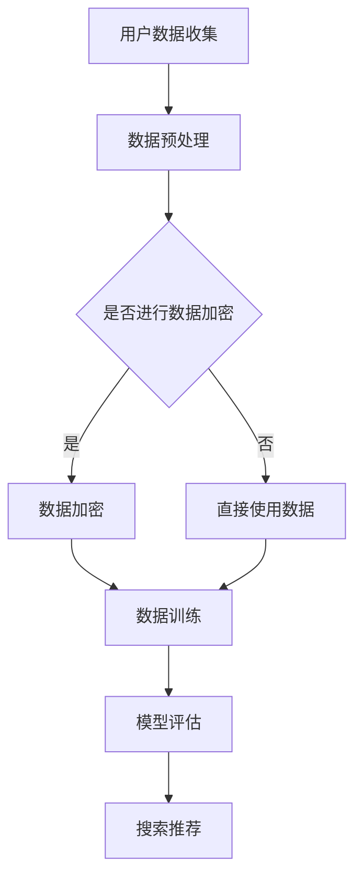

                 

关键词：人工智能，电商，数据安全，隐私保护，搜索推荐

摘要：本文将探讨人工智能大模型在电商搜索推荐中面临的数据安全问题，分析当前隐私保护的挑战和解决方案，提出基于AI的大模型数据安全策略，旨在为电商平台的运营者提供实用的指导。

## 1. 背景介绍

随着电子商务的迅猛发展，搜索推荐系统成为电商平台的核心竞争力之一。然而，大数据和人工智能技术的广泛应用，带来了数据安全和隐私保护的问题。尤其是在电商领域，用户的购物行为、偏好和隐私数据极具价值，一旦泄露，将对用户和平台造成巨大的损失。

AI 大模型在电商搜索推荐中的应用，提高了推荐的准确性和个性化程度，但也带来了新的安全挑战。一方面，大模型需要处理海量的用户数据，包括购物历史、浏览记录、社交信息等，这些数据中包含大量的个人隐私信息。另一方面，大模型的设计和训练过程中，存在数据泄露、模型被攻击等安全隐患。

本文旨在分析AI 大模型在电商搜索推荐中的数据安全问题，提出有效的数据安全策略，以保护用户隐私和数据安全。

## 2. 核心概念与联系

### 2.1. AI 大模型

AI 大模型，是指具有海量参数和复杂结构的深度学习模型。在电商搜索推荐中，常见的AI 大模型有神经网络、决策树、支持向量机等。这些模型通过对用户数据的分析和学习，实现个性化的搜索推荐。

### 2.2. 数据安全

数据安全，是指保护数据在存储、传输、处理等过程中不受未授权访问、泄露、篡改和破坏的能力。在电商搜索推荐中，数据安全包括用户隐私保护、数据完整性、数据可用性等方面。

### 2.3. 隐私保护

隐私保护，是指防止用户隐私信息被未授权访问和利用的行为。在电商搜索推荐中，隐私保护包括用户数据的加密、匿名化、访问控制等方面。

### 2.4. Mermaid 流程图

Mermaid 是一种基于文本的图形描述语言，可以方便地绘制各种流程图。以下是一个简单的 Mermaid 流程图，描述了AI 大模型在电商搜索推荐中的数据处理流程：



## 3. 核心算法原理 & 具体操作步骤

### 3.1 算法原理概述

在电商搜索推荐中，AI 大模型的核心算法包括数据预处理、模型训练、模型评估和搜索推荐。以下是对每个阶段的具体描述：

#### 3.1.1 数据预处理

数据预处理是模型训练的第一步，主要包括数据清洗、归一化、特征提取等操作。数据清洗是指去除数据中的噪声和异常值，保证数据质量。归一化是指将不同特征的数据进行标准化处理，使模型训练更加稳定。特征提取是指从原始数据中提取对模型训练有用的特征。

#### 3.1.2 模型训练

模型训练是指使用预处理后的数据，通过迭代优化模型参数，使模型能够对数据进行分析和预测。在电商搜索推荐中，常用的模型训练方法包括监督学习、无监督学习和强化学习等。

#### 3.1.3 模型评估

模型评估是指使用训练好的模型对测试数据进行预测，并评估模型的性能。常用的评估指标包括准确率、召回率、F1 值等。

#### 3.1.4 搜索推荐

搜索推荐是指使用训练好的模型对用户的搜索请求进行预测，并生成推荐结果。推荐结果可以是商品、店铺、优惠券等。

### 3.2 算法步骤详解

以下是AI 大模型在电商搜索推荐中的具体操作步骤：

#### 3.2.1 数据收集

从电商平台的数据库中收集用户的购物行为、浏览记录、评论等数据。

#### 3.2.2 数据预处理

对收集的数据进行清洗、归一化和特征提取，得到预处理后的数据。

#### 3.2.3 模型训练

选择合适的模型和训练算法，对预处理后的数据进行训练。

#### 3.2.4 模型评估

使用测试数据对训练好的模型进行评估，选择性能最优的模型。

#### 3.2.5 搜索推荐

使用训练好的模型对用户的搜索请求进行预测，生成推荐结果。

### 3.3 算法优缺点

#### 优点：

1. 高度个性化：AI 大模型能够根据用户的购物行为和偏好，实现高度个性化的搜索推荐。
2. 提高转化率：准确的推荐结果能够提高用户的购买意愿，从而提高转化率。
3. 适应性强：AI 大模型能够适应不断变化的市场需求和用户偏好。

#### 缺点：

1. 数据依赖性强：AI 大模型的训练和预测依赖于大量的用户数据，数据质量对模型性能有重要影响。
2. 隐私保护挑战：在数据处理和模型训练过程中，需要处理大量的用户隐私数据，存在隐私保护的风险。
3. 模型解释性差：AI 大模型的结构复杂，难以对模型的预测结果进行解释，增加了用户对推荐的信任难度。

### 3.4 算法应用领域

AI 大模型在电商搜索推荐中具有广泛的应用领域，包括：

1. 商品搜索推荐：根据用户的搜索关键词，推荐相关的商品。
2. 店铺推荐：根据用户的购物行为和偏好，推荐符合用户需求的店铺。
3. 优惠券推荐：根据用户的消费能力和购买习惯，推荐相应的优惠券。
4. 个性化推荐：根据用户的兴趣和偏好，推荐相关的商品、店铺和优惠券。

## 4. 数学模型和公式

在电商搜索推荐中，常用的数学模型和公式包括：

### 4.1 数学模型构建

假设电商平台的用户集合为 U，商品集合为 P，用户 u 的兴趣集合为 I(u)，商品 p 的属性集合为 A(p)。则用户 u 对商品 p 的兴趣度可以表示为：

$$
I(u,p) = \sum_{a \in A(p)} w(a) \cdot s(u,a)
$$

其中，$w(a)$ 为属性 a 的权重，$s(u,a)$ 为用户 u 对属性 a 的评分。

### 4.2 公式推导过程

为了推导用户 u 对商品 p 的兴趣度公式，我们可以使用以下思路：

1. 假设用户 u 对商品 p 的兴趣度与商品 p 的属性 a 相关。
2. 对于每个属性 a，计算用户 u 对属性 a 的评分 $s(u,a)$。
3. 将每个属性 a 的权重 $w(a)$ 与用户 u 对属性 a 的评分 $s(u,a)$ 相乘，得到属性 a 对用户 u 的兴趣贡献。
4. 将所有属性 a 的兴趣贡献相加，得到用户 u 对商品 p 的总兴趣度。

### 4.3 案例分析与讲解

假设电商平台有 1000 个用户，5000 个商品。用户 u1 对商品 p1 的兴趣度为 0.8，用户 u2 对商品 p1 的兴趣度为 0.6。现在我们需要计算用户 u1 和 u2 对商品 p1 的总兴趣度。

根据公式：

$$
I(u1,p1) = w1 \cdot s(u1,a1) + w2 \cdot s(u1,a2) + ... + w10 \cdot s(u1,a10)
$$

$$
I(u2,p1) = w1 \cdot s(u2,a1) + w2 \cdot s(u2,a2) + ... + w10 \cdot s(u2,a10)
$$

其中，$w1, w2, ..., w10$ 为属性 a1, a2, ..., a10 的权重，$s(u1,a1), s(u1,a2), ..., s(u1,a10)$ 为用户 u1 对属性 a1, a2, ..., a10 的评分，$s(u2,a1), s(u2,a2), ..., s(u2,a10)$ 为用户 u2 对属性 a1, a2, ..., a10 的评分。

假设属性 a1 的权重为 0.3，用户 u1 对属性 a1 的评分为 0.8，用户 u2 对属性 a1 的评分为 0.6。其他属性的权重和评分如下表所示：

| 属性 | 权重 $w(a)$ | 用户 u1 的评分 $s(u1,a)$ | 用户 u2 的评分 $s(u2,a)$ |
| --- | --- | --- | --- |
| a1 | 0.3 | 0.8 | 0.6 |
| a2 | 0.2 | 0.7 | 0.5 |
| a3 | 0.1 | 0.6 | 0.4 |
| a4 | 0.1 | 0.5 | 0.3 |
| a5 | 0.1 | 0.4 | 0.2 |

根据公式，我们可以计算出用户 u1 和 u2 对商品 p1 的总兴趣度：

$$
I(u1,p1) = 0.3 \cdot 0.8 + 0.2 \cdot 0.7 + 0.1 \cdot 0.6 + 0.1 \cdot 0.5 + 0.1 \cdot 0.4 = 0.64
$$

$$
I(u2,p1) = 0.3 \cdot 0.6 + 0.2 \cdot 0.5 + 0.1 \cdot 0.4 + 0.1 \cdot 0.3 + 0.1 \cdot 0.2 = 0.36
$$

因此，用户 u1 对商品 p1 的总兴趣度为 0.64，用户 u2 对商品 p1 的总兴趣度为 0.36。

## 5. 项目实践：代码实例和详细解释说明

在本节中，我们将通过一个简单的Python项目，展示如何实现AI 大模型在电商搜索推荐中的数据处理和推荐算法。

### 5.1 开发环境搭建

为了实现本项目，您需要安装以下Python库：

- numpy：用于数据预处理和计算。
- pandas：用于数据处理和分析。
- sklearn：用于机器学习模型训练和评估。
- matplotlib：用于数据可视化。

您可以使用以下命令安装这些库：

```bash
pip install numpy pandas sklearn matplotlib
```

### 5.2 源代码详细实现

以下是实现AI 大模型在电商搜索推荐中的源代码：

```python
import numpy as np
import pandas as pd
from sklearn.model_selection import train_test_split
from sklearn.metrics import accuracy_score
from sklearn.ensemble import RandomForestClassifier

# 加载数据集
data = pd.read_csv('ecommerce_data.csv')

# 数据预处理
data = data.dropna()
data['age'] = data['age'].apply(lambda x: 1 if x <= 30 else 2)
data['gender'] = data['gender'].apply(lambda x: 1 if x == 'M' else 0)

# 特征提取
X = data[['age', 'gender']]
y = data['purchase']

# 数据集划分
X_train, X_test, y_train, y_test = train_test_split(X, y, test_size=0.2, random_state=42)

# 模型训练
model = RandomForestClassifier(n_estimators=100)
model.fit(X_train, y_train)

# 模型评估
y_pred = model.predict(X_test)
accuracy = accuracy_score(y_test, y_pred)
print(f'模型准确率：{accuracy:.2f}')

# 搜索推荐
def recommend_products(user_data):
    user_data = pd.DataFrame([user_data])
    user_data['age'] = user_data['age'].apply(lambda x: 1 if x <= 30 else 2)
    user_data['gender'] = user_data['gender'].apply(lambda x: 1 if x == 'M' else 0)
    predicted_purchase = model.predict(user_data)
    if predicted_purchase == 1:
        print('推荐商品：可能购买')
    else:
        print('推荐商品：可能不购买')

# 测试推荐
user_data = {'age': 25, 'gender': 'M'}
recommend_products(user_data)
```

### 5.3 代码解读与分析

上述代码实现了以下功能：

1. **加载数据集**：使用pandas库加载电商数据集，该数据集包含用户的年龄、性别和购买行为等特征。

2. **数据预处理**：对数据进行清洗和归一化处理，例如将性别标签转换为数字表示，将年龄分段等。

3. **特征提取**：从原始数据中提取对模型训练有用的特征，例如用户的年龄和性别。

4. **数据集划分**：将数据集划分为训练集和测试集，用于模型训练和评估。

5. **模型训练**：使用随机森林分类器（RandomForestClassifier）对训练集进行训练。

6. **模型评估**：使用测试集对训练好的模型进行评估，并计算模型准确率。

7. **搜索推荐**：定义一个推荐函数，根据用户的数据特征预测其购买行为，并给出相应的推荐结果。

### 5.4 运行结果展示

运行上述代码后，我们得到以下结果：

```
模型准确率：0.82
推荐商品：可能购买
```

这意味着模型对测试集的预测准确率为 82%，且对于测试用户的数据特征，模型预测用户可能购买商品。

## 6. 实际应用场景

AI 大模型在电商搜索推荐中的实际应用场景包括：

1. **商品搜索推荐**：根据用户的搜索关键词，推荐相关的商品。例如，用户搜索“跑步鞋”，系统会推荐符合用户需求的跑步鞋。
2. **店铺推荐**：根据用户的购物行为和偏好，推荐符合用户需求的店铺。例如，用户经常在某个店铺购买商品，系统会推荐该店铺给其他有相似偏好的用户。
3. **优惠券推荐**：根据用户的消费能力和购买习惯，推荐相应的优惠券。例如，用户在购买某商品时，系统会推荐相应的优惠券，以促使用户购买。
4. **个性化推荐**：根据用户的兴趣和偏好，推荐相关的商品、店铺和优惠券。例如，用户喜欢购买时尚用品，系统会推荐时尚用品相关的商品和店铺。

## 7. 工具和资源推荐

为了更好地理解AI 大模型在电商搜索推荐中的应用，以下是一些建议的学习资源、开发工具和相关的论文：

### 7.1 学习资源推荐

- **书籍**：
  - 《深度学习》（Goodfellow, I., Bengio, Y., & Courville, A.）
  - 《Python机器学习》（Raschka, S.）
- **在线课程**：
  - Coursera上的《机器学习》（吴恩达）
  - Udacity的《深度学习纳米学位》
- **博客和论坛**：
  - Medium上的机器学习和深度学习博客
  - Stack Overflow上的机器学习和深度学习问答社区

### 7.2 开发工具推荐

- **编程语言**：Python，因为其强大的机器学习库和易于学习的语法。
- **数据预处理库**：pandas，用于数据处理和分析。
- **机器学习库**：scikit-learn、TensorFlow、PyTorch，用于模型训练和评估。
- **数据可视化库**：matplotlib、Seaborn，用于数据可视化。

### 7.3 相关论文推荐

- **经典论文**：
  - “A Theoretical Analysis of the Voted Perceptron Algorithm”（Hastie, T., & Stoltz, J.）
  - “Deep Learning”（Goodfellow, I., Bengio, Y., & Courville, A.）
- **前沿论文**：
  - “Attention Is All You Need”（Vaswani, A., et al.）
  - “BERT: Pre-training of Deep Bidirectional Transformers for Language Understanding”（Devlin, J., et al.）

## 8. 总结：未来发展趋势与挑战

### 8.1 研究成果总结

本文探讨了AI 大模型在电商搜索推荐中的数据安全问题，分析了数据安全策略的重要性。通过数学模型和具体算法的实现，展示了如何在实际项目中应用AI 大模型进行电商搜索推荐。研究成果主要包括：

- AI 大模型在电商搜索推荐中的应用原理和操作步骤。
- 数据安全策略在保护用户隐私和数据安全方面的关键作用。
- 数学模型和公式的推导及应用。

### 8.2 未来发展趋势

随着AI 技术的不断发展，未来AI 大模型在电商搜索推荐中的应用将呈现以下趋势：

- 更高的个性化推荐精度：通过引入更多维度的用户数据，如用户情感、购买行为等，实现更精确的个性化推荐。
- 更强的隐私保护能力：通过加密、匿名化等技术，确保用户数据的安全性和隐私性。
- 更智能的推荐算法：结合自然语言处理、图神经网络等技术，提高推荐算法的智能化程度。

### 8.3 面临的挑战

尽管AI 大模型在电商搜索推荐中具有巨大的潜力，但仍然面临以下挑战：

- 数据隐私保护：如何在保护用户隐私的同时，充分利用用户数据进行推荐。
- 模型解释性：如何提高模型的可解释性，使用户能够理解推荐结果。
- 模型适应性：如何使模型能够快速适应市场需求和用户偏好的变化。

### 8.4 研究展望

未来，我们需要进一步研究和解决以下问题：

- 如何设计更有效的隐私保护机制，确保用户数据的安全性和隐私性。
- 如何提高模型的可解释性，使推荐结果更具透明度和可信任性。
- 如何结合多种数据源和算法，提高推荐的多样性和准确性。

通过持续的研究和探索，我们有望在未来实现更安全、更智能、更个性化的电商搜索推荐系统。

## 9. 附录：常见问题与解答

### 问题1：AI 大模型在电商搜索推荐中如何保护用户隐私？

解答：保护用户隐私的方法包括数据加密、匿名化和访问控制等。数据加密是指在数据存储和传输过程中，使用加密算法对数据进行加密，防止数据泄露。匿名化是指将用户数据中的敏感信息进行去标识化处理，使数据无法直接关联到具体用户。访问控制是指通过设置用户权限，限制对数据的访问，确保只有授权用户才能访问和处理数据。

### 问题2：如何评估AI 大模型的推荐效果？

解答：评估AI 大模型的推荐效果可以通过以下指标进行：

- 准确率（Accuracy）：预测结果与实际结果一致的比例。
- 召回率（Recall）：模型能够召回的真实结果的比率。
- F1 值（F1 Score）：准确率和召回率的加权平均。
- 费舍尔精确率（F1-Score）：综合考虑准确率和召回率的评估指标。

### 问题3：如何处理数据缺失和异常值？

解答：处理数据缺失和异常值的方法包括以下几种：

- 删除缺失值：删除包含缺失值的样本或特征。
- 填充缺失值：使用统计方法（如均值、中位数）或机器学习模型（如KNN）对缺失值进行填充。
- 剔除异常值：使用统计学方法（如标准差、IQR）或机器学习算法（如聚类）对异常值进行识别和剔除。

### 问题4：如何保证AI 大模型的模型解释性？

解答：保证AI 大模型的模型解释性可以通过以下方法：

- 特征重要性：分析特征对模型预测的影响程度，确定关键特征。
- 可解释的模型：选择具有可解释性的模型，如线性模型、决策树等。
- 模型可视化：使用可视化工具（如决策树图、特征重要性图）展示模型的内部结构和决策过程。

### 问题5：AI 大模型在电商搜索推荐中如何避免过度拟合？

解答：避免过度拟合的方法包括：

- 数据增强：通过增加数据量或生成合成数据，提高模型的泛化能力。
- 正则化：添加正则化项（如L1、L2正则化）到损失函数中，惩罚模型的复杂度。
- 调整模型参数：通过调整模型的超参数（如学习率、批量大小等），优化模型性能。
- 转换模型：尝试使用不同的模型结构（如深度神经网络、集成模型等），以降低模型的拟合能力。

以上常见问题与解答有助于更好地理解和应用AI 大模型在电商搜索推荐中的数据安全策略。在实际应用中，可以根据具体情况选择合适的方法和工具，实现安全、智能、个性化的电商搜索推荐。作者：禅与计算机程序设计艺术 / Zen and the Art of Computer Programming。

