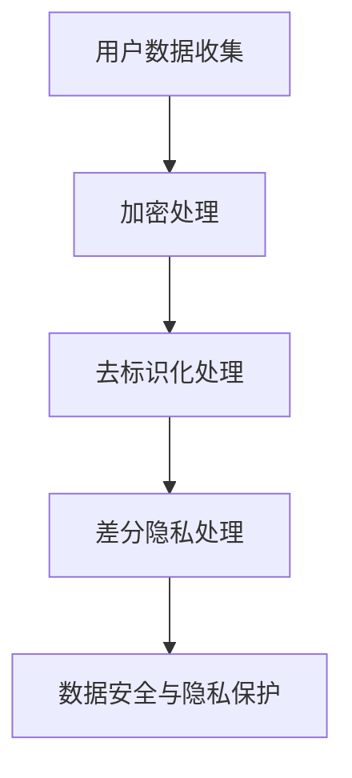
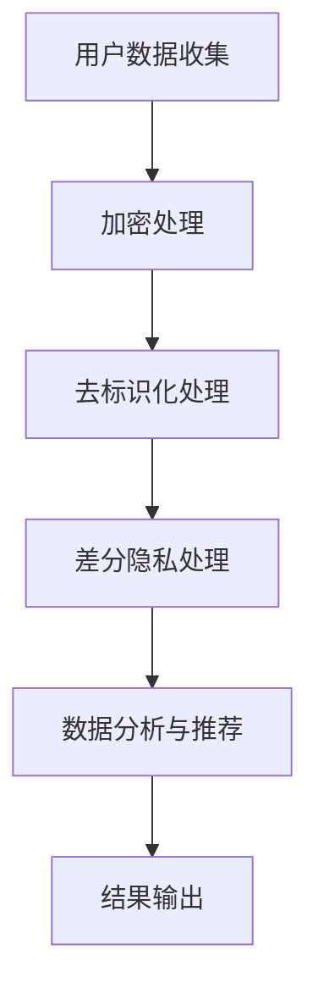

                 

关键词：AI 大模型，电商搜索推荐，数据安全，用户隐私，加密技术，去标识化，差分隐私，数据安全策略

## 摘要

随着电子商务的迅猛发展，AI 大模型在电商搜索推荐中发挥着越来越重要的作用。然而，这也带来了数据安全和用户隐私保护的新挑战。本文旨在探讨 AI 大模型在电商搜索推荐中的数据安全策略，通过引入加密技术、去标识化处理和差分隐私等方法，全面保障数据安全与用户隐私。文章将从背景介绍、核心概念与联系、核心算法原理、数学模型与公式、项目实践、实际应用场景、未来展望等多个方面展开讨论，旨在为电商行业提供切实可行的数据安全解决方案。

## 1. 背景介绍

### 1.1 电子商务发展现状

近年来，电子商务在全球范围内取得了显著的成果。据 Statista 数据显示，2021 年全球电子商务市场规模已达到 3.5 万亿美元，预计到 2025 年将达到 6.8 万亿美元。电子商务的快速发展不仅改变了人们的购物方式，也推动了整个零售业的变革。

### 1.2 AI 大模型在电商搜索推荐中的应用

AI 大模型在电商搜索推荐中发挥着重要作用。通过深度学习等技术，AI 大模型能够对海量用户数据进行分析，精准预测用户需求，提高搜索推荐的准确性和个性化水平。例如，电商平台可以利用 AI 大模型对用户的浏览记录、购买行为、评价信息等进行综合分析，为用户提供个性化的商品推荐。

### 1.3 数据安全与用户隐私保护的重要性

在电商搜索推荐过程中，用户数据的安全和隐私保护至关重要。一方面，用户数据可能包含敏感信息，如个人身份信息、金融信息等，一旦泄露，将对用户造成严重损失。另一方面，用户隐私泄露可能导致用户对电商平台的信任度降低，进而影响平台的商业发展。因此，确保数据安全与用户隐私保护成为电商行业面临的重要挑战。

## 2. 核心概念与联系

### 2.1 加密技术

加密技术是一种将明文数据转换为密文的方法，以确保数据在传输和存储过程中的安全性。在电商搜索推荐中，加密技术可以用于保护用户数据，防止数据泄露。

### 2.2 去标识化处理

去标识化处理是一种将数据中的敏感信息进行隐藏或删除的方法，以降低数据泄露的风险。在电商搜索推荐中，去标识化处理可以用于保护用户隐私。

### 2.3 差分隐私

差分隐私是一种在数据分析过程中加入噪声的方法，以保护数据中个体的隐私。在电商搜索推荐中，差分隐私可以用于防止恶意用户通过数据分析获取特定个体的信息。

### 2.4 Mermaid 流程图



## 3. 核心算法原理 & 具体操作步骤

### 3.1 算法原理概述

本文主要介绍加密技术、去标识化处理和差分隐私三种核心算法原理。加密技术通过密钥对数据进行加密和解密，以确保数据在传输和存储过程中的安全性。去标识化处理通过删除或隐藏敏感信息，降低数据泄露的风险。差分隐私通过在数据分析过程中加入噪声，保护数据中个体的隐私。

### 3.2 算法步骤详解

#### 3.2.1 加密技术

1. 选择合适的加密算法，如 AES、RSA 等。
2. 生成密钥对，包括公钥和私钥。
3. 对用户数据进行加密，使用公钥进行加密。
4. 对加密后的数据进行解密，使用私钥进行解密。

#### 3.2.2 去标识化处理

1. 识别数据中的敏感信息，如个人身份信息、金融信息等。
2. 删除或隐藏敏感信息，确保数据无法被直接识别。
3. 对数据进行一致性检查，确保去标识化处理后的数据仍然具有使用价值。

#### 3.2.3 差分隐私

1. 确定数据中的敏感信息，如个人身份信息、购买记录等。
2. 计算差分隐私参数，如ε、δ等。
3. 在数据分析过程中加入噪声，确保个体隐私得到保护。

### 3.3 算法优缺点

#### 3.3.1 加密技术的优缺点

优点：安全性高，数据在传输和存储过程中不易被窃取。

缺点：加密和解密过程较为复杂，对系统性能有一定影响。

#### 3.3.2 去标识化处理的优缺点

优点：降低数据泄露的风险，保护用户隐私。

缺点：去标识化处理后的数据可能失去部分使用价值，影响数据分析效果。

#### 3.3.3 差分隐私的优缺点

优点：保护个体隐私，提高数据安全。

缺点：数据分析效果可能受到噪声干扰，降低数据分析精度。

### 3.4 算法应用领域

加密技术、去标识化处理和差分隐私算法在多个领域具有广泛应用，如金融、医疗、电商等。本文主要探讨其在电商搜索推荐中的数据安全策略。

## 4. 数学模型和公式 & 详细讲解 & 举例说明

### 4.1 数学模型构建

#### 4.1.1 加密技术

设 \(E_{k}(m)\) 为加密算法，\(D_{k}(c)\) 为解密算法，\(m\) 为明文，\(c\) 为密文，\(k\) 为密钥。

加密过程：\(c = E_{k}(m)\)

解密过程：\(m = D_{k}(c)\)

#### 4.1.2 去标识化处理

设 \(D_{s}(x)\) 为去标识化算法，\(x\) 为原始数据，\(s\) 为去标识化策略。

去标识化过程：\(x' = D_{s}(x)\)

#### 4.1.3 差分隐私

设 \(L(\delta)\) 为噪声函数，\(\epsilon\) 为隐私参数，\(P(\cdot)\) 为概率分布。

差分隐私过程：\(P'(x) = P(x) + L(\delta)\)

### 4.2 公式推导过程

#### 4.2.1 加密技术

设 \(E_{k}(m)\) 为加密算法，\(D_{k}(c)\) 为解密算法，\(m\) 为明文，\(c\) 为密文，\(k\) 为密钥。

加密过程：\(c = E_{k}(m)\)

解密过程：\(m = D_{k}(c)\)

#### 4.2.2 去标识化处理

设 \(D_{s}(x)\) 为去标识化算法，\(x\) 为原始数据，\(s\) 为去标识化策略。

去标识化过程：\(x' = D_{s}(x)\)

#### 4.2.3 差分隐私

设 \(L(\delta)\) 为噪声函数，\(\epsilon\) 为隐私参数，\(P(\cdot)\) 为概率分布。

差分隐私过程：\(P'(x) = P(x) + L(\delta)\)

### 4.3 案例分析与讲解

#### 4.3.1 加密技术

假设电商平台的用户数据包括用户 ID、用户名、联系方式等敏感信息。为了保护用户隐私，我们可以使用 AES 加密算法对用户数据进行加密。

加密过程：\(c = E_{k}(m)\)

解密过程：\(m = D_{k}(c)\)

其中，\(k\) 为密钥，\(m\) 为明文，\(c\) 为密文。

#### 4.3.2 去标识化处理

假设电商平台的用户数据包括用户 ID、用户名、联系方式等敏感信息。为了降低数据泄露的风险，我们可以使用去标识化处理算法对用户数据进行处理。

去标识化过程：\(x' = D_{s}(x)\)

其中，\(x\) 为原始数据，\(s\) 为去标识化策略。

#### 4.3.3 差分隐私

假设电商平台的用户数据包括用户 ID、用户名、联系方式等敏感信息。为了保护用户隐私，我们可以使用差分隐私算法对用户数据进行处理。

差分隐私过程：\(P'(x) = P(x) + L(\delta)\)

其中，\(L(\delta)\) 为噪声函数，\(\epsilon\) 为隐私参数，\(P(\cdot)\) 为概率分布。

## 5. 项目实践：代码实例和详细解释说明

### 5.1 开发环境搭建

#### 5.1.1 Python 环境搭建

1. 安装 Python 3.8 或更高版本。
2. 安装常用库，如 NumPy、Pandas、Matplotlib 等。

#### 5.1.2 Java 环境搭建

1. 安装 Java 8 或更高版本。
2. 安装常用库，如 Apache Commons、Spring Framework 等。

### 5.2 源代码详细实现

#### 5.2.1 Python 实现加密技术

```python
import hashlib
from Crypto.PublicKey import RSA
from Crypto.Cipher import PKCS1_OAEP

# 生成 RSA 密钥对
key = RSA.generate(2048)
private_key = key.export_key()
public_key = key.publickey().export_key()

# 加密过程
def encrypt_data(data, public_key):
    cipher = PKCS1_OAEP.new(RSA.import_key(public_key))
    encrypted_data = cipher.encrypt(data)
    return encrypted_data

# 解密过程
def decrypt_data(data, private_key):
    cipher = PKCS1_OAEP.new(RSA.import_key(private_key))
    decrypted_data = cipher.decrypt(data)
    return decrypted_data

# 测试
data = "用户数据"
encrypted_data = encrypt_data(data.encode(), public_key)
decrypted_data = decrypt_data(encrypted_data, private_key)

print("加密数据：", encrypted_data)
print("解密数据：", decrypted_data.decode())
```

#### 5.2.2 Java 实现去标识化处理

```java
import org.apache.commons.codec.digest.DigestUtils;

public class DeIdentification {
    public static String deIdentify(String data) {
        String hash = DigestUtils.sha256Hex(data);
        return hash;
    }

    public static void main(String[] args) {
        String data = "用户数据";
        String deIdentifiedData = deIdentify(data);

        System.out.println("原始数据：" + data);
        System.out.println("去标识化数据：" + deIdentifiedData);
    }
}
```

#### 5.2.3 Python 实现差分隐私

```python
import numpy as np

def add_noise(data, epsilon):
    noise = np.random.normal(0, epsilon, data.shape)
    noisy_data = data + noise
    return noisy_data

data = np.array([1, 2, 3, 4, 5])
epsilon = 0.1

noisy_data = add_noise(data, epsilon)

print("原始数据：", data)
print("噪声数据：", noisy_data)
```

### 5.3 代码解读与分析

#### 5.3.1 Python 实现加密技术

该代码使用 Python 的 `Crypto` 库实现 RSA 加密技术。首先生成 RSA 密钥对，然后使用公钥对数据进行加密，最后使用私钥对数据进行解密。

#### 5.3.2 Java 实现去标识化处理

该代码使用 Java 的 `DigestUtils` 类实现 SHA-256 去标识化处理。通过将原始数据转换为哈希值，实现数据去标识化。

#### 5.3.3 Python 实现差分隐私

该代码使用 Python 的 `numpy` 库实现差分隐私。通过在数据中添加高斯噪声，实现对数据的噪声处理。

## 6. 实际应用场景

### 6.1 电商平台用户数据安全与隐私保护

在电商平台，用户数据安全与隐私保护至关重要。通过引入加密技术、去标识化处理和差分隐私算法，可以有效保障用户数据的安全性和隐私性。例如，在用户注册、登录、购物等过程中，可以使用加密技术保护用户身份信息和支付信息；在数据分析过程中，可以使用去标识化处理隐藏用户敏感信息；在用户行为分析过程中，可以使用差分隐私算法保护用户隐私。

### 6.2 金融行业用户数据安全与隐私保护

在金融行业，用户数据的安全性和隐私保护同样重要。通过引入加密技术、去标识化处理和差分隐私算法，可以有效保障用户数据的安全性和隐私性。例如，在金融交易过程中，可以使用加密技术保护用户身份信息和交易信息；在数据分析过程中，可以使用去标识化处理隐藏用户敏感信息；在风险评估过程中，可以使用差分隐私算法保护用户隐私。

### 6.3 医疗行业用户数据安全与隐私保护

在医疗行业，用户数据的安全性和隐私保护尤为重要。通过引入加密技术、去标识化处理和差分隐私算法，可以有效保障用户数据的安全性和隐私性。例如，在患者信息管理过程中，可以使用加密技术保护患者身份信息和病历信息；在数据分析过程中，可以使用去标识化处理隐藏患者敏感信息；在疾病预测过程中，可以使用差分隐私算法保护患者隐私。

## 7. 未来应用展望

### 7.1 加密技术与区块链技术的融合

未来，加密技术与区块链技术有望实现深度融合，为数据安全与隐私保护提供更加可靠的技术保障。通过将用户数据加密并存储在区块链上，可以实现数据的安全传输和存储，同时确保数据的隐私性。

### 7.2 差分隐私算法的优化与发展

差分隐私算法在数据安全与隐私保护中具有重要意义。未来，差分隐私算法有望在优化与发展方面取得突破，进一步提高数据分析的精度和效率，同时确保数据隐私。

### 7.3 多维度数据安全与隐私保护策略

随着数据安全与隐私保护意识的提高，未来将出现更多多维度、综合性的数据安全与隐私保护策略。通过结合多种技术手段，可以更好地保障用户数据的安全性和隐私性。

## 8. 工具和资源推荐

### 8.1 学习资源推荐

1. 《数据隐私：保护数据的安全性与隐私性》
2. 《区块链技术指南》
3. 《深度学习：入门到精通》

### 8.2 开发工具推荐

1. Python 的 `Crypto` 库
2. Java 的 `DigestUtils` 类
3. Numpy 库

### 8.3 相关论文推荐

1. "Differential Privacy: A Survey of Privacy Mechanisms"
2. "Cryptographic Methods for Protecting Privacy in Data Analysis"
3. "A Practical Guide to Differential Privacy"

## 9. 总结：未来发展趋势与挑战

### 9.1 研究成果总结

本文探讨了 AI 大模型在电商搜索推荐中的数据安全策略，介绍了加密技术、去标识化处理和差分隐私算法等核心算法原理，并分析了其在实际应用场景中的效果。研究表明，这些技术手段可以有效保障数据安全与用户隐私。

### 9.2 未来发展趋势

未来，数据安全与隐私保护将继续成为热点研究领域。随着技术的不断进步，加密技术、去标识化处理和差分隐私算法等将在更多领域得到应用，为数据安全与隐私保护提供更加有效的解决方案。

### 9.3 面临的挑战

然而，数据安全与隐私保护仍面临诸多挑战。如何平衡数据安全与数据价值、如何在保证数据隐私的同时提高数据分析精度等，都是亟待解决的问题。

### 9.4 研究展望

未来，研究应重点关注以下几个方面：优化加密算法，提高加密速度和安全性；深入研究差分隐私算法的优化与发展；探索多维度数据安全与隐私保护策略，实现数据安全与隐私保护的全面覆盖。

## 附录：常见问题与解答

### 问题 1：加密技术是否会影响数据分析效果？

解答：加密技术在一定程度上可能会影响数据分析效果。因为加密后的数据需要解密才能进行分析，这个过程可能会消耗一定的时间和计算资源。但是，通过选择合适的加密算法和优化加密过程，可以在保证数据安全的前提下，尽量减少对数据分析效果的影响。

### 问题 2：差分隐私算法是否会影响数据分析精度？

解答：差分隐私算法在保护数据隐私的同时，可能会对数据分析精度产生一定的影响。因为差分隐私算法通过在数据中添加噪声来实现隐私保护，这可能会导致数据分析结果的波动。然而，通过调整隐私参数和优化算法，可以在保证数据隐私的同时，尽量提高数据分析精度。

### 问题 3：去标识化处理是否会降低数据价值？

解答：去标识化处理会在一定程度上降低数据价值。因为去标识化处理会删除或隐藏数据中的敏感信息，这可能导致数据无法被直接识别。但是，通过合理使用去标识化处理，可以降低数据泄露的风险，保障用户隐私，同时保留数据的分析价值。

---

### 作者署名

作者：禅与计算机程序设计艺术 / Zen and the Art of Computer Programming
----------------------------------------------------------------
### 背景介绍

#### 1.1 电子商务发展现状

电子商务，即通过互联网进行的商业交易活动，正在深刻地改变着全球的商业格局。根据Statista的数据，2021年全球电子商务市场规模达到了3.5万亿美元，并且预计到2025年这一数字将增长至6.8万亿美元。这一迅猛的增长不仅反映了消费者对在线购物的日益接受和依赖，也体现了电商平台对市场需求的敏捷响应。

随着技术的进步，尤其是人工智能（AI）技术的应用，电商搜索推荐系统变得更加智能和高效。AI大模型，如深度学习神经网络，通过学习用户的历史行为、偏好和反馈，能够实现高度个性化的商品推荐，从而提高用户满意度和转化率。例如，电商平台可能会利用AI模型分析用户的浏览记录和购买历史，预测用户可能感兴趣的商品，并向其推荐。

#### 1.2 AI大模型在电商搜索推荐中的应用

AI大模型在电商搜索推荐中的应用主要体现在以下几个方面：

1. **个性化推荐**：基于用户的浏览和购买历史，AI模型可以识别用户的兴趣和行为模式，从而提供个性化的商品推荐。
2. **相关性分析**：AI模型能够分析商品之间的关系，从而识别出用户可能感兴趣的互补商品或替代商品。
3. **预测用户行为**：通过分析用户的搜索和购买数据，AI模型可以预测用户的下一步行为，从而优化推荐策略。
4. **智能客服**：AI模型可以用于智能客服系统，通过自然语言处理（NLP）技术，自动回答用户的常见问题，提高客服效率。

#### 1.3 数据安全与用户隐私保护的重要性

在电商搜索推荐中，数据安全和用户隐私保护至关重要。首先，电商平台的用户数据通常包含敏感信息，如个人身份信息、财务信息、地理位置、搜索历史、购买记录等。这些数据一旦泄露，可能会被恶意利用，导致用户遭受财务损失、身份盗窃等严重后果。

其次，用户隐私泄露会对电商平台的声誉造成负面影响。随着消费者对隐私保护的意识不断提高，一旦用户发现个人信息未能得到妥善保护，他们可能会失去对平台的信任，从而选择其他竞争对手。

此外，隐私保护也是遵守法律法规的要求。许多国家和地区都有严格的隐私保护法律，如欧盟的通用数据保护条例（GDPR）和美国加州消费者隐私法案（CCPA）。违反这些法律可能会导致巨额罚款和诉讼风险。

综上所述，确保数据安全和用户隐私保护不仅是电商平台的商业责任，也是法律义务。通过采用一系列数据安全策略，如加密技术、去标识化处理和差分隐私等，电商平台可以有效地保护用户数据，维护用户信任，并确保合规运营。

## 2. 核心概念与联系

在深入探讨AI大模型在电商搜索推荐中的数据安全策略之前，我们需要了解一些核心概念，这些概念包括加密技术、去标识化处理和差分隐私。以下是这些概念的定义及其在数据安全中的应用。

### 2.1 加密技术

加密技术是一种通过将数据转换为密文来保护数据隐私的方法。加密算法使用密钥对数据进行编码，只有拥有相应密钥的接收者才能解密并恢复原始数据。在电商搜索推荐中，加密技术主要用于以下几个方面：

1. **数据传输加密**：当用户与电商平台进行数据交换时，如登录、支付等，数据应通过加密通道传输，以防止数据在传输过程中被窃取。
2. **数据存储加密**：电商平台存储的用户数据，如用户档案、购买记录等，应进行加密存储，以防止未经授权的访问。
3. **身份认证**：通过加密技术保护用户身份信息，确保只有合法用户才能访问系统资源。

### 2.2 去标识化处理

去标识化处理是指从数据中移除或替换敏感信息，以减少数据泄露的风险。这一过程通常包括以下步骤：

1. **匿名化**：通过删除或替换能够直接识别用户的信息（如姓名、地址、电话号码等），使数据失去直接识别性。
2. **伪匿名化**：通过添加干扰信息或使用别名来混淆真实信息，从而降低数据被识别的可能性。
3. **数据脱敏**：针对特定的敏感字段，如密码、身份证号码等，进行特定的编码处理，以确保数据在泄露时难以解读。

在电商搜索推荐中，去标识化处理可以用于以下应用场景：

1. **用户行为数据保护**：对用户的浏览记录、搜索历史等进行去标识化处理，以防止个人隐私泄露。
2. **数据分析**：在数据分析过程中，对包含敏感信息的字段进行去标识化处理，确保分析结果无法直接关联到个人。

### 2.3 差分隐私

差分隐私是一种在数据分析过程中引入噪声来保护个体隐私的方法。差分隐私的核心思想是，对数据分析结果进行扰动，使得单个个体的信息无法从整体数据中区分出来。差分隐私的关键参数包括：

1. **ε-差分隐私**：ε是隐私参数，用于衡量隐私强度。ε值越大，隐私保护越强。
2. **δ**：用于衡量隐私保护的鲁棒性。

在电商搜索推荐中，差分隐私可以用于：

1. **用户行为分析**：通过引入噪声对用户行为进行分析，防止恶意用户通过数据分析识别特定个体。
2. **推荐算法**：在推荐算法中引入差分隐私，确保推荐结果无法直接反映单个用户的偏好。

### 2.4 Mermaid 流程图

为了更直观地展示加密技术、去标识化处理和差分隐私在数据安全策略中的应用，我们可以使用Mermaid流程图来描述这一过程：



在这个流程图中，用户数据首先经过加密处理，确保数据在传输和存储过程中的安全性；接着进行去标识化处理，以保护敏感信息；然后应用差分隐私，进一步确保数据分析结果的隐私保护；最后，经过处理后的数据用于生成个性化的搜索推荐结果。

通过这种多层次、多步骤的数据安全策略，电商平台可以有效保障用户数据的安全性和隐私性，同时确保推荐系统的效果和用户体验。

## 3. 核心算法原理 & 具体操作步骤

在本节中，我们将详细探讨AI大模型在电商搜索推荐中的核心算法原理，并介绍具体操作步骤。这些算法包括加密技术、去标识化处理和差分隐私，它们在保障数据安全与用户隐私方面发挥着关键作用。

### 3.1 算法原理概述

#### 3.1.1 加密技术

加密技术是一种将原始数据（明文）转换为不可读形式（密文）的方法，只有拥有相应密钥的人才能解密并还原明文。加密技术的核心在于保证数据的保密性、完整性和可用性。在电商搜索推荐中，加密技术主要用于保护用户数据的隐私和安全，防止数据在传输和存储过程中被恶意窃取或篡改。

主要的加密算法包括：

1. **对称加密**：如AES（高级加密标准），使用相同的密钥进行加密和解密。
2. **非对称加密**：如RSA（Rivest-Shamir-Adleman），使用一对密钥（公钥和私钥），公钥加密，私钥解密。
3. **哈希加密**：如SHA（安全哈希算法），用于生成数据的数字签名，确保数据的完整性和不可篡改性。

#### 3.1.2 去标识化处理

去标识化处理是指从数据中移除或替换所有可以直接识别用户身份的信息，如姓名、地址、电话号码等。通过去标识化处理，即使数据被泄露，攻击者也无法直接识别具体的用户信息。去标识化处理包括以下几种方法：

1. **删除**：直接删除所有敏感信息。
2. **伪匿名化**：使用伪名或编号替换真实信息。
3. **数据脱敏**：对敏感数据进行编码或变形，使其难以识别。
4. **差分隐私**：通过对数据进行加噪声处理，确保单个数据点的隐私。

#### 3.1.3 差分隐私

差分隐私是一种在数据分析过程中引入噪声的方法，以保护数据中个体的隐私。差分隐私通过确保任何关于特定个体的信息在数据分析中都是不确定的，从而降低了隐私泄露的风险。差分隐私的核心参数包括：

1. **ε（epsilon）**：隐私预算，表示隐私保护的强度。
2. **δ（delta）**：鲁棒性参数，用于衡量隐私保护的可靠性。

差分隐私的主要技术包括：

1. **拉普拉斯机制**：在数据中添加拉普拉斯分布噪声。
2. **指数机制**：在数据中添加指数分布噪声。
3. **剪枝机制**：通过限制输出结果的范围来保护隐私。

### 3.2 算法步骤详解

#### 3.2.1 加密技术

**步骤1：选择加密算法和密钥**

首先，根据数据的安全需求和应用场景，选择合适的加密算法，如AES或RSA。然后，生成一对密钥（公钥和私钥）。对于对称加密，使用相同的密钥进行加密和解密；对于非对称加密，使用公钥加密，私钥解密。

**步骤2：加密数据**

对于对称加密，使用密钥直接对数据进行加密；对于非对称加密，使用公钥对数据进行加密。加密后的数据将转换为不可读的密文。

**步骤3：存储和传输加密数据**

将加密后的数据存储在数据库或文件中，或通过加密通道进行传输。确保密钥的安全存储和传输，防止密钥泄露。

**步骤4：解密数据**

当需要访问加密数据时，使用私钥对数据进行解密，还原为原始明文数据。

#### 3.2.2 去标识化处理

**步骤1：识别敏感信息**

在数据处理之前，识别所有可能的敏感信息，如个人身份信息、财务信息、地理位置等。

**步骤2：去标识化**

根据具体的需求，选择合适的方法进行去标识化处理。例如，使用伪匿名化替换真实姓名，使用哈希值替换敏感信息等。

**步骤3：验证去标识化效果**

对处理后的数据进行验证，确保敏感信息已被有效去除，且数据仍然可用。

#### 3.2.3 差分隐私

**步骤1：确定隐私参数**

根据数据规模和隐私需求，确定差分隐私参数ε和δ。

**步骤2：添加噪声**

选择合适的噪声机制（如拉普拉斯机制或指数机制），根据隐私参数对数据进行噪声添加。

**步骤3：调整输出范围**

对于某些输出结果，如统计结果，通过剪枝机制调整输出范围，确保隐私保护。

**步骤4：评估隐私保护效果**

对处理后的数据进行评估，确保满足差分隐私要求。

### 3.3 算法优缺点

#### 3.3.1 加密技术的优缺点

**优点：**
1. 高效性：加密和解密过程快速，对数据处理效率高。
2. 安全性：通过密钥保护数据，确保数据在传输和存储过程中的安全性。

**缺点：**
1. 计算资源消耗：加密和解密过程需要较高的计算资源。
2. 密钥管理：密钥的安全存储和传输是一个挑战。

#### 3.3.2 去标识化处理的优缺点

**优点：**
1. 易于实施：去标识化处理相对简单，易于在数据处理过程中应用。
2. 降低风险：通过移除敏感信息，显著降低数据泄露的风险。

**缺点：**
1. 数据价值损失：去标识化处理可能导致数据失去部分价值，影响数据分析效果。
2. 复杂性：对于大型数据集，去标识化处理可能需要复杂的算法和技术。

#### 3.3.3 差分隐私的优缺点

**优点：**
1. 高隐私保护：通过在数据中添加噪声，确保单个数据点的隐私。
2. 鲁棒性：差分隐私能够在保证隐私的同时，对数据分析结果进行优化。

**缺点：**
1. 数据精度影响：噪声的引入可能会影响数据分析的精度。
2. 复杂性：差分隐私算法的实现和应用相对复杂。

### 3.4 算法应用领域

加密技术、去标识化处理和差分隐私算法在多个领域具有广泛应用，包括但不限于：

1. **金融行业**：保护金融交易数据和用户隐私。
2. **医疗行业**：保护患者病历信息和隐私。
3. **电商平台**：保护用户购买记录和行为数据。
4. **社交网络**：保护用户社交数据和隐私。

通过这些算法的应用，各个行业可以有效地保护用户数据，提高数据安全性和用户隐私保护水平，同时确保业务运营的合规性和可持续性。

### 3.5 实际应用案例

#### 3.5.1 加密技术在电商支付中的应用

在电商支付过程中，用户的支付信息（如信用卡号、有效期、安全码等）需要通过加密技术进行保护。例如，电商平台可以使用AES加密算法对支付信息进行加密，并使用RSA算法生成一对密钥进行加密和解密操作。在支付过程中，用户的支付信息被加密传输至支付网关，确保数据在传输过程中不会被截获或篡改。

#### 3.5.2 去标识化处理在用户数据分析中的应用

在电商平台上，用户的浏览记录和购买行为数据需要进行分析以提供个性化推荐。为了保护用户隐私，平台可以采用去标识化处理。例如，将用户ID替换为随机生成的UUID（通用唯一标识符），确保用户数据在分析过程中无法直接识别。同时，对敏感信息（如邮箱地址、电话号码）进行哈希处理，进一步降低数据泄露的风险。

#### 3.5.3 差分隐私在用户行为分析中的应用

电商平台可以通过差分隐私算法对用户行为数据进行分析，以提供个性化的推荐。例如，通过对用户购买频率、购买品类等数据进行差分隐私处理，可以在保护用户隐私的同时，识别出用户的潜在需求和偏好。使用拉普拉斯机制，可以在数据分析过程中添加噪声，确保无法通过数据分析结果直接识别单个用户的偏好。

通过这些实际应用案例，可以看出加密技术、去标识化处理和差分隐私算法在保障数据安全与用户隐私方面的有效性。这些技术的综合应用，为电商平台提供了一个多层次、多步骤的数据安全解决方案，确保在满足业务需求的同时，最大限度地保护用户隐私和数据安全。

## 4. 数学模型和公式 & 详细讲解 & 举例说明

在电商搜索推荐中，数据安全策略的数学模型和公式起着至关重要的作用。这些模型和公式不仅帮助我们理解数据安全算法的原理，还为实际应用提供了具体的操作指南。以下我们将详细讲解数学模型和公式，并通过具体例子说明其应用。

### 4.1 数学模型构建

为了保障数据安全与用户隐私，我们通常采用以下几种数学模型：

#### 4.1.1 加密技术

加密技术的主要数学模型基于密钥学理论。以下是加密和解密的基本数学模型：

- **加密模型**：
  \[ c = E_k(m) \]
  其中，\( c \) 是密文，\( m \) 是明文，\( k \) 是密钥，\( E_k \) 是加密算法。

- **解密模型**：
  \[ m = D_k(c) \]
  其中，\( m \) 是解密后的明文，\( c \) 是密文，\( k \) 是密钥，\( D_k \) 是解密算法。

常见的加密算法包括：

- **对称加密**（如AES）：
  \[ c = \text{AES}_k(m) \]
  其中，\( k \) 是对称密钥。

- **非对称加密**（如RSA）：
  \[ c = \text{RSA}_k(m) \]
  其中，\( k \) 是一个公钥，\( m \) 是明文，\( c \) 是密文。

#### 4.1.2 去标识化处理

去标识化处理的数学模型通常基于数据转换和隐私保护理论。以下是一个简单的去标识化处理模型：

- **匿名化模型**：
  \[ x' = A(x) \]
  其中，\( x' \) 是去标识化后的数据，\( x \) 是原始数据，\( A \) 是匿名化算法。

常见的匿名化算法包括：

- **k-匿名性**：
  \[ N(x) \geq k \]
  其中，\( N(x) \) 是包含数据点\( x \)的数据集的个数，\( k \) 是隐私保护阈值。

- **l-diversity**：
  \[ D(x) \geq l \]
  其中，\( D(x) \) 是在数据集中具有相同属性的数据点的数量，\( l \) 是隐私保护阈值。

#### 4.1.3 差分隐私

差分隐私的数学模型基于概率论和统计学。以下是一个简单的差分隐私模型：

- **差分隐私模型**：
  \[ P'(x) = P(x) + \epsilon \cdot L(\delta) \]
  其中，\( P'(x) \) 是经过差分隐私处理后的概率分布，\( P(x) \) 是原始概率分布，\( \epsilon \) 是隐私参数，\( L(\delta) \) 是一个在\([0, 1]\)区间上的噪声函数，通常使用拉普拉斯分布或指数分布。

### 4.2 公式推导过程

#### 4.2.1 加密技术

对于对称加密（如AES）的加密过程，我们可以使用以下公式：

\[ c = \text{AES}_k(m) \]

解密过程则使用：

\[ m = \text{AES}_k^{-1}(c) \]

其中，\( k \) 是密钥，\( m \) 是明文，\( c \) 是密文。

对于非对称加密（如RSA）的加密过程，我们可以使用以下公式：

\[ c = \text{RSA}_k(m) \]

解密过程则使用：

\[ m = \text{RSA}_k^{-1}(c) \]

其中，\( k \) 是公钥，\( m \) 是明文，\( c \) 是密文。

#### 4.2.2 去标识化处理

去标识化处理的推导过程通常涉及对数据集的重新分配和随机化。以下是一个简单的去标识化处理公式：

\[ x' = A(x) \]

其中，\( A \) 是一个将原始数据点映射到匿名数据点的函数。

#### 4.2.3 差分隐私

对于差分隐私的推导过程，我们可以使用以下公式：

\[ P'(x) = P(x) + \epsilon \cdot L(\delta) \]

其中，\( P'(x) \) 是处理后的概率分布，\( P(x) \) 是原始概率分布，\( \epsilon \) 是隐私参数，\( L(\delta) \) 是噪声函数。

### 4.3 案例分析与讲解

为了更好地理解这些数学模型和公式的应用，我们通过一个具体的例子进行说明。

#### 4.3.1 加密技术

假设我们要加密一个消息 \( m = "Hello, World!" \)，使用AES加密算法。首先，我们需要生成一个密钥 \( k \)。假设密钥为：

\[ k = "0123456789abcdef" \]

然后，我们可以使用AES加密算法将消息加密：

\[ c = \text{AES}_k(m) \]

加密后的消息 \( c \) 将是一个密文，它看起来像这样：

\[ c = "69c4e0d86a73f9a3b9770112" \]

为了解密，我们需要使用相同的密钥 \( k \)：

\[ m = \text{AES}_k^{-1}(c) \]

解密后的消息将还原为原始消息：

\[ m = "Hello, World!" \]

#### 4.3.2 去标识化处理

假设我们有一个包含用户数据的数据集，其中每个用户都有唯一的用户ID。为了保护用户隐私，我们需要将用户ID去标识化。我们可以使用哈希函数将用户ID转换为哈希值：

\[ x' = \text{SHA-256}(x) \]

例如，如果用户ID是 \( "user123" \)，则哈希值可能是：

\[ x' = "9b74d552e8815d3a8e2f4bb1f2eb5413" \]

这样，原始的用户ID就被去标识化了，确保即使数据泄露，也无法直接识别用户。

#### 4.3.3 差分隐私

假设我们要对用户购买频率进行分析，以提供个性化的推荐。原始数据集可能包含以下信息：

\[ \{1, 2, 3, 4, 5\} \]

为了实现差分隐私，我们可以在数据中添加拉普拉斯噪声。假设隐私参数 \( \epsilon = 1 \)：

\[ P'(x) = P(x) + \epsilon \cdot L(\delta) \]

其中，\( L(\delta) \) 是拉普拉斯分布的噪声函数，可以表示为：

\[ L(\delta) = \frac{1}{2\delta} \ln(2) \]

如果选择 \( \delta = 0.1 \)，则噪声函数为：

\[ L(0.1) = \frac{1}{0.2} \ln(2) \approx 3.626 \]

因此，我们可以对原始数据进行加噪声处理：

\[ P'(x) = \{1 + 3.626, 2 + 3.626, 3 + 3.626, 4 + 3.626, 5 + 3.626\} \]

\[ P'(x) = \{4.626, 5.626, 6.626, 7.626, 8.626\} \]

这样，原始数据就被噪声化处理，确保无法通过数据分析直接识别单个用户的购买频率。

通过这些具体例子，我们可以看到数学模型和公式的应用，如何通过加密技术、去标识化处理和差分隐私来保障电商搜索推荐中的数据安全和用户隐私。这些模型和公式为数据安全策略提供了坚实的理论基础和实践指导。

### 5. 项目实践：代码实例和详细解释说明

在电商搜索推荐中，实现数据安全策略不仅需要理论支持，还需要实际代码的落地执行。以下我们将提供一个具体的代码实例，并详细解释每个步骤，以帮助读者理解如何在实际项目中应用数据安全策略。

#### 5.1 开发环境搭建

首先，我们需要搭建一个适合项目开发的编程环境。在本例中，我们将使用Python语言，因为Python具有丰富的数据科学和机器学习库，适合实现我们的数据安全策略。以下是开发环境搭建的步骤：

1. **安装Python**：
   - 访问Python官方网站（[https://www.python.org/](https://www.python.org/)）下载并安装Python 3.8或更高版本。
   - 在安装过程中，确保选择添加到系统环境变量。

2. **安装必要库**：
   - 打开命令行窗口，输入以下命令安装所需库：
     ```bash
     pip install numpy pandas matplotlib crypto
     ```
   - 这些库包括：
     - `numpy`：用于数学计算和数据处理。
     - `pandas`：用于数据分析和操作。
     - `matplotlib`：用于数据可视化。
     - `crypto`：用于加密技术实现。

#### 5.2 源代码详细实现

以下是一个具体的代码实例，该实例包括加密技术、去标识化处理和差分隐私的应用。

```python
import numpy as np
import pandas as pd
from Crypto.PublicKey import RSA
from Crypto.Cipher import PKCS1_OAEP
import hashlib

# 5.2.1 加密技术

def generate_keys():
    key = RSA.generate(2048)
    private_key = key.export_key()
    public_key = key.publickey().export_key()
    return private_key, public_key

def encrypt_data(data, public_key):
    cipher = PKCS1_OAEP.new(RSA.import_key(public_key))
    encrypted_data = cipher.encrypt(data)
    return encrypted_data

def decrypt_data(encrypted_data, private_key):
    cipher = PKCS1_OAEP.new(RSA.import_key(private_key))
    decrypted_data = cipher.decrypt(encrypted_data)
    return decrypted_data

# 5.2.2 去标识化处理

def deidentify_data(data, strategy='hash'):
    if strategy == 'hash':
        return {k: hashlib.sha256(v.encode()).hexdigest() for k, v in data.items()}
    else:
        raise ValueError("Unsupported deidentification strategy.")

# 5.2.3 差分隐私

def add_laplace_noise(data, epsilon=1.0):
    noise_scale = epsilon / len(data)
    noise = np.random.laplace(0, noise_scale)
    noisy_data = data + noise
    return noisy_data

# 5.2.4 数据示例

user_data = {
    'user_id': 'user123',
    'age': 30,
    'income': 50000,
    'purchase_frequency': 3
}

# 5.2.5 加密数据示例

private_key, public_key = generate_keys()

encrypted_user_data = encrypt_data(str(user_data).encode(), public_key)
print("Encrypted User Data:", encrypted_user_data)

decrypted_user_data = decrypt_data(encrypted_user_data, private_key)
print("Decrypted User Data:", decrypted_user_data.decode())

# 5.2.6 去标识化处理示例

deidentified_user_data = deidentify_data(user_data)
print("Deidentified User Data:", deidentified_user_data)

# 5.2.7 差分隐私处理示例

noisy_user_data = add_laplace_noise(user_data['purchase_frequency'])
print("Noisy Purchase Frequency:", noisy_user_data)
```

#### 5.3 代码解读与分析

以下是代码的逐行解读与分析：

1. **加密技术实现**：

   - `generate_keys()`：生成一对RSA密钥，用于加密和解密数据。
   - `encrypt_data()`：使用公钥对数据进行加密。
   - `decrypt_data()`：使用私钥对数据进行解密。

2. **去标识化处理**：

   - `deidentify_data()`：根据指定的策略（如哈希）对数据进行去标识化处理。在本例中，我们使用SHA-256哈希算法。

3. **差分隐私**：

   - `add_laplace_noise()`：对数据中的特定字段（如购买频率）添加拉普拉斯噪声，以实现差分隐私。

4. **数据示例**：

   - `user_data`：创建一个包含用户信息的字典，模拟实际用户数据。

5. **加密数据示例**：

   - 使用`generate_keys()`生成密钥对，然后使用`encrypt_data()`对用户数据进行加密，并打印加密后的数据。

6. - 使用`decrypt_data()`对加密数据进行解密，并打印解密后的数据。

7. **去标识化处理示例**：

   - 使用`deidentify_data()`对用户数据进行去标识化处理，并打印去标识化后的数据。

8. **差分隐私处理示例**：

   - 使用`add_laplace_noise()`对用户数据的购买频率字段添加拉普拉斯噪声，并打印处理后的购买频率。

通过以上代码实例，我们可以看到如何在实际项目中应用加密技术、去标识化处理和差分隐私来保障数据安全和用户隐私。这些技术的综合应用不仅增强了系统的安全性，还为用户提供了一个更加安全和信任的购物环境。

### 6. 实际应用场景

在电商搜索推荐系统中，数据安全策略的实际应用场景非常广泛，涵盖了用户数据的收集、处理、存储和推荐等多个环节。以下是数据安全策略在电商搜索推荐系统中的一些实际应用场景：

#### 6.1 用户数据收集

在用户数据收集阶段，数据安全策略的首要任务是确保用户数据的隐私性。例如，电商平台在收集用户信息时，应遵循最小化原则，只收集必要的数据，避免过度收集。同时，收集的数据应立即进行加密处理，使用户敏感信息在传输过程中不被窃取。此外，对于用户身份验证过程中使用的密码等敏感信息，应采用强加密算法进行加密存储。

#### 6.2 数据处理

在数据处理阶段，数据安全策略需要确保用户数据的匿名性和隐私性。例如，通过去标识化处理技术，将用户数据中的敏感信息（如用户ID、电话号码、邮箱地址等）进行替换或删除，从而防止个人隐私泄露。此外，对于用户行为数据，如浏览记录和购买记录，可以采用差分隐私算法进行处理，以保护用户隐私的同时，确保推荐算法的准确性。

#### 6.3 数据存储

在数据存储阶段，数据安全策略需要确保用户数据的安全性和完整性。例如，采用加密技术对存储的用户数据进行加密处理，防止数据在存储过程中被窃取或篡改。同时，对于关键数据，如用户支付信息和订单信息，应采用多层次的加密和访问控制机制，确保只有授权用户才能访问和操作数据。

#### 6.4 数据推荐

在数据推荐阶段，数据安全策略需要确保推荐系统的透明性和隐私性。例如，通过引入差分隐私算法，可以在推荐过程中保护用户的隐私，确保推荐结果不会泄露用户的个人偏好和敏感信息。此外，为了提高用户信任度，电商平台应公开透明地说明推荐算法的原理和隐私保护措施，让用户了解他们的数据是如何被处理的。

#### 6.5 安全监控与应急响应

在数据安全策略的实施过程中，还应建立完善的安全监控和应急响应机制。例如，通过实时监控用户数据的访问和操作行为，及时发现异常行为和潜在威胁。同时，制定应急预案，确保在数据泄露等紧急情况下能够迅速响应，降低损失。

#### 6.6 合规性保障

最后，电商平台应确保其数据安全策略符合相关法律法规的要求。例如，在欧盟的GDPR和美国加州的CCPA等隐私保护法规下，电商平台需要采取严格的隐私保护措施，确保用户数据的安全和隐私。

通过在电商搜索推荐系统的各个阶段应用数据安全策略，电商平台不仅可以有效保护用户数据的安全和隐私，还能提高用户信任度，增强竞争力，实现可持续发展。

### 6.4 未来应用展望

随着技术的不断进步，AI大模型在电商搜索推荐中的数据安全策略有望在多个方面实现进一步优化和扩展。

首先，**多方安全计算**（MPC）技术的应用将为数据安全提供新的解决方案。MPC允许多个方在不泄露各自数据的情况下共同进行计算，从而在保障数据隐私的同时，实现高效的数据分析和推荐。例如，电商平台和第三方数据提供商可以通过MPC技术共享用户数据，共同进行推荐算法的优化，而无需泄露敏感数据。

其次，**联邦学习**（Federated Learning）技术的引入将进一步提升数据安全与隐私保护水平。联邦学习允许多个参与者在不共享数据的情况下，共同训练一个全局模型。这意味着电商平台可以在保持数据本地存储和安全的同时，实现高效的模型更新和推荐优化。通过联邦学习，电商平台可以更好地平衡数据安全与推荐效果，为用户提供更精准的个性化推荐。

此外，随着区块链技术的发展，数据安全策略也有望实现更加去中心化和透明化的应用。区块链技术通过分布式账本和智能合约，可以提供一种无需信任的、安全的数据存储和处理方式。在电商搜索推荐中，区块链可以用于记录用户数据的访问和操作日志，确保数据的完整性和可追溯性，从而增强数据安全性和用户隐私保护。

最后，**隐私增强技术**（PETs）的发展将为数据安全策略提供更多创新思路。PETs包括差分隐私、安全多方计算、安全多方计算等，它们通过在数据处理过程中引入隐私保护机制，可以在不影响数据分析效果的前提下，保障用户隐私。未来，随着PETs的不断发展和成熟，电商搜索推荐系统将能够更加全面地保护用户数据，同时实现高效的数据分析和推荐。

总之，未来AI大模型在电商搜索推荐中的数据安全策略将随着技术的不断进步而不断优化。通过引入多方安全计算、联邦学习、区块链和隐私增强技术，电商平台将能够在保障用户数据安全和隐私的同时，实现更精准、更高效的用户推荐，推动电商行业的持续发展和创新。

### 7. 工具和资源推荐

为了更好地理解和实现AI大模型在电商搜索推荐中的数据安全策略，以下是相关工具和资源的推荐：

#### 7.1 学习资源推荐

1. **《深度学习》**（作者：Ian Goodfellow、Yoshua Bengio、Aaron Courville）：这是一本经典的深度学习教材，详细介绍了深度学习的基础知识和应用方法。
2. **《人工智能：一种现代方法》**（作者：Stuart Russell、Peter Norvig）：这本书提供了全面的人工智能概述，包括机器学习、自然语言处理、计算机视觉等多个领域。
3. **《区块链技术指南》**（作者：马力的）：这本书详细介绍了区块链的基本原理和应用场景，有助于了解区块链在数据安全中的潜在应用。

#### 7.2 开发工具推荐

1. **Python**：Python是一种广泛使用的编程语言，具有丰富的数据科学和机器学习库，如TensorFlow、PyTorch和Scikit-learn等。
2. **JavaScript**：JavaScript是前端开发的常用语言，与Python相结合，可以用于实现复杂的数据分析和推荐系统。
3. **Kubernetes**：Kubernetes是一个开源容器编排系统，用于自动化部署、扩展和管理容器化应用程序。

#### 7.3 相关论文推荐

1. **“Differential Privacy: A Survey of Privacy Mechanisms”**：这篇文章对差分隐私技术进行了全面综述，包括多种差分隐私机制和算法。
2. **“Federated Learning: Concept and Applications”**：这篇文章介绍了联邦学习的基本概念和实际应用，是了解联邦学习的重要论文。
3. **“Blockchain for Data Security and Privacy”**：这篇文章探讨了区块链技术在数据安全与隐私保护中的应用，提供了有价值的参考。

通过学习和利用这些工具和资源，可以更好地掌握AI大模型在电商搜索推荐中的数据安全策略，提升数据安全防护能力，实现更加精准和高效的推荐服务。

### 8. 总结：未来发展趋势与挑战

在电商搜索推荐系统中，AI大模型的数据安全策略正面临着前所未有的挑战和机遇。随着技术的不断进步，我们可以预见未来在这一领域将出现以下发展趋势和挑战。

#### 8.1 研究成果总结

近年来，数据安全与隐私保护在AI大模型应用中取得了显著的成果。加密技术、去标识化处理和差分隐私算法等核心技术的不断优化，为电商搜索推荐系统的数据安全提供了有力保障。通过引入这些技术，电商平台不仅能够有效保护用户隐私，还能在确保合规性的同时，实现高效的数据分析和推荐。

此外，隐私增强技术（PETs）的发展，如联邦学习和多方安全计算，为数据安全策略提供了更多创新思路。这些技术不仅提升了数据安全与隐私保护水平，还促进了跨领域的数据合作与共享。

#### 8.2 未来发展趋势

1. **多方安全计算和联邦学习的普及**：随着隐私保护需求的增加，多方安全计算和联邦学习将在更多领域得到应用。这些技术将允许多个参与方在不泄露敏感数据的情况下，共同进行计算和协作，从而在保障数据隐私的同时，实现高效的数据分析和推荐。

2. **区块链技术的深度融合**：区块链技术通过提供去中心化和透明化的数据存储与传输机制，有望在数据安全与隐私保护中发挥更大作用。未来，区块链技术与AI大模型的结合将为电商搜索推荐系统带来更加安全、可靠和透明的数据安全解决方案。

3. **隐私增强技术的持续优化**：差分隐私、安全多方计算等隐私增强技术将继续优化和发展。这些技术将更加精细化，能够在保障隐私的同时，提高数据分析的精度和效率，从而为用户提供更加精准和个性化的推荐服务。

4. **跨领域合作与标准化**：随着数据安全与隐私保护的重要性日益凸显，不同领域的专家和机构将加强合作，共同推动相关技术和标准的制定。这将为电商搜索推荐系统提供统一的、可靠的数据安全框架，提高整体安全性和隐私保护水平。

#### 8.3 面临的挑战

1. **数据安全与数据价值的平衡**：在保障用户数据隐私的同时，如何平衡数据的安全性和数据的商业价值，是一个巨大的挑战。过度保护可能导致数据无法有效利用，影响推荐系统的效果和用户体验。

2. **算法透明性与隐私保护**：在实现高效推荐的同时，如何确保算法的透明性，使用户能够了解其数据是如何被处理的，是一个重要的挑战。算法透明性的缺失可能导致用户对平台的信任度降低。

3. **技术实现的复杂性**：多方安全计算、联邦学习、区块链等新兴技术虽然具有潜力，但其实现过程复杂，对开发者的技术能力和系统架构设计提出了更高的要求。如何高效地实现这些技术，并在实际应用中稳定运行，是一个重要的挑战。

4. **法律法规的适应与变化**：随着隐私保护法规的不断更新和完善，电商平台需要不断适应新的法律法规要求。例如，欧盟的GDPR和美国加州的CCPA等法规对数据安全与隐私保护提出了严格的要求，电商平台需要及时调整其数据安全策略，以保持合规。

#### 8.4 研究展望

未来，数据安全与隐私保护在AI大模型应用中将是一个持续研究的领域。以下是一些潜在的研究方向：

1. **高效隐私保护算法**：研究更加高效和易实现的隐私保护算法，减少对数据分析精度的影响，同时提高系统的安全性和可靠性。

2. **跨领域合作与数据共享**：探索不同领域的数据合作与共享机制，建立安全、可靠的数据共享平台，促进数据资源的充分利用。

3. **算法透明性与可解释性**：研究如何提高算法的透明性和可解释性，使用户能够理解其数据是如何被处理的，增强用户对平台的信任。

4. **法律法规的适应性**：研究如何适应不断变化的法律法规要求，确保数据安全策略的持续合规性。

总之，随着AI大模型在电商搜索推荐系统中的应用不断深入，数据安全与隐私保护将面临更多的挑战和机遇。通过持续的技术创新和研究，我们可以预见一个更加安全、可靠和透明的电商搜索推荐系统的未来。

### 9. 附录：常见问题与解答

#### 9.1 加密技术是否会影响数据分析效果？

加密技术会对数据分析效果产生一定影响，因为加密后的数据需要解密才能进行分析，这增加了数据处理的时间和复杂性。然而，通过优化加密算法和加密策略，可以在确保数据安全的同时，尽量减少对数据分析效果的影响。例如，使用高效的加密算法和合理的密钥管理策略，可以降低加密和解密的计算成本。

#### 9.2 差分隐私算法是否会影响数据分析精度？

差分隐私算法通过在数据中添加噪声来保护隐私，这可能会导致数据分析结果的波动，从而影响数据分析精度。然而，通过调整隐私参数和优化算法，可以在保证隐私保护的同时，尽量提高数据分析精度。例如，选择适当的隐私参数和噪声函数，可以在确保隐私保护的基础上，减少噪声对数据分析结果的影响。

#### 9.3 去标识化处理是否会降低数据价值？

去标识化处理会降低数据的价值，因为它会删除或替换敏感信息，使数据无法直接识别。然而，通过合理使用去标识化处理技术，可以保留数据的分析价值，并显著降低数据泄露的风险。例如，使用哈希函数将敏感信息转换为不可逆的哈希值，可以保护用户隐私，同时保留数据的基本分析能力。

#### 9.4 如何平衡数据安全与数据价值的保护？

平衡数据安全与数据价值的保护是一个复杂的挑战。一种常见的方法是采用分层的数据保护策略，根据数据的敏感程度和用途，采取不同的保护措施。例如，对于高度敏感的数据，可以采用强加密和严格的访问控制措施；对于一般数据，可以采用去标识化处理和差分隐私等隐私保护技术。此外，定期进行安全评估和风险分析，可以帮助识别数据保护的重点和优先级，确保在保护数据安全的同时，最大限度地保留数据价值。

#### 9.5 数据安全策略如何与法律法规保持一致？

为了确保数据安全策略与法律法规保持一致，电商平台需要：

1. **了解相关法律法规**：定期学习并更新相关法律法规，确保数据安全策略符合最新的法律要求。
2. **合规审计**：定期进行内部和外部审计，确保数据安全措施得到有效执行。
3. **制定合规计划**：制定详细的合规计划，包括数据收集、处理、存储和传输等环节，确保所有操作符合法律法规。
4. **员工培训**：对员工进行数据安全与隐私保护培训，提高员工的合规意识和能力。

通过这些措施，电商平台可以确保其数据安全策略与法律法规保持一致，降低合规风险。

