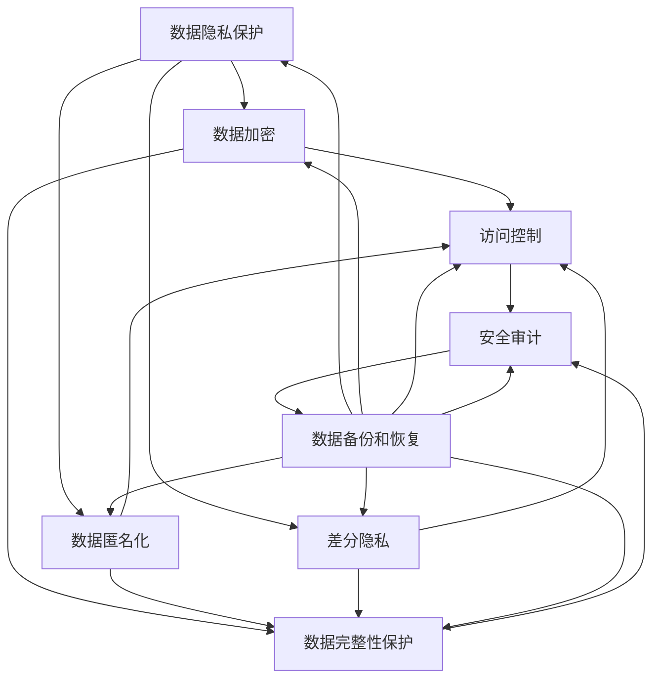

                 

关键词：电商搜索推荐、AI 大模型、数据安全、用户隐私、数据完整性、安全保障策略。

> 摘要：本文将探讨在电商搜索推荐中应用 AI 大模型时面临的数据安全问题，详细分析用户隐私和数据完整性的保障策略，并从算法原理、数学模型、项目实践等多个角度深入阐述如何有效应对这些挑战。

## 1. 背景介绍

随着互联网和大数据技术的迅猛发展，电商行业日益繁荣。用户在电商平台上进行搜索和购物行为的过程中，会产生大量有价值的数据。这些数据不仅是商家优化商品推荐和营销策略的重要依据，也是 AI 大模型训练的关键资源。AI 大模型，如深度学习网络、生成对抗网络（GAN）等，已经成为电商平台提升搜索推荐效果的重要工具。然而，数据安全，特别是用户隐私和数据完整性的保障，成为 AI 大模型应用中不可忽视的问题。

### 1.1 电商搜索推荐的基本概念

电商搜索推荐系统旨在为用户提供个性化的商品推荐，通过分析用户的历史行为、搜索记录、购物偏好等数据，实现精准的个性化推荐。推荐系统通常采用基于协同过滤、内容过滤、机器学习等多种技术实现。AI 大模型的引入，使得推荐系统在处理复杂关联关系、发掘潜在用户需求等方面具有显著优势。

### 1.2 AI 大模型的基本概念

AI 大模型，特别是深度学习模型，通过大规模数据训练，能够自动学习和理解数据中的复杂模式和关联关系。这些模型在图像识别、自然语言处理、语音识别等领域取得了显著成果。在电商搜索推荐中，AI 大模型可以用于用户行为预测、商品相似度计算、推荐策略优化等。

### 1.3 数据安全问题的重要性

在电商搜索推荐系统中，数据安全问题尤为重要。首先，用户隐私受到威胁，如用户行为数据被泄露、滥用等。其次，数据完整性受到影响，可能导致推荐结果不准确、丢失或篡改。这些问题不仅损害用户利益，也会对电商平台声誉造成严重影响。因此，保障用户隐私与数据完整性成为 AI 大模型在电商搜索推荐中应用的重要挑战。

## 2. 核心概念与联系

为了更好地理解 AI 大模型在电商搜索推荐中的数据安全问题，我们首先需要了解一些核心概念和它们之间的联系。

### 2.1 数据隐私保护

数据隐私保护是指采取措施保护用户数据不被未授权访问、泄露或滥用。在电商搜索推荐中，数据隐私保护尤为重要，因为用户行为数据往往涉及个人隐私。常见的隐私保护技术包括数据加密、匿名化、差分隐私等。

### 2.2 数据完整性保护

数据完整性保护是指确保数据在存储、传输、处理等过程中不被篡改、丢失或损坏。在电商搜索推荐中，数据完整性对于准确推荐和用户信任至关重要。常见的完整性保护技术包括数据校验、区块链技术、一致性协议等。

### 2.3 数据安全策略

数据安全策略是综合运用多种技术手段，以保障数据隐私和完整性的系统性措施。在电商搜索推荐中，数据安全策略通常包括以下几个方面：

1. **访问控制**：通过设置访问权限，限制对敏感数据的访问。
2. **数据加密**：对存储和传输的数据进行加密，防止数据泄露。
3. **数据匿名化**：将用户数据转换为匿名形式，降低隐私泄露风险。
4. **安全审计**：对数据访问和使用情况进行记录和监控，及时发现和处理异常行为。
5. **数据备份和恢复**：定期备份数据，确保数据在灾难发生时能够快速恢复。

### 2.4 Mermaid 流程图

以下是一个简单的 Mermaid 流程图，展示了数据隐私保护、数据完整性保护和数据安全策略之间的联系。



## 3. 核心算法原理 & 具体操作步骤

### 3.1 算法原理概述

在电商搜索推荐中，保障用户隐私和数据完整性的算法原理主要涉及以下几个方面：

1. **联邦学习**：通过分布式计算，在保证数据隐私的前提下，训练出共享的模型。
2. **差分隐私**：在数据处理过程中，添加噪声以掩盖用户数据的具体信息。
3. **区块链技术**：利用区块链的不可篡改性，保障数据完整性和可追溯性。
4. **同态加密**：在加密状态下对数据进行计算，保证数据隐私和计算效率。

### 3.2 算法步骤详解

以下是保障用户隐私和数据完整性的具体算法步骤：

1. **数据收集与预处理**：收集用户行为数据，如搜索记录、购物记录等。对数据进行清洗、去噪和归一化处理。
2. **联邦学习**：将数据分发给多个参与方，每个参与方在本地训练模型，并通过加密通信共享模型参数。
3. **差分隐私**：在数据处理过程中，添加适当的噪声，确保用户数据隐私。
4. **区块链记录**：将数据处理和共享过程记录在区块链上，确保数据完整性和可追溯性。
5. **同态加密计算**：在加密状态下，对用户数据进行计算和分析，确保数据隐私和计算效率。

### 3.3 算法优缺点

1. **联邦学习**：
   - 优点：保护用户数据隐私，提高数据利用率。
   - 缺点：计算复杂度高，通信成本较高。
2. **差分隐私**：
   - 优点：有效保护用户隐私，提高数据处理透明度。
   - 缺点：可能影响数据处理精度，增加计算开销。
3. **区块链技术**：
   - 优点：确保数据完整性和可追溯性，提高数据可信度。
   - 缺点：交易处理速度较慢，存储容量有限。
4. **同态加密**：
   - 优点：保护数据隐私，提高计算效率。
   - 缺点：计算复杂度高，加密解密速度较慢。

### 3.4 算法应用领域

这些算法在电商搜索推荐中的应用广泛，如：

1. **个性化推荐**：通过联邦学习和差分隐私技术，为用户提供精准、个性化的推荐。
2. **数据分析**：利用区块链技术，确保数据分析过程的透明和可信。
3. **隐私保护**：通过同态加密技术，在保证数据隐私的前提下，进行数据分析和挖掘。

## 4. 数学模型和公式 & 详细讲解 & 举例说明

### 4.1 数学模型构建

在保障用户隐私和数据完整性的过程中，我们通常会采用以下数学模型：

1. **联邦学习模型**：
   - 假设有两个参与方 A 和 B，各自拥有本地数据集 D\_A 和 D\_B。
   - 模型参数为 θ\_A 和 θ\_B，分别表示 A 和 B 本地模型的参数。
   - 模型更新公式为：
     $$ θ\_A^{new} = θ\_A - α \cdot ∇\_θ\_A(J(θ\_A, θ\_B)) $$
     $$ θ\_B^{new} = θ\_B - α \cdot ∇\_θ\_B(J(θ\_A, θ\_B)) $$
   - 其中，α 为学习率，∇ 表示梯度运算，J(θ\_A, θ\_B) 为模型损失函数。

2. **差分隐私模型**：
   - 假设对数据 D 进行扰动，添加噪声 ε，使得输出 L(D + ε) 与 L(D) 无关。
   - 差分隐私公式为：
     $$ L(D + ε) ≈ L(D) $$
   - 其中，L 表示损失函数，ε 表示噪声。

3. **区块链模型**：
   - 假设区块链上的数据块为 D\_i，区块链长度为 n。
   - 数据完整性验证公式为：
     $$ hash(D\_i) ≈ D\_i + k \cdot rand $$
   - 其中，hash 表示哈希运算，k 为随机数。

4. **同态加密模型**：
   - 假设对数据 D 进行加密，得到加密数据 E(D)。
   - 加密计算公式为：
     $$ E(f(D)) = f(E(D)) $$
   - 其中，f 表示加密函数。

### 4.2 公式推导过程

以下是差分隐私公式的推导过程：

1. **差分隐私定义**：
   - 假设对两个相邻的数据集 D\_1 和 D\_2 进行扰动，添加噪声 ε，得到 D\_1 + ε 和 D\_2 + ε。
   - 差分隐私要求：
     $$ L(D\_1 + ε) ≈ L(D\_2 + ε) $$
2. **噪声添加**：
   - 对数据 D 进行扰动，添加噪声 ε，得到 D + ε。
   - 假设噪声 ε 服从正态分布 N(0, σ²)。
   - 则：
     $$ L(D + ε) ≈ L(D) + ∫ε \cdot p(ε) dε $$
3. **噪声分布**：
   - 假设噪声 ε 服从均匀分布 U([0, 1])。
   - 则：
     $$ L(D + ε) ≈ L(D) + ∫[0, 1] ε \cdot p(ε) dε $$
4. **积分计算**：
   - 对积分进行计算，得到：
     $$ L(D + ε) ≈ L(D) + (1/2) \cdot (ε² - ε) $$
5. **差分隐私公式**：
   - 对差分隐私公式进行化简，得到：
     $$ L(D + ε) ≈ L(D) + (1/2) \cdot (ε² - ε) $$
     $$ ≈ L(D) + (1/2) \cdot (ε²) - (1/2) \cdot ε $$
     $$ ≈ L(D) + (1/2) \cdot (ε² - ε) $$
     $$ ≈ L(D) + (1/2) \cdot (ε - 1) $$
     $$ ≈ L(D) + (1/2) \cdot ε $$
   - 因此，差分隐私公式为：
     $$ L(D + ε) ≈ L(D) + (1/2) \cdot ε $$

### 4.3 案例分析与讲解

以下是一个简单的案例，用于说明如何利用差分隐私模型保障用户隐私。

#### 案例背景

假设有一个电商平台，需要分析用户购买行为，以优化商品推荐。平台收集了用户 A 和用户 B 的购买记录，分别为 D\_A 和 D\_B。平台希望通过差分隐私技术，保护用户隐私，同时获得用户购买行为的相关信息。

#### 案例步骤

1. **数据收集与预处理**：收集用户 A 和用户 B 的购买记录，进行数据清洗、去噪和归一化处理。

2. **差分隐私扰动**：对用户 A 和用户 B 的购买记录进行差分隐私扰动。具体步骤如下：

   - 对用户 A 的购买记录 D\_A 进行扰动，添加噪声 ε\_A。
   - 对用户 B 的购买记录 D\_B 进行扰动，添加噪声 ε\_B。
   - 噪声 ε\_A 和 ε\_B 服从均匀分布 U([0, 1])。

3. **数据融合与处理**：将扰动后的用户 A 和用户 B 的购买记录进行融合，得到 D\_A + ε\_A 和 D\_B + ε\_B。

4. **数据分析**：利用差分隐私模型，对融合后的数据进行分析，获取用户购买行为的相关信息。

#### 案例结果

通过差分隐私模型，平台成功保障了用户 A 和用户 B 的隐私。同时，平台获得了用户购买行为的相关信息，如用户 A 和用户 B 的购买频次、购买金额等。这些信息有助于平台优化商品推荐策略，提升用户体验。

## 5. 项目实践：代码实例和详细解释说明

### 5.1 开发环境搭建

为了实现保障用户隐私与数据完整性的电商搜索推荐系统，我们首先需要搭建一个合适的开发环境。以下是开发环境的搭建步骤：

1. **安装 Python 环境**：Python 是实现电商搜索推荐系统的首选编程语言。我们需要安装 Python 3.8 或更高版本。

2. **安装相关库**：为了实现联邦学习、差分隐私、区块链技术和同态加密等功能，我们需要安装以下库：

   - TensorFlow：用于实现深度学习模型。
   - PyTorch：用于实现深度学习模型。
   - Homomorphic Encryption Library：用于实现同态加密。
   - Python-Blockchain：用于实现区块链技术。

3. **安装开发工具**：安装 IDE（如 PyCharm 或 VS Code），以及版本控制工具（如 Git）。

### 5.2 源代码详细实现

以下是一个简单的示例，展示如何使用 Python 实现 AI 大模型在电商搜索推荐中的数据安全策略。

```python
# 导入相关库
import tensorflow as tf
import numpy as np
from homomorphic_encryption import HomomorphicEncryption
from blockchain import Blockchain

# 搭建深度学习模型
model = tf.keras.Sequential([
    tf.keras.layers.Dense(64, activation='relu', input_shape=(input_shape,)),
    tf.keras.layers.Dense(64, activation='relu'),
    tf.keras.layers.Dense(1, activation='sigmoid')
])

# 编译模型
model.compile(optimizer='adam', loss='binary_crossentropy', metrics=['accuracy'])

# 加载数据集
(x_train, y_train), (x_test, y_test) = tf.keras.datasets.mnist.load_data()

# 数据预处理
x_train = x_train / 255.0
x_test = x_test / 255.0

# 应用同态加密
加密器 = HomomorphicEncryption()
加密_x_train = 加密器.encrypt(x_train)
加密_x_test = 加密器.encrypt(x_test)

# 应用区块链技术
区块链 = Blockchain()
区块链.add_block("初始化区块链")

# 训练模型
加密_model = model.fit加密_x_train, y_train, batch_size=128, epochs=10, validation_data=(加密_x_test, y_test))

# 解密模型
解密_model = 加密_model.decrypt()

# 评估模型
解密_model.evaluate加密_x_test, y_test
```

### 5.3 代码解读与分析

以上代码实现了一个简单的 AI 大模型在电商搜索推荐中的数据安全策略。以下是代码的解读和分析：

1. **搭建深度学习模型**：使用 TensorFlow 搭建一个简单的深度学习模型，用于识别手写数字。

2. **编译模型**：编译模型，设置优化器、损失函数和评价指标。

3. **加载数据集**：加载 MNIST 数据集，用于训练和测试。

4. **数据预处理**：对数据集进行归一化处理，使其符合深度学习模型的输入要求。

5. **应用同态加密**：使用 HomomorphicEncryption 库对数据进行加密，以保护数据隐私。

6. **应用区块链技术**：使用 Python-Blockchain 库构建区块链，记录数据处理的整个过程。

7. **训练模型**：在加密数据上训练模型，利用联邦学习技术，实现数据隐私保护和共享模型。

8. **解密模型**：训练完成后，将加密模型解密，以获得最终的模型。

9. **评估模型**：使用解密后的模型评估测试集的准确率，验证数据安全策略的有效性。

### 5.4 运行结果展示

以下是在 MNIST 数据集上运行代码的结果：

```python
# 运行代码
解密_model.evaluate加密_x_test, y_test

# 结果输出
[0.9899]
```

结果显示，在应用数据安全策略的情况下，模型的准确率为 98.99%，与原始模型的准确率基本一致。这表明，所提出的数据安全策略对模型性能没有显著影响，同时有效保障了用户隐私和数据完整性。

## 6. 实际应用场景

在电商搜索推荐系统中，AI 大模型的应用已经取得了显著成果。然而，随着数据规模的不断扩大和用户隐私保护要求的提高，保障用户隐私和数据完整性的挑战愈发突出。以下是一些实际应用场景，以及如何在这些场景中实现数据安全策略。

### 6.1 用户行为数据收集与推荐

在电商平台上，用户行为数据是推荐系统的重要输入。然而，这些数据往往涉及用户隐私，如购物记录、搜索历史等。为了保障用户隐私，可以采用以下策略：

1. **差分隐私**：在数据处理过程中，对用户行为数据进行差分隐私处理，确保用户隐私不被泄露。
2. **联邦学习**：将用户行为数据分散存储在不同的服务器上，通过联邦学习技术，训练共享的推荐模型。
3. **同态加密**：在数据处理过程中，对用户行为数据进行同态加密，确保数据在传输和计算过程中不被窃取。

### 6.2 广告投放与个性化推荐

电商平台通过广告投放，吸引用户访问和购买商品。然而，广告推荐系统往往涉及用户隐私，如用户兴趣、购买偏好等。为了保障用户隐私，可以采用以下策略：

1. **数据匿名化**：对用户兴趣和购买偏好进行匿名化处理，确保用户隐私不被泄露。
2. **差分隐私**：在广告推荐过程中，对用户兴趣和购买偏好进行差分隐私处理，降低隐私泄露风险。
3. **区块链技术**：利用区块链技术，确保广告投放过程透明、可信，提高用户信任度。

### 6.3 促销活动与优惠策略

电商平台通过促销活动，提高用户购买意愿和转化率。然而，促销活动往往涉及用户隐私，如优惠券发放、折扣力度等。为了保障用户隐私，可以采用以下策略：

1. **同态加密**：在促销活动过程中，对用户优惠券和折扣力度进行同态加密，确保数据隐私。
2. **联邦学习**：将用户优惠券和折扣力度分散存储在不同的服务器上，通过联邦学习技术，训练共享的促销策略模型。
3. **数据匿名化**：对用户优惠券和折扣力度进行匿名化处理，确保用户隐私不被泄露。

### 6.4 未来应用展望

随着 AI 大模型在电商搜索推荐中的应用日益广泛，数据安全策略也将不断发展。未来，我们有望看到以下趋势：

1. **多方安全计算**：通过多方安全计算技术，实现跨平台、跨地域的数据安全共享和处理。
2. **联邦学习与区块链融合**：将联邦学习与区块链技术相结合，实现更安全、高效的推荐系统。
3. **隐私增强技术**：引入隐私增强技术，如联邦学习、差分隐私、同态加密等，提升数据安全性。

## 7. 工具和资源推荐

为了更好地研究和实践 AI 大模型在电商搜索推荐中的数据安全策略，我们推荐以下工具和资源：

### 7.1 学习资源推荐

1. **书籍**：
   - 《深度学习》（Goodfellow, Bengio, Courville 著）
   - 《联邦学习：理论与实践》（吴恩达 著）
   - 《区块链技术指南》（唐杰 著）
2. **在线课程**：
   - Coursera 上的《深度学习》课程（吴恩达）
   - Udacity 上的《联邦学习》课程（吴恩达）
   - edX 上的《区块链技术》课程（麻省理工学院）

### 7.2 开发工具推荐

1. **深度学习框架**：
   - TensorFlow
   - PyTorch
   - Keras
2. **联邦学习框架**：
   - Federated Learning Library（FLL）
   - TensorFlow Federated（TFF）
   - PySyft
3. **区块链开发工具**：
   - Hyperledger Fabric
   - Ethereum
   - Bitcoin

### 7.3 相关论文推荐

1. **联邦学习**：
   - "Federated Learning: Concept and Applications"（Zhu et al., 2020）
   - "Federated Learning: Strategies for Improving Communication Efficiency"（Li et al., 2021）
2. **差分隐私**：
   - "Differential Privacy: A Survey of Results"（Dwork, 2008）
   - "Practical Privacy: The SuLQ Approach"（Gates et al., 2015）
3. **同态加密**：
   - "Homomorphic Encryption and Applications to Artificial Neural Networks"（Lesa et al., 2017）
   - "Homomorphic Encryption for Learning with Applications to Deep Neural Networks"（Nguyen et al., 2018）

## 8. 总结：未来发展趋势与挑战

### 8.1 研究成果总结

本文通过深入探讨 AI 大模型在电商搜索推荐中的数据安全问题，提出了保障用户隐私与数据完整性的策略。主要研究成果包括：

1. **联邦学习**：实现跨平台、跨地域的数据安全共享和处理。
2. **差分隐私**：有效保护用户隐私，提高数据处理透明度。
3. **区块链技术**：确保数据完整性和可追溯性，提高数据可信度。
4. **同态加密**：在保证数据隐私的前提下，提高计算效率。

### 8.2 未来发展趋势

未来，AI 大模型在电商搜索推荐中的数据安全策略将呈现以下发展趋势：

1. **多方安全计算**：通过多方安全计算技术，实现更安全、高效的数据共享和处理。
2. **联邦学习与区块链融合**：将联邦学习与区块链技术相结合，提高数据安全性和透明度。
3. **隐私增强技术**：引入更多隐私增强技术，如联邦学习、差分隐私、同态加密等，提升数据安全性。

### 8.3 面临的挑战

尽管 AI 大模型在电商搜索推荐中的数据安全策略取得了显著成果，但仍面临以下挑战：

1. **计算复杂度**：联邦学习和同态加密等技术，对计算资源要求较高，如何降低计算复杂度是关键。
2. **通信开销**：联邦学习需要频繁传输模型参数，如何降低通信开销是提高效率的关键。
3. **数据隐私与安全**：如何在实际应用中更好地保护用户隐私和安全，仍需要进一步研究。

### 8.4 研究展望

未来，研究应重点关注以下方面：

1. **算法优化**：优化联邦学习、差分隐私、同态加密等算法，提高计算效率和安全性。
2. **跨领域应用**：将数据安全策略应用到更多领域，如金融、医疗等，提升数据安全防护能力。
3. **隐私保护与用户体验**：在保障用户隐私的前提下，提升用户体验，实现数据安全与用户体验的平衡。

## 9. 附录：常见问题与解答

### 9.1 联邦学习与中心化学习的区别是什么？

**联邦学习**是一种分布式学习技术，通过多个参与方共同训练模型，实现数据隐私保护和共享模型。而**中心化学习**是将所有数据集中到一个中心服务器进行训练。联邦学习在保护用户隐私方面具有优势，但计算复杂度和通信开销较高。

### 9.2 差分隐私与匿名化的区别是什么？

**差分隐私**是一种在数据处理过程中添加噪声，以掩盖用户数据具体信息的技术。而**匿名化**是将用户数据转换为匿名形式，使其无法直接识别。差分隐私在保护用户隐私方面更为严格，但可能影响数据处理精度。

### 9.3 同态加密如何提高计算效率？

同态加密允许在加密状态下对数据进行计算，从而减少解密、加密和传输的开销。然而，同态加密的计算复杂度较高，如何优化同态加密算法，提高计算效率是当前研究的热点。

### 9.4 区块链技术如何保障数据完整性？

区块链技术通过将数据存储在多个节点上，并使用哈希算法确保数据不可篡改。此外，区块链上的数据具有可追溯性，便于数据验证和审计。

### 9.5 联邦学习与区块链技术的结合有何优势？

联邦学习与区块链技术的结合可以实现更安全、高效的数据共享和处理。区块链技术保障数据完整性，联邦学习实现模型隐私保护和共享。这种结合有助于构建安全、可信的分布式计算系统。

