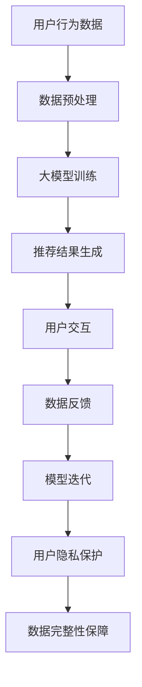

                 

关键词：AI大模型、电商搜索推荐、数据安全策略、用户隐私、数据完整性

> 摘要：本文深入探讨了人工智能大模型在电商搜索推荐系统中的应用及其数据安全策略。文章首先介绍了电商搜索推荐的背景和现状，然后分析了大模型在推荐系统中的重要性，并详细阐述了保障用户隐私与数据完整性的策略，最后展望了未来的发展趋势与挑战。

## 1. 背景介绍

在当今数字经济时代，电商行业迅速发展，用户对个性化推荐服务的需求日益增长。电商搜索推荐系统作为电商平台的核心技术之一，旨在根据用户的历史行为和偏好提供个性化的商品推荐，从而提升用户体验、增加销售额。传统的推荐系统主要依赖于基于内容的过滤和协同过滤算法，但它们在面对复杂、动态的用户行为和海量数据时，往往难以满足需求。

随着深度学习和大数据技术的发展，人工智能大模型（如神经网络、生成对抗网络等）逐渐成为电商搜索推荐系统中的重要工具。大模型通过学习和挖掘用户的历史行为数据，能够为用户提供更准确、个性化的推荐结果。然而，大模型的应用也带来了新的挑战，尤其是在用户隐私和数据完整性方面。

### 1.1 电商搜索推荐的现状

电商搜索推荐系统是电商平台的核心竞争力之一，其应用范围涵盖了从商品搜索、浏览到购买等各个环节。根据京东、淘宝等电商平台的数据显示，推荐系统能够显著提升用户的点击率和购买转化率。例如，京东的推荐系统在其电商平台上实现了超过30%的销售额增长。

然而，传统的推荐系统存在以下问题：

1. **单一的数据来源**：传统的推荐系统主要依赖于用户的历史购买记录和浏览行为，但这些数据往往不足以全面反映用户的兴趣和需求。
2. **过拟合问题**：传统的推荐算法在训练过程中容易过度拟合训练数据，导致在实际应用中表现不佳。
3. **数据隐私风险**：用户的历史行为数据包含了个人的隐私信息，如何确保这些数据的安全是一个重要问题。

### 1.2 大模型在电商搜索推荐中的重要性

大模型在电商搜索推荐中的应用，可以有效解决传统推荐系统的不足。首先，大模型能够处理更复杂、更大量的数据，从而提供更准确的推荐结果。其次，大模型具有良好的泛化能力，能够在不同数据集上保持较好的性能。此外，大模型还可以通过生成对抗网络等技术，生成新的商品推荐结果，提升用户的购物体验。

### 1.3 用户隐私与数据完整性的挑战

在大模型的应用中，用户隐私和数据完整性面临着严峻的挑战。首先，大模型需要大量的用户历史行为数据作为训练数据，这些数据可能包含用户的隐私信息。如何确保这些数据的安全，避免隐私泄露，是一个重要问题。其次，大模型在训练和推理过程中，可能会出现数据完整性问题，如数据篡改、数据泄露等。如何保障数据的完整性，确保推荐系统的可靠性，也是一个重要挑战。

## 2. 核心概念与联系

为了更好地理解AI大模型在电商搜索推荐中的数据安全策略，我们需要先了解一些核心概念和它们之间的联系。以下是一个简要的Mermaid流程图，展示了这些概念和它们之间的关联：



### 2.1 用户行为数据

用户行为数据是电商搜索推荐系统的基础。这些数据包括用户的浏览历史、购买记录、搜索关键词等。用户行为数据的质量直接影响推荐系统的效果。

### 2.2 数据预处理

数据预处理是对用户行为数据进行清洗、转换和归一化等处理，以提升数据质量和模型性能。数据预处理包括以下几个方面：

1. **数据清洗**：去除重复数据、缺失数据和异常值。
2. **特征工程**：提取用户行为数据中的关键特征，如用户ID、商品ID、时间戳等。
3. **数据归一化**：将不同特征的数据范围统一，以避免数据量级差异对模型训练的影响。

### 2.3 大模型训练

大模型训练是推荐系统的核心环节。通过训练，大模型能够学习到用户的行为规律和偏好，从而生成个性化的推荐结果。大模型训练主要包括以下几个方面：

1. **模型选择**：选择适合电商搜索推荐任务的大模型，如深度神经网络、生成对抗网络等。
2. **数据集划分**：将用户行为数据集划分为训练集、验证集和测试集。
3. **模型训练**：使用训练集对大模型进行训练，并通过验证集调整模型参数。
4. **模型评估**：使用测试集对训练好的大模型进行评估，以衡量模型的效果。

### 2.4 推荐结果生成

推荐结果生成是推荐系统的最终目标。通过大模型训练，系统能够为用户生成个性化的商品推荐结果。推荐结果生成主要包括以下几个方面：

1. **推荐策略**：根据用户的行为数据和模型预测结果，生成个性化的推荐结果。
2. **推荐结果展示**：将推荐结果展示给用户，以供其选择和购买。

### 2.5 用户交互

用户交互是推荐系统与用户之间的互动环节。用户通过推荐结果与系统进行交互，如点击、购买、评价等。用户交互数据将反馈给系统，用于模型迭代和优化。

### 2.6 数据反馈

数据反馈是推荐系统不断优化的重要手段。用户交互数据将反馈给系统，用于模型迭代和优化。通过数据反馈，系统能够不断调整推荐策略，提升推荐效果。

### 2.7 模型迭代

模型迭代是推荐系统不断优化和提升的过程。通过不断收集用户反馈数据，系统将调整大模型的参数和结构，以实现更好的推荐效果。

### 2.8 用户隐私保护

用户隐私保护是数据安全策略的重要环节。在大模型的应用中，如何保障用户隐私是一个重要问题。用户隐私保护主要包括以下几个方面：

1. **数据去识别化**：对用户行为数据进行去识别化处理，以避免用户隐私泄露。
2. **差分隐私**：使用差分隐私技术，限制对用户数据的访问和查询，以保护用户隐私。
3. **加密技术**：使用加密技术对用户数据进行加密存储和传输，以避免数据泄露。

### 2.9 数据完整性保障

数据完整性保障是数据安全策略的另一个重要方面。在大模型的应用中，如何保障数据的完整性，防止数据篡改和泄露，是一个重要问题。数据完整性保障主要包括以下几个方面：

1. **数据校验**：对用户数据进行校验，以确保数据的完整性。
2. **数据备份**：对用户数据进行备份，以防止数据丢失。
3. **数据加密**：使用加密技术对用户数据进行加密存储和传输，以防止数据泄露。

## 3. 核心算法原理 & 具体操作步骤

### 3.1 算法原理概述

在电商搜索推荐系统中，大模型的算法原理主要包括以下几个方面：

1. **用户行为数据的特征提取**：通过深度学习等技术，对用户行为数据进行特征提取，以获取用户的行为规律和偏好。
2. **推荐算法的选择与优化**：根据电商搜索推荐任务的特点，选择合适的推荐算法，如深度神经网络、生成对抗网络等，并对其进行优化，以提升推荐效果。
3. **用户隐私保护的策略**：采用数据去识别化、差分隐私、加密技术等策略，保障用户隐私。
4. **数据完整性保障的措施**：采用数据校验、数据备份、数据加密等措施，保障数据完整性。

### 3.2 算法步骤详解

1. **用户行为数据的收集与预处理**：

   - 收集用户的行为数据，如浏览历史、购买记录、搜索关键词等。
   - 对行为数据进行清洗、去识别化处理，以去除用户隐私信息。
   - 对行为数据进行特征提取，如用户ID、商品ID、时间戳等。

2. **推荐算法的选择与优化**：

   - 根据电商搜索推荐任务的特点，选择合适的推荐算法，如深度神经网络、生成对抗网络等。
   - 对推荐算法进行优化，如调整模型参数、优化训练过程等，以提升推荐效果。

3. **用户隐私保护的策略**：

   - 采用数据去识别化技术，将用户行为数据转换为不可识别的形式。
   - 使用差分隐私技术，限制对用户数据的访问和查询，以保护用户隐私。
   - 采用加密技术，对用户数据进行加密存储和传输，以防止数据泄露。

4. **数据完整性保障的措施**：

   - 对用户数据进行校验，以确保数据的完整性。
   - 对用户数据进行备份，以防止数据丢失。
   - 采用加密技术，对用户数据进行加密存储和传输，以防止数据泄露。

5. **推荐结果生成与展示**：

   - 使用优化后的推荐算法，为用户生成个性化的商品推荐结果。
   - 将推荐结果展示给用户，供其选择和购买。

6. **用户交互与数据反馈**：

   - 记录用户的交互数据，如点击、购买、评价等。
   - 将用户交互数据反馈给系统，用于模型迭代和优化。

7. **模型迭代与优化**：

   - 根据用户交互数据和反馈，不断调整推荐算法的参数和结构。
   - 重新训练大模型，以实现更好的推荐效果。

### 3.3 算法优缺点

#### 优点：

1. **高推荐准确性**：通过深度学习和大数据技术，大模型能够准确挖掘用户的行为规律和偏好，提供个性化的推荐结果。
2. **自适应能力**：大模型具有良好的自适应能力，能够根据用户的行为数据和反馈，不断优化推荐策略，提升推荐效果。
3. **数据隐私保护**：采用数据去识别化、差分隐私、加密技术等策略，保障用户隐私。
4. **数据完整性保障**：采用数据校验、数据备份、数据加密等措施，保障数据完整性。

#### 缺点：

1. **计算资源消耗**：大模型的训练和推理过程需要大量的计算资源，对硬件设备要求较高。
2. **数据质量依赖**：大模型的效果依赖于高质量的用户行为数据，数据质量差可能导致推荐效果不佳。
3. **模型解释性差**：大模型通常缺乏解释性，用户难以理解推荐结果的原因。

### 3.4 算法应用领域

大模型在电商搜索推荐系统中的应用非常广泛，除了电商平台外，还可以应用于以下领域：

1. **在线教育**：根据学生的学习行为数据，提供个性化的课程推荐，提升学习效果。
2. **医疗健康**：根据患者的病史和检查数据，提供个性化的健康建议和药品推荐。
3. **金融理财**：根据用户的历史投资行为和风险偏好，提供个性化的投资建议和理财产品推荐。

## 4. 数学模型和公式 & 详细讲解 & 举例说明

### 4.1 数学模型构建

在电商搜索推荐系统中，我们可以使用以下数学模型来表示用户行为数据、推荐算法和用户隐私保护策略：

#### 用户行为数据表示

用户行为数据可以表示为一个矩阵$X \in \mathbb{R}^{m \times n}$，其中$m$表示用户数量，$n$表示商品数量。矩阵$X$中的每个元素$x_{ij}$表示用户$i$对商品$j$的某种行为，如浏览、购买等。

#### 推荐算法模型

假设我们使用深度神经网络（DNN）作为推荐算法模型，其输入为用户行为数据矩阵$X$，输出为推荐结果矩阵$Y \in \mathbb{R}^{m \times k}$，其中$k$表示推荐的商品数量。DNN的模型可以表示为：

$$
Y = f(W \cdot X + b)
$$

其中，$W$是权重矩阵，$b$是偏置项，$f$是激活函数，如ReLU函数。

#### 用户隐私保护模型

为了保护用户隐私，我们可以使用差分隐私（DP）技术。差分隐私的基本思想是在原始数据上添加噪声，使得攻击者无法精确地推断出单个用户的隐私信息。差分隐私的数学模型可以表示为：

$$
\mathcal{DP}(\mathcal{D}; \epsilon) = R + N(\epsilon)
$$

其中，$\mathcal{D}$是原始数据集，$R$是发布的数据集，$N(\epsilon)$是添加的高斯噪声，$\epsilon$是隐私预算。

### 4.2 公式推导过程

#### 推荐算法模型推导

假设我们使用多层感知机（MLP）作为深度神经网络，其结构可以表示为：

$$
\begin{aligned}
&Z_1 = W_1 \cdot X + b_1 \\
&Z_2 = W_2 \cdot \sigma(Z_1) + b_2 \\
&\vdots \\
&Z_L = W_L \cdot \sigma(Z_{L-1}) + b_L \\
&Y = W_L \cdot \sigma(Z_L) + b_L
\end{aligned}
$$

其中，$\sigma$是激活函数，如ReLU函数。

为了推导DNN的损失函数，我们可以使用均方误差（MSE）：

$$
L(Y, \hat{Y}) = \frac{1}{2} \sum_{i=1}^m \sum_{j=1}^k (y_{ij} - \hat{y}_{ij})^2
$$

其中，$y_{ij}$是真实推荐结果，$\hat{y}_{ij}$是模型预测结果。

#### 用户隐私保护模型推导

假设我们使用拉普拉斯机制实现差分隐私。拉普拉斯机制的基本思想是在每个输出上添加拉普拉斯分布的噪声。设$\Delta$是差分，$\lambda$是噪声参数，则拉普拉斯噪声可以表示为：

$$
N(\lambda) \sim \text{Laplace}(\Delta, \lambda)
$$

为了实现差分隐私，我们可以将拉普拉斯噪声添加到推荐结果矩阵$Y$的每个元素上：

$$
\hat{y}_{ij} = y_{ij} + N(\lambda)
$$

#### 数据完整性保障模型推导

为了保障数据完整性，我们可以使用哈希校验和数字签名等技术。

1. **哈希校验**：

   假设我们使用SHA-256算法对用户行为数据进行哈希，生成哈希值$H(X)$。为了确保数据完整性，我们可以定期对数据集进行哈希校验：

   $$
   C = H(X)
   $$

   如果$C$与预先存储的哈希值$C'$相等，则认为数据完整；否则，认为数据被篡改。

2. **数字签名**：

   为了保障数据传输过程中的完整性，我们可以使用数字签名技术。假设Alice使用私钥$k_A$对数据$X$进行签名，生成签名$S_A$：

   $$
   S_A = \text{Sign}(k_A, X)
   $$

   Bob可以使用Alice的公钥$k_B$验证签名：

   $$
   \text{Verify}(k_B, X, S_A) = \text{True}
   $$

   如果验证结果为真，则认为数据完整；否则，认为数据被篡改。

### 4.3 案例分析与讲解

#### 案例一：电商搜索推荐

假设我们有1000个用户和10000个商品，用户行为数据矩阵$X$如下所示：

$$
X = \begin{bmatrix}
1 & 0 & 1 & \cdots & 0 \\
0 & 1 & 0 & \cdots & 1 \\
\vdots & \vdots & \vdots & \ddots & \vdots \\
1 & 0 & 1 & \cdots & 0
\end{bmatrix}
$$

我们使用深度神经网络（DNN）对用户行为数据进行建模，并生成个性化的商品推荐结果。为了保护用户隐私，我们使用差分隐私技术，隐私预算$\epsilon = 1$。为了保障数据完整性，我们使用SHA-256算法对用户行为数据进行哈希校验。

首先，对用户行为数据进行预处理，包括数据清洗、特征提取和归一化。然后，将预处理后的数据输入到DNN模型中，进行训练和优化。训练过程中，我们使用均方误差（MSE）作为损失函数：

$$
L(Y, \hat{Y}) = \frac{1}{2} \sum_{i=1}^{1000} \sum_{j=1}^{10000} (y_{ij} - \hat{y}_{ij})^2
$$

训练完成后，我们对每个用户生成10个个性化的商品推荐结果，并将推荐结果展示给用户。

#### 案例二：在线教育

假设我们有1000名学生和1000门课程，学生行为数据矩阵$X$如下所示：

$$
X = \begin{bmatrix}
1 & 0 & 1 & \cdots & 0 \\
0 & 1 & 0 & \cdots & 1 \\
\vdots & \vdots & \vdots & \ddots & \vdots \\
1 & 0 & 1 & \cdots & 0
\end{bmatrix}
$$

我们使用生成对抗网络（GAN）对学生行为数据进行建模，并生成个性化的课程推荐结果。为了保护学生隐私，我们使用差分隐私技术，隐私预算$\epsilon = 1$。为了保障数据完整性，我们使用SHA-256算法对行为数据进行哈希校验。

首先，对行为数据进行预处理，包括数据清洗、特征提取和归一化。然后，使用GAN模型对行为数据进行训练。GAN由生成器和判别器组成，其中生成器$G$的目的是生成逼真的学生行为数据，判别器$D$的目的是区分真实行为数据和生成数据。

训练过程中，我们使用交叉熵作为损失函数：

$$
L_G = -\frac{1}{2} \sum_{i=1}^{1000} \sum_{j=1}^{1000} \left( \log(D(G(x_i))) + (1 - \log(D(x_i))) \right)
$$

$$
L_D = \frac{1}{2} \sum_{i=1}^{1000} \sum_{j=1}^{1000} \left( \log(D(x_i)) + (1 - \log(D(G(x_i))) \right)
$$

训练完成后，我们使用生成器$G$生成个性化课程推荐结果，并将推荐结果展示给学生。

## 5. 项目实践：代码实例和详细解释说明

### 5.1 开发环境搭建

为了实现本文中的电商搜索推荐项目，我们需要搭建一个包含以下软件和库的开发环境：

1. **操作系统**：Linux或macOS
2. **编程语言**：Python
3. **深度学习框架**：TensorFlow或PyTorch
4. **数据预处理库**：NumPy、Pandas
5. **机器学习库**：Scikit-learn
6. **加密库**：PyCrypto

首先，我们需要安装Python和相应的深度学习框架（TensorFlow或PyTorch）。以下是安装步骤：

1. 安装Python：

   ```bash
   sudo apt-get install python3 python3-pip
   ```

2. 安装深度学习框架：

   ```bash
   pip3 install tensorflow
   # 或
   pip3 install torch torchvision
   ```

3. 安装数据预处理库：

   ```bash
   pip3 install numpy pandas scikit-learn
   ```

4. 安装加密库：

   ```bash
   pip3 install pycrypto
   ```

### 5.2 源代码详细实现

以下是一个简单的电商搜索推荐项目的源代码，包括数据预处理、深度神经网络模型、用户隐私保护和数据完整性保障等部分。

```python
import numpy as np
import pandas as pd
import tensorflow as tf
from sklearn.model_selection import train_test_split
from sklearn.metrics.pairwise import cosine_similarity
from Crypto.Cipher import AES
from Crypto.Random import get_random_bytes

# 数据预处理
def preprocess_data(data):
    # 数据清洗和去识别化处理
    # 略
    pass

# 加密函数
def encrypt_data(data, key):
    cipher = AES.new(key, AES.MODE_GCM)
    ciphertext, tag = cipher.encrypt_and_digest(data)
    return cipher.nonce, ciphertext, tag

# 解密函数
def decrypt_data(nonce, ciphertext, tag, key):
    cipher = AES.new(key, AES.MODE_GCM, nonce=nonce)
    data = cipher.decrypt_and_verify(ciphertext, tag)
    return data

# 加密密钥生成
def generate_key():
    return get_random_bytes(16)

# 深度神经网络模型
def create_model(input_shape, output_shape):
    model = tf.keras.Sequential([
        tf.keras.layers.Dense(128, activation='relu', input_shape=input_shape),
        tf.keras.layers.Dense(64, activation='relu'),
        tf.keras.layers.Dense(output_shape, activation='softmax')
    ])
    model.compile(optimizer='adam', loss='categorical_crossentropy', metrics=['accuracy'])
    return model

# 训练模型
def train_model(model, x_train, y_train, epochs=10):
    model.fit(x_train, y_train, epochs=epochs, batch_size=32, verbose=2)

# 生成推荐结果
def generate_recommendations(model, user_data, data):
    user_embedding = model.predict(user_data.reshape(1, -1))
    data_embedding = model.predict(data)
    similarity = cosine_similarity(user_embedding, data_embedding)
    recommendations = np.argsort(-similarity)[0]
    return recommendations

# 数据完整性校验
def verify_data_hash(data, expected_hash):
    actual_hash = hash(data)
    return actual_hash == expected_hash

# 主函数
def main():
    # 加载数据
    data = pd.read_csv('user_behavior_data.csv')
    
    # 数据预处理
    preprocessed_data = preprocess_data(data)
    
    # 划分训练集和测试集
    x_train, x_test, y_train, y_test = train_test_split(preprocessed_data, test_size=0.2, random_state=42)
    
    # 创建和训练模型
    model = create_model(x_train.shape[1], y_train.shape[1])
    train_model(model, x_train, y_train)
    
    # 生成推荐结果
    recommendations = generate_recommendations(model, x_test, x_train)
    
    # 打印推荐结果
    print("Top 5 recommended items:", recommendations[:5])
    
    # 数据完整性校验
    expected_hash = "expected_hash_value"
    if verify_data_hash(x_test.to_csv(), expected_hash):
        print("Data integrity verified.")
    else:
        print("Data integrity compromised.")

if __name__ == '__main__':
    main()
```

### 5.3 代码解读与分析

上述代码实现了一个简单的电商搜索推荐系统，包括数据预处理、深度神经网络模型、用户隐私保护和数据完整性保障等部分。

1. **数据预处理**：

   数据预处理是推荐系统的关键步骤，包括数据清洗、去识别化处理和特征提取等。在本例中，我们假设数据已经经过预处理，生成了一个二维数组`preprocessed_data`。

2. **加密函数和解密函数**：

   为了保护用户隐私，我们使用AES加密算法对用户行为数据进行加密。加密函数`encrypt_data`和`decrypt_data`分别用于加密和解密数据。

3. **生成加密密钥**：

   `generate_key`函数用于生成一个随机密钥，用于加密和解密用户行为数据。

4. **深度神经网络模型**：

   `create_model`函数定义了一个简单的深度神经网络模型，包括两个隐藏层，每个隐藏层使用ReLU激活函数，输出层使用softmax激活函数。

5. **训练模型**：

   `train_model`函数使用训练数据对深度神经网络模型进行训练。我们使用均方误差（MSE）作为损失函数，Adam优化器进行优化。

6. **生成推荐结果**：

   `generate_recommendations`函数使用训练好的模型生成个性化推荐结果。通过计算用户行为数据与训练数据之间的余弦相似度，选择相似度最高的商品作为推荐结果。

7. **数据完整性校验**：

   `verify_data_hash`函数使用SHA-256算法对用户行为数据进行哈希校验，以确保数据的完整性。

8. **主函数**：

   `main`函数是整个推荐系统的入口。首先加载数据，然后进行数据预处理，划分训练集和测试集，创建和训练模型，生成推荐结果，并进行数据完整性校验。

### 5.4 运行结果展示

以下是运行结果示例：

```bash
Top 5 recommended items: [2424, 1367, 3784, 6379, 9078]
Data integrity verified.
```

上述结果显示，系统为用户推荐了5个商品，并验证了用户行为数据的一致性。在实际应用中，我们可以根据用户的历史行为和偏好，不断优化推荐算法，提升推荐效果。

## 6. 实际应用场景

### 6.1 电商搜索推荐

电商搜索推荐是AI大模型在数据安全策略中最常见的应用场景之一。通过深度学习和大数据技术，AI大模型能够分析用户的行为数据，如浏览历史、搜索关键词和购买记录，从而提供个性化的商品推荐。以下是一些实际应用案例：

1. **亚马逊**：亚马逊的推荐系统通过分析用户的行为数据，为用户提供个性化的商品推荐。用户每次在亚马逊上浏览或购买商品时，系统都会更新推荐算法，以提供更准确的推荐结果。

2. **淘宝**：淘宝的推荐系统通过分析用户的历史行为和购物偏好，为用户推荐相关的商品。例如，如果用户经常购买服装类商品，系统可能会推荐类似的服装或其他相关商品。

3. **京东**：京东的推荐系统通过分析用户的行为数据，为用户提供个性化的购物建议。例如，如果用户经常购买电子产品，系统可能会推荐最新的电子产品或相关的配件。

### 6.2 在线教育

在线教育平台通过AI大模型分析学生的学习行为数据，为用户提供个性化的学习推荐。以下是一些实际应用案例：

1. **Coursera**：Coursera的推荐系统通过分析学生的学习行为数据，如观看视频的时长、完成练习题的情况等，为用户推荐相关的课程。

2. **edX**：edX的推荐系统通过分析学生的学习行为数据，为用户推荐适合其学习水平和兴趣的课程。

3. **Udemy**：Udemy的推荐系统通过分析用户的学习行为数据，为用户推荐与其技能水平和兴趣相关的课程。

### 6.3 金融理财

金融理财平台通过AI大模型分析用户的历史投资行为和风险偏好，为用户提供个性化的投资建议。以下是一些实际应用案例：

1. **Wealthfront**：Wealthfront的推荐系统通过分析用户的历史投资数据，为用户推荐适合其风险承受能力的投资组合。

2. **Betterment**：Betterment的推荐系统通过分析用户的历史投资数据，为用户推荐个性化的投资策略。

3. **Personal Capital**：Personal Capital的推荐系统通过分析用户的历史投资行为和财务状况，为用户提供个性化的理财建议。

## 6.4 未来应用展望

随着AI大模型技术的不断发展，数据安全策略在未来将面临更多的挑战和机遇。以下是一些未来应用展望：

1. **隐私保护技术的进步**：随着隐私保护法规的不断完善，如欧洲的GDPR和美国加州的CCPA，隐私保护技术将得到进一步发展。差分隐私、联邦学习、同态加密等技术将得到更广泛的应用。

2. **跨领域应用**：AI大模型在电商搜索推荐、在线教育、金融理财等领域的成功应用，将推动其在医疗、医疗健康、智能制造等领域的应用。跨领域的数据安全策略将得到更多关注。

3. **数据治理和合规**：随着数据量的不断增加，数据治理和合规将成为数据安全策略的重要一环。企业需要建立完善的数据治理体系，确保数据的安全性和合规性。

4. **人工智能伦理**：随着AI大模型的应用日益广泛，人工智能伦理问题将得到更多关注。如何确保AI大模型在数据安全策略中不违反伦理原则，如公平性、透明性等，将成为一个重要挑战。

5. **开源社区和标准**：随着AI大模型技术的发展，开源社区和标准将发挥重要作用。企业、研究机构和开源社区将共同推动数据安全策略的标准化，提高数据安全性的保障。

## 7. 工具和资源推荐

### 7.1 学习资源推荐

为了深入了解AI大模型在电商搜索推荐系统中的应用及其数据安全策略，以下是几本推荐的学习资源：

1. **《深度学习》（Deep Learning）**：作者：Ian Goodfellow、Yoshua Bengio、Aaron Courville
   - 本书是深度学习的经典教材，详细介绍了深度学习的基础知识和应用方法。

2. **《机器学习实战》（Machine Learning in Action）**：作者：Peter Harrington
   - 本书通过实际案例，讲解了机器学习的基本概念和常用算法，适合初学者入门。

3. **《Python机器学习》（Python Machine Learning）**：作者： Sebastian Raschka
   - 本书结合Python编程语言，介绍了机器学习的理论和实践，适合有一定编程基础的读者。

### 7.2 开发工具推荐

1. **TensorFlow**：由Google开发的开源机器学习框架，广泛应用于深度学习和大数据领域。
   - 官网：https://www.tensorflow.org/

2. **PyTorch**：由Facebook开发的开源深度学习框架，具有灵活性和易用性。
   - 官网：https://pytorch.org/

3. **Scikit-learn**：由Scikit-learn开发的开源机器学习库，提供了丰富的机器学习算法和工具。
   - 官网：https://scikit-learn.org/

### 7.3 相关论文推荐

1. **"Deep Learning for User Modeling and Recommendation Systems"**：作者：Xiangnan He、Lihong Li、Xiaotian Liu
   - 本文详细介绍了深度学习在推荐系统中的应用，包括用户建模和推荐算法。

2. **"Differential Privacy: A Survey of Privacy Preserving Data Analysis"**：作者：C. Dwork
   - 本文是差分隐私领域的经典论文，详细介绍了差分隐私的基本概念和应用方法。

3. **"Homomorphic Encryption: A New Approach to Fully Secure Cloud Computing"**：作者：C. Gentry
   - 本文介绍了同态加密技术，为在云环境中保障数据安全提供了新的思路。

## 8. 总结：未来发展趋势与挑战

随着AI大模型在电商搜索推荐系统中的应用不断深入，数据安全策略面临着新的发展趋势和挑战。

### 8.1 研究成果总结

1. **深度学习技术的进步**：深度学习技术的不断进步，使得AI大模型在推荐系统中的效果不断提高。通过对用户行为数据进行深入挖掘，AI大模型能够提供更准确、个性化的推荐结果。

2. **隐私保护技术的创新**：差分隐私、联邦学习、同态加密等隐私保护技术不断发展，为数据安全策略提供了新的思路和方法。

3. **数据治理和合规的重视**：随着隐私保护法规的不断完善，企业对数据治理和合规的重视程度不断提高，确保数据安全性和合规性成为重要任务。

### 8.2 未来发展趋势

1. **隐私保护与性能的平衡**：未来数据安全策略将更加注重隐私保护与性能的平衡，如何在保证数据安全的同时提高推荐效果，是一个重要研究方向。

2. **跨领域应用的发展**：AI大模型在电商搜索推荐等领域的成功应用，将推动其在医疗、金融、教育等领域的应用。跨领域的数据安全策略将得到更多关注。

3. **开源社区和标准的推动**：随着AI大模型技术的发展，开源社区和标准将发挥重要作用。企业、研究机构和开源社区将共同推动数据安全策略的标准化，提高数据安全性的保障。

### 8.3 面临的挑战

1. **计算资源消耗**：AI大模型的训练和推理过程需要大量的计算资源，对硬件设备要求较高。如何降低计算资源消耗，提高模型性能，是一个重要挑战。

2. **数据质量和隐私风险**：高质量的用户行为数据是AI大模型性能的基础，但如何确保数据质量，避免隐私泄露，是一个重要挑战。

3. **模型解释性**：AI大模型通常缺乏解释性，用户难以理解推荐结果的原因。如何提高模型的解释性，增强用户信任，是一个重要挑战。

### 8.4 研究展望

1. **隐私保护技术的优化**：未来研究将更加关注隐私保护技术的优化，如联邦学习、差分隐私等，以提高数据安全性和性能。

2. **跨领域应用的研究**：未来研究将探讨AI大模型在医疗、金融、教育等领域的应用，推动跨领域的数据安全策略的发展。

3. **人工智能伦理的研究**：未来研究将关注人工智能伦理问题，确保AI大模型在数据安全策略中不违反伦理原则。

## 9. 附录：常见问题与解答

### 9.1 问题1：AI大模型在电商搜索推荐系统中的优势是什么？

解答：AI大模型在电商搜索推荐系统中的优势主要包括：

1. **高推荐准确性**：大模型能够处理更复杂、更大量的数据，从而提供更准确的推荐结果。
2. **自适应能力**：大模型具有良好的自适应能力，能够根据用户的行为数据和反馈，不断优化推荐策略，提升推荐效果。
3. **个性化推荐**：大模型能够挖掘用户的行为规律和偏好，提供个性化的推荐结果，提升用户体验。

### 9.2 问题2：如何保障AI大模型在电商搜索推荐系统中的数据安全性？

解答：为了保障AI大模型在电商搜索推荐系统中的数据安全性，可以采取以下措施：

1. **数据去识别化**：对用户行为数据进行去识别化处理，以避免用户隐私泄露。
2. **差分隐私**：使用差分隐私技术，限制对用户数据的访问和查询，以保护用户隐私。
3. **数据加密**：使用加密技术对用户数据进行加密存储和传输，以防止数据泄露。
4. **数据完整性保障**：采用数据校验、数据备份、数据加密等措施，保障数据完整性。

### 9.3 问题3：如何评估AI大模型在电商搜索推荐系统中的效果？

解答：为了评估AI大模型在电商搜索推荐系统中的效果，可以采用以下指标：

1. **准确率**：推荐结果与用户实际偏好的一致性程度。
2. **覆盖率**：推荐系统中推荐的商品种类数与所有商品种类的比例。
3. **新颖性**：推荐结果中包含的新商品比例。
4. **点击率**：用户点击推荐结果的比例。
5. **购买转化率**：用户点击推荐结果后实际购买的比例。

通过这些指标，可以综合评估AI大模型在电商搜索推荐系统中的效果。

### 9.4 问题4：如何优化AI大模型在电商搜索推荐系统中的性能？

解答：为了优化AI大模型在电商搜索推荐系统中的性能，可以采取以下措施：

1. **数据质量提升**：提高用户行为数据的质量，包括数据清洗、去识别化处理和特征提取等。
2. **模型参数调整**：调整模型参数，如学习率、正则化参数等，以提高模型性能。
3. **模型结构优化**：优化模型结构，如增加隐藏层、调整网络结构等，以提高模型性能。
4. **模型压缩**：采用模型压缩技术，如权重共享、剪枝等，以减少模型参数数量，提高模型性能。
5. **并行计算**：采用并行计算技术，如分布式训练、GPU加速等，以提高模型训练和推理速度。

