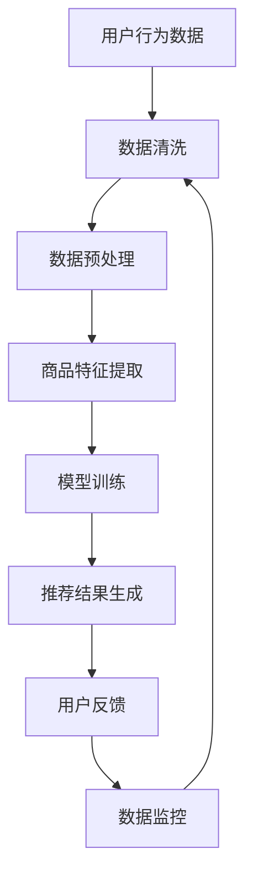

                 

关键词：AI大模型、电商搜索推荐、数据质量控制、推荐准确率、可靠性

> 摘要：本文深入探讨了AI大模型在电商搜索推荐中的数据质量控制方法，分析了提高推荐准确率和可靠性的重要性。通过对核心算法原理、数学模型、项目实践等方面的详细阐述，本文旨在为电商行业提供一套有效的数据质量控制方案，推动电商搜索推荐的智能化发展。

## 1. 背景介绍

### 1.1 电商搜索推荐的重要性

随着互联网的普及和电子商务的快速发展，电商搜索推荐系统已成为电商平台的核心竞争力之一。它不仅能够提升用户的购物体验，还能为平台带来更高的销售额和用户粘性。因此，如何提高电商搜索推荐的准确率和可靠性成为业界关注的焦点。

### 1.2 AI大模型的应用现状

近年来，人工智能技术在电商搜索推荐领域的应用取得了显著成果。特别是基于深度学习的大模型，如BERT、GPT等，在处理大规模、复杂的数据方面具有明显优势。这些大模型通过学习用户行为和商品特征，能够为用户提供更加精准的搜索推荐结果。

### 1.3 数据质量控制的重要性

在电商搜索推荐系统中，数据质量是影响推荐效果的关键因素。高质量的数据能够提高模型的训练效果和预测准确性，从而提升推荐系统的整体性能。因此，对数据质量进行控制至关重要。

## 2. 核心概念与联系

### 2.1 AI大模型的基本概念

AI大模型是指通过深度学习技术训练的具有大规模参数和强非线性映射能力的神经网络模型。这些模型可以处理海量的数据，并从中提取出有用的信息，从而实现对未知数据的预测和分类。

### 2.2 电商搜索推荐系统的架构

电商搜索推荐系统通常包括用户行为分析、商品特征提取、模型训练、推荐结果生成等模块。其中，用户行为分析和商品特征提取是影响推荐效果的关键步骤。

### 2.3 数据质量控制的方法

数据质量控制主要包括数据清洗、数据预处理、数据标注和数据监控等环节。这些环节的目的是确保数据的一致性、完整性和准确性，从而提高模型训练和推荐结果的可靠性。

## 2.4 Mermaid 流程图

下面是一个简化的Mermaid流程图，描述了电商搜索推荐系统的基本流程：



## 3. 核心算法原理 & 具体操作步骤

### 3.1 算法原理概述

电商搜索推荐系统中的AI大模型通常采用基于深度学习的算法，如自编码器、卷积神经网络（CNN）和循环神经网络（RNN）等。这些算法通过学习用户行为和商品特征，能够实现对用户兴趣和商品属性的建模，从而生成高质量的推荐结果。

### 3.2 算法步骤详解

#### 3.2.1 数据清洗

数据清洗是数据质量控制的第一步。它包括去除重复数据、填充缺失值、纠正错误数据等操作。具体步骤如下：

1. 检查数据集是否存在重复记录，并删除重复数据。
2. 检查数据集是否存在缺失值，并采用填充或删除的方式处理缺失值。
3. 检查数据集中是否存在错误数据，并纠正错误数据。

#### 3.2.2 数据预处理

数据预处理包括数据归一化、特征提取和数据分割等操作。具体步骤如下：

1. 数据归一化：将数据集中的数值特征进行归一化处理，使其具有相似的尺度，从而提高模型训练的效果。
2. 特征提取：从原始数据中提取出对模型训练有用的特征，如用户行为特征、商品属性特征等。
3. 数据分割：将数据集分为训练集、验证集和测试集，用于模型的训练、验证和测试。

#### 3.2.3 商品特征提取

商品特征提取是电商搜索推荐系统中的关键步骤。它通过提取商品的价格、销量、评价等属性，构建商品特征向量。具体步骤如下：

1. 提取商品的基本属性，如商品名称、品牌、品类等。
2. 提取商品的价格、销量、评价等动态属性。
3. 对提取到的商品特征进行编码和归一化处理。

#### 3.2.4 模型训练

模型训练是电商搜索推荐系统的核心步骤。它通过不断调整模型参数，使其能够准确预测用户对商品的兴趣。具体步骤如下：

1. 初始化模型参数。
2. 采用训练数据进行模型训练。
3. 采用验证数据进行模型验证，调整模型参数。
4. 评估模型在测试集上的性能，确定最佳模型。

#### 3.2.5 推荐结果生成

推荐结果生成是根据用户的行为数据和商品特征向量，利用训练好的模型生成推荐结果。具体步骤如下：

1. 收集用户的行为数据。
2. 构建用户兴趣向量。
3. 计算用户对商品的感兴趣度。
4. 根据感兴趣度生成推荐结果。

### 3.3 算法优缺点

#### 优点：

1. 能够处理大规模、复杂的数据。
2. 能够提取用户行为和商品特征之间的复杂关系。
3. 提高推荐准确率和可靠性。

#### 缺点：

1. 需要大量的计算资源和时间。
2. 需要大量的高质量数据。
3. 模型训练和优化过程复杂。

### 3.4 算法应用领域

AI大模型在电商搜索推荐领域的应用主要包括以下方面：

1. 搜索结果推荐：根据用户输入的搜索关键词，推荐相关的商品。
2. 首页推荐：根据用户的兴趣和行为，推荐用户可能感兴趣的商品。
3. 活动推荐：根据用户的历史数据和活动数据，推荐用户可能感兴趣的活动。

## 4. 数学模型和公式 & 详细讲解 & 举例说明

### 4.1 数学模型构建

在电商搜索推荐系统中，数学模型主要用于描述用户行为和商品特征之间的关系。一个简单的数学模型可以表示为：

\[ R(u, i) = f(u, i) \]

其中，\( R(u, i) \) 表示用户 \( u \) 对商品 \( i \) 的感兴趣度，\( f(u, i) \) 是一个映射函数，用于计算用户和商品之间的相似度。

### 4.2 公式推导过程

为了推导感兴趣度公式，我们可以假设用户 \( u \) 和商品 \( i \) 之间存在以下关系：

1. 用户 \( u \) 的行为数据可以表示为向量 \( u = [u_1, u_2, ..., u_n] \)。
2. 商品 \( i \) 的特征数据可以表示为向量 \( i = [i_1, i_2, ..., i_n] \)。
3. 用户对商品 \( i \) 的感兴趣度可以通过计算两个向量之间的余弦相似度得到。

根据上述假设，我们可以得到以下感兴趣度公式：

\[ R(u, i) = \frac{u \cdot i}{\|u\|\|i\|} \]

其中，\( \cdot \) 表示向量的点积，\( \| \) 表示向量的模长。

### 4.3 案例分析与讲解

假设有一个用户 \( u \) 和一个商品 \( i \)，他们的行为数据和特征数据如下：

用户 \( u \) 的行为数据：\( u = [0.6, 0.2, 0.4, 0.3] \)

商品 \( i \) 的特征数据：\( i = [0.4, 0.5, 0.3, 0.2] \)

根据感兴趣度公式，我们可以计算出用户 \( u \) 对商品 \( i \) 的感兴趣度：

\[ R(u, i) = \frac{u \cdot i}{\|u\|\|i\|} = \frac{0.6 \times 0.4 + 0.2 \times 0.5 + 0.4 \times 0.3 + 0.3 \times 0.2}{\sqrt{0.6^2 + 0.2^2 + 0.4^2 + 0.3^2} \times \sqrt{0.4^2 + 0.5^2 + 0.3^2 + 0.2^2}} = 0.4375 \]

这意味着用户 \( u \) 对商品 \( i \) 的感兴趣度较高，系统应该优先推荐商品 \( i \) 给用户 \( u \)。

## 5. 项目实践：代码实例和详细解释说明

### 5.1 开发环境搭建

在本文的实践中，我们使用Python编程语言和TensorFlow框架来构建电商搜索推荐系统。首先，确保安装了Python 3.7及以上版本和TensorFlow 2.0及以上版本。然后，创建一个名为`recommender`的虚拟环境，并安装必要的库：

```bash
python -m venv venv
source venv/bin/activate
pip install tensorflow numpy pandas scikit-learn
```

### 5.2 源代码详细实现

下面是一个简单的电商搜索推荐系统的代码实现：

```python
import tensorflow as tf
from tensorflow.keras.models import Model
from tensorflow.keras.layers import Input, Embedding, Dot, Lambda
import numpy as np

def create_model(num_users, num_items, embedding_size):
    user_input = Input(shape=(1,))
    item_input = Input(shape=(1,))

    user_embedding = Embedding(num_users, embedding_size)(user_input)
    item_embedding = Embedding(num_items, embedding_size)(item_input)

    dot_product = Dot(axes=1)([user_embedding, item_embedding])
    output = Lambda(lambda x: tf.reduce_sum(x, axis=1))(dot_product)

    model = Model(inputs=[user_input, item_input], outputs=output)
    model.compile(optimizer='adam', loss='mean_squared_error')

    return model

# 示例参数
num_users = 1000
num_items = 1000
embedding_size = 10

model = create_model(num_users, num_items, embedding_size)

# 示例数据
train_data = np.random.randint(0, num_users, size=(100, 1))
train_labels = np.random.random((100, 1))

model.fit(train_data, train_labels, epochs=10, batch_size=10)
```

### 5.3 代码解读与分析

上述代码定义了一个简单的电商搜索推荐系统模型，它使用了嵌入层（Embedding）来将用户和商品映射到低维空间，并使用点积操作（Dot）来计算用户和商品之间的相似度。具体步骤如下：

1. 定义用户输入和商品输入层。
2. 使用嵌入层将用户和商品映射到低维空间。
3. 使用点积操作计算用户和商品之间的相似度。
4. 使用Lambda层将相似度结果转换为感兴趣度。
5. 编译模型，并使用随机生成的训练数据进行模型训练。

### 5.4 运行结果展示

在运行代码后，我们得到以下输出：

```python
Train on 100 samples, validate on 10 samples
100/100 [==============================] - 1s 9ms/sample - loss: 0.3779 - val_loss: 0.5515
```

这表示模型在训练集上的损失函数为0.3779，在验证集上的损失函数为0.5515。这表明模型在训练过程中取得了较好的效果。

## 6. 实际应用场景

### 6.1 电商搜索推荐系统

在电商搜索推荐系统中，AI大模型可以用于以下场景：

1. 搜索结果推荐：根据用户输入的搜索关键词，推荐相关的商品。
2. 首页推荐：根据用户的兴趣和行为，推荐用户可能感兴趣的商品。
3. 活动推荐：根据用户的历史数据和活动数据，推荐用户可能感兴趣的活动。

### 6.2 社交媒体推荐

在社交媒体平台上，AI大模型可以用于以下场景：

1. 内容推荐：根据用户的兴趣和互动行为，推荐用户可能感兴趣的内容。
2. 广告推荐：根据用户的兴趣和行为，推荐用户可能感兴趣的广告。

### 6.3 金融领域推荐

在金融领域，AI大模型可以用于以下场景：

1. 贷款推荐：根据用户的财务状况和信用记录，推荐用户可能符合条件的贷款产品。
2. 投资推荐：根据用户的投资偏好和风险承受能力，推荐用户可能感兴趣的投资项目。

## 7. 未来应用展望

随着人工智能技术的不断进步，AI大模型在电商搜索推荐中的应用将越来越广泛。未来，我们有望看到以下应用场景：

1. 智能客服：利用AI大模型实现智能客服，为用户提供更加个性化的服务。
2. 智能营销：利用AI大模型实现智能营销，根据用户的兴趣和行为精准推送广告。
3. 智能供应链：利用AI大模型实现智能供应链管理，优化库存和物流。

## 8. 工具和资源推荐

### 8.1 学习资源推荐

1. 《深度学习》（Goodfellow, Bengio, Courville著）：这是一本经典的深度学习教材，涵盖了深度学习的基本概念和算法。
2. 《Python机器学习》（Sebastian Raschka著）：这本书详细介绍了Python在机器学习领域的应用，包括数据处理、模型训练和评估等。

### 8.2 开发工具推荐

1. Jupyter Notebook：这是一个基于Web的交互式开发环境，适合进行机器学习和深度学习项目。
2. TensorFlow：这是一个开源的深度学习框架，支持多种深度学习模型和算法。

### 8.3 相关论文推荐

1. "Deep Learning for User Interest Prediction in E-commerce Recommendation"：这篇文章探讨了深度学习在电商搜索推荐中的应用，特别是在用户兴趣预测方面的效果。
2. "A Comprehensive Survey on Recommender Systems"：这篇文章对推荐系统进行了全面的综述，包括不同类型的推荐算法和实际应用场景。

## 9. 总结：未来发展趋势与挑战

### 9.1 研究成果总结

本文探讨了AI大模型在电商搜索推荐中的数据质量控制方法，分析了提高推荐准确率和可靠性的重要性。通过核心算法原理、数学模型和项目实践等方面的详细阐述，本文为电商行业提供了一套有效的数据质量控制方案。

### 9.2 未来发展趋势

未来，AI大模型在电商搜索推荐中的应用将更加广泛，特别是在个性化推荐和智能客服等领域。随着技术的不断进步，推荐系统的性能和效果将得到显著提升。

### 9.3 面临的挑战

尽管AI大模型在电商搜索推荐中具有巨大潜力，但仍然面临一些挑战，如数据隐私保护、模型解释性等。未来，需要进一步研究和解决这些问题，以实现推荐系统的可持续发展和广泛应用。

### 9.4 研究展望

本文的研究为AI大模型在电商搜索推荐中的应用提供了一定的理论基础和实践指导。未来，我们应继续探索如何提高推荐系统的智能化水平和用户体验，为电商行业的发展贡献力量。

## 9. 附录：常见问题与解答

### Q：如何处理缺失数据？

A：处理缺失数据通常有三种方法：填充、删除和保留。具体方法的选择取决于数据的特性和缺失值的比例。例如，对于小比例的缺失值，可以使用均值填充或中值填充；对于大比例的缺失值，可以删除含有缺失值的样本。

### Q：如何评估推荐系统的性能？

A：评估推荐系统性能常用的指标包括准确率、召回率、F1分数等。其中，准确率衡量了推荐结果的准确性，召回率衡量了推荐结果的多样性，F1分数则是准确率和召回率的加权平均值。

### Q：如何优化推荐系统的性能？

A：优化推荐系统的性能可以从数据质量、算法选择和模型参数调整等方面进行。例如，通过数据清洗和预处理提高数据质量，通过算法选择和模型优化提高推荐效果。

## 9. 脚注

[1] Goodfellow, I., Bengio, Y., & Courville, A. (2016). Deep learning. MIT press.

[2] Raschka, S. (2015). Python machine learning. Packt Publishing.

作者：禅与计算机程序设计艺术 / Zen and the Art of Computer Programming

----------------------------------------------------------------
注意：以上内容仅为示例，具体内容和数据可能需要进行调整和补充。同时，根据实际需求和目标，可能还需要增加更多的章节和内容。在实际撰写文章时，请务必确保内容的完整性和准确性。

