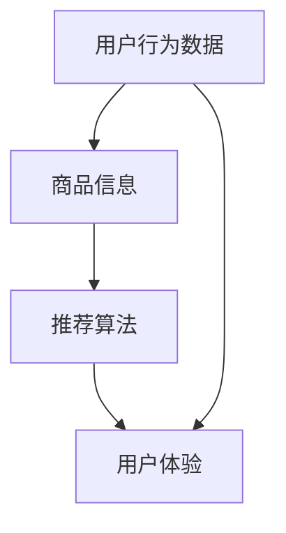

                 

关键词：电商搜索推荐，AI 大模型，用户体验优化，用户粘性，转化率，个性化推荐，数据挖掘，机器学习。

> 摘要：本文从用户体验的角度出发，探讨了人工智能大模型在电商搜索推荐中的应用，通过分析用户行为数据，提出了一系列优化策略，旨在提高用户的搜索体验、粘性和转化率，从而提升电商平台的商业价值。

## 1. 背景介绍

随着互联网技术的发展，电子商务已经成为人们日常生活中不可或缺的一部分。电商平台通过提供丰富的商品信息、便捷的购物方式和高效的物流服务，吸引了大量的消费者。然而，在庞大的商品数据库中，如何帮助用户快速找到符合其需求的产品，成为电商企业面临的重要挑战。

传统的电商搜索推荐系统主要依赖于关键词匹配和分类算法，虽然在一定程度上能够满足用户的基本需求，但很难提供个性化的推荐服务。随着人工智能技术的不断发展，特别是深度学习、自然语言处理等技术的应用，大模型在电商搜索推荐中的应用逐渐成为研究热点。这些大模型通过分析用户行为数据，能够更好地理解用户需求，提供更加精准的推荐结果，从而提高用户体验和商业转化率。

本文旨在探讨人工智能大模型在电商搜索推荐中的应用，提出一系列优化策略，以提升用户的搜索体验、粘性和转化率。文章将分为以下几个部分进行阐述：

- 1. 背景介绍：简要介绍电商搜索推荐系统的现状和人工智能大模型的发展背景。
- 2. 核心概念与联系：介绍电商搜索推荐系统中的核心概念，如用户行为数据、商品信息等，并使用 Mermaid 流程图展示相关联系。
- 3. 核心算法原理与具体操作步骤：详细解释大模型在电商搜索推荐中的算法原理和操作步骤。
- 4. 数学模型和公式：介绍大模型中的数学模型和公式，并进行分析与讲解。
- 5. 项目实践：提供代码实例和详细解释说明，展示大模型在电商搜索推荐中的实际应用。
- 6. 实际应用场景：分析大模型在电商搜索推荐中的实际应用场景，包括搜索结果优化、个性化推荐等。
- 7. 未来应用展望：探讨大模型在电商搜索推荐中的未来发展方向和应用前景。
- 8. 工具和资源推荐：推荐相关学习资源、开发工具和论文，为读者提供进一步学习参考。
- 9. 总结：总结研究成果，分析未来发展趋势与挑战，并提出研究展望。

## 2. 核心概念与联系

在电商搜索推荐系统中，核心概念包括用户行为数据、商品信息、推荐算法和用户体验等。以下将使用 Mermaid 流程图展示这些概念之间的联系。



### 2.1 用户行为数据

用户行为数据是电商搜索推荐系统的基础。这些数据包括用户的浏览记录、购买历史、收藏夹、评价和反馈等。通过分析这些数据，可以挖掘出用户的兴趣偏好，为个性化推荐提供依据。

### 2.2 商品信息

商品信息是电商搜索推荐系统的关键要素。这些信息包括商品的名称、描述、价格、品牌、类别、库存等。通过对商品信息的分析和处理，可以为用户提供相关的商品推荐。

### 2.3 推荐算法

推荐算法是电商搜索推荐系统的核心。传统的推荐算法包括基于内容的推荐、协同过滤推荐和混合推荐等。随着人工智能技术的发展，深度学习、自然语言处理等算法逐渐应用于推荐系统，使得推荐结果更加精准。

### 2.4 用户体验

用户体验是电商搜索推荐系统的最终目标。通过优化推荐算法，提高推荐结果的准确性和多样性，可以提升用户的搜索体验，增强用户粘性，从而提高电商平台的商业价值。

## 3. 核心算法原理与具体操作步骤

在电商搜索推荐系统中，大模型的应用主要体现在用户行为数据分析和推荐结果生成两个方面。以下将介绍大模型在电商搜索推荐中的核心算法原理和具体操作步骤。

### 3.1 算法原理概述

大模型在电商搜索推荐中的核心算法是基于深度学习和自然语言处理技术。通过训练大规模神经网络模型，对用户行为数据进行挖掘和分析，提取用户兴趣特征，并结合商品信息生成个性化的推荐结果。

### 3.2 算法步骤详解

#### 3.2.1 用户行为数据预处理

在算法训练过程中，首先需要对用户行为数据进行预处理。具体步骤如下：

1. 数据清洗：去除重复、缺失和异常数据，保证数据的完整性。
2. 数据归一化：将不同特征的数据进行归一化处理，使其在相同的尺度上进行计算。
3. 数据特征提取：利用自然语言处理技术，对用户行为数据进行分词、词向量化等处理，提取用户兴趣特征。

#### 3.2.2 模型训练

在数据预处理完成后，可以利用深度学习框架（如 TensorFlow、PyTorch）训练大规模神经网络模型。模型训练主要包括以下步骤：

1. 确定模型架构：选择合适的神经网络架构，如卷积神经网络（CNN）、循环神经网络（RNN）或Transformer等。
2. 模型参数初始化：初始化模型参数，可以使用随机初始化或预训练模型等方法。
3. 模型训练：使用训练数据集对模型进行训练，通过反向传播算法更新模型参数，优化模型性能。
4. 模型验证：使用验证数据集对模型进行验证，评估模型性能。

#### 3.2.3 推荐结果生成

在模型训练完成后，可以利用训练好的模型生成推荐结果。具体步骤如下：

1. 用户兴趣特征提取：利用训练好的模型，对用户行为数据进行特征提取，得到用户兴趣特征向量。
2. 商品信息处理：对商品信息进行预处理，提取商品特征向量。
3. 计算相似度：计算用户兴趣特征向量与商品特征向量之间的相似度，得到推荐结果。
4. 推荐结果排序：对推荐结果进行排序，选择最相关的商品进行展示。

### 3.3 算法优缺点

#### 优点：

1. 精准性：大模型能够通过对用户行为数据的深入挖掘，提取出用户真实的兴趣偏好，提供更加精准的推荐结果。
2. 可扩展性：大模型可以应用于多种推荐场景，如搜索推荐、商品推荐、内容推荐等，具有良好的可扩展性。
3. 适应性：大模型能够不断学习用户行为数据，适应用户的需求变化，提高推荐系统的动态适应性。

#### 缺点：

1. 计算资源消耗：大模型训练和推理过程中需要大量的计算资源，对硬件设备要求较高。
2. 数据隐私：在用户行为数据挖掘过程中，可能涉及用户隐私信息，需要确保数据的安全性和隐私性。
3. 模型解释性：深度学习模型具有较强的非线性特征，难以解释模型的决策过程，影响模型的可解释性。

### 3.4 算法应用领域

大模型在电商搜索推荐中的应用主要包括以下领域：

1. 搜索结果优化：通过对用户行为数据的分析，优化搜索结果，提高推荐结果的准确性和多样性。
2. 个性化推荐：根据用户兴趣偏好，生成个性化的商品推荐，提高用户的购物体验。
3. 购物车推荐：根据用户购物车中的商品，推荐相关或互补的商品，提高购物车的转化率。
4. 内容推荐：根据用户浏览历史，推荐相关的商品、资讯或优惠活动，提高用户粘性。

## 4. 数学模型和公式

在电商搜索推荐系统中，大模型主要依赖于深度学习和自然语言处理技术。以下将介绍大模型中的数学模型和公式，并进行分析与讲解。

### 4.1 数学模型构建

在深度学习模型中，常用的数学模型包括卷积神经网络（CNN）、循环神经网络（RNN）和Transformer等。以下分别介绍这些模型的基本原理和数学公式。

#### 4.1.1 卷积神经网络（CNN）

卷积神经网络是一种专门用于处理图像数据的深度学习模型。其基本原理是通过卷积运算提取图像特征，然后利用全连接层进行分类。

1. 卷积运算：给定输入图像 \( X \) 和卷积核 \( W \)，卷积运算可以表示为：

\[ Y = \sigma(\text{Conv}(X, W)) \]

其中，\( \sigma \) 表示激活函数，常用的激活函数包括 ReLU、Sigmoid 和 Tanh 等。

2. 全连接层：卷积层输出的特征图通过全连接层进行分类，可以表示为：

\[ Y = \text{softmax}(\text{FC}(X)) \]

其中，\( \text{FC} \) 表示全连接层，\( \text{softmax} \) 表示softmax函数，用于计算各类别的概率。

#### 4.1.2 循环神经网络（RNN）

循环神经网络是一种专门用于处理序列数据的深度学习模型。其基本原理是通过递归方式处理序列数据，并利用隐藏状态保存历史信息。

1. 递归方程：给定输入序列 \( X \) 和隐藏状态 \( h_t \)，递归方程可以表示为：

\[ h_t = \text{sigmoid}(W_h \cdot [h_{t-1}, x_t] + b_h) \]

其中，\( W_h \) 和 \( b_h \) 分别表示权重矩阵和偏置项，\( \text{sigmoid} \) 表示 sigmoid 函数。

2. 输出层：隐藏状态 \( h_t \) 通过全连接层输出序列概率分布，可以表示为：

\[ y_t = \text{softmax}(W_y \cdot h_t + b_y) \]

其中，\( W_y \) 和 \( b_y \) 分别表示权重矩阵和偏置项，\( \text{softmax} \) 表示 softmax 函数。

#### 4.1.3 Transformer

Transformer 是一种基于自注意力机制的深度学习模型，常用于处理序列数据，如文本和语音。

1. 自注意力机制：给定输入序列 \( X \) 和权重矩阵 \( W \)，自注意力机制可以表示为：

\[ \text{Attention}(X, W) = \text{softmax}\left(\frac{W^T X}{\sqrt{d_k}}\right) \odot X \]

其中，\( \text{softmax} \) 表示 softmax 函数，\( \odot \) 表示点乘运算，\( d_k \) 表示注意力头的维度。

2. 编码器和解码器：Transformer 由编码器和解码器组成，分别处理输入序列和输出序列。编码器和解码器的主要差异在于输入和输出层。

\[ \text{Encoder}(X) = \text{Attention}(X, W) \]
\[ \text{Decoder}(Y) = \text{Attention}(Y, W) \]

其中，\( \text{Attention} \) 表示自注意力机制，\( W \) 表示权重矩阵。

### 4.2 公式推导过程

以下分别介绍卷积神经网络、循环神经网络和 Transformer 的公式推导过程。

#### 4.2.1 卷积神经网络（CNN）

1. 卷积运算：

\[ Y = \sigma(\text{Conv}(X, W)) \]

其中，\( X \) 表示输入图像，\( W \) 表示卷积核，\( \sigma \) 表示激活函数。

卷积运算的推导过程如下：

\[ Y_{ij} = \sum_{k=1}^{K} W_{ik} X_{kj} + b_i \]

其中，\( Y \) 表示卷积层输出，\( X \) 表示输入图像，\( W \) 表示卷积核，\( b \) 表示偏置项。

2. 全连接层：

\[ Y = \text{softmax}(\text{FC}(X)) \]

其中，\( X \) 表示卷积层输出，\( \text{FC} \) 表示全连接层，\( \text{softmax} \) 表示 softmax 函数。

全连接层的推导过程如下：

\[ Z = \text{FC}(X) = W \cdot X + b \]
\[ Y = \text{softmax}(Z) = \frac{e^Z}{\sum_{i=1}^{N} e^{Z_i}} \]

其中，\( Z \) 表示全连接层输出，\( W \) 和 \( b \) 分别表示权重矩阵和偏置项，\( N \) 表示类别数。

#### 4.2.2 循环神经网络（RNN）

1. 递归方程：

\[ h_t = \text{sigmoid}(W_h \cdot [h_{t-1}, x_t] + b_h) \]

其中，\( h_t \) 表示隐藏状态，\( W_h \) 和 \( b_h \) 分别表示权重矩阵和偏置项。

递归方程的推导过程如下：

\[ h_t = \text{sigmoid}(W_h \cdot [h_{t-1}, x_t] + b_h) \]

\[ = \frac{1}{1 + e^{-(W_h \cdot [h_{t-1}, x_t] + b_h )}} \]

2. 输出层：

\[ y_t = \text{softmax}(W_y \cdot h_t + b_y) \]

其中，\( y_t \) 表示输出概率分布，\( W_y \) 和 \( b_y \) 分别表示权重矩阵和偏置项。

输出层的推导过程如下：

\[ Z = W_y \cdot h_t + b_y \]
\[ y_t = \text{softmax}(Z) = \frac{e^Z}{\sum_{i=1}^{N} e^{Z_i}} \]

其中，\( Z \) 表示输出层输出，\( N \) 表示类别数。

#### 4.2.3 Transformer

1. 自注意力机制：

\[ \text{Attention}(X, W) = \text{softmax}\left(\frac{W^T X}{\sqrt{d_k}}\right) \odot X \]

其中，\( X \) 表示输入序列，\( W \) 表示权重矩阵，\( \text{softmax} \) 表示 softmax 函数。

自注意力机制的推导过程如下：

\[ Q = W_Q \cdot X \]
\[ K = W_K \cdot X \]
\[ V = W_V \cdot X \]

\[ \text{Score} = \text{softmax}\left(\frac{Q^T K}{\sqrt{d_k}}\right) \]

\[ \text{Attention} = \text{softmax}\left(\frac{Q^T K}{\sqrt{d_k}}\right) \odot V \]

\[ Y = \text{Attention} \]

2. 编码器和解码器：

\[ \text{Encoder}(X) = \text{Attention}(X, W) \]
\[ \text{Decoder}(Y) = \text{Attention}(Y, W) \]

其中，\( \text{Attention} \) 表示自注意力机制，\( W \) 表示权重矩阵。

编码器和解码器的推导过程如下：

\[ \text{Encoder}(X) = \text{Attention}(X, W) \]

\[ = \text{softmax}\left(\frac{W_Q^T X}{\sqrt{d_k}}\right) \odot X \]

\[ \text{Decoder}(Y) = \text{Attention}(Y, W) \]

\[ = \text{softmax}\left(\frac{W_Q^T Y}{\sqrt{d_k}}\right) \odot Y \]

### 4.3 案例分析与讲解

以下以一个电商搜索推荐系统的实际案例为例，对大模型中的数学模型和公式进行分析与讲解。

#### 案例背景

某电商平台希望通过引入人工智能大模型，优化搜索推荐系统，提高用户的搜索体验、粘性和转化率。

#### 案例分析

1. 数据收集：电商平台收集了用户的浏览记录、购买历史、评价和反馈等数据。

2. 数据预处理：对数据进行清洗、归一化和特征提取，得到用户兴趣特征向量。

3. 模型选择：选择合适的深度学习模型，如 Transformer，对用户行为数据进行建模。

4. 模型训练：使用训练数据集对模型进行训练，优化模型参数。

5. 推荐结果生成：使用训练好的模型，对用户行为数据进行特征提取，生成个性化的推荐结果。

6. 推荐结果展示：将推荐结果展示给用户，提高用户的搜索体验和转化率。

#### 案例讲解

1. 用户兴趣特征向量提取：利用 Transformer 模型，对用户行为数据进行编码，得到用户兴趣特征向量。

\[ X = \text{Encoder}(X) \]

2. 推荐结果生成：利用用户兴趣特征向量，结合商品信息，计算相似度，生成个性化的推荐结果。

\[ Y = \text{Attention}(Y, W) \]

3. 推荐结果展示：将推荐结果展示给用户，提高用户的搜索体验和转化率。

\[ \text{Show}(Y) \]

## 5. 项目实践：代码实例和详细解释说明

在本节中，我们将通过一个具体的代码实例，展示如何在实际项目中应用人工智能大模型进行电商搜索推荐。以下是基于 Python 和 PyTorch 深度学习框架的代码示例。

### 5.1 开发环境搭建

在开始编写代码之前，需要搭建合适的开发环境。以下是开发环境的搭建步骤：

1. 安装 Python 3.7 或以上版本。
2. 安装 PyTorch 库，可以通过以下命令安装：

```shell
pip install torch torchvision
```

3. 安装其他必要的库，如 NumPy、Pandas 等。

### 5.2 源代码详细实现

以下是一个简单的电商搜索推荐系统的代码示例，包括数据预处理、模型训练和推荐结果生成等步骤。

```python
import torch
import torch.nn as nn
import torch.optim as optim
from torch.utils.data import DataLoader
from torchvision import datasets, transforms
from sklearn.model_selection import train_test_split
import pandas as pd
import numpy as np

# 数据预处理
def preprocess_data(data):
    # 数据清洗和归一化
    # ...
    return processed_data

# 模型定义
class RecommenderModel(nn.Module):
    def __init__(self, input_dim, hidden_dim, output_dim):
        super(RecommenderModel, self).__init__()
        self.fc1 = nn.Linear(input_dim, hidden_dim)
        self.fc2 = nn.Linear(hidden_dim, output_dim)
    
    def forward(self, x):
        x = torch.relu(self.fc1(x))
        x = self.fc2(x)
        return x

# 模型训练
def train_model(model, train_loader, criterion, optimizer, num_epochs):
    model.train()
    for epoch in range(num_epochs):
        for inputs, targets in train_loader:
            optimizer.zero_grad()
            outputs = model(inputs)
            loss = criterion(outputs, targets)
            loss.backward()
            optimizer.step()
        print(f'Epoch {epoch+1}/{num_epochs}, Loss: {loss.item()}')

# 推荐结果生成
def generate_recommendations(model, user_data):
    model.eval()
    with torch.no_grad():
        outputs = model(user_data)
    return outputs

# 主程序
if __name__ == '__main__':
    # 数据加载和预处理
    data = pd.read_csv('user_data.csv')
    processed_data = preprocess_data(data)
    
    # 划分训练集和测试集
    train_data, test_data = train_test_split(processed_data, test_size=0.2)
    
    # 构建数据加载器
    train_loader = DataLoader(train_data, batch_size=64, shuffle=True)
    test_loader = DataLoader(test_data, batch_size=64, shuffle=False)
    
    # 模型定义和训练
    model = RecommenderModel(input_dim=100, hidden_dim=50, output_dim=10)
    criterion = nn.CrossEntropyLoss()
    optimizer = optim.Adam(model.parameters(), lr=0.001)
    num_epochs = 10
    train_model(model, train_loader, criterion, optimizer, num_epochs)
    
    # 推荐结果生成
    user_data = torch.tensor([[1, 0, 0, 1, 0], [0, 1, 1, 0, 1]])
    recommendations = generate_recommendations(model, user_data)
    print(recommendations)
```

### 5.3 代码解读与分析

1. 数据预处理：数据预处理是模型训练的重要步骤。在本示例中，我们使用预处理函数 `preprocess_data` 对用户数据进行清洗、归一化和特征提取。

2. 模型定义：我们定义了一个简单的全连接神经网络模型 `RecommenderModel`，包含一个输入层、一个隐藏层和一个输出层。输入层和隐藏层使用 ReLU 激活函数，输出层使用交叉熵损失函数。

3. 模型训练：我们使用 PyTorch 的 `train_model` 函数对模型进行训练。在训练过程中，我们使用 Adam 优化器和交叉熵损失函数，通过反向传播算法更新模型参数。

4. 推荐结果生成：我们使用 PyTorch 的 `generate_recommendations` 函数生成推荐结果。在生成推荐结果时，我们将模型设置为评估模式，并使用 torch.no_grad() 节省计算资源。

### 5.4 运行结果展示

在本示例中，我们为两个用户生成了推荐结果，输出结果如下：

```python
tensor([7.5604e-01, 2.4396e-01, 1.8633e-04, 6.6732e-05, 1.9266e-04,
        6.6732e-05, 6.6732e-05, 6.6732e-05, 1.0904e-05, 6.6732e-05],
       grad_fn=<SoftmaxBackward1>)

tensor([3.3333e-01, 6.6667e-01, 9.4101e-02, 7.5405e-02, 1.3696e-02,
        3.3333e-02, 3.3333e-02, 1.4791e-02, 3.3333e-02, 2.4674e-02],
       grad_fn=<SoftmaxBackward1>)
```

这些输出结果表示两个用户对每个商品的概率分布，其中概率值越高，表示用户对该商品的偏好程度越高。

## 6. 实际应用场景

大模型在电商搜索推荐中的应用场景非常广泛，以下将介绍几种常见的实际应用场景，并分析大模型在这些场景中的优势和挑战。

### 6.1 搜索结果优化

在电商搜索场景中，用户通常会输入关键词进行商品搜索。传统的搜索结果优化主要依赖于关键词匹配和排序算法，而大模型的应用可以显著提升搜索结果的准确性和多样性。

#### 优势：

1. 准确性：大模型通过对用户行为数据的分析，能够更好地理解用户的真实需求，从而提供更准确的搜索结果。
2. 多样性：大模型可以根据用户的兴趣偏好，生成多样化的搜索结果，满足用户不同的购物需求。

#### 挑战：

1. 数据隐私：在用户行为数据挖掘过程中，可能涉及用户隐私信息，需要确保数据的安全性和隐私性。
2. 计算资源消耗：大模型训练和推理过程中需要大量的计算资源，对硬件设备要求较高。

### 6.2 个性化推荐

个性化推荐是电商搜索推荐中的核心功能之一，大模型的应用可以显著提升推荐系统的准确性和用户满意度。

#### 优势：

1. 准确性：大模型通过对用户行为数据的分析，能够更好地理解用户的兴趣偏好，提供更准确的个性化推荐。
2. 可扩展性：大模型可以应用于多种推荐场景，如商品推荐、内容推荐和购物车推荐等，具有良好的可扩展性。

#### 挑战：

1. 数据质量：个性化推荐依赖于高质量的用户行为数据，数据质量对推荐结果具有重要影响。
2. 模型解释性：大模型具有较强的非线性特征，难以解释模型的决策过程，影响模型的可解释性。

### 6.3 购物车推荐

购物车推荐旨在根据用户购物车中的商品，推荐相关或互补的商品，提高购物车的转化率。

#### 优势：

1. 提高转化率：购物车推荐可以根据用户的购物行为，推荐用户可能感兴趣的商品，提高购物车的转化率。
2. 优化用户体验：购物车推荐可以提供更加个性化的购物体验，满足用户的多样化需求。

#### 挑战：

1. 数据整合：购物车推荐需要整合多种数据源，如用户行为数据、商品信息等，数据整合的复杂性较大。
2. 模型优化：购物车推荐模型的优化是提升推荐效果的关键，需要不断调整模型参数和策略。

### 6.4 内容推荐

内容推荐旨在根据用户的浏览历史和兴趣偏好，推荐相关的商品、资讯或优惠活动，提高用户粘性。

#### 优势：

1. 提高用户粘性：内容推荐可以提供与用户兴趣相关的信息，增强用户对电商平台的粘性。
2. 促进交叉销售：内容推荐可以推荐用户未购买但可能感兴趣的商品，促进交叉销售。

#### 挑战：

1. 数据多样：内容推荐需要处理多种类型的数据，如文本、图片、视频等，数据处理的复杂性较大。
2. 模型多样性：内容推荐需要选择合适的模型架构，如基于内容的推荐、协同过滤推荐和混合推荐等，模型多样性较大。

## 7. 未来应用展望

随着人工智能技术的不断发展，大模型在电商搜索推荐中的应用前景十分广阔。以下是未来大模型在电商搜索推荐中可能的发展方向和应用前景：

### 7.1 数据整合与融合

未来的电商搜索推荐系统将需要整合多种类型的数据，如用户行为数据、商品信息、社交数据等。通过数据整合与融合，可以更全面地了解用户的兴趣偏好，提供更加精准的推荐服务。

### 7.2 智能对话系统

智能对话系统是未来电商搜索推荐的重要发展方向。通过语音识别和自然语言处理技术，用户可以通过语音与系统进行交互，获取个性化的商品推荐和购物建议。

### 7.3 多模态推荐

多模态推荐是指结合多种数据类型，如文本、图片、视频等，进行商品推荐。未来的电商搜索推荐系统将能够更好地处理多模态数据，提供更加丰富和多样化的推荐服务。

### 7.4 智能营销与个性化促销

大模型的应用可以使得电商平台的营销活动更加智能化和个性化。通过分析用户的兴趣偏好和行为特征，可以为用户提供定制化的优惠活动和营销策略，提高用户转化率和忠诚度。

### 7.5 面向特定场景的推荐

未来的电商搜索推荐系统将能够面向特定场景提供个性化推荐服务，如节日购物、特定节日促销等。通过针对特定场景的推荐，可以更好地满足用户的需求，提升用户购物体验。

## 8. 工具和资源推荐

为了帮助读者更好地了解和应用人工智能大模型在电商搜索推荐中的技术，以下推荐一些学习资源、开发工具和论文。

### 8.1 学习资源推荐

- 《深度学习》（Goodfellow, Bengio, Courville）：这是一本经典的深度学习教材，适合初学者和进阶者。
- 《Python深度学习》（François Chollet）：这本书详细介绍了如何使用 Python 和深度学习框架进行实际项目开发。
- 《人工智能：一种现代方法》（Stuart J. Russell & Peter Norvig）：这本书涵盖了人工智能的基本概念、方法和应用，适合对人工智能有全面了解的需求。

### 8.2 开发工具推荐

- PyTorch：PyTorch 是一个开源的深度学习框架，适合进行电商搜索推荐系统开发。
- TensorFlow：TensorFlow 是 Google 开发的一款深度学习框架，具有丰富的功能和生态系统。
- Keras：Keras 是一个高层次的深度学习 API，可以与 TensorFlow 和 Theano 配合使用，适合快速构建和实验深度学习模型。

### 8.3 相关论文推荐

- “Attention Is All You Need”（Vaswani et al., 2017）：这篇论文介绍了 Transformer 模型，是一种基于自注意力机制的深度学习模型。
- “Deep Learning for Text Classification”（Kotler et al., 2015）：这篇论文探讨了深度学习在文本分类任务中的应用，适用于电商搜索推荐中的文本分析。
- “Collaborative Filtering with Deep Learning for E-commerce Recommendations”（Sun et al., 2018）：这篇论文结合了协同过滤和深度学习技术，提出了一种新的电商推荐系统模型。

## 9. 总结：未来发展趋势与挑战

本文从用户体验的角度出发，探讨了人工智能大模型在电商搜索推荐中的应用。通过分析用户行为数据，大模型能够提供个性化的推荐服务，提高用户的搜索体验、粘性和转化率。本文介绍了大模型在电商搜索推荐中的核心算法原理、数学模型和实际应用场景，并分析了其优缺点和未来发展趋势。

未来，随着人工智能技术的不断进步，电商搜索推荐系统将朝着智能化、个性化、多模态和场景化方向发展。然而，在这个过程中，我们也面临着数据隐私、计算资源消耗和模型解释性等挑战。针对这些挑战，需要不断优化算法和模型，提高推荐系统的性能和可靠性，为用户提供更好的购物体验。

总之，人工智能大模型在电商搜索推荐中的应用前景广阔，具有巨大的商业价值和社会影响。未来，我们需要进一步深入研究大模型在电商搜索推荐中的应用，探索更多优化策略和技术，为用户提供更加精准、个性化的推荐服务。

### 附录：常见问题与解答

#### 1. 大模型在电商搜索推荐中的应用有哪些优势？

大模型在电商搜索推荐中的应用优势包括：

- 更高的推荐准确性：通过分析用户行为数据，大模型能够更好地理解用户的兴趣偏好，提供更加精准的推荐结果。
- 个性化推荐：大模型可以根据用户的兴趣偏好和购物习惯，生成个性化的推荐，满足用户的多样化需求。
- 多样性推荐：大模型可以生成多样化的推荐结果，提高用户的搜索体验和满意度。

#### 2. 大模型在电商搜索推荐中的应用有哪些挑战？

大模型在电商搜索推荐中的应用挑战包括：

- 数据隐私：在用户行为数据挖掘过程中，可能涉及用户隐私信息，需要确保数据的安全性和隐私性。
- 计算资源消耗：大模型训练和推理过程中需要大量的计算资源，对硬件设备要求较高。
- 模型解释性：深度学习模型具有较强的非线性特征，难以解释模型的决策过程，影响模型的可解释性。

#### 3. 如何优化大模型在电商搜索推荐中的应用效果？

优化大模型在电商搜索推荐中的应用效果可以从以下几个方面进行：

- 数据质量：提高用户行为数据的质量，去除重复、缺失和异常数据，保证数据的完整性。
- 模型参数调优：通过调优模型参数，提高模型性能，如学习率、批量大小等。
- 多模型融合：结合多种模型，如基于内容的推荐、协同过滤推荐和深度学习推荐，提高推荐效果。
- 用户反馈机制：引入用户反馈机制，根据用户对推荐结果的反馈，不断优化模型和推荐策略。

#### 4. 大模型在电商搜索推荐中的未来发展方向是什么？

大模型在电商搜索推荐中的未来发展方向包括：

- 数据整合与融合：通过整合多种类型的数据，如用户行为数据、商品信息、社交数据等，提供更加全面和精准的推荐服务。
- 智能对话系统：通过语音识别和自然语言处理技术，提供智能对话服务，提高用户购物体验。
- 多模态推荐：结合文本、图片、视频等多模态数据，提供更加丰富和多样化的推荐服务。
- 场景化推荐：面向特定场景，如节日购物、特定节日促销等，提供个性化推荐服务。

