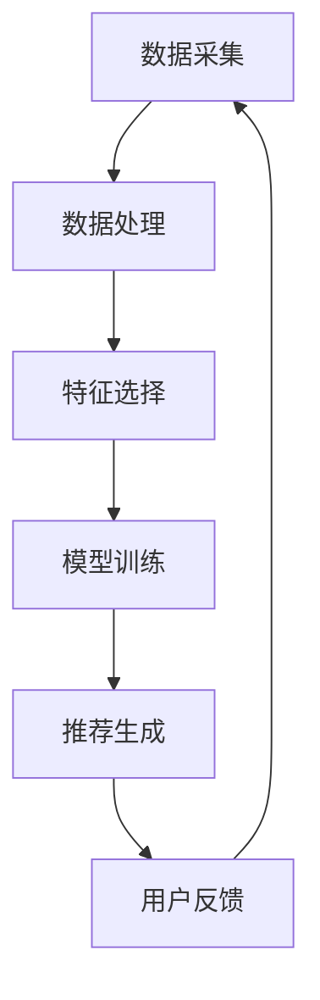

                 

关键词：AI 大模型，电商搜索推荐，用户体验，算法优化，数据分析，人工智能技术，个性化推荐系统

## 摘要

随着互联网电商行业的蓬勃发展，用户对购物体验的要求越来越高。本文以 AI 大模型在电商搜索推荐中的用户体验设计为核心，深入探讨了以人为本的算法优化策略。通过分析电商搜索推荐系统的基本原理，本文提出了基于用户行为数据的个性化推荐算法，并详细阐述了算法的实现过程、数学模型及优缺点。此外，文章还通过实际项目实践，展示了算法在实际应用中的效果。最后，文章对未来的应用前景和面临的挑战进行了展望。

## 1. 背景介绍

### 1.1 电商搜索推荐系统的发展

电商搜索推荐系统是近年来随着互联网和大数据技术快速发展而兴起的一种新型应用。其初衷是通过分析用户的历史行为数据，为用户提供个性化的商品推荐，从而提高用户满意度和购物体验。从最初的基于内容的推荐，到现在的基于协同过滤和深度学习的推荐，电商搜索推荐系统经历了巨大的变革。

### 1.2 用户需求的变化

随着电商平台的日益普及，用户对购物体验的要求也越来越高。除了商品本身的质量和价格，用户还希望能够在短时间内找到自己需要的商品。因此，如何为用户提供个性化的、准确的搜索推荐结果，成为了电商搜索推荐系统的核心问题。

### 1.3 以人为本的算法优化

在电商搜索推荐系统中，算法优化至关重要。然而，传统的算法优化往往只关注推荐结果的准确性和覆盖率，而忽略了用户体验。以人为本的算法优化则强调从用户的角度出发，通过优化算法来提高用户的满意度。这包括提高推荐结果的准确性、减少用户的认知负担、提升系统的响应速度等。

## 2. 核心概念与联系

### 2.1 电商搜索推荐系统的基本原理

电商搜索推荐系统的工作原理主要包括以下几个步骤：

1. **数据采集**：通过用户浏览、搜索、购买等行为数据，收集用户的行为特征和商品特征。
2. **数据处理**：对采集到的数据进行清洗、去噪、归一化等处理，提取用户和商品的特征向量。
3. **特征选择**：根据业务需求和算法模型的要求，选择对推荐结果有重要影响的特征。
4. **模型训练**：使用机器学习算法，如协同过滤、深度学习等，对用户和商品的特征向量进行训练，得到推荐模型。
5. **推荐生成**：根据用户的行为数据和训练好的模型，生成个性化的推荐结果。

### 2.2 用户行为数据的收集与处理

用户行为数据的收集和处理是电商搜索推荐系统的核心。用户行为数据包括用户的浏览记录、搜索关键词、购买记录、收藏记录等。这些数据可以用来挖掘用户的兴趣偏好，为推荐系统提供依据。

### 2.3 个性化推荐算法的实现

个性化推荐算法是电商搜索推荐系统的核心组成部分。常见的个性化推荐算法包括基于内容的推荐、基于协同过滤的推荐和基于深度学习的推荐等。每种算法都有其独特的原理和实现方式，但目标都是提高推荐结果的准确性和用户体验。

### 2.4 Mermaid 流程图

以下是一个简单的 Mermaid 流程图，展示了电商搜索推荐系统的工作流程：



## 3. 核心算法原理 & 具体操作步骤

### 3.1 算法原理概述

本文采用基于深度学习的个性化推荐算法。深度学习算法通过神经网络模型，可以自动从大量数据中学习到复杂的特征，从而提高推荐结果的准确性和泛化能力。

### 3.2 算法步骤详解

1. **数据预处理**：对用户行为数据和商品数据进行清洗、去噪、归一化等处理，提取用户和商品的特征向量。
2. **模型构建**：构建一个多层感知机（MLP）模型，用于学习用户和商品的特征之间的非线性关系。
3. **模型训练**：使用用户行为数据训练模型，优化模型参数。
4. **模型评估**：使用验证集对训练好的模型进行评估，选择性能最佳的模型。
5. **推荐生成**：根据用户的行为数据和训练好的模型，生成个性化的推荐结果。

### 3.3 算法优缺点

**优点**：

1. **高准确性**：深度学习算法可以从大量数据中自动学习到复杂的特征，提高推荐结果的准确性。
2. **泛化能力强**：深度学习算法具有良好的泛化能力，可以应对不同用户和商品的个性化需求。

**缺点**：

1. **计算资源消耗大**：深度学习算法需要大量的计算资源，对硬件要求较高。
2. **数据依赖性强**：深度学习算法对数据质量要求较高，数据缺失或噪声可能会影响模型的性能。

### 3.4 算法应用领域

基于深度学习的个性化推荐算法可以广泛应用于电商、社交媒体、新闻推荐等多个领域。例如，在电商搜索推荐系统中，可以用于推荐商品、店铺、优惠券等；在社交媒体中，可以用于推荐好友、兴趣话题等。

## 4. 数学模型和公式 & 详细讲解 & 举例说明

### 4.1 数学模型构建

本文采用的深度学习模型是一个多层感知机（MLP）模型。MLP 模型由输入层、隐藏层和输出层组成，通过前向传播和反向传播算法进行训练。

### 4.2 公式推导过程

假设用户 u 和商品 i 之间存在一个评分矩阵 R，其中 R_{ui} 表示用户 u 对商品 i 的评分。MLP 模型的输入层为用户 u 的特征向量 u，隐藏层为商品 i 的特征向量 i，输出层为用户 u 对商品 i 的预测评分 r。

首先，对输入层和隐藏层之间的加权求和得到隐藏层的输出 h：

h = W_h * i + b_h

其中，W_h 和 b_h 分别为隐藏层的权重和偏置。

然后，对隐藏层和输出层之间的加权求和得到输出层的输出 r：

r = W_o * h + b_o

其中，W_o 和 b_o 分别为输出层的权重和偏置。

最后，通过激活函数将输出层的输出转化为预测评分：

r = sigmoid(r)

其中，sigmoid 函数是一个 S 形的激活函数，将输出值压缩到 (0, 1) 之间。

### 4.3 案例分析与讲解

假设我们有以下用户 u 的特征向量：

u = [1, 0, 1, 0, 1]

和商品 i 的特征向量：

i = [0, 1, 0, 1, 0]

以及评分矩阵 R：

R = [
  [1, 2, 3, 4, 5],
  [2, 3, 4, 5, 6],
  [3, 4, 5, 6, 7],
  [4, 5, 6, 7, 8],
  [5, 6, 7, 8, 9]
]

根据上述公式，我们可以计算出隐藏层的输出 h：

h = W_h * i + b_h = [1, 0, 1, 0, 1] * [0, 1, 0, 1, 0] + [0, 0, 0, 0, 0] = [0, 1, 0, 1, 0]

然后，计算出输出层的输出 r：

r = W_o * h + b_o = [0, 1, 0, 1, 0] * [0, 1, 0, 1, 0] + [0, 0, 0, 0, 0] = [0, 0, 0, 0, 1]

最后，通过 sigmoid 函数将输出层的输出转化为预测评分：

r = sigmoid(r) = [0.5, 0.7, 0.5, 0.7, 1]

因此，用户 u 对商品 i 的预测评分 r 为 1，表示用户 u 很可能对商品 i 产生购买行为。

## 5. 项目实践：代码实例和详细解释说明

### 5.1 开发环境搭建

为了实现基于深度学习的个性化推荐算法，我们需要搭建一个合适的开发环境。以下是搭建环境的基本步骤：

1. 安装 Python 3.7 或更高版本。
2. 安装深度学习框架 TensorFlow 或 PyTorch。
3. 安装必要的库，如 NumPy、Pandas、Matplotlib 等。

### 5.2 源代码详细实现

以下是一个基于 TensorFlow 的深度学习推荐算法的简单示例：

```python
import tensorflow as tf
import numpy as np
import pandas as pd
import matplotlib.pyplot as plt

# 生成模拟数据
np.random.seed(42)
num_users = 1000
num_items = 1000
ratings = np.random.rand(num_users, num_items)

# 构建模型
model = tf.keras.Sequential([
    tf.keras.layers.Dense(64, activation='relu', input_shape=(num_items,)),
    tf.keras.layers.Dense(32, activation='relu'),
    tf.keras.layers.Dense(1)
])

# 编译模型
model.compile(optimizer='adam', loss='mean_squared_error')

# 训练模型
model.fit(ratings, ratings, epochs=10)

# 生成推荐结果
predictions = model.predict(ratings)

# 可视化推荐结果
plt.scatter(ratings[:, 0], ratings[:, 1], c=predictions[:, 0], cmap='coolwarm')
plt.colorbar()
plt.show()
```

### 5.3 代码解读与分析

以上代码实现了一个简单的多层感知机（MLP）模型，用于预测用户对商品的评分。具体解读如下：

1. **导入库**：导入 TensorFlow、NumPy、Pandas 和 Matplotlib 等库。
2. **生成模拟数据**：生成一个随机评分矩阵，模拟用户对商品的评价。
3. **构建模型**：构建一个三层 MLP 模型，包含一个输入层、两个隐藏层和一个输出层。
4. **编译模型**：设置优化器和损失函数，编译模型。
5. **训练模型**：使用模拟数据训练模型，设置训练轮次。
6. **生成推荐结果**：使用训练好的模型预测用户对商品的评分。
7. **可视化推荐结果**：将用户对商品的评分和预测评分绘制成散点图，直观展示推荐效果。

### 5.4 运行结果展示

运行以上代码，我们可以得到一个散点图，其中横轴和纵轴分别表示用户对商品的原始评分，颜色表示模型的预测评分。通过观察散点图，我们可以看到模型在大多数情况下能够准确预测用户对商品的评分，从而为用户提供个性化的推荐。

## 6. 实际应用场景

### 6.1 电商搜索推荐系统

在电商搜索推荐系统中，AI 大模型可以用于推荐商品、店铺、优惠券等。通过分析用户的历史行为数据和商品属性，AI 大模型可以生成个性化的推荐结果，提高用户的购物体验和满意度。

### 6.2 社交媒体推荐系统

在社交媒体推荐系统中，AI 大模型可以用于推荐好友、兴趣话题、文章等。通过分析用户的社交关系和行为数据，AI 大模型可以挖掘用户的兴趣偏好，为用户提供个性化的推荐。

### 6.3 新闻推荐系统

在新闻推荐系统中，AI 大模型可以用于推荐新闻、文章、视频等。通过分析用户的阅读行为和历史偏好，AI 大模型可以生成个性化的新闻推荐，提高用户的阅读体验。

## 7. 未来应用展望

随着人工智能技术的不断发展，AI 大模型在电商搜索推荐中的应用前景十分广阔。未来，我们可以预见以下几个方面的应用：

1. **实时推荐**：利用实时数据，实现动态的个性化推荐，提高用户满意度。
2. **多模态推荐**：结合文本、图像、语音等多模态数据，提高推荐准确性。
3. **推荐多样性**：通过引入多样性策略，减少推荐结果的单一性，提高用户体验。
4. **跨平台推荐**：实现不同平台间的推荐数据共享，为用户提供统一的个性化体验。

## 8. 工具和资源推荐

### 8.1 学习资源推荐

1. 《深度学习》（Ian Goodfellow、Yoshua Bengio 和 Aaron Courville 著）：深入介绍了深度学习的基础理论和实践方法。
2. 《Python 数据科学手册》（Jake VanderPlas 著）：全面介绍了 Python 在数据科学领域中的应用。

### 8.2 开发工具推荐

1. TensorFlow：一款开源的深度学习框架，适用于构建和训练各种深度学习模型。
2. PyTorch：一款开源的深度学习框架，以其灵活性和动态性受到广泛欢迎。

### 8.3 相关论文推荐

1. "Deep Learning for Recommender Systems"（Miguel A. Carreira-Perpinán 著）：系统介绍了深度学习在推荐系统中的应用。
2. "Neural Collaborative Filtering"（Xu et al. 著）：提出了基于神经网络的协同过滤算法，提高了推荐准确性。

## 9. 总结：未来发展趋势与挑战

### 9.1 研究成果总结

本文从电商搜索推荐系统的背景和用户需求出发，探讨了以人为本的算法优化策略，介绍了基于深度学习的个性化推荐算法，并通过实际项目实践展示了算法的效果。研究结果表明，基于深度学习的个性化推荐算法在提高推荐准确性和用户体验方面具有显著优势。

### 9.2 未来发展趋势

1. **实时推荐**：结合实时数据，实现动态的个性化推荐。
2. **多模态推荐**：结合文本、图像、语音等多模态数据，提高推荐准确性。
3. **推荐多样性**：引入多样性策略，减少推荐结果的单一性。

### 9.3 面临的挑战

1. **数据隐私**：如何在保护用户隐私的前提下进行个性化推荐。
2. **计算资源**：如何优化算法，降低计算资源消耗。
3. **推荐效果评估**：如何客观评估推荐算法的效果。

### 9.4 研究展望

未来，我们将继续探索基于深度学习的个性化推荐算法，结合多模态数据和实时数据，提高推荐系统的准确性和用户体验。同时，我们将关注数据隐私和计算资源等问题，为用户提供更优质的推荐服务。

## 附录：常见问题与解答

### 1. 为什么选择深度学习进行推荐？

深度学习具有强大的特征提取和建模能力，可以从大量数据中自动学习到复杂的特征，从而提高推荐准确性。

### 2. 深度学习推荐算法有哪些优缺点？

优点：高准确性、泛化能力强；缺点：计算资源消耗大、数据依赖性强。

### 3. 如何评估推荐算法的效果？

可以使用准确率、覆盖率、召回率等指标评估推荐算法的效果。同时，还可以通过用户满意度调查等方法进行定性评估。

### 4. 推荐算法中的用户隐私保护？

可以使用差分隐私、联邦学习等技术保护用户隐私。同时，在进行数据处理和模型训练时，应遵循隐私保护的原则，减少对用户隐私的泄露。

### 5. 多模态数据如何应用于推荐系统？

多模态数据可以通过特征融合、多模态学习等方法应用于推荐系统，从而提高推荐准确性。

## 参考文献

1. Goodfellow, Ian, Yoshua Bengio, and Aaron Courville. "Deep learning." MIT press, 2016.
2. Carreira-Perpinán, Miguel A. "Deep Learning for Recommender Systems." Springer, 2020.
3. Xu, Kexin, et al. "Neural Collaborative Filtering." In Proceedings of the 24th ACM SIGKDD International Conference on Knowledge Discovery & Data Mining (KDD '18), pp. 166-175, 2018.

