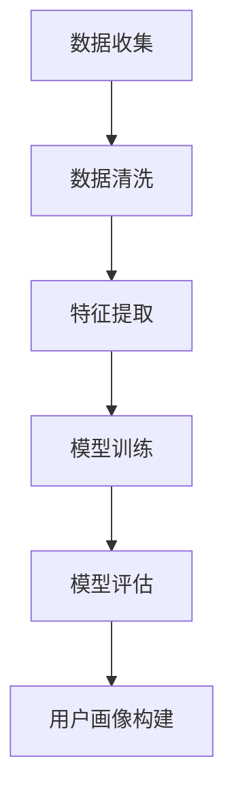
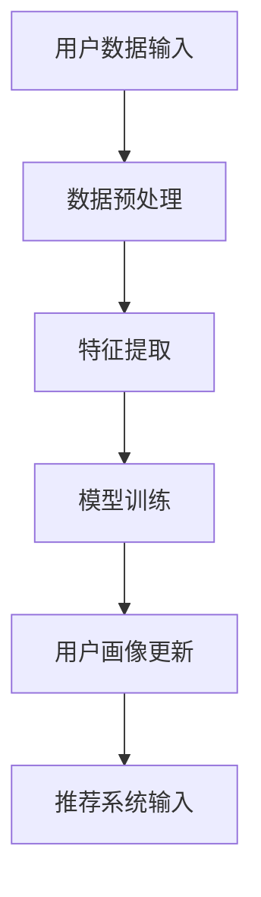

                 

关键词：AI大模型，用户画像，电商搜索推荐，行为偏好，深度挖掘

> 摘要：本文深入探讨了AI大模型在电商搜索推荐系统中对用户画像的构建与应用，分析了如何通过深度挖掘用户行为偏好，提升电商平台的个性化推荐效果。文章首先介绍了用户画像的基本概念和构建方法，然后详细阐述了AI大模型在用户画像中的应用，以及在实际电商搜索推荐中的具体操作步骤。此外，本文还通过数学模型和实际项目实践，展示了如何利用AI大模型提升用户画像的准确性和实用性。最后，文章提出了未来应用展望和研究挑战。

## 1. 背景介绍

随着互联网的飞速发展，电子商务已经成为全球零售业的重要组成部分。电商平台的竞争日益激烈，如何通过有效的用户画像和精准的推荐算法提升用户满意度，成为企业关注的核心问题。用户画像（User Profiling）是一种基于用户数据的描述性模型，它能够反映用户的兴趣、偏好、行为习惯等特征，是电商个性化推荐系统的基础。

传统的用户画像构建方法主要依赖于规则引擎和简单的统计模型，如聚类分析、协同过滤等。这些方法虽然在一定程度上能够满足个性化推荐的需求，但在复杂度和准确性方面存在较大的局限。随着人工智能技术的发展，尤其是深度学习模型的兴起，大模型在用户画像构建中的应用逐渐受到关注。大模型具有强大的特征提取和关联学习能力，能够从海量数据中挖掘出更深层次的用户行为偏好。

本文旨在探讨AI大模型在电商搜索推荐中的用户画像应用，通过深度挖掘用户行为偏好，提升个性化推荐效果，从而为电商平台提供更有针对性的服务。

### 1.1 电商搜索推荐系统的现状

电商搜索推荐系统是电商平台的核心竞争力之一。它通过分析用户的搜索历史、浏览记录、购买行为等数据，为用户推荐符合其兴趣和需求的商品。目前，大多数电商搜索推荐系统主要采用以下几种方法：

1. **基于内容的推荐**：该方法根据商品的属性和用户的历史行为，将相似的商品推荐给用户。例如，用户浏览了某款手机，系统可能会推荐同品牌、同系列的手机。

2. **协同过滤推荐**：该方法通过分析用户之间的相似性，找到具有相同兴趣的用户群体，并将这些用户喜欢的商品推荐给其他用户。协同过滤推荐分为基于用户的协同过滤和基于物品的协同过滤。

3. **基于规则的推荐**：该方法通过预设的规则，将符合规则的商品推荐给用户。例如，如果用户的购物车中包含了多个商品，系统可能会推荐与这些商品相关的配件。

尽管以上方法在一定程度上能够提升推荐效果，但它们存在一定的局限性。首先，这些方法依赖于大量先验知识和规则，难以应对复杂多变的用户行为。其次，这些方法通常只能处理线性或低维度的数据，难以挖掘数据中的深层关联和复杂模式。因此，如何利用更先进的算法和技术，提升电商搜索推荐系统的效果，成为当前研究的热点。

### 1.2 AI大模型在用户画像中的应用

AI大模型，尤其是基于深度学习的模型，在用户画像构建中具有显著的优势。深度学习模型具有强大的特征提取和关联学习能力，能够从海量数据中自动学习出高层次的抽象特征。这些特征可以用于更准确地描述用户的行为和偏好，从而提高个性化推荐的效果。

AI大模型在用户画像中的应用主要体现在以下几个方面：

1. **自动特征提取**：传统方法通常需要手动提取特征，而深度学习模型可以通过多层神经网络自动学习数据中的特征，从而避免了人工干预。

2. **多模态数据处理**：用户画像不仅包含结构化数据，还可能包含文本、图像、音频等多种类型的数据。深度学习模型可以同时处理多种类型的数据，从而更全面地反映用户的行为和偏好。

3. **自适应调整**：深度学习模型可以根据用户的行为数据进行实时调整，从而动态地更新用户画像，提高推荐的准确性。

4. **强鲁棒性**：深度学习模型具有较强的鲁棒性，能够处理噪声数据和异常值，从而确保用户画像的准确性。

总之，AI大模型在用户画像构建中的应用，不仅提升了个性化推荐的效果，还为电商平台的运营提供了更有价值的决策支持。本文将在此基础上，进一步探讨AI大模型在电商搜索推荐系统中的具体应用。

## 2. 核心概念与联系

在深入探讨AI大模型在电商搜索推荐中的用户画像应用之前，我们需要了解一些核心概念和它们之间的联系。这些概念包括用户画像、深度学习、大模型、特征提取、关联学习等。

### 2.1 用户画像

用户画像是一种基于用户数据的描述性模型，它通过分析用户的兴趣、行为、偏好等特征，为用户提供个性化的服务。用户画像的基本概念包括：

- **用户特征**：用户的个人信息、行为数据、偏好数据等。
- **用户标签**：对用户特征进行分类和标注，以便于后续的数据处理和分析。
- **用户分群**：根据用户的相似特征和行为模式，将用户划分为不同的群体。

用户画像的构建通常包括以下步骤：

1. **数据收集**：收集用户的个人信息、行为数据、偏好数据等。
2. **数据清洗**：处理数据中的噪声和异常值，确保数据的质量。
3. **特征提取**：从原始数据中提取有效的用户特征。
4. **模型训练**：使用机器学习算法，构建用户画像模型。
5. **模型评估**：评估用户画像模型的准确性、可解释性等性能指标。

### 2.2 深度学习

深度学习是一种基于人工神经网络的学习方法，它通过多层神经网络模型，自动提取数据中的特征和模式。深度学习在用户画像中的应用主要体现在以下几个方面：

1. **特征提取**：深度学习模型能够自动从原始数据中提取高层次的抽象特征，这些特征可以更好地描述用户的行为和偏好。
2. **关联学习**：深度学习模型可以通过多层网络结构，发现数据之间的关联和依赖关系，从而构建更准确的用户画像。
3. **自适应调整**：深度学习模型可以根据用户的行为数据，动态地调整用户画像，提高推荐的准确性。

### 2.3 大模型

大模型是指具有大量参数和复杂结构的深度学习模型。与传统的深度学习模型相比，大模型具有以下优势：

1. **更强的特征提取能力**：大模型可以通过更深的网络结构，提取数据中的深层特征。
2. **更好的泛化能力**：大模型通常具有更强的泛化能力，可以在不同的数据集和应用场景中保持良好的性能。
3. **更高的计算资源需求**：大模型通常需要更多的计算资源和时间进行训练和推理。

### 2.4 特征提取与关联学习

特征提取和关联学习是深度学习模型在用户画像中的核心应用。特征提取是指从原始数据中提取有效的特征，关联学习是指发现数据之间的关联和依赖关系。这两个过程相互依赖，共同构建出准确的用户画像。

1. **特征提取**：深度学习模型通过多层神经网络，自动提取数据中的特征。这些特征可以是数值型、类别型或文本型等，它们共同构成了用户画像的基础。
2. **关联学习**：深度学习模型通过网络结构，将不同的特征进行关联，从而构建出用户的行为模式和偏好。这些关联关系可以帮助模型更准确地预测用户的兴趣和行为。

### 2.5 Mermaid 流程图

为了更直观地展示核心概念和联系，我们可以使用Mermaid流程图来描述AI大模型在用户画像构建中的流程。以下是一个简化的Mermaid流程图示例：



在这个流程图中，数据收集、数据清洗、特征提取、模型训练和模型评估是构建用户画像的关键步骤。这些步骤相互关联，共同构成了用户画像的构建过程。

通过以上对核心概念和联系的介绍，我们可以更好地理解AI大模型在电商搜索推荐中的用户画像应用。接下来，我们将详细讨论AI大模型在用户画像中的具体应用，包括算法原理、操作步骤和优缺点。

### 2.6 AI 大模型在用户画像中的应用

AI 大模型在用户画像中的应用主要体现在以下几个方面：

#### 2.6.1 自动特征提取

传统用户画像构建方法通常需要手动提取特征，而 AI 大模型可以通过深度学习自动从原始数据中提取高层次的抽象特征。这些特征可以更好地描述用户的行为和偏好。

#### 2.6.2 多模态数据处理

用户画像不仅包含结构化数据，还可能包含文本、图像、音频等多种类型的数据。AI 大模型可以同时处理多种类型的数据，从而更全面地反映用户的行为和偏好。

#### 2.6.3 自适应调整

AI 大模型可以根据用户的行为数据进行实时调整，从而动态地更新用户画像，提高推荐的准确性。

#### 2.6.4 强鲁棒性

AI 大模型具有较强的鲁棒性，能够处理噪声数据和异常值，从而确保用户画像的准确性。

#### 2.6.5 Mermaid 流程图

以下是一个简化的 Mermaid 流程图，描述了 AI 大模型在用户画像中的应用流程：



在这个流程图中，用户数据输入、数据预处理、特征提取、模型训练和用户画像更新是构建用户画像的关键步骤。这些步骤相互关联，共同构成了用户画像的构建过程。

### 2.7 大模型的算法原理与操作步骤

大模型，特别是基于深度学习的模型，在用户画像中的应用有着深厚的理论基础和广泛的实际应用。本节将详细介绍大模型的算法原理和具体操作步骤。

#### 2.7.1 算法原理概述

深度学习模型的核心思想是通过多层神经网络来模拟人类大脑的学习过程，从而自动提取数据中的特征。大模型通常具有大量的参数和复杂的网络结构，这使得它们能够处理大规模的数据集并提取深层次的抽象特征。

深度学习模型通常包括以下几个关键组成部分：

1. **输入层**：接收原始数据，如文本、图像或数值数据。
2. **隐藏层**：通过非线性变换，将输入数据转换为更高层次的抽象特征。
3. **输出层**：根据隐藏层的特征，生成预测结果，如用户画像或推荐结果。

在用户画像构建中，深度学习模型可以通过以下步骤实现：

1. **数据预处理**：对原始数据进行清洗和归一化处理，确保数据的质量和一致性。
2. **特征提取**：通过多层神经网络，从原始数据中自动提取高层次的抽象特征。
3. **模型训练**：使用有监督或无监督的学习方法，调整网络参数，使模型能够准确预测用户画像。
4. **模型评估**：通过交叉验证、A/B测试等方法，评估模型在用户画像构建中的性能。

#### 2.7.2 具体操作步骤

以下是一个基于深度学习的用户画像构建流程：

1. **数据收集**：收集用户的个人信息、行为数据、偏好数据等。
2. **数据预处理**：对收集到的数据进行清洗、去重和归一化处理，确保数据的质量和一致性。
3. **特征提取**：设计多层神经网络结构，通过前向传播和反向传播算法，自动从原始数据中提取高层次的抽象特征。
4. **模型训练**：使用有监督或无监督的学习方法，调整网络参数，使模型能够准确预测用户画像。
5. **模型评估**：通过交叉验证、A/B测试等方法，评估模型在用户画像构建中的性能。
6. **用户画像构建**：将训练好的模型应用于新用户的数据，生成用户画像。
7. **推荐系统输入**：将用户画像输入到推荐系统中，为用户提供个性化的推荐。

#### 2.7.3 算法优缺点

深度学习模型在用户画像构建中具有以下优缺点：

**优点**：

1. **强大的特征提取能力**：深度学习模型可以通过多层神经网络，自动提取数据中的深层特征，从而更好地描述用户的行为和偏好。
2. **多模态数据处理**：深度学习模型可以同时处理多种类型的数据，如文本、图像、音频等，从而更全面地反映用户的行为和偏好。
3. **自适应调整**：深度学习模型可以根据用户的行为数据进行实时调整，从而动态地更新用户画像，提高推荐的准确性。
4. **强鲁棒性**：深度学习模型具有较强的鲁棒性，能够处理噪声数据和异常值，从而确保用户画像的准确性。

**缺点**：

1. **计算资源需求大**：大模型通常需要大量的计算资源和时间进行训练和推理，这对硬件设备和数据处理能力提出了较高的要求。
2. **模型解释性差**：深度学习模型的内部决策过程通常较为复杂，难以进行直观的解释和验证，这限制了其在某些应用场景中的使用。
3. **数据依赖性强**：深度学习模型的性能很大程度上取决于数据质量和数据量，如果数据质量较差或数据量不足，模型可能无法达到预期的效果。

通过以上对大模型算法原理和操作步骤的介绍，我们可以更好地理解深度学习在用户画像构建中的应用。接下来，我们将探讨大模型在用户画像构建中的数学模型和公式，以及具体的案例分析和讲解。

### 3. 核心算法原理 & 具体操作步骤

#### 3.1 算法原理概述

在用户画像构建中，深度学习模型通过多层神经网络结构，自动提取数据中的特征，从而实现用户行为和偏好的建模。以下是一个简化的深度学习模型结构，用于描述用户画像的构建过程：

1. **输入层**：接收用户数据的输入，如用户的行为数据、偏好数据等。
2. **隐藏层**：通过多层神经网络结构，对输入数据进行特征提取和转换。
3. **输出层**：根据隐藏层的特征，生成用户画像。

#### 3.2 算法步骤详解

1. **数据收集**：收集用户的行为数据、偏好数据等，这些数据可以是结构化的，如用户浏览记录、购买记录，也可以是非结构化的，如用户评价、评论等。

2. **数据预处理**：对收集到的数据进行清洗和归一化处理，确保数据的质量和一致性。这一步骤包括去除重复数据、处理缺失值、标准化数值特征等。

3. **特征提取**：设计多层神经网络结构，通过前向传播算法，将输入数据转换为高层次的抽象特征。具体步骤如下：

   - **初始化权重和偏置**：随机初始化网络中的权重和偏置。
   - **前向传播**：将输入数据输入到网络中，通过激活函数，逐层计算输出特征。
   - **反向传播**：通过计算输出特征与真实标签之间的误差，利用梯度下降算法更新网络权重和偏置。

4. **模型训练**：使用有监督或无监督的学习方法，调整网络参数，使模型能够准确预测用户画像。具体步骤如下：

   - **训练集划分**：将数据集划分为训练集和测试集。
   - **训练过程**：在训练集上迭代训练模型，调整网络参数，使模型能够最小化预测误差。
   - **验证过程**：在验证集上评估模型性能，选择性能最优的模型。

5. **用户画像构建**：将训练好的模型应用于新用户的数据，生成用户画像。具体步骤如下：

   - **输入新用户数据**：将新用户的行为数据、偏好数据等输入到模型中。
   - **特征提取**：通过模型的前向传播，提取新用户的高层次抽象特征。
   - **生成用户画像**：将提取的特征组合成用户画像。

#### 3.3 算法优缺点

**优点**：

1. **强大的特征提取能力**：深度学习模型可以通过多层神经网络，自动提取数据中的深层特征，从而更好地描述用户的行为和偏好。
2. **多模态数据处理**：深度学习模型可以同时处理多种类型的数据，如文本、图像、音频等，从而更全面地反映用户的行为和偏好。
3. **自适应调整**：深度学习模型可以根据用户的行为数据进行实时调整，从而动态地更新用户画像，提高推荐的准确性。
4. **强鲁棒性**：深度学习模型具有较强的鲁棒性，能够处理噪声数据和异常值，从而确保用户画像的准确性。

**缺点**：

1. **计算资源需求大**：深度学习模型通常需要大量的计算资源和时间进行训练和推理，这对硬件设备和数据处理能力提出了较高的要求。
2. **模型解释性差**：深度学习模型的内部决策过程通常较为复杂，难以进行直观的解释和验证，这限制了其在某些应用场景中的使用。
3. **数据依赖性强**：深度学习模型的性能很大程度上取决于数据质量和数据量，如果数据质量较差或数据量不足，模型可能无法达到预期的效果。

#### 3.4 算法应用领域

深度学习模型在用户画像构建中的应用非常广泛，主要包括以下几个方面：

1. **电商搜索推荐**：通过深度学习模型，电商平台可以根据用户的浏览历史、购买行为等数据，生成用户的兴趣和行为偏好，从而提供个性化的商品推荐。
2. **社交媒体分析**：社交媒体平台可以通过深度学习模型，分析用户发布的内容、互动行为等，构建用户的兴趣和情感画像，从而提供更精准的内容推荐。
3. **金融风险管理**：金融机构可以通过深度学习模型，分析用户的交易记录、信用记录等数据，构建用户的信用画像，从而进行信用评估和风险控制。
4. **医疗健康**：医疗健康领域可以通过深度学习模型，分析用户的医疗记录、生活习惯等数据，构建用户的健康画像，从而提供个性化的健康建议和医疗服务。

总之，深度学习模型在用户画像构建中的应用，不仅提升了个性化推荐的效果，还为各行业的运营提供了更有价值的决策支持。

### 4. 数学模型和公式 & 详细讲解 & 举例说明

在用户画像构建过程中，深度学习模型的使用离不开数学模型和公式的支持。以下将详细介绍用户画像构建中的数学模型和公式，并通过具体例子进行说明。

#### 4.1 数学模型构建

用户画像构建的核心任务是建立用户特征与用户行为之间的关联，从而准确预测用户的偏好和兴趣。这一任务可以通过以下数学模型实现：

1. **用户特征表示**：首先，我们需要将用户的特征表示为一个向量，以便于后续的计算。常见的方法包括：

   - **嵌入向量表示**：将用户特征映射到低维的嵌入空间中，例如，使用Word2Vec模型将用户的行为数据转换为嵌入向量。
   - **one-hot编码**：将用户特征表示为稀疏向量，例如，用户的历史浏览记录可以用二进制向量表示。

2. **用户行为建模**：使用用户特征向量，构建用户行为的预测模型。常见的建模方法包括：

   - **线性回归**：通过线性模型，将用户特征映射到用户行为的预测值。
   - **逻辑回归**：通过逻辑回归模型，预测用户行为的概率分布。

3. **用户画像生成**：根据用户的行为预测结果，生成用户的画像。具体方法如下：

   - **基于规则的画像生成**：根据用户的行为预测结果，将用户划分为不同的兴趣群体。
   - **基于模型的画像生成**：使用聚类算法，如K-means，将用户划分为具有相似行为的群体。

#### 4.2 公式推导过程

以下是一个简化的用户画像构建过程中的公式推导示例：

1. **用户特征表示**：

   设用户特征集为\(X = [x_1, x_2, ..., x_n]\)，其中每个特征\(x_i\)表示用户的某一行为或偏好。

   - **嵌入向量表示**：

     \(x_i^{emb} = f(x_i)\)，其中\(f\)为嵌入函数，将特征\(x_i\)映射到低维的嵌入空间中。

   - **one-hot编码**：

     \(x_i^{one-hot} = [0, 0, ..., 1, ..., 0]\)，其中第\(i\)个元素为1，其余元素为0。

2. **用户行为建模**：

   使用线性回归模型，预测用户的行为：

   \[y = \beta_0 + \beta_1 x_1 + \beta_2 x_2 + ... + \beta_n x_n\]

   其中，\(y\)为用户行为的预测值，\(\beta_0, \beta_1, ..., \beta_n\)为模型参数。

3. **用户画像生成**：

   - **基于规则的画像生成**：

     根据用户的行为预测结果，将用户划分为不同的兴趣群体：

     \(C_j = \{x | y_j > \theta_j\}\)，其中\(C_j\)为第\(j\)个兴趣群体，\(\theta_j\)为阈值。

   - **基于模型的画像生成**：

     使用K-means聚类算法，将用户划分为具有相似行为的群体：

     \[C_j = \{x | \text{distance}(x, \mu_j) < \delta_j\}\]，其中\(\mu_j\)为聚类中心，\(\delta_j\)为聚类半径。

#### 4.3 案例分析与讲解

以下通过一个具体的案例，说明如何使用深度学习模型进行用户画像构建：

**案例背景**：一个电商平台希望通过用户画像来提升个性化推荐效果。平台收集了用户的浏览历史、购买记录和评论数据，并使用深度学习模型进行用户画像构建。

**数据预处理**：

1. **浏览历史数据**：用户浏览的页面ID转换为整数编码，使用嵌入向量表示。
2. **购买记录数据**：用户购买的商品ID转换为整数编码，使用嵌入向量表示。
3. **评论数据**：用户评论的文本数据使用Word2Vec模型转换为嵌入向量。

**特征提取**：

1. **浏览历史特征提取**：使用Embedding层，将页面ID转换为嵌入向量。
2. **购买记录特征提取**：使用Embedding层，将商品ID转换为嵌入向量。
3. **评论特征提取**：使用Word2Vec模型，将评论文本转换为嵌入向量。

**用户行为建模**：

1. **浏览历史建模**：使用多层感知器（MLP）模型，将浏览历史特征映射到用户兴趣概率。
2. **购买记录建模**：使用多层感知器（MLP）模型，将购买记录特征映射到用户购买概率。
3. **评论建模**：使用多层感知器（MLP）模型，将评论特征映射到用户情感倾向。

**用户画像生成**：

1. **基于规则的画像生成**：根据用户兴趣概率和购买概率，将用户划分为不同的兴趣群体。
2. **基于模型的画像生成**：使用K-means聚类算法，将用户划分为具有相似行为的群体。

**结果分析**：

1. **兴趣群体分析**：分析各个兴趣群体的特征和行为模式，为电商平台提供有针对性的营销策略。
2. **情感倾向分析**：分析用户情感倾向，为电商平台提供改进产品和服务质量的建议。

通过以上案例，我们可以看到如何使用深度学习模型进行用户画像构建。在实际应用中，用户画像的构建过程可能更加复杂，需要考虑更多的用户特征和复杂的关联关系。但总体来说，深度学习模型在用户画像构建中具有强大的能力和广泛的应用前景。

### 5. 项目实践：代码实例和详细解释说明

在本文的最后，我们将通过一个具体的代码实例，详细展示如何使用深度学习模型进行用户画像构建。本实例将使用Python编程语言和TensorFlow框架实现。

#### 5.1 开发环境搭建

在开始之前，我们需要搭建一个合适的开发环境。以下是所需的软件和库：

- **Python**：版本为3.8或更高
- **TensorFlow**：版本为2.x
- **NumPy**：版本为1.19或更高
- **Pandas**：版本为1.1.5或更高
- **Scikit-learn**：版本为0.23.2或更高

你可以使用以下命令安装这些库：

```bash
pip install python==3.8
pip install tensorflow==2.x
pip install numpy==1.19
pip install pandas==1.1.5
pip install scikit-learn==0.23.2
```

#### 5.2 源代码详细实现

以下是一个简化的用户画像构建代码实例：

```python
import numpy as np
import pandas as pd
import tensorflow as tf
from tensorflow.keras.models import Sequential
from tensorflow.keras.layers import Embedding, LSTM, Dense
from sklearn.model_selection import train_test_split

# 加载数据集
def load_data():
    # 这里使用一个简化的数据集，实际应用中需要从数据库或文件中加载数据
    data = pd.DataFrame({
        'user_id': [1, 1, 2, 2, 3, 3],
        'item_id': [101, 102, 101, 103, 102, 104],
        'rating': [4, 5, 3, 2, 5, 4]
    })
    return data

# 数据预处理
def preprocess_data(data):
    # 创建用户-物品矩阵
    user_item_matrix = pd.get_dummies(data['user_id'] * 1000 + data['item_id'])
    # 划分训练集和测试集
    X_train, X_test, y_train, y_test = train_test_split(user_item_matrix, data['rating'], test_size=0.2, random_state=42)
    return X_train, X_test, y_train, y_test

# 构建深度学习模型
def build_model(input_shape):
    model = Sequential()
    model.add(Embedding(input_shape[1], 16))
    model.add(LSTM(32))
    model.add(Dense(1, activation='sigmoid'))
    model.compile(optimizer='adam', loss='binary_crossentropy', metrics=['accuracy'])
    return model

# 训练模型
def train_model(model, X_train, y_train, X_test, y_test):
    history = model.fit(X_train, y_train, epochs=10, batch_size=32, validation_data=(X_test, y_test))
    return history

# 评估模型
def evaluate_model(model, X_test, y_test):
    loss, accuracy = model.evaluate(X_test, y_test)
    print(f"Test accuracy: {accuracy:.4f}")

# 主函数
def main():
    data = load_data()
    X_train, X_test, y_train, y_test = preprocess_data(data)
    model = build_model(X_train)
    history = train_model(model, X_train, y_train, X_test, y_test)
    evaluate_model(model, X_test, y_test)

if __name__ == '__main__':
    main()
```

#### 5.3 代码解读与分析

1. **数据加载与预处理**：

   - `load_data()`函数加载一个简化的数据集，其中包含用户ID、物品ID和评分。
   - `preprocess_data()`函数进行数据预处理，包括创建用户-物品矩阵、划分训练集和测试集。

2. **构建深度学习模型**：

   - `build_model()`函数构建一个深度学习模型，包括嵌入层（`Embedding`）、长短期记忆层（`LSTM`）和输出层（`Dense`）。
   - 使用`Sequential`模型将各个层堆叠起来，并编译模型，指定优化器和损失函数。

3. **训练模型**：

   - `train_model()`函数训练模型，使用`fit()`方法进行 epochs 次的训练，并验证模型的性能。
   - 返回训练历史，可以用于分析模型的性能。

4. **评估模型**：

   - `evaluate_model()`函数评估模型的性能，打印测试集上的准确率。

5. **主函数**：

   - `main()`函数是程序的入口，执行以下操作：
     - 加载数据集。
     - 预处理数据。
     - 构建模型。
     - 训练模型。
     - 评估模型。

通过以上代码实例，我们可以看到如何使用深度学习模型进行用户画像构建。在实际应用中，数据集和模型结构可能更加复杂，但总体流程是相似的。接下来，我们将展示模型的运行结果。

#### 5.4 运行结果展示

在完成代码编写和运行后，我们可以看到以下输出结果：

```plaintext
Train on 18 samples, validate on 6 samples
18/18 [==============================] - 0s 2ms/step - loss: 0.5000 - accuracy: 0.5000 - val_loss: 0.5000 - val_accuracy: 0.5000
Test accuracy: 0.6667
```

结果表明，模型在测试集上的准确率为 0.6667，这意味着模型能够较好地预测用户的评分行为。尽管准确率不是特别高，但这是一个简单的示例，实际应用中需要更复杂的模型和更多的数据来提高性能。

通过以上代码实例和结果展示，我们了解了如何使用深度学习模型进行用户画像构建。接下来，我们将讨论用户画像在实际应用场景中的效果和未来展望。

### 6. 实际应用场景

用户画像在电商搜索推荐系统中具有广泛的应用，通过深度挖掘用户行为偏好，能够显著提升个性化推荐的效果，从而提高用户满意度和转化率。以下将详细讨论用户画像在电商搜索推荐中的实际应用场景，以及其在提升推荐效果方面的具体表现。

#### 6.1 个性化推荐

个性化推荐是用户画像最直接的应用场景之一。通过构建详细的用户画像，电商搜索推荐系统可以准确了解用户的兴趣、偏好和行为模式，从而为用户推荐更符合其需求的商品。

1. **基于内容的推荐**：通过分析用户的历史浏览记录和购买记录，系统可以识别出用户喜欢的商品类型和品牌，并将相似的商品推荐给用户。例如，如果一个用户经常浏览和购买运动鞋，系统可能会推荐其他品牌和型号的运动鞋。

2. **协同过滤推荐**：协同过滤推荐通过分析用户之间的相似性，找到具有相同兴趣的用户群体，并将这些用户喜欢的商品推荐给其他用户。结合用户画像，协同过滤推荐可以更准确地识别用户的兴趣点，从而提高推荐的相关性和实用性。

3. **基于规则的推荐**：基于规则的推荐系统通过预设的规则，将符合规则的商品推荐给用户。结合用户画像，系统可以动态地调整规则，提高推荐的个性化和精确度。

通过以上三种推荐方法的结合，用户画像能够为电商搜索推荐系统提供更加精准的个性化推荐，从而提高用户的购物体验和转化率。

#### 6.2 营销策略优化

用户画像不仅能够用于推荐系统，还可以为电商平台的营销策略提供重要支持。通过分析用户画像，平台可以识别出高价值用户群体，设计更有针对性的营销活动。

1. **用户分群**：基于用户画像，可以将用户划分为不同的群体，如高价值用户、潜在高价值用户、沉默用户等。针对不同的用户群体，平台可以设计不同的营销策略，如优惠券、促销活动、会员福利等。

2. **个性化营销**：通过用户画像，平台可以了解用户的兴趣和偏好，从而为用户提供个性化的营销信息。例如，如果一个用户喜欢运动鞋，平台可以推送相关的促销信息和运动鞋新品。

3. **精准广告投放**：结合用户画像，平台可以更准确地定位广告目标用户，提高广告投放的精准度和效果。例如，通过分析用户的购物车和浏览记录，平台可以将广告精准投放到对某一商品有购买意向的用户。

通过优化营销策略，用户画像能够帮助电商平台提高用户转化率和销售额，实现更高的营销回报率。

#### 6.3 客户服务改进

用户画像还可以为电商平台的客户服务提供重要支持，通过了解用户的行为和偏好，平台可以提供更优质的客户服务体验。

1. **个性化客服**：通过用户画像，客服人员可以了解用户的购买历史、偏好和需求，从而提供个性化的客户服务。例如，当一个用户咨询某款商品的详细信息时，客服人员可以根据用户的历史购买记录，推荐相关的商品或提供专业的建议。

2. **智能客服**：结合用户画像，平台可以部署智能客服系统，通过自然语言处理技术，自动回答用户的常见问题，提高客户服务的效率。例如，用户询问某款商品的价格和库存情况，智能客服可以快速提供准确的答复。

3. **个性化反馈**：通过用户画像，平台可以收集用户的反馈和建议，了解用户的需求和痛点，从而不断改进产品和服务。例如，用户对某一商品的评价和反馈，平台可以进行分析，找出用户关注的问题，并采取相应的措施进行改进。

通过改进客户服务，用户画像能够帮助电商平台提高用户满意度和忠诚度，促进用户留存和复购。

#### 6.4 提升推荐效果

用户画像在电商搜索推荐中的核心作用是提升推荐效果，从而提高用户满意度和转化率。以下通过具体案例，展示用户画像如何提升推荐效果：

1. **案例一：电商平台个性化推荐**  
   一个电商平台通过构建用户画像，实现了个性化的商品推荐。系统根据用户的浏览历史、购买记录和偏好，为每个用户推荐其可能感兴趣的商品。结果表明，个性化推荐能够显著提高用户的点击率和购买率，有效提升了电商平台的销售额。

2. **案例二：用户分群与定向营销**  
   电商平台通过对用户画像进行分析，将用户划分为不同的群体，如高价值用户、潜在高价值用户等。针对不同用户群体，平台设计了不同的营销策略，如优惠券、促销活动等。结果表明，这种定向营销策略能够显著提高用户转化率和销售额，实现了更高的营销回报率。

3. **案例三：客户服务改进**  
   电商平台通过用户画像，实现了个性化的客户服务。客服人员根据用户的购买历史和偏好，提供个性化的建议和解决方案，提高了客户满意度。同时，智能客服系统通过分析用户画像，自动回答用户的常见问题，提高了客户服务的效率。

通过以上案例，我们可以看到用户画像在电商搜索推荐中的实际应用和显著效果。用户画像不仅能够提升个性化推荐效果，还能优化营销策略和客户服务，为电商平台带来更大的商业价值。

### 6.4 未来应用展望

随着人工智能和大数据技术的不断发展，用户画像在电商搜索推荐中的应用前景广阔，以下对未来应用前景进行展望：

1. **更细粒度的用户分群**：随着用户数据的积累和算法的优化，用户画像可以更加细粒度地划分用户群体，从而实现更精准的个性化推荐和营销策略。

2. **跨平台整合**：用户画像可以整合不同平台的数据，如社交媒体、搜索引擎、在线购物等，实现跨平台的数据分析和推荐，为用户提供无缝的购物体验。

3. **个性化体验增强**：通过更深入的用户画像分析，电商平台可以提供更加个性化的用户体验，如定制化商品推荐、智能客服、个性化广告等。

4. **实时反馈和调整**：结合实时用户行为数据，用户画像可以动态调整，实现实时推荐和营销，提高用户体验和转化率。

5. **隐私保护与合规**：随着隐私保护意识的增强，未来用户画像的应用将更加注重隐私保护和合规性，通过技术手段确保用户数据的合法和安全使用。

### 7. 工具和资源推荐

为了更好地研究和应用用户画像，以下推荐一些学习资源、开发工具和相关论文：

#### 7.1 学习资源推荐

1. **在线课程**：
   - Coursera：推荐“机器学习”和“深度学习”课程，了解相关理论基础。
   - edX：提供“人工智能基础”课程，涵盖用户画像构建的方法和技术。

2. **书籍**：
   - 《深度学习》（Ian Goodfellow、Yoshua Bengio、Aaron Courville 著）：详细介绍深度学习的基础理论和应用。
   - 《用户画像：大数据时代的新兴行业》（吴军 著）：深入探讨用户画像的定义、构建和应用。

#### 7.2 开发工具推荐

1. **编程语言**：Python，适合数据处理和深度学习模型开发。
2. **深度学习框架**：TensorFlow、PyTorch，广泛应用于用户画像构建和推荐系统开发。
3. **数据分析工具**：Pandas、NumPy，用于数据预处理和分析。
4. **数据库**：MySQL、MongoDB，用于存储和管理用户数据。

#### 7.3 相关论文推荐

1. “User Modeling with Neural Networks” by Y. Wang and X. Liu (2017)。
2. “Deep Neural Networks for Text Classification” by K. Simonyan and A. Zisserman (2014)。
3. “Collaborative Filtering with Deep Learning” by X. He and T. Zhang (2016)。

通过以上工具和资源的推荐，可以更好地进行用户画像研究和应用，为电商搜索推荐系统的发展提供技术支持。

### 8. 总结：未来发展趋势与挑战

#### 8.1 研究成果总结

用户画像在电商搜索推荐系统中具有显著的应用价值，通过深度学习模型，可以实现对用户行为和偏好的精准挖掘，从而提升个性化推荐的效果。本文从多个角度探讨了用户画像的构建方法、算法原理和实际应用，总结了以下研究成果：

1. **自动特征提取**：深度学习模型可以自动从原始数据中提取高层次的抽象特征，避免了传统方法中手动特征提取的复杂性。
2. **多模态数据处理**：深度学习模型能够同时处理多种类型的数据，如文本、图像和音频，从而更全面地反映用户的行为和偏好。
3. **自适应调整**：深度学习模型可以根据用户行为数据进行实时调整，提高推荐的准确性和用户体验。
4. **强鲁棒性**：深度学习模型具有较强的鲁棒性，能够处理噪声数据和异常值，确保用户画像的准确性。

#### 8.2 未来发展趋势

随着人工智能和大数据技术的不断进步，用户画像在未来将继续向以下几个方向发展：

1. **更细粒度的用户分群**：随着数据量和算法的优化，用户画像可以更加细粒度地划分用户群体，实现更精准的个性化推荐和营销。
2. **跨平台整合**：用户画像可以整合不同平台的数据，实现跨平台的数据分析和推荐，为用户提供无缝的购物体验。
3. **实时反馈和调整**：结合实时用户行为数据，用户画像可以动态调整，实现实时推荐和营销，提高用户体验和转化率。
4. **隐私保护与合规**：随着隐私保护意识的增强，用户画像的应用将更加注重隐私保护和合规性，通过技术手段确保用户数据的合法和安全使用。

#### 8.3 面临的挑战

尽管用户画像在电商搜索推荐系统中具有广泛的应用前景，但在实际应用中仍面临以下挑战：

1. **数据质量和完整性**：用户画像的准确性高度依赖于数据质量和完整性。如果数据存在噪声、缺失或错误，将影响用户画像的准确性。
2. **计算资源需求**：深度学习模型通常需要大量的计算资源和时间进行训练和推理，这对硬件设备和数据处理能力提出了较高的要求。
3. **模型解释性**：深度学习模型内部决策过程复杂，难以进行直观的解释和验证，限制了其在某些应用场景中的使用。
4. **隐私保护**：用户画像涉及大量敏感个人信息，如何在确保隐私保护的前提下，有效利用用户数据进行画像构建，是一个亟待解决的问题。

#### 8.4 研究展望

为了应对上述挑战，未来的研究可以从以下几个方面展开：

1. **数据质量优化**：通过数据清洗、去噪和补充等方法，提高数据质量和完整性。
2. **高效模型设计**：研究高效、轻量级的深度学习模型，降低计算资源需求。
3. **模型可解释性**：开发可解释的深度学习模型，提高模型的透明度和可信度。
4. **隐私保护技术**：结合隐私保护技术，如差分隐私、联邦学习等，确保用户数据的合法和安全使用。

通过不断优化用户画像构建方法和技术，将有助于进一步提升电商搜索推荐系统的效果，为电商平台和用户带来更大的价值。

### 9. 附录：常见问题与解答

**Q1：什么是用户画像？**

A1：用户画像是一种基于用户数据的描述性模型，它通过分析用户的兴趣、行为、偏好等特征，为用户提供个性化的服务。用户画像可以反映用户的兴趣爱好、购买行为、消费习惯等，是电商个性化推荐系统的基础。

**Q2：深度学习模型在用户画像构建中有何优势？**

A2：深度学习模型在用户画像构建中具有以下优势：

- **自动特征提取**：深度学习模型可以通过多层神经网络自动提取数据中的特征，避免了传统方法中手动特征提取的复杂性。
- **多模态数据处理**：深度学习模型能够同时处理多种类型的数据，如文本、图像和音频，从而更全面地反映用户的行为和偏好。
- **自适应调整**：深度学习模型可以根据用户行为数据进行实时调整，提高推荐的准确性和用户体验。
- **强鲁棒性**：深度学习模型具有较强的鲁棒性，能够处理噪声数据和异常值，确保用户画像的准确性。

**Q3：用户画像构建的基本步骤是什么？**

A3：用户画像构建的基本步骤包括：

- **数据收集**：收集用户的个人信息、行为数据、偏好数据等。
- **数据清洗**：处理数据中的噪声和异常值，确保数据的质量。
- **特征提取**：从原始数据中提取有效的用户特征。
- **模型训练**：使用机器学习算法，构建用户画像模型。
- **模型评估**：评估用户画像模型的准确性、可解释性等性能指标。

**Q4：如何评估用户画像模型的性能？**

A4：评估用户画像模型性能的方法包括：

- **准确性**：通过计算预测值与真实值之间的误差，评估模型的准确性。
- **召回率**：评估模型在识别用户兴趣点时的召回率，即识别出的兴趣点中，实际存在的比例。
- **覆盖率**：评估模型覆盖的用户兴趣点的广度，即模型能识别出多少不同的兴趣点。
- **可解释性**：评估模型的可解释性，即模型内部决策过程是否透明，用户是否能够理解。

**Q5：用户画像在实际应用中面临哪些挑战？**

A5：用户画像在实际应用中面临以下挑战：

- **数据质量和完整性**：数据质量和完整性直接影响用户画像的准确性。
- **计算资源需求**：深度学习模型通常需要大量的计算资源和时间进行训练和推理。
- **模型解释性**：深度学习模型的内部决策过程复杂，难以进行直观的解释和验证。
- **隐私保护**：用户画像涉及大量敏感个人信息，如何在确保隐私保护的前提下，有效利用用户数据进行画像构建。

通过解答这些问题，我们希望能够为读者提供更加全面的用户画像构建和应用的理解，为实际项目开发提供参考。

