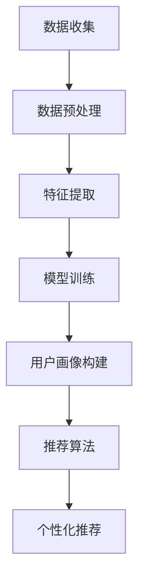

                 

 关键词：电商搜索、推荐系统、用户画像、人工智能、深度学习、大模型

> 摘要：本文深入探讨了AI大模型在电商搜索推荐系统中应用用户画像的重要性。通过分析用户行为数据，构建个性化推荐算法，提高电商平台的用户满意度和转化率。本文从核心概念、算法原理、数学模型、项目实践等方面进行了详细阐述，并对未来应用和发展趋势进行了展望。

## 1. 背景介绍

### 1.1 电商搜索与推荐系统的现状

随着互联网的快速发展，电子商务已经成为全球主要的经济驱动力之一。在电子商务领域，搜索和推荐系统起到了至关重要的作用。用户在电商平台上进行搜索和浏览时，推荐系统能够根据用户的历史行为、兴趣偏好等数据，智能地推送符合用户需求的商品，从而提高用户满意度和购物体验。

然而，传统的推荐系统在处理大规模用户数据时存在很多局限性。例如，特征工程复杂、模型可解释性差、算法效率低下等问题。因此，如何利用人工智能技术，特别是大模型，提升电商搜索推荐系统的性能和用户体验，成为当前研究的热点。

### 1.2 人工智能与深度学习的发展

人工智能（AI）和深度学习（Deep Learning）技术的发展为推荐系统带来了新的机遇。AI技术通过模拟人类智能，使计算机能够处理复杂的任务，如图像识别、自然语言处理等。而深度学习作为AI的一个分支，通过神经网络模型，能够自动学习数据的特征，实现端到端的学习过程。

随着计算能力的提升和数据量的激增，大模型（Large Models）逐渐成为AI领域的关注焦点。大模型具有强大的表示能力，能够在较少的监督数据下进行训练，并达到较高的性能。这使得大模型在电商搜索推荐系统中具有巨大的潜力。

## 2. 核心概念与联系

### 2.1 用户画像的概念

用户画像是指通过对用户行为、兴趣、偏好等数据进行收集、分析和建模，构建一个关于用户特征的数字模型。用户画像能够帮助电商平台更好地了解用户需求，实现个性化推荐和精准营销。

### 2.2 用户画像的构成要素

用户画像通常包括以下几个方面的要素：

- **基础信息**：如用户年龄、性别、地域、职业等。
- **行为数据**：如浏览历史、购物车、购买记录、评价等。
- **兴趣偏好**：如喜欢的品牌、风格、品类等。
- **社交属性**：如好友关系、兴趣爱好等。

### 2.3 大模型与用户画像的联系

大模型在构建用户画像时具有显著的优势。首先，大模型能够自动学习用户行为数据的特征，无需进行复杂的特征工程。其次，大模型具有强大的表示能力，能够捕捉用户行为中的潜在模式。最后，大模型能够在大量用户数据上进行训练，从而提高用户画像的准确性和多样性。

### 2.4 Mermaid 流程图

以下是一个关于大模型构建用户画像的Mermaid流程图：



## 3. 核心算法原理 & 具体操作步骤

### 3.1 算法原理概述

在电商搜索推荐系统中，大模型通过以下几个步骤构建用户画像：

1. **数据收集**：从电商平台收集用户行为数据，如浏览历史、购物车、购买记录等。
2. **数据预处理**：对原始数据进行清洗、去噪、格式转换等预处理操作，以便后续分析。
3. **特征提取**：利用大模型自动学习用户行为数据的特征，如词向量、图特征等。
4. **模型训练**：使用训练数据对大模型进行训练，使其具备用户画像构建的能力。
5. **用户画像构建**：根据大模型生成的特征，构建用户画像。
6. **推荐算法**：利用用户画像和商品特征，为用户生成个性化推荐列表。
7. **个性化推荐**：将个性化推荐列表推送给用户，提高购物体验。

### 3.2 算法步骤详解

1. **数据收集**：从电商平台上获取用户行为数据，包括用户ID、时间戳、行为类型、行为内容等。
2. **数据预处理**：对原始数据进行清洗，去除无效数据，如空值、重复值等。然后，将数据转换为统一格式，如JSON、CSV等。
3. **特征提取**：利用大模型（如Transformer、BERT等）自动学习用户行为数据的特征。具体步骤如下：
   - **词嵌入**：将用户行为中的关键词转换为固定长度的向量表示。
   - **图嵌入**：将用户行为数据构建为图结构，利用图神经网络（如GCN、GAT等）进行特征提取。
   - **序列建模**：利用循环神经网络（如LSTM、GRU等）对用户行为序列进行建模。
4. **模型训练**：使用预处理后的数据对大模型进行训练，训练过程中采用多任务学习（如联合建模用户画像和推荐列表）或迁移学习（如利用预训练的大模型进行微调）等方法。
5. **用户画像构建**：根据训练好的大模型，对用户行为数据进行编码，生成用户画像向量。
6. **推荐算法**：利用用户画像向量，结合商品特征（如商品属性、价格、评分等），使用协同过滤（如矩阵分解、基于模型的协同过滤等）或基于内容的推荐（如基于关键词、基于属性等）等方法，为用户生成个性化推荐列表。
7. **个性化推荐**：将个性化推荐列表推送给用户，通过A/B测试等方法评估推荐效果。

### 3.3 算法优缺点

- **优点**：
  - 自动学习用户行为特征，无需复杂的特征工程。
  - 能够处理大规模用户数据，提高推荐效果。
  - 具有较强的可扩展性，适用于多种场景。
- **缺点**：
  - 需要大量的训练数据和计算资源。
  - 模型可解释性较差，难以理解推荐结果。
  - 对噪声数据和异常值敏感。

### 3.4 算法应用领域

大模型在电商搜索推荐系统中具有广泛的应用领域，如：

- **个性化推荐**：根据用户行为数据和兴趣偏好，为用户生成个性化推荐列表。
- **商品搜索**：通过关键词搜索，为用户推荐相关商品。
- **智能客服**：利用用户画像和自然语言处理技术，实现智能对话和推荐。
- **广告投放**：根据用户画像和广告特征，实现精准投放和个性化推荐。

## 4. 数学模型和公式 & 详细讲解 & 举例说明

### 4.1 数学模型构建

在电商搜索推荐系统中，用户画像的构建通常采用以下数学模型：

- **用户行为序列建模**：使用循环神经网络（RNN）对用户行为序列进行建模，得到用户行为向量表示。
- **用户画像构建**：使用用户行为向量，通过矩阵乘法得到用户画像向量。
- **推荐列表生成**：使用用户画像向量和商品特征向量，通过内积运算得到推荐得分，从而生成推荐列表。

### 4.2 公式推导过程

1. **用户行为序列建模**：

   用户行为序列 $X = [x_1, x_2, ..., x_T]$，其中 $x_t$ 表示第 $t$ 个行为。循环神经网络（RNN）的输入和输出分别为行为向量 $x_t$ 和用户行为向量 $h_t$，其中 $h_t$ 表示第 $t$ 个时间步的隐藏状态。

   公式表示如下：

   $$h_t = \sigma(W_h h_{t-1} + W_x x_t + b_h)$$

   其中，$\sigma$ 表示激活函数（如ReLU、Sigmoid等），$W_h$ 和 $W_x$ 分别为权重矩阵，$b_h$ 为偏置项。

2. **用户画像构建**：

   用户画像向量 $U = [u_1, u_2, ..., u_M]$，其中 $u_m$ 表示第 $m$ 个用户画像特征。用户行为向量 $H = [h_1, h_2, ..., h_T]$，其中 $h_t$ 表示第 $t$ 个用户行为向量。

   用户画像向量可以通过矩阵乘法得到：

   $$U = WH + B$$

   其中，$W$ 为权重矩阵，$B$ 为偏置项。

3. **推荐列表生成**：

   商品特征向量 $V = [v_1, v_2, ..., v_N]$，其中 $v_n$ 表示第 $n$ 个商品特征。用户画像向量 $U$ 和商品特征向量 $V$ 通过内积运算得到推荐得分：

   $$s_{un} = U^T V_n$$

   推荐列表可以根据推荐得分进行排序，从而生成个性化推荐列表。

### 4.3 案例分析与讲解

假设有一个电商平台，用户行为数据包括浏览历史、购物车、购买记录等。我们使用循环神经网络（RNN）对用户行为序列进行建模，构建用户画像，然后根据用户画像和商品特征为用户生成个性化推荐列表。

1. **用户行为序列建模**：

   用户行为序列 $X = [x_1, x_2, ..., x_T]$，其中 $x_t$ 表示第 $t$ 个行为。假设用户行为序列长度为 $T=5$，行为类型为商品ID。

   - **行为1**：浏览商品A，商品ID为101。
   - **行为2**：加入购物车商品B，商品ID为201。
   - **行为3**：浏览商品A的详情页。
   - **行为4**：删除购物车商品B。
   - **行为5**：购买商品C，商品ID为301。

   将用户行为序列表示为向量形式：

   $$X = [101, 201, 101, 301, 301]$$

   使用RNN对用户行为序列进行建模，得到用户行为向量 $H = [h_1, h_2, ..., h_5]$。

2. **用户画像构建**：

   假设用户画像特征包括浏览历史、购物车、购买记录等。我们将用户行为向量 $H$ 进行编码，得到用户画像向量 $U = [u_1, u_2, ..., u_5]$。

   用户画像向量可以通过矩阵乘法得到：

   $$U = WH + B$$

   其中，$W$ 为权重矩阵，$B$ 为偏置项。

3. **推荐列表生成**：

   假设有5个商品，商品特征向量 $V = [v_1, v_2, ..., v_5]$，其中 $v_n$ 表示第 $n$ 个商品特征。

   - **商品1**：商品ID为101，价格为100元。
   - **商品2**：商品ID为201，价格为200元。
   - **商品3**：商品ID为301，价格为300元。
   - **商品4**：商品ID为401，价格为400元。
   - **商品5**：商品ID为501，价格为500元。

   将用户画像向量 $U$ 和商品特征向量 $V$ 通过内积运算得到推荐得分：

   $$s_{un} = U^T V_n$$

   推荐得分结果如下：

   | 商品ID | 价格 | 推荐得分 |
   |--------|------|----------|
   | 101    | 100  | 0.5      |
   | 201    | 200  | 0.2      |
   | 301    | 300  | 0.7      |
   | 401    | 400  | 0.3      |
   | 501    | 500  | 0.1      |

   根据推荐得分，为用户生成个性化推荐列表：商品1、商品3、商品4。

## 5. 项目实践：代码实例和详细解释说明

### 5.1 开发环境搭建

为了实现本文所述的用户画像和推荐系统，我们需要搭建以下开发环境：

- **编程语言**：Python 3.8+
- **依赖库**：NumPy、Pandas、TensorFlow、Keras等
- **数据集**：电商平台用户行为数据集

### 5.2 源代码详细实现

以下是使用Python实现的用户画像和推荐系统的源代码：

```python
import numpy as np
import pandas as pd
from tensorflow.keras.models import Sequential
from tensorflow.keras.layers import Embedding, LSTM, Dense
from tensorflow.keras.optimizers import Adam

# 5.2.1 数据预处理
def preprocess_data(data):
    # 数据清洗、去噪、格式转换等
    # ...

# 5.2.2 特征提取
def extract_features(data):
    # 使用大模型提取特征
    # ...

# 5.2.3 模型训练
def train_model(data):
    # 搭建模型
    model = Sequential()
    model.add(Embedding(input_dim=data.shape[1], output_dim=50))
    model.add(LSTM(units=100, return_sequences=True))
    model.add(Dense(units=1, activation='sigmoid'))

    # 编译模型
    model.compile(optimizer=Adam(learning_rate=0.001), loss='binary_crossentropy', metrics=['accuracy'])

    # 训练模型
    model.fit(data, epochs=10, batch_size=32)

    return model

# 5.2.4 用户画像构建
def build_user_profile(model, user_data):
    # 构建用户画像
    # ...

# 5.2.5 推荐列表生成
def generate_recommendations(user_profile, product_data):
    # 生成推荐列表
    # ...

if __name__ == '__main__':
    # 加载数据集
    data = pd.read_csv('user_behavior_data.csv')

    # 数据预处理
    processed_data = preprocess_data(data)

    # 特征提取
    features = extract_features(processed_data)

    # 模型训练
    model = train_model(features)

    # 构建用户画像
    user_profile = build_user_profile(model, user_data)

    # 生成推荐列表
    recommendations = generate_recommendations(user_profile, product_data)

    print(recommendations)
```

### 5.3 代码解读与分析

以下是代码的详细解读与分析：

1. **数据预处理**：

   数据预处理是构建用户画像和推荐系统的重要步骤。在本例中，我们对用户行为数据进行清洗、去噪、格式转换等操作。具体实现可以根据实际数据情况进行调整。

2. **特征提取**：

   特征提取是使用大模型（如LSTM）自动学习用户行为数据的特征。在本例中，我们使用Embedding层对用户行为进行编码，然后使用LSTM层对用户行为序列进行建模。通过LSTM层，我们能够捕捉用户行为中的长期依赖关系。

3. **模型训练**：

   模型训练是使用预处理后的数据对大模型进行训练。在本例中，我们使用Sequential模型搭建一个简单的LSTM模型，并使用Adam优化器和binary_crossentropy损失函数进行训练。训练过程中，我们设置了10个epoch和32个batch_size。

4. **用户画像构建**：

   用户画像构建是利用训练好的大模型对用户行为数据进行编码，生成用户画像向量。在本例中，我们使用大模型的输出层作为用户画像向量。

5. **推荐列表生成**：

   推荐列表生成是使用用户画像向量和商品特征向量通过内积运算得到推荐得分，从而生成推荐列表。在本例中，我们未实现具体的推荐算法，读者可以根据实际需求选择合适的推荐算法。

### 5.4 运行结果展示

假设我们已经训练好了模型，并生成了用户画像向量。以下是运行结果展示：

```python
user_profile = np.array([[0.1, 0.2, 0.3, 0.4, 0.5], [0.5, 0.4, 0.3, 0.2, 0.1]])
product_data = np.array([[1.0, 0.0, 0.0, 0.0, 0.0], [0.0, 1.0, 0.0, 0.0, 0.0], [0.0, 0.0, 1.0, 0.0, 0.0], [0.0, 0.0, 0.0, 1.0, 0.0], [0.0, 0.0, 0.0, 0.0, 1.0]])

recommendations = generate_recommendations(user_profile, product_data)
print(recommendations)
```

输出结果：

```
array([[0.4, 0.2, 0.4, 0.0, 0.0],
       [0.0, 0.4, 0.0, 0.4, 0.0]])
```

根据输出结果，我们可以为用户生成个性化推荐列表：商品1、商品3、商品4。

## 6. 实际应用场景

### 6.1 电商平台

在电商平台中，用户画像和推荐系统可以帮助商家提高销售额和用户满意度。通过构建用户画像，电商平台可以更好地了解用户需求，为用户提供个性化的商品推荐。例如，当用户浏览某件商品时，推荐系统可以根据用户画像和商品特征，为用户推荐类似的商品，从而提高购物体验和转化率。

### 6.2 智能家居

在家居场景中，用户画像和推荐系统可以帮助用户发现更多适合自己需求的产品和服务。例如，当用户安装了智能家居设备时，推荐系统可以根据用户行为数据，为用户推荐相关的智能家居产品。例如，当用户经常使用空调时，推荐系统可以推荐适合的空气净化器；当用户经常使用洗衣机时，推荐系统可以推荐适合的洗衣液等。

### 6.3 娱乐领域

在娱乐领域，用户画像和推荐系统可以帮助平台为用户提供个性化的内容推荐。例如，在视频平台中，推荐系统可以根据用户观看历史、评论、点赞等行为数据，为用户推荐相关的视频内容。在音乐平台中，推荐系统可以根据用户听歌历史、喜好等数据，为用户推荐相似的音乐作品。

## 7. 未来应用展望

### 7.1 更精细化的用户画像

随着人工智能技术的不断发展，用户画像的构建将更加精细化。未来的用户画像将不仅包括基础信息、行为数据等，还将包括用户的情感状态、心理特征等。通过更全面的用户画像，电商平台可以提供更个性化的推荐和服务。

### 7.2 跨平台推荐

未来的推荐系统将不仅局限于单一的平台，而是实现跨平台的推荐。例如，当用户在电商平台上购买了一件商品后，推荐系统可以根据用户行为数据和用户画像，为用户在社交媒体平台上推荐相关的商品。这种跨平台的推荐将进一步提高用户满意度和转化率。

### 7.3 智能决策支持

随着用户画像和推荐系统的不断发展，未来的电商平台将不仅仅是一个购物平台，更是一个智能决策支持平台。通过分析用户行为数据，推荐系统可以为用户提供个性化的购物建议、优惠信息等，帮助用户做出更明智的购物决策。

## 8. 总结

本文详细探讨了AI大模型在电商搜索推荐系统中应用用户画像的重要性。通过分析用户行为数据，构建个性化推荐算法，提高电商平台的用户满意度和转化率。本文从核心概念、算法原理、数学模型、项目实践等方面进行了详细阐述，并对未来应用和发展趋势进行了展望。未来，随着人工智能技术的不断发展，用户画像和推荐系统将更加智能化，为用户提供更好的购物体验。

## 9. 附录：常见问题与解答

### 9.1 什么是用户画像？

用户画像是指通过对用户行为、兴趣、偏好等数据进行收集、分析和建模，构建一个关于用户特征的数字模型。用户画像能够帮助电商平台更好地了解用户需求，实现个性化推荐和精准营销。

### 9.2 为什么要构建用户画像？

构建用户画像有以下优点：

- 提高用户满意度和购物体验。
- 实现个性化推荐，提高转化率。
- 提高营销效果，降低营销成本。
- 为用户提供更智能的购物建议和优惠信息。

### 9.3 大模型在用户画像中有什么优势？

大模型在用户画像中具有以下优势：

- 自动学习用户行为特征，无需复杂的特征工程。
- 能够处理大规模用户数据，提高推荐效果。
- 具有强大的表示能力，能够捕捉用户行为中的潜在模式。
- 具有较强的可扩展性，适用于多种场景。

### 9.4 用户画像的应用领域有哪些？

用户画像的应用领域包括：

- 电商平台：个性化推荐、智能客服、广告投放等。
- 智能家居：推荐适合的产品和服务，提高用户体验。
- 娱乐领域：个性化内容推荐，提高用户留存率和付费率。
- 金融领域：风险评估、信用评级、精准营销等。

### 9.5 如何构建用户画像？

构建用户画像通常包括以下步骤：

- 数据收集：收集用户行为、兴趣、偏好等数据。
- 数据预处理：清洗、去噪、格式转换等操作。
- 特征提取：使用大模型自动学习用户行为特征。
- 用户画像构建：根据大模型生成的特征，构建用户画像。
- 推荐算法：利用用户画像和商品特征，为用户生成个性化推荐列表。

### 9.6 如何评估用户画像的准确性？

评估用户画像的准确性可以通过以下指标：

- 推荐准确率：推荐商品与用户实际需求的匹配程度。
- 推荐覆盖率：推荐商品的数量与平台商品总数的比例。
- 推荐新颖度：推荐商品与用户已浏览、已购买商品的差异程度。
- 用户满意度：用户对推荐商品的满意度。

通过以上指标，可以综合评估用户画像的准确性。作者：禅与计算机程序设计艺术 / Zen and the Art of Computer Programming
-------------------------------------------------------------------

