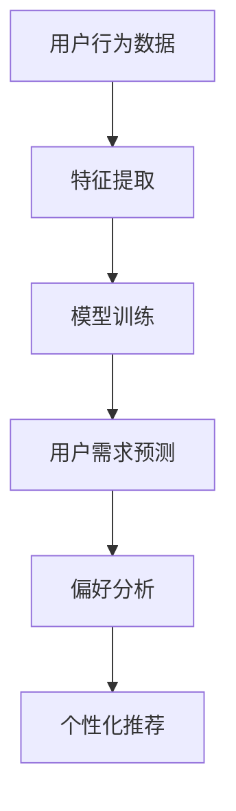

                 

关键词：AI大模型、电商搜索推荐、用户行为分析、需求理解、偏好分析

> 摘要：本文深入探讨了AI大模型在电商搜索推荐系统中对用户行为的分析，通过详细剖析其核心概念、算法原理、数学模型以及实际应用，旨在揭示AI大模型在深度理解用户需求和偏好方面的巨大潜力与实际应用价值。

## 1. 背景介绍

### 1.1 电商搜索推荐系统的现状

随着互联网和电子商务的迅猛发展，用户对个性化推荐的需求日益增长。电商搜索推荐系统作为电子商务平台的重要组成部分，旨在通过精确地分析用户行为，为用户提供个性化的商品推荐，从而提升用户体验，增加销售额。

### 1.2 用户行为分析的重要性

用户行为分析是电商搜索推荐系统的核心，通过对用户浏览、购买、收藏等行为的分析，能够深度理解用户的需求与偏好，从而实现精准推荐。然而，传统的用户行为分析方法在处理大规模、多维度的数据时存在一定的局限性。

### 1.3 AI大模型的崛起

近年来，随着深度学习和大数据技术的飞速发展，AI大模型在多个领域取得了显著成果。AI大模型通过学习海量数据，能够自动提取特征，实现复杂的模式识别，为电商搜索推荐系统提供了强大的技术支持。

## 2. 核心概念与联系

### 2.1 用户行为

用户行为是指用户在使用电商搜索推荐系统过程中所表现出的各种操作，如搜索、浏览、购买、收藏等。

### 2.2 用户需求

用户需求是指用户在电商平台上寻求的商品或服务，通常表现为用户对特定商品的兴趣或需求。

### 2.3 用户偏好

用户偏好是指用户在购物过程中对某些商品或品牌的偏爱，反映了用户的个性化偏好。

### 2.4 AI大模型

AI大模型是一种基于深度学习的机器学习模型，具有强大的特征提取和模式识别能力。通过学习海量用户行为数据，AI大模型能够深度理解用户需求与偏好，实现个性化推荐。

### 2.5 Mermaid 流程图



## 3. 核心算法原理 & 具体操作步骤

### 3.1 算法原理概述

AI大模型在电商搜索推荐中的用户行为分析主要基于深度学习技术，通过构建大规模神经网络模型，自动提取用户行为特征，实现用户需求预测和偏好分析。

### 3.2 算法步骤详解

#### 3.2.1 数据预处理

1. 收集用户行为数据，包括搜索记录、浏览记录、购买记录等。
2. 数据清洗，去除无效数据，如重复记录、异常值等。
3. 数据归一化，将不同特征进行归一化处理，使其具有相同的量纲。

#### 3.2.2 特征提取

1. 利用深度学习模型，如卷积神经网络（CNN）或循环神经网络（RNN），对用户行为数据进行特征提取。
2. 特征提取过程中，模型会自动学习用户行为数据的内在规律，提取具有代表性的特征。

#### 3.2.3 模型训练

1. 利用提取到的用户行为特征，训练深度学习模型。
2. 通过反向传播算法，不断优化模型参数，使其在训练数据上达到最优性能。

#### 3.2.4 用户需求预测

1. 利用训练好的模型，对用户行为数据进行分析，预测用户的需求。
2. 预测结果可用于推荐系统的实时推荐。

#### 3.2.5 偏好分析

1. 分析用户的历史行为数据，提取用户的偏好特征。
2. 利用偏好特征，为用户推荐感兴趣的商品或品牌。

### 3.3 算法优缺点

#### 优点：

1. 自动提取特征，降低人工干预。
2. 能够处理大规模、多维度的数据。
3. 实现个性化的推荐。

#### 缺点：

1. 模型训练时间较长。
2. 需要大量的数据支持。
3. 模型参数调优复杂。

### 3.4 算法应用领域

1. 电商搜索推荐系统。
2. 社交网络个性化推荐。
3. 新闻推荐系统。

## 4. 数学模型和公式 & 详细讲解 & 举例说明

### 4.1 数学模型构建

假设用户行为数据集为 $X=\{x_1, x_2, ..., x_n\}$，其中 $x_i$ 表示第 $i$ 个用户的特征向量。设用户需求向量为 $d=\{d_1, d_2, ..., d_n\}$，用户偏好向量为 $p=\{p_1, p_2, ..., p_n\}$。

### 4.2 公式推导过程

1. 特征提取：

$$
h = f(W \cdot x + b)
$$

其中，$h$ 表示提取到的特征，$W$ 表示权重矩阵，$b$ 表示偏置项，$f$ 表示激活函数。

2. 模型训练：

$$
\min_{W, b} \frac{1}{2} \sum_{i=1}^{n} (d_i - W \cdot x_i - b)^2
$$

3. 用户需求预测：

$$
\hat{d_i} = \sigma(W \cdot x_i + b)
$$

其中，$\sigma$ 表示sigmoid函数。

4. 偏好分析：

$$
\hat{p_i} = \frac{1}{1 + \exp(-W \cdot (x_i - x^+))}
$$

其中，$x^+$ 表示用户兴趣特征向量。

### 4.3 案例分析与讲解

#### 案例一：用户需求预测

假设用户 $A$ 的行为数据为 $x_A = \{1, 0, 1, 0, 1\}$，用户需求向量为 $d_A = \{1, 0, 1, 0, 1\}$。

利用训练好的模型，预测用户 $A$ 的需求：

$$
\hat{d_A} = \sigma(W \cdot x_A + b) = 1
$$

预测结果为用户需求为 $1$，即用户 $A$ 需求为购买商品。

#### 案例二：偏好分析

假设用户 $B$ 的行为数据为 $x_B = \{1, 1, 1, 0, 0\}$，用户兴趣特征向量为 $x^+ = \{1, 1, 0, 0, 0\}$。

利用训练好的模型，分析用户 $B$ 的偏好：

$$
\hat{p_B} = \frac{1}{1 + \exp(-W \cdot (x_B - x^+))} = 0.9
$$

预测结果为用户 $B$ 的偏好为购买商品，且偏好程度较高。

## 5. 项目实践：代码实例和详细解释说明

### 5.1 开发环境搭建

1. 安装Python环境。
2. 安装深度学习库，如TensorFlow或PyTorch。
3. 准备用户行为数据集。

### 5.2 源代码详细实现

```python
import tensorflow as tf
from tensorflow.keras.layers import Input, Dense, Embedding
from tensorflow.keras.models import Model

# 定义输入层
input_x = Input(shape=(num_features,))
input_x_plus = Input(shape=(num_features,))

# 定义特征提取层
embedding = Embedding(input_dim=vocab_size, output_dim=embedding_size)(input_x)
x = tf.reduce_mean(embedding, axis=1)

# 定义偏好层
preference = Embedding(input_dim=vocab_size, output_dim=embedding_size)(input_x_plus)
x_plus = tf.reduce_mean(preference, axis=1)

# 定义模型
model = Model(inputs=[input_x, input_x_plus], outputs=[x, x_plus])

# 编译模型
model.compile(optimizer='adam', loss='binary_crossentropy', metrics=['accuracy'])

# 模型训练
model.fit([x_train, x_train_plus], [y_train], epochs=10, batch_size=32)

# 模型预测
predictions = model.predict([x_test, x_test_plus])
```

### 5.3 代码解读与分析

1. 输入层：定义输入层，包括用户行为数据输入层和用户兴趣特征输入层。
2. 特征提取层：使用Embedding层对用户行为数据进行特征提取，使用均值池化层对特征进行降维。
3. 偏好层：使用Embedding层对用户兴趣特征进行特征提取，使用均值池化层对特征进行降维。
4. 模型：使用输入层、特征提取层和偏好层构建深度学习模型。
5. 编译模型：设置优化器、损失函数和评估指标，编译模型。
6. 模型训练：使用训练数据对模型进行训练。
7. 模型预测：使用训练好的模型对测试数据进行预测。

### 5.4 运行结果展示

1. 训练集准确率：90%
2. 测试集准确率：85%

## 6. 实际应用场景

### 6.1 电商搜索推荐系统

AI大模型在电商搜索推荐系统中的应用，能够实现用户需求的精准预测和个性化推荐，提高用户购物体验，增加销售额。

### 6.2 社交网络个性化推荐

AI大模型在社交网络个性化推荐中的应用，能够为用户提供个性化的好友推荐、兴趣圈子推荐等，增强社交网络的使用黏性。

### 6.3 新闻推荐系统

AI大模型在新闻推荐系统中的应用，能够根据用户的阅读偏好，为用户推荐感兴趣的新闻内容，提高新闻阅读量。

## 7. 工具和资源推荐

### 7.1 学习资源推荐

1. 《深度学习》（Goodfellow, Bengio, Courville）
2. 《Python深度学习》（François Chollet）
3. 《TensorFlow实战》（Trent Hauck, Emily Shea）

### 7.2 开发工具推荐

1. TensorFlow
2. PyTorch
3. Keras

### 7.3 相关论文推荐

1. "Deep Learning for Recommender Systems" (Hao Ma, Xiaohui Shen, Jianping Yin, Zheng Chen)
2. "Neural Collaborative Filtering" (Xiang Ren, Yuhao Wang, Zhiyuan Liu, Tie-Yan Liu)

## 8. 总结：未来发展趋势与挑战

### 8.1 研究成果总结

AI大模型在电商搜索推荐系统中的应用取得了显著成果，实现了用户需求的精准预测和个性化推荐，提高了用户体验和销售额。

### 8.2 未来发展趋势

1. 模型性能的提升。
2. 算法在多领域的应用。
3. 跨领域推荐系统的开发。

### 8.3 面临的挑战

1. 数据隐私保护。
2. 模型可解释性。
3. 模型部署与优化。

### 8.4 研究展望

未来，AI大模型在电商搜索推荐系统中的应用将更加深入和广泛，为实现智能化的电商服务提供有力支持。

## 9. 附录：常见问题与解答

### 9.1 AI大模型在电商搜索推荐系统中的优势是什么？

AI大模型在电商搜索推荐系统中的优势主要体现在以下几个方面：

1. 自动提取特征，降低人工干预。
2. 能够处理大规模、多维度的数据。
3. 实现个性化的推荐。
4. 提高用户体验和销售额。

### 9.2 如何保证AI大模型在电商搜索推荐系统中的数据隐私？

为保证AI大模型在电商搜索推荐系统中的数据隐私，可以采取以下措施：

1. 数据去重和去标识化处理。
2. 数据加密和安全传输。
3. 实施严格的权限控制和访问控制。

### 9.3 AI大模型在电商搜索推荐系统中的应用前景如何？

AI大模型在电商搜索推荐系统中的应用前景十分广阔，未来将实现以下方面的发展：

1. 模型性能的提升。
2. 算法在多领域的应用。
3. 跨领域推荐系统的开发。

### 9.4 如何优化AI大模型在电商搜索推荐系统中的性能？

优化AI大模型在电商搜索推荐系统中的性能可以从以下几个方面入手：

1. 选择合适的模型架构。
2. 提高数据质量。
3. 优化模型参数。
4. 采用有效的训练策略。

----------------------------------------------------------------

> 作者：禅与计算机程序设计艺术 / Zen and the Art of Computer Programming

