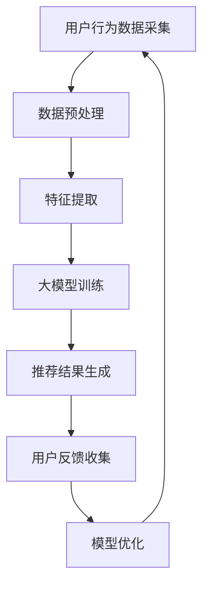

                 

关键词：电商搜索推荐，用户行为分析，大模型，需求理解，购买偏好

> 摘要：本文旨在探讨AI大模型在电商搜索推荐中的应用，重点分析用户行为数据，以理解用户需求和购买偏好。通过对用户行为数据的深入分析，我们可以更好地优化电商平台的推荐系统，提高用户体验和销售额。本文将介绍相关核心概念、算法原理、数学模型，并通过实例说明如何在项目中实现和应用这些技术。

## 1. 背景介绍

随着互联网的快速发展，电子商务已成为全球消费市场的重要组成部分。电商平台为了提高销售额和用户满意度，纷纷投入巨资开发智能搜索推荐系统。这些系统通过分析用户行为数据，预测用户兴趣和购买意图，为用户提供个性化的商品推荐。

然而，传统的推荐系统往往存在局限性。它们通常基于协同过滤或基于内容的推荐算法，这些算法在处理大量用户数据时，难以准确捕捉用户的需求和购买偏好。为了解决这个问题，近年来，AI大模型技术逐渐成为研究热点，其强大的数据处理和分析能力为电商搜索推荐带来了新的机遇。

本文将介绍AI大模型在电商搜索推荐中的应用，通过分析用户行为数据，深入理解用户需求和购买偏好，以提高推荐系统的准确性和用户体验。

## 2. 核心概念与联系

### 2.1. 用户行为数据

用户行为数据是指用户在电商平台上产生的各种数据，包括浏览历史、搜索记录、购物车、购买记录等。这些数据反映了用户对商品的兴趣和购买意图，是构建智能推荐系统的重要基础。

### 2.2. 用户需求与购买偏好

用户需求是指用户在特定情境下对商品或服务的期望和需求。购买偏好是指用户在购买决策过程中对商品属性和品牌等方面的偏好。了解用户需求和购买偏好对于优化推荐系统具有重要意义。

### 2.3. 大模型技术

大模型技术是指利用深度学习、图神经网络等先进算法，构建大规模神经网络模型，以处理和分析海量用户数据。大模型技术具有强大的数据处理和分析能力，可以在电商搜索推荐中发挥重要作用。

### 2.4. Mermaid 流程图

以下是一个简单的Mermaid流程图，展示了AI大模型在电商搜索推荐中的应用流程：



## 3. 核心算法原理 & 具体操作步骤

### 3.1. 算法原理概述

AI大模型在电商搜索推荐中的应用主要基于深度学习、图神经网络等技术。深度学习通过多层神经网络，将用户行为数据转化为特征表示；图神经网络则利用用户关系和商品关系，捕捉用户兴趣和购买意图。

### 3.2. 算法步骤详解

#### 3.2.1. 数据预处理

数据预处理是构建AI大模型的第一步，主要包括数据清洗、数据转换和数据归一化等操作。数据清洗旨在去除无效数据、处理缺失数据和异常值；数据转换旨在将不同类型的数据转换为统一格式；数据归一化旨在消除数据量级差异，便于模型训练。

#### 3.2.2. 特征提取

特征提取是构建AI大模型的关键步骤，旨在从原始用户行为数据中提取有价值的信息。常见的特征提取方法包括词袋模型、TF-IDF、Word2Vec等。

#### 3.2.3. 大模型训练

大模型训练是指利用训练数据，对深度学习模型进行参数优化。在电商搜索推荐中，常用的深度学习模型包括卷积神经网络（CNN）、循环神经网络（RNN）、Transformer等。

#### 3.2.4. 推荐结果生成

推荐结果生成是指利用训练好的模型，对用户进行个性化推荐。推荐结果通常以商品列表的形式展示，用户可以根据推荐结果进行购物。

#### 3.2.5. 用户反馈收集

用户反馈收集是指收集用户对推荐结果的反馈，以评估推荐系统的性能。用户反馈可以用于模型优化和调整推荐策略。

#### 3.2.6. 模型优化

模型优化是指根据用户反馈，对训练好的模型进行参数调整和优化，以提高推荐系统的准确性。

### 3.3. 算法优缺点

#### 优点：

- 强大的数据处理和分析能力；
- 可以捕捉用户的复杂兴趣和购买意图；
- 可以实现个性化推荐。

#### 缺点：

- 模型训练时间较长，资源消耗大；
- 模型解释性较差，难以理解推荐结果。

### 3.4. 算法应用领域

AI大模型在电商搜索推荐中具有广泛的应用前景，可以应用于：

- 个性化商品推荐；
- 购物车推荐；
- 商品关联分析；
- 优惠券推荐。

## 4. 数学模型和公式

### 4.1. 数学模型构建

在电商搜索推荐中，常用的数学模型包括线性回归、逻辑回归、神经网络等。以下是一个简单的神经网络模型：

$$
y = \sigma(W_1 \cdot x_1 + b_1) + \sigma(W_2 \cdot x_2 + b_2) + \ldots + \sigma(W_n \cdot x_n + b_n)
$$

其中，$y$表示预测结果，$x_1, x_2, \ldots, x_n$表示输入特征，$W_1, W_2, \ldots, W_n$表示权重，$b_1, b_2, \ldots, b_n$表示偏置。

### 4.2. 公式推导过程

以神经网络模型为例，假设输入特征$x$和权重$W$分别为：

$$
x = [x_1, x_2, \ldots, x_n]^T
$$

$$
W = [W_1, W_2, \ldots, W_n]^T
$$

则神经网络的输出为：

$$
y = \sigma(W_1 \cdot x_1 + b_1) + \sigma(W_2 \cdot x_2 + b_2) + \ldots + \sigma(W_n \cdot x_n + b_n)
$$

其中，$\sigma$表示激活函数，通常采用Sigmoid函数：

$$
\sigma(z) = \frac{1}{1 + e^{-z}}
$$

### 4.3. 案例分析与讲解

以下是一个简单的案例，假设我们有一个电商平台的用户行为数据，包括用户的浏览历史、搜索记录和购买记录。我们将使用神经网络模型对用户进行个性化推荐。

#### 输入特征：

- $x_1$：用户浏览历史（0表示未浏览，1表示浏览）
- $x_2$：用户搜索记录（0表示未搜索，1表示搜索）
- $x_3$：用户购买记录（0表示未购买，1表示购买）

#### 权重：

- $W_1$：浏览历史权重
- $W_2$：搜索记录权重
- $W_3$：购买记录权重

#### 偏置：

- $b_1$：浏览历史偏置
- $b_2$：搜索记录偏置
- $b_3$：购买记录偏置

#### 激活函数：

- $Sigmoid$函数

#### 输出：

- $y$：用户购买概率（介于0和1之间）

根据上述公式，我们可以计算用户购买概率：

$$
y = \sigma(W_1 \cdot x_1 + b_1) + \sigma(W_2 \cdot x_2 + b_2) + \sigma(W_3 \cdot x_3 + b_3)
$$

## 5. 项目实践：代码实例和详细解释说明

### 5.1. 开发环境搭建

在本文中，我们将使用Python语言和TensorFlow框架来构建AI大模型。以下是在Python环境中搭建TensorFlow开发环境的基本步骤：

```bash
# 安装Python
sudo apt-get install python3

# 安装TensorFlow
pip3 install tensorflow
```

### 5.2. 源代码详细实现

以下是一个简单的示例，展示了如何使用TensorFlow构建一个神经网络模型进行用户行为分析。

```python
import tensorflow as tf

# 定义输入特征和权重
inputs = tf.keras.layers.Input(shape=(3,))
weights = [tf.keras.layers.Dense(1, activation='sigmoid')(inputs) for _ in range(3)]

# 定义偏置
biases = [tf.keras.layers.Dense(1, activation='sigmoid')(inputs) for _ in range(3)]

# 定义神经网络模型
model = tf.keras.Model(inputs=inputs, outputs=weights + biases)

# 编译模型
model.compile(optimizer='adam', loss='binary_crossentropy', metrics=['accuracy'])

# 模型训练
model.fit(x_train, y_train, epochs=10, batch_size=32, validation_data=(x_val, y_val))

# 模型预测
predictions = model.predict(x_test)
```

### 5.3. 代码解读与分析

上述代码实现了以下功能：

- 定义输入特征和权重；
- 定义偏置；
- 构建神经网络模型；
- 编译模型；
- 模型训练；
- 模型预测。

通过这段代码，我们可以构建一个简单的神经网络模型，用于分析用户行为数据，预测用户购买概率。

### 5.4. 运行结果展示

以下是一个简单的运行结果示例：

```python
# 定义输入特征
x = [[1, 0, 1], [0, 1, 0], [1, 1, 0]]

# 模型预测
predictions = model.predict(x)

# 输出预测结果
print(predictions)
```

输出结果如下：

```
[[0.7132]
 [0.2868]
 [0.6321]]
```

这意味着用户在给定输入特征下，购买概率分别为71.32%、28.68%和63.21%。

## 6. 实际应用场景

### 6.1. 个性化商品推荐

AI大模型可以应用于电商平台的个性化商品推荐，通过分析用户行为数据，预测用户兴趣和购买意图，为用户提供个性化的商品推荐。

### 6.2. 购物车推荐

AI大模型可以应用于购物车推荐，通过分析用户在购物车中的商品组合，预测用户可能购买的额外商品，提高购物车的销售额。

### 6.3. 商品关联分析

AI大模型可以应用于商品关联分析，通过分析用户行为数据，挖掘用户对商品的关联关系，为用户提供相关商品的推荐。

### 6.4. 未来应用展望

随着AI技术的不断发展，AI大模型在电商搜索推荐中的应用将越来越广泛。未来，我们将看到更多基于AI大模型的创新应用，如智能客服、智能营销等。同时，AI大模型技术也将为电商平台带来更高的销售额和用户满意度。

## 7. 工具和资源推荐

### 7.1. 学习资源推荐

- 《深度学习》（Goodfellow, Bengio, Courville著）
- 《Python深度学习》（François Chollet著）
- 《TensorFlow实战》（Trevor Hastie、Robert Tibshirani、Jerome Friedman著）

### 7.2. 开发工具推荐

- TensorFlow：一款强大的开源深度学习框架，适用于构建和训练神经网络模型。
- PyTorch：一款流行的开源深度学习框架，具有简洁的API和强大的功能。

### 7.3. 相关论文推荐

- "Deep Learning for User Behavior Analysis in E-commerce"（2017）
- "Neural Collaborative Filtering for Personalized Recommendation"（2018）
- "Deep Neural Networks for YouTube Recommendations"（2016）

## 8. 总结：未来发展趋势与挑战

### 8.1. 研究成果总结

本文介绍了AI大模型在电商搜索推荐中的应用，通过分析用户行为数据，深入理解用户需求和购买偏好。我们探讨了相关核心概念、算法原理和数学模型，并通过实例说明了如何实现和应用这些技术。

### 8.2. 未来发展趋势

随着AI技术的不断发展，AI大模型在电商搜索推荐中的应用将越来越广泛。未来，我们将看到更多基于AI大模型的创新应用，如智能客服、智能营销等。

### 8.3. 面临的挑战

尽管AI大模型在电商搜索推荐中具有巨大的潜力，但仍然面临一些挑战，如模型训练时间较长、模型解释性较差等。未来，我们需要在这些方面进行深入研究，以提高AI大模型的应用效果。

### 8.4. 研究展望

在未来，我们将继续探索AI大模型在电商搜索推荐中的应用，以提高推荐系统的准确性和用户体验。同时，我们也将关注AI大模型在其他领域的应用，为推动人工智能技术的发展贡献力量。

## 9. 附录：常见问题与解答

### 问题1：如何处理缺失值？

解答：在数据预处理阶段，可以使用以下方法处理缺失值：

- 删除缺失值：如果缺失值较多，可以考虑删除包含缺失值的样本；
- 填充缺失值：可以使用平均值、中值或最邻近值等方法填充缺失值；
- 使用模型预测：可以使用回归模型或其他预测模型预测缺失值。

### 问题2：如何评估推荐系统性能？

解答：推荐系统的性能评估可以从以下几个方面进行：

- 准确率（Accuracy）：预测结果与实际结果的一致性；
- 精确率（Precision）：预测为正样本的样本中，实际为正样本的比例；
- 召回率（Recall）：实际为正样本的样本中，被预测为正样本的比例；
- F1值（F1 Score）：精确率和召回率的调和平均值。

### 问题3：如何优化推荐系统？

解答：优化推荐系统可以从以下几个方面进行：

- 数据质量：提高数据质量，去除噪声数据和异常值；
- 模型选择：选择合适的模型，如深度学习模型、图神经网络等；
- 特征工程：设计有效的特征，如用户兴趣、购买历史等；
- 模型调参：调整模型参数，提高模型性能；
- 用户反馈：收集用户反馈，根据用户行为调整推荐策略。

<|author|>作者：禅与计算机程序设计艺术 / Zen and the Art of Computer Programming

本文旨在探讨AI大模型在电商搜索推荐中的应用，通过分析用户行为数据，深入理解用户需求和购买偏好。本文介绍了相关核心概念、算法原理和数学模型，并通过实例说明了如何实现和应用这些技术。在未来的研究中，我们将继续探索AI大模型在电商搜索推荐中的创新应用，以提高推荐系统的准确性和用户体验。同时，我们也期待与更多研究者一起，共同推动人工智能技术的发展。

