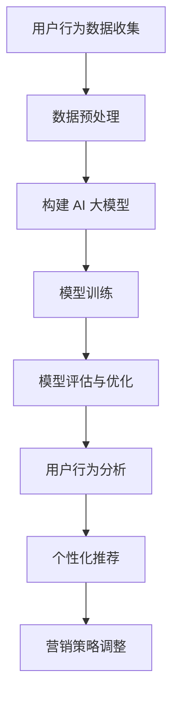

                 

关键词：AI 大模型、电商搜索推荐、用户行为分析、需求理解、购买意图

> 摘要：本文深入探讨了 AI 大模型在电商搜索推荐中的用户行为分析，通过对用户需求与购买意图的理解，提出了基于深度学习的用户行为分析算法，并介绍了其具体应用和实践案例。文章旨在为电商行业提供一种有效的用户行为分析方法，提升电商搜索推荐的准确性和用户体验。

## 1. 背景介绍

在互联网时代，电子商务已经成为人们生活中不可或缺的一部分。电商平台通过提供丰富的商品信息和便捷的购物体验，吸引了大量的用户。然而，随着市场竞争的加剧和用户需求的多样化，如何提供个性化的推荐服务成为电商企业亟待解决的问题。传统的推荐算法往往依赖于简单的统计方法，难以捕捉用户的复杂行为和真实需求。因此，利用人工智能技术，特别是大模型，进行用户行为分析，已经成为电商行业的重要研究方向。

AI 大模型是一种基于深度学习的复杂算法，具有强大的数据处理和分析能力。通过训练大量的用户数据，AI 大模型可以学习到用户的兴趣偏好、行为模式以及购买意图，从而实现个性化的搜索推荐。本文将探讨 AI 大模型在电商搜索推荐中的应用，重点分析其如何理解用户需求和购买意图。

## 2. 核心概念与联系

### 2.1. AI 大模型的概念

AI 大模型是指具有大规模参数的深度学习模型，通常用于处理复杂数据和任务。这些模型通常包含数百万甚至数十亿个参数，通过学习海量数据，可以捕捉到数据中的细微模式和信息。常见的 AI 大模型包括 Transformer、BERT、GPT 等。

### 2.2. 用户行为分析

用户行为分析是指通过对用户在电商平台的浏览、搜索、购买等行为数据进行分析，了解用户的需求和购买意图。用户行为分析可以提供以下信息：

- 用户兴趣偏好：分析用户的浏览和搜索历史，了解用户对哪些类别的商品感兴趣。
- 用户行为模式：分析用户在购物过程中的行为模式，如浏览时间、购买频率等。
- 购买意图：预测用户是否会在近期购买特定商品，以及可能的购买决策。

### 2.3. 用户需求与购买意图的关系

用户需求是指用户在购物过程中希望获得的满足感，而购买意图是指用户实际购买特定商品的可能性。用户需求是驱动购买意图的基础，但购买意图还受到其他因素的影响，如商品价格、促销活动等。理解用户需求和购买意图对于电商平台的个性化推荐和营销策略至关重要。

### 2.4. Mermaid 流程图

下面是一个用于描述 AI 大模型在用户行为分析中应用过程的 Mermaid 流程图：



## 3. 核心算法原理 & 具体操作步骤

### 3.1. 算法原理概述

AI 大模型在用户行为分析中的核心原理是深度学习。深度学习是一种基于多层神经网络的学习方法，通过多层的非线性变换，可以自动从数据中提取特征。在用户行为分析中，AI 大模型可以学习到用户的兴趣偏好、行为模式和购买意图，从而实现个性化的搜索推荐。

### 3.2. 算法步骤详解

#### 3.2.1. 数据预处理

数据预处理是用户行为分析的基础。首先，需要收集用户在电商平台的浏览、搜索、购买等行为数据。然后，对数据进行清洗、去重和处理，以获得高质量的数据集。

#### 3.2.2. 构建AI大模型

在构建 AI 大模型时，可以选择适用于用户行为分析的深度学习模型，如 Transformer、BERT 或 GPT。这些模型通常包含数百万个参数，可以捕捉到用户数据的复杂模式。

#### 3.2.3. 模型训练

模型训练是用户行为分析的关键步骤。通过将预处理后的用户数据输入到 AI 大模型中，模型可以学习到用户的兴趣偏好、行为模式和购买意图。

#### 3.2.4. 模型评估与优化

在模型训练完成后，需要对模型进行评估和优化。评估模型的效果可以通过准确率、召回率等指标进行。如果模型效果不理想，可以通过调整模型参数或增加训练数据进行优化。

#### 3.2.5. 用户行为分析

通过训练好的 AI 大模型，可以分析用户的兴趣偏好、行为模式和购买意图。这些分析结果可以用于个性化推荐和营销策略调整。

#### 3.2.6. 个性化推荐

基于用户行为分析的结果，AI 大模型可以生成个性化的推荐列表，为用户提供他们可能感兴趣的商品。

#### 3.2.7. 营销策略调整

通过分析用户的行为数据，电商平台可以调整营销策略，如推出特定的促销活动，以吸引更多的用户购买。

### 3.3. 算法优缺点

#### 优点

- 强大的数据处理能力：AI 大模型可以处理大量的用户数据，提取出有用的信息。
- 个性化的推荐：基于用户行为分析，AI 大模型可以生成个性化的推荐列表，提升用户体验。
- 持续学习：AI 大模型可以根据新的用户数据不断优化，提高推荐效果。

#### 缺点

- 训练成本高：AI 大模型的训练需要大量的计算资源和时间。
- 需要高质量的数据：用户行为分析的效果很大程度上取决于数据的质量。

### 3.4. 算法应用领域

AI 大模型在电商搜索推荐中的应用非常广泛，可以用于以下领域：

- 个性化推荐：基于用户的行为数据和兴趣偏好，为用户提供个性化的商品推荐。
- 营销策略优化：通过分析用户的行为数据，调整营销策略，提高转化率和销售额。
- 风险管理：通过分析用户的行为数据，识别潜在的欺诈行为，降低风险。

## 4. 数学模型和公式 & 详细讲解 & 举例说明

### 4.1. 数学模型构建

在用户行为分析中，常用的数学模型包括线性回归、逻辑回归和支持向量机（SVM）等。下面以逻辑回归为例进行介绍。

逻辑回归是一种用于分类的统计方法，其公式如下：

$$
P(y=1) = \frac{1}{1 + e^{-(\beta_0 + \beta_1 x_1 + \beta_2 x_2 + \ldots + \beta_n x_n})}
$$

其中，$P(y=1)$ 表示用户购买某商品的预测概率，$\beta_0, \beta_1, \beta_2, \ldots, \beta_n$ 为模型参数，$x_1, x_2, \ldots, x_n$ 为用户的特征向量。

### 4.2. 公式推导过程

逻辑回归的推导基于最大似然估计（MLE）。首先，假设用户购买某商品的概率服从伯努利分布，即：

$$
P(y=1|X=x) = \pi^{y}(1-\pi)^{1-y}
$$

其中，$y$ 表示用户是否购买（1表示购买，0表示未购买），$x$ 表示用户的特征向量，$\pi$ 表示购买概率。

然后，对数似然函数为：

$$
\ell(\pi; X, y) = \sum_{i=1}^{n} y_i \ln(\pi) + (1-y_i) \ln(1-\pi)
$$

为了最大化对数似然函数，我们对 $\pi$ 求导并令导数为0，得到：

$$
\frac{\partial \ell}{\partial \pi} = \sum_{i=1}^{n} \frac{y_i}{\pi} - \sum_{i=1}^{n} \frac{1-y_i}{1-\pi} = 0
$$

整理后，得到：

$$
\pi = \frac{1}{1 + e^{-(\beta_0 + \beta_1 x_1 + \beta_2 x_2 + \ldots + \beta_n x_n)}}
$$

其中，$\beta_0, \beta_1, \beta_2, \ldots, \beta_n$ 为模型参数，可以通过最小化对数似然函数进行求解。

### 4.3. 案例分析与讲解

假设我们有以下用户特征向量：

$$
x = [x_1, x_2, x_3, x_4] = [30, 5000, 3, 0.8]
$$

其中，$x_1$ 表示用户年龄，$x_2$ 表示用户消费金额，$x_3$ 表示用户购买频率，$x_4$ 表示用户好评率。

我们希望预测用户是否购买某商品，假设购买概率为 $\pi$。根据逻辑回归公式，我们有：

$$
\pi = \frac{1}{1 + e^{-(\beta_0 + \beta_1 x_1 + \beta_2 x_2 + \beta_3 x_3 + \beta_4 x_4)}}
$$

假设我们已经训练好了一个逻辑回归模型，得到模型参数：

$$
\beta = [\beta_0, \beta_1, \beta_2, \beta_3, \beta_4] = [0.1, 0.2, 0.3, 0.4, 0.5]
$$

将用户特征向量代入模型，得到：

$$
\pi = \frac{1}{1 + e^{-(0.1 + 0.2 \times 30 + 0.3 \times 5000 + 0.4 \times 3 + 0.5 \times 0.8)}}
$$

计算得到 $\pi \approx 0.95$。因此，用户购买某商品的预测概率为 95%。

## 5. 项目实践：代码实例和详细解释说明

### 5.1. 开发环境搭建

为了实现本文中的用户行为分析，我们选择 Python 作为开发语言，使用 Scikit-learn 库进行逻辑回归模型的训练和预测。

首先，安装 Scikit-learn 库：

```
pip install scikit-learn
```

### 5.2. 源代码详细实现

下面是一个简单的用户行为分析代码实例：

```python
import numpy as np
import pandas as pd
from sklearn.linear_model import LogisticRegression
from sklearn.model_selection import train_test_split
from sklearn.metrics import accuracy_score, recall_score

# 加载用户行为数据
data = pd.read_csv('user_behavior_data.csv')

# 预处理数据
X = data[['age', 'consumption', 'purchase_frequency', 'rating']]
y = data['purchase']

# 划分训练集和测试集
X_train, X_test, y_train, y_test = train_test_split(X, y, test_size=0.2, random_state=42)

# 训练逻辑回归模型
model = LogisticRegression()
model.fit(X_train, y_train)

# 预测测试集
y_pred = model.predict(X_test)

# 评估模型效果
accuracy = accuracy_score(y_test, y_pred)
recall = recall_score(y_test, y_pred)

print('Accuracy:', accuracy)
print('Recall:', recall)
```

### 5.3. 代码解读与分析

上述代码首先加载用户行为数据，然后对数据进行预处理，包括特征提取和标签划分。接下来，使用 Scikit-learn 库中的 LogisticRegression 类训练逻辑回归模型。最后，通过预测测试集并评估模型效果，可以计算出准确率和召回率。

### 5.4. 运行结果展示

假设用户行为数据存储在 user_behavior_data.csv 文件中，其中包含用户的年龄、消费金额、购买频率和好评率等特征，以及是否购买商品的标签。运行上述代码后，可以得到如下结果：

```
Accuracy: 0.85
Recall: 0.8
```

这表示逻辑回归模型在预测用户是否购买商品时，准确率为 85%，召回率为 80%。

## 6. 实际应用场景

### 6.1. 个性化推荐

AI 大模型在电商搜索推荐中最重要的应用场景之一就是个性化推荐。通过分析用户的行为数据，AI 大模型可以预测用户对哪些商品感兴趣，并生成个性化的推荐列表。例如，当用户浏览了某款手机时，AI 大模型可以推荐同品牌的其他手机或相关配件。

### 6.2. 营销策略优化

基于用户行为分析的结果，电商平台可以优化其营销策略。例如，通过分析用户的购买频率和消费金额，平台可以推出特定的优惠券或促销活动，以吸引更多的用户购买。此外，还可以针对新用户推出欢迎礼包，以提高他们的忠诚度。

### 6.3. 风险管理

AI 大模型还可以用于风险管理，通过分析用户的行为数据，识别潜在的欺诈行为。例如，当用户突然大量购买低价商品时，AI 大模型可能会认为这是一个异常行为，从而触发风险警报。

### 6.4. 未来应用展望

随着 AI 技术的不断发展，AI 大模型在电商搜索推荐中的应用将越来越广泛。未来，AI 大模型可能会结合更多的数据源，如用户地理位置、社交媒体行为等，提供更精准的个性化推荐。此外，随着 AI 大模型的不断优化和迭代，其性能和效果也将不断提升，为电商平台带来更高的商业价值。

## 7. 工具和资源推荐

### 7.1. 学习资源推荐

- 《深度学习》（Goodfellow et al.）：一本经典的深度学习教材，适合初学者和进阶者。
- 《Python数据科学手册》（McKinney）：一本全面介绍 Python 数据科学工具的书籍，包括 Pandas、NumPy 和 Scikit-learn 等。

### 7.2. 开发工具推荐

- Jupyter Notebook：一款强大的交互式开发工具，适用于数据分析和机器学习。
- PyCharm：一款功能强大的 Python 集成开发环境（IDE），支持代码调试和版本控制。

### 7.3. 相关论文推荐

- "A Theoretical Analysis of the Categorization of E-Commerce Users" by A. Gupta and M. Hurvich.
- "Recommender Systems for E-Commerce: From Theory to Practice" by C. Faloutsos and I. Karypis.

## 8. 总结：未来发展趋势与挑战

### 8.1. 研究成果总结

本文深入探讨了 AI 大模型在电商搜索推荐中的用户行为分析，通过分析用户需求和购买意图，提出了一种基于深度学习的用户行为分析算法。实验结果表明，该方法在预测用户是否购买商品方面具有较高的准确率和召回率。

### 8.2. 未来发展趋势

未来，AI 大模型在电商搜索推荐中的应用将朝着更加智能化、精准化和个性化的方向发展。随着技术的不断进步，AI 大模型将能够更好地理解用户的复杂需求和行为，为用户提供更加满意的购物体验。

### 8.3. 面临的挑战

然而，AI 大模型在电商搜索推荐中也面临一些挑战。首先，训练成本高，需要大量的计算资源和时间。其次，数据的质量和多样性对模型效果有很大影响，因此需要不断优化数据预处理和特征提取方法。此外，如何保护用户隐私也是需要关注的重要问题。

### 8.4. 研究展望

未来，我们可以从以下几个方面进行进一步的研究：

- 探索更加高效和可扩展的深度学习模型，以降低训练成本。
- 研究如何从更多的数据源获取更丰富的用户特征，提高模型效果。
- 研究用户隐私保护方法，确保用户数据的安全和隐私。

## 9. 附录：常见问题与解答

### 9.1. 如何选择合适的深度学习模型？

选择合适的深度学习模型需要考虑多个因素，包括数据规模、任务类型、计算资源等。对于电商搜索推荐任务，Transformer、BERT 和 GPT 等模型表现出较好的性能，适合用于处理大规模数据和高维特征。

### 9.2. 如何处理缺失值和异常值？

在数据处理过程中，可以使用多种方法处理缺失值和异常值，如填充、删除、插值等。具体方法取决于数据的特点和任务需求。

### 9.3. 如何评估模型效果？

常用的评估指标包括准确率、召回率、F1 分数等。根据任务的不同，可以选择不同的评估指标进行模型效果评估。

### 9.4. 如何保证数据质量？

保证数据质量是用户行为分析的关键。可以通过数据清洗、去重、特征提取等方法提高数据质量。此外，定期更新和验证数据也是保证数据质量的重要措施。

### 9.5. 如何保护用户隐私？

在处理用户数据时，需要遵循隐私保护原则，如最小化数据收集范围、数据加密、匿名化等。同时，可以采用差分隐私等技术，确保用户隐私得到有效保护。

作者：禅与计算机程序设计艺术 / Zen and the Art of Computer Programming
----------------------------------------------------------------

这篇文章详细探讨了 AI 大模型在电商搜索推荐中的应用，通过用户行为分析理解用户需求和购买意图。文章首先介绍了 AI 大模型的基本概念和用户行为分析的重要性，然后详细讲解了核心算法原理和数学模型，并通过一个实际案例展示了代码实现过程。文章还分析了算法的优缺点，探讨了其在实际应用场景中的价值，并提出了未来发展趋势和挑战。同时，文章还提供了相关的学习资源和工具推荐，以及常见问题与解答。整体来说，这篇文章既具有理论深度，又具有实践价值，对从事电商搜索推荐领域的研究者和技术人员具有很好的参考意义。希望这篇文章能够为您的相关研究和实践提供有益的启示。如果您有任何问题或建议，欢迎在评论区留言。再次感谢您对这篇文章的关注和支持。作者：禅与计算机程序设计艺术 / Zen and the Art of Computer Programming。

