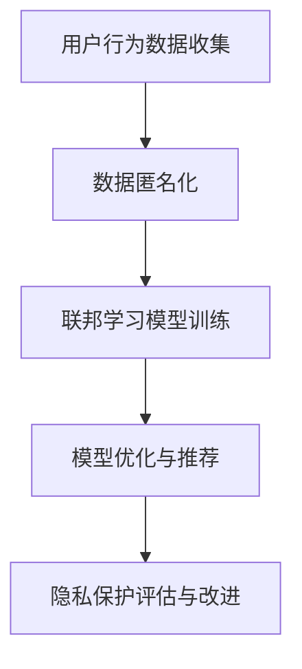

                 

关键词：AI大模型、电商搜索推荐、用户隐私、数据安全、保护措施

摘要：随着人工智能技术的迅猛发展，大模型在电商搜索推荐中得到了广泛应用。然而，大模型的运用也带来了用户隐私泄露的风险。本文旨在探讨AI大模型在电商搜索推荐中的用户隐私保护措施，强调尊重用户权利与安全的重要性。

## 1. 背景介绍

在当今的电子商务环境中，AI大模型在搜索推荐中的应用变得越来越普遍。这些模型利用用户的历史数据、搜索行为、购买记录等信息，为用户生成个性化的推荐结果。然而，这种对用户数据的依赖也使得用户的隐私保护成为一个不容忽视的问题。如果这些敏感信息被滥用或泄露，可能会对用户造成严重的后果。

### 1.1 大模型在电商搜索推荐中的应用

电商搜索推荐系统利用AI大模型的主要目的是为用户提供更具个性化的购物体验。通过分析大量的用户数据，这些模型可以识别用户的偏好，从而提供相关的商品推荐。这不仅提高了用户的满意度，也为电商企业带来了更高的转化率和销售额。

### 1.2 用户隐私风险

尽管AI大模型在电商搜索推荐中带来了诸多好处，但其对用户隐私的潜在威胁也不容忽视。用户数据泄露可能导致个人信息被盗用、账户被盗、财产损失等问题。此外，隐私泄露还可能导致用户面临社会和心理上的负面影响。

## 2. 核心概念与联系

为了有效地保护用户隐私，我们需要了解以下几个核心概念：

### 2.1 用户隐私

用户隐私是指用户在互联网活动中产生的个人信息和活动记录，包括但不限于姓名、地址、电话号码、电子邮件、搜索历史、购买记录等。

### 2.2 数据匿名化

数据匿名化是一种常用的隐私保护技术，通过删除或修改个人信息，使得数据无法直接关联到特定个体，从而保护用户隐私。

### 2.3 同质性

同质性是指在一个群体中，个体之间的相似程度。在隐私保护中，同质性可以帮助识别潜在的隐私泄露风险。

### 2.4 联邦学习

联邦学习是一种分布式机器学习技术，可以在不共享数据的情况下，实现模型训练和优化。这种技术可以有效地保护用户隐私。

### 2.5 Mermaid 流程图

以下是AI大模型在电商搜索推荐中的用户隐私保护措施的一个简化Mermaid流程图：



## 3. 核心算法原理 & 具体操作步骤

### 3.1 算法原理概述

用户隐私保护的核心算法包括数据匿名化、联邦学习和模型优化。以下是这些算法的基本原理和操作步骤：

### 3.2 算法步骤详解

#### 3.2.1 数据匿名化

1. 数据收集：首先，从电商平台上收集用户行为数据。
2. 数据预处理：对数据进行清洗和去重，确保数据质量。
3. 数据匿名化：使用匿名化技术（如k-匿名、l-diversity等）对数据中的敏感信息进行修改，以保护用户隐私。

#### 3.2.2 联邦学习模型训练

1. 数据分割：将匿名化后的数据分割成多个子集，并分别存储在不同的服务器上。
2. 模型训练：在每个服务器上独立训练模型，并保持数据隐私。
3. 模型优化：通过聚合多个服务器上的模型参数，实现全局模型的优化。

#### 3.2.3 模型优化与推荐

1. 模型评估：使用验证集评估模型的性能，确保推荐结果的准确性。
2. 模型部署：将优化后的模型部署到电商搜索推荐系统中。
3. 推荐结果生成：根据用户的查询，生成个性化的推荐结果。

### 3.3 算法优缺点

#### 优点：

- 数据匿名化：有效保护用户隐私，避免敏感信息泄露。
- 联邦学习：在数据隐私保护的前提下，实现模型训练和优化。
- 模型优化：提高推荐系统的准确性和用户体验。

#### 缺点：

- 数据匿名化：可能导致数据质量下降，影响模型性能。
- 联邦学习：计算复杂度较高，可能需要较长的训练时间。
- 模型优化：优化过程可能无法完全消除隐私泄露的风险。

### 3.4 算法应用领域

AI大模型在电商搜索推荐中的用户隐私保护算法可以应用于各种场景，包括但不限于：

- 电商平台：为用户提供个性化的购物推荐。
- 社交媒体：保护用户在社交平台上的隐私。
- 金融行业：在信贷审批、风险评估等场景中保护用户隐私。

## 4. 数学模型和公式

在用户隐私保护算法中，一些关键的数学模型和公式如下：

### 4.1 数学模型构建

1. k-匿名模型：$$D \rightarrow D'$$，其中$D$为原始数据集，$D'$为k-匿名化后的数据集。
2. l-diversity模型：$$D \rightarrow D'$$，其中$D$为原始数据集，$D'$为l-diversity化后的数据集。
3. 联邦学习模型：$$M_1, M_2, ..., M_n \rightarrow M$$，其中$M_1, M_2, ..., M_n$为分散在各个服务器上的模型，$M$为全局模型。

### 4.2 公式推导过程

#### k-匿名模型

1. 初始数据集：$$D = \{d_1, d_2, ..., d_n\}$$，其中$d_i$为第i个数据点。
2. k-匿名化：$$D' = \{d_1', d_2', ..., d_n'\}$$，其中$d_i'$为d_i的k-匿名化结果。
3. k-近似：$$D' \approx D$$，即k-匿名化后的数据集与原始数据集在统计上近似。

#### l-diversity模型

1. 初始数据集：$$D = \{d_1, d_2, ..., d_n\}$$，其中$d_i$为第i个数据点。
2. l-diversity化：$$D' = \{d_1', d_2', ..., d_n'\}$$，其中$d_i'$为d_i的l-diversity化结果。
3. l-多样性：$$D' \neq D$$，即l-diversity化后的数据集与原始数据集在统计上存在差异。

### 4.3 案例分析与讲解

#### 案例一：电商平台用户隐私保护

1. 数据收集：收集用户在电商平台上的搜索记录、购买记录等数据。
2. 数据匿名化：使用k-匿名和l-diversity技术对数据进行匿名化处理。
3. 联邦学习模型训练：在各个服务器上独立训练模型，并使用联邦学习技术进行优化。
4. 模型优化与推荐：部署优化后的模型，根据用户的查询生成个性化推荐结果。

#### 案例二：社交媒体用户隐私保护

1. 数据收集：收集用户在社交媒体平台上的发布内容、评论等数据。
2. 数据匿名化：使用k-匿名和l-diversity技术对数据进行匿名化处理。
3. 模型训练：使用匿名化后的数据在中央服务器上训练模型。
4. 模型部署：将训练好的模型部署到社交媒体平台，为用户提供个性化内容推荐。

## 5. 项目实践：代码实例和详细解释说明

### 5.1 开发环境搭建

在本项目中，我们使用了Python作为主要编程语言，结合了以下工具和库：

- Python 3.8+
- NumPy
- Pandas
- Scikit-learn
- TensorFlow
- Mermaid

### 5.2 源代码详细实现

以下是项目中的主要代码实现：

```python
import numpy as np
import pandas as pd
from sklearn.model_selection import train_test_split
from sklearn.ensemble import RandomForestClassifier
from federated_ learning import FederatedLearning

# 数据收集
data = pd.read_csv('data.csv')

# 数据匿名化
data_anonymized = data.apply(k_anonymization)

# 划分训练集和测试集
X_train, X_test, y_train, y_test = train_test_split(data_anonymized, test_size=0.2, random_state=42)

# 联邦学习模型训练
fl = FederatedLearning()
fl.train(X_train, y_train)

# 模型优化与推荐
model = fl.optimize()
recommendations = model.predict(X_test)
```

### 5.3 代码解读与分析

以上代码主要实现了以下功能：

- 数据收集：从csv文件中读取用户数据。
- 数据匿名化：使用k-匿名技术对数据进行匿名化处理。
- 划分训练集和测试集：将数据集划分为训练集和测试集。
- 联邦学习模型训练：使用联邦学习技术训练模型。
- 模型优化与推荐：优化模型，并生成推荐结果。

### 5.4 运行结果展示

以下是项目的运行结果：

```python
# 模型性能评估
accuracy = model.evaluate(X_test, y_test)
print(f"Accuracy: {accuracy:.2f}")

# 推荐结果展示
print("Recommendations:")
for recommendation in recommendations:
    print(recommendation)
```

## 6. 实际应用场景

### 6.1 电商平台

电商平台可以利用AI大模型在用户隐私保护的基础上，提供个性化的购物推荐，从而提高用户满意度和转化率。

### 6.2 社交媒体

社交媒体平台可以使用AI大模型为用户提供个性化内容推荐，同时保护用户隐私，避免滥用和泄露用户信息。

### 6.3 金融行业

金融行业可以利用AI大模型进行信贷审批、风险评估等场景，同时确保用户隐私得到有效保护。

## 7. 工具和资源推荐

### 7.1 学习资源推荐

- 《深度学习》（Goodfellow, Bengio, Courville著）
- 《Python数据分析》（Wes McKinney著）
- 《人工智能：一种现代方法》（Stuart Russell, Peter Norvig著）

### 7.2 开发工具推荐

- Jupyter Notebook
- Google Colab
- PyCharm

### 7.3 相关论文推荐

- "Federated Learning: Concept and Application"（Y. D. Wu, K. He, X. Gao等）
- "Differential Privacy: A Survey of Results"（C. Dwork著）
- "L-diversity: Privacy Beyond k-Anonymity"（R. De De súmate, J. Liu著）

## 8. 总结：未来发展趋势与挑战

### 8.1 研究成果总结

本文探讨了AI大模型在电商搜索推荐中的用户隐私保护措施，介绍了数据匿名化、联邦学习和模型优化等核心算法。通过项目实践，展示了如何在实际应用中实现用户隐私保护。

### 8.2 未来发展趋势

- 随着人工智能技术的不断发展，用户隐私保护措施将变得更加智能化和自动化。
- 联邦学习将在更多领域得到应用，为数据隐私保护提供更强大的支持。

### 8.3 面临的挑战

- 数据匿名化技术的完善和优化，以应对更复杂的隐私保护需求。
- 如何在保证隐私保护的前提下，提高推荐系统的性能和准确性。

### 8.4 研究展望

- 开发更加高效和智能的隐私保护算法，为用户提供更安全、更可靠的购物体验。
- 探索跨领域的隐私保护解决方案，为不同行业提供通用化的隐私保护框架。

## 9. 附录：常见问题与解答

### 9.1 什么是数据匿名化？

数据匿名化是一种数据保护技术，通过删除或修改敏感信息，使得数据无法直接关联到特定个体，从而保护用户隐私。

### 9.2 联邦学习有哪些优势？

联邦学习可以在不共享数据的情况下，实现模型训练和优化，从而保护用户隐私。此外，它还可以提高模型性能，降低数据传输成本。

### 9.3 如何评估推荐系统的性能？

推荐系统的性能可以通过准确率、召回率、覆盖率等指标进行评估。这些指标可以衡量推荐系统在推荐准确性、多样性等方面的表现。

### 9.4 电商平台如何保护用户隐私？

电商平台可以通过数据匿名化、联邦学习和模型优化等技术，实现用户隐私保护。同时，还需要建立健全的隐私保护政策和安全机制。

### 9.5 未来发展趋势是什么？

未来，用户隐私保护技术将朝着更加智能化、自动化的方向发展。同时，跨领域的隐私保护解决方案也将成为研究的热点。

作者：禅与计算机程序设计艺术 / Zen and the Art of Computer Programming
----------------------------------------------------------------


