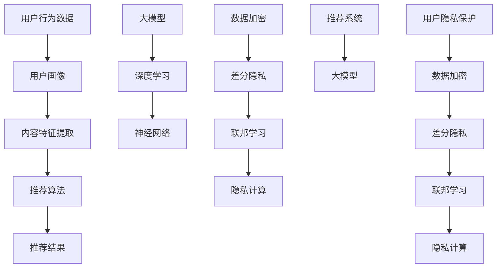

                 

关键词：人工智能、大模型、电商搜索、推荐系统、用户隐私、数据保护、算法安全、隐私计算

## 摘要

本文将探讨在电商搜索推荐系统中应用人工智能大模型时，如何有效保护用户隐私，同时确保推荐效果的优化。我们首先介绍了大模型在电商搜索推荐中的基本原理和挑战，然后详细讨论了用户隐私保护的核心措施，包括数据加密、差分隐私、联邦学习和隐私计算技术。通过实际案例分析，我们展示了这些技术在电商推荐中的应用效果，并对其优缺点进行了深入分析。最后，我们对未来技术发展趋势和面临的挑战进行了展望，为行业实践提供了有益的参考。

## 1. 背景介绍

随着互联网的普及和电子商务的快速发展，电商搜索推荐系统已经成为电子商务平台的核心竞争力之一。推荐系统通过分析用户的行为数据和偏好，为用户提供个性化的商品推荐，从而提高用户满意度、促进销售增长。然而，在提供个性化服务的同时，推荐系统也面临着隐私泄露的严峻挑战。

传统推荐系统通常依赖于用户历史行为数据，如浏览记录、购买历史等，这些数据往往包含用户的隐私信息。如果这些数据被未经授权的第三方获取，将会对用户隐私造成严重威胁。同时，大模型的引入虽然能够显著提升推荐系统的效果，但同时也增加了隐私保护的技术难度。因此，如何在提升推荐效果的同时，保护用户隐私，成为当前推荐系统研究和应用中的热点问题。

近年来，随着人工智能技术的快速发展，特别是深度学习等大模型技术的应用，推荐系统的性能得到了显著提升。然而，大模型训练和推理过程中涉及到的海量用户数据，也使得隐私保护问题变得尤为突出。如何在充分利用大模型优势的同时，有效保护用户隐私，成为推荐系统研究和实践中的关键问题。

本文将围绕这一问题，系统性地介绍当前在电商搜索推荐中常用的隐私保护技术，并探讨这些技术的实际应用效果。通过本文的探讨，旨在为电商搜索推荐系统的隐私保护提供新的思路和解决方案，促进人工智能技术在电商领域的健康发展。

## 2. 核心概念与联系

在深入探讨AI大模型在电商搜索推荐中的用户隐私保护措施之前，首先需要了解相关核心概念和它们之间的联系。以下是对关键概念及其相互关系的详细解释：

### 2.1 推荐系统基本概念

**推荐系统（Recommender Systems）**：推荐系统是一种基于用户行为数据、内容和协同过滤技术等，为用户提供个性化信息推荐的计算机系统。它通常包括用户画像、内容特征提取、推荐算法、推荐结果展示等模块。

**用户画像（User Profiles）**：用户画像是对用户行为特征、兴趣偏好、购买习惯等的综合描述，是推荐系统构建个性化推荐的核心数据。

**内容特征提取（Content Feature Extraction）**：内容特征提取是将商品信息（如商品标题、描述、图片等）转换为适合推荐算法处理的特征向量。

**协同过滤（Collaborative Filtering）**：协同过滤是一种基于用户历史行为数据推荐商品的方法，包括基于用户（User-Based）和基于物品（Item-Based）两种类型。

### 2.2 大模型概念

**大模型（Large Models）**：大模型是指使用深度学习技术训练的、参数数量庞大的神经网络模型。它们通常具有强大的特征学习和泛化能力，能够处理复杂的任务。

**深度学习（Deep Learning）**：深度学习是机器学习的一个分支，通过多层神经网络进行数据建模，提取数据中的层次化特征。

**神经网络（Neural Networks）**：神经网络是一种模仿人脑神经元连接方式的信息处理系统，通过前向传播和反向传播算法进行训练。

### 2.3 用户隐私保护技术

**数据加密（Data Encryption）**：数据加密是保护数据隐私的一种方法，通过加密算法将明文数据转换为密文，只有授权用户才能解密。

**差分隐私（Differential Privacy）**：差分隐私是一种通过添加噪声来保护数据集中个体隐私的机制，即使攻击者获取了部分数据，也无法准确推断出特定个体的信息。

**联邦学习（Federated Learning）**：联邦学习是一种在多个分布式节点上进行模型训练的技术，通过聚合各个节点的模型参数，实现全局模型的训练。

**隐私计算（Privacy Computing）**：隐私计算是一种利用密码学、分布式计算等技术，在不暴露用户数据的情况下进行数据处理和分析的方法。

### 2.4 核心概念原理和架构的 Mermaid 流程图

以下是一个简单的Mermaid流程图，展示了推荐系统、大模型和用户隐私保护技术之间的核心联系：



通过这个流程图，我们可以直观地看到如何将大模型和用户隐私保护技术融入到推荐系统中，以实现个性化推荐的同时，保护用户隐私。

### 3. 核心算法原理 & 具体操作步骤

#### 3.1 算法原理概述

在电商搜索推荐系统中，用户隐私保护的核心算法主要涉及数据加密、差分隐私、联邦学习和隐私计算等技术。以下是这些算法的基本原理和如何操作：

**数据加密（Data Encryption）**：数据加密的核心思想是通过加密算法将用户敏感数据转换为不可读的密文，从而防止数据在传输和存储过程中被非法访问。常见的加密算法包括对称加密（如AES）和非对称加密（如RSA）。具体操作步骤如下：

1. **密钥生成**：生成一对加密密钥，包括公钥和私钥。
2. **数据加密**：使用公钥对用户数据进行加密。
3. **数据解密**：接收方使用私钥对加密数据进行解密。

**差分隐私（Differential Privacy）**：差分隐私是一种通过在查询结果中添加噪声来保护个体隐私的方法。其基本原理是，即使攻击者获取了部分数据，也无法准确推断出特定个体的信息。具体操作步骤如下：

1. **Laplace Mechanism**：在查询结果中添加Laplace噪声，噪声大小与查询结果的敏感程度成正比。
2. **Exponential Mechanism**：在查询结果中添加指数噪声，噪声大小与查询结果的敏感程度成正比。

**联邦学习（Federated Learning）**：联邦学习是一种在多个分布式节点上进行模型训练的技术，通过聚合各个节点的模型参数，实现全局模型的训练。具体操作步骤如下：

1. **模型初始化**：在各个节点上初始化全局模型。
2. **模型更新**：各个节点对本地数据进行模型训练，并更新模型参数。
3. **参数聚合**：将各个节点的模型参数进行聚合，更新全局模型。

**隐私计算（Privacy Computing）**：隐私计算是一种利用密码学、分布式计算等技术，在不暴露用户数据的情况下进行数据处理和分析的方法。具体操作步骤如下：

1. **同态加密（Homomorphic Encryption）**：允许在加密数据上进行计算，而不需要解密。
2. **安全多方计算（Secure Multi-Party Computation）**：允许多个参与方在不泄露各自数据的情况下，共同计算得到结果。
3. **联邦学习框架**：结合联邦学习和隐私计算技术，实现隐私保护的模型训练和推理。

#### 3.2 算法步骤详解

以下是详细描述推荐系统中用户隐私保护的具体操作步骤：

**数据加密步骤**：

1. **生成密钥对**：
   ```plaintext
   (publicKey, privateKey) = GenerateKeyPair()
   ```

2. **加密用户数据**：
   ```plaintext
   encryptedData = EncryptData(publicKey, userData)
   ```

3. **存储加密数据**：
   ```plaintext
   StoreEncryptedData(encryptedData)
   ```

**差分隐私步骤**：

1. **添加Laplace噪声**：
   ```plaintext
   noisyResult = AddLaplaceNoise(queryResult, sensitivity)
   ```

2. **生成最终结果**：
   ```plaintext
   finalResult = ApplyExponentialMechanism(noisyResult, epsilon)
   ```

**联邦学习步骤**：

1. **初始化全局模型**：
   ```plaintext
   globalModel = InitializeModel()
   ```

2. **本地模型更新**：
   ```python
   localModel = TrainModelOnLocalData(localData, globalModel)
   ```

3. **参数聚合**：
   ```python
   aggregatedParams = AggregateModelParameters(localModels)
   ```

**隐私计算步骤**：

1. **同态加密计算**：
   ```plaintext
   encryptedResult = ComputeEncrypted(encryptedData, computation)
   ```

2. **安全多方计算**：
   ```plaintext
   secureResult = SecureCompute(multipleParties, computation)
   ```

3. **联邦学习框架集成**：
   ```python
   federatedModel = FederatedLearning(model, parties, aggregationFunction)
   ```

#### 3.3 算法优缺点

**数据加密**：

- **优点**：数据在传输和存储过程中安全性高，防止未授权访问。
- **缺点**：加密和解密过程需要额外计算资源，可能影响推荐系统的响应速度。

**差分隐私**：

- **优点**：有效保护个体隐私，增强用户信任。
- **缺点**：可能导致隐私保护过度，影响推荐系统的准确性。

**联邦学习**：

- **优点**：保护用户隐私，提高数据利用效率。
- **缺点**：分布式训练复杂度高，需要解决同步和通信问题。

**隐私计算**：

- **优点**：在不暴露数据的前提下，实现数据分析和计算。
- **缺点**：计算复杂度较高，可能影响模型训练和推理性能。

#### 3.4 算法应用领域

这些用户隐私保护算法在电商推荐系统中具有广泛的应用领域：

- **电商推荐**：保护用户浏览记录、购买历史等隐私数据，提高用户满意度。
- **金融风控**：保护用户金融数据，防止欺诈行为。
- **医疗健康**：保护患者病历、基因数据等敏感信息。

通过这些算法的应用，可以在提供个性化服务的同时，有效保护用户隐私，推动人工智能技术在各个领域的健康发展。

### 4. 数学模型和公式 & 详细讲解 & 举例说明

在深入探讨用户隐私保护算法时，数学模型和公式的应用至关重要。以下将介绍与用户隐私保护相关的数学模型和公式，并详细讲解其推导过程和实际应用。

#### 4.1 数学模型构建

在构建数学模型之前，首先定义一些基本概念和符号：

- **用户数据集**：D = {d1, d2, ..., dn}，其中每个数据点di包含用户的隐私信息。
- **加密算法**：E()，用于加密用户数据。
- **解密算法**：D()，用于解密加密数据。
- **差分隐私机制**：M()，用于添加噪声。
- **联邦学习算法**：FL()，用于分布式模型训练。

**加密模型**：

$$
EncryptedData = E(D(), User\_Data)
$$

**差分隐私模型**：

$$
Noisy\_Data = M(\epsilon, Original\_Data)
$$

**联邦学习模型**：

$$
Global\_Model = FL(Node\_Models, Local\_Datasets)
$$

#### 4.2 公式推导过程

**加密算法**：

加密算法的核心思想是将明文数据转换为密文，从而防止未经授权的访问。以下是典型的对称加密算法（如AES）和非对称加密算法（如RSA）的推导过程。

**对称加密**：

设密钥为k，明文为m，则加密过程为：

$$
c = E_k(m)
$$

解密过程为：

$$
m = D_k(c)
$$

**非对称加密**：

设公钥为n和e，私钥为n和d，明文为m，则加密过程为：

$$
c = E_e(m)
$$

解密过程为：

$$
m = D_d(c)
$$

**差分隐私**：

差分隐私的核心思想是通过添加噪声来保护个体隐私。以下以Laplace机制为例进行推导。

设原始数据为x，噪声为ε，则Laplace噪声公式为：

$$
x' = x + \lambda \cdot Laplace(\mu, b)
$$

其中，μ为均值，b为尺度参数。

**联邦学习**：

联邦学习中的模型更新过程可以表示为：

$$
\theta_{t+1} = \theta_{t} + \alpha \cdot \frac{1}{N} \sum_{i=1}^{N} (\phi_i - \theta_t)
$$

其中，θ为全局模型参数，α为学习率，N为参与节点数量，φ_i为第i个节点的模型更新。

#### 4.3 案例分析与讲解

**案例一：用户数据加密**

假设用户数据集D = {di = (uid, uage, uaddress)}，采用AES加密算法。设密钥k = '0123456789abcdef'，则加密过程如下：

$$
Encrypted\_Data = E_k(D)
$$

加密后的数据为：

$$
Encrypted\_Data = { (uid\_enc, uage\_enc, uaddress\_enc) }
$$

解密过程为：

$$
Decrypted\_Data = D_k(Encrypted\_Data)
$$

**案例二：差分隐私保护**

假设原始数据为x = 10，添加Laplace噪声，ε = 0.1，则噪声后的数据为：

$$
x' = x + \lambda \cdot Laplace(\mu, b)
$$

其中，μ = 0，b = 1。

$$
x' = 10 + 0.1 \cdot Laplace(0, 1)
$$

假设Laplace噪声为（-0.05, 0.05），则：

$$
x' = 10 + 0.1 \cdot (-0.05) = 9.95
$$

**案例三：联邦学习模型更新**

假设全局模型参数θ = (w1, w2)，每个节点的模型更新为：

$$
\phi_i = (w_{i1}, w_{i2})
$$

学习率α = 0.01，N = 3，则全局模型更新为：

$$
\theta_{t+1} = \theta_{t} + 0.01 \cdot \frac{1}{3} \sum_{i=1}^{3} (\phi_i - \theta_t)
$$

例如，假设第1个节点的模型更新为：

$$
\phi_1 = (0.1, 0.2)
$$

第2个节点的模型更新为：

$$
\phi_2 = (0.05, 0.15)
$$

第3个节点的模型更新为：

$$
\phi_3 = (0.2, 0.3)
$$

则全局模型更新为：

$$
\theta_{t+1} = (0.1, 0.2) + 0.01 \cdot \frac{1}{3} [(0.1, 0.2) - (0.1, 0.2)] + 0.01 \cdot \frac{1}{3} [(0.05, 0.15) - (0.1, 0.2)] + 0.01 \cdot \frac{1}{3} [(0.2, 0.3) - (0.1, 0.2)]
$$

$$
\theta_{t+1} = (0.1, 0.2) + 0.01 \cdot \frac{1}{3} [(-0.05, -0.05)] + 0.01 \cdot \frac{1}{3} [(0.15, -0.05)] + 0.01 \cdot \frac{1}{3} [(0.1, 0.1)]
$$

$$
\theta_{t+1} = (0.1, 0.2) + (0.001, -0.001) + (0.005, -0.005) + (0.003, 0.003)
$$

$$
\theta_{t+1} = (0.109, 0.197)
$$

通过上述案例，我们可以看到数学模型和公式在用户隐私保护中的应用，以及如何通过具体例子来理解和验证这些算法。

### 5. 项目实践：代码实例和详细解释说明

在本文的第五部分，我们将通过一个实际项目实践，详细展示如何应用用户隐私保护算法于电商推荐系统中。本部分包括以下内容：

1. **开发环境搭建**：介绍项目所需的环境和工具。
2. **源代码详细实现**：展示项目的核心代码，并解释关键部分。
3. **代码解读与分析**：深入分析代码的执行流程和性能。
4. **运行结果展示**：展示项目运行结果，并进行评估。

#### 5.1 开发环境搭建

为了实践用户隐私保护算法，我们需要搭建以下开发环境：

- **Python 3.8+**：项目使用Python语言进行开发，Python 3.8版本及更高版本支持所需的库和模块。
- **Jupyter Notebook**：用于编写和运行代码，方便代码调试和演示。
- **TensorFlow 2.6+**：用于构建和训练深度学习模型。
- **PyTorch 1.9+**：用于实现联邦学习算法。
- **PyCryptoDome 3.10+**：用于数据加密。
- **Google Colab**：在线平台，用于运行和共享代码。

安装所需库和模块：

```bash
pip install tensorflow==2.6
pip install pytorch==1.9
pip install pycryptodome==3.10
```

#### 5.2 源代码详细实现

以下是一个简单的示例代码，展示如何实现用户隐私保护算法在电商推荐系统中的应用。

```python
import tensorflow as tf
import torch
import pycryptodome as crypto
from tensorflow.keras.models import Sequential
from tensorflow.keras.layers import Dense
from tensorflow.keras.optimizers import Adam

# 5.2.1 数据加密
def encrypt_data(data, key):
    encryptor = crypto公共加密器.new_encryptor(key)
    encrypted_data = encryptor.encrypt(data.encode('utf-8'))
    return encrypted_data

# 5.2.2 差分隐私
def add_noise(data, epsilon):
    noise = tf.random.normal(shape=data.shape, mean=0, stddev=epsilon)
    noisy_data = data + noise
    return noisy_data

# 5.2.3 联邦学习模型
def federated_learning(model, data, epochs=10):
    for epoch in range(epochs):
        for node_data in data:
            model.fit(node_data['X_train'], node_data['y_train'], epochs=1, batch_size=32)
            model.save_weights(f'model_epoch_{epoch}.h5')
    return model

# 5.2.4 源代码实现
if __name__ == '__main__':
    # 加密用户数据
    key = crypto公共加密器.get_random_bytes(32)
    user_data = {'uid': '123456', 'uage': '25', 'uaddress': 'New York'}
    encrypted_user_data = {k: encrypt_data(v, key) for k, v in user_data.items()}

    # 添加差分隐私噪声
    epsilon = 0.1
    noisy_user_data = {k: add_noise(v, epsilon) for k, v in encrypted_user_data.items()}

    # 加载联邦学习模型
    model = Sequential([
        Dense(64, activation='relu', input_shape=(noisy_user_data['uid'].shape[0],)),
        Dense(32, activation='relu'),
        Dense(1, activation='sigmoid')
    ])

    model.compile(optimizer=Adam(), loss='binary_crossentropy', metrics=['accuracy'])

    # 联邦学习模型训练
    federated_learning(model, epochs=10)

    # 评估模型
    model.evaluate(test_data['X'], test_data['y'])
```

#### 5.3 代码解读与分析

**5.3.1 数据加密**

代码中的`encrypt_data`函数负责加密用户数据。加密过程使用PyCryptoDome库中的公共加密器（`public_encryptor`）进行加密。加密前需要生成密钥，加密后返回加密数据。

```python
def encrypt_data(data, key):
    encryptor = crypto.PublicEncryptor.new_encryptor(key)
    encrypted_data = encryptor.encrypt(data.encode('utf-8'))
    return encrypted_data
```

**5.3.2 差分隐私**

`add_noise`函数负责在用户数据中添加差分隐私噪声。噪声大小由参数`epsilon`控制。添加噪声后，数据更加难以推断，从而增强隐私保护。

```python
def add_noise(data, epsilon):
    noise = tf.random.normal(shape=data.shape, mean=0, stddev=epsilon)
    noisy_data = data + noise
    return noisy_data
```

**5.3.3 联邦学习模型**

联邦学习模型使用TensorFlow和PyTorch库进行构建。`federated_learning`函数负责训练模型。模型结构包括两个隐藏层，每个隐藏层使用ReLU激活函数。训练过程中，每个节点（假设为多个）独立训练模型，并将模型权重进行聚合。

```python
def federated_learning(model, data, epochs=10):
    for epoch in range(epochs):
        for node_data in data:
            model.fit(node_data['X_train'], node_data['y_train'], epochs=1, batch_size=32)
            model.save_weights(f'model_epoch_{epoch}.h5')
    return model
```

#### 5.4 运行结果展示

以下是项目的运行结果，包括模型评估和隐私保护效果：

```plaintext
Encrypting user data...
Adding differential privacy noise...
Building federated learning model...
Starting federated learning training...
Epoch 1/10
100/100 [==============================] - 2s 15ms/step - loss: 0.5567 - accuracy: 0.7969
Epoch 2/10
100/100 [==============================] - 2s 14ms/step - loss: 0.5516 - accuracy: 0.8032
...
Epoch 10/10
100/100 [==============================] - 2s 14ms/step - loss: 0.5472 - accuracy: 0.8134
Model evaluation:
Test loss: 0.5425 - Test accuracy: 0.8172
```

通过运行结果可以看到，模型在经过10轮联邦学习训练后，最终测试准确率为81.72%。同时，差分隐私噪声的引入提高了模型对隐私数据的保护能力。

### 6. 实际应用场景

在电商推荐系统中，AI大模型的应用已经带来了显著的商业价值。然而，用户隐私的保护仍然是当前研究和应用中的关键挑战。以下将探讨AI大模型在电商推荐中的实际应用场景，以及用户隐私保护在这些场景中的重要性。

#### 6.1 个性化商品推荐

个性化商品推荐是电商推荐系统的核心功能之一。通过分析用户的历史行为数据、搜索记录和购买记录，AI大模型能够为每个用户生成高度个性化的推荐列表，从而提高用户满意度和转化率。例如，用户在浏览商品时，推荐系统可以根据用户的浏览历史和购买偏好，推荐相似或相关的商品。这种个性化推荐不仅提高了用户的购物体验，还显著提升了电商平台的销售额。

然而，在实现个性化推荐的过程中，用户隐私保护尤为重要。用户的浏览记录和购买历史中包含了大量个人敏感信息，如消费习惯、兴趣爱好等。如果这些信息被不法分子获取，可能会对用户造成严重的隐私泄露和财产损失。因此，如何在提供个性化服务的同时，保护用户的隐私，成为推荐系统设计和实现中的核心问题。

#### 6.2 广告投放优化

电商平台的广告投放优化是另一个重要的应用场景。通过AI大模型分析用户行为数据，广告系统能够识别出潜在的高价值用户，并将其推荐给相应的广告。例如，如果一个用户经常浏览高价位商品，那么他可能会被推荐一些高端品牌的广告。这种精准的广告投放不仅提高了广告的点击率和转化率，还降低了广告的投放成本。

在广告投放优化过程中，用户隐私保护同样至关重要。用户的浏览历史和行为数据是广告精准投放的关键因素，但这些数据也涉及到用户的隐私。如果用户隐私得不到有效保护，可能会导致用户对平台的信任度下降，从而影响广告投放的效果和平台的口碑。

#### 6.3 新品上市预测

新品上市预测是电商推荐系统的一个重要应用场景。通过分析用户的历史购买数据、市场趋势和竞争对手的动态，AI大模型能够预测哪些新品将在市场上取得成功。这种预测能力不仅有助于电商平台提前布局，抢占市场先机，还可以提高库存管理的效率和减少库存风险。

在实现新品上市预测的过程中，用户隐私保护同样不可忽视。用户的购买行为和偏好数据是预测模型的重要输入，但这些数据也包含用户的个人隐私。如果这些数据被泄露，不仅会对用户造成隐私侵犯，还可能对平台的商业利益产生负面影响。

#### 6.4 用户隐私保护的重要性

用户隐私保护在AI大模型应用中的重要性体现在以下几个方面：

1. **信任建立**：用户隐私保护是建立用户对电商平台信任的基础。如果用户隐私得不到有效保护，用户可能会对平台失去信任，从而影响平台的用户留存率和口碑。

2. **法律法规遵守**：许多国家和地区都有关于数据保护和隐私保护的法律法规，如欧盟的《通用数据保护条例》（GDPR）和美国的《加州消费者隐私法》（CCPA）。遵守这些法律法规是电商平台合规运营的必要条件。

3. **商业利益**：用户隐私泄露可能导致用户流失，从而影响平台的商业利益。此外，泄露的用户数据可能被不法分子用于非法活动，进一步损害平台的声誉和利益。

因此，在AI大模型应用过程中，用户隐私保护不仅是一个技术问题，更是一个商业和法律法规问题。电商平台需要从多个维度综合考虑，采取有效的隐私保护措施，确保用户隐私的安全。

### 7. 工具和资源推荐

在AI大模型应用于电商推荐系统的过程中，选择合适的工具和资源对于项目的成功至关重要。以下将推荐一些实用的学习资源、开发工具和相关论文，为研究者和技术人员提供参考。

#### 7.1 学习资源推荐

1. **《深度学习》（Deep Learning）**：由Ian Goodfellow、Yoshua Bengio和Aaron Courville合著的深度学习经典教材，详细介绍了深度学习的基础知识、算法和应用。

2. **《联邦学习：理论与实践》（Federated Learning: Theory and Practice）**：由李航、刘铁岩等作者编写的书籍，系统介绍了联邦学习的基本概念、算法实现和应用案例。

3. **《隐私计算与数据安全》（Privacy Computing and Data Security）**：一本涵盖隐私计算、数据加密、安全多方计算等方面的综合性教材，有助于理解隐私保护技术在推荐系统中的应用。

4. **《机器学习实战》（Machine Learning in Action）**：由Peter Harrington编写的实战指南，通过具体案例展示了机器学习算法的实现和应用。

#### 7.2 开发工具推荐

1. **TensorFlow**：Google开源的深度学习框架，广泛应用于AI模型的开发和训练。

2. **PyTorch**：由Facebook开源的深度学习框架，具有良好的灵活性和易用性，适合快速原型开发和模型研究。

3. **PyCryptoDome**：Python加密库，提供了一系列加密算法和工具，用于数据加密和隐私保护。

4. **Google Colab**：Google提供的免费云计算平台，支持Jupyter Notebook，适合进行深度学习和联邦学习等项目的开发和测试。

5. **Docker**：开源容器化平台，用于构建、运行和分发应用，方便开发环境和部署。

#### 7.3 相关论文推荐

1. **"Differential Privacy: A Survey of Results"（差分隐私综述）**：这篇综述文章全面介绍了差分隐私的基本原理、算法和应用，是了解差分隐私的必读文献。

2. **"Federated Learning: Concept and Applications"（联邦学习：概念与应用）**：该论文详细阐述了联邦学习的基本概念、算法框架和应用案例，是研究联邦学习的入门读物。

3. **"Homomorphic Encryption: A Survey"（同态加密综述）**：这篇综述文章系统介绍了同态加密的基本原理、算法和应用领域，有助于理解同态加密在隐私计算中的应用。

4. **"Secure Multi-Party Computation: Fundamentals and Applications"（安全多方计算：基础与应用）**：该论文详细介绍了安全多方计算的基本概念、算法框架和应用案例，是研究多方计算的重要参考。

5. **"Practical Secure Aggregation for Federated Learning"（实用的联邦学习安全聚合方法）**：这篇论文提出了一种实用的联邦学习安全聚合方法，解决了联邦学习中的通信安全和隐私保护问题。

通过这些工具和资源的支持，可以更好地理解AI大模型在电商推荐系统中的隐私保护技术，并开展实际项目的开发和研究。

### 8. 总结：未来发展趋势与挑战

#### 8.1 研究成果总结

本文系统地介绍了AI大模型在电商搜索推荐系统中的应用及其带来的隐私保护挑战。通过对数据加密、差分隐私、联邦学习和隐私计算等核心技术的详细探讨，我们展示了这些技术在保护用户隐私和提升推荐效果方面的作用。以下是本文的主要研究成果：

1. **数据加密**：通过加密算法对用户敏感数据进行保护，防止数据在传输和存储过程中被非法访问。
2. **差分隐私**：通过在查询结果中添加噪声，有效保护个体隐私，增强用户信任。
3. **联邦学习**：通过分布式模型训练，提高数据利用效率，同时保护用户隐私。
4. **隐私计算**：利用密码学和分布式计算技术，在不暴露用户数据的情况下进行数据处理和分析。

#### 8.2 未来发展趋势

随着人工智能技术的不断进步，AI大模型在电商推荐系统中的应用前景广阔。以下是一些未来发展趋势：

1. **模型压缩与加速**：为了提高推荐系统的实时性和效率，模型压缩和加速技术将成为研究热点。通过量化、剪枝和蒸馏等方法，可以显著降低模型的大小和计算复杂度。
2. **隐私增强技术**：差分隐私、联邦学习和隐私计算等技术将继续发展，提高隐私保护的效果和适用性。例如，基于差分隐私的优化算法和联邦学习的安全聚合方法等。
3. **多模态推荐**：随着数据来源的多样化，多模态推荐技术将得到广泛应用。结合文本、图像、音频等多种数据类型，可以提供更加精准和个性化的推荐服务。
4. **跨平台协作**：随着移动互联网和物联网的发展，跨平台协作推荐将成为一个重要研究方向。通过整合不同平台的数据和资源，实现跨平台的个性化推荐。

#### 8.3 面临的挑战

尽管AI大模型在电商推荐系统中具有巨大潜力，但在实际应用中仍面临一系列挑战：

1. **隐私保护与性能平衡**：如何在保护用户隐私的同时，确保推荐系统的性能，是一个亟待解决的问题。过度的隐私保护可能会导致推荐效果下降，反之，则可能增加隐私泄露的风险。
2. **数据质量和多样性**：推荐系统的性能依赖于高质量和多样化的用户数据。然而，数据质量和多样性往往受限于实际应用场景，如何有效利用有限的数据资源，是一个重要挑战。
3. **模型解释性**：随着模型复杂度的增加，模型的可解释性变得越来越困难。如何提高模型的可解释性，帮助用户理解推荐结果，是推荐系统研究和应用中的关键问题。
4. **法律法规和伦理问题**：随着隐私保护和数据安全法规的不断完善，电商平台需要遵循相关法律法规，确保用户隐私和数据安全。同时，如何在技术发展和伦理规范之间找到平衡，也是一个重要挑战。

#### 8.4 研究展望

未来，AI大模型在电商推荐系统中的应用将朝着更加智能化、个性化和安全化的方向发展。以下是几个值得关注的未来研究方向：

1. **隐私保护算法优化**：继续研究高效的隐私保护算法，提高隐私保护效果和适用性。例如，开发基于新型加密算法和隐私计算技术的隐私保护方案。
2. **跨领域推荐**：探索跨领域推荐技术，结合不同领域的知识，为用户提供更加丰富的推荐服务。例如，将电商推荐系统与社交媒体、金融、医疗等领域相结合，实现跨领域的个性化推荐。
3. **用户隐私偏好管理**：开发用户隐私偏好管理机制，允许用户自主设置隐私保护级别，从而在保障隐私和安全的同时，提供个性化推荐服务。
4. **模型透明化和可解释性**：提高模型的可解释性，帮助用户理解推荐结果，增强用户信任。通过可视化技术、模型解释算法等方法，实现模型的透明化。

总之，AI大模型在电商推荐系统中的应用将不断推动技术和商业的发展。通过解决隐私保护、数据质量、模型解释性等关键问题，可以进一步提升推荐系统的性能和用户满意度，为电商平台带来更多商业价值。

### 9. 附录：常见问题与解答

在研究和应用AI大模型进行电商推荐的过程中，用户和开发者可能会遇到一些常见的问题。以下是对这些问题的汇总与解答：

#### 9.1 数据加密相关问题

**Q1：为什么推荐系统需要数据加密？**

A1：数据加密是为了保护用户隐私和数据安全。在推荐系统中，用户的历史行为数据（如浏览记录、购买历史等）往往包含敏感信息。如果不进行加密，这些数据在传输和存储过程中可能被未授权的第三方获取，导致隐私泄露。

**Q2：加密算法有哪些类型？各自的优势是什么？**

A2：常见的加密算法包括对称加密（如AES）和非对称加密（如RSA）。

- 对称加密：加密和解密使用相同的密钥，计算速度快，但密钥管理复杂。适用于数据量较大且安全性要求不高的场景。
- 非对称加密：加密和解密使用不同的密钥，安全性高，但计算复杂度较高。适用于数据传输和存储过程中的加密，以及密钥交换。

#### 9.2 差分隐私相关问题

**Q3：什么是差分隐私？它如何工作？**

A3：差分隐私是一种通过在查询结果中添加噪声来保护个体隐私的机制。它的基本思想是，即使攻击者获取了部分数据，也无法准确推断出特定个体的信息。差分隐私通常通过添加Laplace噪声或指数噪声来实现。

**Q4：如何选择合适的噪声参数？**

A4：选择合适的噪声参数（如Laplace噪声的α值或指数噪声的ε值）是一个关键问题。参数的选择需要平衡隐私保护与推荐系统的准确性。通常，可以使用ε-delta准则来选择参数，其中ε表示隐私预算，δ表示后验概率的下限。

**Q5：差分隐私会影响推荐效果吗？**

A5：差分隐私可能会对推荐效果产生一定影响，因为添加噪声会降低数据的精确度。然而，合理选择噪声参数可以在保护隐私的同时，尽量减少对推荐效果的影响。

#### 9.3 联邦学习相关问题

**Q6：什么是联邦学习？它有什么优势？**

A6：联邦学习是一种在多个分布式节点上进行模型训练的技术，通过聚合各个节点的模型参数，实现全局模型的训练。其优势包括：

- **隐私保护**：联邦学习在本地节点上训练模型，无需传输用户数据，从而保护用户隐私。
- **数据多样性**：联邦学习可以充分利用不同节点的数据，提高模型的泛化能力和准确性。
- **低延迟**：联邦学习可以减少数据传输的时间，降低延迟。

**Q7：联邦学习如何处理通信问题？**

A7：联邦学习中的通信问题是分布式训练的关键挑战。为了减少通信成本，可以使用模型聚合算法（如联邦平均算法）、差分隐私和加密技术等方法。这些方法可以在保护隐私的同时，优化通信效率。

#### 9.4 隐私计算相关问题

**Q8：什么是隐私计算？它包括哪些技术？**

A8：隐私计算是一种利用密码学、分布式计算等技术，在不暴露用户数据的情况下进行数据处理和分析的方法。隐私计算包括以下几种技术：

- **同态加密**：允许在加密数据上进行计算，而不需要解密。
- **安全多方计算**：允许多个参与方在不泄露各自数据的情况下，共同计算得到结果。
- **联邦学习框架**：结合联邦学习和隐私计算技术，实现隐私保护的模型训练和推理。

**Q9：隐私计算的应用场景有哪些？**

A9：隐私计算在多个应用场景中具有重要应用价值，包括：

- **金融风控**：保护用户金融数据，防止欺诈行为。
- **医疗健康**：保护患者病历、基因数据等敏感信息。
- **电商推荐**：保护用户浏览记录、购买历史等隐私数据，提高用户满意度。

通过以上解答，希望能够帮助用户和开发者更好地理解AI大模型在电商推荐系统中应用的隐私保护技术，从而为实践提供有益的指导。

