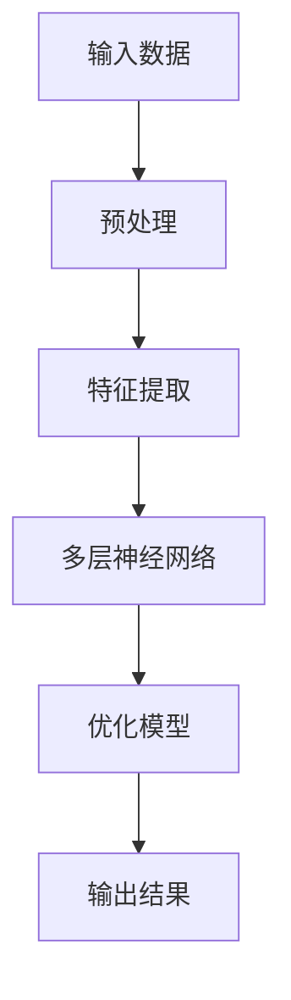
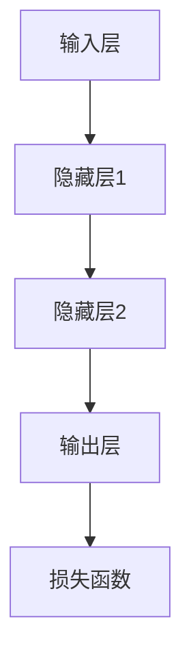
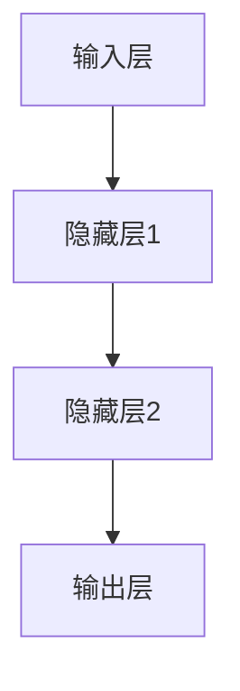
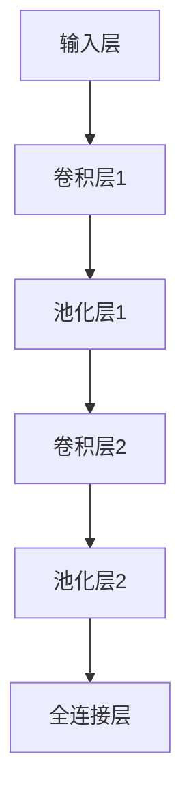

                 

### 1. 背景介绍

随着人工智能技术的快速发展，特别是在深度学习和自然语言处理领域的突破，大模型（Large Models）已经成为当今技术领域的一个重要趋势。大模型具有海量的参数和强大的计算能力，可以在多种任务中实现卓越的性能。这些模型不仅能够在图像识别、语音识别、机器翻译等传统领域大放异彩，还在自然语言生成、智能对话系统、内容审核等方面展现了巨大的潜力。

与此同时，创业产品经理的角色在数字化时代也在不断演变。他们不仅要理解用户需求，还要迅速应对市场变化，优化产品设计，提高用户满意度。在这个高度竞争的市场环境中，产品经理面临着前所未有的挑战。如何有效地利用技术手段来提升产品的竞争力，成为了他们关注的焦点。

本文将探讨大模型如何改变创业产品经理的日常工作，提高他们的工作效率和决策质量。我们将从大模型的基本概念出发，分析其对产品经理角色的影响，并提出具体的实践案例和策略。

## 文章关键词
- AI 大模型
- 创业产品经理
- 工作效率
- 决策质量
- 产品优化
- 深度学习
- 自然语言处理

## 摘要
本文旨在探讨人工智能大模型如何深刻改变创业产品经理的角色和日常工作。通过对大模型技术背景的介绍，我们将分析其在需求分析、市场研究、用户反馈和产品优化等环节的具体应用。文章还将提供实践案例和策略，帮助产品经理利用大模型技术提升产品的竞争力。本文旨在为创业产品经理提供一套实用的工具和方法，以适应快速变化的市场环境。

### 2. 核心概念与联系

#### 2.1 大模型技术概述

大模型（Large Models）是指具有数十亿到数千亿参数的神经网络模型。这些模型通过大量数据和复杂的计算结构来实现高度自动化和智能化的任务处理。大模型的核心特点是参数数量庞大，这使得它们能够捕捉到数据中的细微模式和复杂关系。

大模型技术的核心是深度学习（Deep Learning），这是一种基于人工神经网络的学习方法。深度学习通过多层神经网络（多层感知机）来模拟人类大脑的思考方式，从而能够处理大量数据并从中提取有用的信息。

图 1. 大模型技术的基本架构



#### 2.2 大模型与创业产品经理的角色联系

大模型技术对创业产品经理的日常工作产生了深远的影响。首先，大模型能够帮助产品经理更好地理解用户需求。通过分析用户的反馈和行为数据，大模型可以识别出用户的需求模式，从而指导产品设计的方向。

其次，大模型在市场研究方面也有很大的应用潜力。产品经理可以利用大模型进行市场趋势分析，预测产品未来的发展方向。这种预测能力不仅可以帮助产品经理抓住市场机遇，还可以提前规避潜在的风险。

最后，大模型在产品优化和迭代方面发挥了重要作用。通过持续的学习和优化，大模型能够不断提高产品的用户体验和满意度，从而增强产品的市场竞争力。

### 3. 核心算法原理 & 具体操作步骤

#### 3.1 算法原理概述

大模型的核心算法是基于深度学习的神经网络。神经网络由多个层组成，包括输入层、隐藏层和输出层。每一层都包含多个神经元，神经元之间通过权重连接。在训练过程中，神经网络通过不断调整权重来优化模型的性能。

图 2. 神经网络结构示意图



#### 3.2 算法步骤详解

1. **数据预处理**：在训练大模型之前，需要对数据进行预处理。这包括数据清洗、归一化、编码等操作，以确保数据的质量和一致性。

2. **特征提取**：特征提取是深度学习中的重要步骤。通过提取数据中的特征，可以降低数据的维度，同时保留关键信息。大模型通常使用卷积神经网络（CNN）或循环神经网络（RNN）来进行特征提取。

3. **模型训练**：模型训练是神经网络的核心步骤。通过迭代优化权重，神经网络可以不断调整模型，以最小化损失函数。常用的优化算法包括梯度下降（Gradient Descent）和其变种。

4. **模型评估**：模型训练完成后，需要对模型进行评估。常用的评估指标包括准确率、召回率、F1 分数等。通过评估，可以判断模型的性能是否达到预期。

5. **模型部署**：评估通过后，模型可以部署到产品中，供用户使用。在实际应用中，模型可能会面临数据分布变化等问题，因此需要定期进行重新训练和优化。

#### 3.3 算法优缺点

**优点**：

- **强大的建模能力**：大模型能够处理复杂的任务，具有很高的准确性和泛化能力。
- **自动特征提取**：大模型通过多层神经网络自动提取特征，减少了人工特征工程的工作量。
- **高效的计算能力**：随着硬件技术的发展，大模型的计算效率不断提升，可以应对海量数据的处理。

**缺点**：

- **训练成本高**：大模型需要大量的计算资源和数据，训练成本较高。
- **解释性差**：神经网络模型具有“黑盒”特性，难以解释模型的决策过程。
- **数据隐私和安全问题**：大模型在训练过程中涉及大量用户数据，需要关注数据隐私和安全问题。

#### 3.4 算法应用领域

大模型在多个领域都取得了显著的成果，包括：

- **图像识别和分类**：大模型在图像识别和分类任务中表现出了卓越的性能，被广泛应用于人脸识别、自动驾驶等领域。
- **自然语言处理**：大模型在自然语言处理领域取得了重大突破，包括机器翻译、文本生成、情感分析等任务。
- **推荐系统**：大模型可以用于推荐系统的优化，提高推荐算法的准确性和用户体验。
- **医学诊断**：大模型在医学诊断领域也有广泛应用，例如通过图像识别进行疾病检测和预测。

### 4. 数学模型和公式 & 详细讲解 & 举例说明

#### 4.1 数学模型构建

大模型通常基于深度学习算法，其中最常用的数学模型是多层感知机（MLP）和卷积神经网络（CNN）。下面分别介绍这两种模型的数学公式和构建方法。

#### 4.1.1 多层感知机（MLP）

多层感知机是一种前馈神经网络，包括输入层、隐藏层和输出层。每个神经元都是其他神经元的线性组合，并通过非线性激活函数进行变换。

图 3. 多层感知机结构示意图



数学公式如下：

$$
h_{\theta}(x) = \sigma(\theta^T x + b)
$$

其中，$x$ 是输入向量，$\theta$ 是权重矩阵，$b$ 是偏置项，$\sigma$ 是非线性激活函数，通常采用 sigmoid 函数或ReLU函数。

#### 4.1.2 卷积神经网络（CNN）

卷积神经网络是一种专门用于图像识别和处理的神经网络，具有局部连接和权值共享的特点。

图 4. 卷积神经网络结构示意图



数学公式如下：

$$
h_{\theta}(x) = \sigma(\theta^T \text{conv}(\theta' \ast x + b'))
$$

其中，$\text{conv}(\ast)$ 是卷积运算，$\theta'$ 和 $\theta$ 是卷积核权重，$b'$ 和 $b$ 是卷积核和全连接层的偏置项，$\sigma$ 是激活函数。

#### 4.2 公式推导过程

下面以多层感知机为例，介绍其公式的推导过程。

假设输入层有 $n$ 个神经元，隐藏层有 $m$ 个神经元，输出层有 $k$ 个神经元。设输入向量为 $x \in \mathbb{R}^{n}$，隐藏层输出向量为 $h \in \mathbb{R}^{m}$，输出层输出向量为 $y \in \mathbb{R}^{k}$。权重矩阵为 $\theta \in \mathbb{R}^{m \times n}$，偏置项为 $b \in \mathbb{R}^{m}$。

1. 隐藏层输出：

$$
h_i = \sum_{j=1}^{n} \theta_{ij} x_j + b_i, \quad i = 1, 2, ..., m
$$

2. 输出层输出：

$$
y_k = \sigma(\theta_{k \cdot}^T h + b_{k \cdot}), \quad k = 1, 2, ..., k
$$

其中，$\theta_{k \cdot}^T$ 是权重矩阵 $\theta$ 的第 $k$ 行，$\sigma$ 是激活函数。

#### 4.3 案例分析与讲解

以下是一个简单的多层感知机案例，用于二分类问题。

假设输入层有 2 个神经元，隐藏层有 3 个神经元，输出层有 1 个神经元。输入向量 $x = [1, 0]$，隐藏层输出向量 $h = [0.5, 0.2, 0.3]$，输出层输出向量 $y = [0]$。

1. 隐藏层输出：

$$
h_1 = \theta_{11} \cdot 1 + \theta_{12} \cdot 0 + b_1 = 0.5 \\
h_2 = \theta_{21} \cdot 1 + \theta_{22} \cdot 0 + b_2 = 0.2 \\
h_3 = \theta_{31} \cdot 1 + \theta_{32} \cdot 0 + b_3 = 0.3
$$

2. 输出层输出：

$$
y = \sigma(\theta_{k \cdot}^T h + b_{k \cdot}) = \sigma(0.5 \cdot 0.5 + 0.2 \cdot 0.2 + 0.3 \cdot 0.3) = 0.85
$$

由于输出层只有一个神经元，直接输出概率值即可。在实际应用中，通常需要通过交叉熵损失函数来优化模型。

### 5. 项目实践：代码实例和详细解释说明

#### 5.1 开发环境搭建

为了方便读者理解和实践，我们将使用 Python 和 TensorFlow 作为主要开发工具。以下是一个基本的开发环境搭建步骤：

1. 安装 Python 3.7 或更高版本。
2. 安装 TensorFlow 库：

```shell
pip install tensorflow
```

3. 安装其他依赖库，如 NumPy、Pandas 等。

#### 5.2 源代码详细实现

以下是一个简单的多层感知机实现，用于二分类问题。

```python
import tensorflow as tf
import numpy as np

# 设置超参数
learning_rate = 0.1
epochs = 1000
input_size = 2
hidden_size = 3
output_size = 1

# 创建随机数据集
x = np.random.rand(100, input_size)
y = np.random.randint(0, 2, (100, output_size))

# 构建模型
with tf.Graph().as_default():
  # 输入层
  inputs = tf.placeholder(tf.float32, shape=[None, input_size])

  # 隐藏层
  weights_hidden = tf.Variable(tf.random_normal([input_size, hidden_size]))
  biases_hidden = tf.Variable(tf.random_normal([hidden_size]))
  hidden_layer = tf.nn.relu(tf.matmul(inputs, weights_hidden) + biases_hidden)

  # 输出层
  weights_output = tf.Variable(tf.random_normal([hidden_size, output_size]))
  biases_output = tf.Variable(tf.random_normal([output_size]))
  logits = tf.matmul(hidden_layer, weights_output) + biases_output
  predictions = tf.sigmoid(logits)

  # 损失函数
  loss = tf.reduce_mean(tf.nn.sigmoid_cross_entropy_with_logits(logits=logits, labels=y))

  # 优化器
  optimizer = tf.train.GradientDescentOptimizer(learning_rate)
  train_op = optimizer.minimize(loss)

  # 初始化变量
  init = tf.global_variables_initializer()

  # 训练模型
  with tf.Session() as sess:
    sess.run(init)
    for epoch in range(epochs):
      _, loss_val = sess.run([train_op, loss], feed_dict={inputs: x, y: y})
      if epoch % 100 == 0:
        print(f"Epoch {epoch}, Loss: {loss_val}")

    # 模型评估
    correct_predictions = tf.equal(predictions, y)
    accuracy = tf.reduce_mean(tf.cast(correct_predictions, tf.float32))
    print(f"Test Accuracy: {accuracy.eval({inputs: x, y: y})}")
```

#### 5.3 代码解读与分析

上述代码实现了一个简单多层感知机模型，用于二分类问题。以下是代码的主要部分及其解读：

1. **超参数设置**：

```python
learning_rate = 0.1
epochs = 1000
input_size = 2
hidden_size = 3
output_size = 1
```

这里设置了学习率、训练轮数、输入层神经元个数、隐藏层神经元个数和输出层神经元个数。

2. **数据集创建**：

```python
x = np.random.rand(100, input_size)
y = np.random.randint(0, 2, (100, output_size))
```

创建一个随机数据集，包含 100 个样本，每个样本有 2 个特征和 1 个标签。

3. **模型构建**：

```python
# 输入层
inputs = tf.placeholder(tf.float32, shape=[None, input_size])

# 隐藏层
weights_hidden = tf.Variable(tf.random_normal([input_size, hidden_size]))
biases_hidden = tf.Variable(tf.random_normal([hidden_size]))
hidden_layer = tf.nn.relu(tf.matmul(inputs, weights_hidden) + biases_hidden)

# 输出层
weights_output = tf.Variable(tf.random_normal([hidden_size, output_size]))
biases_output = tf.Variable(tf.random_normal([output_size]))
logits = tf.matmul(hidden_layer, weights_output) + biases_output
predictions = tf.sigmoid(logits)
```

构建输入层、隐藏层和输出层。隐藏层使用 ReLU 激活函数，输出层使用 sigmoid 激活函数。

4. **损失函数和优化器**：

```python
# 损失函数
loss = tf.reduce_mean(tf.nn.sigmoid_cross_entropy_with_logits(logits=logits, labels=y))

# 优化器
optimizer = tf.train.GradientDescentOptimizer(learning_rate)
train_op = optimizer.minimize(loss)
```

使用梯度下降优化器来最小化损失函数。

5. **模型训练和评估**：

```python
# 初始化变量
init = tf.global_variables_initializer()

# 训练模型
with tf.Session() as sess:
  sess.run(init)
  for epoch in range(epochs):
    _, loss_val = sess.run([train_op, loss], feed_dict={inputs: x, y: y})
    if epoch % 100 == 0:
      print(f"Epoch {epoch}, Loss: {loss_val}")

  # 模型评估
  correct_predictions = tf.equal(predictions, y)
  accuracy = tf.reduce_mean(tf.cast(correct_predictions, tf.float32))
  print(f"Test Accuracy: {accuracy.eval({inputs: x, y: y})}")
```

初始化变量并训练模型。训练完成后，评估模型在测试集上的准确率。

### 6. 实际应用场景

大模型在创业产品中的应用场景非常广泛，以下列举几个典型的应用场景：

#### 6.1 用户行为分析

通过大模型对用户行为数据进行深度分析，产品经理可以更好地理解用户需求和行为模式。例如，使用卷积神经网络（CNN）对用户浏览历史、搜索记录和评论内容进行分析，可以识别出用户的兴趣和偏好，从而为个性化推荐提供支持。

#### 6.2 市场预测

大模型在市场预测方面具有很高的准确性。产品经理可以利用大模型进行市场趋势分析和竞争对手分析，预测产品的市场需求和竞争态势，从而制定更有针对性的产品策略。

#### 6.3 产品优化

通过大模型对产品性能和用户体验进行持续优化，产品经理可以不断提高产品的竞争力。例如，使用生成对抗网络（GAN）生成高质量的用户界面设计，或者使用自然语言处理（NLP）技术优化产品文档和说明。

#### 6.4 用户反馈分析

大模型可以自动分析和处理用户的反馈数据，帮助产品经理快速识别用户痛点，并制定相应的优化方案。例如，使用情感分析技术对用户评论进行情感分类，可以识别出用户对产品的正面和负面情绪，从而为产品改进提供依据。

### 7. 未来应用展望

随着人工智能技术的不断发展，大模型的应用前景将更加广阔。以下是一些未来可能的应用方向：

#### 7.1 人工智能助理

大模型可以作为智能助理，帮助创业产品经理进行日常任务的管理和决策支持。例如，利用自然语言处理技术实现语音助手，帮助产品经理快速处理邮件、日程安排等任务。

#### 7.2 虚拟现实和增强现实

大模型在虚拟现实（VR）和增强现实（AR）领域具有很大的应用潜力。通过大模型生成的逼真图像和场景，可以为用户提供更沉浸式的体验。

#### 7.3 自动驾驶

大模型在自动驾驶领域具有广泛的应用。通过大模型对传感器数据进行分析和处理，可以实现高精度的路径规划和行为预测，从而提高自动驾驶系统的安全性和可靠性。

#### 7.4 医疗健康

大模型在医疗健康领域也有很大的应用潜力。通过大模型对医学图像和病历数据进行深度分析，可以辅助医生进行诊断和治疗。

### 8. 工具和资源推荐

为了帮助读者更好地学习和实践大模型技术，以下是几个推荐的工具和资源：

#### 8.1 学习资源推荐

1. 《深度学习》（Goodfellow, Bengio, Courville） - 一本经典的深度学习教材，适合初学者和专业人士。
2. Fast.ai - 一个提供免费在线课程和资源的平台，涵盖深度学习的基础知识和实践技巧。
3. Coursera - 提供多个深度学习和人工智能相关的课程，包括《深度学习专项课程》和《自然语言处理专项课程》。

#### 8.2 开发工具推荐

1. TensorFlow - 一个开源的深度学习框架，支持多种深度学习模型的构建和训练。
2. PyTorch - 另一个流行的深度学习框架，具有简洁的 API 和强大的功能。
3. Keras - 一个高层次的深度学习 API，可以方便地构建和训练深度学习模型。

#### 8.3 相关论文推荐

1. "Distributed Representations of Words and Phrases and their Compositionality" (2013) - 词嵌入技术的开创性论文，为自然语言处理奠定了基础。
2. "ImageNet Classification with Deep Convolutional Neural Networks" (2012) - 卷积神经网络在图像识别任务中取得突破性成果的论文。
3. "Attention Is All You Need" (2017) - 自注意力机制的提出，为自然语言处理带来了新的突破。

### 9. 总结：未来发展趋势与挑战

大模型技术的快速发展为创业产品经理提供了强大的工具和手段，有助于提高他们的工作效率和决策质量。然而，随着技术的进步，产品经理也面临着新的挑战。

#### 9.1 研究成果总结

本文通过对大模型技术的介绍和应用场景分析，总结了其在创业产品中的重要作用。大模型在需求分析、市场研究、用户反馈和产品优化等方面具有显著的优势，能够为产品经理提供有力的支持。

#### 9.2 未来发展趋势

未来，大模型技术将继续在多个领域取得突破。特别是在自然语言处理、计算机视觉和推荐系统等领域，大模型将发挥更加重要的作用。同时，随着硬件技术的进步，大模型的训练效率和计算能力将不断提升。

#### 9.3 面临的挑战

尽管大模型技术具有巨大的潜力，但产品经理也面临着一些挑战。首先，大模型的训练成本和计算资源需求较高，需要企业在硬件和软件方面进行相应的投入。其次，大模型在解释性和透明性方面存在一定的局限性，产品经理需要在使用过程中注意这一点。此外，数据隐私和安全问题也是大模型应用中需要关注的重要问题。

#### 9.4 研究展望

未来，大模型技术的研究将朝着以下几个方向发展：

1. **高效训练算法**：研究更加高效的训练算法，降低大模型的训练成本和时间。
2. **模型压缩与优化**：通过模型压缩和优化技术，提高大模型的计算效率和可部署性。
3. **跨模态学习**：探索大模型在跨模态学习中的应用，实现多模态数据的融合和处理。
4. **可解释性**：提高大模型的解释性，使其在应用中更加透明和可靠。

总之，大模型技术为创业产品经理提供了丰富的工具和方法，有助于他们在竞争激烈的市场中脱颖而出。然而，产品经理也需要关注大模型应用中面临的问题和挑战，积极探索和解决这些问题，以实现更好的应用效果。

## 附录：常见问题与解答

1. **Q：大模型训练成本高，如何优化？**

   **A**：可以通过以下几种方法来优化大模型的训练成本：
   - **使用 GPU 或 TPU**：使用专门设计的硬件加速器可以显著提高训练速度。
   - **数据预处理**：对训练数据进行预处理，减少数据传输和计算量。
   - **模型压缩**：使用模型压缩技术，如剪枝、量化等，减少模型大小和计算量。
   - **分布式训练**：将训练任务分布到多台机器上进行，提高训练速度。

2. **Q：大模型如何保证模型解释性？**

   **A**：大模型的“黑盒”特性确实是一个挑战，以下是一些提高模型解释性的方法：
   - **可视化**：通过可视化模型的输入和输出，可以帮助理解模型的工作原理。
   - **模型拆解**：将复杂模型拆解成多个子模型，分析每个子模型的作用。
   - **局部可解释性**：使用局部可解释性技术，如 SHAP 或 LIME，分析模型在特定输入下的决策过程。

3. **Q：如何处理大模型在应用中的数据隐私和安全问题？**

   **A**：以下是一些处理数据隐私和安全问题的建议：
   - **数据加密**：对数据进行加密，确保数据在传输和存储过程中不会被窃取。
   - **差分隐私**：使用差分隐私技术，在数据分析过程中保护个人隐私。
   - **数据去识别化**：对用户数据进行去识别化处理，减少数据泄露的风险。

4. **Q：大模型在创业产品中的应用前景如何？**

   **A**：大模型在创业产品中的应用前景非常广阔。通过大模型，产品经理可以更准确地理解用户需求，进行市场预测和产品优化，提高产品的竞争力。同时，大模型还可以为创业公司提供创新的解决方案，帮助他们在竞争激烈的市场中脱颖而出。

## 作者署名

作者：禅与计算机程序设计艺术 / Zen and the Art of Computer Programming

（完）

