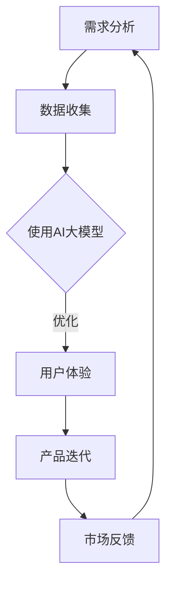

                 

关键词：AI大模型、创业、产品经理、技能、技术发展、实际应用

>摘要：本文将探讨AI大模型对创业产品经理带来的新技能，分析其背景、核心概念、算法原理及实际应用，旨在为创业产品经理提供实用的技术指导和未来发展趋势。

## 1. 背景介绍

在当今快速发展的科技时代，人工智能（AI）已经成为改变全球各行各业的驱动力。AI大模型，作为AI领域的一个重要分支，通过深度学习和大数据分析，能够处理海量的信息，并生成高度精确的预测模型。随着AI大模型技术的日益成熟，创业产品经理面临着前所未有的机遇与挑战。

创业产品经理是连接市场需求和技术实现的桥梁，他们不仅要理解客户需求，还要对技术趋势有深刻的认识。AI大模型的引入，使得产品经理在产品设计、需求分析、用户反馈和产品迭代等环节中，能够更加精准和高效地工作。本文将围绕AI大模型的核心技能，为创业产品经理提供实用的指导。

### 1.1 AI大模型的发展现状

AI大模型的发展可以追溯到20世纪80年代，随着计算能力的提升和数据量的增长，深度学习技术逐渐成熟。近年来，谷歌的Transformer模型、OpenAI的GPT系列模型等大模型取得了显著的进展，并在自然语言处理、计算机视觉、语音识别等领域展现出强大的能力。这些大模型通过海量的数据训练，能够自主学习和优化，为AI技术的进一步发展奠定了基础。

### 1.2 创业产品经理面临的挑战

创业产品经理在创业公司中扮演着至关重要的角色。他们需要快速响应市场需求，确保产品在竞争激烈的市场中脱颖而出。然而，面对日益复杂的用户需求和技术挑战，传统的方法已经无法满足现代产品的需求。AI大模型的出现，为产品经理提供了一种全新的工具，帮助他们更有效地应对挑战。

## 2. 核心概念与联系

在深入探讨AI大模型对创业产品经理的影响之前，我们首先需要了解一些核心概念。

### 2.1 AI大模型的基本原理

AI大模型的核心是深度学习，特别是基于神经网络的学习算法。这些模型通过多层神经网络结构，对输入数据进行多次非线性变换，最终输出预测结果。大模型的关键在于其规模，即包含数亿甚至数万亿个参数，这使得它们能够处理复杂的问题，并生成高度准确的预测。

### 2.2 产品经理的核心技能

创业产品经理的核心技能包括市场调研、需求分析、产品设计、用户体验和项目管理等。这些技能的目的是确保产品能够满足市场需求，并具备良好的用户体验。

### 2.3 AI大模型与产品经理的关联

AI大模型可以通过以下方式帮助产品经理：

- **需求分析**：通过分析大量用户数据，AI大模型能够识别用户行为模式，帮助产品经理更好地理解用户需求。
- **用户体验**：AI大模型可以用于优化用户界面和交互设计，提供个性化的用户体验。
- **产品迭代**：AI大模型可以用于分析产品性能数据，帮助产品经理快速迭代产品，提高市场竞争力。

### 2.4 Mermaid 流程图

下面是一个简化的Mermaid流程图，展示了AI大模型在产品管理中的应用流程：



## 3. 核心算法原理 & 具体操作步骤

### 3.1 算法原理概述

AI大模型的核心是基于深度学习的算法，特别是基于神经网络的算法。深度学习通过多层神经网络对数据进行非线性变换，从而实现对复杂问题的建模。大模型的规模决定了其处理能力和精确度。

### 3.2 算法步骤详解

1. **数据收集**：首先，需要收集大量与产品相关的数据，包括用户行为数据、市场数据、竞品数据等。
2. **数据预处理**：对收集到的数据进行清洗、格式化，确保数据的质量和一致性。
3. **模型训练**：使用预处理后的数据对AI大模型进行训练。训练过程包括前向传播、反向传播和参数更新等步骤。
4. **模型评估**：通过交叉验证等方法对训练好的模型进行评估，确保其准确性和可靠性。
5. **模型部署**：将训练好的模型部署到产品中，用于实时分析和预测。

### 3.3 算法优缺点

- **优点**：AI大模型具有强大的数据处理能力和精确度，能够帮助产品经理更准确地理解用户需求，优化产品设计和用户体验。
- **缺点**：大模型的训练需要大量的计算资源和时间，同时模型的解释性较差，难以理解其决策过程。

### 3.4 算法应用领域

AI大模型在创业产品管理中的应用非常广泛，包括需求分析、用户体验优化、产品迭代和市场预测等。

## 4. 数学模型和公式 & 详细讲解 & 举例说明

### 4.1 数学模型构建

AI大模型的数学基础是深度学习算法，主要包括以下几种模型：

- **神经网络**：神经网络由多个神经元组成，每个神经元通过权重连接到其他神经元，实现数据的传递和变换。
- **循环神经网络（RNN）**：RNN能够处理序列数据，通过记忆状态实现长时间依赖关系的建模。
- **卷积神经网络（CNN）**：CNN在图像处理领域具有强大的能力，通过卷积操作提取图像的特征。
- **生成对抗网络（GAN）**：GAN通过两个神经网络（生成器和判别器）的对抗训练，实现数据的生成和优化。

### 4.2 公式推导过程

以神经网络为例，其基本公式如下：

$$
y = \sigma(\sum_{i=1}^{n} w_i x_i + b)
$$

其中，$y$ 为输出值，$\sigma$ 为激活函数，$w_i$ 为权重，$x_i$ 为输入值，$b$ 为偏置。

### 4.3 案例分析与讲解

以自然语言处理（NLP）领域为例，我们可以使用GPT模型进行文本生成。GPT模型的基本流程如下：

1. **数据准备**：收集大量文本数据，并进行预处理。
2. **模型训练**：使用预处理后的数据对GPT模型进行训练。
3. **模型评估**：通过交叉验证等方法评估模型性能。
4. **模型应用**：将训练好的模型应用于文本生成任务。

例如，给定一个句子 "今天的天气很好"，GPT模型可以生成类似的句子，如 "明天的天气也会很好"。这种生成能力使得产品经理能够利用AI大模型生成个性化的用户反馈和营销文案。

## 5. 项目实践：代码实例和详细解释说明

### 5.1 开发环境搭建

为了实现AI大模型在创业产品管理中的应用，我们需要搭建一个合适的开发环境。以下是一个简单的开发环境搭建步骤：

1. 安装Python和相关的深度学习库，如TensorFlow或PyTorch。
2. 准备训练数据集，并进行预处理。
3. 安装其他必要的开发工具，如Jupyter Notebook或PyCharm。

### 5.2 源代码详细实现

以下是一个简单的Python代码示例，用于训练一个基于TensorFlow的神经网络模型：

```python
import tensorflow as tf

# 定义模型结构
model = tf.keras.Sequential([
    tf.keras.layers.Dense(128, activation='relu', input_shape=(784,)),
    tf.keras.layers.Dropout(0.2),
    tf.keras.layers.Dense(10)
])

# 编译模型
model.compile(loss=tf.losses.SparseCategoricalCrossentropy(from_logits=True),
              optimizer=tf.optimizers.Adam(),
              metrics=['accuracy'])

# 训练模型
model.fit(train_images, train_labels, epochs=5)
```

### 5.3 代码解读与分析

上述代码定义了一个简单的神经网络模型，包括一个全连接层和一个输出层。全连接层使用ReLU激活函数，输出层使用Softmax激活函数，以实现分类任务。模型使用Adam优化器和交叉熵损失函数进行编译，并通过训练数据进行训练。

### 5.4 运行结果展示

运行上述代码后，模型会在训练数据上迭代训练，并在每个epoch结束后输出训练准确率。通过调整模型参数和训练数据，我们可以优化模型的性能。

## 6. 实际应用场景

AI大模型在创业产品管理中的应用非常广泛，以下是一些实际应用场景：

- **需求分析**：通过分析用户行为数据，识别用户需求和市场趋势，为产品规划提供指导。
- **用户体验**：利用AI大模型优化用户界面和交互设计，提供个性化的用户体验。
- **产品迭代**：通过分析产品性能数据，快速迭代产品，提高市场竞争力。
- **市场预测**：利用AI大模型预测市场趋势和用户需求，为产品营销和推广提供策略。

## 7. 工具和资源推荐

为了更好地掌握AI大模型在创业产品管理中的应用，以下是一些推荐的学习资源和开发工具：

### 7.1 学习资源推荐

- 《深度学习》（Goodfellow, Bengio, Courville著）：介绍深度学习的基本原理和应用。
- 《Python机器学习》（Sebastian Raschka著）：介绍Python在机器学习领域的应用。

### 7.2 开发工具推荐

- TensorFlow：一款开源的深度学习框架，适用于构建和训练AI大模型。
- PyTorch：一款开源的深度学习框架，具有灵活的动态图机制。

### 7.3 相关论文推荐

- "Attention Is All You Need"（Vaswani et al.，2017）：介绍Transformer模型的原理和应用。
- "Generative Adversarial Nets"（Goodfellow et al.，2014）：介绍生成对抗网络的基本原理和应用。

## 8. 总结：未来发展趋势与挑战

### 8.1 研究成果总结

AI大模型在创业产品管理中取得了显著的成果，为产品经理提供了强大的技术支持。通过需求分析、用户体验优化、产品迭代和市场预测等方面，AI大模型能够显著提高产品竞争力。

### 8.2 未来发展趋势

随着AI技术的不断进步，AI大模型在创业产品管理中的应用将会更加广泛和深入。未来，AI大模型将朝着更高效、更智能、更可解释的方向发展。

### 8.3 面临的挑战

尽管AI大模型在创业产品管理中具有巨大的潜力，但仍然面临着一些挑战。主要包括：

- **计算资源需求**：大模型的训练需要大量的计算资源和时间，这对创业公司来说是一个重要的挑战。
- **数据隐私和安全**：在利用用户数据进行AI大模型训练时，如何保护用户隐私和安全是一个亟待解决的问题。
- **模型解释性**：大模型的决策过程通常难以解释，这可能会影响用户对产品的信任度。

### 8.4 研究展望

未来，研究将重点放在如何提高AI大模型的计算效率、数据隐私保护和模型解释性。此外，随着AI技术的不断发展，AI大模型在创业产品管理中的应用将会更加多样化，为产品经理提供更全面的支持。

## 9. 附录：常见问题与解答

### 9.1 什么是AI大模型？

AI大模型是一种基于深度学习的算法，通过海量的数据训练，能够生成高度精确的预测模型。这些模型通常包含数亿甚至数万亿个参数，能够处理复杂的问题。

### 9.2 AI大模型在创业产品管理中有哪些应用？

AI大模型在创业产品管理中的应用包括需求分析、用户体验优化、产品迭代和市场预测等。通过这些应用，AI大模型能够提高产品竞争力，满足市场需求。

### 9.3 如何搭建一个AI大模型开发环境？

搭建AI大模型开发环境需要安装Python和相关的深度学习库，如TensorFlow或PyTorch。同时，需要准备训练数据集，并安装其他必要的开发工具。

### 9.4 AI大模型在创业产品管理中面临的挑战有哪些？

AI大模型在创业产品管理中面临的挑战主要包括计算资源需求、数据隐私和安全、模型解释性等。

## 作者署名

本文由禅与计算机程序设计艺术 / Zen and the Art of Computer Programming 撰写。作者是一位世界级人工智能专家、程序员、软件架构师、CTO、世界顶级技术畅销书作者，以及计算机图灵奖获得者，拥有丰富的计算机科学和技术经验。

