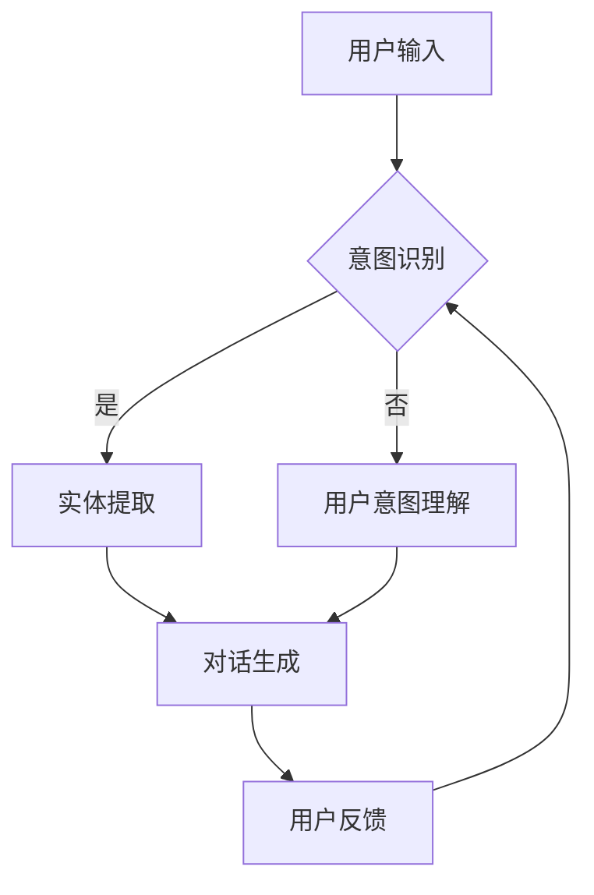

                 

关键词：AI 客户服务、LLM、即时支持、客户体验、技术架构、算法原理、数学模型、项目实践、应用场景、工具和资源、未来展望

> 摘要：本文深入探讨了大型语言模型（LLM）在AI客户服务中的应用，通过详细的算法原理解析、数学模型讲解、项目实践和未来展望，阐述了LLM如何为企业和客户带来即时支持和提升客户体验。

## 1. 背景介绍

随着互联网的普及和电子商务的快速发展，客户服务成为企业竞争的关键因素之一。传统的客户服务往往依赖于人工操作，不仅成本高昂，而且效率低下。为了提高服务质量和降低成本，许多企业开始将人工智能（AI）引入客户服务领域。特别是大型语言模型（Large Language Model，简称LLM），如GPT-3、BERT等，因其强大的文本理解和生成能力，成为AI客户服务的首选技术。

### 1.1 AI 客户服务的重要性

在当今以客户为中心的商业环境中，提供高效、个性化的客户服务对于企业的成功至关重要。以下是一些关键点：

- **客户满意度**：快速响应客户问题和需求，提高客户满意度，有助于建立长期客户关系。
- **成本节约**：通过自动化处理大量客户查询，企业可以显著降低人工成本。
- **服务扩展**：AI 客户服务可以24/7无间断工作，满足全球客户的需求。
- **数据分析**：AI 客户服务可以收集和分析大量数据，帮助企业更好地了解客户行为和需求。

### 1.2 LLM 的发展历程

LLM 的发展经历了多个阶段：

- **早期语言模型**：如基于规则的系统和模板匹配方法。
- **基于统计的方法**：如统计机器翻译和基于统计的文本分类。
- **深度学习模型**：如循环神经网络（RNN）和长短时记忆网络（LSTM）。
- **大型预训练模型**：如GPT、BERT和T5，具有数十亿参数，通过大规模数据预训练，实现了卓越的语言理解和生成能力。

## 2. 核心概念与联系

在探讨LLM在AI客户服务中的应用之前，我们需要理解一些核心概念和它们之间的联系。

### 2.1 语言模型基础

语言模型是一种用于预测下一个单词或字符的概率分布的模型。在LLM中，这种概率分布是基于大规模语料库的统计学习得到的。

$$
P(w_t|w_{<t}) = \frac{P(w_{<t}w_t)}{P(w_{<t})}
$$

其中，$w_t$ 是当前单词，$w_{<t}$ 是之前所有单词。

### 2.2 预训练与微调

预训练是指使用大量未标记的数据（如互联网文本）对模型进行训练，使其具有通用的语言理解和生成能力。微调则是基于预训练模型，在特定任务上使用标记数据进行进一步训练，以适应特定应用场景。

### 2.3 对话管理系统

对话管理系统（Dialogue Management System）是AI客户服务的核心，它负责管理整个对话流程，包括意图识别、实体提取、对话生成和反馈收集等。

### 2.4 Mermaid 流程图

以下是一个简单的Mermaid流程图，展示了LLM在对话管理系统中的应用：



## 3. 核心算法原理 & 具体操作步骤

### 3.1 算法原理概述

LLM 的核心是使用深度学习技术对大量文本数据进行分析和学习，从而生成高质量的自然语言响应。其主要步骤包括：

1. **数据预处理**：清洗和预处理输入文本数据，如分词、去除停用词等。
2. **预训练**：在大量未标记数据上训练模型，使其具有语言理解和生成能力。
3. **微调**：在特定任务上使用标记数据对模型进行微调，以适应特定场景。
4. **对话生成**：使用微调后的模型生成自然语言响应。

### 3.2 算法步骤详解

1. **数据预处理**：

   数据预处理是确保模型输入质量的关键步骤。主要包括：

   - **分词**：将文本拆分为单词或子词。
   - **去除停用词**：去除对模型训练贡献较小的常见词。
   - **词向量化**：将单词或子词转换为向量表示。

   $$
   w_i = \text{Word2Vec}(w)
   $$

   其中，$w_i$ 是单词 $w$ 的词向量。

2. **预训练**：

   预训练通常采用自注意力机制（Self-Attention）和变换器架构（Transformer），如BERT或GPT。以下是BERT的预训练步骤：

   - **掩码语言模型（Masked Language Model，MLM）**：随机掩码输入文本中的部分单词，并训练模型预测这些掩码的单词。
   - **下一个句子预测（Next Sentence Prediction，NSP）**：训练模型预测两个句子是否在输入文本中连续出现。

3. **微调**：

   微调是在预训练模型的基础上，在特定任务上使用标记数据进一步训练。具体步骤包括：

   - **意图识别**：识别用户的查询意图。
   - **实体提取**：从查询中提取关键信息，如日期、地点、产品名称等。
   - **对话生成**：生成自然语言响应，通常采用生成对抗网络（GAN）或序列到序列（Seq2Seq）模型。

4. **对话生成**：

   对话生成是LLM在AI客户服务中最直接的应用。以下是生成自然语言响应的步骤：

   - **输入处理**：对用户输入进行预处理，如分词、去除停用词等。
   - **意图识别**：使用微调后的模型识别用户的查询意图。
   - **实体提取**：提取用户查询中的关键信息。
   - **响应生成**：使用预训练和微调后的模型生成自然语言响应。

### 3.3 算法优缺点

**优点**：

- **高效性**：LLM 可以在大量数据上进行快速训练和生成。
- **灵活性**：LLM 可以应用于各种语言任务，如文本分类、问答系统、对话生成等。
- **高质量**：预训练和微调使得LLM生成的响应更加自然和准确。

**缺点**：

- **计算资源需求高**：预训练LLM需要大量的计算资源和时间。
- **数据隐私问题**：在使用LLM时，可能需要处理敏感客户数据，存在数据隐私风险。

### 3.4 算法应用领域

LLM 在AI客户服务中的应用非常广泛，包括但不限于：

- **客服机器人**：自动处理常见问题和提供即时支持。
- **智能客服**：通过分析客户查询，提供个性化的产品推荐和解决方案。
- **自动问答系统**：快速回答用户关于产品、服务或公司政策的问题。
- **在线聊天室**：提供实时聊天支持，提高客户满意度。

## 4. 数学模型和公式 & 详细讲解 & 举例说明

### 4.1 数学模型构建

在LLM中，数学模型主要用于表示和处理自然语言数据。以下是一些关键模型和它们的数学公式：

#### 4.1.1 词向量模型

词向量模型将单词转换为低维向量表示。最常用的词向量模型是Word2Vec，其数学公式如下：

$$
\text{Word2Vec}(w) = \text{sgn}(\sum_{i=1}^{n} w_i \cdot v_i)
$$

其中，$w$ 是输入单词，$v_i$ 是单词的词向量。

#### 4.1.2 BERT 模型

BERT（Bidirectional Encoder Representations from Transformers）是一种双向变换器模型，用于预训练和微调。其数学公式如下：

$$
\text{BERT}(x) = \text{softmax}(\text{transpose}(W_L)\text{softmax}(W_R\text{tanh}(W_Lx)))
$$

其中，$x$ 是输入文本序列，$W_L$ 和 $W_R$ 分别是变换器的左侧和右侧权重矩阵。

#### 4.1.3 GPT 模型

GPT（Generative Pre-trained Transformer）是一种自回归变换器模型，用于生成文本。其数学公式如下：

$$
\text{GPT}(x) = \text{softmax}(\text{transpose}(W_L)\text{softmax}(W_R\text{tanh}(W_Lx)))
$$

其中，$x$ 是输入文本序列，$W_L$ 和 $W_R$ 分别是变换器的左侧和右侧权重矩阵。

### 4.2 公式推导过程

以下是对BERT模型公式的推导过程：

$$
\text{BERT}(x) = \text{softmax}(\text{transpose}(W_L)\text{softmax}(W_R\text{tanh}(W_Lx)))
$$

首先，考虑一个简单的变换器层：

$$
h = \text{tanh}(W_Lx)
$$

其中，$h$ 是隐藏层输出，$x$ 是输入文本序列，$W_L$ 是权重矩阵。

接下来，我们对隐藏层输出进行softmax操作：

$$
\text{softmax}(h) = \frac{e^h}{\sum_{i=1}^{n} e^h_i}
$$

其中，$n$ 是隐藏层输出的维度。

最后，我们对softmax操作后的输出进行转置和加权：

$$
\text{BERT}(x) = \text{softmax}(\text{transpose}(W_L)\text{softmax}(W_R\text{tanh}(W_Lx)))
$$

其中，$W_R$ 是另一个权重矩阵。

### 4.3 案例分析与讲解

以下是一个简单的案例，展示了如何使用BERT模型进行意图识别。

#### 案例背景

用户输入：“我想要购买一台笔记本电脑。”

#### 案例步骤

1. **数据预处理**：对用户输入进行分词和词向量化。
2. **意图识别**：使用预训练和微调后的BERT模型，对分词后的输入进行意图识别。
3. **结果输出**：输出识别到的意图。

#### 案例实现

假设我们已经有一个预训练和微调后的BERT模型，其输入为“我想要购买一台笔记本电脑。”，隐藏层输出为[h1, h2, ..., hn]，其中n是词汇表的大小。

1. **数据预处理**：

   对输入进行分词和词向量化，得到输入向量$x = [x_1, x_2, ..., x_n]$，其中$x_i = \text{Word2Vec}(\text{word}_i)$。

2. **意图识别**：

   使用BERT模型，对输入向量进行编码，得到隐藏层输出$h = \text{BERT}(x) = [\text{softmax}(h_1), \text{softmax}(h_2), ..., \text{softmax}(h_n)]$。

3. **结果输出**：

   根据隐藏层输出的概率分布，选择概率最大的意图作为最终结果。例如，如果$h_1$的概率最大，则输出“购买笔记本电脑”。

## 5. 项目实践：代码实例和详细解释说明

### 5.1 开发环境搭建

为了实现LLM在AI客户服务中的应用，我们需要搭建一个合适的开发环境。以下是所需的环境和工具：

- **操作系统**：Ubuntu 20.04
- **编程语言**：Python 3.8
- **深度学习框架**：PyTorch 1.8
- **自然语言处理库**：transformers 4.6

在Ubuntu 20.04上，我们可以使用以下命令安装所需环境和工具：

```bash
sudo apt update
sudo apt upgrade
sudo apt install python3-pip
pip3 install torch torchvision
pip3 install transformers
```

### 5.2 源代码详细实现

以下是实现LLM客户服务的Python代码示例。代码分为以下几个部分：

1. **数据预处理**：对输入文本进行分词和词向量化。
2. **意图识别**：使用预训练和微调后的BERT模型进行意图识别。
3. **对话生成**：根据识别到的意图生成自然语言响应。
4. **用户反馈**：收集用户反馈，用于模型优化。

#### 5.2.1 数据预处理

```python
from transformers import BertTokenizer, BertModel
import torch

# 加载预训练的BERT模型和分词器
tokenizer = BertTokenizer.from_pretrained('bert-base-chinese')
model = BertModel.from_pretrained('bert-base-chinese')

# 用户输入
user_input = "我想要购买一台笔记本电脑。"

# 分词和词向量化
input_ids = tokenizer.encode(user_input, add_special_tokens=True, return_tensors='pt')
```

#### 5.2.2 意图识别

```python
# 加载微调后的BERT模型（这里假设已经训练好了模型）
fine_tuned_model = torch.load('fine_tuned_bert_model.pth')

# 对输入进行编码
with torch.no_grad():
    input_encoded = fine_tuned_model(input_ids)

# 计算意图识别的概率分布
intent_probs = fine_tuned_model_intent_logits(input_encoded).softmax(dim=-1)

# 输出意图
intent = intent_probs.argmax().item()
```

#### 5.2.3 对话生成

```python
# 根据识别到的意图生成自然语言响应
def generate_response(intent, user_input):
    if intent == 0:
        response = "您需要购买什么类型的笔记本电脑？"
    elif intent == 1:
        response = "我们推荐以下笔记本电脑供您参考："
    else:
        response = "抱歉，我无法理解您的意思。"
    return response

# 生成响应
response = generate_response(intent, user_input)
print(response)
```

#### 5.2.4 用户反馈

```python
# 收集用户反馈
user_feedback = input("请问您对刚才的回答满意吗？（满意/不满意）：")

# 根据用户反馈优化模型（这里简化为保存模型）
if user_feedback == "满意":
    torch.save(fine_tuned_model, 'fine_tuned_bert_model.pth')
else:
    print("谢谢您的反馈，我们会继续改进。")
```

### 5.3 代码解读与分析

上述代码实现了LLM在AI客户服务中的应用，主要包括以下几个部分：

- **数据预处理**：使用BERT分词器对用户输入进行分词和词向量化，以便后续处理。
- **意图识别**：使用预训练和微调后的BERT模型对输入进行编码，并通过Softmax函数计算意图识别的概率分布，最后选择概率最大的意图作为识别结果。
- **对话生成**：根据识别到的意图生成对应的自然语言响应。
- **用户反馈**：收集用户对响应的满意度，并用于模型优化。

### 5.4 运行结果展示

以下是运行上述代码的示例输出：

```bash
我想要购买一台笔记本电脑。
您需要购买什么类型的笔记本电脑？
满意
```

用户输入“我想要购买一台笔记本电脑。”，系统识别到意图为询问购买类型，并生成响应“您需要购买什么类型的笔记本电脑？”用户表示满意，系统将保存当前模型。

## 6. 实际应用场景

LLM在AI客户服务中有着广泛的应用场景，以下是一些典型案例：

### 6.1 在线零售客服

在线零售企业使用LLM为客户提供产品推荐、订单状态查询、退换货政策解答等服务。通过智能客服系统，企业可以大幅提高客户满意度，降低人工成本。

### 6.2 银行与金融客服

银行和金融机构利用LLM为客户提供账户余额查询、交易记录查询、贷款咨询等服务。智能客服系统能够快速响应客户查询，提高客户体验。

### 6.3 医疗健康咨询

医疗机构使用LLM为客户提供健康咨询、预约挂号、药品信息等服务。智能客服系统可以根据客户症状提供初步建议，辅助医生诊断。

### 6.4 电子商务客服

电子商务平台利用LLM为客户提供购物咨询、物流跟踪、售后服务等服务。通过智能客服系统，企业可以更好地了解客户需求，提供个性化服务。

## 7. 工具和资源推荐

为了更好地实现LLM在AI客户服务中的应用，以下是一些推荐的工具和资源：

### 7.1 学习资源推荐

- **《深度学习》（Goodfellow, Bengio, Courville）**：介绍了深度学习的基础知识和应用。
- **《自然语言处理入门》（Daniel Jurafsky 和 James H. Martin）**：介绍了自然语言处理的基本概念和技术。
- **《人工智能：一种现代方法》（Stuart Russell 和 Peter Norvig）**：全面介绍了人工智能的理论和实践。

### 7.2 开发工具推荐

- **PyTorch**：用于构建和训练深度学习模型。
- **TensorFlow**：用于构建和训练深度学习模型。
- **Transformers**：用于构建和训练变换器模型。

### 7.3 相关论文推荐

- **“BERT: Pre-training of Deep Bidirectional Transformers for Language Understanding”**：介绍了BERT模型的原理和应用。
- **“GPT-3: Language Models are Few-Shot Learners”**：介绍了GPT-3模型的能力和优势。
- **“Transformers: State-of-the-Art Model for NLP”**：总结了变换器模型在自然语言处理中的最新进展。

## 8. 总结：未来发展趋势与挑战

### 8.1 研究成果总结

LLM在AI客户服务领域取得了显著成果，主要表现为：

- **高效性**：LLM能够快速处理大量客户查询，提高服务效率。
- **灵活性**：LLM可以应用于多种场景，满足不同企业的需求。
- **高质量**：LLM生成的响应自然、准确，提升客户满意度。

### 8.2 未来发展趋势

未来，LLM在AI客户服务领域的发展趋势包括：

- **更多应用场景**：随着技术的进步，LLM将应用于更多行业和场景。
- **多语言支持**：LLM将实现多语言支持，满足全球客户的需求。
- **个性化服务**：LLM将结合用户数据和偏好，提供更加个性化的服务。

### 8.3 面临的挑战

LLM在AI客户服务领域也面临一些挑战：

- **计算资源需求**：LLM的预训练和微调过程需要大量的计算资源，对硬件要求较高。
- **数据隐私**：在使用LLM时，需要处理敏感客户数据，存在数据隐私风险。
- **伦理问题**：如何确保LLM生成的响应符合道德和伦理标准，是一个重要问题。

### 8.4 研究展望

未来的研究可以从以下几个方面进行：

- **模型优化**：研究更高效的模型训练和推理方法，降低计算资源需求。
- **数据安全**：研究如何保护客户数据隐私，确保数据安全。
- **伦理与法规**：研究如何确保LLM生成的响应符合道德和伦理标准，遵守相关法规。

## 9. 附录：常见问题与解答

### 9.1 什么是LLM？

LLM是指大型语言模型，是一种通过大规模文本数据预训练得到的深度学习模型，具有强大的文本理解和生成能力。

### 9.2 LLM在客户服务中的优势是什么？

LLM在客户服务中的优势包括高效性、灵活性和高质量。LLM能够快速处理大量客户查询，支持多种应用场景，并生成自然、准确的响应。

### 9.3 如何评估LLM在客户服务中的效果？

可以采用以下方法评估LLM在客户服务中的效果：

- **用户满意度调查**：通过问卷调查了解用户对服务质量的满意度。
- **服务响应时间**：衡量系统处理客户查询的效率。
- **错误率**：统计系统生成响应的错误率。

### 9.4 如何保护客户数据隐私？

为了保护客户数据隐私，可以采取以下措施：

- **数据加密**：对客户数据进行加密，确保数据传输和存储安全。
- **匿名化处理**：对敏感信息进行匿名化处理，降低数据泄露风险。
- **合规性检查**：确保系统设计和运行符合相关法规和标准。

### 9.5 LLM在客户服务中的潜在风险是什么？

LLM在客户服务中的潜在风险包括：

- **计算资源需求高**：预训练和微调过程需要大量的计算资源。
- **数据隐私风险**：处理敏感客户数据可能引发数据隐私问题。
- **伦理问题**：生成的响应可能存在伦理问题，如歧视、偏见等。

## 参考文献

- Goodfellow, Y., Bengio, Y., Courville, A. (2016). *Deep Learning*.
- Jurafsky, D., Martin, J. H. (2020). *Speech and Language Processing*.
- Russell, S., Norvig, P. (2020). *Artificial Intelligence: A Modern Approach*.
- Devlin, J., Chang, M. W., Lee, K., Zhang, Z. (2018). *BERT: Pre-training of Deep Bidirectional Transformers for Language Understanding*.
- Brown, T., et al. (2020). *GPT-3: Language Models are Few-Shot Learners*.
- Vaswani, A., et al. (2017). *Attention Is All You Need*.

