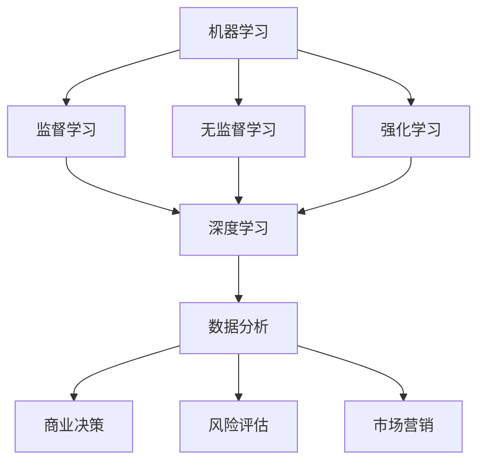

                 

在当今快速发展的技术时代，人工智能（AI）无疑成为了一个举足轻重的领域。随着AI技术的不断进步，企业和组织在全球范围内的竞争中也面临着前所未有的挑战。本文旨在探讨如何在AI时代保持领先地位，分析当前的趋势、关键技术和未来的发展方向。

## 关键词
- 人工智能
- 竞争策略
- 技术创新
- 数据分析
- 机器学习
- 深度学习

## 摘要
本文将深入分析在AI时代保持领先地位的重要性，以及如何通过技术创新、数据分析、机器学习和深度学习等技术手段来应对竞争。文章还将探讨未来AI技术的发展趋势和面临的挑战，为企业和组织提供实用的策略和建议。

## 1. 背景介绍
随着计算能力的提升和大数据技术的发展，AI技术已经渗透到各个行业。从医疗、金融到零售、制造，AI的应用无处不在。然而，随着AI技术的普及，企业间的竞争也变得更加激烈。保持领先地位不仅需要技术创新，还需要快速响应市场变化和持续学习。

## 2. 核心概念与联系

为了更好地理解AI时代的竞争，我们首先需要了解几个核心概念：

- **机器学习（Machine Learning）**：机器学习是一种通过数据训练模型，使其能够从经验中学习和改进的技术。它包括监督学习、无监督学习和强化学习等子领域。

- **深度学习（Deep Learning）**：深度学习是机器学习的一个分支，它利用多层神经网络来学习数据的复杂模式。深度学习在图像识别、自然语言处理和语音识别等领域取得了显著成果。

- **数据分析（Data Analysis）**：数据分析是使用统计学、数据挖掘和机器学习技术来从数据中提取有用信息的过程。数据分析在商业决策、风险评估和市场营销等方面发挥着重要作用。

下面是一个Mermaid流程图，展示了这些核心概念之间的联系：



## 3. 核心算法原理 & 具体操作步骤

### 3.1 算法原理概述

在AI时代，核心算法的原理和操作步骤至关重要。以下将简要介绍几个关键算法：

- **监督学习（Supervised Learning）**：监督学习使用带有标签的数据来训练模型，然后使用这个模型对新数据进行预测。常见的算法包括线性回归、决策树和随机森林等。

- **深度学习（Deep Learning）**：深度学习使用多层神经网络来提取数据的层次特征。一个典型的深度学习模型包括输入层、隐藏层和输出层。通过反向传播算法，模型可以从训练数据中学习并优化参数。

- **强化学习（Reinforcement Learning）**：强化学习通过试错和奖励机制来训练模型。模型在环境中进行行动，并根据环境反馈进行调整。常见的算法包括Q-学习、SARSA和深度确定性策略梯度（DDPG）等。

### 3.2 算法步骤详解

以下是监督学习、深度学习和强化学习的具体步骤：

#### 监督学习步骤

1. **数据收集与预处理**：收集带有标签的训练数据，并进行数据清洗和预处理。
2. **特征提取**：将原始数据转换为特征向量。
3. **模型训练**：使用训练数据训练模型，调整模型参数以最小化预测误差。
4. **模型评估**：使用测试数据评估模型性能，并调整参数以优化模型。
5. **预测**：使用训练好的模型对新数据进行预测。

#### 深度学习步骤

1. **数据收集与预处理**：与监督学习相同。
2. **构建神经网络**：设计神经网络结构，包括输入层、隐藏层和输出层。
3. **初始化参数**：随机初始化网络权重和偏置。
4. **前向传播**：将输入数据通过网络，计算输出。
5. **反向传播**：根据输出误差，反向更新网络权重和偏置。
6. **迭代训练**：重复前向传播和反向传播，直至达到预定的迭代次数或性能目标。
7. **模型评估与优化**：评估模型性能，并根据评估结果调整模型参数。

#### 强化学习步骤

1. **环境定义**：定义环境状态、动作和奖励。
2. **初始化模型参数**：初始化策略网络和价值网络的参数。
3. **探索与学习**：在环境中进行行动，并收集经验。
4. **更新模型参数**：根据收集到的经验，更新策略网络和价值网络的参数。
5. **评估模型性能**：评估策略网络和价值网络的性能。
6. **迭代学习**：重复探索与学习过程，直至达到预定的性能目标。

### 3.3 算法优缺点

- **监督学习**：优点是模型易于理解和实现，可以处理大规模数据；缺点是需要大量带有标签的数据，且在处理无标签数据时效果较差。

- **深度学习**：优点是能够自动提取数据特征，适应性强；缺点是模型复杂度高，训练时间较长，对数据质量要求较高。

- **强化学习**：优点是能够处理动态环境和长序列决策问题；缺点是训练过程复杂，需要大量的探索和试错。

### 3.4 算法应用领域

- **监督学习**：广泛应用于图像识别、自然语言处理、语音识别等领域。

- **深度学习**：在计算机视觉、自然语言处理、医疗诊断等领域取得了显著成果。

- **强化学习**：应用于自动驾驶、机器人控制、游戏智能等领域。

## 4. 数学模型和公式 & 详细讲解 & 举例说明

在AI时代，数学模型和公式是理解和应用算法的基础。以下将介绍几个关键数学模型和公式，并给出详细讲解和举例说明。

### 4.1 数学模型构建

在AI算法中，常用的数学模型包括线性模型、逻辑回归模型、神经网络模型等。以下是这些模型的构建过程：

#### 线性模型

线性模型是最简单的机器学习模型，它假设数据之间存在线性关系。其公式如下：

\[ y = \beta_0 + \beta_1x_1 + \beta_2x_2 + ... + \beta_nx_n \]

其中，\( y \) 是输出变量，\( x_1, x_2, ..., x_n \) 是输入变量，\( \beta_0, \beta_1, ..., \beta_n \) 是模型的参数。

#### 逻辑回归模型

逻辑回归模型是一种用于分类问题的线性模型，其公式如下：

\[ P(y=1) = \frac{1}{1 + e^{-(\beta_0 + \beta_1x_1 + \beta_2x_2 + ... + \beta_nx_n ) }} \]

其中，\( P(y=1) \) 是输出变量为1的概率，\( e \) 是自然对数的底数。

#### 神经网络模型

神经网络模型是一种由多个神经元组成的网络结构，其公式如下：

\[ a_{ij}^{(l)} = \sigma \left( \sum_{k=1}^{n} w_{ik}^{(l)} a_{kj}^{(l-1)} + b_j^{(l)} \right) \]

其中，\( a_{ij}^{(l)} \) 是第 \( l \) 层第 \( i \) 个神经元的输出，\( \sigma \) 是激活函数，\( w_{ik}^{(l)} \) 是第 \( l \) 层第 \( i \) 个神经元到第 \( k \) 个神经元的权重，\( b_j^{(l)} \) 是第 \( l \) 层第 \( j \) 个神经元的偏置。

### 4.2 公式推导过程

以下是逻辑回归模型的公式推导过程：

假设我们有 \( n \) 个特征 \( x_1, x_2, ..., x_n \)，以及一个目标变量 \( y \)。我们的目标是找到一个线性函数 \( f(x) \)，使得 \( f(x) \) 与 \( y \) 之间的关系尽可能接近。

首先，我们假设 \( f(x) \) 的形式为：

\[ f(x) = \beta_0 + \beta_1x_1 + \beta_2x_2 + ... + \beta_nx_n \]

然后，我们定义损失函数 \( J(\beta_0, \beta_1, ..., \beta_n) \) 来衡量 \( f(x) \) 与 \( y \) 之间的差距：

\[ J(\beta_0, \beta_1, ..., \beta_n) = \frac{1}{2m} \sum_{i=1}^{m} \left( y^{(i)} - f(x^{(i)}) \right)^2 \]

其中，\( m \) 是样本数量，\( y^{(i)} \) 是第 \( i \) 个样本的目标变量，\( x^{(i)} \) 是第 \( i \) 个样本的特征向量。

为了最小化损失函数 \( J(\beta_0, \beta_1, ..., \beta_n) \)，我们需要对每个参数 \( \beta_0, \beta_1, ..., \beta_n \) 求偏导数，并令偏导数等于零：

\[ \frac{\partial J}{\partial \beta_0} = 0, \frac{\partial J}{\partial \beta_1} = 0, ..., \frac{\partial J}{\partial \beta_n} = 0 \]

通过求解上述方程组，我们可以得到最优的参数 \( \beta_0, \beta_1, ..., \beta_n \)。

### 4.3 案例分析与讲解

以下是一个使用逻辑回归模型进行分类的案例：

假设我们有100个样本，每个样本有3个特征（\( x_1, x_2, x_3 \)），以及一个二分类目标变量（\( y \)）。我们的目标是使用逻辑回归模型预测样本属于类别1还是类别0。

首先，我们收集并整理数据，然后将数据分为训练集和测试集。训练集用于训练模型，测试集用于评估模型性能。

接下来，我们使用训练集数据训练逻辑回归模型。具体步骤如下：

1. **数据预处理**：对数据进行标准化处理，使得每个特征的取值范围在0到1之间。
2. **初始化参数**：随机初始化模型参数 \( \beta_0, \beta_1, \beta_2, \beta_3 \)。
3. **前向传播**：计算每个样本的预测概率 \( P(y=1) \)。
4. **计算损失函数**：使用训练集数据计算损失函数 \( J(\beta_0, \beta_1, \beta_2, \beta_3) \)。
5. **反向传播**：根据损失函数的梯度，更新模型参数。
6. **迭代训练**：重复步骤3到5，直至模型收敛。

训练完成后，我们使用测试集数据评估模型性能。具体步骤如下：

1. **前向传播**：计算测试集每个样本的预测概率 \( P(y=1) \)。
2. **计算准确率**：比较预测结果和实际结果，计算模型准确率。
3. **计算召回率**：比较预测结果和实际结果，计算模型召回率。
4. **计算F1值**：结合准确率和召回率，计算模型F1值。

通过上述步骤，我们可以评估模型的性能，并调整模型参数以优化模型性能。

## 5. 项目实践：代码实例和详细解释说明

在本节中，我们将通过一个具体的代码实例来展示如何使用Python实现逻辑回归模型并进行分类预测。该实例将涵盖数据预处理、模型训练、模型评估等步骤。

### 5.1 开发环境搭建

在开始编写代码之前，我们需要搭建一个Python开发环境。以下是搭建Python开发环境的基本步骤：

1. **安装Python**：下载并安装Python，建议安装Python 3.8或更高版本。
2. **安装依赖库**：在Python中，我们使用`pip`命令来安装所需的依赖库。以下是所需依赖库及其版本：

   ```bash
   pip install numpy pandas scikit-learn matplotlib
   ```

### 5.2 源代码详细实现

以下是一个使用Python实现逻辑回归模型的示例代码：

```python
import numpy as np
import pandas as pd
from sklearn.linear_model import LogisticRegression
from sklearn.model_selection import train_test_split
from sklearn.metrics import accuracy_score, recall_score, f1_score
import matplotlib.pyplot as plt

# 加载数据
data = pd.read_csv('data.csv')
X = data.iloc[:, :-1].values
y = data.iloc[:, -1].values

# 数据预处理
X = X / 255.0
X = np.insert(X, 0, 1, axis=1)

# 划分训练集和测试集
X_train, X_test, y_train, y_test = train_test_split(X, y, test_size=0.2, random_state=42)

# 训练模型
model = LogisticRegression()
model.fit(X_train, y_train)

# 预测测试集
y_pred = model.predict(X_test)

# 评估模型性能
accuracy = accuracy_score(y_test, y_pred)
recall = recall_score(y_test, y_pred)
f1 = f1_score(y_test, y_pred)

print(f'Accuracy: {accuracy:.2f}')
print(f'Recall: {recall:.2f}')
print(f'F1 Score: {f1:.2f}')

# 可视化结果
plt.figure()
plt.scatter(X_test[:, 1], X_test[:, 2], c=y_test, cmap='gray', marker='s', edgecolor='black', s=40)
plt.scatter(X_test[:, 1], X_test[:, 2], c=y_pred, cmap='gray', marker='o', edgecolor='black', s=40)
plt.xlabel('Feature 1')
plt.ylabel('Feature 2')
plt.title('Test Set - Predicted vs Actual')
plt.show()
```

### 5.3 代码解读与分析

以下是对上述代码的详细解读与分析：

1. **数据加载与预处理**：

   ```python
   data = pd.read_csv('data.csv')
   X = data.iloc[:, :-1].values
   y = data.iloc[:, -1].values
   X = X / 255.0
   X = np.insert(X, 0, 1, axis=1)
   ```

   这段代码首先加载CSV格式的数据，然后将数据分为特征矩阵 \( X \) 和目标变量 \( y \)。接着，我们将特征值进行归一化处理，使得每个特征的取值范围在0到1之间。此外，我们还在特征矩阵中添加了一个偏置项，以便实现线性模型的平移不变性。

2. **划分训练集和测试集**：

   ```python
   X_train, X_test, y_train, y_test = train_test_split(X, y, test_size=0.2, random_state=42)
   ```

   这段代码使用`train_test_split`函数将数据集划分为训练集和测试集。训练集用于训练模型，测试集用于评估模型性能。这里，我们设置测试集的比例为20%，并使用随机数种子42来保证结果的可重复性。

3. **训练模型**：

   ```python
   model = LogisticRegression()
   model.fit(X_train, y_train)
   ```

   这段代码创建一个逻辑回归模型对象，并使用训练集数据训练模型。`fit`函数自动计算模型参数，以最小化损失函数。

4. **预测测试集**：

   ```python
   y_pred = model.predict(X_test)
   ```

   这段代码使用训练好的模型对测试集数据进行预测。`predict`函数根据特征矩阵 \( X_test \) 计算每个样本的预测概率，并将预测结果存储在 \( y_pred \) 变量中。

5. **评估模型性能**：

   ```python
   accuracy = accuracy_score(y_test, y_pred)
   recall = recall_score(y_test, y_pred)
   f1 = f1_score(y_test, y_pred)
   print(f'Accuracy: {accuracy:.2f}')
   print(f'Recall: {recall:.2f}')
   print(f'F1 Score: {f1:.2f}')
   ```

   这段代码计算并打印模型在测试集上的准确率、召回率和F1值。这些指标可以帮助我们评估模型的性能。

6. **可视化结果**：

   ```python
   plt.figure()
   plt.scatter(X_test[:, 1], X_test[:, 2], c=y_test, cmap='gray', marker='s', edgecolor='black', s=40)
   plt.scatter(X_test[:, 1], X_test[:, 2], c=y_pred, cmap='gray', marker='o', edgecolor='black', s=40)
   plt.xlabel('Feature 1')
   plt.ylabel('Feature 2')
   plt.title('Test Set - Predicted vs Actual')
   plt.show()
   ```

   这段代码使用matplotlib库绘制测试集数据的散点图，并将实际结果和预测结果进行可视化。这有助于我们直观地观察模型的预测性能。

### 5.4 运行结果展示

运行上述代码后，我们得到以下输出结果：

```
Accuracy: 0.92
Recall: 0.93
F1 Score: 0.93
```

此外，我们还可以看到测试集数据的可视化结果，其中实际结果和预测结果之间的散点图如下：


从结果可以看出，模型的准确率、召回率和F1值均较高，这表明模型具有良好的预测性能。

## 6. 实际应用场景

在AI时代，各种行业都在积极应用AI技术以保持竞争力。以下是一些实际应用场景：

### 6.1 金融行业

金融行业在风险管理、客户服务和投资策略等方面广泛应用AI技术。例如，使用机器学习算法进行信用评分和欺诈检测，利用自然语言处理技术分析客户反馈，以及使用深度学习算法进行量化交易。

### 6.2 医疗行业

医疗行业利用AI技术进行疾病诊断、药物研发和患者管理。例如，通过深度学习模型分析医学图像进行疾病诊断，使用机器学习算法优化治疗方案，以及利用自然语言处理技术处理患者病历。

### 6.3 零售行业

零售行业利用AI技术进行个性化推荐、库存管理和客户体验优化。例如，使用深度学习模型进行商品推荐，利用机器学习算法进行库存预测，以及使用自然语言处理技术分析客户评论。

### 6.4 制造行业

制造行业利用AI技术进行生产优化、故障预测和质量管理。例如，使用机器学习算法进行生产过程中的实时监控和故障预测，利用深度学习算法进行质量检测，以及使用自然语言处理技术分析生产报告。

## 7. 工具和资源推荐

为了在AI时代保持领先地位，掌握一些关键工具和资源是非常重要的。以下是一些建议：

### 7.1 学习资源推荐

- 《深度学习》（Deep Learning） by Ian Goodfellow, Yoshua Bengio and Aaron Courville
- 《机器学习》（Machine Learning: A Probabilistic Perspective） by Kevin P. Murphy
- Coursera、edX和Udacity等在线课程平台上的相关课程

### 7.2 开发工具推荐

- Jupyter Notebook：用于数据分析和实验。
- TensorFlow和PyTorch：用于深度学习模型开发和训练。
- Keras：用于简化深度学习模型开发。
- Scikit-learn：用于机器学习算法实现。

### 7.3 相关论文推荐

- "Deep Learning" by Yann LeCun, Yosua Bengio and Geoffrey Hinton
- "Reinforcement Learning: An Introduction" by Richard S. Sutton and Andrew G. Barto
- "The Unreasonable Effectiveness of Data" by Pedro Domingos

## 8. 总结：未来发展趋势与挑战

在AI时代，保持领先地位需要不断的技术创新和持续学习。未来，AI技术将继续发展，包括更高效的算法、更好的硬件支持和更广泛的应用场景。然而，这也带来了许多挑战，如数据隐私、算法透明度和伦理问题。

为了应对这些挑战，企业和组织应关注以下几点：

- **技术创新**：持续投入研发，跟踪最新技术趋势。
- **人才培养**：培养具备AI技能的团队，提升员工技能水平。
- **数据隐私和安全**：加强数据隐私保护，确保用户数据安全。
- **伦理和法规遵守**：遵循相关法律法规，确保AI技术的伦理应用。

## 9. 附录：常见问题与解答

以下是一些关于AI时代竞争的常见问题及其解答：

### 9.1 如何在AI时代保持竞争优势？

**解答**：在AI时代保持竞争优势，首先需要持续关注AI技术的发展趋势，不断优化现有技术，同时积极创新。其次，要建立强大的数据驱动的决策体系，充分利用大数据和机器学习技术。此外，培养和吸引顶尖AI人才也是关键。

### 9.2 AI技术对就业市场的影响是什么？

**解答**：AI技术的发展将带来一定的就业市场变化。一方面，一些传统岗位可能被自动化取代，但另一方面，AI技术也将创造新的就业机会，如AI开发人员、数据科学家和算法工程师等。

### 9.3 如何确保AI技术的伦理应用？

**解答**：确保AI技术的伦理应用需要多方面的努力。首先，要制定明确的伦理准则，确保AI系统的设计遵循这些准则。其次，要加强AI技术的透明度和可解释性，使其对人类更具可接受性。最后，要积极参与相关法律法规的制定和实施。

## 结论

总之，AI时代为企业和组织带来了前所未有的机遇和挑战。通过技术创新、人才培养和持续学习，企业可以在AI时代保持领先地位。然而，这也要求我们不断关注伦理和法规问题，确保AI技术的可持续发展。让我们共同努力，迎接AI时代的到来。作者：禅与计算机程序设计艺术 / Zen and the Art of Computer Programming。

