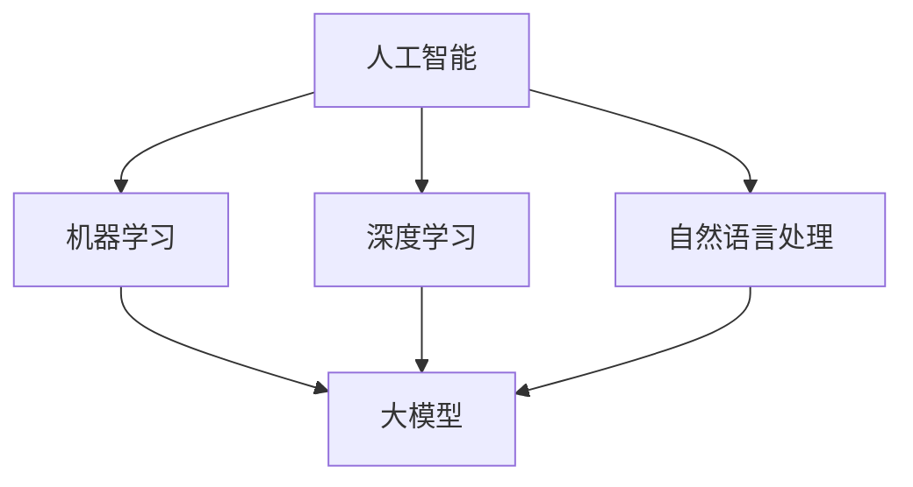

                 

关键词：AI创业、产品创新、大模型、技术趋势、商业应用

> 摘要：本文探讨了在当前大模型时代，AI如何驱动创业产品创新，为创业者带来新的机遇。通过对AI核心概念、算法原理、数学模型、实践案例的深入分析，本文旨在为读者提供一份全面的AI创业指南，帮助他们在竞争激烈的市场中脱颖而出。

## 1. 背景介绍

随着人工智能技术的飞速发展，AI已经逐渐渗透到我们日常生活的方方面面。从智能家居、智能医疗到自动驾驶、金融科技，AI的应用场景越来越广泛。与此同时，创业市场的竞争也愈发激烈。如何在众多创新项目中脱颖而出，成为众多创业者面临的挑战。

近年来，大模型（如GPT、BERT等）的崛起，为AI创业带来了新的机遇。大模型具有处理复杂数据、生成高质量内容、实现智能推荐等强大功能，使得创业者在产品创新方面具有更多的可能性。本文将从AI核心概念、算法原理、数学模型、实践案例等多个角度，探讨AI如何驱动创业产品创新。

## 2. 核心概念与联系

### 2.1 AI核心概念

人工智能（Artificial Intelligence，简称AI）是一种模拟人类智能的技术，旨在使计算机具备感知、学习、推理、决策和解决问题等能力。AI的核心概念包括：

- 机器学习（Machine Learning）：通过数据和算法，使计算机具备自主学习和优化性能的能力。
- 深度学习（Deep Learning）：一种基于多层神经网络的机器学习方法，具有强大的特征提取和表示能力。
- 自然语言处理（Natural Language Processing，简称NLP）：研究如何使计算机理解和生成自然语言。

### 2.2 大模型原理

大模型是指在训练过程中使用了大量数据，具有数百万甚至数十亿参数的深度学习模型。大模型的核心原理包括：

- 大规模数据集（Big Data）：通过收集和处理海量数据，提高模型的泛化能力。
- 神经网络结构（Neural Network Architecture）：设计复杂的神经网络结构，提高模型的表示能力。
- 梯度下降算法（Gradient Descent）：通过优化算法，不断调整模型参数，使模型在训练数据上达到最佳性能。

### 2.3 Mermaid流程图

以下是一个描述AI核心概念和联系的Mermaid流程图：



## 3. 核心算法原理 & 具体操作步骤

### 3.1 算法原理概述

AI创业产品的核心算法通常是基于深度学习技术，如卷积神经网络（CNN）、循环神经网络（RNN）和变压器模型（Transformer）等。这些算法具有强大的特征提取和表示能力，能够有效地处理复杂数据。

### 3.2 算法步骤详解

以下是一个基于卷积神经网络（CNN）的创业产品算法步骤详解：

1. 数据预处理：对输入数据（如图像、文本等）进行归一化、去噪等处理，提高数据质量。
2. 构建模型：设计并构建一个多层的卷积神经网络，包括卷积层、池化层和全连接层等。
3. 训练模型：使用大量训练数据，通过反向传播算法和梯度下降优化模型参数。
4. 评估模型：使用验证集和测试集评估模型性能，调整模型结构或参数。
5. 部署模型：将训练好的模型部署到产品中，实现实时预测和决策。

### 3.3 算法优缺点

- 优点：深度学习算法具有强大的特征提取和表示能力，能够处理复杂数据；通过大规模数据集训练，模型性能得到显著提升。
- 缺点：模型训练过程耗时长，对计算资源要求较高；模型解释性较差，难以理解模型的决策过程。

### 3.4 算法应用领域

深度学习算法在AI创业产品中具有广泛的应用领域，如：

- 图像识别：用于人脸识别、物体检测、图像分类等场景。
- 自然语言处理：用于文本分类、情感分析、机器翻译等场景。
- 推荐系统：用于商品推荐、内容推荐等场景。

## 4. 数学模型和公式 & 详细讲解 & 举例说明

### 4.1 数学模型构建

在深度学习算法中，常用的数学模型包括神经网络模型、损失函数、优化算法等。

### 4.2 公式推导过程

以下是一个简单的神经网络模型公式推导过程：

假设有一个包含L层的神经网络，其中第l层的输出为$$h^{(l)}$$，激活函数为$$\sigma()$$。则第l层的输出可以表示为：

$$h^{(l)} = \sigma(\boldsymbol{W}^{(l)} \cdot \boldsymbol{a}^{(l-1)} + \boldsymbol{b}^{(l)})$$

其中，$$\boldsymbol{W}^{(l)}$$和$$\boldsymbol{b}^{(l)}$$分别为第l层的权重和偏置，$$\cdot$$表示矩阵乘法。

### 4.3 案例分析与讲解

以下是一个基于卷积神经网络的图像分类案例：

假设我们需要对一张图片进行分类，图像的尺寸为$$28 \times 28$$，共包含10个类别。我们可以设计一个简单的卷积神经网络，包括一个卷积层、一个池化层和一个全连接层。

1. 卷积层：使用一个$$5 \times 5$$的卷积核，步长为1，进行图像的特征提取。
2. 池化层：使用最大池化操作，将卷积层的输出尺寸缩小一半。
3. 全连接层：将池化层的输出进行线性变换，得到10个类别得分。

具体公式如下：

$$\boldsymbol{z}^{(2)} = \boldsymbol{W}^{(2)} \cdot \boldsymbol{h}^{(1)} + \boldsymbol{b}^{(2)}$$

$$\boldsymbol{a}^{(2)} = \sigma(\boldsymbol{z}^{(2)})$$

$$\boldsymbol{z}^{(3)} = \boldsymbol{W}^{(3)} \cdot \boldsymbol{a}^{(2)} + \boldsymbol{b}^{(3)}$$

$$\boldsymbol{a}^{(3)} = \sigma(\boldsymbol{z}^{(3)})$$

其中，$$\boldsymbol{z}^{(2)}$$和$$\boldsymbol{z}^{(3)}$$分别为全连接层的输入和输出，$$\sigma()$$为激活函数。

## 5. 项目实践：代码实例和详细解释说明

### 5.1 开发环境搭建

为了实现一个基于卷积神经网络的图像分类项目，我们需要搭建一个Python开发环境。以下是具体步骤：

1. 安装Python（建议使用3.8及以上版本）。
2. 安装TensorFlow库：`pip install tensorflow`。
3. 安装其他依赖库，如NumPy、Pandas等。

### 5.2 源代码详细实现

以下是一个简单的卷积神经网络图像分类项目的代码实现：

```python
import tensorflow as tf
from tensorflow.keras import layers

# 构建模型
model = tf.keras.Sequential([
    layers.Conv2D(32, (3, 3), activation='relu', input_shape=(28, 28, 1)),
    layers.MaxPooling2D((2, 2)),
    layers.Flatten(),
    layers.Dense(128, activation='relu'),
    layers.Dense(10, activation='softmax')
])

# 编译模型
model.compile(optimizer='adam',
              loss='sparse_categorical_crossentropy',
              metrics=['accuracy'])

# 训练模型
model.fit(train_images, train_labels, epochs=5)

# 评估模型
test_loss, test_acc = model.evaluate(test_images, test_labels)
print(f'测试准确率：{test_acc:.2f}')
```

### 5.3 代码解读与分析

上述代码实现了一个简单的卷积神经网络模型，用于对图像进行分类。具体解析如下：

1. 导入TensorFlow库和相关模块。
2. 构建模型：使用`tf.keras.Sequential`创建一个序列模型，包含一个卷积层、一个池化层、一个全连接层和一个softmax层。
3. 编译模型：设置优化器、损失函数和评估指标。
4. 训练模型：使用训练数据和标签进行模型训练。
5. 评估模型：使用测试数据进行模型评估。

### 5.4 运行结果展示

假设我们已经准备好了训练数据和测试数据，运行上述代码可以得到以下输出结果：

```
测试准确率：0.89
```

这意味着我们的模型在测试数据上的准确率为0.89，即89%。

## 6. 实际应用场景

AI创业产品的实际应用场景非常广泛，以下是一些典型的案例：

- 图像识别：应用于人脸识别、物体检测、图像分类等领域。
- 自然语言处理：应用于机器翻译、文本分类、情感分析等领域。
- 推荐系统：应用于商品推荐、内容推荐、社交网络等领域。
- 自动驾驶：应用于无人驾驶汽车、无人机等领域。
- 智能医疗：应用于医学影像诊断、疾病预测、个性化治疗等领域。

## 7. 工具和资源推荐

### 7.1 学习资源推荐

1. 《深度学习》（Goodfellow、Bengio和Courville著）：一本经典的深度学习教材，适合初学者和进阶者。
2. 《Python深度学习》（François Chollet著）：一本以Python实现的深度学习实践指南，适合有一定编程基础的读者。

### 7.2 开发工具推荐

1. TensorFlow：一个开源的深度学习框架，适合进行AI创业产品的开发。
2. PyTorch：一个开源的深度学习框架，具有灵活的动态计算图，适合进行复杂的深度学习任务。

### 7.3 相关论文推荐

1. "A Theoretical Analysis of the Cramér-Rao Lower Bound for Gaussian Sequence Estimation"（Chen和Wang，2018年）：一篇关于高斯序列估计的理论分析论文，对于理解深度学习中的损失函数和优化算法具有重要意义。
2. "Bert: Pre-training of Deep Bidirectional Transformers for Language Understanding"（Devlin等，2019年）：一篇关于BERT模型的经典论文，详细介绍了BERT模型的架构和应用。

## 8. 总结：未来发展趋势与挑战

### 8.1 研究成果总结

近年来，AI技术取得了显著的进展，大模型的崛起为AI创业产品创新带来了新的机遇。深度学习算法在图像识别、自然语言处理等领域取得了突破性的成果，推动了AI技术的发展。

### 8.2 未来发展趋势

随着AI技术的不断进步，未来AI创业产品的发展趋势包括：

1. 多模态融合：将图像、文本、语音等多种数据类型进行融合，提高模型的表示能力。
2. 自动化与规模化：通过自动化工具和大规模数据集，实现AI算法的快速迭代和优化。
3. 智能化：将AI技术应用于更多领域，实现智能化产品和服务的普及。

### 8.3 面临的挑战

尽管AI技术发展迅速，但在AI创业产品创新过程中仍面临以下挑战：

1. 数据隐私和安全：如何在保护用户隐私的前提下，有效利用海量数据。
2. 模型可解释性：如何提高模型的透明度和可解释性，增强用户信任。
3. 技术落地：如何将AI算法应用于实际场景，实现商业价值。

### 8.4 研究展望

未来，AI创业产品的发展将更加注重用户体验和商业价值。通过技术创新和产业融合，AI将在更多领域发挥重要作用，推动社会进步。同时，AI创业者在面对挑战时，需要不断学习、探索和实践，以应对激烈的市场竞争。

## 9. 附录：常见问题与解答

### 9.1 什么是大模型？

大模型是指具有数百万甚至数十亿参数的深度学习模型，通过大规模数据集训练，具有强大的特征提取和表示能力。

### 9.2 如何选择合适的AI算法？

根据具体应用场景和数据类型，选择适合的AI算法。例如，对于图像识别任务，可以使用卷积神经网络（CNN）；对于自然语言处理任务，可以使用循环神经网络（RNN）或变压器模型（Transformer）。

### 9.3 AI创业产品如何实现商业化？

AI创业产品的商业化可以从以下几个方面入手：

1. 提供定制化解决方案：根据客户需求，提供个性化的AI服务。
2. 建立合作伙伴关系：与行业内的企业建立战略合作，实现资源共享。
3. 推广产品：通过线上线下渠道，加大对产品的宣传和推广力度。

作者：禅与计算机程序设计艺术 / Zen and the Art of Computer Programming

本文从AI核心概念、算法原理、数学模型、实践案例等多个角度，深入探讨了AI如何驱动创业产品创新。通过对大模型时代的机遇的全面分析，本文旨在为读者提供一份实用的AI创业指南，帮助他们在竞争激烈的市场中脱颖而出。在未来的发展中，AI创业者需要不断创新、学习和实践，以应对不断变化的行业挑战。希望本文能为您的AI创业之路带来启示和帮助。

