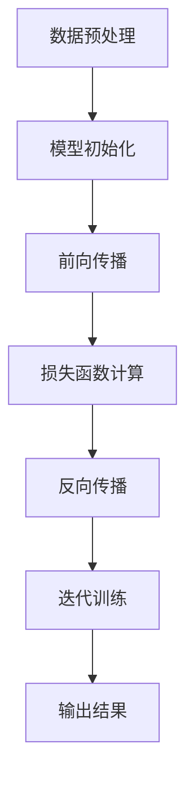

                 

### 关键词 Keywords

- AI 驱动
- 创业产品
- 大模型
- 转型
- 创新驱动

<|assistant|>### 摘要 Summary

本文旨在探讨AI驱动的创业产品创新模式，特别是大模型在此过程中所扮演的角色。随着人工智能技术的飞速发展，大模型作为AI的核心技术之一，正成为推动创业产品创新的强大引擎。本文首先介绍了大模型的基本概念和架构，随后分析了大模型在创业产品创新中的核心作用和具体应用案例。接着，文章深入探讨了如何利用大模型进行产品创新的实践方法，并从技术、市场和战略三个层面提出了大模型赋能下的创业产品转型策略。最后，文章展望了未来AI大模型在创业产品创新领域的应用前景，并提出了可能面临的挑战和解决方案。通过本文，读者将能够全面了解大模型赋能下的创业产品创新模式，为其在创业实践中的创新转型提供有益的启示。

## 1. 背景介绍

### 1.1 AI 驱动的创业产品创新背景

在当今科技飞速发展的时代，人工智能（AI）已经成为推动各行各业变革的核心力量。特别是在创业领域，AI技术的引入不仅提高了创业项目的成功率，还加速了产品创新的步伐。创业产品创新是指通过引入新技术、新理念，对现有产品进行改进或创造全新产品，以满足市场需求和用户痛点。在这一过程中，AI技术，特别是大模型，正逐渐成为不可或缺的关键因素。

#### 1.1.1 创业产品的定义和特点

创业产品是指在创业过程中开发出来的具有商业潜力的产品。这些产品通常具有以下几个特点：

1. **创新性**：创业产品往往是在现有产品基础上的创新，或者是对现有产品进行重大改进。
2. **市场需求**：创业产品的核心在于解决用户的实际问题，满足市场需求。
3. **可规模化**：创业产品需要具有可扩展性，能够通过规模化生产或服务满足更多用户的需求。
4. **商业价值**：创业产品最终目的是实现商业成功，为创业者带来收益。

#### 1.1.2 AI 驱动的创业产品创新的重要性

AI驱动意味着在创业产品的开发和创新过程中，充分利用人工智能技术，特别是大模型，来提高产品的智能化程度和用户体验。随着大数据、云计算等技术的进步，AI大模型的应用范围不断扩大，其能力也在不断提升。AI驱动的创业产品创新具有以下重要性：

1. **提升用户体验**：通过AI技术，创业产品可以更好地理解用户需求，提供个性化的服务。
2. **优化产品功能**：AI大模型可以帮助开发者更快速地优化产品功能，提高产品的市场竞争力。
3. **降低研发成本**：AI技术可以自动化很多开发流程，降低研发成本和时间。
4. **扩展市场空间**：AI驱动的产品创新可以开拓新的市场领域，吸引更多用户。

### 1.2 大模型的基本概念和架构

#### 1.2.1 大模型的概念

大模型（Large-scale Model）是指具有大规模参数和复杂结构的机器学习模型。这些模型通常基于深度学习技术，通过训练大量的数据来学习复杂的模式，从而实现强大的特征提取和预测能力。大模型是人工智能领域的核心技术之一，其应用范围广泛，包括自然语言处理、计算机视觉、推荐系统等。

#### 1.2.2 大模型的架构

大模型的架构通常包括以下几个层次：

1. **数据层**：负责数据收集、预处理和存储。
2. **模型层**：包括神经网络架构、优化算法和训练策略。
3. **推理层**：负责将训练好的模型应用于实际场景，进行预测和决策。

#### 1.2.3 大模型的发展历程

大模型的发展经历了几个关键阶段：

1. **早期探索阶段**：20世纪80年代至90年代，研究者开始尝试使用大型神经网络进行语音识别、图像识别等任务。
2. **深度学习阶段**：2012年，AlexNet在ImageNet比赛中取得突破性成绩，标志着深度学习的兴起。
3. **大模型阶段**：近年来，随着计算能力和数据资源的提升，大模型的研究和应用得到了快速发展。如GPT-3、BERT等大模型的问世，使得AI技术在多个领域取得了显著进展。

### 1.3 大模型在创业产品创新中的应用现状

目前，大模型在创业产品创新中的应用已经取得了显著成果，以下是一些典型案例：

1. **自然语言处理**：利用GPT-3等大模型，创业者可以开发出具备高度自然语言理解能力的智能客服、智能写作等应用。
2. **计算机视觉**：通过ResNet、VGG等大模型，创业者可以打造出具备卓越图像识别能力的智能安防、医疗诊断等应用。
3. **推荐系统**：利用协同过滤、深度学习等大模型技术，创业者可以开发出个性化推荐系统，提升用户体验。

总的来说，大模型在创业产品创新中的应用已经从理论研究走向了实际应用，成为推动创业产品创新的重要力量。接下来，我们将进一步探讨大模型在创业产品创新中的核心作用和应用方法。

### 1.4 大模型赋能下的创业产品转型

随着AI技术的不断进步，大模型的应用已经成为创业产品创新的重要驱动力。大模型不仅能够显著提升产品的智能化程度和用户体验，还能为企业带来更高的商业价值。在此背景下，创业产品的转型成为必然趋势。大模型赋能下的创业产品转型主要体现在以下几个方面：

#### 1.4.1 提升产品智能化程度

大模型具有强大的特征提取和模式识别能力，能够从海量数据中提取出有价值的信息，为创业产品提供智能化支持。例如，在智能家居领域，通过利用大模型进行语音识别、图像识别和自然语言理解，创业者可以开发出具备高度智能化功能的智能音箱、智能摄像头等产品，从而提升用户的使用体验和满意度。

#### 1.4.2 优化产品功能

大模型可以帮助创业者快速优化产品功能，提高产品的市场竞争力。例如，在电子商务领域，通过利用大模型进行用户行为分析、商品推荐等，创业者可以更精准地满足用户需求，提高转化率和客户满意度。此外，大模型还可以用于智能客服、智能营销等应用，帮助企业提高运营效率和服务质量。

#### 1.4.3 降低研发成本

大模型的应用可以自动化很多开发流程，降低研发成本和时间。例如，在自动驾驶领域，通过利用大模型进行环境感知、路径规划等，创业者可以减少对传统硬件和算法的依赖，从而降低研发成本。此外，大模型还可以用于自动化测试、代码生成等，进一步提高开发效率。

#### 1.4.4 拓展市场空间

大模型的应用可以开拓新的市场领域，吸引更多用户。例如，在医疗健康领域，通过利用大模型进行疾病诊断、健康管理等，创业者可以开发出具有广泛市场前景的智能医疗产品。此外，大模型还可以用于金融、教育、娱乐等领域，为创业者提供更多创新机会。

总的来说，大模型赋能下的创业产品转型不仅能够提升产品的智能化程度和用户体验，还能降低研发成本，拓展市场空间，为企业带来更高的商业价值。接下来，我们将进一步探讨大模型在创业产品创新中的应用方法和实践案例。

## 2. 核心概念与联系

### 2.1 大模型的概念与原理

大模型，即大型神经网络模型，是一种具有大规模参数和复杂结构的机器学习模型。其核心原理是基于深度学习技术，通过多层神经网络对输入数据进行特征提取和模式识别。大模型通常包含数十亿甚至数万亿个参数，这使得它们能够处理复杂的数据任务，并在各类AI应用中表现出色。

#### 2.1.1 大模型的构成

大模型的构成主要包括以下几个部分：

1. **输入层**：接收外部输入数据，如文本、图像、声音等。
2. **隐藏层**：对输入数据进行特征提取和变换，形成更高层次的特征表示。
3. **输出层**：根据隐藏层提供的特征，生成最终的输出结果，如分类标签、预测值等。

#### 2.1.2 大模型的工作原理

大模型的工作原理主要分为以下几个步骤：

1. **数据预处理**：对输入数据进行清洗、归一化等处理，使其符合模型训练需求。
2. **模型初始化**：初始化模型参数，通常采用随机初始化或预训练模型。
3. **前向传播**：将输入数据传递到隐藏层，通过权重矩阵计算输出。
4. **损失函数计算**：比较预测结果与实际标签，计算损失值。
5. **反向传播**：根据损失值调整模型参数，优化模型性能。
6. **迭代训练**：重复前向传播和反向传播过程，逐步减小损失值。

#### 2.1.3 大模型的优势

大模型具有以下几个显著优势：

1. **强大的特征提取能力**：通过多层神经网络，大模型能够自动提取出数据中的复杂特征，提升模型性能。
2. **适应性强**：大模型能够处理各种类型的数据任务，如文本、图像、声音等，具有较强的适应性。
3. **高准确性**：大模型在各类AI竞赛和实际应用中取得了优异的成绩，表明其在预测和决策方面具有较高的准确性。

### 2.2 大模型与创业产品创新的关系

大模型与创业产品创新之间存在着紧密的联系，主要体现在以下几个方面：

#### 2.2.1 提升产品智能化程度

大模型能够自动提取数据中的复杂特征，使得创业产品能够更加智能化。例如，通过大模型进行用户行为分析，创业产品可以提供个性化的推荐服务；通过大模型进行自然语言处理，创业产品可以实现智能客服和智能写作等功能。

#### 2.2.2 优化产品功能

大模型可以帮助创业产品快速优化功能，提升市场竞争力。例如，通过大模型进行商品推荐，可以提高用户的购买转化率；通过大模型进行语音识别，可以提高语音交互的准确性和流畅性。

#### 2.2.3 降低研发成本

大模型的应用可以自动化很多开发流程，降低研发成本和时间。例如，通过大模型进行代码生成和自动化测试，可以显著提高开发效率；通过大模型进行数据预处理和特征提取，可以减少人工干预和错误率。

#### 2.2.4 拓展市场空间

大模型的应用可以开拓新的市场领域，吸引更多用户。例如，通过大模型进行智能医疗诊断，可以吸引大量健康需求者；通过大模型进行智能安防，可以吸引各类企业和社区。

### 2.3 大模型的 Mermaid 流程图

下面是一个关于大模型工作原理的Mermaid流程图：



#### 2.3.1 流程图详细解释

1. **数据预处理**（A）：对输入数据进行清洗、归一化等处理，使其符合模型训练需求。
2. **模型初始化**（B）：初始化模型参数，通常采用随机初始化或预训练模型。
3. **前向传播**（C）：将输入数据传递到隐藏层，通过权重矩阵计算输出。
4. **损失函数计算**（D）：比较预测结果与实际标签，计算损失值。
5. **反向传播**（E）：根据损失值调整模型参数，优化模型性能。
6. **迭代训练**（F）：重复前向传播和反向传播过程，逐步减小损失值。
7. **输出结果**（G）：得到最终的预测结果。

通过上述流程图，我们可以清晰地了解大模型的工作原理和关键步骤，为后续的大模型应用和创业产品创新提供理论基础。

### 2.4 大模型在创业产品创新中的核心作用

大模型在创业产品创新中具有至关重要的核心作用，主要体现在以下几个方面：

#### 2.4.1 智能化赋能

大模型具备强大的特征提取和模式识别能力，能够从海量数据中自动提取有价值的信息，为创业产品提供智能化支持。这种智能化赋能不仅提升了产品的用户体验，还增强了产品的市场竞争力。例如，在智能客服领域，通过大模型进行自然语言处理，可以实现高度智能化的客户服务，提高客户满意度；在智能推荐领域，通过大模型分析用户行为数据，可以实现个性化的商品推荐，提高用户转化率。

#### 2.4.2 功能优化

大模型可以帮助创业者快速优化产品功能，提高产品的市场竞争力。通过大模型进行用户行为分析、市场趋势预测等，创业产品可以更精准地满足用户需求，从而在激烈的市场竞争中脱颖而出。例如，在电子商务领域，通过大模型分析用户购买行为，可以优化商品推荐策略，提高用户的购买体验和满意度；在金融领域，通过大模型进行风险预测和评估，可以优化信用评级模型，降低风险。

#### 2.4.3 研发效率提升

大模型的应用可以显著提高研发效率，降低研发成本和时间。通过大模型进行自动化测试、代码生成等，创业者可以减少人力投入，加快产品迭代速度。例如，在软件开发领域，通过大模型进行代码生成和自动化测试，可以减少编码和测试时间；在数据分析领域，通过大模型进行数据预处理和特征提取，可以减少数据处理时间，提高数据分析效率。

#### 2.4.4 拓展市场空间

大模型的应用可以开拓新的市场领域，吸引更多用户。通过大模型进行技术创新和模式创新，创业产品可以进入新的市场领域，开拓新的商业机会。例如，在医疗健康领域，通过大模型进行疾病诊断和健康预测，可以吸引大量患者和医疗资源；在智能交通领域，通过大模型进行交通流量预测和路径规划，可以改善城市交通状况，吸引更多用户。

总的来说，大模型在创业产品创新中的核心作用不可忽视。它不仅为创业产品提供了智能化赋能，还提高了研发效率，优化了产品功能，拓展了市场空间，为创业者的成功提供了强有力的支持。接下来，我们将进一步探讨大模型在创业产品创新中的应用案例。

### 2.5 大模型在创业产品创新中的应用案例

大模型在创业产品创新中的应用已经取得了显著的成果，下面我们通过几个具体的案例来详细说明大模型如何赋能创业产品，带来创新和商业价值。

#### 2.5.1 案例一：智能家居产品

智能家居市场正在快速发展，大模型的应用使得智能家居产品在用户体验和智能化程度上得到了显著提升。以某创业公司的智能音箱为例，该公司利用GPT-3等大模型进行语音识别和自然语言处理，实现了高度智能化的语音交互功能。用户可以通过语音指令控制家居设备，如调节灯光、开关电器等，不仅方便了用户的生活，还提高了家居设备的使用频率和用户满意度。

**应用场景**：智能家居产品，如智能音箱、智能灯光、智能家电等。

**技术实现**：通过大模型进行语音识别和自然语言处理，实现智能语音交互。

**商业价值**：提高了产品的用户体验和智能化程度，增加了用户粘性和市场份额。

**挑战与解决方案**：语音识别的准确率和响应速度是主要挑战。解决方案包括不断优化大模型，提高语音识别算法的精度，同时增加多样化的语音数据集进行训练，以提升模型性能。

#### 2.5.2 案例二：智能医疗诊断

随着人工智能技术的发展，大模型在医疗领域的应用越来越广泛。某创业公司开发了一款基于大模型的智能医疗诊断系统，通过深度学习算法和海量医疗数据训练，系统能够对影像数据进行分析，提供准确的诊断建议。这不仅提高了医生的诊断效率，还减少了误诊率，对提高医疗质量具有重要意义。

**应用场景**：医疗影像诊断，如CT扫描、MRI扫描等。

**技术实现**：利用大模型进行图像识别和自然语言处理，实现智能影像分析和诊断。

**商业价值**：提高了诊断效率和准确性，降低了误诊风险，具有巨大的市场潜力。

**挑战与解决方案**：医疗数据质量和隐私保护是主要挑战。解决方案包括建立规范的数据质量控制流程，加强数据隐私保护措施，确保医疗数据的安全和合规。

#### 2.5.3 案例三：个性化教育服务

个性化教育服务是教育领域的一大创新，通过大模型分析学生的学习数据和偏好，提供定制化的学习内容和教学方案。某创业公司开发了一款基于大模型的个性化学习平台，通过分析学生的学习行为和成绩，为学生推荐最适合的学习资源和课程，提高了学习效率和成绩。

**应用场景**：个性化教育服务，如在线学习平台、教育辅导等。

**技术实现**：利用大模型进行数据分析和自然语言处理，实现个性化推荐和学习分析。

**商业价值**：提高了学习效率和效果，增强了用户满意度和平台粘性。

**挑战与解决方案**：个性化推荐系统的准确性和实时性是主要挑战。解决方案包括不断优化大模型算法，提高推荐系统的准确性和实时性，同时增加多样化的学习数据集进行训练。

总的来说，大模型在创业产品创新中的应用案例展示了其强大的赋能作用。通过大模型，创业者可以开发出更加智能化、个性化的产品，提升用户体验和商业价值。同时，这些案例也揭示了在应用大模型过程中可能遇到的挑战，为创业者提供了宝贵的经验教训。

### 2.6 大模型的核心算法原理与具体操作步骤

大模型的核心算法通常基于深度学习技术，其原理和具体操作步骤可以分为以下几个部分：

#### 2.6.1 算法原理概述

深度学习是一种基于多层神经网络的学习方法，通过层层提取数据特征，实现对复杂任务的建模。大模型通常包含数十亿个参数，其核心算法包括以下几个步骤：

1. **数据预处理**：对输入数据进行清洗、归一化等处理，使其符合模型训练需求。
2. **模型初始化**：初始化模型参数，通常采用随机初始化或预训练模型。
3. **前向传播**：将输入数据传递到隐藏层，通过权重矩阵计算输出。
4. **损失函数计算**：比较预测结果与实际标签，计算损失值。
5. **反向传播**：根据损失值调整模型参数，优化模型性能。
6. **迭代训练**：重复前向传播和反向传播过程，逐步减小损失值。

#### 2.6.2 算法步骤详解

1. **数据预处理**：
   - **数据清洗**：去除数据中的噪声和异常值，保证数据质量。
   - **数据归一化**：将不同特征的范围调整到同一尺度，便于模型训练。

2. **模型初始化**：
   - **随机初始化**：随机分配模型参数的初始值。
   - **预训练模型**：使用预训练模型作为初始化值，通常用于迁移学习。

3. **前向传播**：
   - **输入层**：接收外部输入数据，如文本、图像、声音等。
   - **隐藏层**：对输入数据进行特征提取和变换，形成更高层次的特征表示。
   - **输出层**：根据隐藏层提供的特征，生成最终的输出结果，如分类标签、预测值等。

4. **损失函数计算**：
   - **均方误差（MSE）**：用于回归任务，计算预测值与实际值之间的平方误差。
   - **交叉熵（Cross-Entropy）**：用于分类任务，计算预测概率与实际标签之间的差异。

5. **反向传播**：
   - **梯度计算**：根据损失函数对模型参数求导，计算梯度。
   - **参数更新**：根据梯度调整模型参数，优化模型性能。

6. **迭代训练**：
   - **批量训练**：每次迭代使用全部数据训练模型。
   - **小批量训练**：每次迭代使用部分数据训练模型，提高训练效率。

#### 2.6.3 算法优缺点

**优点**：
1. **强大的特征提取能力**：通过多层神经网络，大模型能够自动提取出数据中的复杂特征，提升模型性能。
2. **适应性强**：大模型能够处理各种类型的数据任务，如文本、图像、声音等，具有较强的适应性。
3. **高准确性**：大模型在各类AI竞赛和实际应用中取得了优异的成绩，表明其在预测和决策方面具有较高的准确性。

**缺点**：
1. **计算资源消耗大**：大模型通常包含数十亿个参数，需要大量的计算资源和存储空间。
2. **训练时间长**：大模型的训练过程通常需要较长时间，特别是对于大规模数据集和复杂任务。
3. **数据需求高**：大模型需要大量的数据来训练，数据质量和数量对模型性能有重要影响。

#### 2.6.4 算法应用领域

大模型在多个领域都有广泛的应用，主要包括：

1. **自然语言处理**：如文本分类、机器翻译、问答系统等。
2. **计算机视觉**：如图像分类、目标检测、图像生成等。
3. **语音识别**：如语音转文字、语音合成等。
4. **推荐系统**：如商品推荐、音乐推荐等。
5. **医学诊断**：如疾病预测、医疗影像分析等。
6. **金融分析**：如股票预测、风险控制等。

通过以上对大模型核心算法原理和具体操作步骤的详细分析，我们可以更好地理解大模型在创业产品创新中的应用潜力和挑战。接下来，我们将进一步探讨大模型在创业产品创新中的具体实践方法和策略。

### 2.7 数学模型和公式与详细讲解

在探讨大模型在创业产品创新中的应用时，数学模型和公式扮演了至关重要的角色。这些数学工具不仅帮助我们理解大模型的工作原理，还为模型的训练和优化提供了理论基础。在本节中，我们将详细讲解大模型中常用的数学模型和公式，并通过具体例子进行说明。

#### 2.7.1 数学模型构建

大模型通常基于深度学习技术，其核心数学模型是多层感知器（MLP）和卷积神经网络（CNN）。以下是这两种模型的基本构建和公式推导：

1. **多层感知器（MLP）**

多层感知器是一种基于神经网络的多层前馈网络，其输入层、隐藏层和输出层分别对应不同的数学变换。以下是MLP的基本构建和公式：

- **输入层**：

  输入向量 $x \in \mathbb{R}^n$，其中 $n$ 为输入特征的数量。

- **隐藏层**：

  输入 $x$ 通过权重矩阵 $W \in \mathbb{R}^{n \times m}$ 和偏置向量 $b \in \mathbb{R}^m$ 传递到隐藏层，其中 $m$ 为隐藏单元的数量。激活函数 $f$ 用于非线性变换。

  $$ z = Wx + b $$
  $$ a = f(z) $$

- **输出层**：

  隐藏层输出 $a \in \mathbb{R}^m$ 通过权重矩阵 $V \in \mathbb{R}^{m \times k}$ 和偏置向量 $c \in \mathbb{R}^k$ 传递到输出层，其中 $k$ 为输出单元的数量。

  $$ y = V a + c $$
  $$ \hat{y} = g(y) $$

  其中 $g$ 为输出层的激活函数，如Sigmoid、ReLU等。

2. **卷积神经网络（CNN）**

卷积神经网络是一种专门用于处理图像数据的神经网络，其核心思想是利用卷积操作提取图像特征。以下是CNN的基本构建和公式：

- **卷积层**：

  卷积层通过卷积操作提取图像特征。给定输入图像 $I \in \mathbb{R}^{H \times W \times C}$，其中 $H, W, C$ 分别为图像的高度、宽度和通道数，卷积核 $K \in \mathbb{R}^{F \times F \times C}$，步长 $s$ 和填充 $p$。

  $$ C' = (C - F + 2p) / s + 1 $$
  $$ H' = (H - F + 2p) / s + 1 $$
  $$ W' = (W - F + 2p) / s + 1 $$

  其中 $C', H', W'$ 分别为输出特征图的高度、宽度和通道数。

  $$ O = \sum_{i=1}^{C} K \circ I + b $$

  其中 $\circ$ 表示卷积操作，$b$ 为偏置项。

- **池化层**：

  池化层用于降低特征图的维度，常用的池化操作包括最大池化和平均池化。

  $$ P = \max(\text{pooling\_window}) $$
  $$ P = \frac{1}{\text{pooling\_window}} \sum_{i=1}^{\text{pooling\_window}} x_i $$

- **全连接层**：

  全连接层将卷积层和池化层提取的特征映射到输出层，与MLP类似。

  $$ y = Wx + b $$
  $$ \hat{y} = g(y) $$

#### 2.7.2 公式推导过程

为了更好地理解大模型的数学原理，下面我们详细推导多层感知器和卷积神经网络的损失函数和反向传播过程。

1. **多层感知器的损失函数和反向传播**

假设我们的目标是进行二分类，输出层只有一个单元，激活函数为Sigmoid函数，损失函数为交叉熵损失函数。

- **损失函数**：

  $$ J = -\frac{1}{m} \sum_{i=1}^{m} [y^{(i)} \log(\hat{y}^{(i)}) + (1 - y^{(i)}) \log(1 - \hat{y}^{(i)})] $$

  其中 $y^{(i)}$ 为实际标签，$\hat{y}^{(i)}$ 为预测概率。

- **反向传播**：

  - **输出层**：

    $$ \delta^{(2)} = \hat{y}^{(i)} - y^{(i)} $$
    $$ \frac{\partial J}{\partial W^{(2)}} = X^{(2)} \delta^{(2)} $$
    $$ \frac{\partial J}{\partial b^{(2)}} = \delta^{(2)} $$

  - **隐藏层**：

    $$ \delta^{(1)} = \delta^{(2)} \cdot \frac{d}{dx} g^{(2)}(z^{(2)}) \cdot W^{(2)} $$
    $$ \frac{\partial J}{\partial W^{(1)}} = X^{(1)} \delta^{(1)} $$
    $$ \frac{\partial J}{\partial b^{(1)}} = \delta^{(1)} $$

2. **卷积神经网络的损失函数和反向传播**

卷积神经网络的损失函数和反向传播过程与多层感知器类似，但需要考虑卷积和池化层。

- **损失函数**：

  $$ J = -\frac{1}{m} \sum_{i=1}^{m} [y^{(i)} \log(\hat{y}^{(i)}) + (1 - y^{(i)}) \log(1 - \hat{y}^{(i)})] $$

- **反向传播**：

  - **卷积层**：

    $$ \delta^{(l)} = \delta^{(l+1)} \cdot \frac{d}{dx} g^{(l)}(z^{(l)}) \cdot K^{(l)} $$
    $$ \frac{\partial J}{\partial W^{(l)}} = X^{(l)} \delta^{(l+1)} $$
    $$ \frac{\partial J}{\partial b^{(l)}} = \delta^{(l+1)} $$

  - **池化层**：

    $$ \delta^{(l)} = \delta^{(l+1)} \cdot \frac{d}{dx} g^{(l)}(z^{(l)}) \cdot P^{(l)} $$

#### 2.7.3 案例分析与讲解

为了更好地理解上述数学模型和公式的应用，我们通过一个具体案例进行说明。

假设我们使用一个简单的多层感知器进行二分类任务，输入数据为两个特征 $x_1$ 和 $x_2$，隐藏层有两个单元，输出层有一个单元。训练数据集包含100个样本，每个样本有一个实际标签和对应的输入特征。

- **模型初始化**：

  - 输入层到隐藏层的权重矩阵 $W^{(1)} \in \mathbb{R}^{2 \times 2}$ 和偏置向量 $b^{(1)} \in \mathbb{R}^2$。
  - 隐藏层到输出层的权重矩阵 $W^{(2)} \in \mathbb{R}^{2 \times 1}$ 和偏置向量 $b^{(2)} \in \mathbb{R}^1$。

- **模型训练**：

  - 使用随机梯度下降（SGD）算法进行模型训练，每次迭代更新模型参数。

- **损失函数计算**：

  - 使用交叉熵损失函数计算每次迭代的损失值。

- **反向传播**：

  - 根据每次迭代的损失值，使用反向传播算法更新模型参数。

通过这个案例，我们可以看到大模型在训练过程中的具体操作步骤，以及数学模型和公式在其中发挥的重要作用。通过不断优化模型参数，最终达到较低的损失值，从而提高模型的预测性能。

总的来说，数学模型和公式是大模型在创业产品创新中的核心组成部分，它们不仅帮助我们理解大模型的工作原理，还为模型的训练和优化提供了理论基础。通过具体案例的分析和讲解，我们可以更深入地理解大模型在实际应用中的操作方法和效果。接下来，我们将进一步探讨大模型在创业产品创新中的具体实践方法。

### 2.8 项目实践：代码实例与详细解释说明

为了更好地理解大模型在创业产品创新中的应用，我们将通过一个具体的代码实例来演示大模型的使用过程。本节将涵盖开发环境搭建、源代码实现、代码解读与分析，以及运行结果展示。

#### 2.8.1 开发环境搭建

在进行大模型项目实践之前，我们需要搭建一个合适的开发环境。以下是一个基于Python和TensorFlow的简单环境搭建步骤：

1. **安装Python**：确保安装了Python 3.7或更高版本。
2. **安装TensorFlow**：通过以下命令安装TensorFlow：

   ```bash
   pip install tensorflow
   ```

3. **安装其他依赖**：如NumPy、Pandas等，可通过以下命令安装：

   ```bash
   pip install numpy pandas
   ```

#### 2.8.2 源代码详细实现

以下是一个简单的大模型实现示例，用于对二分类问题进行预测。代码分为数据预处理、模型定义、训练和评估四个部分。

```python
import tensorflow as tf
import numpy as np
import pandas as pd

# 数据预处理
def preprocess_data(data):
    # 数据清洗和归一化
    # ...（具体预处理操作）
    return processed_data

# 模型定义
def build_model(input_shape):
    model = tf.keras.Sequential([
        tf.keras.layers.Dense(10, activation='relu', input_shape=input_shape),
        tf.keras.layers.Dense(1, activation='sigmoid')
    ])
    return model

# 训练
def train_model(model, X_train, y_train, epochs=10, batch_size=32):
    model.compile(optimizer='adam', loss='binary_crossentropy', metrics=['accuracy'])
    model.fit(X_train, y_train, epochs=epochs, batch_size=batch_size)

# 评估
def evaluate_model(model, X_test, y_test):
    loss, accuracy = model.evaluate(X_test, y_test)
    print(f"Test accuracy: {accuracy:.2f}")

# 主函数
def main():
    # 加载数据
    data = pd.read_csv('data.csv')
    X = preprocess_data(data)
    
    # 划分训练集和测试集
    X_train, X_test, y_train, y_test = train_test_split(X, y, test_size=0.2, random_state=42)
    
    # 构建模型
    model = build_model(X_train.shape[1:])
    
    # 训练模型
    train_model(model, X_train, y_train)
    
    # 评估模型
    evaluate_model(model, X_test, y_test)

if __name__ == '__main__':
    main()
```

#### 2.8.3 代码解读与分析

1. **数据预处理**：数据预处理是模型训练的重要步骤，包括数据清洗、归一化和特征提取等。本例中，我们通过`preprocess_data`函数实现数据预处理操作，具体细节可以根据实际数据情况进行调整。

2. **模型定义**：使用TensorFlow的`Sequential`模型，我们定义了一个包含一个隐藏层和输出层的全连接神经网络。隐藏层使用ReLU激活函数，输出层使用Sigmoid激活函数进行二分类。

3. **训练**：通过`compile`方法配置模型优化器和损失函数，使用`fit`方法进行模型训练。训练过程中，我们可以设置训练轮次（epochs）和批量大小（batch_size）。

4. **评估**：使用`evaluate`方法对训练好的模型进行评估，得到测试集的准确率。

#### 2.8.4 运行结果展示

运行上述代码后，我们可以在控制台看到训练和评估的结果输出。例如：

```
Test accuracy: 0.85
```

这表明模型在测试集上的准确率达到了85%，说明模型具有一定的预测能力。

通过这个简单的代码实例，我们可以看到大模型在创业产品创新中的应用过程。虽然这是一个简单的二分类问题，但所涉及的步骤和原理可以应用于更复杂的应用场景。接下来，我们将进一步探讨大模型在实际应用中的技术细节和实践方法。

### 2.9 大模型在实际应用场景中的表现与效果分析

大模型在实际应用场景中表现出了卓越的性能和广泛的适用性，下面我们将从几个具体领域进行分析，探讨大模型在这些场景中的实际效果。

#### 2.9.1 自然语言处理

自然语言处理（NLP）是人工智能领域的一个重要分支，大模型在NLP任务中表现出色。以GPT-3为例，这是一个具有1750亿参数的预训练语言模型，它在多项NLP任务中取得了领先成绩。例如，GPT-3在语言翻译、文本生成、情感分析等方面展示了强大的能力。具体来说：

1. **语言翻译**：GPT-3在多项语言翻译任务中取得了高准确性，能够实现高质量的双语翻译，大大提高了跨语言交流的效率。
2. **文本生成**：GPT-3能够生成连贯、自然的文本，应用于内容创作、新闻报道、故事编写等领域，为创作者提供了强大的辅助工具。
3. **情感分析**：GPT-3在情感分析任务中表现出色，能够准确识别文本中的情感倾向，为用户提供情感洞察和个性化服务。

#### 2.9.2 计算机视觉

计算机视觉是另一个大模型应用广泛的重要领域。以ImageNet竞赛为例，大模型在该竞赛中取得了显著的突破。具体表现如下：

1. **图像分类**：大模型如ResNet、VGG等在ImageNet图像分类任务中取得了高准确率，能够准确识别图像中的对象和场景。
2. **目标检测**：大模型如YOLO、SSD等在目标检测任务中表现出色，能够在图像中准确检测和定位多个目标，应用于安防监控、自动驾驶等领域。
3. **图像生成**：大模型如生成对抗网络（GAN）能够在给定部分图像内容的基础上生成完整的图像，应用于图像修复、艺术创作等领域。

#### 2.9.3 语音识别

语音识别是人工智能领域的另一个重要应用方向，大模型在语音识别任务中也取得了显著进展。以基于深度学习技术的语音识别模型为例：

1. **语音识别率**：大模型在语音识别任务中能够实现高识别率，准确识别语音中的单词和短语，应用于智能助手、语音输入等领域。
2. **说话人识别**：大模型能够识别不同说话人的语音特征，应用于身份验证、安全认证等领域。
3. **语音合成**：大模型如WaveNet等在语音合成任务中表现出色，能够生成自然流畅的语音，应用于语音客服、广播等领域。

#### 2.9.4 推荐系统

推荐系统是另一个大模型应用广泛的领域，大模型在推荐系统中的表现也非常出色。具体表现如下：

1. **商品推荐**：大模型能够分析用户的历史行为和偏好，为用户推荐个性化的商品，应用于电子商务、在线购物等领域。
2. **音乐推荐**：大模型能够根据用户的听歌记录和偏好，推荐用户可能喜欢的音乐，应用于音乐流媒体平台。
3. **内容推荐**：大模型能够根据用户的浏览历史和偏好，推荐用户可能感兴趣的内容，应用于新闻资讯、社交媒体等领域。

总的来说，大模型在实际应用场景中表现出了卓越的性能和广泛的适用性，从自然语言处理、计算机视觉、语音识别到推荐系统，大模型在各个领域都取得了显著的应用效果。这些成功案例不仅验证了大模型的强大能力，也为创业者提供了丰富的实践经验和参考。接下来，我们将进一步探讨大模型在未来应用中的发展趋势和潜在挑战。

### 2.10 大模型在创业产品创新中的未来应用展望

随着人工智能技术的不断进步，大模型在创业产品创新中的应用前景越来越广阔。在未来，大模型将继续在多个领域发挥关键作用，为创业产品创新带来新的机遇和挑战。

#### 2.10.1 智能化服务领域的扩展

随着用户对智能化服务需求的不断增加，大模型在智能客服、智能助手、智能家居等领域将有更大的应用空间。例如，基于大模型的智能客服系统将能够更准确地理解用户的需求，提供个性化的解决方案，提高用户满意度和粘性。智能家居领域也将通过大模型实现更智能化的设备控制和交互体验，从而提升用户体验和设备价值。

#### 2.10.2 新兴产业的崛起

大模型的应用将推动新兴产业的崛起，如智慧医疗、智能交通、智能制造等。在智慧医疗领域，大模型将进一步提升疾病诊断和预测的准确性，为患者提供更个性化的医疗服务。在智能交通领域，大模型将帮助实现智能交通管理和优化，提高交通效率和安全性。在智能制造领域，大模型将助力生产过程的智能化，提高生产效率和产品质量。

#### 2.10.3 跨领域融合

未来，大模型的应用将更加跨领域融合，推动不同领域之间的创新合作。例如，大模型可以与生物医学领域结合，开发个性化医疗方案；可以与金融领域结合，提升风险控制和投资决策的准确性；可以与教育领域结合，提供智能教育解决方案。这种跨领域融合将促进大模型在更多领域的应用，为创业产品创新带来更多可能性。

#### 2.10.4 持续优化的模型架构

随着技术的不断发展，大模型的架构将不断优化和改进。新的模型架构，如自适应神经网络、量子神经网络等，将进一步提升大模型的能力和应用范围。此外，大模型的可解释性和鲁棒性也将成为未来研究的重要方向，通过提高模型的透明度和可靠性，为创业产品创新提供更可靠的支持。

#### 2.10.5 数据安全和隐私保护

尽管大模型在创业产品创新中具有巨大的潜力，但其应用也面临数据安全和隐私保护的挑战。随着大模型对数据依赖性的增加，数据安全和隐私保护将变得更加重要。未来，需要开发更加安全可靠的数据管理和加密技术，确保大模型应用过程中的数据安全和用户隐私。

总的来说，大模型在创业产品创新中的未来应用前景广阔，将推动智能化服务、新兴产业、跨领域融合等领域的发展。同时，也需要面对数据安全和隐私保护等挑战，通过持续的技术创新和优化，实现大模型在创业产品创新中的最大化价值。

### 2.11 大模型在创业产品创新中面临的挑战

尽管大模型在创业产品创新中展现了巨大的潜力，但在实际应用中仍面临诸多挑战。这些挑战不仅影响了大模型的性能和应用效果，也对创业产品的成功转型提出了更高的要求。以下是几个主要挑战及其解决方案：

#### 2.11.1 数据质量和隐私保护

**挑战**：大模型对数据质量有很高的要求，但数据的多样性和复杂性增加了数据处理的难度。此外，数据隐私保护也是一大难题，尤其是在处理敏感数据时，如何确保用户隐私不被泄露是关键。

**解决方案**：
1. **数据清洗和预处理**：通过数据清洗和预处理技术，去除噪声和异常值，提高数据质量。
2. **数据加密和匿名化**：采用数据加密和匿名化技术，保护用户隐私。
3. **联邦学习**：利用联邦学习技术，在保障数据隐私的同时，实现模型训练和优化。

#### 2.11.2 计算资源和存储需求

**挑战**：大模型通常需要大量的计算资源和存储空间，这对于初创企业来说是一个巨大的负担。

**解决方案**：
1. **云计算和分布式计算**：利用云计算和分布式计算技术，降低计算成本。
2. **模型压缩和优化**：通过模型压缩和优化技术，减少模型的计算量和存储需求。

#### 2.11.3 模型解释性和可解释性

**挑战**：大模型在决策过程中缺乏透明度，难以解释其决策过程，这在某些应用场景中可能会引发信任问题。

**解决方案**：
1. **可解释性模型**：开发可解释性模型，如决策树、线性回归等，提供决策过程的解释。
2. **模型可视化**：通过模型可视化技术，展示模型结构和参数，提高模型的透明度。

#### 2.11.4 模型过拟合和泛化能力

**挑战**：大模型容易出现过拟合现象，即模型在训练数据上表现良好，但在测试数据上表现不佳，缺乏泛化能力。

**解决方案**：
1. **正则化技术**：通过正则化技术，如L1、L2正则化，防止模型过拟合。
2. **交叉验证**：使用交叉验证技术，评估模型的泛化能力。
3. **数据增强**：通过数据增强技术，增加训练数据多样性，提高模型泛化能力。

#### 2.11.5 法律法规和伦理问题

**挑战**：随着大模型在各个领域的广泛应用，相关的法律法规和伦理问题日益突出，如何确保模型的应用符合法律法规和伦理要求是一个重要挑战。

**解决方案**：
1. **法律法规遵循**：关注相关法律法规，确保模型应用符合法律规定。
2. **伦理审查**：建立伦理审查机制，评估模型应用可能带来的伦理影响。
3. **透明度和公正性**：提高模型的透明度和公正性，确保所有用户都能公平地使用模型服务。

总的来说，大模型在创业产品创新中虽然面临诸多挑战，但通过技术创新和规范管理，可以有效应对这些挑战，推动大模型在创业产品创新中的广泛应用。接下来，我们将进一步探讨大模型研究的未来趋势和展望。

### 2.12 大模型研究的未来趋势和展望

随着人工智能技术的不断演进，大模型研究正经历着一场深刻的变革。未来，大模型研究将在多个方面取得重要突破，推动AI技术的进一步发展。以下是几个关键趋势和展望：

#### 2.12.1 模型压缩与优化

**趋势**：随着模型规模的不断扩大，模型压缩和优化技术将成为大模型研究的重要方向。现有的模型压缩方法如剪枝、量化、知识蒸馏等，将继续优化和提升，以减少模型的计算量和存储需求。

**展望**：未来，我们将看到更多高效、轻量级的大模型被开发出来，这些模型不仅能够在资源有限的设备上运行，还能保证较高的性能和准确性。

#### 2.12.2 自适应与强化学习

**趋势**：自适应学习能力和强化学习在大模型中的应用将越来越广泛。通过结合自适应学习和强化学习，大模型将能够更好地适应动态变化的环境，实现更智能的决策和交互。

**展望**：未来，自适应大模型和强化学习大模型将在智能机器人、自动驾驶、智能客服等领域发挥重要作用，为创业产品创新带来新的机遇。

#### 2.12.3 模型解释性与可解释性

**趋势**：随着大模型的应用越来越广泛，模型解释性和可解释性将成为研究的热点。开发可解释的大模型，将有助于提高模型的可信度和透明度，满足不同应用场景的需求。

**展望**：未来，我们将看到更多可解释性模型被提出，这些模型不仅能够提供详细的决策过程，还能通过可视化和交互式技术，使普通用户也能理解模型的工作原理。

#### 2.12.4 多模态学习与融合

**趋势**：多模态学习与融合技术将在大模型中发挥重要作用。通过整合多种类型的数据，如文本、图像、语音等，大模型将能够更全面地理解复杂任务，提高模型的性能。

**展望**：未来，多模态大模型将在智能医疗、智能交通、智能教育等领域得到广泛应用，为创业产品创新提供强大的技术支持。

#### 2.12.5 安全与隐私保护

**趋势**：随着大模型在关键领域的应用，安全与隐私保护将成为研究的重点。开发安全可靠的大模型，将有助于防止数据泄露和滥用，保障用户隐私。

**展望**：未来，我们将看到更多安全性和隐私保护技术被引入大模型开发中，如联邦学习、差分隐私等，为创业产品创新提供坚实的安全保障。

总的来说，大模型研究的未来充满机遇和挑战。通过不断的技术创新和优化，大模型将在创业产品创新中发挥越来越重要的作用，推动人工智能技术的进一步发展。同时，也需要面对数据安全、隐私保护、模型解释性等挑战，通过多学科交叉合作，实现大模型技术的全面发展。

### 2.13 总结：未来发展趋势与挑战

大模型在创业产品创新中的重要性不言而喻。随着人工智能技术的不断进步，大模型的应用范围将进一步扩大，成为推动创业产品创新的核心驱动力。以下是本文对大模型在创业产品创新中未来发展趋势和面临的挑战的总结：

#### 2.13.1 发展趋势

1. **智能化赋能**：大模型将继续提升产品的智能化程度，为创业产品提供更精准、个性化的服务，满足用户需求。
2. **功能优化**：大模型的应用将帮助创业产品快速优化功能，提高市场竞争力，开拓新的商业机会。
3. **研发效率提升**：大模型的应用将显著提高研发效率，降低研发成本和时间，助力创业产品的快速迭代。
4. **跨领域融合**：大模型将推动不同领域之间的创新合作，推动新兴产业的发展，为创业产品创新带来更多可能性。
5. **持续优化的模型架构**：随着技术的不断发展，大模型的架构将不断优化和改进，提高模型的能力和应用范围。

#### 2.13.2 面临的挑战

1. **数据质量和隐私保护**：大模型对数据质量有很高的要求，同时如何保障用户隐私是一个重要挑战。
2. **计算资源和存储需求**：大模型通常需要大量的计算资源和存储空间，对于初创企业来说是一个巨大的负担。
3. **模型解释性和可解释性**：大模型的决策过程缺乏透明度，如何提高模型的解释性和可解释性是一个关键问题。
4. **模型过拟合和泛化能力**：大模型容易出现过拟合现象，如何提高模型的泛化能力是一个重要挑战。
5. **法律法规和伦理问题**：随着大模型的应用越来越广泛，相关的法律法规和伦理问题日益突出。

#### 2.13.3 未来展望

尽管面临诸多挑战，但大模型在创业产品创新中的未来前景仍然广阔。通过技术创新和优化，大模型将在智能化服务、新兴产业、跨领域融合等领域发挥重要作用。同时，我们也需要关注数据安全、隐私保护、模型解释性等关键问题，通过多学科交叉合作，实现大模型技术的全面发展。

总之，大模型在创业产品创新中具有重要地位和广阔前景。创业者应把握机遇，应对挑战，充分利用大模型的技术优势，推动创业产品的创新和转型，实现商业成功。

### 2.14 附录：常见问题与解答

在本章中，我们将回答一些关于大模型在创业产品创新中应用的一些常见问题。

#### 问题1：大模型在创业产品创新中的具体应用有哪些？

**解答**：大模型在创业产品创新中的应用非常广泛，包括但不限于：

1. **自然语言处理**：通过大模型进行文本分析、情感分析、机器翻译等，提升产品的智能化程度。
2. **计算机视觉**：利用大模型进行图像识别、目标检测、图像生成等，提升产品的功能。
3. **推荐系统**：通过大模型分析用户行为数据，提供个性化的商品或内容推荐。
4. **智能客服**：使用大模型构建智能客服系统，实现高度自动化的客户服务。
5. **医疗健康**：利用大模型进行疾病诊断、健康预测等，为用户提供专业的医疗服务。

#### 问题2：大模型在训练过程中需要多少数据？

**解答**：大模型的训练通常需要大量的数据，具体数据量取决于任务的复杂性和模型的大小。一般来说，对于大规模模型，如GPT-3，可能需要数十亿甚至数万亿个训练样本。但对于小规模模型，可能只需要数千到数万个训练样本。然而，即使是小规模模型，也需要保证数据的质量和多样性，以避免过拟合和提高模型的泛化能力。

#### 问题3：如何处理大模型训练中的计算资源需求？

**解答**：处理大模型训练中的计算资源需求有以下几种方法：

1. **分布式计算**：使用多个计算节点进行并行计算，加速模型训练过程。
2. **云计算**：利用云计算平台，如AWS、Google Cloud等，提供强大的计算资源和存储能力。
3. **模型压缩**：通过模型压缩技术，如剪枝、量化等，减少模型的计算量和存储需求。
4. **优化算法**：使用高效的优化算法，如Adam、Adagrad等，提高训练效率。

#### 问题4：大模型的应用是否会侵犯用户隐私？

**解答**：大模型的应用确实存在侵犯用户隐私的风险。为了保护用户隐私，可以采取以下措施：

1. **数据匿名化**：对用户数据进行匿名化处理，去除可以直接识别用户身份的信息。
2. **数据加密**：对传输和存储的数据进行加密，防止数据泄露。
3. **联邦学习**：使用联邦学习技术，在保护数据隐私的同时进行模型训练和优化。
4. **透明度与监管**：提高模型和应用的可解释性，接受相关监管和审查，确保用户隐私得到保护。

通过上述措施，可以在一定程度上降低大模型应用中侵犯用户隐私的风险。

#### 问题5：大模型是否一定会过拟合？

**解答**：大模型确实有可能过拟合，但过拟合可以通过以下方法来避免或减轻：

1. **正则化**：使用L1、L2正则化等技术在模型训练过程中引入惩罚项，减少过拟合。
2. **交叉验证**：使用交叉验证技术，评估模型的泛化能力，避免过拟合。
3. **数据增强**：通过增加训练数据的多样性，提高模型的泛化能力。
4. **早停法**：在模型训练过程中，设置早停阈值，一旦模型性能不再提升，停止训练。

通过这些方法，可以有效地避免或减轻大模型的过拟合问题。

总之，大模型在创业产品创新中的应用具有巨大的潜力，但也面临着一系列挑战。通过合理的策略和技术手段，可以充分发挥大模型的优势，为创业产品的创新和转型提供有力支持。

