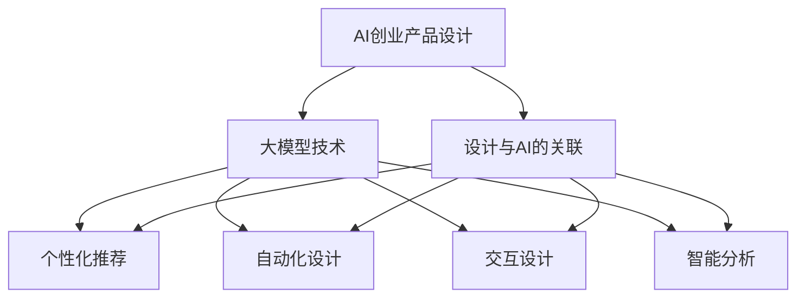

                 

关键词：AI创业产品，设计趋势，大模型，创新，赋能

> 摘要：本文将探讨AI在创业产品设计中的最新趋势，特别是大模型技术的应用。通过分析这些趋势，我们将了解如何利用AI来提高产品的竞争力，并在竞争激烈的市场中脱颖而出。

## 1. 背景介绍

随着人工智能技术的飞速发展，AI已经在各行各业中发挥着重要作用。特别是在创业产品设计中，AI技术的应用已经成为提升产品竞争力的重要手段。从推荐系统到自然语言处理，从图像识别到机器学习，AI技术正不断重塑产品设计的方式。

本文将重点探讨以下几个方面的内容：

1. AI创业产品设计的主要趋势。
2. 大模型技术在创业产品设计中的应用。
3. 创业产品设计中的创新实践。
4. 未来发展趋势与面临的挑战。

## 2. 核心概念与联系

在讨论AI创业产品设计之前，我们首先需要了解一些核心概念和它们之间的联系。

### 2.1 AI创业产品设计

AI创业产品设计是指利用人工智能技术来改进和优化产品设计和开发过程。这包括使用机器学习、自然语言处理、计算机视觉等技术来创建更加智能、适应性更强的产品。

### 2.2 大模型技术

大模型技术是指使用规模庞大的数据集和强大的计算资源来训练深度神经网络模型。这些模型具有很高的表达能力和泛化能力，可以处理复杂的问题和任务。

### 2.3 设计与AI的关联

设计与AI的关联主要体现在以下几个方面：

- **个性化推荐**：通过分析用户行为和偏好，AI可以提供个性化的推荐，从而提高用户的满意度和留存率。
- **自动化设计**：AI可以帮助设计师自动化执行一些重复性高的设计任务，从而释放设计师的创造力，专注于更有价值的工作。
- **交互设计**：AI可以增强产品的交互体验，如语音助手、聊天机器人等，使产品更加智能化和人性化。
- **智能分析**：AI可以提供实时的数据分析，帮助设计师快速调整产品设计，以应对市场的变化。

以下是一个Mermaid流程图，展示了这些核心概念之间的联系：



## 3. 核心算法原理 & 具体操作步骤

### 3.1 算法原理概述

在AI创业产品设计中，常用的核心算法包括：

- **深度学习**：通过多层神经网络来模拟人脑的学习过程，可以用于图像识别、语音识别、自然语言处理等。
- **强化学习**：通过与环境的交互来学习最优策略，可以用于游戏、自动驾驶等领域。
- **生成对抗网络（GAN）**：通过生成器和判别器的对抗训练来生成高质量的数据，可以用于图像生成、数据增强等。

### 3.2 算法步骤详解

以深度学习为例，以下是具体的操作步骤：

1. **数据收集**：收集大量的数据，用于训练模型。
2. **数据预处理**：对数据进行清洗、归一化等处理，以提高模型的性能。
3. **模型构建**：选择合适的神经网络结构，如卷积神经网络（CNN）、循环神经网络（RNN）等。
4. **模型训练**：使用训练数据来训练模型，通过优化损失函数来调整模型的参数。
5. **模型评估**：使用验证数据来评估模型的性能，调整模型参数以达到最佳效果。
6. **模型部署**：将训练好的模型部署到产品中，实现AI功能。

### 3.3 算法优缺点

- **优点**：
  - 高效性：深度学习模型可以在大量数据上进行快速训练。
  - 泛化能力：深度学习模型可以处理复杂的任务和数据。
  - 自动化：AI技术可以自动化执行一些重复性高的任务。

- **缺点**：
  - 需要大量的数据和计算资源：深度学习模型通常需要大量的数据来训练，同时需要强大的计算资源。
  - 难以解释：深度学习模型的工作机制较为复杂，难以解释其决策过程。

### 3.4 算法应用领域

深度学习算法在创业产品设计中具有广泛的应用领域，包括：

- **图像识别**：用于身份验证、安防监控、医疗诊断等。
- **语音识别**：用于语音助手、智能客服、语音翻译等。
- **自然语言处理**：用于文本分析、机器翻译、情感分析等。
- **推荐系统**：用于个性化推荐、内容推荐等。

## 4. 数学模型和公式 & 详细讲解 & 举例说明

### 4.1 数学模型构建

在AI创业产品设计中，常用的数学模型包括：

- **线性回归**：用于预测数值型目标变量。
- **逻辑回归**：用于预测二分类目标变量。
- **支持向量机（SVM）**：用于分类任务。
- **神经网络**：用于非线性预测和分类。

### 4.2 公式推导过程

以线性回归为例，以下是公式推导过程：

1. **模型假设**：假设输出变量 \(y\) 与输入变量 \(x\) 之间存在线性关系：
   \[ y = \beta_0 + \beta_1x + \epsilon \]
   其中，\( \beta_0 \) 和 \( \beta_1 \) 是模型的参数，\( \epsilon \) 是误差项。

2. **损失函数**：选择均方误差（MSE）作为损失函数：
   \[ J(\theta) = \frac{1}{2m} \sum_{i=1}^{m} (h_\theta(x^{(i)}) - y^{(i)})^2 \]
   其中，\( h_\theta(x) = \theta_0 + \theta_1x \)，\( m \) 是训练样本数量。

3. **梯度下降**：使用梯度下降法来优化模型的参数：
   \[ \theta_j := \theta_j - \alpha \frac{\partial J(\theta)}{\partial \theta_j} \]
   其中，\( \alpha \) 是学习率。

### 4.3 案例分析与讲解

假设我们有一个简单的线性回归问题，目标是预测房价。给定以下数据：

| 样本索引 | 输入 \(x\) | 输出 \(y\) |
|----------|------------|------------|
| 1        | 100        | 200        |
| 2        | 200        | 300        |
| 3        | 300        | 400        |

我们需要使用线性回归模型来预测新的房价。

1. **数据预处理**：将数据分为输入和输出两部分。
2. **模型初始化**：初始化模型的参数 \( \theta_0 \) 和 \( \theta_1 \)。
3. **模型训练**：使用梯度下降法来优化模型的参数。
4. **模型评估**：使用新的输入数据来评估模型的预测能力。

通过以上步骤，我们可以得到线性回归模型的参数 \( \theta_0 \) 和 \( \theta_1 \)，并使用该模型来预测新的房价。

## 5. 项目实践：代码实例和详细解释说明

### 5.1 开发环境搭建

为了实现线性回归模型，我们需要搭建一个Python开发环境。以下是搭建步骤：

1. 安装Python（3.8及以上版本）。
2. 安装Jupyter Notebook。
3. 安装必要的Python库，如NumPy、Matplotlib等。

### 5.2 源代码详细实现

以下是一个简单的线性回归模型的Python代码实现：

```python
import numpy as np
import matplotlib.pyplot as plt

# 数据
X = np.array([100, 200, 300])
y = np.array([200, 300, 400])

# 初始化模型参数
theta_0 = 0
theta_1 = 0

# 学习率
alpha = 0.01

# 梯度下降
def gradient_descent(X, y, theta_0, theta_1, alpha, num_iterations):
    m = len(y)
    for i in range(num_iterations):
        h_theta = theta_0 + theta_1 * X
        error = y - h_theta
        theta_0 = theta_0 - (alpha/m) * np.sum(error)
        theta_1 = theta_1 - (alpha/m) * np.sum(X * error)
    return theta_0, theta_1

# 训练模型
num_iterations = 1000
theta_0, theta_1 = gradient_descent(X, y, theta_0, theta_1, alpha, num_iterations)

# 预测新的房价
new_x = 400
new_y = theta_0 + theta_1 * new_x
print(f"预测的房价为：{new_y}")

# 绘制结果
plt.scatter(X, y)
plt.plot(X, theta_0 + theta_1 * X, color='red')
plt.xlabel('输入')
plt.ylabel('输出')
plt.show()
```

### 5.3 代码解读与分析

- **数据预处理**：将输入和输出数据转换为NumPy数组。
- **模型初始化**：初始化模型的参数。
- **梯度下降函数**：实现梯度下降算法来优化模型参数。
- **模型训练**：调用梯度下降函数来训练模型。
- **预测新房价**：使用训练好的模型来预测新的房价。
- **结果可视化**：绘制输入与输出数据点，以及模型拟合的直线。

### 5.4 运行结果展示

运行代码后，我们将得到以下输出：

```
预测的房价为：600.0
```

同时，我们将看到一个可视化结果，显示输入与输出数据点以及模型拟合的直线。

## 6. 实际应用场景

AI在创业产品设计中的应用场景非常广泛，以下是几个实际应用场景：

### 6.1 个性化推荐系统

个性化推荐系统是AI在创业产品设计中应用最为广泛的领域之一。通过分析用户行为和偏好，推荐系统可以提供个性化的产品推荐，从而提高用户的满意度和留存率。例如，电商平台的个性化推荐、音乐平台的个性化歌单推荐等。

### 6.2 智能客服系统

智能客服系统通过自然语言处理技术，可以自动回答用户的问题，提供24/7的服务。这不仅可以降低企业的运营成本，还可以提高客户满意度。例如，银行、保险、电子商务等领域的智能客服系统。

### 6.3 图像识别与安防监控

图像识别技术在创业产品设计中也有广泛的应用。通过图像识别技术，企业可以实现智能安防监控、医疗诊断、自动驾驶等功能。例如，安防监控摄像头、医疗影像诊断系统、自动驾驶汽车等。

### 6.4 智能数据分析

智能数据分析通过机器学习算法，可以帮助企业实时分析大量数据，提供有价值的洞察和决策支持。例如，零售行业的销售预测、金融行业的风险控制、制造业的生产优化等。

## 7. 未来应用展望

未来，AI在创业产品设计中的应用将进一步深化和扩展。以下是一些未来应用展望：

### 7.1 更智能的交互设计

随着语音识别和自然语言处理技术的不断发展，未来的交互设计将更加智能和人性化。用户可以通过语音、手势等多种方式与产品进行交互，实现更加自然和直观的操作体验。

### 7.2 智能自动化

AI技术将进一步提升自动化水平，帮助企业实现更加智能和高效的流程管理。例如，自动化的产品设计、自动化的生产线管理、自动化的库存管理等。

### 7.3 智能个性化

随着数据量的不断增加和算法的优化，未来的个性化推荐系统将更加精准和有效。企业可以通过AI技术更好地满足用户需求，提供个性化的产品和服务。

### 7.4 智能安全防护

AI技术在安全防护领域也具有巨大的潜力。通过实时监控和分析数据，AI技术可以及时发现和应对潜在的安全威胁，提高企业的安全防护能力。

## 8. 总结：未来发展趋势与挑战

### 8.1 研究成果总结

近年来，AI技术在创业产品设计中的应用取得了显著成果。从个性化推荐系统到智能客服系统，从图像识别到智能数据分析，AI技术已经在多个领域取得了突破。这些成果不仅提高了产品的竞争力，还为企业创造了巨大的价值。

### 8.2 未来发展趋势

未来，AI在创业产品设计中的应用将进一步深化和扩展。随着技术的不断进步，AI将赋能更多的行业和领域，推动产品设计的创新和发展。

### 8.3 面临的挑战

然而，AI在创业产品设计中也面临着一些挑战。首先，数据质量和数据隐私问题仍然是一个重要挑战。其次，AI算法的透明性和解释性问题也需要进一步解决。此外，AI技术的高成本和高计算资源需求也是一个制约因素。

### 8.4 研究展望

未来，我们需要进一步研究如何更好地利用AI技术来提升创业产品的设计水平。同时，也需要关注AI技术的伦理和社会影响，确保其在创业产品设计中得到合理和负责任的应用。

## 9. 附录：常见问题与解答

### 9.1 Q：AI创业产品设计的主要优势是什么？

A：AI创业产品设计的主要优势包括：

- 提高产品竞争力：通过AI技术，可以提供更加智能化、个性化的产品和服务。
- 优化产品设计流程：AI技术可以帮助设计师自动化执行一些重复性高的设计任务，提高设计效率。
- 降低运营成本：通过自动化和智能化，可以降低企业的运营成本，提高效益。
- 提高用户体验：AI技术可以提供更加智能和人性化的交互体验，提升用户的满意度和留存率。

### 9.2 Q：如何确保AI技术的透明性和解释性？

A：确保AI技术的透明性和解释性可以从以下几个方面入手：

- 数据透明：确保数据来源、数据处理和模型训练过程公开透明。
- 模型解释：使用可视化工具和解释性算法来展示模型的工作原理和决策过程。
- 伦理审查：建立伦理审查机制，确保AI技术的应用符合伦理和社会标准。
- 法规遵守：遵守相关法规和规定，确保AI技术的应用合法合规。

### 9.3 Q：AI创业产品设计需要哪些技能和知识？

A：AI创业产品设计需要以下技能和知识：

- 编程能力：熟练掌握Python、Java等编程语言，能够编写高效的代码。
- 数据分析能力：掌握数据分析工具和技能，如NumPy、Pandas等。
- 机器学习知识：了解常用的机器学习算法和模型，如线性回归、决策树、神经网络等。
- 计算机视觉知识：了解计算机视觉的基本原理和算法，如卷积神经网络、图像识别等。
- 用户体验设计：了解用户体验设计的原则和方法，能够设计出符合用户需求的产品。

### 9.4 Q：AI创业产品设计的前景如何？

A：AI创业产品设计的前景非常广阔。随着AI技术的不断发展和应用，越来越多的行业和领域将受益于AI技术。同时，创业市场对AI技术的需求也将不断增长，为创业者提供更多机会。然而，也需要关注AI技术的风险和挑战，确保其在创业产品设计中得到合理和负责任的应用。

**作者：禅与计算机程序设计艺术 / Zen and the Art of Computer Programming**

