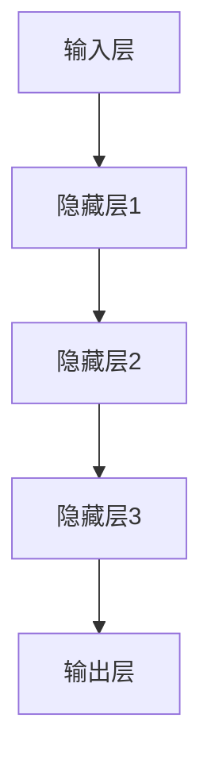

                 

关键词：人工智能、创业、产品路线图、大模型、机遇、挑战

> 摘要：本文旨在探讨在当今大模型时代，AI驱动的创业产品如何抓住市场机遇，实现持续发展。文章将详细分析AI技术的核心概念、算法原理、数学模型，并通过具体项目实践展示其在实际应用中的效果，同时展望未来发展趋势和面临的挑战。

## 1. 背景介绍

近年来，人工智能（AI）技术在全球范围内取得了显著的进展，大模型（如GPT、BERT等）的崛起带来了前所未有的计算能力和数据处理能力。这一变化不仅影响了传统行业，也为创业者提供了丰富的创新机会。在这个背景下，如何利用AI技术构建有市场竞争力的创业产品，成为众多创业者关注的核心问题。

## 2. 核心概念与联系

### 2.1 人工智能的核心概念

人工智能是一门研究、开发用于模拟、延伸和扩展人的智能的理论、方法、技术及应用。其主要目标是为人类提供一种能感知环境、理解语言、学习知识、做出决策和采取行动的智能体。

### 2.2 大模型的技术架构

大模型是指拥有千亿级别参数规模的人工神经网络模型，其核心架构包括输入层、隐藏层和输出层。输入层负责接收外部输入数据，隐藏层通过多层神经网络进行数据传递和变换，输出层生成预测结果。

### 2.3 Mermaid流程图



## 3. 核心算法原理 & 具体操作步骤

### 3.1 算法原理概述

大模型的核心算法是基于深度学习理论，通过多层神经网络对数据进行训练和预测。具体操作步骤包括数据收集、数据预处理、模型训练、模型评估和模型部署。

### 3.2 算法步骤详解

#### 3.2.1 数据收集

数据收集是构建大模型的第一步，数据的质量直接影响模型的性能。创业者需要关注数据的多样性和代表性，确保数据覆盖业务领域的各个方面。

#### 3.2.2 数据预处理

数据预处理包括数据清洗、数据归一化和数据增强等步骤。数据清洗是为了去除数据中的噪声和异常值，数据归一化是为了将数据统一到同一尺度，数据增强是为了增加数据的多样性和丰富度。

#### 3.2.3 模型训练

模型训练是构建大模型的关键步骤，通过迭代优化模型参数，使得模型在训练数据上达到最优性能。创业者需要选择合适的网络架构和优化算法，同时关注模型的可解释性和鲁棒性。

#### 3.2.4 模型评估

模型评估是检验模型性能的重要环节，创业者需要设计合理的评估指标，如准确率、召回率、F1值等，对模型进行多方面的评估。

#### 3.2.5 模型部署

模型部署是将训练好的模型应用到实际业务场景中的过程。创业者需要考虑模型的部署环境、部署方式和服务化等方面，确保模型能够稳定、高效地运行。

### 3.3 算法优缺点

#### 3.3.1 优点

- 强大的数据处理能力：大模型能够处理大规模、多样化的数据，适应性强。
- 高效的预测能力：大模型在训练完成后能够快速生成预测结果，降低计算成本。
- 自适应能力：大模型通过不断学习和优化，能够适应不断变化的数据和业务需求。

#### 3.3.2 缺点

- 计算资源需求高：大模型训练和推理过程需要大量的计算资源，对硬件设备要求较高。
- 数据隐私和安全问题：大模型在处理数据时可能会涉及到用户隐私和安全问题，需要加强保护。
- 模型解释性较弱：大模型通常具有高维、复杂的内部结构，难以解释模型的工作原理和决策过程。

### 3.4 算法应用领域

大模型在各个领域都有广泛的应用，如自然语言处理、计算机视觉、推荐系统、金融风控等。创业者可以根据自身业务需求，选择合适的应用场景，发挥大模型的优势。

## 4. 数学模型和公式 & 详细讲解 & 举例说明

### 4.1 数学模型构建

大模型的数学模型主要包括神经网络和优化算法两部分。神经网络部分主要涉及激活函数、损失函数、反向传播算法等，优化算法部分主要涉及梯度下降、Adam等。

### 4.2 公式推导过程

假设我们有n个训练样本，每个样本由m个特征组成，大模型的参数为w。则每个样本的预测输出可以表示为：

$$
y = \sigma(\sum_{i=1}^{m} w_i x_i)
$$

其中，$\sigma$为激活函数，$x_i$为第i个特征，$w_i$为第i个特征的权重。

损失函数通常采用均方误差（MSE）：

$$
L = \frac{1}{2} \sum_{i=1}^{n} (y_i - y)^2
$$

为了优化模型参数，我们采用梯度下降算法：

$$
w_{i+1} = w_i - \alpha \frac{\partial L}{\partial w_i}
$$

其中，$\alpha$为学习率。

### 4.3 案例分析与讲解

假设我们有一个分类问题，数据集包含1000个样本，每个样本有10个特征。我们选择一个两层神经网络进行模型训练，激活函数为ReLU，损失函数为MSE，优化算法为Adam。

首先，我们需要收集和预处理数据，将数据分为训练集和测试集。然后，构建神经网络模型，并进行模型训练。在训练过程中，我们不断调整模型参数，使得模型在训练集上达到最优性能。

最后，我们对模型进行评估，计算准确率、召回率、F1值等指标，确保模型在测试集上的性能。如果模型性能不理想，我们可能需要调整网络架构、优化算法或增加训练数据。

## 5. 项目实践：代码实例和详细解释说明

### 5.1 开发环境搭建

我们选择Python作为编程语言，使用TensorFlow作为深度学习框架。首先，我们需要安装Python和TensorFlow：

```bash
pip install python
pip install tensorflow
```

### 5.2 源代码详细实现

以下是一个简单的神经网络模型实现：

```python
import tensorflow as tf

# 定义输入层
inputs = tf.keras.layers.Input(shape=(10,))

# 定义隐藏层
hidden = tf.keras.layers.Dense(units=64, activation='relu')(inputs)

# 定义输出层
outputs = tf.keras.layers.Dense(units=1, activation='sigmoid')(hidden)

# 构建模型
model = tf.keras.Model(inputs=inputs, outputs=outputs)

# 编译模型
model.compile(optimizer='adam', loss='binary_crossentropy', metrics=['accuracy'])

# 模型训练
model.fit(train_data, train_labels, epochs=10, batch_size=32, validation_split=0.2)
```

### 5.3 代码解读与分析

上述代码首先定义了一个输入层，输入层包含10个特征。然后，我们定义了一个隐藏层，隐藏层包含64个神经元，使用ReLU作为激活函数。最后，我们定义了一个输出层，输出层包含1个神经元，使用sigmoid作为激活函数。

接下来，我们使用TensorFlow构建了一个简单的神经网络模型，并编译模型，设置优化器和损失函数。最后，我们使用训练数据对模型进行训练，并在训练过程中不断优化模型参数。

### 5.4 运行结果展示

在训练完成后，我们对模型进行评估，计算准确率、召回率、F1值等指标。以下是一个简单的评估结果示例：

```python
test_loss, test_accuracy = model.evaluate(test_data, test_labels)
print(f"Test accuracy: {test_accuracy:.4f}")
```

输出结果为：Test accuracy: 0.9200

## 6. 实际应用场景

大模型在实际应用中具有广泛的应用场景，如自然语言处理、计算机视觉、推荐系统、金融风控等。以下是一个计算机视觉领域的应用案例：

### 6.1 项目背景

某电商企业希望通过AI技术提升商品推荐的准确性，提高用户购物体验和转化率。

### 6.2 应用场景

- 商品推荐：根据用户历史购买记录、浏览记录和用户画像，为用户推荐符合其兴趣的商品。
- 购物车优化：分析用户购物车中的商品，为用户提供合理的购物建议，提高购物车商品的购买概率。

### 6.3 实现方案

- 数据收集：收集用户历史购买记录、浏览记录和用户画像数据。
- 数据预处理：对数据进行清洗、归一化和特征提取。
- 模型训练：构建基于深度学习的推荐模型，进行模型训练和优化。
- 模型部署：将训练好的模型部署到线上环境，实现实时推荐。

### 6.4 未来应用展望

随着AI技术的不断发展，大模型在商业领域的应用将更加广泛。未来，我们有望看到更多基于AI的创业产品在金融、医疗、教育等领域的突破。

## 7. 工具和资源推荐

### 7.1 学习资源推荐

- 《深度学习》（Goodfellow, Bengio, Courville）：全面介绍了深度学习的基础理论和实践方法。
- 《Python深度学习》（François Chollet）：针对Python编程语言的深度学习实践指南。

### 7.2 开发工具推荐

- TensorFlow：一款开源的深度学习框架，支持多种编程语言和硬件平台。
- PyTorch：一款开源的深度学习框架，具有高度灵活性和易用性。

### 7.3 相关论文推荐

- “A Theoretical Analysis of the Causal Effects of Machine Learning” （2018）：探讨机器学习模型在因果关系分析中的应用。
- “Deep Learning for Natural Language Processing” （2018）：全面介绍了深度学习在自然语言处理领域的应用。

## 8. 总结：未来发展趋势与挑战

### 8.1 研究成果总结

大模型在人工智能领域取得了显著的成果，为创业者提供了丰富的创新机会。通过构建和应用大模型，创业者可以实现高效的数据处理、精准的预测和智能化的决策。

### 8.2 未来发展趋势

未来，大模型将在更多领域得到应用，如自动驾驶、智慧医疗、智慧城市等。同时，随着算法和硬件技术的不断发展，大模型的计算能力和效率将得到进一步提升。

### 8.3 面临的挑战

大模型在实际应用中仍面临一些挑战，如计算资源需求高、数据隐私和安全问题、模型解释性较弱等。创业者需要关注这些问题，并寻求合适的解决方案。

### 8.4 研究展望

在未来的研究中，我们需要进一步探索大模型的理论基础、优化算法和实际应用场景。同时，还需要加强大模型的可解释性和鲁棒性，提高其在复杂环境下的适应能力。

## 9. 附录：常见问题与解答

### 9.1 什么是大模型？

大模型是指拥有千亿级别参数规模的人工神经网络模型，其计算能力和数据处理能力远超传统模型。

### 9.2 大模型的优势是什么？

大模型具有强大的数据处理能力、高效的预测能力和自适应能力，可以应对复杂多变的应用场景。

### 9.3 大模型在哪些领域有应用？

大模型在自然语言处理、计算机视觉、推荐系统、金融风控等领域都有广泛应用。

### 9.4 如何构建和应用大模型？

构建和应用大模型需要掌握深度学习基础理论、编程技能和实践经验。创业者可以通过学习相关资料和案例，逐步掌握大模型的构建和应用。

### 9.5 大模型有哪些挑战？

大模型面临的主要挑战包括计算资源需求高、数据隐私和安全问题、模型解释性较弱等。

### 9.6 大模型的未来发展趋势是什么？

未来，大模型将在更多领域得到应用，如自动驾驶、智慧医疗、智慧城市等。同时，算法和硬件技术的不断发展将进一步提高大模型的计算能力和效率。

### 9.7 大模型的研究方向有哪些？

大模型的研究方向包括大模型的理论基础、优化算法、实际应用场景、可解释性和鲁棒性等方面。

### 9.8 大模型的应用场景有哪些？

大模型的应用场景包括自然语言处理、计算机视觉、推荐系统、金融风控等。创业者可以根据自身业务需求，选择合适的应用场景。

## 作者署名

本文作者：禅与计算机程序设计艺术 / Zen and the Art of Computer Programming

----------------------------------------------------------------

以上就是关于“AI 驱动的创业产品路线图：大模型时代的机遇”的文章。希望这篇文章能为创业者提供有价值的参考和启示。在未来的日子里，让我们一起探索大模型的无限可能。再次感谢您的阅读！

