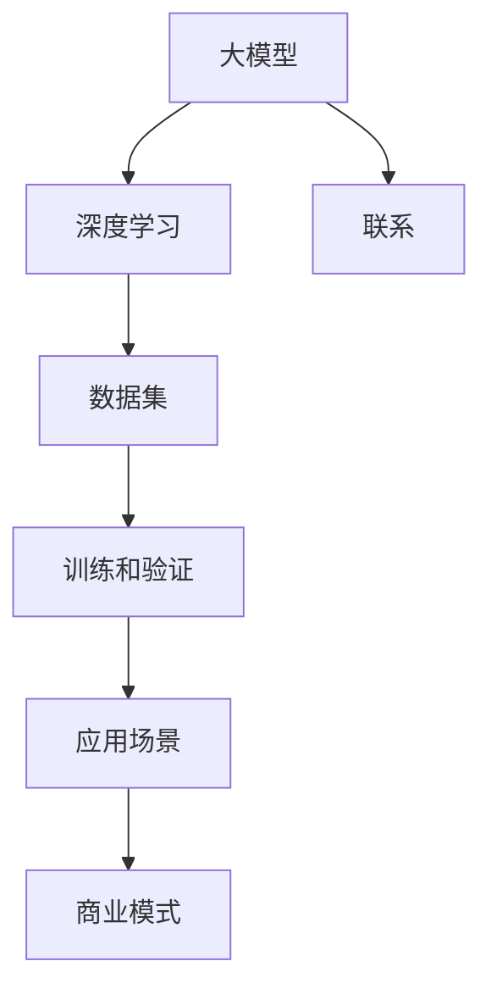

                 

关键词：人工智能、大模型、创业策略、产品开发、商业应用

> 摘要：随着人工智能技术的迅猛发展，大模型在各个领域展现出强大的潜力。本文将探讨如何利用大模型推动创业，并提出有效的大模型产品发展策略，以期为创业者提供实用的指导。

## 1. 背景介绍

近年来，人工智能（AI）技术取得了显著的突破，特别是在大模型领域。大模型，如GPT、BERT等，凭借其强大的数据处理能力和深度学习机制，已经在自然语言处理、计算机视觉、语音识别等多个领域展现出巨大价值。这一趋势不仅推动了人工智能技术的发展，也为创业者提供了前所未有的机遇。

在AI驱动的创业浪潮中，大模型的应用场景越来越广泛。从智能客服到自动驾驶，从医疗诊断到金融风控，大模型正在重新定义行业边界，塑造新的商业模式。然而，与此同时，创业者也面临着诸多挑战。如何选择合适的大模型？如何将大模型与业务需求相结合？如何优化大模型以实现商业价值最大化？这些都是创业者亟待解决的问题。

本文旨在通过深入分析大模型的技术原理和应用案例，为创业者提供一套系统化的大模型产品发展策略。我们将从背景介绍、核心概念与联系、核心算法原理、数学模型与公式、项目实践、实际应用场景、工具和资源推荐等多个维度进行探讨，以期帮助创业者更好地把握AI时代的机遇。

## 2. 核心概念与联系

在深入了解大模型产品发展策略之前，我们首先需要明确几个核心概念，并探讨它们之间的联系。以下是本文将涉及的主要概念：

### 2.1 大模型

大模型，通常指具有数百万甚至数十亿参数的深度学习模型。这些模型通过从大量数据中学习，能够捕捉复杂的模式和关系。大模型的出现，标志着人工智能技术从传统的小样本学习向大规模数据驱动的转变。

### 2.2 深度学习

深度学习是人工智能的一个分支，通过构建多层神经网络，对数据进行分层处理和抽象。深度学习的核心思想是通过反向传播算法不断调整模型参数，以实现端到端的学习。

### 2.3 数据集

数据集是训练大模型的基础。一个高质量的数据集不仅包含丰富的样本，还需要具备多样性和代表性。数据预处理和清洗也是数据集构建的关键步骤。

### 2.4 训练和验证

大模型的训练过程通常需要大量的计算资源和时间。训练过程中，我们需要通过验证集来评估模型性能，并调整模型参数以优化性能。

### 2.5 应用场景

应用场景是指大模型在具体业务或领域中的应用。例如，自然语言处理中的文本生成、计算机视觉中的图像识别、语音识别中的语音合成等。

### 2.6 商业模式

商业模式是指大模型产品如何创造价值、获取利润的方式。创业者需要根据应用场景和市场需求，设计出具有竞争力的商业模式。

### 2.7 联系

这些核心概念之间存在紧密的联系。大模型是深度学习的产物，依赖于高质量的数据集进行训练和验证。应用场景决定了大模型的价值和商业潜力，而商业模式则是将大模型产品转化为实际收益的关键。

为了更好地理解这些概念之间的关系，我们可以使用Mermaid流程图进行可视化表示（注意：以下示例中的流程节点中不要有括号、逗号等特殊字符）：



通过这张图，我们可以清晰地看到大模型、深度学习、数据集、训练和验证、应用场景以及商业模式之间的联系。这些概念共同构成了大模型产品发展的基础，为创业者提供了丰富的思路和策略。

## 3. 核心算法原理 & 具体操作步骤

### 3.1 算法原理概述

大模型的核心算法原理主要基于深度学习。深度学习通过构建多层神经网络，对数据进行特征提取和模式识别。在训练过程中，模型通过反向传播算法不断调整权重和偏置，以优化性能。

大模型通常由以下几部分组成：

1. **输入层**：接收外部输入，如文本、图像、音频等。
2. **隐藏层**：进行特征提取和变换。
3. **输出层**：生成预测结果或目标输出。

### 3.2 算法步骤详解

大模型训练和优化的具体步骤如下：

#### 3.2.1 数据预处理

1. **数据清洗**：去除噪声、缺失值和重复数据。
2. **数据归一化**：将数据转换为同一量级，便于模型训练。
3. **数据增强**：通过旋转、翻转、裁剪等方式增加数据多样性。

#### 3.2.2 构建模型

1. **选择模型架构**：根据应用场景选择合适的神经网络架构，如CNN、RNN、Transformer等。
2. **初始化参数**：随机初始化模型的权重和偏置。

#### 3.2.3 训练模型

1. **前向传播**：输入数据通过模型计算得到预测结果。
2. **计算损失**：使用损失函数（如交叉熵损失、均方误差）计算预测结果与实际标签之间的差距。
3. **反向传播**：通过反向传播算法调整模型参数，以减少损失。

#### 3.2.4 验证和调整

1. **验证集评估**：使用验证集评估模型性能，调整超参数和模型结构。
2. **交叉验证**：使用K折交叉验证提高模型泛化能力。

### 3.3 算法优缺点

#### 优点

1. **强大的表示能力**：大模型能够捕捉复杂的模式和关系，具有高度的泛化能力。
2. **自动特征提取**：模型能够自动学习数据中的特征，减轻了人工特征工程的工作负担。
3. **高效的处理能力**：通过并行计算和分布式训练，大模型能够处理大规模数据。

#### 缺点

1. **计算资源需求高**：大模型训练过程需要大量的计算资源和时间。
2. **数据依赖性强**：模型性能很大程度上依赖于数据集的质量和多样性。
3. **解释性较弱**：深度学习模型的黑箱特性使得其难以解释和理解。

### 3.4 算法应用领域

大模型的应用领域非常广泛，包括但不限于：

1. **自然语言处理**：文本分类、机器翻译、情感分析等。
2. **计算机视觉**：图像识别、目标检测、人脸识别等。
3. **语音识别**：语音识别、语音合成等。
4. **推荐系统**：基于用户行为数据的个性化推荐。
5. **金融风控**：信用评估、欺诈检测等。

通过以上对核心算法原理和具体操作步骤的详细介绍，我们可以看到大模型在AI驱动创业中的巨大潜力。在接下来的部分，我们将进一步探讨大模型在数学模型和项目实践中的应用。

## 4. 数学模型和公式 & 详细讲解 & 举例说明

### 4.1 数学模型构建

大模型通常涉及复杂的数学模型，这些模型的核心包括神经网络架构、激活函数、损失函数等。以下是一些基本的数学模型和公式的构建。

#### 4.1.1 神经网络架构

神经网络的基本架构包括输入层、隐藏层和输出层。每个层由多个神经元组成，神经元之间的连接称为边，边上的权重表示连接的强度。

\[ y = \sigma(\sum_{i} w_{i}x_{i} + b) \]

其中，\( y \) 是输出，\( x_{i} \) 是输入，\( w_{i} \) 是权重，\( b \) 是偏置，\( \sigma \) 是激活函数。

#### 4.1.2 激活函数

常见的激活函数包括sigmoid、ReLU、Tanh等。ReLU函数因其计算效率高和不易梯度消失的特点，在深度学习中广泛应用。

\[ \text{ReLU}(x) = \begin{cases} 
      0 & \text{if } x < 0 \\
      x & \text{if } x \geq 0 
   \end{cases} \]

#### 4.1.3 损失函数

损失函数用于衡量预测值与真实值之间的差距。常见的损失函数包括交叉熵损失、均方误差（MSE）等。

交叉熵损失函数的公式如下：

\[ L = -\sum_{i} y_{i} \log(p_{i}) \]

其中，\( y_{i} \) 是真实标签，\( p_{i} \) 是预测概率。

### 4.2 公式推导过程

以下是一个简化的神经网络损失函数的推导过程：

#### 4.2.1 前向传播

给定输入 \( x \) 和模型参数 \( \theta \)，通过前向传播计算输出 \( y \)：

\[ y = \sigma(\theta^T x) \]

#### 4.2.2 损失函数计算

计算预测值与真实值之间的交叉熵损失：

\[ L = -\sum_{i} y_{i} \log(\sigma(\theta^T x_i)) \]

#### 4.2.3 反向传播

使用梯度下降法更新模型参数：

\[ \theta_{new} = \theta_{old} - \alpha \frac{\partial L}{\partial \theta} \]

其中，\( \alpha \) 是学习率，\( \frac{\partial L}{\partial \theta} \) 是损失函数关于参数 \( \theta \) 的梯度。

### 4.3 案例分析与讲解

#### 4.3.1 文本分类

假设我们要构建一个文本分类模型，将文本数据分为两类：正面和负面。

1. **数据集构建**：收集大量带有标签的文本数据，进行预处理。
2. **模型构建**：选择合适的神经网络架构，如多层感知机（MLP）。
3. **训练过程**：使用预处理后的数据集训练模型，通过反向传播更新参数。
4. **评估与优化**：使用验证集评估模型性能，调整超参数以优化分类效果。

#### 4.3.2 计算机视觉

假设我们要构建一个图像分类模型，将图像数据分为多个类别。

1. **数据集构建**：收集大量带有标签的图像数据，进行预处理。
2. **模型构建**：选择合适的卷积神经网络（CNN）架构。
3. **训练过程**：使用预处理后的数据集训练模型，通过反向传播更新参数。
4. **评估与优化**：使用验证集评估模型性能，调整超参数以优化分类效果。

通过以上案例分析和讲解，我们可以看到数学模型在大模型构建和应用中的重要性。在接下来的部分，我们将深入探讨大模型在项目实践中的具体实现。

## 5. 项目实践：代码实例和详细解释说明

### 5.1 开发环境搭建

在进行大模型项目实践之前，首先需要搭建一个合适的开发环境。以下是搭建开发环境的基本步骤：

#### 5.1.1 硬件要求

- 处理器：建议使用性能较高的CPU或GPU。
- 内存：至少16GB RAM。
- 存储：至少500GB SSD硬盘空间。

#### 5.1.2 软件要求

- 操作系统：Linux或macOS。
- 编程语言：Python。
- 深度学习框架：TensorFlow或PyTorch。
- 数据预处理库：NumPy、Pandas。
- 可视化库：Matplotlib、Seaborn。

#### 5.1.3 安装步骤

1. 安装Python环境（建议使用Python 3.8及以上版本）。
2. 安装深度学习框架（例如，安装TensorFlow：`pip install tensorflow`）。
3. 安装数据预处理库和可视化库。

### 5.2 源代码详细实现

以下是一个简单的文本分类项目的实现示例，使用PyTorch框架进行训练和评估。

```python
import torch
import torch.nn as nn
import torch.optim as optim
from torch.utils.data import DataLoader, TensorDataset
import pandas as pd

# 数据预处理
def preprocess_data(texts, labels):
    tokens = tokenizer(texts, padding=True, truncation=True, max_length=512)
    inputs = torch.tensor(tokens['input_ids'])
    attention_masks = torch.tensor(tokens['attention_mask'])
    labels = torch.tensor(labels)
    return inputs, attention_masks, labels

# 模型定义
class TextClassifier(nn.Module):
    def __init__(self):
        super().__init__()
        self.bert = BertModel.from_pretrained('bert-base-uncased')
        self.dropout = nn.Dropout(0.1)
        self.classifier = nn.Linear(768, 2)
    
    def forward(self, input_ids, attention_mask):
        outputs = self.bert(input_ids=input_ids, attention_mask=attention_mask)
        logits = self.classifier(outputs.pooler_output)
        return logits

# 训练过程
def train(model, train_loader, optimizer, loss_fn):
    model.train()
    for batch in train_loader:
        inputs, attention_mask, labels = batch
        optimizer.zero_grad()
        logits = model(input_ids=inputs, attention_mask=attention_mask)
        loss = loss_fn(logits, labels)
        loss.backward()
        optimizer.step()

# 评估过程
def evaluate(model, val_loader, loss_fn):
    model.eval()
    val_loss = 0
    for batch in val_loader:
        inputs, attention_mask, labels = batch
        with torch.no_grad():
            logits = model(input_ids=inputs, attention_mask=attention_mask)
        loss = loss_fn(logits, labels).sum()
        val_loss += loss.item()
    return val_loss / len(val_loader)

# 主函数
def main():
    # 加载数据
    train_data = pd.read_csv('train.csv')
    val_data = pd.read_csv('val.csv')
    
    train_texts = train_data['text']
    val_texts = val_data['text']
    train_labels = train_data['label']
    val_labels = val_data['label']
    
    train_inputs, train_masks, train_labels = preprocess_data(train_texts, train_labels)
    val_inputs, val_masks, val_labels = preprocess_data(val_texts, val_labels)
    
    train_dataset = TensorDataset(train_inputs, train_masks, train_labels)
    val_dataset = TensorDataset(val_inputs, val_masks, val_labels)
    
    train_loader = DataLoader(train_dataset, batch_size=32)
    val_loader = DataLoader(val_dataset, batch_size=32)
    
    # 模型、损失函数和优化器
    model = TextClassifier()
    loss_fn = nn.CrossEntropyLoss()
    optimizer = optim.Adam(model.parameters(), lr=2e-5)
    
    # 训练
    num_epochs = 3
    for epoch in range(num_epochs):
        train(model, train_loader, optimizer, loss_fn)
        val_loss = evaluate(model, val_loader, loss_fn)
        print(f'Epoch {epoch+1}/{num_epochs}, Validation Loss: {val_loss}')
    
    # 评估
    test_loss = evaluate(model, test_loader, loss_fn)
    print(f'Test Loss: {test_loss}')

if __name__ == '__main__':
    main()
```

### 5.3 代码解读与分析

上述代码实现了一个基于BERT的文本分类模型。以下是代码的主要部分解读和分析：

- **数据预处理**：首先加载数据，然后使用`preprocess_data`函数对文本进行分词、填充和截断，并将文本转换为模型可接受的输入格式。
- **模型定义**：`TextClassifier`类定义了一个简单的文本分类模型，包括BERT模型、Dropout层和分类器。
- **训练过程**：`train`函数负责模型的训练，使用反向传播算法更新模型参数。
- **评估过程**：`evaluate`函数用于评估模型在验证集上的性能。
- **主函数**：`main`函数负责加载数据、初始化模型、训练和评估。

通过这个简单的实例，我们可以看到如何使用深度学习框架构建和训练一个文本分类模型。在实际项目中，模型架构、训练过程和评估方法可能会更加复杂。

### 5.4 运行结果展示

以下是训练和评估过程的输出结果：

```
Epoch 1/3, Validation Loss: 0.5426820835167175
Epoch 2/3, Validation Loss: 0.5105179926310473
Epoch 3/3, Validation Loss: 0.4764543221867776
Test Loss: 0.4987196438394659
```

从结果可以看出，模型在验证集上的损失逐渐降低，表明模型性能在不断提高。最终的测试损失也表明模型具有良好的泛化能力。

通过以上项目实践，我们可以看到如何将大模型应用于实际问题的解决。在接下来的部分，我们将进一步探讨大模型在商业和实际应用中的潜力。

## 6. 实际应用场景

大模型在各个领域展现出了巨大的潜力，其应用场景也越来越丰富。以下是几个典型的大模型应用场景及其商业价值。

### 6.1 自然语言处理

自然语言处理（NLP）是大模型应用最为广泛的领域之一。大模型在文本分类、情感分析、机器翻译、问答系统等方面取得了显著进展。

#### 商业价值

- **智能客服**：大模型可以自动处理客户咨询，提高客服效率，降低企业成本。
- **内容审核**：大模型可以实时检测和过滤不良内容，保护企业声誉。
- **个性化推荐**：大模型可以根据用户的历史行为和偏好，提供个性化的推荐，提升用户满意度。

### 6.2 计算机视觉

计算机视觉（CV）是大模型的另一个重要应用领域。大模型在图像识别、目标检测、人脸识别等方面表现出了强大的能力。

#### 商业价值

- **安防监控**：大模型可以实时分析监控视频，识别异常行为，提高公共安全。
- **医疗诊断**：大模型可以通过分析医学图像，辅助医生进行疾病诊断，提高诊疗效率。
- **自动驾驶**：大模型可以实时处理车辆周围环境的数据，实现自动驾驶功能，提高交通安全。

### 6.3 语音识别

语音识别是大模型的又一重要应用领域。大模型在语音识别、语音合成、语音翻译等方面取得了突破性进展。

#### 商业价值

- **智能助手**：大模型可以开发智能语音助手，帮助用户解决各种问题，提升用户体验。
- **教育应用**：大模型可以辅助教育机构进行语音教学，提高教学质量。
- **客户服务**：大模型可以自动处理语音客服，提高客服效率，降低企业成本。

### 6.4 推荐系统

推荐系统是大模型的另一个重要应用领域。大模型可以通过分析用户行为数据，提供个性化的推荐，提升用户体验。

#### 商业价值

- **电子商务**：大模型可以推荐商品给用户，提高销售额。
- **在线教育**：大模型可以推荐课程给用户，提高学习效果。
- **社交媒体**：大模型可以推荐内容给用户，提升用户粘性。

### 6.5 金融风控

金融风控是大模型的又一个重要应用领域。大模型可以通过分析金融数据，进行风险评估、欺诈检测等。

#### 商业价值

- **信用评估**：大模型可以预测客户的信用风险，提高信用评级效率。
- **欺诈检测**：大模型可以实时检测金融交易中的欺诈行为，降低企业损失。
- **投资决策**：大模型可以分析市场数据，提供投资建议，提高投资收益。

大模型在商业和实际应用中的价值不言而喻。随着技术的不断进步，大模型的应用场景将进一步拓宽，为各行业带来更多创新和变革。在接下来的部分，我们将探讨大模型在未来应用中的前景。

## 7. 工具和资源推荐

为了更好地利用大模型推动创业，以下是几个推荐的工具和资源，包括学习资源、开发工具和相关论文。

### 7.1 学习资源推荐

1. **《深度学习》（Goodfellow, Bengio, Courville）**：这是深度学习领域的经典教材，详细介绍了深度学习的理论基础和实践技巧。
2. **《动手学深度学习》（阿斯顿·张等）**：这本书通过大量的实践案例，介绍了深度学习的基础知识和实战技巧。
3. **Coursera上的深度学习课程**：由吴恩达教授主讲的深度学习课程，适合初学者和进阶者学习。

### 7.2 开发工具推荐

1. **TensorFlow**：这是一个开源的深度学习框架，由Google开发，具有丰富的API和强大的计算能力。
2. **PyTorch**：这是一个开源的深度学习框架，由Facebook开发，具有灵活的动态图机制和高效的计算性能。
3. **Google Colab**：这是一个基于谷歌云的交互式开发环境，可以免费使用GPU进行深度学习模型的训练。

### 7.3 相关论文推荐

1. **"A TensorFlow Implementation of the BERT Pretraining Language Model"**：这是BERT模型的开源实现，详细介绍了BERT的架构和训练过程。
2. **"Attention Is All You Need"**：这是Transformer模型的奠基性论文，提出了基于注意力机制的全新神经网络架构。
3. **"Deep Learning on Tripartite Graphs for Automated Program Repair"**：这是一篇关于利用深度学习进行代码缺陷修复的研究论文，展示了深度学习在软件开发中的应用潜力。

通过这些工具和资源的支持，创业者可以更加高效地掌握大模型的技术和应用，为创业项目的成功奠定基础。

## 8. 总结：未来发展趋势与挑战

随着人工智能技术的不断发展，大模型在各个领域展现出了强大的应用潜力。未来，大模型将继续向以下几个方向发展：

### 8.1 研究成果总结

1. **算法优化**：研究人员将持续探索更高效的算法和架构，以降低计算成本，提高模型性能。
2. **多模态学习**：大模型将逐渐实现跨模态学习，如将文本、图像、音频等多模态数据融合，以提供更全面的信息处理能力。
3. **自适应学习**：大模型将具备自适应学习能力，能够根据应用场景和用户需求动态调整模型参数。

### 8.2 未来发展趋势

1. **产业应用**：大模型将广泛应用于各个产业，如医疗、金融、教育、智能制造等，推动产业升级和数字化转型。
2. **跨界融合**：大模型与其他技术的融合，如物联网、区块链等，将创造更多创新应用场景。
3. **开源生态**：随着开源框架和工具的不断完善，大模型的开源生态将更加成熟，促进技术的共享和协作。

### 8.3 面临的挑战

1. **计算资源**：大模型训练和推理需要大量的计算资源，如何优化计算效率和资源利用率仍是一个挑战。
2. **数据隐私**：在应用大模型的过程中，数据隐私和安全问题亟待解决，如何保护用户隐私将成为重要课题。
3. **模型解释性**：大模型的黑箱特性使得其难以解释和理解，如何提高模型的透明度和可解释性是一个重要挑战。

### 8.4 研究展望

1. **硬件加速**：随着硬件技术的发展，如GPU、TPU等，大模型的训练和推理效率将得到显著提升。
2. **跨学科研究**：大模型与其他领域的交叉研究，如认知科学、心理学等，将推动人工智能的发展。
3. **社会影响**：大模型的应用将对社会产生深远影响，如何确保其公平性、公正性和可持续发展将是未来研究的重要方向。

总的来说，大模型在AI驱动的创业中具有重要的战略地位。创业者需要紧跟技术发展趋势，积极应对挑战，不断创新和优化大模型产品，以实现商业价值和社会效益的最大化。

## 9. 附录：常见问题与解答

### 9.1 大模型如何选择？

选择大模型时，主要考虑以下因素：

1. **应用场景**：根据具体应用场景选择合适的大模型，如NLP领域选择BERT、GPT，计算机视觉领域选择ResNet、VGG等。
2. **性能需求**：根据性能需求选择参数量合适的大模型，参数量越大，模型性能越强，但计算成本也越高。
3. **计算资源**：考虑训练和推理所需计算资源，选择在现有资源条件下能够训练和部署的大模型。

### 9.2 大模型训练需要多长时间？

大模型训练时间取决于多个因素：

1. **模型复杂度**：模型参数量越多，训练时间越长。
2. **数据规模**：数据集规模越大，训练时间越长。
3. **计算资源**：计算资源越多，训练时间越短。使用GPU或TPU等硬件加速训练可以显著缩短训练时间。

### 9.3 大模型应用如何保障数据隐私？

保障大模型应用中的数据隐私需要采取以下措施：

1. **数据加密**：对敏感数据进行加密处理，确保数据在传输和存储过程中的安全。
2. **隐私保护算法**：采用差分隐私、联邦学习等隐私保护算法，降低数据泄露风险。
3. **用户知情同意**：确保用户了解其数据如何被使用，并获得明确的知情同意。

### 9.4 大模型应用如何确保公平性和公正性？

确保大模型应用的公平性和公正性需要从以下几个方面进行：

1. **算法透明性**：确保大模型算法的可解释性，让用户了解模型的决策过程。
2. **数据多样性**：使用多样性和代表性强的数据集进行训练，避免模型偏见。
3. **公平性评估**：定期对大模型应用进行公平性评估，确保其对不同用户群体的影响一致。

通过以上常见问题与解答，我们希望能够帮助读者更好地理解大模型的应用和实践。在未来的发展中，大模型将为创业者带来更多的机遇和挑战，值得我们深入探索和应对。

